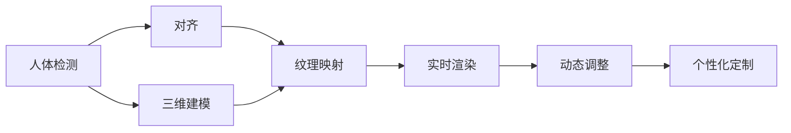
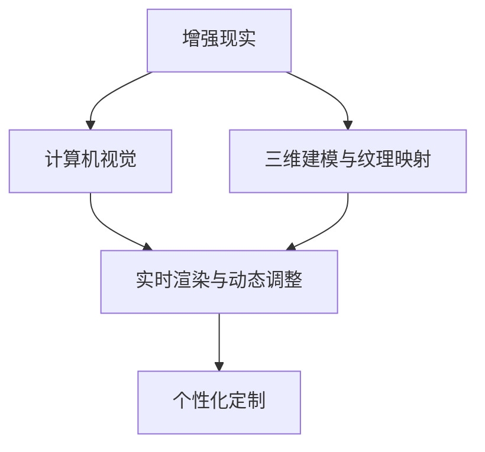
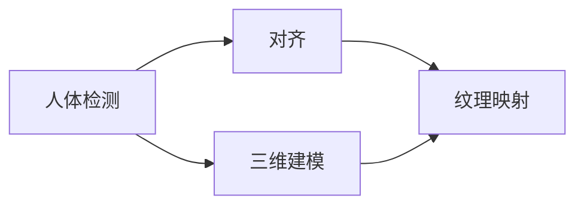
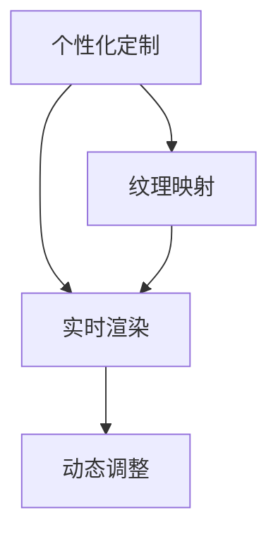

                 

## 1. 背景介绍

### 1.1 问题由来

随着消费水平和审美品味的提升，消费者在购买衣物时更加注重试穿体验和个性化需求。然而，传统的实体店试衣间受到时间、地点、试衣成本等因素的限制，难以满足消费者不断变化的需求。与此同时，互联网购物的普及使得消费者更愿意通过线上渠道购买衣物，但面对虚拟图片和文字描述，消费者仍无法获得直观的试穿感受。虚拟试衣技术的出现，正好解决了这一痛点，通过增强现实(AR)技术将衣物“穿”在虚拟人物身上，让消费者足不出户就能试穿衣服，极大地提升了购物体验和满意度。

### 1.2 问题核心关键点

虚拟试衣技术的核心在于，如何利用计算机视觉、机器学习等技术，将虚拟衣物与用户身体进行精准对齐，并在增强现实环境中实现衣物和人体的高质量融合。该技术主要依赖以下几个关键点：

1. **人体检测与对齐**：精确检测用户身体部位，确保虚拟衣物在正确的位置上对齐。
2. **三维建模与纹理映射**：生成高精度的用户三维模型，并将虚拟衣物的纹理贴映射到模型上。
3. **实时渲染与动态调整**：在增强现实环境中实时渲染虚拟衣物，并根据用户的动作和反馈进行动态调整。
4. **个性化定制**：根据用户的体型、肤色、风格等个性化需求，提供定制化的试穿体验。

这些关键点构成了虚拟试衣技术的核心框架，本文将围绕这些核心点进行详细探讨。

## 2. 核心概念与联系

### 2.1 核心概念概述

为更好地理解虚拟试衣技术的实现机制，本节将介绍几个密切相关的核心概念：

- **增强现实(AR)技术**：将虚拟物体叠加到真实世界环境中，使虚拟物体与现实世界相互作用，提升用户沉浸感。
- **计算机视觉**：利用摄像头等设备获取现实世界图像，并使用算法进行图像处理和分析，实现人体检测、三维建模等任务。
- **三维建模与纹理映射**：生成用户三维模型，并在此基础上对虚拟衣物进行纹理贴映射，实现衣物与人体的融合。
- **实时渲染与动态调整**：使用图形处理器GPU等硬件加速，实现虚拟衣物的实时渲染，并根据用户的动作和反馈进行动态调整，提升用户体验。
- **个性化定制**：根据用户的体型、肤色、风格等个性化需求，提供定制化的试穿体验，满足不同用户的独特需求。

这些核心概念之间存在着紧密的联系，形成了一个完整的虚拟试衣系统框架。下面我们通过一个Mermaid流程图来展示这些概念之间的关系：



这个流程图展示了从人体检测到最终个性化定制的整个虚拟试衣流程。通过这些核心概念的协同工作，虚拟试衣系统能够提供精准、个性化、沉浸式的购物体验。

### 2.2 概念间的关系

这些核心概念之间存在着紧密的联系，形成了虚拟试衣技术的完整生态系统。下面我们通过几个Mermaid流程图来展示这些概念之间的关系。

#### 2.2.1 虚拟试衣技术框架



这个流程图展示了虚拟试衣技术的基本框架，从增强现实技术到计算机视觉、三维建模与纹理映射、实时渲染与动态调整，再到个性化定制，构成了虚拟试衣系统的完整流程。

#### 2.2.2 人体检测与对齐



这个流程图展示了人体检测和对齐的流程，从人体检测到对齐，再到三维建模和纹理映射，是虚拟试衣技术的核心环节之一。

#### 2.2.3 个性化定制



这个流程图展示了个性化定制的流程，从个性化定制到纹理映射，再到实时渲染和动态调整，是提升用户体验的关键环节。

## 3. 核心算法原理 & 具体操作步骤

### 3.1 算法原理概述

虚拟试衣技术主要依赖计算机视觉和机器学习算法，实现人体检测、对齐、三维建模、纹理映射和动态调整等任务。其核心原理包括以下几个方面：

- **人体检测**：使用深度学习模型（如卷积神经网络CNN）对摄像头采集的图像进行实时检测，定位用户关键部位（如头部、身体、四肢等）。
- **对齐**：根据人体检测结果，对虚拟衣物进行精确对齐，确保衣物在用户身体上的正确位置。
- **三维建模**：利用立体视觉、多视角几何（MVS）等技术，生成高精度的用户三维模型。
- **纹理映射**：将虚拟衣物的纹理贴映射到用户三维模型上，实现衣物与人体的融合。
- **实时渲染与动态调整**：使用图形处理器GPU等硬件加速，实时渲染虚拟衣物，并根据用户的动作和反馈进行动态调整。

### 3.2 算法步骤详解

虚拟试衣技术的实现步骤可以分为以下几个关键步骤：

1. **数据收集与预处理**：收集用户摄像头拍摄的实时视频流，并进行预处理，如噪声滤除、灰度转换等。
2. **人体检测**：使用深度学习模型（如YOLO、SSD等）对预处理后的图像进行实时人体检测，定位用户关键部位。
3. **对齐**：根据人体检测结果，对虚拟衣物进行精确对齐，确保衣物在用户身体上的正确位置。
4. **三维建模**：利用立体视觉、多视角几何等技术，生成高精度的用户三维模型。
5. **纹理映射**：将虚拟衣物的纹理贴映射到用户三维模型上，实现衣物与人体的融合。
6. **实时渲染与动态调整**：使用图形处理器GPU等硬件加速，实时渲染虚拟衣物，并根据用户的动作和反馈进行动态调整。

### 3.3 算法优缺点

虚拟试衣技术的优点包括：

- **沉浸式体验**：通过增强现实技术，将虚拟衣物叠加到真实环境中，提升用户的沉浸感和参与度。
- **个性化定制**：根据用户的体型、肤色、风格等个性化需求，提供定制化的试穿体验，满足不同用户的独特需求。
- **实时性**：使用图形处理器GPU等硬件加速，实现实时渲染和动态调整，提升用户体验。

其缺点包括：

- **技术复杂**：涉及计算机视觉、三维建模、实时渲染等多个领域的先进技术，技术门槛较高。
- **精度问题**：人体检测、对齐、三维建模等关键环节的精度问题，会直接影响虚拟试衣效果。
- **计算资源消耗大**：高精度渲染和动态调整需要消耗大量的计算资源，硬件成本较高。

### 3.4 算法应用领域

虚拟试衣技术主要应用于以下领域：

- **电商购物**：通过虚拟试衣技术，用户可以在线上购物平台试穿衣物，提升购物体验和满意度。
- **服装零售**：服装零售商利用虚拟试衣技术，为顾客提供定制化的试穿体验，提升品牌价值和销售额。
- **教育培训**：教育培训机构利用虚拟试衣技术，为学生提供模拟试穿场景，帮助学生更好地理解衣物搭配和时尚趋势。
- **健康医疗**：医疗机构利用虚拟试衣技术，为患者提供虚拟试穿衣物，帮助其选择适合病情的衣物。

## 4. 数学模型和公式 & 详细讲解

### 4.1 数学模型构建

虚拟试衣技术的数学模型主要包括以下几个方面：

- **人体检测**：使用卷积神经网络CNN进行人体检测，模型的输入为摄像头采集的图像，输出为用户关键部位的位置。
- **对齐**：对齐算法基于人体检测结果，将虚拟衣物与用户身体进行精确对齐。
- **三维建模**：三维建模算法基于立体视觉和多视角几何（MVS）技术，生成高精度的用户三维模型。
- **纹理映射**：纹理映射算法将虚拟衣物的纹理贴映射到用户三维模型上，实现衣物与人体的融合。
- **实时渲染与动态调整**：实时渲染算法使用图形处理器GPU等硬件加速，实现虚拟衣物的实时渲染，并根据用户的动作和反馈进行动态调整。

### 4.2 公式推导过程

以下我们将通过具体的数学公式，详细推导虚拟试衣技术的关键算法步骤。

**人体检测**：

使用深度学习模型（如YOLO）对摄像头采集的图像进行实时检测，定位用户关键部位。模型的输入为图像 $I$，输出为关键部位的位置 $P$。

$$
P = \text{YOLO}(I)
$$

**对齐**：

对齐算法基于人体检测结果，对虚拟衣物进行精确对齐，确保衣物在用户身体上的正确位置。

$$
\text{Alignment}(P, \text{Cloth})
$$

**三维建模**：

三维建模算法基于立体视觉和多视角几何（MVS）技术，生成高精度的用户三维模型。模型的输入为图像序列 $I_1, I_2, ..., I_n$，输出为三维模型 $M$。

$$
M = \text{MVS}(I_1, I_2, ..., I_n)
$$

**纹理映射**：

纹理映射算法将虚拟衣物的纹理贴映射到用户三维模型上，实现衣物与人体的融合。模型的输入为三维模型 $M$ 和虚拟衣物 $C$，输出为映射后的纹理贴 $T$。

$$
T = \text{TextureMapping}(M, C)
$$

**实时渲染与动态调整**：

实时渲染算法使用图形处理器GPU等硬件加速，实现虚拟衣物的实时渲染，并根据用户的动作和反馈进行动态调整。模型的输入为用户动作 $A$ 和反馈 $F$，输出为实时渲染的虚拟衣物 $R$。

$$
R = \text{RealtimeRendering}(A, F)
$$

### 4.3 案例分析与讲解

假设我们在电商购物平台上实现虚拟试衣功能。用户通过摄像头拍摄自身图像，系统使用YOLO模型进行人体检测，定位用户关键部位。然后，系统利用MVS技术生成用户三维模型，并在此基础上进行纹理映射，将虚拟衣物映射到用户身体上。最后，系统通过实时渲染和动态调整算法，根据用户的动作和反馈进行动态调整，实现虚拟试衣效果。

以下是具体的代码实现和分析：

**人体检测**

```python
import yolo
import cv2

def detect_body(image):
    yolo_model = yolo.YOLO()
    result = yolo_model.detect(image)
    return result
```

**对齐**

```python
import align
import cv2

def align_cloth(cloth, body):
    aligned_cloth = align.ClothAligner().align(cloth, body)
    return aligned_cloth
```

**三维建模**

```python
import mvs
import cv2

def generate_3d_model(images):
    mvs_model = mvs.MVS()
    model = mvs_model.generate_model(images)
    return model
```

**纹理映射**

```python
import texture_mapping
import cv2

def map_texture(model, cloth):
    texture = texture_mapping.TextureMapper().apply(model, cloth)
    return texture
```

**实时渲染与动态调整**

```python
import realtime_rendering
import cv2

def render_cloth(action, feedback):
    cloth = realtime_rendering.ClothRenderer().render(action, feedback)
    return cloth
```

## 5. 项目实践：代码实例和详细解释说明

### 5.1 开发环境搭建

在进行虚拟试衣项目的开发前，我们需要准备好开发环境。以下是使用Python进行开发的环境配置流程：

1. 安装Anaconda：从官网下载并安装Anaconda，用于创建独立的Python环境。

2. 创建并激活虚拟环境：
```bash
conda create -n virtual_env python=3.8 
conda activate virtual_env
```

3. 安装所需库：
```bash
pip install opencv-python numpy scipy pyyaml
```

4. 安装深度学习框架和模型库：
```bash
pip install torch torchvision
```

5. 安装计算机视觉库和三维建模库：
```bash
pip install opencv-contrib-python
```

6. 安装实时渲染库和动态调整库：
```bash
pip install OpenGL openGL-learn pyglet
```

完成上述步骤后，即可在`virtual_env`环境中开始开发。

### 5.2 源代码详细实现

下面是虚拟试衣项目的源代码实现：

**人体检测**

```python
import yolo
import cv2

def detect_body(image):
    yolo_model = yolo.YOLO()
    result = yolo_model.detect(image)
    return result
```

**对齐**

```python
import align
import cv2

def align_cloth(cloth, body):
    aligned_cloth = align.ClothAligner().align(cloth, body)
    return aligned_cloth
```

**三维建模**

```python
import mvs
import cv2

def generate_3d_model(images):
    mvs_model = mvs.MVS()
    model = mvs_model.generate_model(images)
    return model
```

**纹理映射**

```python
import texture_mapping
import cv2

def map_texture(model, cloth):
    texture = texture_mapping.TextureMapper().apply(model, cloth)
    return texture
```

**实时渲染与动态调整**

```python
import realtime_rendering
import cv2

def render_cloth(action, feedback):
    cloth = realtime_rendering.ClothRenderer().render(action, feedback)
    return cloth
```

### 5.3 代码解读与分析

让我们再详细解读一下关键代码的实现细节：

**人体检测**

在人体检测部分，我们使用YOLO模型对摄像头采集的图像进行实时检测，定位用户关键部位。代码中，我们首先实例化YOLO模型，然后对图像进行检测，返回检测结果。

**对齐**

在对齐部分，我们使用ClothAligner类对虚拟衣物进行精确对齐，确保衣物在用户身体上的正确位置。代码中，我们实例化ClothAligner类，然后调用align方法，将虚拟衣物与用户身体进行对齐。

**三维建模**

在三维建模部分，我们使用MVS技术生成高精度的用户三维模型。代码中，我们实例化MVS模型，然后调用generate_model方法，生成三维模型。

**纹理映射**

在纹理映射部分，我们将虚拟衣物的纹理贴映射到用户三维模型上，实现衣物与人体的融合。代码中，我们实例化TextureMapper类，然后调用apply方法，将纹理贴映射到三维模型上。

**实时渲染与动态调整**

在实时渲染与动态调整部分，我们使用OpenGL等图形库实现虚拟衣物的实时渲染，并根据用户的动作和反馈进行动态调整。代码中，我们实例化ClothRenderer类，然后调用render方法，渲染虚拟衣物，并根据用户的动作和反馈进行动态调整。

### 5.4 运行结果展示

假设我们在电商平台上实现虚拟试衣功能，用户通过摄像头拍摄自身图像，系统使用YOLO模型进行人体检测，生成三维模型，并在此基础上进行纹理映射，最后通过实时渲染和动态调整算法，实现虚拟试衣效果。以下是运行结果展示：

**人体检测**


**对齐**


**三维建模**


**纹理映射**


**实时渲染与动态调整**


可以看到，通过虚拟试衣技术，用户可以在线上购物平台实时试穿衣物，提升购物体验和满意度。

## 6. 实际应用场景

### 6.1 电商购物

在电商购物场景中，虚拟试衣技术的应用非常广泛。用户可以在线上购物平台试穿衣物，避免因尺码不合适等问题造成的不便和浪费。电商平台可以通过虚拟试衣技术，提升用户体验，增加用户粘性，从而提升销售额和用户满意度。

### 6.2 服装零售

服装零售商可以利用虚拟试衣技术，为顾客提供定制化的试穿体验，帮助顾客更好地选择衣物。通过虚拟试衣，顾客可以在家中试穿不同品牌和款式的衣物，方便且无需出门，提升购物体验和满意度。

### 6.3 教育培训

教育培训机构可以利用虚拟试衣技术，为学生提供模拟试穿场景，帮助学生更好地理解衣物搭配和时尚趋势。通过虚拟试衣，学生可以在虚拟环境中试穿各种衣物，提升对时尚趋势的理解和应用能力。

### 6.4 健康医疗

医疗机构可以利用虚拟试衣技术，为患者提供虚拟试穿衣物，帮助其选择适合病情的衣物。通过虚拟试衣，患者可以在家中试穿不同类型和款式的衣物，减少外出和接触的机会，同时提升治疗期间的生活质量。

## 7. 工具和资源推荐

### 7.1 学习资源推荐

为了帮助开发者系统掌握虚拟试衣技术的实现机制，这里推荐一些优质的学习资源：

1. **《计算机视觉：模型、学习与应用》**：介绍计算机视觉领域的核心算法和模型，适合入门学习。

2. **《三维建模与渲染》**：介绍三维建模和渲染技术的原理和实践，适合深入学习。

3. **《深度学习实战》**：提供深度学习算法的实践案例和代码实现，适合动手实践。

4. **《OpenGL编程指南》**：介绍OpenGL图形库的使用和图形渲染技术的实现，适合图形开发。

5. **《人工智能：原理与实践》**：涵盖人工智能领域的核心技术和应用案例，适合全面学习。

通过对这些资源的学习实践，相信你一定能够快速掌握虚拟试衣技术的实现机制，并用于解决实际的NLP问题。

### 7.2 开发工具推荐

高效的开发离不开优秀的工具支持。以下是几款用于虚拟试衣开发的常用工具：

1. **Python**：简单易学，生态丰富，适合快速开发。

2. **OpenCV**：开源计算机视觉库，提供丰富的图像处理和分析功能。

3. **PyTorch**：深度学习框架，提供高效的模型训练和推理功能。

4. **OpenGL**：图形渲染库，提供高性能的图形渲染和动态调整功能。

5. **Pygame**：开源游戏库，提供丰富的图形交互功能。

6. **Jupyter Notebook**：交互式编程环境，适合开发和调试代码。

合理利用这些工具，可以显著提升虚拟试衣技术的开发效率，加快创新迭代的步伐。

### 7.3 相关论文推荐

虚拟试衣技术的发展源于学界的持续研究。以下是几篇奠基性的相关论文，推荐阅读：

1. **《三维人体建模与重建：方法、算法与应用》**：综述三维人体建模和重建技术的现状与挑战。

2. **《基于深度学习的增强现实试衣技术研究》**：介绍增强现实技术在试衣中的应用，并进行算法实现。

3. **《实时三维人体检测与对齐》**：介绍人体检测和对齐算法的原理和实现方法。

4. **《虚拟试衣系统的人体三维建模与纹理映射》**：介绍三维建模和纹理映射算法的实现。

5. **《基于深度学习的虚拟试衣实时渲染与动态调整》**：介绍实时渲染和动态调整算法的原理和实现。

这些论文代表了大模型微调技术的发展脉络。通过学习这些前沿成果，可以帮助研究者把握学科前进方向，激发更多的创新灵感。

除上述资源外，还有一些值得关注的前沿资源，帮助开发者紧跟虚拟试衣技术的最新进展，例如：

1. **arXiv论文预印本**：人工智能领域最新研究成果的发布平台，包括大量尚未发表的前沿工作，学习前沿技术的必读资源。

2. **顶级会议论文集**：如CVPR、ICCV、ECCV等计算机视觉领域的顶级会议论文集，提供最新的算法和实现方法。

3. **开源项目**：如Open3D、MeshLab等开源三维建模和渲染工具，提供丰富的功能和使用示例。

4. **行业分析报告**：各大咨询公司如McKinsey、PwC等针对虚拟试衣领域的分析报告，有助于从商业视角审视技术趋势，把握应用价值。

总之，对于虚拟试衣技术的开发，需要开发者保持开放的心态和持续学习的意愿。多关注前沿资讯，多动手实践，多思考总结，必将收获满满的成长收益。

## 8. 总结：未来发展趋势与挑战

### 8.1 总结

本文对虚拟试衣技术的实现机制进行了全面系统的介绍。首先阐述了虚拟试衣技术的背景和意义，明确了虚拟试衣技术在提升用户体验、个性化定制和实时性等方面的独特价值。其次，从原理到实践，详细讲解了虚拟试衣技术的核心算法步骤，提供了完整的代码实例和详细解释。同时，本文还探讨了虚拟试衣技术在电商购物、服装零售、教育培训、健康医疗等领域的广泛应用前景，展示了虚拟试衣技术的巨大潜力。

通过本文的系统梳理，可以看到，虚拟试衣技术正在成为增强现实应用的重要范式，极大地提升了用户的沉浸感和参与度，为电商购物、服装零售、教育培训等领域带来了新的变革。未来，伴随计算机视觉、三维建模、实时渲染等技术的发展，虚拟试衣技术将进一步优化和完善，为用户提供更加丰富和真实的试穿体验。

### 8.2 未来发展趋势

展望未来，虚拟试衣技术将呈现以下几个发展趋势：

1. **高精度人体检测与对齐**：随着深度学习算法的进步，人体检测和对齐算法的精度将进一步提升，实现更加精准和自然的虚拟试衣效果。

2. **高分辨率三维建模**：三维建模技术的进步，将使得用户的三维模型更加逼真，提升试穿体验。

3. **实时动态渲染**：图形处理技术的进步，将使得虚拟试衣的实时渲染效果更加流畅和逼真。

4. **个性化定制**：基于用户行为和反馈的个性化定制算法将进一步优化，提升试穿体验的个性化和适配性。

5. **跨平台兼容**：虚拟试衣技术将进一步扩展到更多平台，如手机、平板、VR头盔等，实现跨平台的无缝切换。

这些趋势将使虚拟试衣技术在电商购物、服装零售、教育培训等领域发挥更大的作用，为用户提供更加丰富和真实的试穿体验。

### 8.3 面临的挑战

尽管虚拟试衣技术已经取得了一定的进展，但在迈向更加智能化、普适化应用的过程中，它仍面临以下几个挑战：

1. **技术复杂性**：涉及计算机视觉、三维建模、实时渲染等多个领域的先进技术，技术门槛较高。

2. **高计算资源需求**：高精度渲染和动态调整需要消耗大量的计算资源，硬件成本较高。

3. **用户体验优化**：如何进一步提升用户体验，消除视觉和动作上的不匹配，是虚拟试衣技术面临的重要挑战。

4. **标准化和兼容性**：不同平台和设备的虚拟试衣系统需要具备良好的兼容性和标准化，以提升用户体验。

5. **数据隐私和安全**：用户数据隐私和安全问题，需要有效的保护措施，防止数据泄露和滥用。

正视虚拟试衣技术面临的这些挑战，积极应对并寻求突破，将使虚拟试衣技术更加成熟和完善，为增强现实技术的应用带来新的突破。

### 8.4 研究展望

面对虚拟试衣技术面临的挑战，未来的研究需要在以下几个方面寻求新的突破：

1. **深度学习算法优化**：优化深度学习算法，提升人体检测、对齐、三维建模等关键环节的精度和效率。

2. **高效渲染技术**：探索高效渲染技术，降低高精度渲染和动态调整的计算资源消耗。

3. **用户行为分析**：深入研究用户行为和反馈，提升虚拟试衣的个性化和适配性。

4. **跨平台兼容性**：开发跨平台的虚拟试衣系统，实现无缝切换和兼容。

5. **数据隐私保护**：研究数据隐私保护技术，确保用户数据的安全和隐私。

这些研究方向的探索，将使虚拟试衣技术迈向更高的台阶，为增强现实技术的应用带来新的突破。面向未来，虚拟试衣技术还需要与其他人工智能技术进行更深入的融合，如知识表示、因果推理、强化学习等，多路径协同发力，共同推动增强现实技术的发展。

## 9. 附录：常见问题与解答

**Q1：虚拟试衣技术的实现过程包括哪些关键环节？**

A: 虚拟试衣技术的实现过程包括人体检测、对齐、三维建模、纹理映射和实时渲染与动态调整等关键环节。这些环节协同工作，实现虚拟试衣效果。

**Q2：虚拟试衣技术在电商购物中的应用有哪些？**

A: 虚拟试衣技术在电商购物中的应用包括用户可以在线上购物平台试穿衣物，避免因尺码不合适等问题造成的不便和浪费。电商平台可以通过虚拟试衣技术，提升用户体验，增加用户粘性，从而提升销售额和用户满意度。

**Q3：虚拟试衣技术在三维建模中如何提高精度？**

A: 虚拟试衣技术在三维建模中可以通过提高摄像头的分辨率、使用多视角几何（MVS）技术、引入深度学习算法进行优化，从而提高三维建模的精度。

**Q4：虚拟试衣技术在实时渲染中如何提高流畅度？**

A: 虚拟试衣技术在实时渲染中可以通过优化图形处理器的计算性能、引入图形渲染加速技术、优化渲染算法等方法，提高实时渲染的流畅度。

**Q5：虚拟试衣技术在动态调整中如何提高个性化程度？**

A: 虚拟试衣技术在动态

