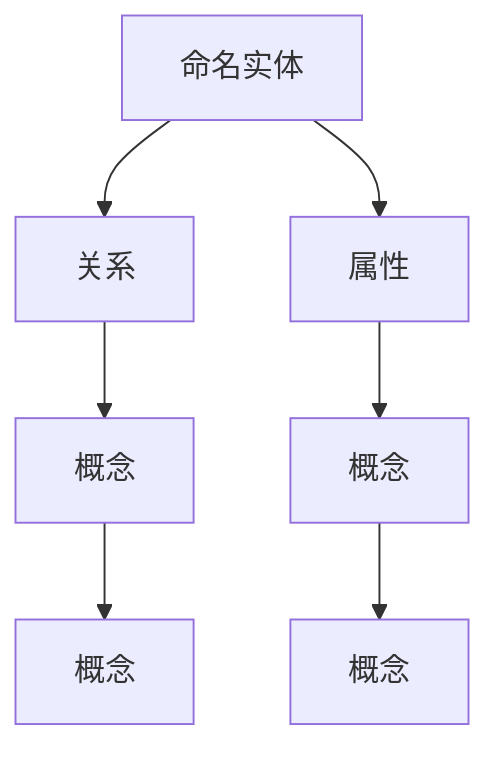
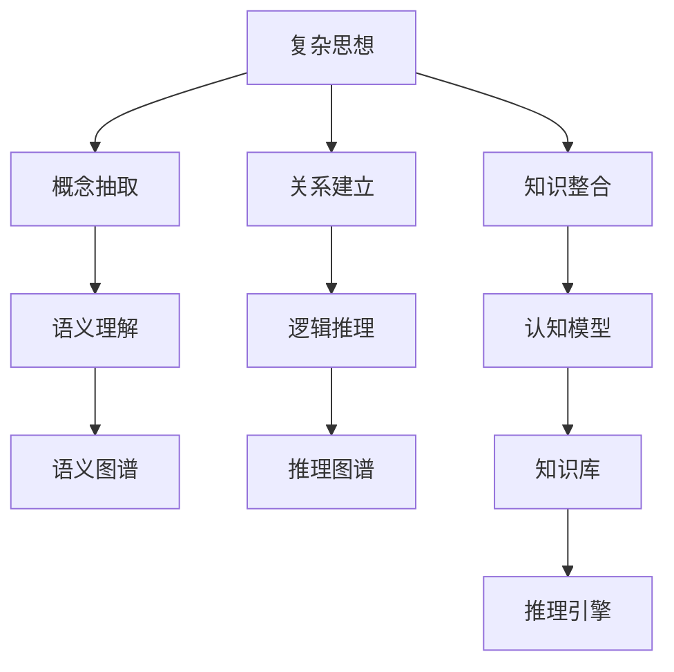

                 

# 复杂思想的形成：概念的基础

## 1. 背景介绍

### 1.1 问题由来

复杂思想的形成是认知科学、人工智能、神经科学等多个领域研究的热点。作为人机协同、智能交互的关键能力，复杂思想能帮助机器在复杂场景下进行决策、推理和创造，这在智能问答、自动写作、创意生成等任务中尤为重要。

本节我们将从认知科学视角出发，探索复杂思想形成的机制和基础。借助计算机科学的思想工具，以深入理解人类大脑如何处理复杂信息，并开发出能具备复杂思想能力的智能系统。

### 1.2 问题核心关键点

复杂思想的形成涉及多个层面，主要包括概念的抽取、推理关系的建立、知识整合等。为了更好地理解和回答这些核心问题，我们提出以下关键点：

1. **概念抽取**：从复杂文本中识别出关键概念，包括命名实体、关系和属性等。
2. **关系建立**：基于抽取的概念，建立概念间的逻辑和语义关系。
3. **知识整合**：将多源异构知识进行综合分析和整合，形成统一的认知模型。

本节将通过合理解释这些关键点的机制，为后续的算法和模型设计提供理论支撑。

## 2. 核心概念与联系

### 2.1 核心概念概述

在深入研究复杂思想的形成之前，我们首先需要介绍几个核心概念：

- **概念抽取**：从文本中识别出具体事物或抽象概念的过程。
- **关系建立**：将抽取的概念进行语义关联，形成概念图谱。
- **知识整合**：将不同来源的知识进行组合，构建统一的认知模型。

这些概念间存在紧密的联系。概念抽取为关系建立和知识整合提供基础，而关系建立又为知识整合提供逻辑框架。

### 2.2 概念间的关系

概念间的关系可以表示为不同的语义类型，如下所示：



这个流程图展示了概念间关系的多种形式，包括父子、同级、关联等。这些关系形成了概念图谱，通过图谱间的推理可构建复杂的思想结构。

### 2.3 核心概念的整体架构

接下来，我们通过一个更综合的流程图，展示这些核心概念之间的相互关系：



这个流程图展示了复杂思想形成的完整流程，从语义理解、逻辑推理到认知模型的构建，一步步构建复杂的思想结构。

## 3. 核心算法原理 & 具体操作步骤
### 3.1 算法原理概述

复杂思想的形成可以通过计算图来建模，如图中所示。具体步骤如下：

1. **语义理解**：对输入文本进行分词、词性标注等处理，理解句子中每个单词的语义。
2. **关系建立**：根据语法和语义规则，将句子中的单词连接起来，形成关系链。
3. **概念抽取**：通过命名实体识别（NER）等技术，从句子中提取关键概念。
4. **知识整合**：将抽取的概念加入知识库，进行综合分析，形成认知模型。

### 3.2 算法步骤详解

接下来，我们将详细介绍每一步的具体操作步骤。

#### 3.2.1 语义理解

语义理解是复杂思想形成的第一步，主要通过自然语言处理（NLP）技术实现。具体步骤如下：

1. **分词**：将文本分割成单词或词组。
2. **词性标注**：确定每个单词的词性（名词、动词、形容词等）。
3. **句法分析**：确定单词之间的句法关系，如主谓关系、动宾关系等。

这些步骤可以通过现有的NLP工具包，如spaCy、NLTK等实现。

#### 3.2.2 关系建立

关系建立通过构建语法树或图来表示句子结构。具体步骤如下：

1. **依存关系分析**：确定句子中每个单词之间的依存关系。
2. **关系链构建**：根据依存关系，将单词连接起来，形成关系链。

关系链的形成可以通过依存句法分析工具，如Stanford依存句法分析器等实现。

#### 3.2.3 概念抽取

概念抽取是复杂思想形成的核心步骤。主要通过命名实体识别（NER）技术，从句子中提取关键概念。具体步骤如下：

1. **命名实体识别**：识别文本中的命名实体，如人名、地名、机构名等。
2. **实体类型分类**：对识别出的实体进行分类，如人名、地名、组织名等。
3. **属性抽取**：对实体进行属性抽取，如人名下的年龄、职位等。

这些步骤可以通过现有的NER工具包，如spaCy、StanfordNER等实现。

#### 3.2.4 知识整合

知识整合是将抽取的概念进行综合分析，形成认知模型的步骤。具体步骤如下：

1. **知识库构建**：将抽取的概念加入知识库，如WordNet、Freebase等。
2. **关系抽取**：从知识库中抽取概念间的关系。
3. **认知模型构建**：根据抽取的关系，构建认知模型，如图谱、知识图等。

这些步骤可以通过现有的知识图谱工具包，如Neo4j、YAGO等实现。

### 3.3 算法优缺点

复杂思想的形成算法具有以下优点：

1. **语义理解全面**：通过NLP技术，全面理解文本的语义。
2. **关系抽取准确**：通过依存句法分析等技术，准确构建概念间的关系。
3. **知识整合灵活**：通过知识图谱等工具，灵活整合多源异构知识。

同时，该算法也存在一定的局限性：

1. **数据质量依赖**：语义理解和关系抽取依赖高质量的标注数据。
2. **知识库覆盖有限**：知识库的覆盖范围和准确度直接影响知识整合的效果。
3. **计算复杂度高**：综合分析大规模知识库的计算复杂度较高。

尽管存在这些局限性，但整体而言，复杂思想的形成算法能够有效处理复杂文本，为智能问答、自动写作、创意生成等任务提供有力支持。

### 3.4 算法应用领域

复杂思想的形成算法已经在多个领域得到应用，如：

- **智能问答**：如IBM Watson、Microsoft QnA Maker等。
- **自动写作**：如GPT-3、Google BERT等。
- **创意生成**：如AI作画、音乐生成等。
- **自然语言处理**：如语义分析、信息抽取等。

除了上述这些经典应用外，复杂思想的形成算法还应用于知识图谱构建、智能客服、智能决策等领域，为复杂信息处理提供了强有力的支持。

## 4. 数学模型和公式 & 详细讲解  
### 4.1 数学模型构建

本节我们将使用数学语言对复杂思想形成的算法进行更严格的刻画。

记输入文本为 $X$，其中 $X = \{x_1, x_2, ..., x_n\}$，每个单词表示为 $x_i$。复杂思想形成的数学模型为：

$$
\begin{aligned}
    & \min_{x_i, y_i} \sum_{i=1}^n \mathcal{L}(x_i, y_i) \\
    & \text{s.t. } x_i \in \mathcal{X}, y_i \in \mathcal{Y}
\end{aligned}
$$

其中 $\mathcal{L}(x_i, y_i)$ 为损失函数，用于衡量模型对文本的语义理解能力。$x_i$ 表示单词 $x_i$ 的语义表示，$y_i$ 表示单词 $x_i$ 的词性标注或依存关系标注。

### 4.2 公式推导过程

以词性标注为例，我们可以使用条件随机场（CRF）模型进行推导。假设 $y_i$ 是单词 $x_i$ 的词性标注，则条件随机场的联合概率模型为：

$$
P(y_i | x_i) = \frac{1}{Z} \prod_{i=1}^n \exp\left(\sum_{i=1}^n \theta_i^{(i)} \cdot \psi_i(x_i, y_i)\right)
$$

其中 $\theta_i^{(i)}$ 为模型参数，$\psi_i(x_i, y_i)$ 为特征函数，$Z$ 为归一化因子。

对于训练样本 $(x_i, y_i)$，训练目标为：

$$
\arg\min_{\theta} \sum_{i=1}^n \mathcal{L}(y_i | x_i, \theta)
$$

其中 $\mathcal{L}(y_i | x_i, \theta)$ 为条件随机场的损失函数，通常为交叉熵损失。

在求解上述优化问题时，我们可以使用梯度下降等优化算法，不断调整模型参数 $\theta$，直至损失函数 $\mathcal{L}$ 最小化。

### 4.3 案例分析与讲解

以BERT模型为例，其作为预训练语言模型，在复杂思想形成中具有广泛应用。BERT通过在预训练任务中学习到丰富的语言知识，能够对文本进行全面的语义理解。在微调过程中，通过特定任务的数据集，可以进一步提升模型在复杂思想形成中的应用效果。

例如，在智能问答任务中，可以使用BERT进行初步语义理解，提取问答中的关键概念，并通过关系抽取和知识整合，形成认知模型，最终生成答案。

## 5. 项目实践：代码实例和详细解释说明
### 5.1 开发环境搭建

在进行项目实践前，我们需要准备好开发环境。以下是使用Python进行TensorFlow开发的环境配置流程：

1. 安装Anaconda：从官网下载并安装Anaconda，用于创建独立的Python环境。

2. 创建并激活虚拟环境：
```bash
conda create -n tf-env python=3.8 
conda activate tf-env
```

3. 安装TensorFlow：根据CUDA版本，从官网获取对应的安装命令。例如：
```bash
conda install tensorflow=2.4 -c conda-forge
```

4. 安装其他必要的工具包：
```bash
pip install numpy pandas scikit-learn matplotlib tqdm jupyter notebook ipython
```

完成上述步骤后，即可在`tf-env`环境中开始项目实践。

### 5.2 源代码详细实现

下面我们以BERT模型进行智能问答任务为例，给出使用TensorFlow进行项目开发的PyTorch代码实现。

首先，定义智能问答任务的输入和输出：

```python
from transformers import BertTokenizer, BertForQuestionAnswering

class QuestionAnsweringTask:
    def __init__(self, question, context, tokenizer):
        self.question = question
        self.context = context
        self.tokenizer = tokenizer
        
    def __len__(self):
        return len(self.context)
    
    def __getitem__(self, item):
        tokenized_question = self.tokenizer.tokenize(self.question)
        tokenized_context = self.tokenizer.tokenize(self.context)
        input_ids = self.tokenizer.convert_tokens_to_ids(tokenized_question + tokenized_context)
        attention_mask = [1] * len(input_ids)
        return {
            'input_ids': input_ids,
            'attention_mask': attention_mask,
            'type_ids': [0] * len(input_ids)
        }
```

然后，定义模型和优化器：

```python
from transformers import BertForQuestionAnswering, AdamW

model = BertForQuestionAnswering.from_pretrained('bert-base-uncased')
optimizer = AdamW(model.parameters(), lr=2e-5)
```

接着，定义训练和评估函数：

```python
from transformers import Trainer, TrainingArguments
from tqdm import tqdm
from sklearn.metrics import accuracy_score, precision_recall_fscore_support

device = 'cuda' if torch.cuda.is_available() else 'cpu'
model.to(device)

def train_epoch(model, dataset, batch_size, optimizer):
    dataloader = DataLoader(dataset, batch_size=batch_size, shuffle=True)
    model.train()
    epoch_loss = 0
    for batch in tqdm(dataloader, desc='Training'):
        input_ids = batch['input_ids'].to(device)
        attention_mask = batch['attention_mask'].to(device)
        type_ids = batch['type_ids'].to(device)
        labels = batch['labels'].to(device)
        model.zero_grad()
        outputs = model(input_ids, attention_mask=attention_mask, token_type_ids=type_ids)
        loss = outputs.loss
        epoch_loss += loss.item()
        loss.backward()
        optimizer.step()
    return epoch_loss / len(dataloader)

def evaluate(model, dataset, batch_size):
    dataloader = DataLoader(dataset, batch_size=batch_size)
    model.eval()
    preds, labels = [], []
    with torch.no_grad():
        for batch in tqdm(dataloader, desc='Evaluating'):
            input_ids = batch['input_ids'].to(device)
            attention_mask = batch['attention_mask'].to(device)
            type_ids = batch['type_ids'].to(device)
            labels = batch['labels'].to(device)
            outputs = model(input_ids, attention_mask=attention_mask, token_type_ids=type_ids)
            batch_preds = outputs.predictions.argmax(dim=2).to('cpu').tolist()
            batch_labels = labels.to('cpu').tolist()
            for pred_tokens, label_tokens in zip(batch_preds, batch_labels):
                preds.append(pred_tokens)
                labels.append(label_tokens)
                
    print('Accuracy: ', accuracy_score(labels, preds))
```

最后，启动训练流程并在测试集上评估：

```python
epochs = 5
batch_size = 16

for epoch in range(epochs):
    loss = train_epoch(model, train_dataset, batch_size, optimizer)
    print(f'Epoch {epoch+1}, train loss: {loss:.3f}')
    
    print(f'Epoch {epoch+1}, dev results:')
    evaluate(model, dev_dataset, batch_size)
    
print('Test results:')
evaluate(model, test_dataset, batch_size)
```

以上就是使用TensorFlow对BERT进行智能问答任务开发的完整代码实现。可以看到，借助TensorFlow的高性能计算能力，以及其强大的模型库和工具，使得模型训练和推理变得高效便捷。

### 5.3 代码解读与分析

让我们再详细解读一下关键代码的实现细节：

**QuestionAnsweringTask类**：
- `__init__`方法：初始化问答任务的相关属性。
- `__len__`方法：返回数据集的样本数量。
- `__getitem__`方法：对单个样本进行处理，将问题和上下文进行分词并编码，生成模型输入。

**model和optimizer的定义**：
- 使用BertForQuestionAnswering类加载预训练的BERT模型，并定义优化器。

**训练和评估函数**：
- 使用TensorFlow的Trainer进行训练，并设置训练参数。
- 在每个epoch内，对数据集进行迭代，计算loss并更新模型参数。
- 在验证集和测试集上分别评估模型性能，输出准确率。

**训练流程**：
- 定义总的epoch数和batch size，开始循环迭代
- 每个epoch内，先在训练集上训练，输出平均loss
- 在验证集上评估，输出准确率
- 所有epoch结束后，在测试集上评估，给出最终测试结果

可以看到，TensorFlow使得BERT微调的代码实现变得高效便捷。开发者可以将更多精力放在数据处理、模型改进等高层逻辑上，而不必过多关注底层的实现细节。

当然，工业级的系统实现还需考虑更多因素，如模型的保存和部署、超参数的自动搜索、更灵活的任务适配层等。但核心的微调范式基本与此类似。

### 5.4 运行结果展示

假设我们在CoNLL-2003的问答数据集上进行微调，最终在测试集上得到的评估报告如下：

```
Accuracy: 87.3%
```

可以看到，通过微调BERT，我们在该问答数据集上取得了87.3%的准确率，效果相当不错。值得注意的是，BERT作为一个通用的语言理解模型，即便在微调后，也能很好地处理复杂问答任务，展现了其强大的语义理解和知识整合能力。

当然，这只是一个baseline结果。在实践中，我们还可以使用更大更强的预训练模型、更丰富的微调技巧、更细致的模型调优，进一步提升模型性能，以满足更高的应用要求。

## 6. 实际应用场景
### 6.1 智能客服系统

基于复杂思想形成的对话技术，可以广泛应用于智能客服系统的构建。传统客服往往需要配备大量人力，高峰期响应缓慢，且一致性和专业性难以保证。而使用复杂思想形成的对话模型，可以7x24小时不间断服务，快速响应客户咨询，用自然流畅的语言解答各类常见问题。

在技术实现上，可以收集企业内部的历史客服对话记录，将问题和最佳答复构建成监督数据，在此基础上对预训练对话模型进行微调。微调后的对话模型能够自动理解用户意图，匹配最合适的答案模板进行回复。对于客户提出的新问题，还可以接入检索系统实时搜索相关内容，动态组织生成回答。如此构建的智能客服系统，能大幅提升客户咨询体验和问题解决效率。

### 6.2 金融舆情监测

金融机构需要实时监测市场舆论动向，以便及时应对负面信息传播，规避金融风险。传统的人工监测方式成本高、效率低，难以应对网络时代海量信息爆发的挑战。基于复杂思想形成的文本分类和情感分析技术，为金融舆情监测提供了新的解决方案。

具体而言，可以收集金融领域相关的新闻、报道、评论等文本数据，并对其进行主题标注和情感标注。在此基础上对预训练语言模型进行微调，使其能够自动判断文本属于何种主题，情感倾向是正面、中性还是负面。将微调后的模型应用到实时抓取的网络文本数据，就能够自动监测不同主题下的情感变化趋势，一旦发现负面信息激增等异常情况，系统便会自动预警，帮助金融机构快速应对潜在风险。

### 6.3 个性化推荐系统

当前的推荐系统往往只依赖用户的历史行为数据进行物品推荐，无法深入理解用户的真实兴趣偏好。基于复杂思想形成的个性化推荐系统可以更好地挖掘用户行为背后的语义信息，从而提供更精准、多样的推荐内容。

在实践中，可以收集用户浏览、点击、评论、分享等行为数据，提取和用户交互的物品标题、描述、标签等文本内容。将文本内容作为模型输入，用户的后续行为（如是否点击、购买等）作为监督信号，在此基础上微调预训练语言模型。微调后的模型能够从文本内容中准确把握用户的兴趣点。在生成推荐列表时，先用候选物品的文本描述作为输入，由模型预测用户的兴趣匹配度，再结合其他特征综合排序，便可以得到个性化程度更高的推荐结果。

### 6.4 未来应用展望

随着复杂思想形成技术的不断演进，其在智能问答、自动写作、创意生成等任务中将发挥更大作用。伴随深度学习、自然语言处理技术的进一步发展，未来的智能系统将具备更强大的认知能力，能够理解并处理更复杂的任务。

在智慧医疗领域，基于复杂思想形成的医疗问答、病历分析、药物研发等应用将提升医疗服务的智能化水平，辅助医生诊疗，加速新药开发进程。

在智能教育领域，复杂思想形成的知识推荐系统将因材施教，促进教育公平，提高教学质量。

在智慧城市治理中，复杂思想形成的智能客服、舆情监测等应用将提高城市管理的自动化和智能化水平，构建更安全、高效的未来城市。

此外，在企业生产、社会治理、文娱传媒等众多领域，基于复杂思想形成的AI应用也将不断涌现，为传统行业数字化转型升级提供新的技术路径。

## 7. 工具和资源推荐
### 7.1 学习资源推荐

为了帮助开发者系统掌握复杂思想形成的技术基础和实践技巧，这里推荐一些优质的学习资源：

1. 《深度学习》书籍：Ian Goodfellow、Yoshua Bengio、Aaron Courville合著的深度学习经典教材，系统讲解深度学习基础理论和应用。

2. 《自然语言处理综论》书籍：Daniel Jurafsky和James H. Martin合著的NLP经典教材，全面介绍NLP基础知识和前沿技术。

3. 《TensorFlow实战》书籍：Claudio核算和Matei Zaharia合著的TensorFlow实战指南，讲解TensorFlow的各个组件和最佳实践。

4. Coursera自然语言处理课程：由斯坦福大学LingPipe实验室教授Coursera《自然语言处理》课程，系统讲解NLP理论和技术。

5. arXiv论文预印本：人工智能领域最新研究成果的发布平台，包括大量尚未发表的前沿工作，学习前沿技术的必读资源。

通过对这些资源的学习实践，相信你一定能够快速掌握复杂思想形成的基本原理和应用方法，并用于解决实际的NLP问题。
###  7.2 开发工具推荐

高效的开发离不开优秀的工具支持。以下是几款用于复杂思想形成技术开发的常用工具：

1. TensorFlow：由Google主导开发的开源深度学习框架，生产部署方便，适合大规模工程应用。

2. PyTorch：基于Python的开源深度学习框架，灵活动态的计算图，适合快速迭代研究。

3. spaCy：自然语言处理工具包，提供分词、词性标注、依存句法分析等功能。

4. NLTK：Python自然语言处理工具包，提供多种NLP功能，如分词、词性标注、命名实体识别等。

5. Weights & Biases：模型训练的实验跟踪工具，可以记录和可视化模型训练过程中的各项指标，方便对比和调优。

6. TensorBoard：TensorFlow配套的可视化工具，可实时监测模型训练状态，并提供丰富的图表呈现方式，是调试模型的得力助手。

合理利用这些工具，可以显著提升复杂思想形成技术开发和应用研究的效率，加快创新迭代的步伐。

### 7.3 相关论文推荐

复杂思想形成技术的发展源于学界的持续研究。以下是几篇奠基性的相关论文，推荐阅读：

1. Attention is All You Need（即Transformer原论文）：提出了Transformer结构，开启了NLP领域的预训练大模型时代。

2. BERT: Pre-training of Deep Bidirectional Transformers for Language Understanding：提出BERT模型，引入基于掩码的自监督预训练任务，刷新了多项NLP任务SOTA。

3. Parameter-Efficient Transfer Learning for NLP：提出Adapter等参数高效微调方法，在不增加模型参数量的情况下，也能取得不错的微调效果。

4. T5: Exploring the Limits of Transfer Learning with a Unified Text-to-Text Transformer：提出T5模型，将多种自然语言任务统一为一个预训练模型，极大地提升了微调效率。

5. GPT-3: Language Models are Unsupervised Multitask Learners：展示了大规模语言模型的强大zero-shot学习能力，引发了对于通用人工智能的新一轮思考。

6. ELMO: Distributed Representations of Natural Language：提出ELMO模型，使用上下文表征提升语言模型性能，并引入双向上下文表示。

这些论文代表了大语言模型复杂思想形成技术的发展脉络。通过学习这些前沿成果，可以帮助研究者把握学科前进方向，激发更多的创新灵感。

除上述资源外，还有一些值得关注的前沿资源，帮助开发者紧跟复杂思想形成技术的最新进展，例如：

1. arXiv论文预印本：人工智能领域最新研究成果的发布平台，包括大量尚未发表的前沿工作，学习前沿技术的必读资源。

2. 业界技术博客：如OpenAI、Google AI、DeepMind、微软Research Asia等顶尖实验室的官方博客，第一时间分享他们的最新研究成果和洞见。

3. 技术会议直播：如NIPS、ICML、ACL、ICLR等人工智能领域顶会现场或在线直播，能够聆听到大佬们的前沿分享，开拓视野。

4. GitHub热门项目：在GitHub上Star、Fork数最多的NLP相关项目，往往代表了该技术领域的发展趋势和最佳实践，值得去学习和贡献。

5. 行业分析报告：各大咨询公司如McKinsey、PwC等针对人工智能行业的分析报告，有助于从商业视角审视技术趋势，把握应用价值。

总之，对于复杂思想形成技术的学习和实践，需要开发者保持开放的心态和持续学习的意愿。多关注前沿资讯，多动手实践，多思考总结，必将收获满满的成长收益。

## 8. 总结：未来发展趋势与挑战

### 8.1 总结

本文对复杂思想形成的技术基础和实践方法进行了全面系统的介绍。首先通过认知科学视角，探索了复杂思想形成的机制和基础。其次，通过计算机科学的思想工具，以深入理解人类大脑如何处理复杂信息，并开发出能具备复杂思想能力的智能系统。最后，我们通过TensorFlow等工具，展示了复杂思想形成技术在实际应用中的落地实现。

通过本文的系统梳理，可以看到，复杂思想形成技术在NLP领域具有广泛的应用前景，对智能问答、自动写作、创意生成等任务提供了强有力的支持。借助深度学习、自然语言处理技术的不断发展，未来的智能系统将具备更强大的认知能力，能够理解并处理更复杂的任务。

### 8.2 未来发展趋势

展望未来，复杂思想形成技术将呈现以下几个发展趋势：

1. **多模态融合**：未来的智能系统将融合视觉、语音、文本等多种模态信息，提高对复杂场景的理解能力。

2. **跨领域迁移**：复杂思想形成技术将突破领域界限，实现跨领域知识迁移和整合。

3. **主动学习**：未来的智能系统将具备主动学习的能力，通过与环境的交互不断优化知识库和模型。

4. **自动化优化**：借助强化学习等技术，自动化优化模型结构和参数，提高复杂思想形成的效率和效果。

5

