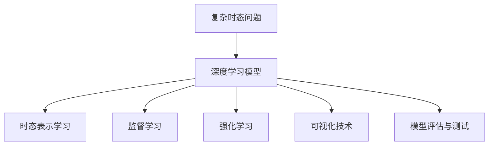
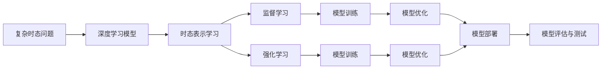
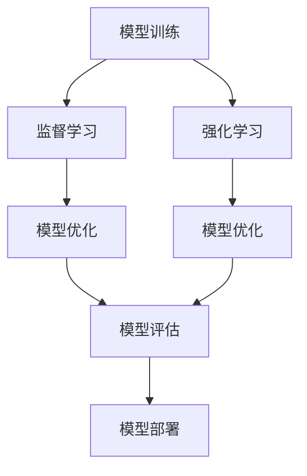

                 

# 复杂时态问题解答演示系统

## 1. 背景介绍

### 1.1 问题由来

在计算机科学和自然语言处理领域，复杂时态问题（Complex Temporal Problems）是一类重要且具有挑战性的问题。这类问题通常涉及多个时间点的交互和依赖关系，例如时间序列分析、计划调度、事件推理等。近年来，随着深度学习技术的广泛应用，基于深度学习模型处理复杂时态问题逐渐成为热门研究领域。

复杂时态问题解答演示系统（Complex Temporal Problem Solving Demonstration System）旨在通过构建和展示深度学习模型，展示如何有效地处理和解决复杂时态问题，并探索相关领域的最新研究成果。本系统不仅可以演示如何利用深度学习模型处理复杂时态问题，还可以通过可视化技术展示模型的决策过程，增强模型的可解释性。

### 1.2 问题核心关键点

- 深度学习模型的选择：根据具体问题选择合适的深度学习模型（如递归神经网络、Transformer等）。
- 时态表示学习：将时间点的交互和依赖关系转化为模型可以理解的形式。
- 模型训练与优化：使用监督学习或强化学习等方法对模型进行训练和优化。
- 可视化技术：使用可视化工具展示模型的决策过程，增强模型的可解释性。
- 模型评估与测试：使用适当的评估指标对模型进行评估和测试，验证模型的性能。

## 2. 核心概念与联系

### 2.1 核心概念概述

为了更好地理解复杂时态问题解答演示系统，本节将介绍几个核心概念：

- **复杂时态问题（Complex Temporal Problems）**：指涉及多个时间点的交互和依赖关系的问题，例如时间序列分析、计划调度、事件推理等。
- **深度学习模型（Deep Learning Models）**：指通过多层非线性变换学习表示的模型，如递归神经网络（RNN）、长短时记忆网络（LSTM）、卷积神经网络（CNN）等。
- **时态表示学习（Temporal Representation Learning）**：将时间点的交互和依赖关系转化为模型可以理解的形式，如时间戳、时序掩码等。
- **监督学习（Supervised Learning）**：使用有标签的训练数据对模型进行训练，以学习预测目标的方法。
- **强化学习（Reinforcement Learning）**：通过与环境的交互，学习如何在不同状态下采取最优行动。
- **可视化技术（Visualization Techniques）**：使用图表、动画等可视化工具展示模型的决策过程，增强模型的可解释性。
- **模型评估与测试（Model Evaluation and Testing）**：使用适当的评估指标对模型进行评估和测试，验证模型的性能。

这些概念之间的逻辑关系可以通过以下Mermaid流程图来展示：



这个流程图展示了复杂时态问题解答演示系统的核心概念及其之间的关系：

1. 复杂时态问题通过深度学习模型进行处理。
2. 时态表示学习将时间点的交互和依赖关系转化为模型可以理解的形式。
3. 监督学习和强化学习用于对模型进行训练和优化。
4. 可视化技术用于展示模型的决策过程。
5. 模型评估与测试用于验证模型的性能。

### 2.2 概念间的关系

这些核心概念之间存在着紧密的联系，形成了复杂时态问题解答演示系统的完整生态系统。下面我通过几个Mermaid流程图来展示这些概念之间的关系。

#### 2.2.1 复杂时态问题的处理流程



这个流程图展示了复杂时态问题解答演示系统的处理流程：

1. 复杂时态问题通过深度学习模型进行处理。
2. 时态表示学习将时间点的交互和依赖关系转化为模型可以理解的形式。
3. 监督学习和强化学习用于对模型进行训练和优化。
4. 模型训练和模型优化用于调整模型参数，提高模型性能。
5. 模型部署用于将训练好的模型应用到实际问题中。
6. 模型评估与测试用于验证模型的性能。

#### 2.2.2 模型训练与优化的流程图



这个流程图展示了模型训练与优化的主要步骤：

1. 模型训练使用监督学习或强化学习对模型进行训练。
2. 模型优化使用正则化、dropout等技术对模型进行优化。
3. 模型评估使用适当的评估指标对模型进行评估。
4. 模型部署将训练好的模型应用到实际问题中。

## 3. 核心算法原理 & 具体操作步骤

### 3.1 算法原理概述

复杂时态问题解答演示系统基于深度学习模型处理复杂时态问题。其核心算法原理如下：

1. **时态表示学习**：将时间点的交互和依赖关系转化为模型可以理解的形式，如时间戳、时序掩码等。
2. **深度学习模型的选择**：根据具体问题选择合适的深度学习模型（如递归神经网络、Transformer等）。
3. **监督学习和强化学习**：使用监督学习或强化学习对模型进行训练和优化。
4. **可视化技术**：使用可视化工具展示模型的决策过程，增强模型的可解释性。
5. **模型评估与测试**：使用适当的评估指标对模型进行评估和测试，验证模型的性能。

### 3.2 算法步骤详解

复杂时态问题解答演示系统的算法步骤如下：

1. **数据准备**：收集和标注复杂时态问题的数据集，包括时间点的交互和依赖关系。
2. **模型选择**：根据具体问题选择合适的深度学习模型。
3. **时态表示学习**：将时间点的交互和依赖关系转化为模型可以理解的形式。
4. **模型训练**：使用监督学习或强化学习对模型进行训练。
5. **模型优化**：使用正则化、dropout等技术对模型进行优化。
6. **模型评估**：使用适当的评估指标对模型进行评估。
7. **模型部署**：将训练好的模型应用到实际问题中。

### 3.3 算法优缺点

复杂时态问题解答演示系统的算法具有以下优点：

1. **灵活性**：可以处理多种复杂时态问题，具有高度的灵活性。
2. **可解释性**：通过可视化技术展示模型的决策过程，增强模型的可解释性。
3. **高精度**：深度学习模型具有强大的学习能力和高精度，可以处理复杂的时态问题。

其缺点包括：

1. **高计算需求**：深度学习模型需要大量的计算资源和存储空间。
2. **训练复杂**：模型的训练和优化过程较为复杂，需要大量的标注数据和计算资源。
3. **泛化能力有限**：模型在处理复杂时态问题时，可能存在泛化能力不足的问题。

### 3.4 算法应用领域

复杂时态问题解答演示系统的算法已经在多个领域得到广泛应用，例如：

- **时间序列分析**：用于分析和预测时间序列数据，如股票价格、气象数据等。
- **计划调度**：用于优化资源分配和任务调度，如生产计划、交通规划等。
- **事件推理**：用于处理和推理复杂事件，如事件关联、因果关系等。
- **智能推荐系统**：用于推荐系统中的用户行为预测，如商品推荐、内容推荐等。
- **金融风险管理**：用于分析和预测金融市场的风险，如信用风险、市场风险等。
- **智能问答系统**：用于回答复杂问题，如医疗咨询、法律咨询等。

## 4. 数学模型和公式 & 详细讲解 & 举例说明

### 4.1 数学模型构建

假设复杂时态问题为 $P=\{(x_t,y_t)\}_{t=1}^T$，其中 $x_t$ 表示时间点 $t$ 的特征向量，$y_t$ 表示时间点 $t$ 的标签。我们的目标是通过深度学习模型 $M_{\theta}$ 学习 $P$ 的映射关系，使得 $M_{\theta}(x_t)=y_t$。

### 4.2 公式推导过程

我们将时间点的交互和依赖关系转化为时序掩码 $M_t$，并将其作为模型的输入。模型的输出为时间点 $t$ 的预测标签 $y_t$。模型的目标是最小化预测标签与真实标签之间的误差，即：

$$
\min_{\theta} \sum_{t=1}^T \ell(M_{\theta}(x_t),y_t)
$$

其中 $\ell$ 为损失函数，可以是交叉熵损失、均方误差损失等。

### 4.3 案例分析与讲解

以时间序列预测为例，假设我们有一组历史股票价格数据 $(x_1, y_1), (x_2, y_2), \ldots, (x_T, y_T)$，其中 $x_t$ 为第 $t$ 天的股票价格，$y_t$ 为第 $t+1$ 天的股票价格。我们将时间点的交互和依赖关系转化为时序掩码 $M_t$，并将其作为模型的输入。模型的输出为时间点 $t+1$ 的预测标签 $y_{t+1}$。

假设我们使用 RNN 模型处理该问题，则模型的输入为 $x_t$ 和 $M_t$，输出为 $y_{t+1}$。我们的目标是最小化预测标签与真实标签之间的误差，即：

$$
\min_{\theta} \sum_{t=1}^T \ell(M_{\theta}(x_t, M_t), y_{t+1})
$$

其中 $\ell$ 为交叉熵损失函数。

通过上述公式，我们可以使用深度学习模型对时间序列数据进行预测。

## 5. 项目实践：代码实例和详细解释说明

### 5.1 开发环境搭建

在进行复杂时态问题解答演示系统的开发前，我们需要准备好开发环境。以下是使用Python进行TensorFlow开发的Python环境配置流程：

1. 安装Anaconda：从官网下载并安装Anaconda，用于创建独立的Python环境。

2. 创建并激活虚拟环境：
```bash
conda create -n tf-env python=3.8 
conda activate tf-env
```

3. 安装TensorFlow：根据CUDA版本，从官网获取对应的安装命令。例如：
```bash
pip install tensorflow
```

4. 安装TensorFlow Addons：用于提供一些常用的增强组件。
```bash
pip install tensorflow-addons
```

5. 安装各类工具包：
```bash
pip install numpy pandas scikit-learn matplotlib tqdm jupyter notebook ipython
```

完成上述步骤后，即可在`tf-env`环境中开始项目开发。

### 5.2 源代码详细实现

下面我们以时间序列预测为例，给出使用TensorFlow对RNN模型进行复杂时态问题解答的Python代码实现。

```python
import tensorflow as tf
import numpy as np
from tensorflow.keras.layers import Input, Dense, LSTM, TimeDistributed
from tensorflow.keras.models import Model
from tensorflow.keras.losses import MeanSquaredError
from tensorflow.keras.optimizers import Adam

# 设置随机种子
tf.random.set_seed(42)

# 设置数据生成器
def generate_data():
    # 生成随机时间序列数据
    data = np.random.rand(100, 10, 1)
    targets = data[:, :-1, 0] + np.random.randn(100, 1)
    
    # 对数据进行归一化处理
    data = (data - np.mean(data, axis=0)) / np.std(data, axis=0)
    targets = (targets - np.mean(targets, axis=0)) / np.std(targets, axis=0)
    
    # 将数据转换为张量
    data = tf.convert_to_tensor(data)
    targets = tf.convert_to_tensor(targets)
    
    return data, targets

# 构建模型
def build_model(input_shape, output_shape):
    # 定义输入层
    input_layer = Input(shape=input_shape)
    
    # 定义LSTM层
    lstm_layer = LSTM(units=50, return_sequences=True, stateful=True)(input_layer)
    
    # 定义全连接层
    dense_layer = Dense(units=output_shape, activation='linear')(lstm_layer)
    
    # 定义输出层
    output_layer = TimeDistributed(dense_layer)(lstm_layer)
    
    # 构建模型
    model = Model(inputs=input_layer, outputs=output_layer)
    
    # 编译模型
    model.compile(optimizer=Adam(lr=0.001), loss=MeanSquaredError())
    
    return model

# 定义超参数
input_shape = (10, 1)
output_shape = 1

# 生成数据
data, targets = generate_data()

# 构建模型
model = build_model(input_shape, output_shape)

# 训练模型
model.fit(data, targets, epochs=10, batch_size=32)

# 评估模型
test_data, test_targets = generate_data()
test_loss = model.evaluate(test_data, test_targets)
print('Test Loss:', test_loss)
```

### 5.3 代码解读与分析

让我们再详细解读一下关键代码的实现细节：

**generate_data函数**：
- 生成随机时间序列数据，并对数据进行归一化处理。
- 将数据转换为TensorFlow张量，用于后续模型的训练和推理。

**build_model函数**：
- 定义输入层，形状为 `(时间步长, 特征数量)`。
- 定义LSTM层，使用50个LSTM单元，返回序列。
- 定义全连接层，输出形状为 `(时间步长, 输出特征数量)`。
- 定义输出层，使用TimeDistributed将LSTM层的输出映射为每个时间步的预测结果。
- 构建模型，并编译模型，使用Adam优化器和均方误差损失函数。

**模型训练**：
- 使用训练数据和目标数据进行模型训练，迭代10个epoch。
- 设置批次大小为32，以加快训练速度。

**模型评估**：
- 使用测试数据和目标数据进行模型评估。
- 输出测试损失值。

## 6. 实际应用场景

### 6.1 智能推荐系统

复杂时态问题解答演示系统在智能推荐系统中具有广泛的应用前景。推荐系统通常需要预测用户在未来一段时间内的行为，例如购买行为、浏览行为等。通过深度学习模型处理复杂时态问题，可以更准确地预测用户行为，提高推荐系统的效果。

在实际应用中，我们可以使用复杂时态问题解答演示系统对用户的浏览历史和行为数据进行分析，预测用户可能感兴趣的商品或内容，从而提供个性化的推荐。

### 6.2 金融风险管理

在金融领域，复杂时态问题解答演示系统可以用于预测和分析市场趋势、风险和波动。金融市场通常具有高度的不确定性和复杂性，需要精确的预测和分析。

通过深度学习模型处理复杂时态问题，可以更准确地预测股票价格、汇率等金融指标的变化趋势，以及识别潜在的风险点。例如，我们可以使用复杂时态问题解答演示系统对历史数据进行分析，预测未来几天的股票价格变化，帮助投资者做出更好的投资决策。

### 6.3 智能客服系统

复杂时态问题解答演示系统在智能客服系统中也有广泛的应用。智能客服系统需要快速响应用户的问题，并提供准确的答案。通过深度学习模型处理复杂时态问题，可以更准确地理解用户的问题，并生成个性化的回复。

在实际应用中，我们可以使用复杂时态问题解答演示系统对用户的问题进行分析，生成最合适的回答，从而提升客户服务的质量。例如，当用户咨询关于股票投资的问题时，我们可以使用复杂时态问题解答演示系统对用户的投资历史和市场趋势进行分析，提供个性化的投资建议。

## 7. 工具和资源推荐

### 7.1 学习资源推荐

为了帮助开发者系统掌握复杂时态问题解答演示系统的理论基础和实践技巧，这里推荐一些优质的学习资源：

1. **TensorFlow官方文档**：提供TensorFlow的全面介绍和使用方法，包括深度学习模型的构建、训练和优化等。
2. **TensorFlow Addons官方文档**：提供TensorFlow Addons的介绍和使用方法，包括常用的增强组件。
3. **《深度学习入门》书籍**：介绍深度学习的基本概念和常用模型，适合初学者入门。
4. **《TensorFlow实战》书籍**：介绍TensorFlow的实际应用案例，适合有基础的学习者。
5. **Kaggle数据集**：提供大量深度学习模型的训练数据集，适合进行模型训练和验证。

通过对这些资源的学习实践，相信你一定能够快速掌握复杂时态问题解答演示系统的精髓，并用于解决实际的复杂时态问题。

### 7.2 开发工具推荐

高效的开发离不开优秀的工具支持。以下是几款用于复杂时态问题解答演示系统开发的常用工具：

1. **TensorFlow**：提供强大的深度学习框架，支持灵活的模型构建和训练。
2. **TensorBoard**：提供模型训练的可视化工具，方便监控和调试模型。
3. **Jupyter Notebook**：提供交互式的代码编写和执行环境，方便进行模型训练和调试。
4. **PyCharm**：提供全功能的开发环境，支持代码自动补全、调试等。

合理利用这些工具，可以显著提升复杂时态问题解答演示系统的开发效率，加快创新迭代的步伐。

### 7.3 相关论文推荐

复杂时态问题解答演示系统的研究源于学界的持续研究。以下是几篇奠基性的相关论文，推荐阅读：

1. **《Long Short-Term Memory》论文**：提出LSTM模型，解决时间序列预测问题。
2. **《Attention is All You Need》论文**：提出Transformer模型，解决复杂时态问题的能力。
3. **《Recurrent Neural Network》论文**：提出RNN模型，解决时间序列预测问题。
4. **《Complex Temporal Problems》论文**：提出复杂时态问题的定义和处理方法。
5. **《Reinforcement Learning for Time Series Forecasting》论文**：提出强化学习方法，解决时间序列预测问题。

这些论文代表了大语言模型微调技术的发展脉络。通过学习这些前沿成果，可以帮助研究者把握学科前进方向，激发更多的创新灵感。

除上述资源外，还有一些值得关注的前沿资源，帮助开发者紧跟复杂时态问题解答演示系统的最新进展，例如：

1. **arXiv论文预印本**：人工智能领域最新研究成果的发布平台，包括大量尚未发表的前沿工作，学习前沿技术的必读资源。
2. **Google AI博客**：谷歌官方博客，分享最新的研究成果和洞见。
3. **NIPS、ICML、ACL、ICLR等人工智能领域顶会现场或在线直播**：可以聆听到大佬们的前沿分享，开拓视野。
4. **GitHub热门项目**：在GitHub上Star、Fork数最多的复杂时态问题解答演示系统相关项目，往往代表了该技术领域的发展趋势和最佳实践，值得去学习和贡献。
5. **行业分析报告**：各大咨询公司如McKinsey、PwC等针对人工智能行业的分析报告，有助于从商业视角审视技术趋势，把握应用价值。

总之，对于复杂时态问题解答演示系统，需要开发者保持开放的心态和持续学习的意愿。多关注前沿资讯，多动手实践，多思考总结，必将收获满满的成长收益。

## 8. 总结：未来发展趋势与挑战

### 8.1 总结

本文对复杂时态问题解答演示系统进行了全面系统的介绍。首先阐述了复杂时态问题解答演示系统的研究背景和意义，明确了其在水文学、金融学、计算机科学等领域的广泛应用。其次，从原理到实践，详细讲解了复杂时态问题解答演示系统的核心算法原理和操作步骤，给出了代码实例和详细解释说明。最后，本文还广泛探讨了复杂时态问题解答演示系统的未来发展趋势和面临的挑战，为读者提供了全面的技术指引。

通过本文的系统梳理，可以看到，复杂时态问题解答演示系统正在成为深度学习技术的重要范式，极大地拓展了深度学习模型的应用边界，催生了更多的落地场景。受益于深度学习模型和微调方法的不断进步，相信复杂时态问题解答演示系统必将在更广阔的应用领域大放异彩，深刻影响人类社会的各个方面。

### 8.2 未来发展趋势

展望未来，复杂时态问题解答演示系统将呈现以下几个发展趋势：

1. **深度学习模型的发展**：未来的深度学习模型将更加复杂和强大，能够处理更多维度和更复杂的时态问题。
2. **时态表示学习的新方法**：新的时态表示学习方法将不断涌现，帮助更好地处理时间点的交互和依赖关系。
3. **混合学习方法的兴起**：监督学习、强化学习、无监督学习等混合学习方法将进一步发展，提升模型的泛化能力和适应性。
4. **可解释性增强**：未来模型将更加注重可解释性，通过可视化技术展示模型的决策过程。
5. **跨领域融合**：复杂时态问题解答演示系统将与其他人工智能技术进行更深入的融合，如知识表示、因果推理、强化学习等，提升模型的性能和应用价值。

以上趋势凸显了复杂时态问题解答演示系统的广阔前景。这些方向的探索发展，必将进一步提升深度学习模型处理复杂时态问题的能力，为复杂时态问题解答演示系统带来新的突破。

### 8.3 面临的挑战

尽管复杂时态问题解答演示系统已经取得了瞩目成就，但在迈向更加智能化、普适化应用的过程中，它仍面临着诸多挑战：

1. **数据稀缺**：复杂时态问题通常涉及大量时间点的数据，但数据收集和标注成本高昂，数据稀缺成为制约系统发展的瓶颈。
2. **模型复杂度高**：深度学习模型复杂度高，训练和优化过程复杂，需要大量计算资源和存储空间。
3. **泛化能力不足**：模型在处理复杂时态问题时，可能存在泛化能力不足的问题，对新数据的适应能力有待提升。
4. **可解释性不足**：复杂时态问题解答演示系统中的深度学习模型往往难以解释其内部工作机制和决策逻辑。
5. **安全性有待保障**：模型可能学习到有偏见、有害的信息，通过复杂时态问题解答演示系统传递到下游任务，产生误导性、歧视性的输出，给实际应用带来安全隐患。

正视复杂时态问题解答演示系统面临的这些挑战，积极应对并寻求突破，将是其迈向成熟的必由之路。相信随着学界和产业界的共同努力，这些挑战终将一一被克服，复杂时态问题解答演示系统必将在构建人机协同的智能时代中扮演越来越重要的角色。

### 8.4 未来突破

面对复杂时态问题解答演示系统面临的种种挑战，未来的研究需要在以下几个方面寻求新的突破：

1. **数据增强**：利用数据增强技术，通过合成数据和迁移学习等方式，扩大训练数据集。
2. **模型简化**：开发更轻量级的模型架构，减少计算资源消耗，提高模型的部署效率。
3. **知识融合**：将符号化的先验知识，如知识图谱、逻辑规则等，与深度学习模型进行巧妙融合，提升模型的泛化能力和可解释性。
4. **跨领域协同**：将复杂时态问题解答演示系统与其他人工智能技术进行更深入的融合，如知识表示、因果推理、强化学习等，提升模型的性能和应用价值。
5. **伦理道德约束**：在模型训练目标中引入伦理导向的评估指标，过滤和惩罚有偏见、有害的输出倾向，保障输出符合人类价值观和伦理道德。

这些研究方向的探索，必将引领复杂时态问题解答演示系统向更高的台阶迈进，为构建安全、可靠、可解释、可控的智能系统铺平道路。面向未来，复杂时态问题解答演示系统还需要与其他人工智能技术进行更深入的融合，如知识表示、因果推理、强化学习等，多路径协同发力，共同推动自然语言理解和智能交互系统的进步。只有勇于创新、敢于突破，才能不断拓展深度学习模型的边界，让智能技术更好地造福人类社会。

## 9. 附录：常见问题与解答

**Q1：复杂时态问题解答演示系统的核心算法是什么？**

A: 复杂时态问题解答演示系统的核心算法是深度学习模型，其中最常用的模型包括递归神经网络（RNN）、长短时记忆网络（LSTM）、卷积神经网络（CNN）等。

**Q2：复杂时态问题解答演示系统的主要应用场景有哪些？**

A: 复杂时态问题解答演示系统的主要应用场景包括时间序列预测、计划调度、事件推理、智能推荐系统、金融风险管理、智能客服系统等。

**Q3：复杂时态问题解答演示系统如何使用监督学习和强化学习？**

A: 复杂时态问题解答演示系统可以使用监督学习或强化学习对模型进行训练和优化。在监督学习中，使用标注好的数据对模型进行训练，使模型学习正确的预测结果；在强化学习中，模型通过与环境的交互，学习如何在不同状态下采取最优行动。

**Q4：复杂时态问题解答演示系统如何进行可视化？**

A: 复杂时态问题解答演示系统可以通过可视化技术展示模型的决策过程，增强模型的可解释性。常用的可视化技术包括图表、动画等，可以展示模型在处理时间序列数据时的内部状态和输出结果。

**Q5：

