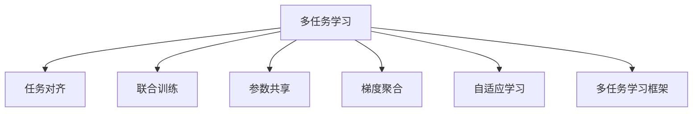
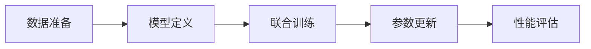
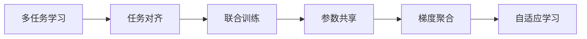
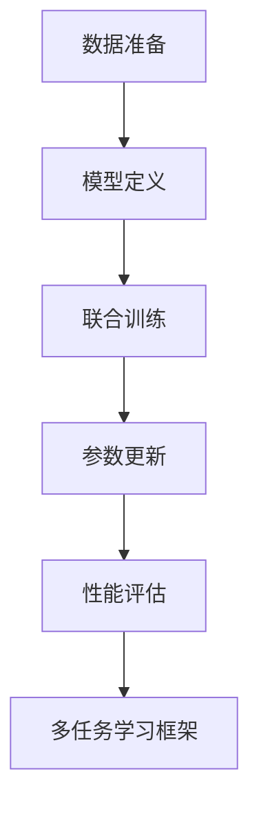

                 

# 多任务学习Multi-Task Learning原理与代码实例讲解

> 关键词：多任务学习,任务对齐,联合训练,参数共享,梯度聚合,自适应学习,多任务学习框架,源码实例

## 1. 背景介绍

### 1.1 问题由来
在当前人工智能领域，单任务学习（single-task learning）已经不再能够满足许多实际应用场景的需求。随着数据和计算资源的丰富，我们越来越希望模型能够在多个任务上同时表现良好，通过任务间的协作提高模型性能，实现“一石多鸟”的效果。这种多任务学习（multi-task learning, MTL）的思路，最早源于20世纪70年代，近年来随着深度学习的发展逐渐受到重视。

多任务学习在很多领域都有广泛的应用，包括但不限于计算机视觉、自然语言处理、语音识别、推荐系统等。其核心思想是，在训练过程中，多个任务共享模型参数，通过参数间的协作和约束，提升模型对每个任务的性能。

### 1.2 问题核心关键点
多任务学习的主要目标是在不显著增加训练复杂度的前提下，通过任务间的信息交互，实现对多个任务同时进行训练，从而提升每个任务的表现。具体而言，主要包括以下几个核心关键点：

1. **任务对齐（Task Alignment）**：不同任务之间存在一定的相关性，如何对齐这些任务，使得它们能够互相促进，而不是互相干扰，是多任务学习的难点之一。

2. **联合训练（Joint Training）**：将多个任务同时输入到模型中进行联合训练，以最大化它们共享的表示。

3. **参数共享（Parameter Sharing）**：在模型中，不同任务的参数部分共享，使得它们可以相互借鉴和学习，提高模型的泛化能力。

4. **梯度聚合（Gradient Aggregation）**：如何将不同任务的学习梯度进行合并，平衡不同任务之间的影响，也是多任务学习的重要研究内容。

5. **自适应学习（Adaptive Learning）**：在多任务学习中，模型需要根据每个任务的重要性和复杂度，动态调整参数的更新策略，避免资源浪费。

### 1.3 问题研究意义
多任务学习对人工智能的发展具有重要意义，主要体现在以下几个方面：

1. **数据效率提升**：通过任务间的信息共享，可以减少对每个任务单独训练时所需的数据量和计算资源的浪费，提高学习效率。

2. **泛化能力增强**：多任务学习可以提升模型对不同领域的适应能力，使得模型不仅在单个任务上表现优秀，还能在不同的任务场景中泛化。

3. **模型压缩**：通过参数共享和梯度聚合，可以减少模型参数数量，降低模型复杂度，使得模型更易于部署和维护。

4. **知识迁移**：多任务学习可以通过任务间的知识迁移，加速新任务的训练过程，实现快速学习和任务适应。

5. **系统鲁棒性提升**：通过在多个任务上进行联合训练，模型能够更好地应对噪声和干扰，提高系统的鲁棒性和稳定性。

## 2. 核心概念与联系

### 2.1 核心概念概述

为了更好地理解多任务学习的原理和架构，本节将介绍几个密切相关的核心概念：

- **多任务学习（Multi-Task Learning, MTL）**：在多个任务上同时训练模型，使得每个任务都能受益于其他任务的信息。

- **任务对齐（Task Alignment）**：在多任务学习中，不同任务之间存在关联，如何对齐这些任务，使得它们能够互相促进，而不是互相干扰。

- **联合训练（Joint Training）**：将多个任务同时输入到模型中进行联合训练，最大化它们共享的表示。

- **参数共享（Parameter Sharing）**：在模型中，不同任务的参数部分共享，使得它们可以相互借鉴和学习，提高模型的泛化能力。

- **梯度聚合（Gradient Aggregation）**：如何将不同任务的学习梯度进行合并，平衡不同任务之间的影响，是MTL的重要研究内容。

- **自适应学习（Adaptive Learning）**：在多任务学习中，模型需要根据每个任务的重要性和复杂度，动态调整参数的更新策略，避免资源浪费。

- **多任务学习框架（MTL Framework）**：提供了一整套工具和接口，支持多任务学习的实现，如TensorFlow的Keras MTL层、PyTorch的nn.Module、MXNet的Gluon MTL模块等。

这些核心概念之间的逻辑关系可以通过以下Mermaid流程图来展示：



这个流程图展示了多任务学习的核心概念及其之间的关系：

1. 多任务学习通过任务间的协作和约束，提升模型对每个任务的性能。
2. 任务对齐、联合训练、参数共享、梯度聚合、自适应学习等技术，共同支持多任务学习的实现。
3. 多任务学习框架为多任务学习的实现提供了基础设施和工具支持。

通过这些核心概念，我们可以更好地把握多任务学习的本质和实现方式。

### 2.2 概念间的关系

这些核心概念之间存在着紧密的联系，形成了多任务学习的完整生态系统。下面我们通过几个Mermaid流程图来展示这些概念之间的关系。

#### 2.2.1 多任务学习的主要步骤



这个流程图展示了多任务学习的主要步骤：

1. 数据准备：收集和预处理多任务的训练数据。
2. 模型定义：构建多任务学习框架下的模型，设计任务对齐和参数共享机制。
3. 联合训练：将多个任务同时输入到模型中进行联合训练。
4. 参数更新：根据梯度聚合和自适应学习策略，更新模型参数。
5. 性能评估：在验证集和测试集上评估模型性能。

#### 2.2.2 多任务学习的优化方法



这个流程图展示了多任务学习的优化方法：

1. 任务对齐：通过任务对齐技术，确保不同任务之间的相关性和一致性。
2. 联合训练：通过联合训练，最大化不同任务共享的表示。
3. 参数共享：通过参数共享，提高模型的泛化能力和稳定性。
4. 梯度聚合：通过梯度聚合，平衡不同任务之间的影响。
5. 自适应学习：通过自适应学习，动态调整模型参数的更新策略。

#### 2.2.3 多任务学习框架的实现



这个流程图展示了多任务学习框架的实现：

1. 数据准备：将多任务的训练数据加载到框架中。
2. 模型定义：使用框架提供的接口定义多任务模型。
3. 联合训练：框架自动进行联合训练，并更新模型参数。
4. 性能评估：框架自动在验证集和测试集上评估模型性能。
5. 多任务学习框架：提供了丰富的工具和接口，支持多任务学习的实现。

通过这些流程图，我们可以更清晰地理解多任务学习的实现流程和关键技术点。

## 3. 核心算法原理 & 具体操作步骤
### 3.1 算法原理概述

多任务学习的主要目标是在不显著增加训练复杂度的前提下，通过任务间的信息交互，实现对多个任务同时进行训练，从而提升每个任务的表现。其核心思想是：多个任务共享模型参数，通过参数间的协作和约束，提升模型对每个任务的性能。

形式化地，假设多任务学习模型为 $M_{\theta}$，其中 $\theta$ 为模型参数。给定 $K$ 个任务 $T_1, T_2, ..., T_K$ 的训练集 $D_1, D_2, ..., D_K$，多任务学习的目标是最小化任务间的联合损失函数：

$$
\mathcal{L}(\theta) = \frac{1}{K}\sum_{k=1}^K \mathcal{L}_k(\theta)
$$

其中 $\mathcal{L}_k(\theta)$ 为任务 $T_k$ 的损失函数，通常为交叉熵损失等。多任务学习的优化目标是：

$$
\theta^* = \mathop{\arg\min}_{\theta} \mathcal{L}(\theta)
$$

通过梯度下降等优化算法，多任务学习模型不断更新参数 $\theta$，最小化联合损失函数 $\mathcal{L}(\theta)$，使得模型输出逼近每个任务的真实标签。由于 $\theta$ 已经通过预训练获得了较好的初始化，因此即便在多个任务上进行微调，也能较快收敛到理想的模型参数 $\hat{\theta}$。

### 3.2 算法步骤详解

多任务学习一般包括以下几个关键步骤：

**Step 1: 准备多任务数据集**
- 收集多个任务的训练数据集 $D_1, D_2, ..., D_K$，每个数据集包含输入和对应的标签。
- 划分训练集、验证集和测试集，每个任务的数据集都需要分别进行划分。

**Step 2: 设计多任务模型**
- 选择合适的多任务学习框架，如TensorFlow的Keras MTL层、PyTorch的nn.Module、MXNet的Gluon MTL模块等。
- 根据任务类型，设计合适的模型结构和损失函数。

**Step 3: 定义任务对齐和参数共享策略**
- 确定任务对齐方法，如使用Softmax对齐、协变量学习(Covariate Learning)、元路径追踪(Meta Path Tracking)等。
- 确定参数共享策略，如固定部分层、共享全部分层、仅共享部分层等。

**Step 4: 设置多任务学习超参数**
- 选择合适的优化算法及其参数，如Adam、SGD等，设置学习率、批大小、迭代轮数等。
- 设置正则化技术及强度，包括权重衰减、Dropout、Early Stopping等。
- 确定冻结预训练参数的策略，如仅微调顶层，或全部参数都参与微调。

**Step 5: 执行多任务学习训练**
- 将训练集数据分批次输入模型，前向传播计算损失函数。
- 反向传播计算参数梯度，根据设定的优化算法和学习率更新模型参数。
- 周期性在验证集上评估模型性能，根据性能指标决定是否触发 Early Stopping。
- 重复上述步骤直到满足预设的迭代轮数或 Early Stopping 条件。

**Step 6: 测试和部署**
- 在测试集上评估多任务学习模型 $M_{\hat{\theta}}$ 的性能，对比多任务学习前后的精度提升。
- 使用多任务学习模型对新样本进行推理预测，集成到实际的应用系统中。
- 持续收集新的数据，定期重新训练模型，以适应数据分布的变化。

以上是多任务学习的一般流程。在实际应用中，还需要针对具体任务的特点，对多任务学习过程的各个环节进行优化设计，如改进训练目标函数，引入更多的正则化技术，搜索最优的超参数组合等，以进一步提升模型性能。

### 3.3 算法优缺点

多任务学习的主要优点包括：

1. **数据效率提升**：通过任务间的信息共享，可以减少对每个任务单独训练时所需的数据量和计算资源的浪费，提高学习效率。

2. **泛化能力增强**：多任务学习可以提升模型对不同领域的适应能力，使得模型不仅在单个任务上表现优秀，还能在不同的任务场景中泛化。

3. **模型压缩**：通过参数共享和梯度聚合，可以减少模型参数数量，降低模型复杂度，使得模型更易于部署和维护。

4. **知识迁移**：多任务学习可以通过任务间的知识迁移，加速新任务的训练过程，实现快速学习和任务适应。

5. **系统鲁棒性提升**：通过在多个任务上进行联合训练，模型能够更好地应对噪声和干扰，提高系统的鲁棒性和稳定性。

多任务学习的主要缺点包括：

1. **模型复杂性增加**：多任务学习模型的复杂性会增加，特别是当任务数量较多时，模型训练和推理的计算量也会相应增加。

2. **任务依赖性**：某些任务的复杂性和特征表达方式可能会影响其他任务的表现，如果任务之间存在较大的差异，多任务学习的效果可能并不理想。

3. **学习冲突**：不同任务间可能存在学习冲突，某些任务的损失函数可能会压制其他任务的表现，导致模型泛化能力的降低。

4. **资源分配不均**：在模型训练过程中，不同任务之间的资源分配可能不均衡，导致某些任务的表现较差。

5. **超参数调优困难**：多任务学习涉及到多个任务的超参数调优，比单任务学习更加复杂，需要更多的经验和技巧。

尽管存在这些缺点，但就目前而言，多任务学习仍是大规模数据和复杂任务场景下最有效的方法之一。未来相关研究的重点在于如何进一步降低多任务学习对数据的依赖，提高模型的少样本学习和跨领域迁移能力，同时兼顾可解释性和伦理安全性等因素。

### 3.4 算法应用领域

多任务学习在NLP领域已经得到了广泛的应用，覆盖了几乎所有常见任务，例如：

- 文本分类：如情感分析、主题分类、意图识别等。多任务学习可以同时优化模型的分类和标签预测能力。
- 命名实体识别：识别文本中的人名、地名、机构名等特定实体。多任务学习可以提升实体边界和类型的识别准确率。
- 关系抽取：从文本中抽取实体之间的语义关系。多任务学习可以同时学习实体-关系三元组。
- 问答系统：对自然语言问题给出答案。多任务学习可以优化问题-答案对的匹配能力。
- 机器翻译：将源语言文本翻译成目标语言。多任务学习可以提升语言的语义一致性和流畅度。
- 文本摘要：将长文本压缩成简短摘要。多任务学习可以优化摘要的准确性和紧凑度。
- 对话系统：使机器能够与人自然对话。多任务学习可以提升对话的系统理解和响应能力。

除了上述这些经典任务外，多任务学习还被创新性地应用到更多场景中，如可控文本生成、常识推理、代码生成、数据增强等，为NLP技术带来了全新的突破。随着多任务学习的不断发展，相信NLP技术将在更广阔的应用领域大放异彩。

## 4. 数学模型和公式 & 详细讲解 & 举例说明
### 4.1 数学模型构建

本节将使用数学语言对多任务学习的原理进行更加严格的刻画。

记多任务学习模型为 $M_{\theta}$，其中 $\theta$ 为模型参数。假设多任务学习模型包含 $K$ 个任务，每个任务的训练集为 $D_k=\{(x_k, y_k)\}_{i=1}^N, x_k \in \mathcal{X}, y_k \in \mathcal{Y}$。

定义模型 $M_{\theta}$ 在数据样本 $(x_k,y_k)$ 上的损失函数为 $\ell_k(M_{\theta}(x_k),y_k)$，则在数据集 $D_k$ 上的经验风险为：

$$
\mathcal{L}_k(\theta) = \frac{1}{N}\sum_{i=1}^N \ell_k(M_{\theta}(x_k),y_k)
$$

多任务学习的优化目标是最小化任务间的联合损失函数，即：

$$
\mathcal{L}(\theta) = \frac{1}{K}\sum_{k=1}^K \mathcal{L}_k(\theta)
$$

在实践中，我们通常使用基于梯度的优化算法（如Adam、SGD等）来近似求解上述最优化问题。设 $\eta$ 为学习率，$\lambda$ 为正则化系数，则参数的更新公式为：

$$
\theta \leftarrow \theta - \eta \nabla_{\theta}\mathcal{L}(\theta) - \eta\lambda\theta
$$

其中 $\nabla_{\theta}\mathcal{L}(\theta)$ 为联合损失函数对参数 $\theta$ 的梯度，可通过反向传播算法高效计算。

### 4.2 公式推导过程

以下我们以二分类任务为例，推导联合交叉熵损失函数及其梯度的计算公式。

假设模型 $M_{\theta}$ 在输入 $x_k$ 上的输出为 $\hat{y}_k=M_{\theta}(x_k) \in [0,1]$，表示样本属于正类的概率。真实标签 $y_k \in \{0,1\}$。则二分类交叉熵损失函数定义为：

$$
\ell_k(M_{\theta}(x_k),y_k) = -[y_k\log \hat{y}_k + (1-y_k)\log (1-\hat{y}_k)]
$$

将其代入联合损失函数公式，得：

$$
\mathcal{L}(\theta) = \frac{1}{K}\sum_{k=1}^K -\frac{1}{N}\sum_{i=1}^N [y_k\log M_{\theta}(x_k)+(1-y_k)\log(1-M_{\theta}(x_k))]
$$

根据链式法则，联合损失函数对参数 $\theta_k$ 的梯度为：

$$
\frac{\partial \mathcal{L}(\theta)}{\partial \theta_k} = -\frac{1}{K}\sum_{k=1}^K \frac{1}{N}\sum_{i=1}^N (\frac{y_k}{M_{\theta}(x_k)}-\frac{1-y_k}{1-M_{\theta}(x_k)}) \frac{\partial M_{\theta}(x_k)}{\partial \theta_k}
$$

其中 $\frac{\partial M_{\theta}(x_k)}{\partial \theta_k}$ 可进一步递归展开，利用自动微分技术完成计算。

在得到联合损失函数的梯度后，即可带入参数更新公式，完成模型的迭代优化。重复上述过程直至收敛，最终得到适应多个任务的最优模型参数 $\theta^*$。

## 5. 项目实践：代码实例和详细解释说明
### 5.1 开发环境搭建

在进行多任务学习实践前，我们需要准备好开发环境。以下是使用Python进行PyTorch开发的环境配置流程：

1. 安装Anaconda：从官网下载并安装Anaconda，用于创建独立的Python环境。

2. 创建并激活虚拟环境：
```bash
conda create -n pytorch-env python=3.8 
conda activate pytorch-env
```

3. 安装PyTorch：根据CUDA版本，从官网获取对应的安装命令。例如：
```bash
conda install pytorch torchvision torchaudio cudatoolkit=11.1 -c pytorch -c conda-forge
```

4. 安装Transformers库：
```bash
pip install transformers
```

5. 安装各类工具包：
```bash
pip install numpy pandas scikit-learn matplotlib tqdm jupyter notebook ipython
```

完成上述步骤后，即可在`pytorch-env`环境中开始多任务学习实践。

### 5.2 源代码详细实现

这里我们以多任务情感分析和命名实体识别为例，给出使用Transformers库对BERT模型进行多任务学习的PyTorch代码实现。

首先，定义数据处理函数：

```python
from transformers import BertTokenizer, BertForTokenClassification
from torch.utils.data import Dataset
import torch

class MTLDataset(Dataset):
    def __init__(self, texts, tags, tokenizer, max_len=128):
        self.texts = texts
        self.tags = tags
        self.tokenizer = tokenizer
        self.max_len = max_len
        
    def __len__(self):
        return len(self.texts)
    
    def __getitem__(self, item):
        text = self.texts[item]
        tags = self.tags[item]
        
        encoding = self.tokenizer(text, return_tensors='pt', max_length=self.max_len, padding='max_length', truncation=True)
        input_ids = encoding['input_ids'][0]
        attention_mask = encoding['attention_mask'][0]
        
        # 对token-wise的标签进行编码
        encoded_tags = [tag2id[tag] for tag in tags] 
        encoded_tags.extend([tag2id['O']] * (self.max_len - len(encoded_tags)))
        labels = torch.tensor(encoded_tags, dtype=torch.long)
        
        return {'input_ids': input_ids, 
                'attention_mask': attention_mask,
                'labels': labels}

# 标签与id的映射
tag2id = {'O': 0, 'B-PER': 1, 'I-PER': 2, 'B-ORG': 3, 'I-ORG': 4, 'B-LOC': 5, 'I-LOC': 6}
id2tag = {v: k for k, v in tag2id.items()}

# 创建dataset
tokenizer = BertTokenizer.from_pretrained('bert-base-cased')

train_dataset = MTLDataset(train_texts, train_tags, tokenizer)
dev_dataset = MTLDataset(dev_texts, dev_tags, tokenizer)
test_dataset = MTLDataset(test_texts, test_tags, tokenizer)
```

然后，定义模型和优化器：

```python
from transformers import BertForTokenClassification, AdamW

model = BertForTokenClassification.from_pretrained('bert-base-cased', num_labels=len(tag2id))

optimizer = AdamW(model.parameters(), lr=2e-5)
```

接着，定义训练和评估函数：

```python
from torch.utils.data import DataLoader
from tqdm import tqdm
from sklearn.metrics import classification_report

device = torch.device('cuda') if torch.cuda.is_available() else torch.device('cpu')
model.to(device)

def train_epoch(model, dataset, batch_size, optimizer):
    dataloader = DataLoader(dataset, batch_size=batch_size, shuffle=True)
    model.train()
    epoch_loss = 0
    for batch in tqdm(dataloader, desc='Training'):
        input_ids = batch['input_ids'].to(device)
        attention_mask = batch['attention_mask'].to(device)
        labels = batch['labels'].to(device)
        model.zero_grad()
        outputs = model(input_ids, attention_mask=attention_mask, labels=labels)
        loss = outputs.loss
        epoch_loss += loss.item()
        loss.backward()
        optimizer.step()
    return epoch_loss / len(dataloader)

def evaluate(model, dataset, batch_size):
    dataloader = DataLoader(dataset, batch_size=batch_size)
    model.eval()
    preds, labels = [], []
    with torch.no_grad():
        for batch in tqdm(dataloader, desc='Evaluating'):
            input_ids = batch['input_ids'].to(device)
            attention_mask = batch['attention_mask'].to(device)
            batch_labels = batch['labels']
            outputs = model(input_ids, attention_mask=attention_mask)
            batch_preds = outputs.logits.argmax(dim=2).to('cpu').tolist()
            batch_labels = batch_labels.to('cpu').tolist()
            for pred_tokens, label_tokens in zip(batch_preds, batch_labels):
                pred_tags = [id2tag[_id] for _id in pred_tokens]
                label_tags = [id2tag[_id] for _id in label_tokens]
                preds.append(pred_tags[:len(label_tags)])
                labels.append(label_tags)
                
    print(classification_report(labels, preds))
```

最后，启动训练流程并在测试集上评估：

```python
epochs = 5
batch_size = 16

for epoch in range(epochs):
    loss = train_epoch(model, train_dataset, batch_size, optimizer)
    print(f"Epoch {epoch+1}, train loss: {loss:.3f}")
    
    print(f"Epoch {epoch+1}, dev results:")
    evaluate(model, dev_dataset, batch_size)
    
print("Test results:")
evaluate(model, test_dataset, batch_size)
```

以上就是使用PyTorch对BERT进行多任务情感分析和命名实体识别任务的多任务学习的完整代码实现。可以看到，得益于Transformers库的强大封装，我们可以用相对简洁的代码完成BERT模型的多任务学习。

### 5.3 代码解读与分析

让我们再详细解读一下关键代码的实现细节：

**MTLDataset类**：
- `__init__`方法：初始化文本、标签、分词器等关键组件。
- `__len__`方法：返回数据集的样本数量。
- `__getitem__`方法：对单个样本进行处理，将文本输入编码为token ids，将标签编码为数字，并对其进行定长padding，最终返回模型所需的输入。

**tag2id和id2tag字典**：
- 定义了标签与数字id之间的映射关系，用于将token-wise的预测结果解码回真实的标签。

**训练和评估函数**：
- 使用PyTorch的DataLoader对数据集进行批次化加载，供模型训练和推理使用。
- 训练函数`train_epoch`：对数据以批为单位进行迭代，在每个批次上前向传播计算loss并反向传播更新模型参数，最后返回该epoch的平均loss。
- 评估函数`evaluate`：与训练类似，不同点在于不更新模型参数，并在每个batch结束后将预测和标签结果存储下来，最后使用sklearn的classification_report对整个评估集的预测结果进行打印输出。

**训练流程**：
- 定义总的epoch数和batch size，开始循环迭代
- 每个epoch内，先在训练集上训练，输出平均loss
- 在验证集上评估

