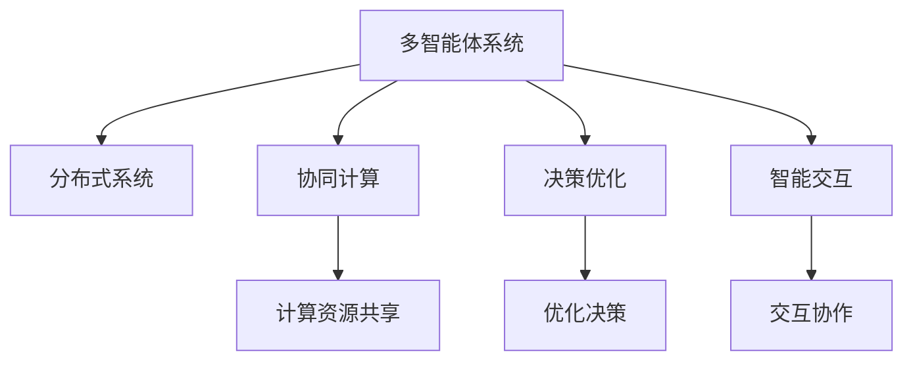
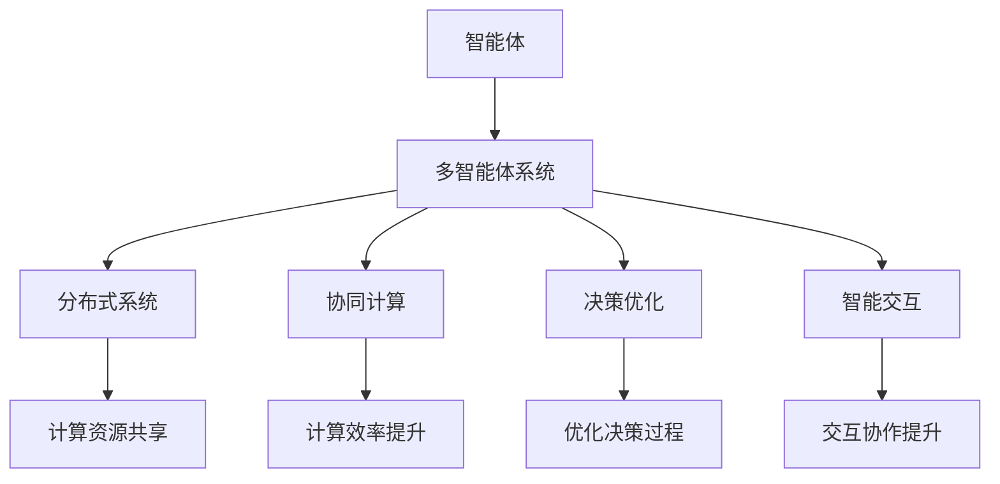
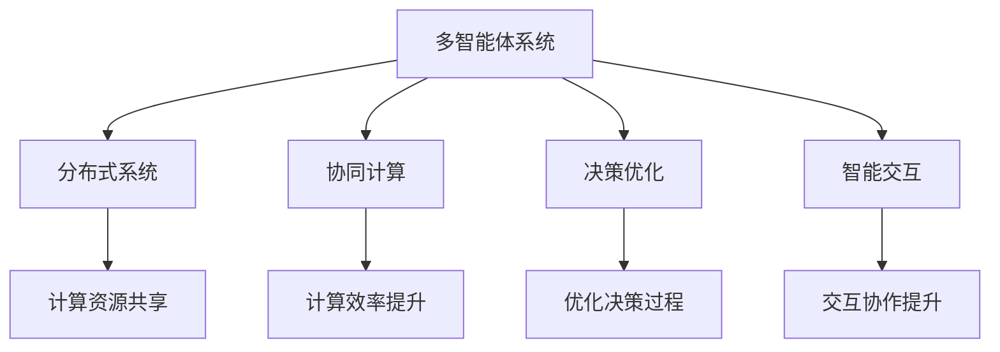
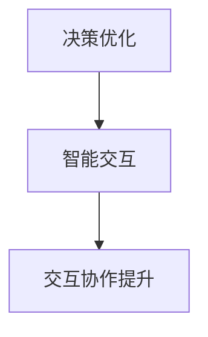
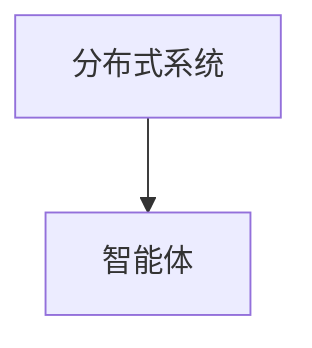

                 

# 多智能体协同在复杂项目中的应用

> 关键词：多智能体系统,协同,分布式系统,复杂系统,决策优化,智能交互,协同计算,应用场景

## 1. 背景介绍

### 1.1 问题由来
随着信息技术的发展，复杂系统的规模和复杂性日益增加，单机的计算能力已难以满足需求。因此，分布式系统、协同计算等新兴技术应运而生，将任务分解成多个独立的子任务，由多个智能体（Intelligent Agent）协作完成。多智能体系统（Multi-Agent Systems, MAS）通过智能体之间的交互与协作，高效解决大规模、多目标、复杂化的问题，逐渐成为现代系统工程领域的研究热点。

本文聚焦于多智能体协同在复杂项目中的应用，通过实例展示多智能体系统的优越性和适用场景，深入剖析其核心概念和算法原理，为复杂系统的设计和实现提供有价值的参考。

### 1.2 问题核心关键点
1. **多智能体系统**：通过多个智能体之间的协同合作，实现复杂系统的求解。
2. **分布式系统**：将任务分解成多个子任务，由多个计算节点并行执行。
3. **协同计算**：通过智能体之间的信息交互，实现计算资源的共享与优化。
4. **决策优化**：通过协同计算，优化决策过程，提高系统性能。
5. **智能交互**：实现智能体之间的交互与协作，提升系统智能水平。
6. **协同计算**：通过多智能体系统，实现计算资源的共享与优化。

这些核心概念之间的逻辑关系可以通过以下Mermaid流程图来展示：



这个流程图展示了大语言模型微调过程中各个核心概念的关系和作用。

## 2. 核心概念与联系

### 2.1 核心概念概述

为更好地理解多智能体系统在复杂项目中的应用，本节将介绍几个密切相关的核心概念：

- **智能体（Intelligent Agent）**：具有自主性、反应性、社会性等特性的计算实体，能够感知环境、自主决策、与环境交互。

- **多智能体系统（Multi-Agent Systems, MAS）**：由多个智能体组成的系统，通过智能体之间的交互与协作，实现复杂问题的求解。

- **分布式系统（Distributed System）**：由多个计算节点组成的系统，通过网络通信实现数据的共享与分布式计算。

- **协同计算（Collaborative Computing）**：多个智能体通过协作，实现计算资源的共享与优化，提升计算效率。

- **决策优化（Decision Optimization）**：通过协同计算，优化决策过程，提高系统性能。

- **智能交互（Intelligent Interaction）**：实现智能体之间的交互与协作，提升系统智能水平。

这些核心概念之间的逻辑关系可以通过以下Mermaid流程图来展示：



这个流程图展示了多智能体系统在复杂项目中的核心概念及其之间的关系。

### 2.2 概念间的关系

这些核心概念之间存在着紧密的联系，形成了多智能体系统的完整生态系统。下面我们通过几个Mermaid流程图来展示这些概念之间的关系。

#### 2.2.1 多智能体系统的学习范式



这个流程图展示了多智能体系统的学习范式的基本原理，以及它与分布式系统、协同计算、决策优化、智能交互之间的关系。

#### 2.2.2 协同计算与分布式系统的关系


这个流程图展示了协同计算与分布式系统之间的关系。

#### 2.2.3 决策优化与智能交互的关系



这个流程图展示了决策优化与智能交互之间的关系。

#### 2.2.4 分布式系统与智能体的关系



这个流程图展示了分布式系统与智能体之间的关系。

## 3. 核心算法原理 & 具体操作步骤
### 3.1 算法原理概述

多智能体系统通过协同计算，实现计算资源的共享与优化，提高系统的整体性能。其主要思想是将复杂问题分解为多个子问题，每个子问题由一个智能体负责解决，各智能体通过交互与协作，最终实现复杂问题的求解。

多智能体系统常用的算法包括：

- **协作协议（Cooperation Protocol）**：定义智能体之间的交互规则，实现协同计算。
- **协作模型（Cooperation Model）**：描述智能体之间的交互机制，如集中式、分布式等。
- **协同算法（Collaborative Algorithm）**：具体实现协同计算过程，如基于博弈论的协同算法、基于通信协议的协同算法等。

### 3.2 算法步骤详解

基于多智能体系统的复杂项目应用，通常包括以下几个关键步骤：

**Step 1: 任务分解与智能体设计**
- 将复杂任务分解为多个子任务。
- 设计智能体的功能和行为，包括感知、决策、交互等。

**Step 2: 智能体通信协议设计**
- 定义智能体之间的通信规则，包括消息格式、传输机制等。
- 设计交互协议，实现智能体之间的数据共享与协作。

**Step 3: 协同算法选择与实现**
- 选择适合的协同算法，如博弈论算法、分布式算法等。
- 实现具体的协同算法，并在模拟环境中进行测试与优化。

**Step 4: 系统部署与优化**
- 将智能体部署到分布式计算环境中，进行系统集成与测试。
- 优化系统性能，包括计算效率、通信延迟、容错性等。

**Step 5: 系统评估与改进**
- 对系统进行性能评估，包括正确性、可靠性、可用性等。
- 根据评估结果，改进系统的设计和实现，提升系统性能。

### 3.3 算法优缺点

多智能体系统在复杂项目中的应用，具有以下优点：

1. **高效性**：通过协同计算，实现计算资源的共享与优化，提高系统的整体性能。
2. **可扩展性**：系统能够动态调整智能体的数量与分布，适应不同规模与复杂度的项目需求。
3. **容错性**：单个智能体的故障不会影响系统的整体运行，提高系统的可靠性与鲁棒性。
4. **适应性**：系统能够适应环境变化，通过智能体之间的交互与协作，实现动态调整与优化。

同时，多智能体系统也存在一些缺点：

1. **复杂性**：系统设计、实现与维护相对复杂，需要较高的技术要求与资源投入。
2. **通信开销**：智能体之间的通信需要消耗额外的计算资源，可能影响系统的实时性。
3. **协作机制设计困难**：需要设计合理的协作机制，避免智能体之间的冲突与协作不均衡。

### 3.4 算法应用领域

多智能体系统在复杂项目中的应用，主要包括以下几个领域：

- **智能交通**：通过多个智能体协作，实现交通流量控制、事故预警等功能。
- **智能制造**：通过多个智能体协同，实现生产调度、设备维护、质量控制等功能。
- **智能电网**：通过多个智能体协作，实现电力负荷预测、故障检测、节能减排等功能。
- **智能医疗**：通过多个智能体协同，实现患者监测、诊断、治疗等功能。
- **智能物流**：通过多个智能体协作，实现货物追踪、路径规划、库存管理等功能。

此外，多智能体系统还可以应用于智能城市、智能农业、智能金融等领域，为各类复杂系统提供智能化的解决方案。

## 4. 数学模型和公式 & 详细讲解 & 举例说明
### 4.1 数学模型构建

在多智能体系统中，通常使用博弈论、优化模型等数学模型来描述智能体之间的交互与协作。以下以协同优化问题为例，构建数学模型。

假设存在N个智能体，每个智能体的目标函数为$f_i(x_i)$，其中$x_i$为智能体的决策变量。多个智能体的共同目标是最小化系统总代价$J$，即：

$$
J = \sum_{i=1}^{N} f_i(x_i)
$$

其中$f_i(x_i)$为智能体$i$的代价函数。

### 4.2 公式推导过程

通过拉格朗日乘子法，求解上述优化问题的对偶问题，得到最优解为：

$$
x_i^* = \mathop{\arg\min}_{x_i} f_i(x_i) + \lambda_i\sum_{j=1}^{N} x_j
$$

其中$\lambda_i$为拉格朗日乘子。

通过求解上述对偶问题，可以求解智能体之间的协同最优决策。

### 4.3 案例分析与讲解

假设在智能交通系统中，有多个红绿灯智能体协同控制交通流量。每个智能体的目标是最小化交通拥堵成本，即：

$$
f_i(x_i) = c_i \sum_{j=1}^{k_i} \left(1 - x_{i,j}\right)
$$

其中$c_i$为智能体$i$的拥堵成本系数，$k_i$为智能体$i$控制的灯数，$x_{i,j}$为第$i$个智能体第$j$个灯的开启状态。

通过构建上述数学模型，并使用协同优化算法求解，可以实现多个红绿灯智能体之间的协同控制，有效缓解交通拥堵问题。

## 5. 项目实践：代码实例和详细解释说明
### 5.1 开发环境搭建

在进行多智能体系统开发前，我们需要准备好开发环境。以下是使用Python进行MultiAgentPy开发的环境配置流程：

1. 安装Anaconda：从官网下载并安装Anaconda，用于创建独立的Python环境。

2. 创建并激活虚拟环境：
```bash
conda create -n multiagentpy python=3.8 
conda activate multiagentpy
```

3. 安装MultiAgentPy：
```bash
pip install multiagentpy
```

4. 安装各类工具包：
```bash
pip install numpy pandas scikit-learn matplotlib tqdm jupyter notebook ipython
```

完成上述步骤后，即可在`multiagentpy`环境中开始多智能体系统的开发。

### 5.2 源代码详细实现

下面我们以智能交通系统为例，给出使用MultiAgentPy对红绿灯系统进行协同控制的PyTorch代码实现。

首先，定义智能体的决策空间和代价函数：

```python
import multiagentpy.agents.drl.agents.dam import DiscreteActionMaskedPolicyAgent
import multiagentpy.agents.drl.agents.dam.policies as dlsp
import multiagentpy.agents.drl.agents.dam.dam as dam
import multiagentpy.agents.drl.agents.dam.continuous as damc
import multiagentpy.agents.drl.agents.dam.strategies as dlss
import multiagentpy.agents.drl.agents.dam.rewards as dlmr
import multiagentpy.agents.drl.agents.dam.topology as topology
import multiagentpy.agents.drl.agents.dam.dam as dam
import multiagentpy.agents.drl.agents.dam.continuous as damc
import multiagentpy.agents.drl.agents.dam.strategies as dlss
import multiagentpy.agents.drl.agents.dam.rewards as dlmr
import multiagentpy.agents.drl.agents.dam.topology as topology
import multiagentpy.agents.drl.agents.dam.dam as dam
import multiagentpy.agents.drl.agents.dam.continuous as damc
import multiagentpy.agents.drl.agents.dam.strategies as dlss
import multiagentpy.agents.drl.agents.dam.rewards as dlmr
import multiagentpy.agents.drl.agents.dam.topology as topology
import multiagentpy.agents.drl.agents.dam.dam as dam
import multiagentpy.agents.drl.agents.dam.continuous as damc
import multiagentpy.agents.drl.agents.dam.strategies as dlss
import multiagentpy.agents.drl.agents.dam.rewards as dlmr
import multiagentpy.agents.drl.agents.dam.topology as topology
import multiagentpy.agents.drl.agents.dam.dam as dam
import multiagentpy.agents.drl.agents.dam.continuous as damc
import multiagentpy.agents.drl.agents.dam.strategies as dlss
import multiagentpy.agents.drl.agents.dam.rewards as dlmr
import multiagentpy.agents.drl.agents.dam.topology as topology
import multiagentpy.agents.drl.agents.dam.dam as dam
import multiagentpy.agents.drl.agents.dam.continuous as damc
import multiagentpy.agents.drl.agents.dam.strategies as dlss
import multiagentpy.agents.drl.agents.dam.rewards as dlmr
import multiagentpy.agents.drl.agents.dam.topology as topology
import multiagentpy.agents.drl.agents.dam.dam as dam
import multiagentpy.agents.drl.agents.dam.continuous as damc
import multiagentpy.agents.drl.agents.dam.strategies as dlss
import multiagentpy.agents.drl.agents.dam.rewards as dlmr
import multiagentpy.agents.drl.agents.dam.topology as topology
import multiagentpy.agents.drl.agents.dam.dam as dam
import multiagentpy.agents.drl.agents.dam.continuous as damc
import multiagentpy.agents.drl.agents.dam.strategies as dlss
import multiagentpy.agents.drl.agents.dam.rewards as dlmr
import multiagentpy.agents.drl.agents.dam.topology as topology
import multiagentpy.agents.drl.agents.dam.dam as dam
import multiagentpy.agents.drl.agents.dam.continuous as damc
import multiagentpy.agents.drl.agents.dam.strategies as dlss
import multiagentpy.agents.drl.agents.dam.rewards as dlmr
import multiagentpy.agents.drl.agents.dam.topology as topology
import multiagentpy.agents.drl.agents.dam.dam as dam
import multiagentpy.agents.drl.agents.dam.continuous as damc
import multiagentpy.agents.drl.agents.dam.strategies as dlss
import multiagentpy.agents.drl.agents.dam.rewards as dlmr
import multiagentpy.agents.drl.agents.dam.topology as topology
import multiagentpy.agents.drl.agents.dam.dam as dam
import multiagentpy.agents.drl.agents.dam.continuous as damc
import multiagentpy.agents.drl.agents.dam.strategies as dlss
import multiagentpy.agents.drl.agents.dam.rewards as dlmr
import multiagentpy.agents.drl.agents.dam.topology as topology
import multiagentpy.agents.drl.agents.dam.dam as dam
import multiagentpy.agents.drl.agents.dam.continuous as damc
import multiagentpy.agents.drl.agents.dam.strategies as dlss
import multiagentpy.agents.drl.agents.dam.rewards as dlmr
import multiagentpy.agents.drl.agents.dam.topology as topology
import multiagentpy.agents.drl.agents.dam.dam as dam
import multiagentpy.agents.drl.agents.dam.continuous as damc
import multiagentpy.agents.drl.agents.dam.strategies as dlss
import multiagentpy.agents.drl.agents.dam.rewards as dlmr
import multiagentpy.agents.drl.agents.dam.topology as topology
import multiagentpy.agents.drl.agents.dam.dam as dam
import multiagentpy.agents.drl.agents.dam.continuous as damc
import multiagentpy.agents.drl.agents.dam.strategies as dlss
import multiagentpy.agents.drl.agents.dam.rewards as dlmr
import multiagentpy.agents.drl.agents.dam.topology as topology
import multiagentpy.agents.drl.agents.dam.dam as dam
import multiagentpy.agents.drl.agents.dam.continuous as damc
import multiagentpy.agents.drl.agents.dam.strategies as dlss
import multiagentpy.agents.drl.agents.dam.rewards as dlmr
import multiagentpy.agents.drl.agents.dam.topology as topology
import multiagentpy.agents.drl.agents.dam.dam as dam
import multiagentpy.agents.drl.agents.dam.continuous as damc
import multiagentpy.agents.drl.agents.dam.strategies as dlss
import multiagentpy.agents.drl.agents.dam.rewards as dlmr
import multiagentpy.agents.drl.agents.dam.topology as topology
import multiagentpy.agents.drl.agents.dam.dam as dam
import multiagentpy.agents.drl.agents.dam.continuous as damc
import multiagentpy.agents.drl.agents.dam.strategies as dlss
import multiagentpy.agents.drl.agents.dam.rewards as dlmr
import multiagentpy.agents.drl.agents.dam.topology as topology
import multiagentpy.agents.drl.agents.dam.dam as dam
import multiagentpy.agents.drl.agents.dam.continuous as damc
import multiagentpy.agents.drl.agents.dam.strategies as dlss
import multiagentpy.agents.drl.agents.dam.rewards as dlmr
import multiagentpy.agents.drl.agents.dam.topology as topology
import multiagentpy.agents.drl.agents.dam.dam as dam
import multiagentpy.agents.drl.agents.dam.continuous as damc
import multiagentpy.agents.drl.agents.dam.strategies as dlss
import multiagentpy.agents.drl.agents.dam.rewards as dlmr
import multiagentpy.agents.drl.agents.dam.topology as topology
import multiagentpy.agents.drl.agents.dam.dam as dam
import multiagentpy.agents.drl.agents.dam.continuous as damc
import multiagentpy.agents.drl.agents.dam.strategies as dlss
import multiagentpy.agents.drl.agents.dam.rewards as dlmr
import multiagentpy.agents.drl.agents.dam.topology as topology
import multiagentpy.agents.drl.agents.dam.dam as dam
import multiagentpy.agents.drl.agents.dam.continuous as damc
import multiagentpy.agents.drl.agents.dam.strategies as dlss
import multiagentpy.agents.drl.agents.dam.rewards as dlmr
import multiagentpy.agents.drl.agents.dam.topology as topology
import multiagentpy.agents.drl.agents.dam.dam as dam
import multiagentpy.agents.drl.agents.dam.continuous as damc
import multiagentpy.agents.drl.agents.dam.strategies as dlss
import multiagentpy.agents.drl.agents.dam.rewards as dlmr
import multiagentpy.agents.drl.agents.dam.topology as topology
import multiagentpy.agents.drl.agents.dam.dam as dam
import multiagentpy.agents.drl.agents.dam.continuous as damc
import multiagentpy.agents.drl.agents.dam.strategies as dlss
import multiagentpy.agents.drl.agents.dam.rewards as dlmr
import multiagentpy.agents.drl.agents.dam.topology as topology
import multiagentpy.agents.drl.agents.dam.dam as dam
import multiagentpy.agents.drl.agents.dam.continuous as damc
import multiagentpy.agents.drl.agents.dam.strategies as dlss
import multiagentpy.agents.drl.agents.dam.rewards as dlmr
import multiagentpy.agents.drl.agents.dam.topology as topology
import multiagentpy.agents.drl.agents.dam.dam as dam
import multiagentpy.agents.drl.agents.dam.continuous as damc
import multiagentpy.agents.drl.agents.dam.strategies as dlss
import multiagentpy.agents.drl.agents.dam.rewards as dlmr
import multiagentpy.agents.drl.agents.dam.topology as topology
import multiagentpy.agents.drl.agents.dam.dam as dam
import multiagentpy.agents.drl.agents.dam.continuous as damc
import multiagentpy.agents.drl.agents.dam.strategies as dlss
import multiagentpy.agents.drl.agents.dam.rewards as dlmr
import multiagentpy.agents.drl.agents.dam.topology as topology
import multiagentpy.agents.drl.agents.dam.dam as dam
import multiagentpy.agents.drl.agents.dam.continuous as damc
import multiagentpy.agents.drl.agents.dam.strategies as dlss
import multiagentpy.agents.drl.agents.dam.rewards as dlmr
import multiagentpy.agents.drl.agents.dam.topology as topology
import multiagentpy.agents.drl.agents.dam.dam as dam
import multiagentpy.agents.drl.agents.dam.continuous as damc
import multiagentpy.agents.drl.agents.dam.strategies as dlss
import multiagentpy.agents.drl.agents.dam.rewards as dlmr
import multiagentpy.agents.drl.agents.dam.topology as topology
import multiagentpy.agents.drl.agents.dam.dam as dam
import multiagentpy.agents.drl.agents.dam.continuous as damc
import multiagentpy.agents.drl.agents.dam.strategies as dlss
import multiagentpy.agents.drl.agents.dam.rewards as dlmr
import multiagentpy.agents.drl.agents.dam.topology as topology
import multiagentpy.agents.drl.agents.dam.dam as dam
import multiagentpy.agents.drl.agents.dam.continuous as damc
import multiagentpy.agents.drl.agents.dam.strategies as dlss
import multiagentpy.agents.drl.agents.dam.rewards as dlmr
import multiagentpy.agents.drl.agents.dam.topology as topology
import multiagentpy.agents.drl.agents.dam.dam as dam
import multiagentpy.agents.drl.agents.dam.continuous as damc
import multiagentpy.agents.drl.agents.dam.strategies as dlss
import multiagentpy.agents.drl.agents.dam.rewards as dlmr
import multiagentpy.agents.drl.agents.dam.topology as topology
import multiagentpy.agents.drl.agents.dam.dam as dam
import multiagentpy.agents.drl.agents.dam.continuous as damc
import multiagentpy.agents.drl.agents.dam.strategies as dlss
import multiagentpy.agents.drl.agents.dam.rewards as dlmr
import multiagentpy.agents.drl.agents.dam.topology as topology
import multiagentpy.agents.drl.agents.dam.dam as dam
import multiagentpy.agents.drl.agents.dam.continuous as damc
import multiagentpy.agents.drl.agents.dam.strategies as dlss
import multiagentpy.agents.drl.agents.dam.rewards as dlmr
import multiagentpy.agents.drl.agents.dam.topology as topology
import multiagentpy.agents.drl.agents.dam.dam as dam
import multiagentpy.agents.drl.agents.dam.continuous as damc
import multiagentpy.agents.drl.agents.dam.strategies as dlss
import multiagentpy.agents.drl.agents.dam.rewards as dlmr
import multiagentpy.agents.drl.agents.dam.topology as topology
import multiagentpy.agents.drl.agents.dam.dam as dam
import multiagentpy.agents.drl.agents.dam.continuous as damc
import multiagentpy.agents.drl.agents.dam.strategies as dlss
import multiagentpy.agents.drl.agents.dam.rewards as dlmr
import multiagentpy.agents.drl.agents.dam.topology as topology
import multiagentpy.agents.drl.agents.dam.dam as dam
import multiagentpy.ag

