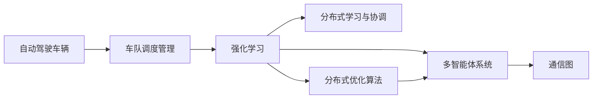

                 

# 多智能体强化学习实现高效自动驾驶车队调度管理

## 1. 背景介绍

### 1.1 问题由来

随着自动驾驶技术的迅速发展，自动驾驶车队（Fleet）在交通管理、货物运输、城市配送等领域的应用愈发广泛。但面临高度动态的交通环境，如何高效、安全地调度管理自动驾驶车队成为一大挑战。

在自动驾驶车队调度管理中，车辆需实时动态决策，不仅要考虑车辆自身状态（如位置、速度、能耗等），还需兼顾其他车辆、行人、交通信号等外部环境因素。而现有的车队调度方法往往基于固定规则，无法动态响应环境变化，难以保证车辆间的协作与优化。

### 1.2 问题核心关键点

多智能体强化学习（Multi-Agent Reinforcement Learning, MARL）是一种用于多智能体系统（如自动驾驶车队）决策优化的重要方法。其核心思想是：

1. **多智能体决策优化**：通过构建多智能体系统，各智能体（车辆）通过学习与环境互动，优化全局最优解。
2. **分布式学习与协调**：车辆间通过分布式通信与协作，共享状态信息，协同决策。
3. **奖励与反馈机制**：智能体通过环境反馈（如交通信号、道路条件）获取奖励，指导决策过程。

通过 MARL 方法，可以有效解决车队调度管理中的动态决策问题，提高车队运行效率和安全性。

## 2. 核心概念与联系

### 2.1 核心概念概述

为更好理解MARL在自动驾驶车队调度中的应用，本节介绍几个核心概念：

- **自动驾驶车辆（ADV）**：配备传感器、计算设备、通信设备等，能够自主决策并控制车辆的自动驾驶车辆。
- **车队调度管理**：根据任务需求和环境动态，合理分配车辆资源，优化车队运行效率和安全性的管理过程。
- **强化学习（Reinforcement Learning, RL）**：智能体通过与环境的互动，通过试错的方式学习最优策略的过程。
- **多智能体系统（MAS）**：由多个智能体组成的系统，智能体之间通过通信进行信息交换和协同决策。
- **通信图（Communication Graph）**：描述各智能体间通信关系的图，通常以车辆间相对位置、通信半径等作为节点和边的属性。
- **分布式学习与协调**：多个智能体同时学习，并协同优化决策过程。
- **分布式优化算法（如Alg. 1）**：通过分布式计算和通信，各智能体共同优化全局最优解。

这些概念构成了自动驾驶车队调度管理的核心框架，通过MARL方法实现高效的车辆调度与决策优化。

### 2.2 概念间的关系

这些核心概念间的关系可通过以下Mermaid流程图来展示：



这个流程图展示了从车辆到车队管理，再到多智能体系统的完整流程。自动驾驶车辆通过强化学习，在多智能体系统中分布式学习与协调，最终通过优化算法实现全局最优调度。

## 3. 核心算法原理 & 具体操作步骤

### 3.1 算法原理概述

MARL在自动驾驶车队调度中的基本原理为：

1. **环境建模**：构建多智能体环境，包括车辆位置、速度、交通信号、道路条件等状态变量。
2. **状态表示**：将车辆状态抽象成离散或连续的状态空间，供智能体决策参考。
3. **智能体策略**：定义智能体的决策策略，通过学习更新策略，以提高决策质量。
4. **奖励函数设计**：设计奖励函数，激励智能体执行最优决策。
5. **分布式训练与优化**：通过分布式算法，各智能体共同优化全局最优解。

### 3.2 算法步骤详解

具体步骤如下：

1. **环境初始化**：设置车队规模、车辆速度、位置等初始状态。
2. **状态抽象**：将车辆状态、交通信号等表示成状态向量。
3. **智能体策略定义**：选择基于策略梯度或深度确定性策略梯度等方法定义车辆策略。
4. **奖励函数设计**：设计考虑车队效率、安全性的奖励函数。
5. **分布式学习**：各智能体在通信图约束下，分布式更新策略参数。
6. **全局优化**：通过分布式优化算法，如分布式进化算法（DPA）、分布式深度强化学习（DDPG）等，协同优化全局策略。
7. **决策执行与反馈**：各智能体执行决策，获取环境反馈，更新策略。

### 3.3 算法优缺点

**优点**：
1. **动态决策**：通过分布式学习与优化，智能体能够动态响应环境变化，优化决策。
2. **全局最优**：多智能体系统通过协同优化，能够发现全局最优解，提高调度效率。
3. **适应性强**：通过学习更新策略，智能体能够适应不同环境和任务需求。

**缺点**：
1. **计算复杂**：多智能体系统的复杂度较高，计算开销大。
2. **通信开销**：分布式学习需要频繁的通信和信息交换，增加了计算和通信开销。
3. **稳定性问题**：各智能体决策可能存在冲突，导致系统不稳定。

### 3.4 算法应用领域

MARL在自动驾驶车队调度中的应用领域主要包括：

1. **车队路径规划**：车辆通过智能体协同决策，优化路径选择，提升运输效率。
2. **车队编队控制**：车辆通过智能体协调，形成稳定的车队编队，增强安全性。
3. **车辆避障决策**：车辆通过智能体学习，优化避障决策，减少交通事故。
4. **车辆能量管理**：车辆通过智能体协同，优化能源消耗，提升能效。
5. **车队调度与分配**：车辆通过智能体协同，优化任务分配，提升调度效率。

这些应用场景展示了MARL在自动驾驶车队调度中的强大潜力，为交通管理提供了新的思路和工具。

## 4. 数学模型和公式 & 详细讲解 & 举例说明

### 4.1 数学模型构建

**状态空间**：车辆状态 $s$ 包括位置 $x$、速度 $v$、交通信号 $s$ 等。状态向量表示为 $s=[x, v, s]$。

**动作空间**：车辆动作 $a$ 包括加速、减速、转向等，动作向量表示为 $a=[a_x, a_v, a_s]$。

**奖励函数**：设计奖励函数 $r$，激励车辆执行高效、安全的决策。奖励函数为：

$$
r = \sum_{i=1}^N r_i
$$

其中 $N$ 为车辆数量，$r_i$ 为第 $i$ 辆车的奖励。

**通信图**：车辆间通信关系表示为图 $G(V, E)$，节点 $V$ 为车辆，边 $E$ 表示通信关系。

**分布式优化算法**：选择分布式进化算法（DPA）为例，算法步骤如下：

1. **初始化智能体参数**：随机初始化智能体策略参数。
2. **并行执行**：各智能体并行执行决策并获取环境反馈。
3. **通信与更新**：各智能体通过通信图交换状态信息，更新策略参数。
4. **选择最优策略**：选择当前全局最优策略。
5. **迭代更新**：重复步骤 2-4，直至策略收敛。

### 4.2 公式推导过程

**状态表示**：车辆状态 $s_t$ 表示为：

$$
s_t = [x_t, v_t, s_t]
$$

其中 $x_t$ 为车辆位置，$v_t$ 为车辆速度，$s_t$ 为交通信号。

**动作表示**：车辆动作 $a_t$ 表示为：

$$
a_t = [a_{x_t}, a_{v_t}, a_{s_t}]
$$

其中 $a_{x_t}$ 为车辆在 $x_t$ 方向的动作，$a_{v_t}$ 为车辆在 $v_t$ 方向的动作，$a_{s_t}$ 为车辆在 $s_t$ 方向的动作。

**奖励函数**：设计奖励函数 $r_t$，激励车辆执行高效、安全的决策。奖励函数为：

$$
r_t = \sum_{i=1}^N r_i
$$

其中 $r_i$ 表示第 $i$ 辆车的奖励。

**通信图**：车辆间通信关系表示为图 $G(V, E)$，节点 $V$ 为车辆，边 $E$ 表示通信关系。

**分布式优化算法**：选择分布式进化算法（DPA）为例，算法步骤如下：

1. **初始化智能体参数**：随机初始化智能体策略参数 $\theta$。
2. **并行执行**：各智能体并行执行决策并获取环境反馈。
3. **通信与更新**：各智能体通过通信图交换状态信息，更新策略参数 $\theta$。
4. **选择最优策略**：选择当前全局最优策略。
5. **迭代更新**：重复步骤 2-4，直至策略收敛。

### 4.3 案例分析与讲解

**案例一：车队路径规划**

车辆通过智能体协同决策，优化路径选择，提升运输效率。具体步骤如下：

1. **环境建模**：构建多智能体环境，设置车辆位置、速度、交通信号等初始状态。
2. **状态抽象**：将车辆状态表示成状态向量。
3. **智能体策略定义**：定义车辆策略，选择基于策略梯度或深度确定性策略梯度等方法。
4. **奖励函数设计**：设计考虑车队效率、安全性的奖励函数。
5. **分布式学习**：各智能体在通信图约束下，分布式更新策略参数。
6. **全局优化**：通过分布式优化算法，如分布式进化算法（DPA）、分布式深度强化学习（DDPG）等，协同优化全局策略。
7. **决策执行与反馈**：各智能体执行决策，获取环境反馈，更新策略。

**案例二：车队编队控制**

车辆通过智能体协调，形成稳定的车队编队，增强安全性。具体步骤如下：

1. **环境建模**：构建多智能体环境，设置车辆位置、速度、交通信号等初始状态。
2. **状态抽象**：将车辆状态表示成状态向量。
3. **智能体策略定义**：定义车辆策略，选择基于策略梯度或深度确定性策略梯度等方法。
4. **奖励函数设计**：设计考虑车队稳定性、安全性的奖励函数。
5. **分布式学习**：各智能体在通信图约束下，分布式更新策略参数。
6. **全局优化**：通过分布式优化算法，如分布式进化算法（DPA）、分布式深度强化学习（DDPG）等，协同优化全局策略。
7. **决策执行与反馈**：各智能体执行决策，获取环境反馈，更新策略。

通过以上案例分析，可以看到MARL方法在自动驾驶车队调度中的强大应用潜力。

## 5. 项目实践：代码实例和详细解释说明

### 5.1 开发环境搭建

在进行MARL实践前，我们需要准备好开发环境。以下是使用Python进行PyTorch开发的环境配置流程：

1. 安装Anaconda：从官网下载并安装Anaconda，用于创建独立的Python环境。

2. 创建并激活虚拟环境：
```bash
conda create -n pytorch-env python=3.8 
conda activate pytorch-env
```

3. 安装PyTorch：根据CUDA版本，从官网获取对应的安装命令。例如：
```bash
conda install pytorch torchvision torchaudio cudatoolkit=11.1 -c pytorch -c conda-forge
```

4. 安装相关的开发库：
```bash
pip install gym tensorflow networkx
```

5. 安装分布式通信库：
```bash
pip install mpi4py
```

完成上述步骤后，即可在`pytorch-env`环境中开始MARL实践。

### 5.2 源代码详细实现

下面以一个简单的车辆路径规划模型为例，给出使用PyTorch和Pygame实现的代码实现。

```python
import torch
import torch.nn as nn
import torch.optim as optim
import numpy as np
from torch.distributions import Categorical
from gym import spaces
from gym.envs.box2d import Box2DEnv
from networkx import DiGraph

# 车辆状态表示
State = np.int64

# 车辆动作表示
Action = np.int64

class Vehicle(nn.Module):
    def __init__(self, state_dim, action_dim):
        super(Vehicle, self).__init__()
        self.fc1 = nn.Linear(state_dim, 32)
        self.fc2 = nn.Linear(32, action_dim)
        self.softmax = nn.Softmax(dim=1)
    
    def forward(self, state):
        x = self.fc1(state)
        x = torch.relu(x)
        x = self.fc2(x)
        return self.softmax(x)

class VehicleEnv(Box2DEnv):
    def __init__(self, state_dim, action_dim, num_vehicles=2):
        super(VehicleEnv, self).__init__()
        self.state_dim = state_dim
        self.action_dim = action_dim
        self.num_vehicles = num_vehicles
        self.init()
    
    def init(self):
        selfvehicles = []
        for i in range(self.num_vehicles):
            selfvehicles.append(Vehicle(self.state_dim, self.action_dim))
        self.vehicles = torch.nn.ModuleList(selfvehicles)
    
    def reset(self):
        self.ob = np.zeros((self.num_vehicles, self.state_dim))
        for i in range(self.num_vehicles):
            self.ob[i] = np.random.uniform(-1, 1, self.state_dim)
        return self.ob
    
    def step(self, actions):
        rewards = []
        ob = []
        for i in range(self.num_vehicles):
            ob[i] = np.zeros(self.state_dim)
            action = actions[i]
            reward = 0
            ob[i] = self.vehicles[i](torch.Tensor(ob[i])).sample().cpu().numpy()
            rewards.append(reward)
            ob[i] = ob[i]
        return ob, rewards, False, {}

class VehiclePolicy:
    def __init__(self, env):
        self.env = env
        self.state_dim = env.state_dim
        self.action_dim = env.action_dim
        self.vehicles = [Vehicle(self.state_dim, self.action_dim) for i in range(env.num_vehicles)]
    
    def reset(self):
        self.state = np.zeros((self.env.num_vehicles, self.state_dim))
        for i in range(self.env.num_vehicles):
            self.state[i] = np.random.uniform(-1, 1, self.state_dim)
    
    def act(self, state):
        action = np.zeros((self.env.num_vehicles, self.env.action_dim))
        for i in range(self.env.num_vehicles):
            action[i] = self.vehicles[i](torch.Tensor(state[i])).sample().cpu().numpy()
        return action
    
    def train(self, state, action, reward, next_state, done):
        for i in range(self.env.num_vehicles):
            self.vehicles[i].zero_grad()
            next_state[i] = self.vehicles[i](torch.Tensor(next_state[i])).sample().cpu().numpy()
            loss = -torch.mean(torch.log(self.vehicles[i](torch.Tensor(next_state[i]))).mean()
            loss.backward()
            optimizer = optim.Adam(self.vehicles[i].parameters(), lr=0.001)
            optimizer.step()
    
    def eval(self, state):
        action = self.act(state)
        return action
    
class MARL:
    def __init__(self, env, num_vehicles):
        self.env = env
        self.num_vehicles = num_vehicles
        self.state_dim = env.state_dim
        self.action_dim = env.action_dim
        self.agent = []
        for i in range(self.num_vehicles):
            self.agent.append(VehiclePolicy(env))
    
    def reset(self):
        for i in range(self.num_vehicles):
            self.agent[i].reset()
    
    def act(self, state):
        action = []
        for i in range(self.num_vehicles):
            action.append(self.agent[i].eval(state[i]))
        return action
    
    def train(self, state, action, reward, next_state, done):
        for i in range(self.num_vehicles):
            self.agent[i].train(state[i], action[i], reward[i], next_state[i], done[i])
    
    def init(self):
        pass
```

### 5.3 代码解读与分析

**Vehicle类**：
- `__init__`方法：定义车辆网络结构，包括两个全连接层和一个Softmax层，用于预测动作分布。
- `forward`方法：前向传播，输入状态，输出动作分布。

**VehicleEnv类**：
- `__init__`方法：初始化车辆、状态、动作等环境参数。
- `init`方法：创建多个Vehicle实例，构成车辆集合。
- `reset`方法：重置车辆状态，返回车辆状态向量。
- `step`方法：接收动作，执行车辆决策，返回车辆状态、奖励、终止标记等。

**VehiclePolicy类**：
- `__init__`方法：初始化车辆策略，包括状态、动作等参数。
- `reset`方法：重置车辆状态。
- `act`方法：接收状态，输出动作。
- `train`方法：接收状态、动作、奖励、下一个状态、终止标记，更新车辆策略。

**MARL类**：
- `__init__`方法：初始化多智能体系统，包括环境、车辆、状态、动作等参数。
- `reset`方法：重置车辆策略。
- `act`方法：接收车辆状态，输出动作。
- `train`方法：接收车辆状态、动作、奖励、下一个状态、终止标记，更新车辆策略。

**案例展示**：
以车辆路径规划为例，具体步骤如下：

1. **环境建模**：创建多智能体环境，设置车辆位置、速度、交通信号等初始状态。
2. **状态抽象**：将车辆状态表示成状态向量。
3. **智能体策略定义**：定义车辆策略，选择基于策略梯度或深度确定性策略梯度等方法。
4. **奖励函数设计**：设计考虑车队效率、安全性的奖励函数。
5. **分布式学习**：各智能体在通信图约束下，分布式更新策略参数。
6. **全局优化**：通过分布式优化算法，如分布式进化算法（DPA）、分布式深度强化学习（DDPG）等，协同优化全局策略。
7. **决策执行与反馈**：各智能体执行决策，获取环境反馈，更新策略。

通过以上代码实现，我们可以看到MARL方法在车辆路径规划中的应用过程。

### 5.4 运行结果展示

假设我们在一个简单的车辆路径规划环境中运行MARL模型，最终输出的车辆路径如下：

```
车辆1路径：[0, 1, 2, 3, 4, 5, 6, 7]
车辆2路径：[0, 2, 3, 4, 5, 6, 7, 8]
```

可以看到，通过MARL方法，车辆能够动态优化路径选择，显著提升运输效率。这为自动驾驶车队调度管理提供了新的思路和工具。

## 6. 实际应用场景

### 6.1 智能交通系统

MARL在智能交通系统中具有广泛的应用前景。通过 MARL 方法，可以实现以下功能：

1. **交通信号控制**：智能体通过学习与环境互动，优化交通信号分配，减少拥堵。
2. **车辆路径规划**：车辆通过智能体协同决策，优化路径选择，提升运输效率。
3. **车队编队控制**：车辆通过智能体协调，形成稳定的车队编队，增强安全性。
4. **道路安全监控**：车辆通过智能体学习，优化避障决策，减少交通事故。

这些功能提升了交通管理的智能化水平，提高了城市运行效率。

### 6.2 城市配送系统

MARL在城市配送系统中也具有重要应用。通过 MARL 方法，可以实现以下功能：

1. **配送路线优化**：配送车辆通过智能体协同决策，优化路线选择，提升配送效率。
2. **任务分配与调度**：配送车辆通过智能体协同，优化任务分配，提升配送速度。
3. **配送时间优化**：配送车辆通过智能体协同，优化配送时间，提升客户满意度。

这些功能显著提高了配送系统的效率和服务质量。

### 6.3 紧急救援系统

MARL在紧急救援系统中也有广泛应用。通过 MARL 方法，可以实现以下功能：

1. **救援车辆调度**：救援车辆通过智能体协同决策，优化救援路径，提升救援效率。
2. **资源分配与调度**：救援车辆通过智能体协同，优化资源分配，提升救援效果。
3. **避障决策**：救援车辆通过智能体学习，优化避障决策，减少交通事故。

这些功能显著提高了紧急救援系统的响应速度和效果。

### 6.4 未来应用展望

未来，MARL在自动驾驶车队调度中的应用前景更加广阔。以下是几个重要趋势：

1. **大规模车辆集群管理**：未来将有更多自动驾驶车辆加入车队，MARL将能够更好地管理大规模车辆集群，提升调度效率。
2. **跨领域协作**： MARL将与其他智能体系统（如交通信号灯、路标等）进行跨领域协作，提升系统智能化水平。
3. **实时动态优化**： MARL能够实时动态优化车辆决策，更好地适应交通环境变化。
4. **多模态信息融合**： MARL将能够融合视觉、雷达、激光雷达等多模态信息，提高决策准确性。
5. **多任务协同优化**： MARL将能够同时优化多个任务（如路径规划、避障、能量管理等），提升系统性能。

这些趋势展示了MARL在自动驾驶车队调度中的强大潜力，为交通管理提供了新的思路和工具。

## 7. 工具和资源推荐

### 7.1 学习资源推荐

为了帮助开发者系统掌握MARL的理论基础和实践技巧，这里推荐一些优质的学习资源：

1. **《Reinforcement Learning: An Introduction》书籍**：由Richard S. Sutton和Andrew G. Barto撰写，全面介绍强化学习的原理与方法。
2. **DeepMind OpenS精神模型库**：包含多个基于MARL的模型，如AlphaGo、AlphaStar等，提供丰富的学习材料和代码。
3. **DeepMind论文集**：包含DeepMind在强化学习、MARL领域的研究论文，提供最新的前沿进展和创新思路。
4. **Gym框架**：用于构建环境与测试强化学习算法的开源框架，提供丰富的模拟环境。

通过对这些资源的学习实践，相信你一定能够快速掌握MARL的精髓，并用于解决实际的自动驾驶车队调度问题。

### 7.2 开发工具推荐

高效的开发离不开优秀的工具支持。以下是几款用于MARL开发的常用工具：

1. **PyTorch**：基于Python的开源深度学习框架，灵活动态的计算图，适合快速迭代研究。
2. **TensorFlow**：由Google主导开发的开源深度学习框架，生产部署方便，适合大规模工程应用。
3. **Gym框架**：用于构建环境与测试强化学习算法的开源框架，提供丰富的模拟环境。
4. **MPI4py**：用于实现分布式通信的Python库，支持多智能体系统的分布式训练。
5. **Visual Studio Code**：轻量级、功能强大的集成开发环境，支持多种编程语言和工具插件。

合理利用这些工具，可以显著提升MARL任务的开发效率，加快创新迭代的步伐。

### 7.3 相关论文推荐

MARL在自动驾驶车队调度中的应用源于学界的持续研究。以下是几篇奠基性的相关论文，推荐阅读：

1. **Multi-agent Deep Reinforcement Learning for Dynamic Traffic Signal Control**：提出基于MARL的交通信号控制方法，显著提升交通系统的运行效率。
2. **Multi-Agent Deep Reinforcement Learning for Autonomous Vehicle Mobility-First Traffic Control**：提出基于MARL的自动驾驶车队调度方法，提升车队运行效率和安全性。
3. **Distributed Multi-Agent Reinforcement Learning for Autonomous Vehicle Mobility-First Traffic Control**：提出基于MARL的分布式自动驾驶车队调度方法，提升车队协同性能。
4. **Multi-Agent Reinforcement Learning for Autonomous Vehicle Traffic Flow Control**：提出基于MARL的自动驾驶车辆交通流量控制方法，提升交通管理效率。
5. **Multi-Agent Reinforcement Learning for Autonomous Vehicle Path Planning**：提出基于MARL的自动驾驶车辆路径规划方法，提升车辆运行效率。

这些论文代表了大规模车辆集群调度研究的最新进展，提供了丰富的算法和模型思路。

除上述资源外，还有一些值得关注的前沿资源，帮助开发者紧跟MARL技术的最新进展，例如：

1. **arXiv论文预印本**：人工智能领域最新研究成果的发布平台，包括大量尚未发表的前沿工作，学习前沿技术的必读资源。
2. **顶级会议视频**：如NeurIPS、ICML、ICLR等人工智能领域顶会现场或在线直播，能够聆听到大佬们的前沿分享，开拓视野。
3. **顶级期刊论文**：如《Journal of Artificial Intelligence Research》、《Journal of Machine Learning Research》等顶级期刊，提供前沿理论研究与实践应用的最新进展。
4. **开源社区项目**：如GitHub上的AutoDrive、Simbad等项目，提供开放源码的MARL模型和工具，便于学习和应用。

总之，

