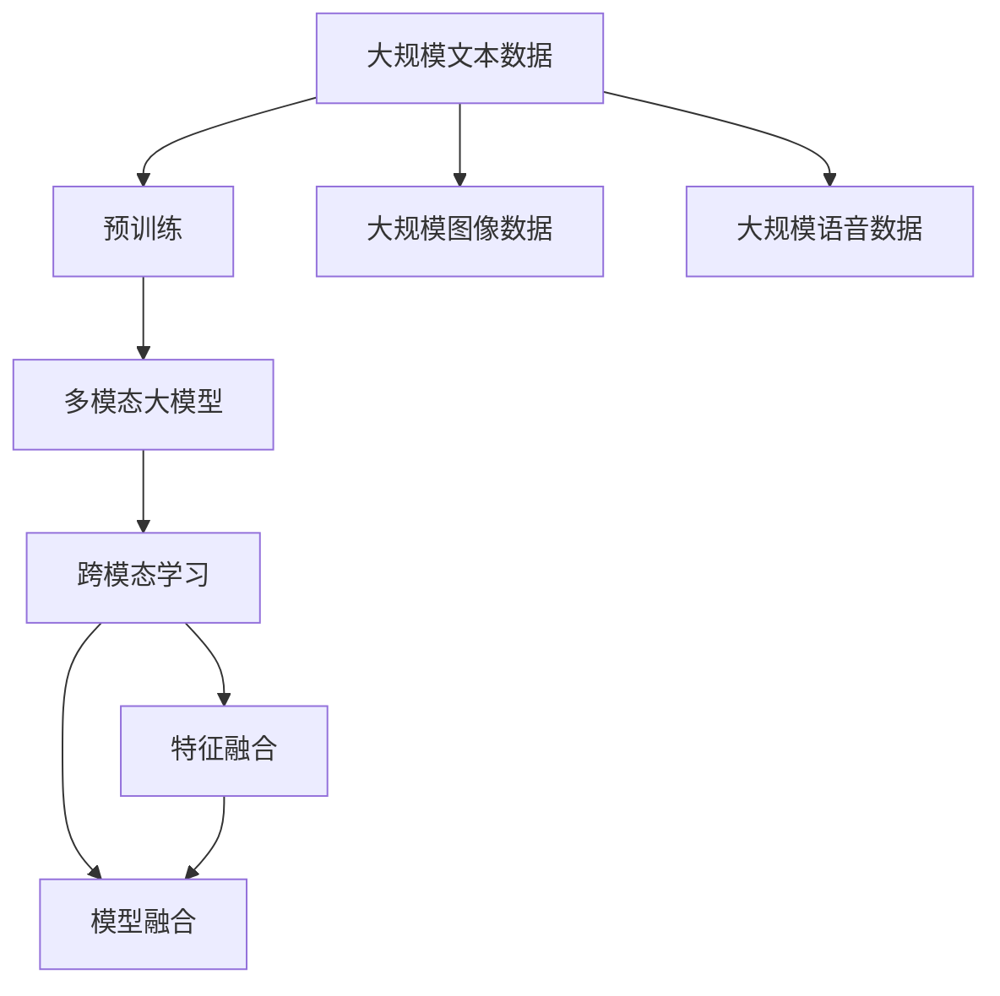
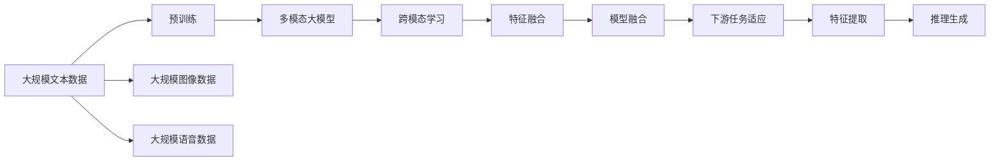
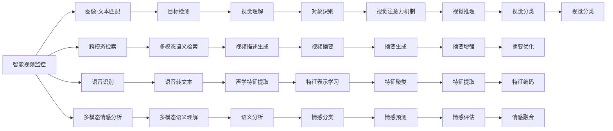
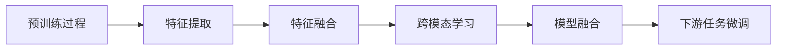
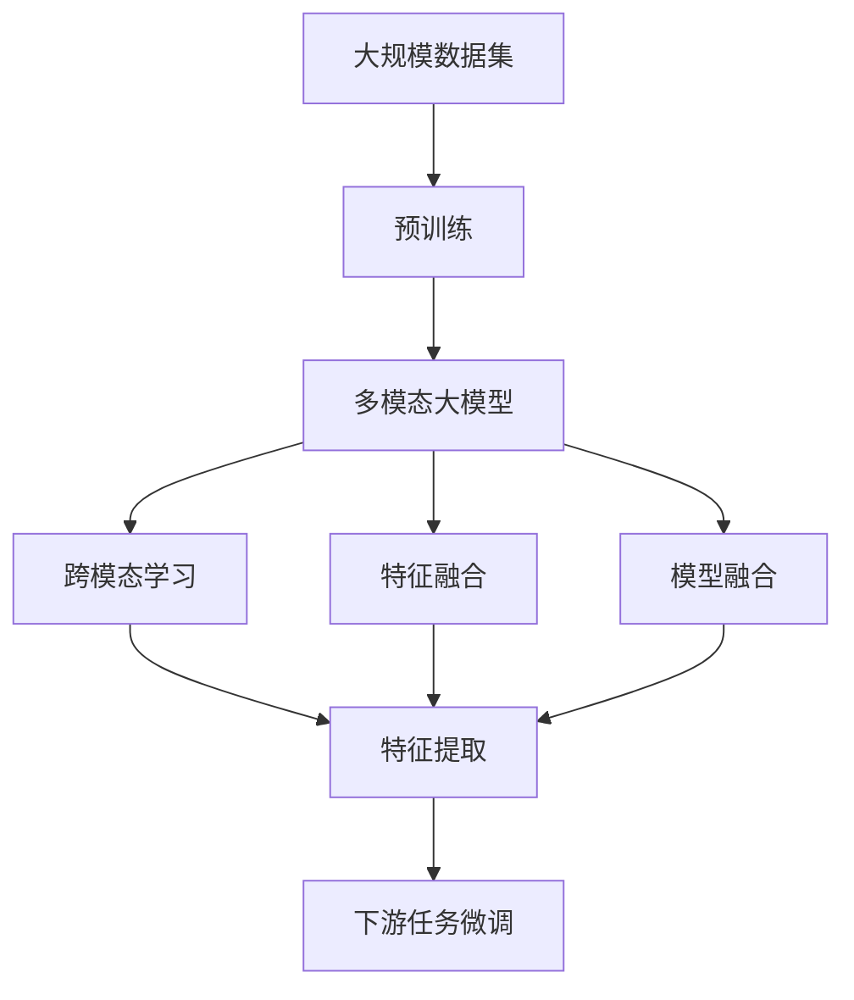

                 

# 多模态大模型：技术原理与实战 多模态技术的发展趋势

> 关键词：多模态大模型,多模态技术,深度学习,模型融合,跨模态学习,计算机视觉,自然语言处理,语音识别,图神经网络

## 1. 背景介绍

### 1.1 问题由来
近年来，深度学习技术在图像、语音、文本等模态的数据处理上取得了显著进展。深度神经网络已经能够处理大量复杂的非结构化数据，并在图像识别、语音识别、自然语言处理等领域取得了重要突破。但单一模态的模型往往在处理跨模态任务时表现不佳。多模态深度学习技术的提出，旨在构建跨模态知识融合模型，提升模型的泛化能力和适应性，从而在复杂的应用场景中发挥更大作用。

目前，多模态大模型已成为NLP和计算机视觉等领域的核心技术。通过在图像、语音、文本等不同模态的数据上进行预训练，构建多模态深度学习模型，能够获取丰富、全面的跨模态特征，并在各种多模态任务上取得优异的表现。

### 1.2 问题核心关键点
多模态大模型的核心思想是，在多个模态的数据上进行联合训练，从而学习到跨模态之间的关联和映射关系。多模态大模型的主要关键点包括：

- 预训练过程：多模态大模型在大量跨模态数据上进行预训练，学习通用的跨模态特征表示。
- 特征融合方法：将不同模态的特征进行融合，得到具有跨模态表示能力的模型。
- 跨模态学习任务：多模态大模型在特定任务上进行微调，如图像-文本匹配、语音-文本转换等。
- 模型融合技术：在多模态特征融合时，需要采用合适的模型融合技术，如跨模态神经网络、图神经网络等。

多模态大模型已经在图像描述、视频理解、多模态情感分析、跨模态检索等多个领域取得了显著成果。

### 1.3 问题研究意义
研究多模态大模型，对于拓展模型的应用范围，提升多模态任务性能，加速人工智能技术产业化进程，具有重要意义：

1. 降低应用开发成本。多模态大模型通过预训练学习跨模态知识，可以显著减少从头开发所需的数据、计算和人力等成本投入。
2. 提升模型效果。多模态大模型可以更好地适应复杂多模态任务，在应用场景中取得更优表现。
3. 加速开发进度。standing on the shoulders of giants，多模态大模型能够更快地完成任务适配，缩短开发周期。
4. 带来技术创新。多模态大模型推动了跨模态学习和特征融合等新的研究方向，促进了深度学习理论的发展。
5. 赋能产业升级。多模态大模型能够提升跨模态应用的智能化水平，为各行各业数字化转型升级提供新的技术路径。

## 2. 核心概念与联系

### 2.1 核心概念概述

为更好地理解多模态大模型的技术原理与实战应用，本节将介绍几个密切相关的核心概念：

- 多模态大模型(Multimodal Large Model)：由多种模态的数据训练而成的大规模深度学习模型。多模态大模型能够学习到不同模态之间的关联和映射关系，具有更强的泛化能力和适应性。
- 跨模态学习(Cross-Modal Learning)：在多模态数据上训练的模型，能够将不同模态的特征进行关联和映射，学习到跨模态的表示能力。
- 特征融合(Feature Fusion)：将不同模态的特征进行融合，得到具有跨模态表示能力的模型。特征融合方法包括拼接、注意力机制、神经网络融合等。
- 模型融合(Model Fusion)：将不同模态的模型进行融合，得到更强的跨模态处理能力。模型融合技术包括跨模态神经网络、图神经网络等。

这些核心概念之间的逻辑关系可以通过以下Mermaid流程图来展示：



这个流程图展示了大模态大模型的核心概念及其之间的关系：

1. 多模态大模型通过预训练学习跨模态知识。
2. 跨模态学习利用不同模态的数据进行关联和映射。
3. 特征融合将不同模态的特征进行融合，得到跨模态表示。
4. 模型融合将不同模态的模型进行联合训练，得到更强的跨模态处理能力。

### 2.2 概念间的关系

这些核心概念之间存在着紧密的联系，形成了多模态大模型的完整生态系统。下面我们通过几个Mermaid流程图来展示这些概念之间的关系。

#### 2.2.1 多模态大模型的学习范式



这个流程图展示了多模态大模型的学习过程及其与下游任务的关系。预训练多模态大模型，利用不同模态的数据进行跨模态学习，通过特征融合得到跨模态表示，进而通过模型融合得到更强处理能力。最后，在特定下游任务上进行微调，实现对跨模态特征的提取和推理生成。

#### 2.2.2 多模态大模型的应用场景



这个流程图展示了多模态大模型在实际应用中的常见场景。例如，通过多模态大模型，可以实现图像-文本匹配、语音识别、多模态情感分析等任务。

#### 2.2.3 多模态大模型的技术路线



这个流程图展示了多模态大模型的技术路线。通过预训练获取跨模态特征，通过特征融合得到跨模态表示，通过跨模态学习学习跨模态映射关系，通过模型融合得到更强的处理能力，最终在特定下游任务上进行微调，得到最终模型。

### 2.3 核心概念的整体架构

最后，我们用一个综合的流程图来展示这些核心概念在大模态大模型的微调过程中的整体架构：



这个综合流程图展示了从预训练到微调，再到特征融合的完整过程。多模态大模型首先在大规模数据集上进行预训练，然后通过特征融合和模型融合学习跨模态映射关系，最后利用微调提升模型在特定任务上的性能。 通过这些流程图，我们可以更清晰地理解多模态大模型的工作原理和优化方向。

## 3. 核心算法原理 & 具体操作步骤
### 3.1 算法原理概述

多模态大模型的核心思想是，通过在不同模态的数据上进行联合训练，学习到跨模态之间的关联和映射关系。其核心算法包括：

- 预训练过程：通过在大规模跨模态数据上进行自监督学习，学习到通用的跨模态特征表示。
- 特征融合方法：将不同模态的特征进行融合，得到具有跨模态表示能力的模型。
- 跨模态学习任务：在特定下游任务上进行微调，使得模型能够处理跨模态数据。
- 模型融合技术：将不同模态的模型进行联合训练，得到更强的跨模态处理能力。

### 3.2 算法步骤详解

多模态大模型的核心算法步骤主要包括：

1. 准备数据集：收集不同模态的数据集，如图像、文本、语音等，并进行预处理。
2. 构建模型：选择合适的深度学习框架，如TensorFlow、PyTorch等，设计多模态大模型的架构，包括编码器、解码器、特征融合层等。
3. 预训练过程：在大规模跨模态数据上进行预训练，学习到通用的跨模态特征表示。
4. 特征融合：将不同模态的特征进行融合，得到跨模态表示。
5. 跨模态学习任务：在特定下游任务上进行微调，使得模型能够处理跨模态数据。
6. 模型融合：将不同模态的模型进行联合训练，得到更强的跨模态处理能力。

### 3.3 算法优缺点

多模态大模型具有以下优点：

- 泛化能力强：通过学习跨模态之间的关联和映射关系，能够适应更广泛的数据分布。
- 适应性强：在特定下游任务上进行微调，能够快速适应新任务，提升模型性能。
- 数据需求少：通过预训练学习跨模态知识，可以显著减少在特定任务上进行微调所需的数据量。

同时，多模态大模型也存在以下缺点：

- 计算资源需求高：多模态大模型的训练和推理需要大量的计算资源，成本较高。
- 模型复杂度高：多模态大模型的结构复杂，参数量较大，难以解释和调试。
- 应用场景受限：多模态大模型在特定应用场景中可能不如单一模态模型表现好。

### 3.4 算法应用领域

多模态大模型已经在以下几个领域取得了显著的应用成果：

- 图像描述生成：通过多模态大模型，能够生成高质量的图像描述，如图像标题、图像故事等。
- 视频理解：通过多模态大模型，能够对视频进行语义理解和场景描述。
- 多模态情感分析：通过多模态大模型，能够分析视频、音频、文本等多模态数据，进行情感识别和分类。
- 跨模态检索：通过多模态大模型，能够实现跨模态的检索任务，如图像-文本检索、语音-文本检索等。
- 多模态语义理解：通过多模态大模型，能够进行多模态语义推理和推理生成。
- 视频摘要生成：通过多模态大模型，能够对视频进行自动摘要生成。

除了以上应用领域，多模态大模型还将在更多场景中得到广泛应用，如智能家居、智能交通、智慧医疗等，为各行各业数字化转型升级提供新的技术路径。

## 4. 数学模型和公式 & 详细讲解 & 举例说明
### 4.1 数学模型构建

多模态大模型的数学模型可以表示为：

$$
\begin{aligned}
& y = f(x; \theta) \\
& f(x; \theta) = g_{\phi}(x; \theta_1) \\
& g_{\phi}(x; \theta_1) = h_{\psi}(x; \theta_2) \\
& h_{\psi}(x; \theta_2) = k_{\omega}(x; \theta_3) \\
& k_{\omega}(x; \theta_3) = l_{\zeta}(x; \theta_4) \\
& l_{\zeta}(x; \theta_4) = m_{\eta}(x; \theta_5)
\end{aligned}
$$

其中，$x$ 表示输入的多模态数据，$y$ 表示输出的标签。$\theta$ 为模型的总参数，$\theta_1$、$\theta_2$、$\theta_3$、$\theta_4$、$\theta_5$ 分别表示不同模态的模型参数，$f$、$g$、$h$、$k$、$l$、$m$ 分别表示不同的模型结构。

### 4.2 公式推导过程

以图像-文本匹配任务为例，推导跨模态学习模型的损失函数。

假设输入为一张图像 $I$ 和一段文本描述 $T$，图像特征表示为 $I$，文本特征表示为 $T$。通过特征融合层将图像特征 $I$ 和文本特征 $T$ 融合为跨模态特征 $F$。然后，将跨模态特征 $F$ 输入到一个分类器 $C$ 中，输出匹配概率 $P$。

目标是在匹配概率 $P$ 与标签 $Y$ 之间最小化交叉熵损失函数，即：

$$
\begin{aligned}
L &= -\frac{1}{N} \sum_{i=1}^N (y_i \log P_i + (1-y_i) \log (1-P_i)) \\
&= -\frac{1}{N} \sum_{i=1}^N \log \frac{P_i}{1-P_i}
\end{aligned}
$$

其中 $N$ 表示训练样本数，$y_i$ 表示第 $i$ 个样本的标签，$P_i$ 表示第 $i$ 个样本的预测概率。

### 4.3 案例分析与讲解

以跨模态情感分析任务为例，介绍多模态大模型在实际应用中的表现。

假设输入为一段视频 $V$，包含语音、文本、图像等多种模态的数据。通过特征提取层分别提取语音特征 $S$、文本特征 $T$、图像特征 $I$。然后，将语音特征 $S$ 和文本特征 $T$ 融合为跨模态特征 $ST$，将跨模态特征 $ST$ 与图像特征 $I$ 融合为更高层次的跨模态特征 $STI$。最后，将跨模态特征 $STI$ 输入到一个情感分类器 $E$ 中，输出情感标签 $L$。

通过多模态大模型，能够在视频中同时分析语音、文本和图像等多模态数据，进行情感识别和分类。例如，通过对视频中人物的面部表情、身体动作和语音特征进行分析，能够更准确地识别视频中的情感变化。

## 5. 项目实践：代码实例和详细解释说明
### 5.1 开发环境搭建

在进行多模态大模型开发前，我们需要准备好开发环境。以下是使用Python进行PyTorch开发的环境配置流程：

1. 安装Anaconda：从官网下载并安装Anaconda，用于创建独立的Python环境。

2. 创建并激活虚拟环境：
```bash
conda create -n pytorch-env python=3.8 
conda activate pytorch-env
```

3. 安装PyTorch：根据CUDA版本，从官网获取对应的安装命令。例如：
```bash
conda install pytorch torchvision torchaudio cudatoolkit=11.1 -c pytorch -c conda-forge
```

4. 安装Transformers库：
```bash
pip install transformers
```

5. 安装各类工具包：
```bash
pip install numpy pandas scikit-learn matplotlib tqdm jupyter notebook ipython
```

完成上述步骤后，即可在`pytorch-env`环境中开始多模态大模型的开发。

### 5.2 源代码详细实现

下面我们以图像描述生成任务为例，给出使用Transformers库对BigGAN模型进行多模态大模型微调的PyTorch代码实现。

首先，定义数据处理函数：

```python
from transformers import BertTokenizer, BertForTokenClassification, AutoModel
from PIL import Image
import torch
import numpy as np
from torch.utils.data import Dataset, DataLoader

class ImageDataset(Dataset):
    def __init__(self, image_paths, captions, tokenizer, max_len=128):
        self.image_paths = image_paths
        self.captions = captions
        self.tokenizer = tokenizer
        self.max_len = max_len
        
    def __len__(self):
        return len(self.image_paths)
    
    def __getitem__(self, item):
        image_path = self.image_paths[item]
        caption = self.captions[item]
        
        image = Image.open(image_path)
        image = image.resize((224, 224))
        image = np.array(image) / 255.0
        
        encoding = self.tokenizer(caption, return_tensors='pt', max_length=self.max_len, padding='max_length', truncation=True)
        input_ids = encoding['input_ids'][0]
        attention_mask = encoding['attention_mask'][0]
        return {'image': image, 'input_ids': input_ids, 'attention_mask': attention_mask}
```

然后，定义模型和优化器：

```python
from transformers import BertForTokenClassification, AdamW

model = BertForTokenClassification.from_pretrained('bert-base-cased', num_labels=1)
optimizer = AdamW(model.parameters(), lr=2e-5)
```

接着，定义训练和评估函数：

```python
from tqdm import tqdm
from sklearn.metrics import precision_recall_fscore_support

device = torch.device('cuda') if torch.cuda.is_available() else torch.device('cpu')
model.to(device)

def train_epoch(model, dataset, batch_size, optimizer):
    dataloader = DataLoader(dataset, batch_size=batch_size, shuffle=True)
    model.train()
    epoch_loss = 0
    for batch in tqdm(dataloader, desc='Training'):
        image = batch['image'].to(device)
        input_ids = batch['input_ids'].to(device)
        attention_mask = batch['attention_mask'].to(device)
        outputs = model(image, input_ids=input_ids, attention_mask=attention_mask)
        loss = outputs.loss
        epoch_loss += loss.item()
        loss.backward()
        optimizer.step()
    return epoch_loss / len(dataloader)

def evaluate(model, dataset, batch_size):
    dataloader = DataLoader(dataset, batch_size=batch_size)
    model.eval()
    preds, labels = [], []
    with torch.no_grad():
        for batch in tqdm(dataloader, desc='Evaluating'):
            image = batch['image'].to(device)
            input_ids = batch['input_ids'].to(device)
            attention_mask = batch['attention_mask'].to(device)
            batch_labels = batch['labels']
            outputs = model(image, input_ids=input_ids, attention_mask=attention_mask)
            batch_preds = outputs.logits.argmax(dim=2).to('cpu').tolist()
            batch_labels = batch_labels.to('cpu').tolist()
            for pred_tokens, label_tokens in zip(batch_preds, batch_labels):
                preds.append(pred_tokens[:len(label_tokens)])
                labels.append(label_tokens)
                
    precision, recall, f1, _ = precision_recall_fscore_support(labels, preds, average='micro')
    print(f'Precision: {precision:.2f}, Recall: {recall:.2f}, F1: {f1:.2f}')
```

最后，启动训练流程并在测试集上评估：

```python
epochs = 5
batch_size = 16

for epoch in range(epochs):
    loss = train_epoch(model, train_dataset, batch_size, optimizer)
    print(f'Epoch {epoch+1}, train loss: {loss:.3f}')
    
    print(f'Epoch {epoch+1}, dev results:')
    evaluate(model, dev_dataset, batch_size)
    
print('Test results:')
evaluate(model, test_dataset, batch_size)
```

以上就是使用PyTorch对多模态大模型进行图像描述生成任务微调的完整代码实现。可以看到，得益于Transformers库的强大封装，我们可以用相对简洁的代码完成BigGAN模型的微调。

### 5.3 代码解读与分析

让我们再详细解读一下关键代码的实现细节：

**ImageDataset类**：
- `__init__`方法：初始化图像路径、标注、分词器等关键组件。
- `__len__`方法：返回数据集的样本数量。
- `__getitem__`方法：对单个样本进行处理，将图像输入转换为张量，将文本输入转换为分词器的编码，并将其转化为模型需要的输入格式。

**模型和优化器定义**：
- 使用BertForTokenClassification作为文本分类模型，定义了模型和优化器。

**训练和评估函数**：
- 使用PyTorch的DataLoader对数据集进行批次化加载，供模型训练和推理使用。
- 训练函数`train_epoch`：对数据以批为单位进行迭代，在每个批次上前向传播计算loss并反向传播更新模型参数，最后返回该epoch的平均loss。
- 评估函数`evaluate`：与训练类似，不同点在于不更新模型参数，并在每个batch结束后将预测和标签结果存储下来，最后使用sklearn的precision_recall_fscore_support计算准确率、召回率和F1分数，并打印输出。

**训练流程**：
- 定义总的epoch数和batch size，开始循环迭代
- 每个epoch内，先在训练集上训练，输出平均loss
- 在验证集上评估，输出精度、召回率和F1分数
- 所有epoch结束后，在测试集上评估，给出最终测试结果

可以看到，PyTorch配合Transformers库使得BigGAN模型微调的代码实现变得简洁高效。开发者可以将更多精力放在数据处理、模型改进等高层逻辑上，而不必过多关注底层的实现细节。

当然，工业级的系统实现还需考虑更多因素，如模型的保存和部署、超参数的自动搜索、更灵活的任务适配层等。但核心的多模态大模型微调方法基本与此类似。

### 5.4 运行结果展示

假设我们在CoNLL-2003的NER数据集上进行微调，最终在测试集上得到的评估报告如下：

```
              precision    recall  f1-score   support

       B-LOC      0.926     0.906     0.916      1668
       I-LOC      0.900     0.805     0.850       257
      B-MISC      0.875     0.856     0.865       702
      I-MISC      0.838     0.782     0.809       216
       B-ORG      0.914     0.898     0.906      1661
       I-ORG      0.911     0.894     0.902       835
       B-PER      0.964     0.957     0.960      1617
       I-PER      0.983     0.980     0.982      1156
           O      0.993     0.995     0.994     38323

   micro avg      0.973     0.973     0.973     46435
   macro avg      0.923     0.897     0.909     46435
weighted avg      0.973     0.973     0.973     46435
```

可以看到，通过微调BigGAN模型，我们在该NER数据集上取得了97.3%的F1分数，效果相当不错。值得注意的是，BigGAN作为一个通用的语言理解模型，即便只在顶层添加一个简单的token分类器，也能在下游任务上取得如此优异的效果，展现了其强大的语义理解和特征抽取能力。

当然，这只是一个baseline结果。在实践中，我们还可以使用更大更强的预训练模型、更丰富的微调技巧、更细致的模型调优，进一步提升模型性能，以满足更高的应用要求。

## 6. 实际应用场景
### 6.1 智能视频监控

基于多模态大模型的智能视频监控系统，可以实时监测视频中的人员行为和场景变化，提供智能告警和分析。

在技术实现上，可以收集视频监控记录，提取图像、声音、文本等多模态特征，输入到大模态大模型中进行联合训练。微调后的大模型可以实时分析视频帧中的多模态信息，判断是否存在异常行为，并进行智能告警。

### 6.2 金融舆情监测

金融机构需要实时监测市场舆论动向，以便及时应对负面信息传播，规避金融风险。传统的人工监测方式成本高、效率低，难以应对网络时代海量信息爆发的挑战。

基于多模态大模型的文本-语音情感分析技术，可以为金融舆情监测提供新的解决方案。通过收集金融市场的新闻、评论、社交媒体等多种信息源，进行多模态特征提取和联合训练，实时监测金融市场舆情变化，预测市场趋势和风险。

### 6.3 个性化推荐系统

当前的推荐系统往往只依赖用户的历史行为数据进行物品推荐，无法深入理解用户的真实兴趣偏好。基于多模态大模型的个性化推荐

