                 

# 多模态大模型：技术原理与实战 提示学习与指令微调

## 1. 背景介绍

### 1.1 问题由来

近年来，自然语言处理（NLP）技术取得了显著进展，尤其是在多模态大模型领域。多模态大模型融合了文本、图像、声音等多类信息，能够更好地理解和生成自然语言，被广泛应用于文本生成、图像描述、语音识别等任务。提示学习与指令微调（Instruction Tuning）作为一种新兴的训练技术，为多模态大模型提供了更加灵活、高效的应用方式。

提示学习是指在模型的输入中添加精心设计的提示（Prompt），引导模型按照预期方式进行推理和生成。指令微调则是在多模态大模型的基础上，通过少量的标注数据进行有监督学习，优化模型在特定任务上的性能。这种技术可以有效提高模型的泛化能力和适应性，同时减少对标注数据的需求。

### 1.2 问题核心关键点

多模态大模型的提示学习与指令微调问题核心关键点包括：

- **提示设计**：如何设计有效的提示，使得模型能够准确理解任务并产生高质量的输出。
- **微调策略**：如何选择合适的微调方法，使得模型能够在少量标注数据下快速适应新任务。
- **模型结构**：多模态大模型的结构如何优化，以适应不同模态的数据输入和输出。
- **鲁棒性提升**：如何提高模型对不同数据集的鲁棒性，避免过拟合和灾难性遗忘。
- **应用场景**：提示学习与指令微调在实际应用中的具体场景，如文本生成、图像描述、语音识别等。

### 1.3 问题研究意义

提示学习与指令微调在多模态大模型中的应用，具有重要的研究意义：

- **提高模型适应性**：通过微调，多模态大模型可以更好地适应不同领域和任务，提升模型在实际应用中的表现。
- **减少标注数据需求**：提示学习可以使得模型在少量标注数据下仍然表现良好，显著降低数据标注成本。
- **加速模型开发**：提示学习与指令微调可以快速生成高质量的模型输出，缩短模型开发周期。
- **促进技术创新**：提示学习与指令微调促进了多模态大模型在实际应用中的创新应用，推动了NLP技术的产业化进程。
- **提升用户体验**：多模态大模型在应用场景中能够更好地理解和生成自然语言，提升用户体验。

## 2. 核心概念与联系

### 2.1 核心概念概述

为更好地理解提示学习与指令微调，本节将介绍几个密切相关的核心概念：

- **多模态大模型**：结合了文本、图像、声音等多类信息的预训练语言模型，具有强大的跨模态理解和生成能力。
- **提示学习（Prompt Learning）**：通过在输入中嵌入提示，引导模型按照预期方式进行推理和生成，无需对模型进行微调。
- **指令微调（Instruction Tuning）**：通过在有标签的数据集上进行微调，优化模型在特定任务上的性能，提升模型的泛化能力和适应性。
- **多模态数据融合**：将不同模态的数据融合为模型输入，利用多模态信息提升模型的理解和生成能力。
- **模型压缩与优化**：通过模型压缩和优化技术，提高模型在实际部署中的效率和性能。
- **鲁棒性提升**：通过正则化、对抗训练等技术，提高模型对不同数据集的鲁棒性，避免过拟合和灾难性遗忘。

这些核心概念之间的逻辑关系可以通过以下Mermaid流程图来展示：

```mermaid
graph LR
    A[多模态大模型] --> B[提示学习]
    A --> C[指令微调]
    B --> D[文本生成]
    C --> E[图像描述]
    C --> F[语音识别]
    D --> G[生成式对话]
    E --> H[图像搜索]
    F --> I[语音助手]
    G --> J[多轮对话]
    H --> K[视觉问答]
    I --> L[智能客服]
    J --> M[智能问答]
    K --> N[图像描述]
    L --> O[智能推荐]
    M --> P[智能翻译]
    N --> Q[视觉摘要]
    O --> R[智能推荐]
    P --> S[机器翻译]
    Q --> T[视觉摘要]
    R --> U[智能推荐]
    S --> V[机器翻译]
    T --> W[视觉摘要]
    U --> X[智能推荐]
    V --> Y[机器翻译]
    W --> Z[视觉摘要]
    X --> AA[智能推荐]
    Y --> AB[机器翻译]
    Z --> AC[视觉摘要]
    AA --> AD[智能推荐]
    AB --> AE[机器翻译]
    AC --> AF[视觉摘要]
    AD --> AG[智能推荐]
    AE --> AH[机器翻译]
    AF --> AI[视觉摘要]
    AG --> AJ[智能推荐]
    AH --> AK[机器翻译]
    AI --> AL[视觉摘要]
    AJ --> AM[智能推荐]
    AK --> AN[机器翻译]
    AL --> AO[视觉摘要]
    AM --> AP[智能推荐]
    AN --> AQ[机器翻译]
    AO --> AR[视觉摘要]
    AP --> AS[智能推荐]
    AQ --> AT[机器翻译]
    AR --> AU[视觉摘要]
    AS --> AV[智能推荐]
    AT --> AW[机器翻译]
    AU --> AX[视觉摘要]
    AV --> AY[机器翻译]
    AW --> AZ[视觉摘要]
    AX --> B1[智能推荐]
    AY --> B2[机器翻译]
    AZ --> B3[视觉摘要]
    B1 --> C1[智能推荐]
    B2 --> C2[机器翻译]
    B3 --> C3[视觉摘要]
```



### 2.2 概念间的关系

这些核心概念之间存在着紧密的联系，形成了提示学习与指令微调在多模态大模型中的应用框架。

**多模态大模型与提示学习的关系**：

提示学习是利用多模态大模型的理解能力，通过精心设计的提示引导模型生成高质量的输出。它不需要对模型进行微调，能够在少量标注数据下仍然取得良好的效果。

**指令微调与多模态大模型的关系**：

指令微调是通过在有标签的数据集上进行微调，优化模型在特定任务上的性能，提升模型的泛化能力和适应性。它可以结合多模态数据，进一步提升模型的理解和生成能力。

**多模态数据融合与模型结构的关系**：

多模态数据融合是指将不同模态的数据融合为模型输入，利用多模态信息提升模型的理解和生成能力。这需要模型具有较强的跨模态表示能力，可以通过多模态神经网络结构来实现。

**模型压缩与优化与鲁棒性提升的关系**：

模型压缩与优化技术可以提高模型在实际部署中的效率和性能。同时，通过正则化、对抗训练等技术，可以提升模型的鲁棒性，避免过拟合和灾难性遗忘。

这些概念共同构成了多模态大模型提示学习与指令微调的应用框架，使得模型能够在各种场景下发挥强大的多模态理解和生成能力。

### 2.3 核心概念的整体架构

最后，我们用一个综合的流程图来展示这些核心概念在大模型提示学习与指令微调过程中的整体架构：

```mermaid
graph LR
    A[大规模文本数据] --> B[预训练]
    B --> C[多模态大模型]
    C --> D[提示学习]
    C --> E[指令微调]
    D --> F[文本生成]
    E --> G[图像描述]
    E --> H[语音识别]
    F --> I[生成式对话]
    G --> J[图像搜索]
    H --> K[语音助手]
    I --> L[多轮对话]
    J --> M[视觉问答]
    K --> N[智能客服]
    L --> O[智能问答]
    M --> P[智能推荐]
    N --> Q[智能推荐]
    O --> R[智能翻译]
    P --> S[机器翻译]
    Q --> T[视觉摘要]
    R --> U[智能推荐]
    S --> V[机器翻译]
    T --> W[视觉摘要]
    U --> X[智能推荐]
    V --> Y[机器翻译]
    W --> Z[视觉摘要]
    X --> AA[智能推荐]
    Y --> AB[机器翻译]
    Z --> AC[视觉摘要]
    AA --> AD[智能推荐]
    AB --> AE[机器翻译]
    AC --> AF[视觉摘要]
    AD --> AG[智能推荐]
    AE --> AH[机器翻译]
    AF --> AI[视觉摘要]
    AG --> AJ[智能推荐]
    AH --> AK[机器翻译]
    AI --> AL[视觉摘要]
    AJ --> AM[智能推荐]
    AK --> AN[机器翻译]
    AL --> AO[视觉摘要]
    AM --> AP[智能推荐]
    AN --> AQ[机器翻译]
    AO --> AR[视觉摘要]
    AP --> AS[智能推荐]
    AQ --> AT[机器翻译]
    AR --> AU[视觉摘要]
    AS --> AV[智能推荐]
    AT --> AW[机器翻译]
    AU --> AX[视觉摘要]
    AV --> AY[机器翻译]
    AW --> AZ[视觉摘要]
    AX --> B1[智能推荐]
    AY --> B2[机器翻译]
    AZ --> B3[视觉摘要]
    B1 --> C1[智能推荐]
    B2 --> C2[机器翻译]
    B3 --> C3[视觉摘要]
```



这个综合流程图展示了从预训练到提示学习与指令微调，再到多模态数据融合和模型优化的完整过程。多模态大模型首先在大规模文本数据上进行预训练，然后通过提示学习与指令微调，适应特定任务，最后利用多模态数据融合和模型优化技术，进一步提升模型的性能和适应性。

## 3. 核心算法原理 & 具体操作步骤
### 3.1 算法原理概述

提示学习与指令微调本质上是一种基于多模态大模型的有监督学习范式。其核心思想是：通过在模型的输入中添加提示（Prompt），引导模型按照预期方式进行推理和生成；在有标签的数据集上进行微调，优化模型在特定任务上的性能。

形式化地，假设多模态大模型为 $M_{\theta}$，其中 $\theta$ 为预训练得到的模型参数。给定一个多模态任务 $T$ 的标注数据集 $D=\{(x_i, y_i)\}_{i=1}^N$，提示学习与指令微调的目标是找到新的模型参数 $\hat{\theta}$，使得模型在任务 $T$ 上能够生成高质量的输出：

$$
\hat{\theta}=\mathop{\arg\min}_{\theta} \mathcal{L}(M_{\theta},D)
$$

其中 $\mathcal{L}$ 为针对任务 $T$ 设计的损失函数，用于衡量模型预测输出与真实标签之间的差异。常见的损失函数包括交叉熵损失、均方误差损失等。

通过梯度下降等优化算法，提示学习与指令微调过程不断更新模型参数 $\theta$，最小化损失函数 $\mathcal{L}$，使得模型输出逼近真实标签。由于 $\theta$ 已经通过预训练获得了较好的初始化，因此即便在少量标注数据上微调，也能较快收敛到理想的模型参数 $\hat{\theta}$。

### 3.2 算法步骤详解

基于监督学习的多模态大模型提示学习与指令微调一般包括以下几个关键步骤：

**Step 1: 准备预训练模型和数据集**
- 选择合适的多模态大模型 $M_{\theta}$ 作为初始化参数，如GPT-3、BERT、CLIP等。
- 准备多模态任务 $T$ 的标注数据集 $D$，划分为训练集、验证集和测试集。一般要求标注数据与预训练数据的分布不要差异过大。

**Step 2: 添加任务适配层**
- 根据任务类型，在多模态大模型顶层设计合适的输出层和损失函数。
- 对于分类任务，通常在顶层添加线性分类器和交叉熵损失函数。
- 对于生成任务，通常使用语言模型的解码器输出概率分布，并以负对数似然为损失函数。

**Step 3: 设置微调超参数**
- 选择合适的优化算法及其参数，如AdamW、SGD等，设置学习率、批大小、迭代轮数等。
- 设置正则化技术及强度，包括权重衰减、Dropout、Early Stopping等。
- 确定冻结预训练参数的策略，如仅微调顶层，或全部参数都参与微调。

**Step 4: 执行梯度训练**
- 将训练集数据分批次输入模型，前向传播计算损失函数。
- 反向传播计算参数梯度，根据设定的优化算法和学习率更新模型参数。
- 周期性在验证集上评估模型性能，根据性能指标决定是否触发 Early Stopping。
- 重复上述步骤直到满足预设的迭代轮数或 Early Stopping 条件。

**Step 5: 测试和部署**
- 在测试集上评估提示学习与指令微调后模型 $M_{\hat{\theta}}$ 的性能，对比微调前后的精度提升。
- 使用微调后的模型对新样本进行推理预测，集成到实际的应用系统中。
- 持续收集新的数据，定期重新微调模型，以适应数据分布的变化。

以上是基于监督学习的多模态大模型提示学习与指令微调的一般流程。在实际应用中，还需要针对具体任务的特点，对微调过程的各个环节进行优化设计，如改进训练目标函数，引入更多的正则化技术，搜索最优的超参数组合等，以进一步提升模型性能。

### 3.3 算法优缺点

基于监督学习的多模态大模型提示学习与指令微调方法具有以下优点：

- **简单高效**：只需准备少量标注数据，即可对预训练模型进行快速适配，获得较大的性能提升。
- **通用适用**：适用于各种多模态NLP任务，包括分类、匹配、生成等，设计简单的任务适配层即可实现微调。
- **参数高效**：利用参数高效微调技术，在固定大部分预训练参数的情况下，仍可取得不错的提升。
- **效果显著**：在学术界和工业界的诸多任务上，提示学习与指令微调方法已经刷新了最先进的性能指标。

同时，该方法也存在一定的局限性：

- **依赖标注数据**：提示学习与指令微调的效果很大程度上取决于标注数据的质量和数量，获取高质量标注数据的成本较高。
- **迁移能力有限**：当目标任务与预训练数据的分布差异较大时，微调的性能提升有限。
- **负面效果传递**：预训练模型的固有偏见、有害信息等，可能通过微调传递到下游任务，造成负面影响。
- **可解释性不足**：提示学习与指令微调模型的决策过程通常缺乏可解释性，难以对其推理逻辑进行分析和调试。

尽管存在这些局限性，但就目前而言，基于监督学习的微调方法仍是大模型应用的最主流范式。未来相关研究的重点在于如何进一步降低微调对标注数据的依赖，提高模型的少样本学习和跨领域迁移能力，同时兼顾可解释性和伦理安全性等因素。

### 3.4 算法应用领域

基于大语言模型提示学习与指令微调的监督学习方法，在多模态NLP领域已经得到了广泛的应用，覆盖了几乎所有常见任务，例如：

- **文本分类**：如情感分析、主题分类、意图识别等。通过微调使模型学习文本-标签映射。
- **命名实体识别**：识别文本中的人名、地名、机构名等特定实体。通过微调使模型掌握实体边界和类型。
- **关系抽取**：从文本中抽取实体之间的语义关系。通过微调使模型学习实体-关系三元组。
- **问答系统**：对自然语言问题给出答案。将问题-答案对作为微调数据，训练模型学习匹配答案。
- **机器翻译**：将源语言文本翻译成目标语言。通过微调使模型学习语言-语言映射。
- **文本摘要**：将长文本压缩成简短摘要。将文章-摘要对作为微调数据，使模型学习抓取要点。
- **对话系统**：使机器能够与人自然对话。将多轮对话历史作为上下文，微调模型进行回复生成。

除了上述这些经典任务外，多模态大模型提示学习与指令微调也被创新性地应用到更多场景中，如可控文本生成、常识推理、代码生成、数据增强等，为NLP技术带来了全新的突破。随着预训练模型和微调方法的不断进步，相信NLP技术将在更广阔的应用领域大放异彩。

## 4. 数学模型和公式 & 详细讲解 & 举例说明

### 4.1 数学模型构建

本节将使用数学语言对基于监督学习的多模态大模型提示学习与指令微调过程进行更加严格的刻画。

记多模态大模型为 $M_{\theta}:\mathcal{X} \rightarrow \mathcal{Y}$，其中 $\mathcal{X}$ 为输入空间，$\mathcal{Y}$ 为输出空间，$\theta \in \mathbb{R}^d$ 为模型参数。假设提示学习与指令微调任务的训练集为 $D=\{(x_i,y_i)\}_{i=1}^N, x_i \in \mathcal{X}, y_i \in \mathcal{Y}$。

定义模型 $M_{\theta}$ 在输入 $x$ 上的输出为 $\hat{y}=M_{\theta}(x) \in [0,1]$，表示样本属于正类的概率。真实标签 $y \in \{0,1\}$。则多模态大模型的二分类交叉熵损失函数定义为：

$$
\ell(M_{\theta}(x),y) = -[y\log \hat{y} + (1-y)\log (1-\hat{y})]
$$

将其代入经验风险公式，得：

$$
\mathcal{L}(\theta) = -\frac{1}{N}\sum_{i=1}^N [y_i\log M_{\theta}(x_i)+(1-y_i)\log(1-M_{\theta}(x_i))]
$$

在实践中，我们通常使用基于梯度的优化算法（如SGD、Adam等）来近似求解上述最优化问题。设 $\eta$ 为学习率，$\lambda$ 为正则化系数，则参数的更新公式为：

$$
\theta \leftarrow \theta - \eta \nabla_{\theta}\mathcal{L}(\theta) - \eta\lambda\theta
$$

其中 $\nabla_{\theta}\mathcal{L}(\theta)$ 为损失函数对参数 $\theta$ 的梯度，可通过反向传播算法高效计算。

### 4.2 公式推导过程

以下我们以二分类任务为例，推导交叉熵损失函数及其梯度的计算公式。

假设模型 $M_{\theta}$ 在输入 $x$ 上的输出为 $\hat{y}=M_{\theta}(x) \in [0,1]$，表示样本属于正类的概率。真实标签 $y \in \{0,1\}$。则二分类交叉熵损失函数定义为：

$$
\ell(M_{\theta}(x),y) = -[y\log \hat{y} + (1-y)\log (1-\hat{y})]
$$

将其代入经验风险公式，得：

$$
\mathcal{L}(\theta) = -\frac{1}{N}\sum_{i=1}^N [y_i\log M_{\theta}(x_i)+(1-y_i)\log(1-M_{\theta}(x_i))]
$$

根据链式法则，损失函数对参数 $\theta_k$ 的梯度为：

$$
\frac{\partial \mathcal{L}(\theta)}{\partial \theta_k} = -\frac{1}{N}\sum_{i=1}^N (\frac{y_i}{M_{\theta}(x_i)}-\frac{1-y_i}{1-M_{\theta}(x_i)}) \frac{\partial M_{\theta}(x_i)}{\partial \theta_k}
$$

其中 $\frac{\partial M_{\theta}(x_i)}{\partial \theta_k}$ 可进一步递归展开，利用自动微分技术完成计算。

在得到损失函数的梯度后，即可带入参数更新公式，完成模型的迭代优化。重复上述过程直至收敛，最终得到适应下游任务的最优模型参数 $\theta^*$。

## 5. 项目实践：代码实例和详细解释说明

### 5.1 开发环境搭建

在进行多模态大模型提示学习与指令微调实践前，我们需要准备好开发环境。以下是使用Python进行PyTorch开发的环境配置流程：

1. 安装Anaconda：从官网下载并安装Anaconda，用于创建独立的Python环境。

2. 创建并激活虚拟环境：
```bash
conda create -n pytorch-env python=3.8 
conda activate pytorch-env
```

3. 安装PyTorch：根据CUDA版本，从官网获取对应的安装命令。例如：
```bash
conda install pytorch torchvision torchaudio cudatoolkit=11.1 -c pytorch -c conda-forge
```

4. 安装Transformers库：
```bash
pip install transformers
```

5. 安装各类工具包：
```bash
pip install numpy pandas scikit-learn matplotlib tqdm jupyter notebook ipython
```

完成上述步骤后，即可在`pytorch-env`环境中开始微调实践。

### 5.2 源代码详细实现

下面我以CLIP模型在图像分类任务上的微调为例，给出使用Transformers库进行提示学习与指令微调的PyTorch代码实现。

首先，定义图像分类任务的标注数据集：

```python
from torch.utils.data import Dataset, DataLoader
from PIL import Image
import torch
from transformers import CLIPTokenizer, CLIPModel

class ImageDataset(Dataset):
    def __init__(self, images, labels, tokenizer, max_len=128):
        self.images = images
        self.labels = labels
        self.tokenizer = tokenizer
        self.max_len = max_len
        
    def __len__(self):
        return len(self.images)
    
    def __getitem__(self, item):
        image = self.images[item]
        label = self.labels[item]
        
        encoding = self.tokenizer(text=image, return_tensors='pt', max_length=self.max_len, padding='max_length', truncation=True)
        image_tensor = torch.tensor(image).float().unsqueeze(0)
        
        return {'input_ids': encoding['input_ids'],
                'attention_mask': encoding['attention_mask'],
                'image': image_tensor,
                'label': torch.tensor(label, dtype=torch.long)}
```

然后，定义模型和优化器：

```python
from transformers import AdamW

model = CLIPModel.from_pretrained('openai/clip-vit-large-patch14')
tokenizer = CLIPTokenizer.from_pretrained('openai/clip-vit-large-patch14')
optimizer = AdamW(model.parameters(), lr=2e-5)
```

接着，定义训练和评估函数：

```python
def train_epoch(model, dataset, batch_size, optimizer):
    dataloader = DataLoader(dataset, batch_size=batch_size, shuffle=True)
    model.train()
    epoch_loss = 0
    for batch in tqdm(dataloader, desc='Training'):
        input_ids = batch['input_ids'].to(device)
        attention_mask = batch['attention_mask'].to(device)
        image = batch['image'].to(device)
        label = batch['label'].to(device)
        model.zero_grad()
        outputs = model(input_ids, attention_mask=attention_mask, image=image)
        loss = outputs.loss
        epoch_loss += loss.item()
        loss.backward()
        optimizer.step()
    return epoch_loss / len(dataloader)

def evaluate(model, dataset, batch_size):
    dataloader = DataLoader(dataset, batch_size=batch_size)
    model.eval()
    preds, labels = [], []
    with torch.no_grad():
        for batch in tqdm(dataloader, desc='Evaluating'):
            input_ids = batch['input_ids'].to(device)
            attention_mask = batch['attention_mask'].to(device)
            image = batch['image'].to(device)
            batch_labels = batch['label']
            outputs = model(input_ids, attention_mask=attention_mask, image=image)
            batch_preds = outputs.logits.argmax(dim=2).to('cpu').tolist()
            batch_labels = batch_labels.to('cpu').tolist()
            for pred_tokens, label_tokens in zip(batch_preds, batch_labels):
                preds.append(pred_tokens[:len(label_tokens)])
                labels.append(label_tokens)
                
    print(classification_report(labels, preds))
```

最后，启动训练流程并在测试集上评估：

```python
epochs = 5
batch_size = 16

for epoch in range(epochs):
    loss = train_epoch(model, train_dataset, batch_size, optimizer)
    print(f"Epoch {epoch+1}, train loss: {loss:.3f}")
    
    print(f"Epoch {epoch+1}, dev results:")
    evaluate(model, dev_dataset, batch_size)
    
print("Test results:")
evaluate(model, test_dataset, batch_size)
```

以上就是使用PyTorch对CLIP模型进行图像分类任务微调的完整代码实现。可以看到，得益于Transformers库的强大封装，我们可以用相对简洁的代码完成CLIP模型的加载和微调。

### 5.3 代码解读与分析

让我们再详细解读一下关键代码的实现细节：

**ImageDataset类**：
- `__init__`方法：初始化图像、标签、分词器等关键组件。
- `__len__`方法：返回数据集的样本数量。
- `__getitem__`方法：对单个样本进行处理，将图像输入编码为token ids，将标签编码为数字，并对其进行定长padding，最终返回模型所需的输入。

