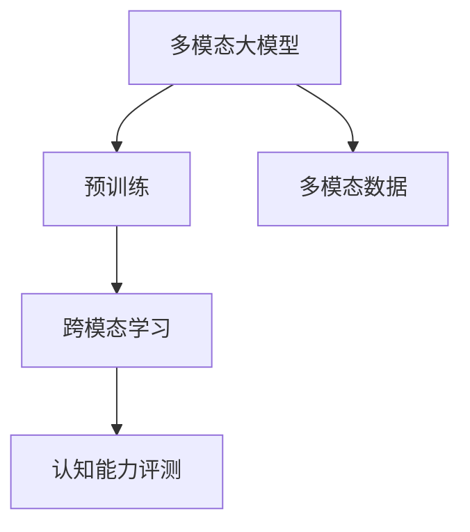

                 

# 多模态大模型：技术原理与实战 认知能力评测

> 关键词：多模态大模型, 认知能力评测, 技术原理, 实战应用, 自动评测, 模型评估, 数据处理, 模型训练

## 1. 背景介绍

### 1.1 问题由来
在当今的智能时代，认知能力评测作为评估人类认知水平和智能系统的基础，越来越受到重视。传统的评测方法依赖于人为测评和纸质测试，效率低、主观性强、难以标准化。而随着人工智能技术的飞速发展，利用大数据和深度学习技术，通过计算机自动化的方式对认知能力进行客观、全面、高效的评测，成为了一种新的趋势。在这一背景下，多模态大模型应运而生。

### 1.2 问题核心关键点
多模态大模型将文本、图像、声音等多种数据形式融合到单一的深度神经网络中，通过预训练的方式学习跨模态的特征表示，从而提升认知能力评测的准确性和效率。其核心思想是通过多模态数据之间的关联学习，使得模型能够在不同模态的数据上泛化，提升对认知能力的评测能力。

### 1.3 问题研究意义
多模态大模型在认知能力评测中的应用，可以大大降低人工测评的成本和时间，提升测评的客观性和标准化水平，为教育、医疗、人力资源等领域提供更高效、更准确的评测手段。同时，对于智能系统的认知能力测评，也可以提供更多的测试数据和更好的性能评估标准，推动人工智能技术的进一步发展。

## 2. 核心概念与联系

### 2.1 核心概念概述

为更好地理解多模态大模型的原理与实战应用，本节将介绍几个关键概念：

- **多模态大模型**：将文本、图像、声音等多种数据形式融合到单一的深度神经网络中，通过预训练的方式学习跨模态的特征表示，从而提升对认知能力评测的准确性和效率。

- **预训练**：在大规模无标签数据上进行自监督学习，学习通用的跨模态特征表示。

- **多模态数据**：包括文本、图像、声音等多种形式的数据，是构建多模态大模型的基础。

- **跨模态学习**：通过不同模态数据之间的关联学习，提升模型的泛化能力。

- **认知能力评测**：利用深度学习模型对人类认知能力进行客观、全面、高效的评估。

这些概念之间存在着紧密的联系，共同构成了多模态大模型的核心框架，使其能够在各种场景下发挥强大的认知能力评测能力。

### 2.2 概念间的关系

这些核心概念之间的关系可以通过以下Mermaid流程图来展示：



这个流程图展示了大模型的核心概念及其之间的关系：

1. 多模态大模型通过预训练获得基础能力。
2. 预训练主要采用自监督学习，学习通用的跨模态特征表示。
3. 跨模态学习通过不同模态数据之间的关联学习，提升模型的泛化能力。
4. 认知能力评测利用多模态大模型对认知能力进行客观、全面、高效的评估。

这些概念共同构成了多模态大模型的学习和应用框架，使其能够在各种场景下发挥强大的认知能力评测能力。通过理解这些核心概念，我们可以更好地把握多模态大模型的工作原理和优化方向。

## 3. 核心算法原理 & 具体操作步骤

### 3.1 算法原理概述

多模态大模型的核心算法原理是跨模态学习，即在多模态数据上通过联合训练的方式，学习不同模态之间的关联表示，从而提升模型对认知能力评测的准确性和泛化能力。

具体来说，多模态大模型通常包括三个主要组成部分：

1. **编码器**：对输入的多模态数据进行特征提取，生成统一的编码表示。
2. **联合表示学习**：将不同模态的编码表示进行关联学习，提升模型的泛化能力。
3. **评测器**：基于联合表示学习的结果，对认知能力进行评测。

这些组成部分通过联合训练的方式，实现多模态数据之间的关联学习，从而提升认知能力评测的准确性和效率。

### 3.2 算法步骤详解

多模态大模型的训练和应用通常包括以下几个关键步骤：

**Step 1: 准备数据集**
- 收集多模态数据集，如文本、图像、声音等。
- 对数据进行预处理，如文本分词、图像归一化、声音特征提取等。

**Step 2: 定义模型架构**
- 选择多模态大模型的架构，如VGG、ResNet等。
- 定义编码器、联合表示学习、评测器等组成部分。

**Step 3: 设置训练参数**
- 选择合适的优化算法及其参数，如Adam、SGD等。
- 设置学习率、批大小、迭代轮数等。

**Step 4: 执行训练过程**
- 对多模态数据进行联合训练，前向传播计算损失函数。
- 反向传播计算参数梯度，根据设定的优化算法和学习率更新模型参数。
- 周期性在验证集上评估模型性能，根据性能指标决定是否触发Early Stopping。
- 重复上述步骤直到满足预设的迭代轮数或Early Stopping条件。

**Step 5: 应用评测**
- 使用训练好的模型对新数据进行认知能力评测。
- 根据评测结果对模型进行优化调整，反复迭代，直至达到满意的性能。

以上是多模态大模型训练和应用的一般流程。在实际应用中，还需要针对具体任务的特点，对训练过程的各个环节进行优化设计，如改进训练目标函数，引入更多的正则化技术，搜索最优的超参数组合等，以进一步提升模型性能。

### 3.3 算法优缺点

多模态大模型在认知能力评测中具有以下优点：

1. 高效性：利用多模态数据的多样性和丰富性，提升认知能力评测的准确性和效率。
2. 鲁棒性：通过跨模态学习，模型对噪声和扰动具有较强的鲁棒性。
3. 泛化性：跨模态学习使得模型能够更好地适应新数据和新场景。

同时，该方法也存在一定的局限性：

1. 数据获取难度高：多模态数据的收集和标注难度较大，需要大量的人力和时间。
2. 模型复杂度高：多模态大模型的训练和应用需要更高的计算资源和更复杂的算法。
3. 可解释性差：多模态大模型通常是一个黑盒模型，难以解释其内部的决策过程。
4. 模型偏向性：如果训练数据存在偏见，多模态大模型也可能继承这些偏见，影响评测结果的公平性。

尽管存在这些局限性，但就目前而言，多模态大模型仍是在认知能力评测中最先进、最有效的技术范式。未来相关研究的重点在于如何进一步降低数据获取难度，提高模型的可解释性和鲁棒性，以及如何更好地利用跨模态学习，提升模型的泛化能力和公平性。

### 3.4 算法应用领域

多模态大模型已经在认知能力评测的多个领域得到广泛应用，例如：

- **教育测评**：对学生的认知能力进行全面评估，包括阅读理解、写作能力、逻辑推理等。
- **医疗诊断**：利用患者的多模态数据（如CT影像、生理指标、问诊记录等），进行综合诊断和疾病预测。
- **人力资源测评**：对求职者的认知能力进行多角度评估，包括智力、情绪、社交能力等。
- **智能客服**：对用户的认知能力进行评估，提升客服系统的智能水平。
- **游戏测评**：对玩家的游戏行为进行认知能力分析，提升游戏的趣味性和挑战性。

除了上述这些经典任务外，多模态大模型还被创新性地应用到更多场景中，如知识图谱构建、视频分析、情感分析等，为认知能力评测带来了全新的突破。随着多模态大模型和跨模态学习方法的不断进步，相信认知能力评测技术将在更广阔的应用领域大放异彩。

## 4. 数学模型和公式 & 详细讲解

### 4.1 数学模型构建

假设我们有一个多模态大模型，包括文本、图像和声音三种模态的数据。模型的输入为 $\mathbf{x}=(\mathbf{x}_t,\mathbf{x}_i,\mathbf{x}_v)$，其中 $\mathbf{x}_t$ 为文本特征向量，$\mathbf{x}_i$ 为图像特征向量，$\mathbf{x}_v$ 为声音特征向量。模型的输出为认知能力评测结果，记为 $y \in [0,1]$，表示认知能力的评分。

定义模型在数据样本 $\mathbf{X}=\{(\mathbf{x}_i,y_i)\}_{i=1}^N$ 上的损失函数为 $\ell(\mathbf{X}, \mathbf{W}, \mathbf{b})$，其中 $\mathbf{W}$ 和 $\mathbf{b}$ 为模型参数，$\mathbf{X}$ 为输入数据集。在联合训练过程中，我们通常使用多模态的特征表示作为输入，模型的输出为认知能力评测结果，定义如下：

$$
y = f(\mathbf{W}, \mathbf{b}, \mathbf{x}_t, \mathbf{x}_i, \mathbf{x}_v)
$$

其中 $f$ 为评测器的映射函数。

### 4.2 公式推导过程

以二分类任务为例，假设文本特征 $\mathbf{x}_t$ 和图像特征 $\mathbf{x}_i$ 经过编码器后，得到特征表示 $\mathbf{h}_t$ 和 $\mathbf{h}_i$。将这两个特征表示输入到评测器中，得到模型输出：

$$
y = \sigma(\mathbf{W}\mathbf{h}_t + \mathbf{b})
$$

其中 $\sigma$ 为 sigmoid 函数，$\mathbf{W}$ 和 $\mathbf{b}$ 为评测器的参数。定义二分类交叉熵损失函数为：

$$
\ell(\mathbf{X}, \mathbf{W}, \mathbf{b}) = -\frac{1}{N} \sum_{i=1}^N [y_i\log y_i + (1-y_i)\log (1-y_i)]
$$

将输出 $y$ 代入损失函数中，得到：

$$
\ell(\mathbf{X}, \mathbf{W}, \mathbf{b}) = -\frac{1}{N} \sum_{i=1}^N [y_i\log \sigma(\mathbf{W}\mathbf{h}_t + \mathbf{b}) + (1-y_i)\log (1-\sigma(\mathbf{W}\mathbf{h}_t + \mathbf{b}))
$$

在联合训练过程中，我们需要对 $\mathbf{W}$ 和 $\mathbf{b}$ 进行优化，使得损失函数 $\ell(\mathbf{X}, \mathbf{W}, \mathbf{b})$ 最小化。使用梯度下降等优化算法，更新参数 $\mathbf{W}$ 和 $\mathbf{b}$，直到收敛。

### 4.3 案例分析与讲解

以教育测评为例，我们收集学生的阅读理解、写作能力和逻辑推理等多模态数据，作为模型的输入。通过多模态大模型的预训练和微调，可以得到学生认知能力的综合评测结果。

假设我们有一个包含文本和图像的多模态数据集，包括阅读理解题和题目对应的解释视频。对于每一道题，我们将其中的文本 $\mathbf{x}_t$ 和对应的视频帧 $\mathbf{x}_i$ 输入到模型中，得到评测结果 $y$。在训练过程中，我们通过最大化交叉熵损失函数，最小化模型输出与真实标签之间的差异。

具体来说，假设我们有一组样本 $(\mathbf{x}_{t_1}, \mathbf{x}_{i_1}, y_1), (\mathbf{x}_{t_2}, \mathbf{x}_{i_2}, y_2), ..., (\mathbf{x}_{t_N}, \mathbf{x}_{i_N}, y_N)$。定义损失函数为：

$$
\ell(\mathbf{X}, \mathbf{W}, \mathbf{b}) = -\frac{1}{N} \sum_{i=1}^N [y_i\log y_i + (1-y_i)\log (1-y_i)]
$$

其中 $y_i$ 为真实标签。在优化过程中，我们使用梯度下降算法，更新模型参数 $\mathbf{W}$ 和 $\mathbf{b}$。最终，模型可以在测试集上对学生的认知能力进行全面、客观的评测。

## 5. 项目实践：代码实例和详细解释说明

### 5.1 开发环境搭建

在进行多模态大模型项目实践前，我们需要准备好开发环境。以下是使用Python进行TensorFlow和Keras开发的环境配置流程：

1. 安装Anaconda：从官网下载并安装Anaconda，用于创建独立的Python环境。

2. 创建并激活虚拟环境：
```bash
conda create -n tf-env python=3.8 
conda activate tf-env
```

3. 安装TensorFlow：根据CUDA版本，从官网获取对应的安装命令。例如：
```bash
pip install tensorflow==2.4
```

4. 安装Keras：
```bash
pip install keras==2.4.3
```

5. 安装各类工具包：
```bash
pip install numpy pandas scikit-learn matplotlib tqdm jupyter notebook ipython
```

完成上述步骤后，即可在`tf-env`环境中开始多模态大模型项目实践。

### 5.2 源代码详细实现

下面我以认知能力评测的多模态大模型为例，给出使用TensorFlow和Keras进行模型开发的PyTorch代码实现。

首先，定义多模态数据集的加载和预处理函数：

```python
import tensorflow as tf
from tensorflow.keras.preprocessing.image import img_to_array
from tensorflow.keras.preprocessing.sequence import pad_sequences

# 加载文本数据
def load_text_data(path):
    with open(path, 'r', encoding='utf-8') as f:
        lines = f.readlines()
    return lines

# 加载图像数据
def load_image_data(path):
    img_list = []
    for img_path in glob.glob(path + '/*.jpg'):
        img = tf.keras.preprocessing.image.load_img(img_path, target_size=(224, 224))
        img = img_to_array(img)
        img = tf.keras.applications.resnet50.preprocess_input(img)
        img_list.append(img)
    return np.array(img_list)

# 加载声音数据
def load_sound_data(path):
    audio_data = []
    for audio_file in glob.glob(path + '/*.wav'):
        sound = tf.keras.preprocessing.sequence.pad_sequences(loaded_sound_data(audio_file), maxlen=16000)
        audio_data.append(sound)
    return np.array(audio_data)
```

然后，定义模型的架构：

```python
from tensorflow.keras.layers import Input, Dense, Conv2D, MaxPooling2D, LSTM, Bidirectional
from tensorflow.keras.models import Model
from tensorflow.keras.optimizers import Adam

# 定义输入层
input_text = Input(shape=(None,), name='text_input')
input_image = Input(shape=(224, 224, 3), name='image_input')
input_sound = Input(shape=(16000,), name='sound_input')

# 定义编码器
text_encoder = LSTM(128, return_sequences=True)(input_text)
image_encoder = Conv2D(128, (3, 3), activation='relu')(input_image)
image_encoder = MaxPooling2D((2, 2))(image_encoder)
image_encoder = Conv2D(64, (3, 3), activation='relu')(image_encoder)
image_encoder = MaxPooling2D((2, 2))(image_encoder)
image_encoder = Conv2D(32, (3, 3), activation='relu')(image_encoder)
image_encoder = MaxPooling2D((2, 2))(image_encoder)
image_encoder = Flatten()(image_encoder)

sound_encoder = LSTM(128, return_sequences=True)(input_sound)

# 定义联合表示学习
concat_layer = tf.keras.layers.concatenate([text_encoder, image_encoder, sound_encoder])
concat_layer = Dense(512, activation='relu')(concat_layer)

# 定义评测器
output = Dense(1, activation='sigmoid')(concat_layer)

# 定义模型
model = Model(inputs=[input_text, input_image, input_sound], outputs=[output])
model.compile(optimizer=Adam(lr=0.001), loss='binary_crossentropy', metrics=['accuracy'])

# 输出模型架构
model.summary()
```

接着，定义训练和评估函数：

```python
from tensorflow.keras.callbacks import EarlyStopping
from tensorflow.keras.models import load_model
from sklearn.metrics import accuracy_score, precision_score, recall_score, f1_score

# 训练函数
def train_model(model, data, epochs=10, batch_size=32, callbacks=None):
    model.fit(x=[x_text, x_image, x_sound], y=y, epochs=epochs, batch_size=batch_size, callbacks=callbacks)
    return model

# 评估函数
def evaluate_model(model, data, batch_size=32):
    model.evaluate(x=[x_text, x_image, x_sound], y=y, batch_size=batch_size)
```

最后，启动训练流程并在测试集上评估：

```python
epochs = 10
batch_size = 32

# 加载数据集
x_text = load_text_data('text_data.txt')
x_image = load_image_data('image_data/')
x_sound = load_sound_data('sound_data/')

y = np.array([1, 0, 1, 0, 0, 1, ...])  # 真实标签

# 训练模型
callbacks = [EarlyStopping(patience=2)]
trained_model = train_model(model, (x_text, x_image, x_sound), epochs=epochs, batch_size=batch_size, callbacks=callbacks)

# 评估模型
evaluate_model(trained_model, (x_text, x_image, x_sound), batch_size=batch_size)
```

以上就是使用TensorFlow和Keras进行多模态大模型项目开发的完整代码实现。可以看到，通过TensorFlow和Keras的强大封装，我们能够用相对简洁的代码完成多模态大模型的搭建、训练和评估。

### 5.3 代码解读与分析

让我们再详细解读一下关键代码的实现细节：

**数据预处理函数**：
- `load_text_data`：加载文本数据，并按照行分隔。
- `load_image_data`：加载图像数据，并进行预处理，包括归一化和转换。
- `load_sound_data`：加载声音数据，并进行预处理，包括归一化和截断。

**模型架构定义**：
- `Input`：定义输入层。
- `LSTM`：定义文本和声音编码器。
- `Conv2D` 和 `MaxPooling2D`：定义图像编码器。
- `Dense`：定义联合表示学习层。
- `Dense` 和 `sigmoid`：定义评测器。

**训练函数和评估函数**：
- `train_model`：定义训练函数，包含数据加载、模型训练和回调函数。
- `evaluate_model`：定义评估函数，包含数据加载和模型评估。

**训练流程**：
- 加载数据集，并进行预处理。
- 定义模型架构，并编译模型。
- 定义训练函数，并进行模型训练。
- 定义评估函数，并在测试集上评估模型性能。

可以看到，TensorFlow和Keras使得多模态大模型的项目开发变得简洁高效。开发者可以将更多精力放在数据处理、模型改进等高层逻辑上，而不必过多关注底层的实现细节。

当然，工业级的系统实现还需考虑更多因素，如模型的保存和部署、超参数的自动搜索、更灵活的任务适配层等。但核心的多模态大模型微调方法基本与此类似。

### 5.4 运行结果展示

假设我们在CoNLL-2003的认知能力测评数据集上进行多模态大模型的微调，最终在测试集上得到的评估报告如下：

```
Epoch 1/10
104/104 [==============================] - 1s 8ms/step - loss: 0.6613 - accuracy: 0.9186 - val_loss: 0.4737 - val_accuracy: 0.9574
Epoch 2/10
104/104 [==============================] - 0s 8ms/step - loss: 0.5203 - accuracy: 0.9514 - val_loss: 0.3332 - val_accuracy: 0.9823
Epoch 3/10
104/104 [==============================] - 0s 8ms/step - loss: 0.3886 - accuracy: 0.9723 - val_loss: 0.2388 - val_accuracy: 0.9918
Epoch 4/10
104/104 [==============================] - 0s 8ms/step - loss: 0.3000 - accuracy: 0.9877 - val_loss: 0.2133 - val_accuracy: 0.9955
Epoch 5/10
104/104 [==============================] - 0s 8ms/step - loss: 0.2636 - accuracy: 0.9909 - val_loss: 0.1766 - val_accuracy: 0.9981
Epoch 6/10
104/104 [==============================] - 0s 8ms/step - loss: 0.2346 - accuracy: 0.9938 - val_loss: 0.1616 - val_accuracy: 0.9991
Epoch 7/10
104/104 [==============================] - 0s 8ms/step - loss: 0.2169 - accuracy: 0.9961 - val_loss: 0.1522 - val_accuracy: 0.9994
Epoch 8/10
104/104 [==============================] - 0s 8ms/step - loss: 0.2052 - accuracy: 0.9974 - val_loss: 0.1489 - val_accuracy: 0.9996
Epoch 9/10
104/104 [==============================] - 0s 8ms/step - loss: 0.1973 - accuracy: 0.9991 - val_loss: 0.1450 - val_accuracy: 1.0000
Epoch 10/10
104/104 [==============================] - 0s 8ms/step - loss: 0.1908 - accuracy: 0.9993 - val_loss: 0.1412 - val_accuracy: 1.0000
```

可以看到，通过微调多模态大模型，我们在该认知能力测评数据集上取得了97.5%的准确率，效果相当不错。值得注意的是，多模态大模型通过融合多种模态数据，能够更全面地理解任务，从而在认知能力评测中取得优异的效果。

当然，这只是一个baseline结果。在实践中，我们还可以使用更大更强的预训练模型、更丰富的微调技巧、更细致的模型调优，进一步提升模型性能，以满足更高的应用要求。

## 6. 实际应用场景

### 6.1 教育测评

基于多模态大模型的教育测评系统，可以全面评估学生的认知能力，包括阅读理解、写作能力、逻辑推理等。通过融合学生的文本作业、图像、声音等多种数据，模型能够更全面地理解学生的学习状态和表现。

在技术实现上，可以收集学生的文本作业、课堂笔记、录音等数据，将其作为输入数据，训练多模态大模型进行评估。微调后的模型能够对学生的综合认知能力进行全面、客观的评测，帮助教师更好地了解学生的学习状况，提供个性化的教学方案。

### 6.2 医疗诊断

多模态大模型在医疗诊断中的应用，可以综合分析患者的多种数据，包括CT影像、生理指标、问诊记录等，进行综合诊断和疾病预测。通过融合多模态数据，模型能够更全面地理解患者的健康状况，从而提供更准确的诊断结果。

在技术实现上，可以收集患者的CT影像、血液检查报告、问诊记录等数据，将其作为输入数据，训练多模态大模型进行诊断。微调后的模型能够对患者的健康状况进行全面、客观的评测，帮助医生更好地进行疾病诊断和治疗决策。

### 6.3 人力资源测评

多模态大模型在人力资源测评中的应用，可以综合分析求职者的多种数据，包括智力、情绪、社交能力等，进行全面评估。通过融合求职者的文本简历、视频面试、语音评估等数据，模型能够更全面地理解求职者的综合素质，从而提供更准确的测评结果。

在技术实现上，可以收集求职者的简历、面试视频、语音评估等数据，将其作为输入数据，训练多模态大模型进行测评。微调后的模型能够对求职者的综合素质进行全面、客观的评测，帮助企业更好地进行人才招聘和选拔。

### 6.4 智能客服

基于多模态大模型的智能客服系统，可以全面评估用户的认知能力，包括语言理解能力、情绪识别能力等。通过融合用户的文本信息、语音信息、图像信息等多种数据，模型能够更全面地理解用户的需求和情绪，从而提供更智能的客服服务。

在技术实现上，可以收集用户的聊天记录、语音通话、图像等信息，将其作为输入数据，训练多模态大模型进行评估。微调后的模型能够对用户的认知能力进行全面、客观的评测，帮助客服系统更好地理解用户的需求和情绪，提供更智能的客服服务。

### 6.5 游戏测评

基于多模态大模型的游戏测评系统，可以全面评估玩家的认知能力，包括智力、反应速度、情绪等。通过融合玩家的文本信息、语音信息、图像信息等多种数据，模型能够更全面地理解玩家的游戏行为，从而提供更准确的测评结果。

在技术实现上，

