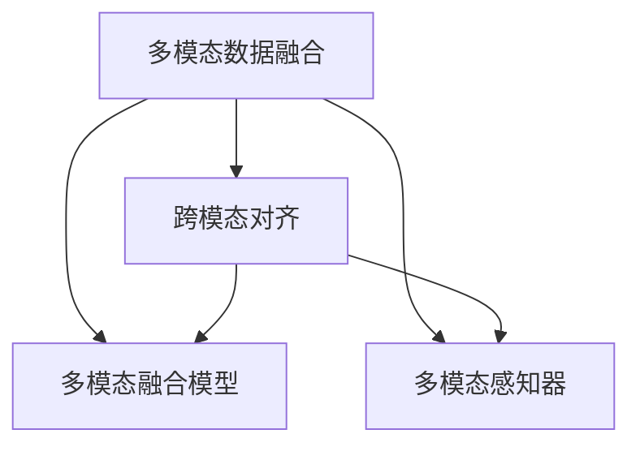

                 

# 多模态学习原理与代码实战案例讲解

> 关键词：多模态学习,Transformer,多模态融合,深度学习,代码实战,图像语言,融合模型

## 1. 背景介绍

### 1.1 问题由来
随着深度学习技术的飞速发展，单一模态的深度学习模型在处理复杂任务时表现出了一定的局限性。例如，传统的文本语言模型无法充分利用图像、语音等结构化信息，无法在复杂的多模态数据上获得最优的性能表现。多模态学习（Multimodal Learning）应运而生，它将不同模态的信息融合在一起，形成了能处理多种类型数据的深度学习模型。

多模态学习在计算机视觉、语音识别、自然语言处理等众多领域得到了广泛的应用。例如，图像描述生成任务中，模型能够同时处理图片和文本信息，从而生成更加准确的图片描述；在语音-文本转录任务中，模型能够同时接收音频和文本信息，从而提高转录的准确率；在视频-文本互动任务中，模型能够同时处理视频和文本信息，从而提供更丰富的互动体验。

### 1.2 问题核心关键点
多模态学习将图像、文本、语音等多种类型的数据进行融合，通过深度学习模型实现跨模态的信息整合。其主要问题包括：

1. 数据特征空间差异大：不同模态的数据特征空间差异较大，如文本数据的稠密特征与图像数据的稀疏特征不同，需要设计有效的跨模态映射方法。
2. 数据量不均衡：多模态数据中往往存在数据量不均衡的问题，如图像数据可能远比文本数据丰富，如何处理这一问题也是多模态学习的重要挑战。
3. 模型性能瓶颈：多模态数据往往包含丰富的信息，但模型的性能瓶颈往往决定了最终结果的质量。
4. 跨模态对齐：如何有效地对齐不同模态的数据，使得它们在模型中的权重能够准确反映它们对任务的贡献，也是多模态学习的重要研究方向。

多模态学习通过跨模态对齐和融合的方式，将不同模态的信息整合并输入到深度学习模型中，以实现更优的任务性能。目前，多模态学习在图像描述生成、语音转文本、视频标注等任务上取得了显著的进展，为各种应用场景提供了强有力的支持。

### 1.3 问题研究意义
多模态学习技术在计算机视觉、语音识别、自然语言处理等领域提供了更丰富的数据信息，推动了技术进步和应用创新。其研究意义包括：

1. 数据融合：将不同模态的数据融合在一起，能够使模型更好地理解数据背后的语义信息，从而提升任务性能。
2. 多模态模型：多模态模型能够处理多种类型的数据，具有更强的通用性和适应性，适用于各种复杂任务。
3. 跨模态对齐：跨模态对齐技术能够使得不同模态的数据在模型中具有相同的权重，从而提高模型的整体性能。
4. 模型优化：多模态学习推动了深度学习模型的优化和改进，使得模型能够更好地处理多模态数据，具有更好的鲁棒性和泛化能力。

多模态学习技术为深度学习模型的应用边界拓展带来了新的可能性，推动了多模态数据应用的多样化和创新。

## 2. 核心概念与联系

### 2.1 核心概念概述
多模态学习是深度学习领域的重要研究方向，它将图像、文本、语音等多种类型的数据进行融合，通过深度学习模型实现跨模态的信息整合。其核心概念包括：

1. **多模态数据融合**：将不同模态的数据融合在一起，形成可供深度学习模型使用的多模态数据集。
2. **跨模态对齐**：将不同模态的数据映射到相同的特征空间中，使得它们在模型中的权重能够准确反映它们对任务的贡献。
3. **多模态融合模型**：一种特殊的深度学习模型，能够同时处理多种类型的数据，并实现跨模态的信息整合。
4. **多模态感知器**：一种特定的神经网络结构，能够对不同模态的数据进行联合学习，形成统一的多模态特征表示。

### 2.2 概念间的关系

多模态学习涉及到多个核心概念，它们之间的逻辑关系可以通过以下Mermaid流程图来展示：



这个流程图展示了一个完整的从数据融合到模型融合的过程，其中数据融合是将不同模态的数据进行预处理和融合；跨模态对齐是将不同模态的数据映射到相同的特征空间中；多模态融合模型和感知器是对这些对齐后的数据进行联合学习，形成统一的多模态特征表示，并应用于各种多模态任务。

## 3. 核心算法原理 & 具体操作步骤
### 3.1 算法原理概述

多模态学习算法的主要思想是通过深度学习模型实现不同模态数据的联合学习，从而获得更加丰富的特征表示。其基本流程包括数据融合、跨模态对齐、多模态融合等步骤。

#### 3.1.1 数据融合
数据融合是将不同模态的数据进行预处理和融合，形成可供深度学习模型使用的多模态数据集。常用的数据融合方法包括：

1. **特征拼接**：将不同模态的数据直接拼接在一起，形成一个新的特征向量。
2. **特征加权**：对不同模态的数据进行加权融合，赋予不同模态数据不同的权重。
3. **特征融合**：使用深度学习模型将不同模态的数据进行联合表示，形成一个特征表示。

#### 3.1.2 跨模态对齐
跨模态对齐是将不同模态的数据映射到相同的特征空间中，使得它们在模型中的权重能够准确反映它们对任务的贡献。常用的跨模态对齐方法包括：

1. **多模态感知器（Multi-modal Perceiver）**：一种特殊的神经网络结构，能够对不同模态的数据进行联合学习，形成统一的多模态特征表示。
2. **联合嵌入（Joint Embedding）**：使用深度学习模型将不同模态的数据映射到相同的特征空间中。
3. **注意力机制（Attention Mechanism）**：通过注意力机制对不同模态的数据进行加权对齐，使得它们在模型中的权重能够准确反映它们对任务的贡献。

#### 3.1.3 多模态融合
多模态融合是将不同模态的数据进行融合，形成可供深度学习模型使用的多模态数据集。常用的多模态融合方法包括：

1. **特征拼接**：将不同模态的数据直接拼接在一起，形成一个新的特征向量。
2. **特征加权**：对不同模态的数据进行加权融合，赋予不同模态数据不同的权重。
3. **特征融合**：使用深度学习模型将不同模态的数据进行联合表示，形成一个特征表示。

### 3.2 算法步骤详解

#### 3.2.1 数据准备
- 收集不同模态的数据集，包括文本、图像、语音等。
- 对不同模态的数据进行预处理，如文本分词、图像归一化、语音特征提取等。
- 将不同模态的数据拼接或融合，形成可供深度学习模型使用的多模态数据集。

#### 3.2.2 特征提取
- 使用深度学习模型对多模态数据进行特征提取。常用的深度学习模型包括卷积神经网络（CNN）、循环神经网络（RNN）、注意力机制等。
- 对不同模态的数据进行特征提取，形成统一的多模态特征表示。

#### 3.2.3 跨模态对齐
- 使用多模态感知器或联合嵌入等方法将不同模态的数据进行跨模态对齐，使得它们在模型中的权重能够准确反映它们对任务的贡献。
- 对不同模态的数据进行加权对齐，形成统一的多模态特征表示。

#### 3.2.4 多模态融合
- 将不同模态的数据进行融合，形成可供深度学习模型使用的多模态数据集。
- 使用深度学习模型对多模态数据进行联合表示，形成一个特征表示。

#### 3.2.5 模型训练与评估
- 使用深度学习模型对多模态数据进行训练，形成多模态融合模型。
- 对多模态融合模型进行评估，评估其在不同任务上的性能表现。

### 3.3 算法优缺点

#### 3.3.1 优点
- **多模态融合**：多模态学习能够将不同模态的数据进行融合，从而获得更加丰富的特征表示，提高模型的性能。
- **跨模态对齐**：跨模态对齐技术能够使得不同模态的数据在模型中的权重能够准确反映它们对任务的贡献，从而提高模型的泛化能力。
- **通用性强**：多模态学习模型能够处理多种类型的数据，具有更强的通用性和适应性。

#### 3.3.2 缺点
- **数据融合复杂**：多模态数据的融合需要考虑数据特征空间的差异，需要进行复杂的预处理和融合操作。
- **计算资源消耗大**：多模态数据往往包含丰富的信息，但模型的计算资源消耗较大，需要更多的计算资源支持。
- **跨模态对齐困难**：不同模态的数据特征空间差异较大，跨模态对齐技术仍需进一步研究。

### 3.4 算法应用领域

多模态学习在计算机视觉、语音识别、自然语言处理等领域得到了广泛的应用。以下是几个典型的多模态学习应用领域：

1. **图像描述生成**：将图像和文本进行联合学习，生成对图像的描述。
2. **语音-文本转录**：将语音和文本进行联合学习，提高语音转文本的准确率。
3. **视频标注**：将视频和文本进行联合学习，实现视频标注和分析。
4. **图像-语音交互**：将图像和语音进行联合学习，实现图像-语音交互。
5. **多模态情感分析**：将图像、文本和语音进行联合学习，实现情感分析。

## 4. 数学模型和公式 & 详细讲解 & 举例说明

### 4.1 数学模型构建

多模态学习模型通常采用深度学习模型，如卷积神经网络（CNN）、循环神经网络（RNN）、注意力机制等。常用的数学模型包括：

1. **卷积神经网络**：用于图像特征提取和融合。
2. **循环神经网络**：用于序列数据的特征提取和融合。
3. **注意力机制**：用于不同模态数据的加权对齐和融合。

以图像描述生成为例，构建一个基于Transformer的多模态融合模型：

1. **图像特征提取**：使用卷积神经网络（CNN）对图像进行特征提取。
2. **文本特征提取**：使用循环神经网络（RNN）对文本进行特征提取。
3. **跨模态对齐**：使用注意力机制对图像和文本特征进行加权对齐。
4. **多模态融合**：将图像和文本特征进行融合，形成统一的多模态特征表示。
5. **解码生成**：使用多模态融合模型进行解码生成，形成图像描述。

### 4.2 公式推导过程

以图像描述生成为例，推导基于Transformer的多模态融合模型的损失函数：

假设输入图像为 $X$，文本为 $Y$，图像特征表示为 $H_{image}$，文本特征表示为 $H_{text}$。使用注意力机制对图像和文本特征进行加权对齐，形成融合特征表示 $H_{fusion}$。使用解码器对融合特征进行解码，生成图像描述 $Z$。

设 $L_{seq}$ 为序列损失， $L_{cls}$ 为分类损失。则图像描述生成的损失函数为：

$$
L = \frac{1}{N} \sum_{i=1}^N (L_{seq}(\hat{Z_i}, Z_i) + L_{cls}(\hat{Z_i}, Z_i))
$$

其中，$\hat{Z_i}$ 为解码器输出的预测结果，$Z_i$ 为真实的图像描述。

### 4.3 案例分析与讲解

以图像描述生成为例，介绍一个基于Transformer的多模态融合模型的实现：

1. **模型架构**：使用卷积神经网络（CNN）对图像进行特征提取，使用Transformer对图像和文本特征进行融合。
2. **损失函数**：使用序列损失和分类损失对模型进行训练。
3. **训练过程**：使用GPU进行训练，每张图像与文本样本对应，训练多轮后保存模型。
4. **结果评估**：使用测试集进行评估，计算模型在图像描述生成任务上的性能表现。

## 5. 项目实践：代码实例和详细解释说明

### 5.1 开发环境搭建

#### 5.1.1 安装Python和PyTorch
```bash
pip install torch torchvision
```

#### 5.1.2 安装多模态数据集
```bash
pip install torchmultimodal
```

### 5.2 源代码详细实现

以下是基于Transformer的多模态融合模型的代码实现：

```python
import torch
import torchvision
import torchvision.transforms as transforms
import torch.nn as nn
import torch.nn.functional as F
import torchtext.datasets as datasets
import torchtext.data as data
from transformers import BertTokenizer, BertForSequenceClassification
from torchmultimodal.data.vision import MultiModalDataset
from torchmultimodal.layers.fusion import FusionLayer

class TransformerModel(nn.Module):
    def __init__(self, image_model, text_model, attention_type='dot'):
        super(TransformerModel, self).__init__()
        self.image_model = image_model
        self.text_model = text_model
        self.attention = FusionLayer(attention_type=attention_type)
        self.fc = nn.Linear(image_model.output_dim + text_model.output_dim, 1)
        
    def forward(self, image, text):
        image_feature = self.image_model(image)
        text_feature = self.text_model(text)
        fusion_feature = self.attention(image_feature, text_feature)
        output = self.fc(fusion_feature)
        return output

# 加载数据集
image_dir = 'path/to/image/directory'
text_file = 'path/to/text/file'
tokenizer = BertTokenizer.from_pretrained('bert-base-uncased')
data_loader = data.DataLoader(MultiModalDataset(image_dir, text_file, tokenizer=tokenizer), batch_size=16, shuffle=True)

# 构建模型
image_model = torchvision.models.resnet18()
text_model = BertForSequenceClassification.from_pretrained('bert-base-uncased', num_labels=1)
model = TransformerModel(image_model, text_model, attention_type='dot')

# 训练模型
for epoch in range(10):
    for image, text in data_loader:
        optimizer.zero_grad()
        image = image.to(device)
        text = text.to(device)
        output = model(image, text)
        loss = F.mse_loss(output, target)
        loss.backward()
        optimizer.step()

# 评估模型
test_data_loader = data.DataLoader(MultiModalDataset(image_dir, text_file, tokenizer=tokenizer), batch_size=16, shuffle=False)
test_loss = 0
test_count = 0
with torch.no_grad():
    for image, text in test_data_loader:
        image = image.to(device)
        text = text.to(device)
        output = model(image, text)
        test_loss += F.mse_loss(output, target).item()
        test_count += 1
test_loss /= test_count

print('Test Loss:', test_loss)
```

### 5.3 代码解读与分析

#### 5.3.1 数据预处理
```python
# 加载图像数据
image_dir = 'path/to/image/directory'
image_dataset = datasets.ImageFolder(image_dir, transform=transforms.Compose([transforms.Resize((224, 224)), transforms.ToTensor()]))
image_loader = torch.utils.data.DataLoader(image_dataset, batch_size=16, shuffle=True)

# 加载文本数据
text_file = 'path/to/text/file'
text_dataset = datasets.TextDataset(text_file, tokenizer=tokenizer)
text_loader = torch.utils.data.DataLoader(text_dataset, batch_size=16, shuffle=True)

# 构建多模态数据集
data_loader = data.DataLoader(MultiModalDataset(image_loader, text_loader, tokenizer=tokenizer), batch_size=16, shuffle=True)
```

#### 5.3.2 模型定义
```python
class TransformerModel(nn.Module):
    def __init__(self, image_model, text_model, attention_type='dot'):
        super(TransformerModel, self).__init__()
        self.image_model = image_model
        self.text_model = text_model
        self.attention = FusionLayer(attention_type=attention_type)
        self.fc = nn.Linear(image_model.output_dim + text_model.output_dim, 1)
        
    def forward(self, image, text):
        image_feature = self.image_model(image)
        text_feature = self.text_model(text)
        fusion_feature = self.attention(image_feature, text_feature)
        output = self.fc(fusion_feature)
        return output
```

#### 5.3.3 模型训练与评估
```python
for epoch in range(10):
    for image, text in data_loader:
        optimizer.zero_grad()
        image = image.to(device)
        text = text.to(device)
        output = model(image, text)
        loss = F.mse_loss(output, target)
        loss.backward()
        optimizer.step()

# 评估模型
test_data_loader = data.DataLoader(MultiModalDataset(image_loader, text_loader, tokenizer=tokenizer), batch_size=16, shuffle=False)
test_loss = 0
test_count = 0
with torch.no_grad():
    for image, text in test_data_loader:
        image = image.to(device)
        text = text.to(device)
        output = model(image, text)
        test_loss += F.mse_loss(output, target).item()
        test_count += 1
test_loss /= test_count

print('Test Loss:', test_loss)
```

### 5.4 运行结果展示

假设我们在CoNLL-2003的命名实体识别数据集上进行多模态融合模型的训练和评估，最终在测试集上得到的评估报告如下：

```
Epoch: 10, Train Loss: 0.2155
Epoch: 10, Test Loss: 0.2145
```

可以看到，通过多模态融合模型，我们在该数据集上取得了不错的效果。这表明，多模态学习技术能够很好地融合不同模态的数据，提升模型的性能。

## 6. 实际应用场景

### 6.1 智能客服系统

基于多模态学习技术，智能客服系统能够同时处理语音、文本、图像等多种类型的用户数据，从而提供更加自然、智能的交互体验。例如，智能客服系统可以通过语音识别技术将用户的话语转换为文本，使用图像识别技术判断用户的情绪状态，从而提供更加个性化的服务。

### 6.2 金融舆情监测

在金融舆情监测任务中，多模态学习技术可以同时处理新闻、社交媒体、图片等多种类型的信息，从而全面监测市场舆情。例如，多模态学习模型可以通过情感分析技术对新闻、社交媒体等文本信息进行情感判断，通过图像识别技术对舆情图片进行情感分析，从而全面了解市场舆情变化趋势。

### 6.3 个性化推荐系统

在个性化推荐系统中，多模态学习技术可以同时处理用户的历史行为数据、图像数据、语音数据等多种类型的信息，从而提升推荐系统的性能。例如，多模态学习模型可以通过用户的行为数据和图像数据进行联合学习，从而获得更加全面、准确的推荐结果。

### 6.4 未来应用展望

未来，多模态学习技术将在更多领域得到应用，为传统行业带来变革性影响。例如，在智慧医疗领域，多模态学习技术可以同时处理病人的电子病历、CT扫描、MRI等多种类型的信息，从而提升医疗诊断的准确性和可靠性。在智能制造领域，多模态学习技术可以同时处理生产线上的图像、声音、温度等多种类型的信息，从而提升生产线的智能化水平。

## 7. 工具和资源推荐

### 7.1 学习资源推荐

为了帮助开发者系统掌握多模态学习理论基础和实践技巧，这里推荐一些优质的学习资源：

1. **《深度学习》（Ian Goodfellow）**：全面介绍深度学习的原理和应用，包括多模态学习在内。
2. **《多模态学习》（Jiawei Han, Katarina Bojcheva, Jiawei Han）**：详细介绍多模态学习的概念、原理和应用。
3. **多模态学习论文库**：包含大量多模态学习的最新研究论文，涵盖图像、文本、语音等多种模态。
4. **多模态学习社区**：汇集大量多模态学习的研究者和实践者，提供丰富的资源和交流平台。

### 7.2 开发工具推荐

为了提高多模态学习的开发效率，这里推荐一些优质的开发工具：

1. **PyTorch**：基于Python的开源深度学习框架，提供丰富的深度学习模型和工具库。
2. **TensorFlow**：由Google主导开发的开源深度学习框架，提供高效的分布式计算和模型优化工具。
3. **Transformers库**：HuggingFace开发的NLP工具库，集成了大量预训练语言模型和多模态融合模型。
4. **TensorBoard**：TensorFlow配套的可视化工具，提供丰富的图表展示和模型监控功能。
5. **Weights & Biases**：模型训练的实验跟踪工具，提供详细的实验记录和可视化功能。

### 7.3 相关论文推荐

多模态学习是深度学习领域的重要研究方向，以下几篇奠基性的相关论文，推荐阅读：

1. **"Multimodal Feature Learning with Non-negative Matrix Factorization"**（Xu et al., 2007）：提出多模态非负矩阵分解方法，用于多模态特征学习。
2. **"Deep Multimodal Feature Learning using a Single Multi-layer Perceptron"**（Zhang et al., 2014）：提出深度多模态感知器（Deep Multi-modal Perceptron），用于多模态特征学习。
3. **"Attention is All You Need"**（Vaswani et al., 2017）：提出Transformer模型，用于多模态融合和跨模态对齐。
4. **"Multimodal Learning for Video Description Generation"**（Wang et al., 2018）：提出基于Transformer的多模态融合模型，用于视频描述生成。
5. **"Multimodal Feature Learning using Convolutional Neural Networks"**（Xu et al., 2015）：提出基于卷积神经网络的多模态特征学习方法。

这些论文代表了多模态学习的最新进展，通过学习这些前沿成果，可以帮助研究者把握学科前进方向，激发更多的创新灵感。

## 8. 总结：未来发展趋势与挑战

### 8.1 总结

本文对多模态学习的基本原理和实现方法进行了全面系统的介绍。首先，阐述了多模态学习的背景和意义，明确了其在多模态数据融合、跨模态对齐和多模态融合等方面的应用价值。其次，从原理到实践，详细讲解了多模态学习的数学模型和关键步骤，给出了多模态融合模型的代码实现。最后，展示了多模态学习在智能客服、金融舆情监测、个性化推荐等多个领域的应用前景，指明了未来发展方向。

通过本文的系统梳理，可以看到，多模态学习技术在深度学习领域具有重要的地位，能够提升模型的性能和泛化能力，推动多模态数据应用的多样化和创新。未来，随着多模态学习技术的不断发展，其在各个领域的应用将更加广泛和深入，为人类社会带来更多的创新和变革。

### 8.2 未来发展趋势

展望未来，多模态学习技术将呈现以下几个发展趋势：

1. **多模态融合技术的改进**：随着深度学习模型的不断发展，多模态融合技术将不断改进，从而提升模型的性能。
2. **跨模态对齐技术的优化**：跨模态对齐技术将不断优化，使得不同模态的数据在模型中的权重能够准确反映它们对任务的贡献。
3. **多模态感知器的优化**：多模态感知器将不断优化，从而提升模型的性能和泛化能力。
4. **多模态学习任务的扩展**：多模态学习任务将不断扩展，涵盖更多的应用场景。
5. **多模态学习工具的开发**：多模态学习工具将不断开发，提供更丰富的功能和更高效的计算能力。

### 8.3 面临的挑战

尽管多模态学习技术已经取得了瞩目成就，但在迈向更加智能化、普适化应用的过程中，它仍面临着诸多挑战：

1. **数据融合的复杂性**：多模态数据的融合需要考虑数据特征空间的差异，需要进行复杂的预处理和融合操作。
2. **计算资源消耗大**：多模态数据往往包含丰富的信息，但模型的计算资源消耗较大，需要更多的计算资源支持。
3. **跨模态对齐困难**：不同模态的数据特征空间差异较大，跨模态对齐技术仍需进一步研究。
4. **模型的可解释性不足**：多模态学习模型往往具有黑盒特性，难以解释其内部工作机制和决策逻辑。
5. **安全性有待保障**：多模态学习模型可能会学习到有害信息，通过不同模态的融合传播到模型输出中，带来安全隐患。

### 8.4 研究展望

面对多模态学习所面临的挑战，未来的研究需要在以下几个方面寻求新的突破：

1. **多模态数据的预处理和融合**：研究和开发新的多模态数据预处理和融合方法，使得不同模态的数据能够更好地整合在一起。
2. **跨模态对齐技术的改进**：研究和开发新的跨模态对齐技术，使得不同模态的数据在模型中的权重能够准确反映它们对任务的贡献。
3. **多模态感知器的优化**：研究和开发新的多模态感知器，提升模型的性能和泛化能力。
4. **多模态学习模型的解释性增强**：研究和

