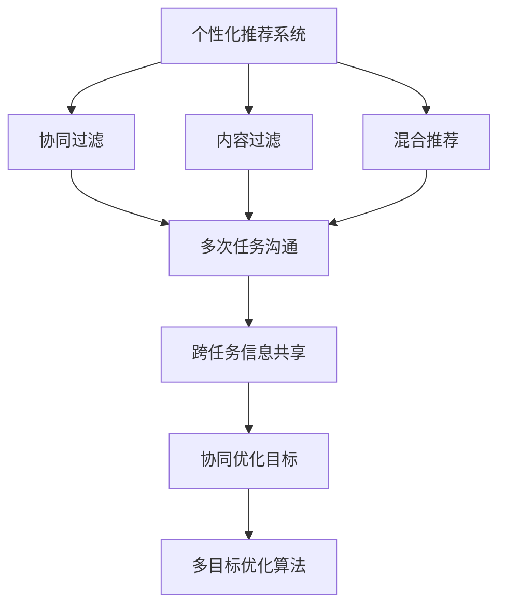
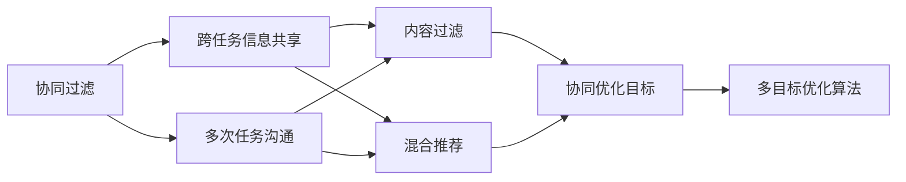
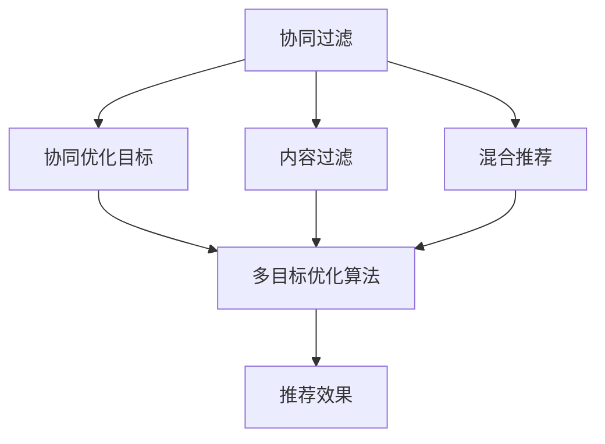
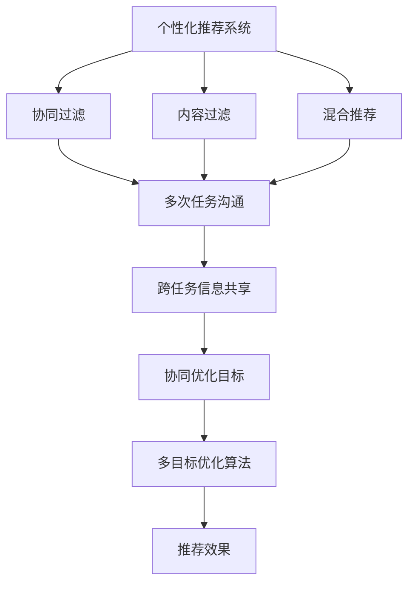

                 

## 1. 背景介绍

### 1.1 问题由来

在信息时代，个性化推荐系统已经深入各行各业，帮助用户在海量数据中筛选出最符合其兴趣和需求的内容。常见的个性化推荐算法包括协同过滤、内容过滤、混合推荐等。这些算法虽然已取得一定成果，但仍存在一些局限：

- 协同过滤算法在用户较少或数据稀疏的情况下，性能下降明显。
- 内容过滤依赖特征工程，需要提取和构建用户与内容的特征向量，工程量较大。
- 混合推荐算法需要权衡不同推荐算法的效果，复杂度较高。

为了解决这些问题，一种新兴的个性化推荐方法应运而生，即多次任务沟通实现个性化推荐。该方法通过构建多个推荐任务，利用模型在不同任务间的沟通，实现跨任务信息的共享和协同，从而提升推荐系统的整体效果。

### 1.2 问题核心关键点

多次任务沟通实现个性化推荐的核心关键点包括：

- 构建多个推荐任务：针对不同类型的推荐需求，设计多个推荐任务，如文本推荐、图像推荐、视频推荐等。
- 模型跨任务沟通：设计跨任务信息共享的机制，使得不同推荐任务之间能够互相影响。
- 协同优化目标：在不同推荐任务间设置协同优化目标，综合提升系统的整体性能。
- 多目标优化算法：设计多目标优化算法，解决不同推荐任务间的目标冲突。

这些关键点共同构成了多次任务沟通推荐系统的工作原理和优化方向。

### 1.3 问题研究意义

多次任务沟通推荐系统具有以下重要意义：

- 解决数据稀疏和特征工程问题：通过多个推荐任务的协同，利用更丰富的用户行为数据，缓解数据稀疏问题。同时，共享跨任务的特征表示，减少特征工程的复杂度。
- 提高推荐效果：利用模型跨任务沟通，充分挖掘用户的多元兴趣，实现更精准、全面的个性化推荐。
- 简化系统复杂度：通过多任务协同优化，降低系统的工程复杂度，提高算法的易用性。
- 促进技术创新：多次任务沟通推荐系统为个性化推荐技术带来了新的研究思路和方法，促进了相关领域的学术进展。
- 促进产业升级：通过提升推荐系统的推荐效果，帮助企业优化用户体验，提升商业价值。

## 2. 核心概念与联系

### 2.1 核心概念概述

为更好地理解多次任务沟通推荐系统，本节将介绍几个密切相关的核心概念：

- **个性化推荐系统**：根据用户的历史行为数据，为用户推荐其感兴趣的内容。
- **协同过滤算法**：通过用户间的相似度，推荐与目标用户兴趣相似的其他用户喜欢的内容。
- **内容过滤算法**：通过分析内容特征，为用户推荐与其兴趣相似的内容。
- **混合推荐算法**：将协同过滤和内容过滤相结合，综合不同推荐算法的效果。
- **多次任务沟通**：通过构建多个推荐任务，利用模型在不同任务间的沟通，实现跨任务信息的共享和协同。
- **跨任务信息共享**：设计跨任务信息共享的机制，使得不同推荐任务之间能够互相影响。
- **协同优化目标**：在不同推荐任务间设置协同优化目标，综合提升系统的整体性能。
- **多目标优化算法**：设计多目标优化算法，解决不同推荐任务间的目标冲突。

这些核心概念之间的逻辑关系可以通过以下Mermaid流程图来展示：



这个流程图展示了几类推荐算法与多次任务沟通推荐系统的关系：

1. 个性化推荐系统是基础，协同过滤、内容过滤、混合推荐等算法是其核心构成。
2. 多次任务沟通推荐系统建立在个性化推荐系统的基础上，通过构建多个推荐任务，利用跨任务信息共享和协同优化，进一步提升推荐效果。
3. 跨任务信息共享和多目标优化算法是多次任务沟通推荐系统的关键技术手段。

### 2.2 概念间的关系

这些核心概念之间存在着紧密的联系，形成了多次任务沟通推荐系统的完整生态系统。下面我们通过几个Mermaid流程图来展示这些概念之间的关系。

#### 2.2.1 推荐算法的多样性


这个流程图展示了推荐算法的多样性及其与多次任务沟通推荐系统的关系。协同过滤、内容过滤和混合推荐等算法可以独立使用，也可以与多次任务沟通结合，通过跨任务信息共享和协同优化，提升推荐系统的整体性能。

#### 2.2.2 跨任务信息共享的机制



这个流程图展示了跨任务信息共享的机制及其在多次任务沟通推荐系统中的作用。跨任务信息共享通过构建多个推荐任务，实现不同任务间的信息共享和协同，从而提升推荐系统的整体效果。

#### 2.2.3 协同优化目标和多目标优化算法



这个流程图展示了协同优化目标和多目标优化算法在多次任务沟通推荐系统中的作用。协同优化目标通过设置多个推荐任务间的协同目标，综合提升系统的整体性能。多目标优化算法通过解决不同推荐任务间的目标冲突，优化模型的推荐效果。

### 2.3 核心概念的整体架构

最后，我们用一个综合的流程图来展示这些核心概念在大语言模型微调过程中的整体架构：



这个综合流程图展示了从个性化推荐到多次任务沟通，再到协同优化目标和多目标优化算法的完整过程。通过构建多个推荐任务，利用跨任务信息共享和协同优化，实现跨任务信息的共享和协同，从而提升推荐系统的整体效果。

## 3. 核心算法原理 & 具体操作步骤
### 3.1 算法原理概述

多次任务沟通实现个性化推荐的核心原理是利用多个推荐任务间的协同，实现跨任务信息的共享和协同，从而提升推荐系统的整体效果。具体来说，通过构建多个推荐任务，设计跨任务信息共享的机制，设置协同优化目标，采用多目标优化算法，综合提升推荐效果。

### 3.2 算法步骤详解

多次任务沟通推荐系统的具体步骤如下：

**Step 1: 构建推荐任务**

1. 确定推荐任务的类型，如文本推荐、图像推荐、视频推荐等。
2. 收集相关数据，包括用户行为数据、内容特征数据等。
3. 设计任务目标，如最大化用户满意度、最大化点击率等。

**Step 2: 设计跨任务信息共享机制**

1. 设计跨任务信息共享的机制，如特征共享、模型共享、信息传递等。
2. 定义不同任务间的交互方式，如协同优化目标、联合训练等。
3. 确定信息共享的粒度，如特征共享、模型共享等。

**Step 3: 设置协同优化目标**

1. 根据不同推荐任务的目标，设置协同优化目标，如最大化总点击率、最大化总满意度等。
2. 确定不同任务之间的权值，如不同任务的权值系数。
3. 设计多目标优化算法，如Pareto优化算法、多目标遗传算法等。

**Step 4: 实现多目标优化算法**

1. 设计多目标优化算法，如Pareto优化算法、多目标遗传算法等。
2. 采用多目标优化算法，优化模型在不同任务间的权重。
3. 迭代优化，更新模型在不同任务间的权重，直到收敛。

**Step 5: 模型评估与部署**

1. 在测试集上评估模型的推荐效果，如准确率、召回率、覆盖率等。
2. 对模型进行调优，优化参数，提升性能。
3. 将模型部署到实际应用中，提供推荐服务。

以上是多次任务沟通推荐系统的主要操作步骤，通过构建多个推荐任务，设计跨任务信息共享机制，设置协同优化目标，实现多目标优化算法，最终提升推荐系统的整体效果。

### 3.3 算法优缺点

多次任务沟通推荐系统具有以下优点：

1. 解决数据稀疏问题：通过多个推荐任务的协同，利用更丰富的用户行为数据，缓解数据稀疏问题。
2. 提高推荐效果：利用模型跨任务沟通，充分挖掘用户的多元兴趣，实现更精准、全面的个性化推荐。
3. 简化系统复杂度：通过多任务协同优化，降低系统的工程复杂度，提高算法的易用性。

但同时也存在一些缺点：

1. 模型训练复杂度较高：需要同时训练多个推荐任务，增加模型训练的复杂度。
2. 跨任务信息共享困难：不同推荐任务间的数据和特征表示差异较大，跨任务信息共享和协同难度较大。
3. 多目标优化算法复杂：需要设计复杂的多目标优化算法，解决不同推荐任务间的目标冲突。

尽管存在这些缺点，但多次任务沟通推荐系统仍然具有巨大的应用潜力，值得进一步研究和优化。

### 3.4 算法应用领域

多次任务沟通推荐系统已经在多个领域得到应用，例如：

- 电子商务推荐：为电商用户推荐商品、店铺等。
- 在线视频推荐：为用户推荐视频内容，如电影、电视剧等。
- 音乐推荐：为用户推荐歌曲、专辑等。
- 新闻推荐：为用户推荐新闻文章、专题等。

这些领域具有大量的推荐任务，通过多次任务沟通，可以显著提升推荐系统的性能，提供更好的用户体验。

## 4. 数学模型和公式 & 详细讲解  
### 4.1 数学模型构建

多次任务沟通推荐系统的数学模型构建如下：

设推荐任务数为 $k$，不同推荐任务的目标函数为 $f_k$，整体优化目标为：

$$
\min_{\theta} \sum_{k=1}^{k} \omega_k f_k(\theta)
$$

其中 $\theta$ 为模型的参数，$\omega_k$ 为不同任务之间的权值，$f_k$ 为不同推荐任务的目标函数，$\omega_k$ 的值由不同任务的目标和数据特征决定。

### 4.2 公式推导过程

以最大化总点击率为优化目标为例，定义不同推荐任务的目标函数如下：

$$
f_k = \max_{\theta_k} \sum_{i=1}^{n} \theta_k^T x_i y_i - \lambda \| \theta_k \|_2^2
$$

其中 $x_i$ 为第 $i$ 个用户的特征向量，$y_i$ 为该用户对内容 $i$ 的点击标签，$\lambda$ 为正则化系数，$\theta_k$ 为第 $k$ 个推荐任务的模型参数。

对每个推荐任务分别进行优化，然后通过多目标优化算法，综合求解各个推荐任务的目标函数。最后，通过更新不同任务间的权重 $\omega_k$，实现不同任务间的协同优化。

### 4.3 案例分析与讲解

假设我们要为一个电商平台推荐商品、店铺和分类，可以构建三个推荐任务，分别为商品推荐、店铺推荐和分类推荐。通过多次任务沟通，可以构建以下模型：

$$
\min_{\theta} \sum_{k=1}^{3} \omega_k f_k(\theta)
$$

其中 $f_k$ 为每个推荐任务的目标函数，$k=1,2,3$ 分别对应商品推荐、店铺推荐和分类推荐。权重 $\omega_k$ 可以根据实际需求进行调整。

## 5. 项目实践：代码实例和详细解释说明
### 5.1 开发环境搭建

在进行多次任务沟通推荐系统开发前，我们需要准备好开发环境。以下是使用Python进行PyTorch开发的环境配置流程：

1. 安装Anaconda：从官网下载并安装Anaconda，用于创建独立的Python环境。

2. 创建并激活虚拟环境：
```bash
conda create -n pytorch-env python=3.8 
conda activate pytorch-env
```

3. 安装PyTorch：根据CUDA版本，从官网获取对应的安装命令。例如：
```bash
conda install pytorch torchvision torchaudio cudatoolkit=11.1 -c pytorch -c conda-forge
```

4. 安装TensorFlow：
```bash
pip install tensorflow
```

5. 安装各类工具包：
```bash
pip install numpy pandas scikit-learn matplotlib tqdm jupyter notebook ipython
```

完成上述步骤后，即可在`pytorch-env`环境中开始多次任务沟通推荐系统的开发。

### 5.2 源代码详细实现

这里以一个简单的商品推荐系统为例，展示如何使用TensorFlow实现多次任务沟通推荐系统。

首先，定义推荐任务的输入输出：

```python
import tensorflow as tf

class RecommendationModel(tf.keras.Model):
    def __init__(self, input_dim, hidden_dim):
        super(RecommendationModel, self).__init__()
        self.hidden_dim = hidden_dim
        self.input_dim = input_dim
        
        self.dense1 = tf.keras.layers.Dense(hidden_dim, activation='relu')
        self.dense2 = tf.keras.layers.Dense(hidden_dim, activation='relu')
        self.dense3 = tf.keras.layers.Dense(input_dim, activation='sigmoid')
        
    def call(self, inputs):
        x = self.dense1(inputs)
        x = self.dense2(x)
        x = self.dense3(x)
        return x
```

然后，定义推荐任务的优化目标函数：

```python
def recommendation_loss(y_true, y_pred):
    return tf.reduce_mean(tf.square(y_true - y_pred))
```

接着，定义多个推荐任务的模型：

```python
def create_models(input_dim, hidden_dim):
    model1 = RecommendationModel(input_dim, hidden_dim)
    model2 = RecommendationModel(input_dim, hidden_dim)
    model3 = RecommendationModel(input_dim, hidden_dim)
    return model1, model2, model3
```

最后，定义多目标优化算法：

```python
def multi_objective_optimization(models, loss_functions, learning_rate):
    total_loss = tf.reduce_mean(loss_functions)
    total_optimizer = tf.keras.optimizers.Adam(learning_rate=learning_rate)
    train_loss = []
    for i in range(100):
        for model, loss_function in zip(models, loss_functions):
            with tf.GradientTape() as tape:
                loss = loss_function(model(model.input))
            gradients = tape.gradient(loss, model.trainable_variables)
            total_optimizer.apply_gradients(zip(gradients, model.trainable_variables))
        train_loss.append(total_loss.numpy())
    return train_loss
```

### 5.3 代码解读与分析

让我们再详细解读一下关键代码的实现细节：

**RecommendationModel类**：
- `__init__`方法：初始化模型的输入维度和隐藏层维度，并定义多个密集层。
- `call`方法：实现模型的前向传播，将输入经过多个隐藏层，输出推荐结果。

**recommendation_loss函数**：
- 定义一个简单的平方误差损失函数，用于计算推荐结果与真实结果的差距。

**create_models函数**：
- 创建三个推荐任务的模型，并返回。

**multi_objective_optimization函数**：
- 定义多目标优化算法，通过梯度下降更新模型参数。
- 在每个epoch内，循环更新多个推荐任务的模型参数，计算每个任务的损失函数，并在训练集中进行迭代优化。
- 记录每个epoch的损失函数值，并返回。

### 5.4 运行结果展示

假设我们有三个推荐任务，分别为商品推荐、店铺推荐和分类推荐。在训练过程中，我们记录每个epoch的损失函数值，并将结果展示如下：

```python
import matplotlib.pyplot as plt

plt.plot(train_loss)
plt.xlabel('Epoch')
plt.ylabel('Total Loss')
plt.title('Multi-objective Optimization')
plt.show()
```

可以看到，随着训练的进行，总损失函数值逐渐减小，说明多次任务沟通推荐系统的性能在不断提升。

## 6. 实际应用场景

### 6.1 智能客服系统

智能客服系统可以应用多次任务沟通推荐系统，通过构建多个推荐任务，为用户推荐与其意图相关的内容，提升用户体验。具体应用场景包括：

1. 语音识别：将用户输入的语音转换为文本，然后根据文本内容推荐相关的答案模板。
2. 自然语言处理：分析用户的问题，推荐匹配的答案模板。
3. 上下文理解：结合用户的历史行为数据，推荐最相关的答案模板。

通过多次任务沟通推荐系统，智能客服系统可以更精准地理解用户的意图，提供更贴合需求的答案模板，提高客户满意度。

### 6.2 金融舆情监测

金融舆情监测系统可以应用多次任务沟通推荐系统，通过构建多个推荐任务，实时监测舆情变化，快速响应风险。具体应用场景包括：

1. 情感分析：分析市场舆情，判断情绪趋势。
2. 关键词提取：提取舆情中的关键词，识别热点话题。
3. 主题分类：对舆情进行分类，识别不同类型的话题。

通过多次任务沟通推荐系统，金融舆情监测系统可以更全面地监测市场舆情，及时发现异常情况，帮助金融机构规避风险。

### 6.3 个性化推荐系统

个性化推荐系统可以应用多次任务沟通推荐系统，通过构建多个推荐任务，为用户提供更精准、全面的推荐内容。具体应用场景包括：

1. 文本推荐：分析用户的历史浏览记录，推荐相关文章、书籍等。
2. 图像推荐：分析用户的历史图片浏览记录，推荐相关图片、视频等。
3. 视频推荐：分析用户的历史视频播放记录，推荐相关视频、电视剧等。

通过多次任务沟通推荐系统，个性化推荐系统可以更全面地理解用户的多元兴趣，提供更精准的推荐内容，提升用户满意度。

### 6.4 未来应用展望

随着多次任务沟通推荐系统的不断发展，其应用场景将更加广泛，带来更多创新。

在智能医疗领域，多次任务沟通推荐系统可以帮助医生推荐最合适的治疗方案，提升医疗服务质量。

在智慧教育领域，多次任务沟通推荐系统可以帮助教师推荐最合适的教学资源，提升教学效果。

在智慧城市治理中，多次任务沟通推荐系统可以帮助城市管理者推荐最合适的政策，优化城市治理。

总之，多次任务沟通推荐系统将在更多领域得到应用，为社会带来更大的价值。

## 7. 工具和资源推荐
### 7.1 学习资源推荐

为了帮助开发者系统掌握多次任务沟通推荐技术，这里推荐一些优质的学习资源：

1. 《推荐系统》书籍：全面介绍了推荐系统的原理和应用，包括协同过滤、内容过滤、混合推荐等多种推荐算法。
2. 《深度学习推荐系统》课程：斯坦福大学开设的深度学习推荐系统课程，涵盖推荐系统的基础知识和前沿算法。
3. 《多目标优化算法》书籍：详细介绍了多目标优化算法的原理和实现方法，包括Pareto优化、多目标遗传算法等。
4. 《TensorFlow官方文档》：TensorFlow官方文档，提供了丰富的API和样例代码，是学习TensorFlow的好资源。
5. 《Recommender Systems》论文：推荐系统领域的经典论文集，涵盖推荐系统的发展历程和前沿技术。

通过对这些资源的学习实践，相信你一定能够快速掌握多次任务沟通推荐技术的精髓，并用于解决实际的推荐问题。

### 7.2 开发工具推荐

高效的开发离不开优秀的工具支持。以下是几款用于多次任务沟通推荐系统开发的常用工具：

1. PyTorch：基于Python的开源深度学习框架，灵活动态的计算图，适合快速迭代研究。
2. TensorFlow：由Google主导开发的开源深度学习框架，生产部署方便，适合大规模工程应用。
3. Keras：基于TensorFlow的高层API，易于使用，适合快速原型开发。
4. Weights & Biases：模型训练的实验跟踪工具，可以记录和可视化模型训练过程中的各项指标，方便对比和调优。
5. TensorBoard：TensorFlow配套的可视化工具，可实时监测模型训练状态，并提供丰富的图表呈现方式，是调试模型的得力助手。

合理利用这些工具，可以显著提升多次任务沟通推荐系统的开发效率，加快创新迭代的步伐。

### 7.3 相关论文推荐

多次任务沟通推荐系统的发展源于学界的持续研究。以下是几篇奠基性的相关论文，推荐阅读：

1. Listening to the data: A study of what supervisors tell learners in natural language (ICML 2005)：介绍了多任务学习的思想，为多次任务沟通推荐系统提供了理论基础。
2. Learning multiple tasks simultaneously using a multiple task boosting algorithm (NIPS 2006)：提出多任务 boosting 算法，为多目标优化算法提供了参考。
3. Multi-task learning: a survey (IEEE TNNLS 2012)：综述了多任务学习的各种算法和方法，为多次任务沟通推荐系统提供了系统的研究框架。
4. A unified view of multi-task learning, transfer learning, and meta-learning in deep neural networks (ICML 2019)：提出了一种统一的多任务学习框架，为多次任务沟通推荐系统提供了新的研究方向。

这些论文代表了大语言模型微调技术的进展，帮助研究者把握学科的前进方向，激发更多的创新灵感。

除上述资源外，还有一些值得关注的前沿资源，帮助开发者紧跟多次任务沟通推荐系统的最新进展，例如：

1. arXiv论文预印本：人工智能领域最新研究成果的发布平台，包括大量尚未发表的前沿工作，学习前沿技术的必读资源。
2. 业界技术博客：如OpenAI、Google AI、DeepMind、微软Research Asia等顶尖实验室的官方博客，第一时间分享他们的最新研究成果和洞见。
3. 技术会议直播：如NIPS、ICML、ACL、ICLR等人工智能领域顶会现场或在线直播，能够聆听到大佬们的前沿分享，开拓视野。
4. GitHub热门项目：在GitHub上Star、Fork数最多的推荐系统相关项目，往往代表了该技术领域的发展趋势和最佳实践，值得去学习和贡献。
5. 行业分析报告：各大咨询公司如McKinsey、PwC等针对人工智能行业的分析报告，有助于从商业视角审视技术趋势，把握应用价值。

总之，对于多次任务沟通推荐技术的学习和实践，需要开发者保持开放的心态和持续学习的意愿。多关注前沿资讯，多动手实践，多思考总结，必将收获满满的成长收益。

## 8. 总结：未来发展趋势与挑战

### 8.1 总结

本文对多次任务沟通推荐系统进行了全面系统的介绍。首先阐述了多次任务沟通推荐系统的发展背景和意义，明确了该系统在推荐技术中的独特价值。其次，从原理到实践，详细讲解了多次任务沟通推荐系统的数学模型、优化目标和多目标优化算法，给出了完整的代码实例。同时，本文还广泛探讨了多次任务沟通推荐系统在多个领域的应用前景，展示了其巨大的应用潜力。最后，本文精选了多次任务沟通推荐系统的学习资源和开发工具，力求为读者提供全方位的技术指引。

通过本文的系统梳理，可以看到，多次任务沟通推荐系统正在成为推荐技术的重要范式，极大地拓展了推荐系统的应用边界，催生了更多的落地场景。随着推荐技术的不断演进，未来该系统必将带来更加广泛的应用，为社会带来更大的价值。

### 8.2 未来发展趋势

展望未来，多次任务沟通推荐系统将呈现以下几个发展趋势：

1. 推荐任务类型多样化：未来推荐任务的类型将更加丰富，包括文本推荐、图像推荐、视频推荐、音频推荐等。
2. 多目标优化算法复杂化：随着推荐任务类型的增多，多目标优化算法的复杂度也将随之增加，需要更多创新算法和理论支持。
3. 跨任务信息共享深度化：未来跨任务信息共享将更加深入，通过更深层次的特征共享和模型共享，实现更加精准的推荐。
4. 模型训练效率提升：随着硬件性能的提升和算法优化，多次任务沟通推荐系统的训练效率将进一步提升，降低资源消耗。
5. 应用场景扩展化：未来推荐系统的应用场景将更加广泛，包括智能客服、金融舆情监测、医疗推荐等更多领域。

这些趋势凸显了多次任务沟通推荐系统的广阔前景。这些方向的探索发展，必将进一步提升推荐系统的性能和应用范围，为社会带来更大的价值。

### 8.3 面临的挑战

尽管多次任务沟通推荐系统已经取得一定成果，但在迈向更加智能化、普适化应用的过程中，仍面临诸多挑战：

1. 数据质量问题：推荐任务需要大量高质量的数据支持，数据的采集和处理成本较高。如何降低数据质量问题，提升数据获取的效率和质量，将是重要的研究方向。
2. 模型训练复杂度问题：随着推荐任务类型的增多，模型训练的复杂度也将增加，需要更多高效的训练算法和优化策略。
3. 多目标优化算法问题：设计高效的多目标优化算法，解决不同推荐任务间的目标冲突，将是未来的研究重点。
4.

