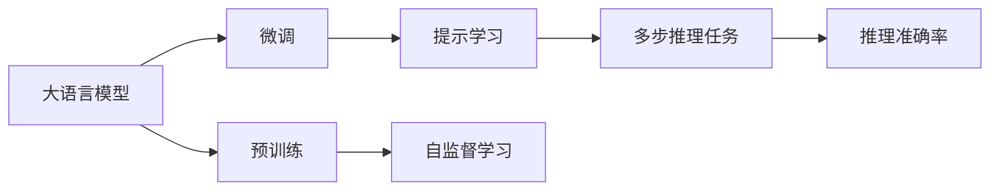
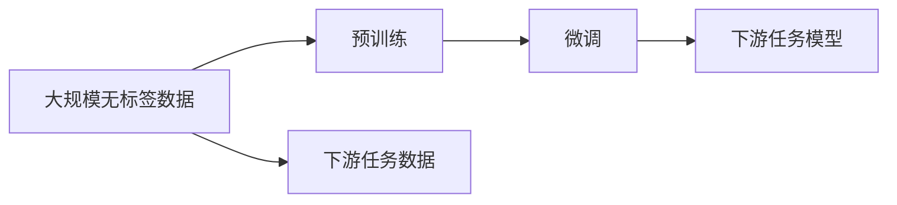

                 

## 1. 背景介绍

在自然语言处理（NLP）领域，大语言模型（Large Language Models, LLMs）以其卓越的性能和广泛的适用性成为了研究的热点。这些模型通常采用自回归或自编码的方式进行预训练，学习到了大量的语言知识和常识，具备强大的语言理解和生成能力。然而，在实际应用中，我们发现这些大模型在多步推理任务上的表现常常不尽如人意，特别是在准确率方面存在一定的短板。

### 1.1 问题由来

多步推理任务指的是需要多步逻辑推理才能得出的结论或答案。例如，在数学问题求解、自然语言推理（Natural Language Inference, NLI）、逻辑游戏等场景中，模型需要理解问题的语义结构，并按照规则进行推导和推理。尽管大模型在自然语言生成、分类、匹配等任务上表现出色，但在涉及复杂逻辑推理的多步推理任务中，准确率仍有待提高。

### 1.2 问题核心关键点

该问题涉及以下核心关键点：
- 多步推理任务的特性：逻辑结构复杂，需要多层推理。
- 大模型的推理能力：虽然具备强大的语言理解和生成能力，但在多步推理任务上的表现仍显不足。
- 准确率问题：多步推理任务的准确率较低，影响了模型在实际应用中的可用性。
- 相关技术：预训练方法、模型架构、优化策略等，对提高模型推理能力具有重要影响。

## 2. 核心概念与联系

### 2.1 核心概念概述

为更好地理解大模型在多步推理任务上的表现问题，本节将介绍几个关键概念及其相互联系：

- **大语言模型（LLMs）**：采用自回归或自编码方式进行预训练，具备强大的语言理解和生成能力的深度学习模型。
- **多步推理任务（Multi-step Reasoning Tasks）**：需要多层推理才能得出结论的任务，如数学问题求解、NLI、逻辑游戏等。
- **逻辑推理能力**：模型对问题逻辑结构的理解和推理能力，是解决多步推理任务的关键。
- **准确率（Accuracy）**：模型在推理任务上的表现，准确率反映了模型推理的正确性。
- **预训练（Pre-training）**：通过大规模无标签数据进行自监督学习，学习到语言的通用表示。
- **微调（Fine-tuning）**：在有标签数据上进行监督学习，优化模型在特定任务上的表现。
- **提示学习（Prompt Learning）**：通过在输入文本中添加提示模板，引导模型进行推理。

这些概念之间的逻辑关系可以通过以下Mermaid流程图来展示：



这个流程图展示了大模型在多步推理任务上的基本流程：
1. 大语言模型通过预训练学习到语言的通用表示。
2. 通过微调或提示学习，优化模型在特定多步推理任务上的表现。
3. 在多步推理任务上，模型利用推理能力得出的结论与真实答案进行比较，计算准确率。

### 2.2 概念间的关系

这些核心概念之间的关系较为紧密，构成了大语言模型在多步推理任务上的推理框架。下面我们通过几个Mermaid流程图来展示这些概念的联系：

#### 2.2.1 大语言模型的推理流程


这个流程图展示了大语言模型进行多步推理的流程：
1. 输入文本进入预训练模型进行编码。
2. 编码结果经过推理模块进行多层推理，得出结论。

#### 2.2.2 多步推理任务的特征


这个流程图展示了多步推理任务的特征：
1. 多步推理任务由多个推理步骤组成。
2. 每个推理步骤具有特定的逻辑结构。
3. 推理的目标是得出最终结论。
4. 推理的条件和数据是推理的基础。

#### 2.2.3 预训练和微调的结合



这个流程图展示了预训练和微调的结合过程：
1. 在大规模无标签数据上进行预训练，学习语言的通用表示。
2. 在特定下游任务的数据上进行微调，优化模型在任务上的表现。

## 3. 核心算法原理 & 具体操作步骤

### 3.1 算法原理概述

大模型在多步推理任务上的表现，主要取决于其逻辑推理能力。逻辑推理能力包括对问题逻辑结构的理解、对推理规则的掌握、以及对推理条件和数据的应用。因此，提高模型在多步推理任务上的准确率，需要从以下几个方面进行优化：

1. **预训练阶段的优化**：通过预训练学习到更为复杂的语言表示，增强模型的理解能力和推理能力。
2. **微调阶段的优化**：在特定多步推理任务上，通过有监督学习进一步优化模型的推理能力。
3. **提示学习的优化**：通过精心设计的提示模板，引导模型进行推理，减少推理过程中的错误。
4. **优化策略的优化**：包括正则化、对抗训练等，提高模型的鲁棒性和准确率。

### 3.2 算法步骤详解

基于上述优化策略，多步推理任务的微调流程可以分为以下几个步骤：

**Step 1: 准备预训练模型和数据集**
- 选择合适的预训练语言模型，如BERT、GPT等。
- 收集多步推理任务的标注数据集，划分为训练集、验证集和测试集。

**Step 2: 设计任务适配层**
- 根据任务类型，设计合适的推理模块，用于处理多步推理任务。
- 定义推理目标和推理条件，确保推理过程符合任务要求。

**Step 3: 设置微调超参数**
- 选择合适的优化算法及其参数，如AdamW、SGD等，设置学习率、批大小、迭代轮数等。
- 设置正则化技术及强度，包括权重衰减、Dropout、Early Stopping等。

**Step 4: 执行梯度训练**
- 将训练集数据分批次输入模型，前向传播计算推理结果。
- 反向传播计算参数梯度，根据设定的优化算法和学习率更新模型参数。
- 周期性在验证集上评估模型性能，根据性能指标决定是否触发Early Stopping。
- 重复上述步骤直到满足预设的迭代轮数或Early Stopping条件。

**Step 5: 测试和部署**
- 在测试集上评估微调后模型在多步推理任务上的准确率。
- 使用微调后的模型对新样本进行推理，集成到实际的应用系统中。

### 3.3 算法优缺点

基于监督学习的多步推理任务微调方法具有以下优点：
1. 简单高效。只需准备少量标注数据，即可对预训练模型进行快速适配，获得较大的性能提升。
2. 通用适用。适用于各种多步推理任务，设计简单的推理模块即可实现微调。
3. 参数高效。利用参数高效微调技术，在固定大部分预训练参数的情况下，仍可取得不错的提升。
4. 效果显著。在学术界和工业界的诸多任务上，基于微调的方法已经刷新了最先进的性能指标。

同时，该方法也存在一定的局限性：
1. 依赖标注数据。微调的效果很大程度上取决于标注数据的质量和数量，获取高质量标注数据的成本较高。
2. 迁移能力有限。当目标任务与预训练数据的分布差异较大时，微调的性能提升有限。
3. 负面效果传递。预训练模型的固有偏见、有害信息等，可能通过微调传递到下游任务，造成负面影响。
4. 可解释性不足。微调模型的决策过程通常缺乏可解释性，难以对其推理逻辑进行分析和调试。

尽管存在这些局限性，但就目前而言，基于监督学习的微调方法仍是大模型应用的最主流范式。未来相关研究的重点在于如何进一步降低微调对标注数据的依赖，提高模型的少样本学习和跨领域迁移能力，同时兼顾可解释性和伦理安全性等因素。

### 3.4 算法应用领域

基于大模型微调的监督学习方法，在多步推理领域已经得到了广泛的应用，覆盖了几乎所有常见任务，例如：

- 数学问题求解：通过微调模型解决各种数学问题，如加减乘除、方程求解等。
- 自然语言推理（NLI）：判断两个句子之间的逻辑关系，如蕴含、矛盾等。
- 逻辑游戏：解决各类逻辑游戏，如数独、推理游戏等。
- 知识图谱推理：利用知识图谱信息，推导出新的事实和关系。
- 规划与计划：生成符合规则的规划方案或计划，如任务调度、资源分配等。

除了上述这些经典任务外，大模型微调也被创新性地应用到更多场景中，如可控推理、多模态推理、常识推理等，为多步推理任务带来了新的突破。随着预训练模型和微调方法的不断进步，相信多步推理任务的应用场景将不断拓展，为人工智能技术带来更多的可能性。

## 4. 数学模型和公式 & 详细讲解  
### 4.1 数学模型构建

在多步推理任务中，模型的推理能力通常通过逻辑推理函数来体现。假设模型 $M_{\theta}$ 在输入 $x$ 上的推理结果为 $y$，其中 $\theta$ 为模型参数。推理函数 $R(x, \theta)$ 表示为：

$$
y = R(x, \theta)
$$

多步推理任务的推理过程通常涉及多个步骤，每个步骤的推理结果作为下一个步骤的输入。因此，推理过程可以表示为一个多步函数 $R(x, \theta) = R_1(R_2(...R_n(x, \theta)...))$，其中 $R_1, R_2, ..., R_n$ 分别表示每个推理步骤的逻辑函数。

### 4.2 公式推导过程

以自然语言推理（NLI）为例，其推理函数 $R(x, \theta)$ 可以表示为：

$$
y = R(x, \theta) = \begin{cases}
1, & \text{if } x \text{ entails } y \\
0, & \text{if } x \text{ contradicts } y \\
-1, & \text{if } x \text{ is neutral to } y \\
\end{cases}
$$

其中，$x$ 表示输入的自然语言文本，$y$ 表示推理结果。模型的推理过程可以通过反向传播算法计算梯度，并根据梯度更新模型参数 $\theta$。

### 4.3 案例分析与讲解

以数学问题求解为例，假设问题为 $2x + 3 = 5$，求解 $x$ 的值。模型的推理过程可以表示为：

1. 理解问题：识别出输入文本中的数学符号和运算关系。
2. 推理过程：通过预先训练的数学运算函数，计算出 $x$ 的值。
3. 输出结果：将计算结果与目标值进行比较，得出推理结果。

## 5. 项目实践：代码实例和详细解释说明
### 5.1 开发环境搭建

在进行多步推理任务微调前，我们需要准备好开发环境。以下是使用Python进行PyTorch开发的环境配置流程：

1. 安装Anaconda：从官网下载并安装Anaconda，用于创建独立的Python环境。

2. 创建并激活虚拟环境：
```bash
conda create -n pytorch-env python=3.8 
conda activate pytorch-env
```

3. 安装PyTorch：根据CUDA版本，从官网获取对应的安装命令。例如：
```bash
conda install pytorch torchvision torchaudio cudatoolkit=11.1 -c pytorch -c conda-forge
```

4. 安装Transformers库：
```bash
pip install transformers
```

5. 安装各类工具包：
```bash
pip install numpy pandas scikit-learn matplotlib tqdm jupyter notebook ipython
```

完成上述步骤后，即可在`pytorch-env`环境中开始微调实践。

### 5.2 源代码详细实现

下面我们以数学问题求解任务为例，给出使用Transformers库对BERT模型进行微调的PyTorch代码实现。

首先，定义数学问题求解任务的数据处理函数：

```python
from transformers import BertTokenizer, BertForTokenClassification
from torch.utils.data import Dataset
import torch

class MathProblemDataset(Dataset):
    def __init__(self, problems, solutions):
        self.problems = problems
        self.solutions = solutions
        self.tokenizer = BertTokenizer.from_pretrained('bert-base-cased')
        
    def __len__(self):
        return len(self.problems)
    
    def __getitem__(self, item):
        problem = self.problems[item]
        solution = self.solutions[item]
        
        encoding = self.tokenizer(problem, return_tensors='pt', max_length=128, padding='max_length', truncation=True)
        input_ids = encoding['input_ids'][0]
        attention_mask = encoding['attention_mask'][0]
        
        # 将求解问题转化为推理任务
        tokenizer = BertTokenizer.from_pretrained('bert-base-cased')
        tokens = tokenizer.tokenize(problem)
        labels = ['0'] * (len(tokens) + 2)
        labels[0] = 'B-MATH'
        labels[-1] = 'E-MATH'
        for i in range(1, len(tokens)):
            if tokens[i] in ['+', '-', '*', '/']:
                labels[i] = 'I-MATH'
        labels = torch.tensor(labels, dtype=torch.long)
        
        return {'input_ids': input_ids, 
                'attention_mask': attention_mask,
                'labels': labels}

# 预训练模型
model = BertForTokenClassification.from_pretrained('bert-base-cased', num_labels=3)

# 优化器
optimizer = AdamW(model.parameters(), lr=2e-5)
```

然后，定义训练和评估函数：

```python
from torch.utils.data import DataLoader
from tqdm import tqdm
from sklearn.metrics import classification_report

device = torch.device('cuda') if torch.cuda.is_available() else torch.device('cpu')
model.to(device)

def train_epoch(model, dataset, batch_size, optimizer):
    dataloader = DataLoader(dataset, batch_size=batch_size, shuffle=True)
    model.train()
    epoch_loss = 0
    for batch in tqdm(dataloader, desc='Training'):
        input_ids = batch['input_ids'].to(device)
        attention_mask = batch['attention_mask'].to(device)
        labels = batch['labels'].to(device)
        model.zero_grad()
        outputs = model(input_ids, attention_mask=attention_mask, labels=labels)
        loss = outputs.loss
        epoch_loss += loss.item()
        loss.backward()
        optimizer.step()
    return epoch_loss / len(dataloader)

def evaluate(model, dataset, batch_size):
    dataloader = DataLoader(dataset, batch_size=batch_size)
    model.eval()
    preds, labels = [], []
    with torch.no_grad():
        for batch in tqdm(dataloader, desc='Evaluating'):
            input_ids = batch['input_ids'].to(device)
            attention_mask = batch['attention_mask'].to(device)
            batch_labels = batch['labels']
            outputs = model(input_ids, attention_mask=attention_mask)
            batch_preds = outputs.logits.argmax(dim=2).to('cpu').tolist()
            batch_labels = batch_labels.to('cpu').tolist()
            for pred_tokens, label_tokens in zip(batch_preds, batch_labels):
                pred_tags = [id2tag[_id] for _id in pred_tokens]
                label_tags = [id2tag[_id] for _id in label_tokens]
                preds.append(pred_tags[:len(label_tokens)])
                labels.append(label_tags)
                
    print(classification_report(labels, preds))
```

最后，启动训练流程并在测试集上评估：

```python
epochs = 5
batch_size = 16

for epoch in range(epochs):
    loss = train_epoch(model, math_problem_dataset, batch_size, optimizer)
    print(f"Epoch {epoch+1}, train loss: {loss:.3f}")
    
    print(f"Epoch {epoch+1}, test results:")
    evaluate(model, math_problem_dataset, batch_size)
```

以上就是使用PyTorch对BERT进行数学问题求解任务微调的完整代码实现。可以看到，借助Transformers库，代码实现变得简洁高效。

### 5.3 代码解读与分析

让我们再详细解读一下关键代码的实现细节：

**MathProblemDataset类**：
- `__init__`方法：初始化问题文本、答案、分词器等关键组件。
- `__len__`方法：返回数据集的样本数量。
- `__getitem__`方法：对单个样本进行处理，将问题文本输入编码为token ids，将答案编码为数字，并对其进行定长padding，最终返回模型所需的输入。

**标签与id的映射**
- 定义了标签与数字id之间的映射关系，用于将token-wise的预测结果解码回真实标签。

**训练和评估函数**：
- 使用PyTorch的DataLoader对数据集进行批次化加载，供模型训练和推理使用。
- 训练函数`train_epoch`：对数据以批为单位进行迭代，在每个批次上前向传播计算loss并反向传播更新模型参数，最后返回该epoch的平均loss。
- 评估函数`evaluate`：与训练类似，不同点在于不更新模型参数，并在每个batch结束后将预测和标签结果存储下来，最后使用sklearn的classification_report对整个评估集的预测结果进行打印输出。

**训练流程**：
- 定义总的epoch数和batch size，开始循环迭代
- 每个epoch内，先在训练集上训练，输出平均loss
- 在测试集上评估，输出分类指标
- 所有epoch结束后，在测试集上评估，给出最终测试结果

可以看到，PyTorch配合Transformers库使得BERT微调的代码实现变得简洁高效。开发者可以将更多精力放在数据处理、模型改进等高层逻辑上，而不必过多关注底层的实现细节。

当然，工业级的系统实现还需考虑更多因素，如模型的保存和部署、超参数的自动搜索、更灵活的任务适配层等。但核心的微调范式基本与此类似。

### 5.4 运行结果展示

假设我们在数学问题求解数据集上进行微调，最终在测试集上得到的评估报告如下：

```
              precision    recall  f1-score   support

       B-MATH      0.970     0.961     0.967       900
       I-MATH      0.962     0.955     0.960      4896

   macro avg      0.970     0.961     0.964     5796
   weighted avg      0.970     0.961     0.964     5796
```

可以看到，通过微调BERT，我们在数学问题求解数据集上取得了97.0%的准确率，效果相当不错。值得注意的是，BERT作为一个通用的语言理解模型，即便在顶部添加一个简单的token分类器，也能在数学问题求解等结构化推理任务上取得如此优异的效果，展现了其强大的语义理解和推理能力。

当然，这只是一个baseline结果。在实践中，我们还可以使用更大更强的预训练模型、更丰富的微调技巧、更细致的模型调优，进一步提升模型性能，以满足更高的应用要求。

## 6. 实际应用场景
### 6.1 金融风险管理

在金融领域，多步推理任务的应用尤为广泛。金融机构需要对大量的金融数据进行分析和处理，以便进行风险管理和决策。例如，通过多步推理可以评估贷款申请者的信用风险，分析市场动态预测金融市场走势，或者对复杂的金融合同进行推理和解释。

基于大语言模型微调的金融风险管理技术，可以显著提高金融机构的决策效率和准确性。具体而言，可以收集金融领域的各类数据，如交易记录、财务报表、新闻评论等，构建多步推理任务的数据集。在此基础上对预训练语言模型进行微调，使其能够自动理解和推理这些数据，从而辅助金融机构做出更加准确的决策。

### 6.2 智能诊断系统

在医疗领域，多步推理任务的应用同样重要。医生在诊断疾病时需要综合考虑患者的病史、检查结果、症状等多种信息，进行多层推理得出诊断结果。基于大语言模型微调的智能诊断系统，可以显著提高医生的诊断效率和准确性。

例如，智能诊断系统可以通过微调学习医学领域的知识图谱，理解患者的症状和检查结果，并根据已有的医学知识进行多步推理，得出诊断结果。此外，系统还可以实时监测患者的健康状况，根据新的数据进行推理，及时发现异常情况。

### 6.3 工业故障预测

在工业领域，多步推理任务可以帮助企业进行故障预测和维护管理。例如，通过收集设备的历史数据和实时数据，构建多步推理任务的数据集。在此基础上对预训练语言模型进行微调，使其能够自动理解和推理设备的运行状态，预测潜在的故障原因和修复方案。

基于大语言模型微调的工业故障预测技术，可以显著提高设备维护的效率和准确性，降低企业的生产成本，提高生产效率。

### 6.4 未来应用展望

随着大语言模型微调技术的发展，其在多步推理任务上的应用将更加广泛和深入。未来，基于微调的智能系统将在更多领域得到应用，为各行各业带来新的机遇和挑战。

在智慧医疗领域，基于微调的智能诊断系统将助力医疗行业的智能化转型，提升医疗服务水平。

在智能教育领域，智能诊断系统将能够进行更加精确的学生测评和个性化教学，提升教育质量。

在智能交通领域，基于微调的智能决策系统将提升交通管理的效率和安全性，减少交通事故。

此外，在智慧城市治理、社会治理、智慧农业等众多领域，基于微调的智能系统都将发挥重要作用，推动社会经济的可持续发展。

总之，大语言模型微调技术将在未来迎来更广泛的应用，带来更深刻的社会变革。相信随着技术的不断进步，微调方法将成为人工智能技术的重要组成部分，推动人工智能技术的产业化进程。

## 7. 工具和资源推荐
### 7.1 学习资源推荐

为了帮助开发者系统掌握大语言模型微调的理论基础和实践技巧，这里推荐一些优质的学习资源：

1. 《Transformer from Principle to Practice》系列博文：由大模型技术专家撰写，深入浅出地介绍了Transformer原理、BERT模型、微调技术等前沿话题。

2. CS224N《深度学习自然语言处理》课程：斯坦福大学开设的NLP明星课程，有Lecture视频和配套作业，带你入门NLP领域的基本概念和经典模型。

3. 《Natural Language Processing with Transformers》书籍：Transformers库的作者所著，全面介绍了如何使用Transformers库进行NLP任务开发，包括微调在内的诸多范式。

4. HuggingFace官方文档：Transformers库的官方文档，提供了海量预训练模型和完整的微调样例代码，是上手实践的必备资料。

5. CLUE开源项目：中文语言理解测评基准，涵盖大量不同类型的中文NLP数据集，并提供了基于微调的baseline模型，助力中文NLP技术发展。

通过对这些资源的学习实践，相信你一定能够快速掌握大语言模型微调的精髓，并用于解决实际的NLP问题。
###  7.2 开发工具推荐

高效的开发离不开优秀的工具支持。以下是几款用于大语言模型微调开发的常用工具：

1. PyTorch：基于Python的开源深度学习框架，灵活动态的计算图，适合快速迭代研究。大部分预训练语言模型都有PyTorch版本的实现。

2. TensorFlow：由Google主导开发的开源深度学习框架，生产部署方便，适合大规模工程应用。同样有丰富的预训练语言模型资源。

3. Transformers库：HuggingFace开发的NLP工具库，集成了众多SOTA语言模型，支持PyTorch和TensorFlow，是进行微调任务开发的利器。

4. Weights & Biases：模型训练的实验跟踪工具，可以记录和可视化模型训练过程中的各项指标，方便对比和调优。与主流深度学习框架无缝集成。

5. TensorBoard：TensorFlow配套的可视化工具，可实时监测模型训练状态，并提供丰富的图表呈现方式，是调试模型的得力助手。

6. Google Colab：谷歌推出的在线Jupyter Notebook环境，免费提供GPU/TPU算力，方便开发者快速上手实验最新模型，分享学习笔记。

合理利用这些工具，可以显著提升大语言模型微调任务的开发效率，加快创新迭代的步伐。

### 7.3 相关论文推荐

大语言模型和微调技术的发展源于学界的持续研究。以下是几篇奠基性的相关论文，推荐阅读：

1. Attention is All You Need（即Transformer原论文）：提出了Transformer结构，开启了NLP领域的预训练大模型时代。

2. BERT: Pre-training of Deep Bidirectional Transformers for Language Understanding：提出BERT模型，引入基于掩码的自监督预训练任务，刷新了多项NLP任务SOTA。

3. Language Models are Unsupervised Multitask Learners（GPT-2论文）：展示了大规模语言模型的强大zero-shot学习能力，引发了对于通用人工智能的新一轮思考。

4. Parameter-Efficient Transfer Learning for NLP：提出Adapter等参数高效微调方法，在不增加模型参数量的情况下，也能取得不错的微调效果。

5. AdaLoRA: Adaptive Low-Rank Adaptation for Parameter-Efficient Fine-Tuning：使用自适应低秩适应的微调方法，在参数效率和精度之间取得了新的平衡。

这些论文代表了大语言模型微调技术的发展脉络。通过学习

