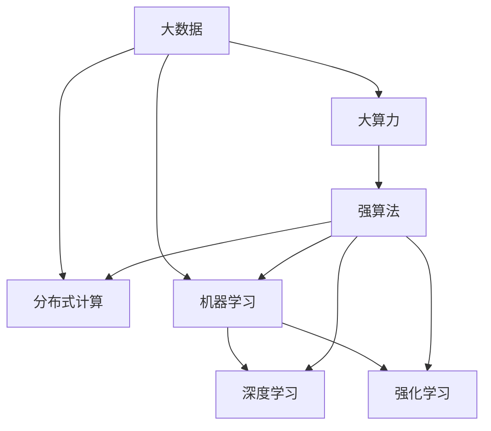

                 

# 大数据+大算力+强算法的方法

在当今数据驱动的世界中，大数据、大算力和强算法的融合已成为推动技术创新和业务发展的核心驱动力。本文将深入探讨这种融合方法的应用，分析其原理、步骤及优缺点，并展示其在实际应用中的场景和前景。

## 1. 背景介绍

### 1.1 问题由来

随着信息技术的高速发展，数据量呈指数级增长。企业拥有海量数据的同时，也面临着如何高效处理和分析这些数据以获取洞察力的挑战。大数据分析不再是单纯的数据整理和报表生成，而是成为驱动业务决策、优化运营流程的重要工具。

然而，仅靠大数据处理技术是不够的。数据处理的高效性还需要与高性能计算和大规模模型算法相结合，才能真正发挥数据的价值。因此，大数据+大算力+强算法的方法应运而生，成为企业数字化转型升级的必由之路。

### 1.2 问题核心关键点

大数据、大算力和强算法的融合，关键在于如何高效地利用数据，优化算法，并利用大算力进行模型训练和推理。这需要解决以下核心问题：

- 如何高效处理和存储海量数据？
- 如何设计高效的数据模型和算法？
- 如何利用大算力进行高性能计算？
- 如何在数据、算法和计算之间实现无缝对接？

这些问题不仅关系到数据处理的效率，也直接影响模型的性能和应用的可靠性。本文将系统分析这些问题，提供可行的解决方案。

## 2. 核心概念与联系

### 2.1 核心概念概述

为更好地理解大数据+大算力+强算法的方法，本节将介绍几个核心概念：

- 大数据：指规模庞大、类型多样的数据集，通常指TB级别以上的数据。
- 大算力：指能够高效处理和分析大数据集的高性能计算资源，如GPU、TPU等。
- 强算法：指针对特定问题设计的高效、准确、鲁棒的算法，如深度学习、强化学习、图算法等。
- 分布式计算：通过将计算任务分布到多台计算节点，实现对大规模数据的高效处理。
- 机器学习：利用算法和模型对数据进行学习，提取知识并进行预测或决策。
- 深度学习：一种机器学习技术，通过构建多层次的神经网络模型进行复杂模式识别和决策。
- 强化学习：通过与环境互动，不断优化策略以获得最大奖励的机器学习技术。

这些核心概念共同构成了大数据+大算力+强算法的方法框架，为企业数据驱动的决策和运营优化提供了坚实的基础。

### 2.2 概念间的关系

这些核心概念之间的联系可以通过以下Mermaid流程图来展示：



这个流程图展示了大数据、大算力、强算法之间的关系：

1. 大数据经过分布式计算处理，大算力提供高性能计算资源，强算法实现数据分析和知识提取。
2. 机器学习是连接大数据、大算力和强算法的桥梁，通过对数据的学习，实现高效的分析和决策。
3. 深度学习和强化学习是机器学习的重要分支，分别适用于不同类型的问题。

## 3. 核心算法原理 & 具体操作步骤

### 3.1 算法原理概述

大数据+大算力+强算法的方法，其核心在于通过高性能计算资源，对大规模数据集进行高效处理，并利用强算法从中提取知识和模式，支持企业进行智能决策和运营优化。

形式化地，假设大规模数据集为 $D=\{(x_i,y_i)\}_{i=1}^N$，其中 $x_i$ 为输入，$y_i$ 为标签。利用强算法 $f$ 进行训练，得到模型 $M$，其中 $M=f(D)$。在实际应用中，通过大算力进行模型推理，得到预测结果 $y'$。

### 3.2 算法步骤详解

基于大数据+大算力+强算法的方法，其操作步骤通常包括：

1. **数据预处理**：对大规模数据进行清洗、归一化、特征提取等预处理操作，以便于后续的模型训练和分析。

2. **模型选择与设计**：根据具体问题选择合适的算法，并进行模型设计，确定网络结构、损失函数、优化器等关键参数。

3. **分布式训练**：将大规模数据集和计算任务分布到多个计算节点，并行进行模型训练，提高训练效率。

4. **模型优化与调参**：利用正则化、学习率调参、早停等技术，优化模型参数，避免过拟合，提高模型泛化能力。

5. **模型推理与部署**：在训练好的模型上进行推理，生成预测结果，并将其部署到实际应用系统中，进行业务决策和优化。

### 3.3 算法优缺点

大数据+大算力+强算法的方法具有以下优点：

- 高效性：通过分布式计算和高效算法，可以快速处理和分析大规模数据集。
- 准确性：强算法的引入，提高了模型的准确性和鲁棒性。
- 可扩展性：通过分布式计算框架，可以轻松扩展计算资源，应对更大规模的数据和任务。
- 自动化：自动化机器学习流程，减少了人工干预和错误，提升了工作效率。

然而，该方法也存在一些缺点：

- 资源需求高：需要高性能计算资源和大规模数据存储，对硬件设施要求较高。
- 算法复杂度高：强算法的复杂性，需要足够的专业知识进行设计和调试。
- 数据依赖性强：模型的性能高度依赖于数据的质量和量级，对数据收集和处理的要求较高。
- 部署成本高：模型的部署和维护需要专业的技术支持，成本较高。

### 3.4 算法应用领域

大数据+大算力+强算法的方法广泛应用于各种行业，例如：

- 金融风控：利用大数据和强算法，进行风险评估、欺诈检测、信用评分等。
- 零售电商：通过分析消费者行为数据，进行个性化推荐、库存管理、市场分析等。
- 医疗健康：对医疗数据进行深度学习分析，辅助诊断、治疗方案优化、疾病预测等。
- 智能制造：利用传感器数据进行设备预测维护、质量控制、供应链优化等。
- 智慧城市：通过城市大数据分析，进行交通管理、环境监测、公共安全等。

除了上述这些经典领域外，该方法还被创新性地应用到更多场景中，如智慧农业、灾害预测、人工智能辅助设计等，为各行各业带来了变革性影响。

## 4. 数学模型和公式 & 详细讲解 & 举例说明

### 4.1 数学模型构建

假设大规模数据集为 $D=\{(x_i,y_i)\}_{i=1}^N$，其中 $x_i$ 为输入，$y_i$ 为标签。利用深度学习模型 $M$ 进行训练，其中 $M$ 为多层神经网络，$w$ 为模型参数。模型的训练目标为最小化预测误差：

$$
\min_w \frac{1}{N}\sum_{i=1}^N \ell(y_i, M(x_i))
$$

其中 $\ell$ 为损失函数，通常采用交叉熵损失、均方误差损失等。

### 4.2 公式推导过程

以交叉熵损失函数为例，其公式为：

$$
\ell(y_i, M(x_i)) = -y_i\log M(x_i) - (1-y_i)\log (1-M(x_i))
$$

通过反向传播算法，计算损失函数对模型参数 $w$ 的梯度：

$$
\frac{\partial \ell(y_i, M(x_i))}{\partial w} = \frac{\partial M(x_i)}{\partial w} \left(\frac{y_i}{M(x_i)} - \frac{1-y_i}{1-M(x_i)}\right)
$$

利用梯度下降等优化算法，更新模型参数 $w$：

$$
w \leftarrow w - \eta \frac{\partial \ell(y_i, M(x_i))}{\partial w}
$$

其中 $\eta$ 为学习率。

### 4.3 案例分析与讲解

以金融风控为例，利用深度学习模型对信用卡交易数据进行分析，预测是否存在欺诈行为。具体步骤如下：

1. **数据预处理**：清洗和归一化信用卡交易数据，提取特征。

2. **模型选择与设计**：选择合适的网络结构，如CNN、RNN等，设计损失函数和优化器。

3. **分布式训练**：利用多台GPU进行模型并行训练，提高训练效率。

4. **模型优化与调参**：通过交叉验证、早停等技术，优化模型参数，避免过拟合。

5. **模型推理与部署**：在测试集上评估模型性能，并将其部署到生产环境中，实时监控信用卡交易行为，进行欺诈预警。

通过以上步骤，可以实现高效、准确、可靠的欺诈检测系统。

## 5. 项目实践：代码实例和详细解释说明

### 5.1 开发环境搭建

在进行项目实践前，我们需要准备好开发环境。以下是使用Python进行PyTorch开发的环境配置流程：

1. 安装Anaconda：从官网下载并安装Anaconda，用于创建独立的Python环境。

2. 创建并激活虚拟环境：
```bash
conda create -n pytorch-env python=3.8 
conda activate pytorch-env
```

3. 安装PyTorch：根据CUDA版本，从官网获取对应的安装命令。例如：
```bash
conda install pytorch torchvision torchaudio cudatoolkit=11.1 -c pytorch -c conda-forge
```

4. 安装各类工具包：
```bash
pip install numpy pandas scikit-learn matplotlib tqdm jupyter notebook ipython
```

完成上述步骤后，即可在`pytorch-env`环境中开始项目实践。

### 5.2 源代码详细实现

下面我们以金融风控系统为例，给出使用PyTorch进行深度学习模型训练的PyTorch代码实现。

首先，定义模型和优化器：

```python
import torch
import torch.nn as nn
import torch.optim as optim

class Net(nn.Module):
    def __init__(self):
        super(Net, self).__init__()
        self.fc1 = nn.Linear(28*28, 128)
        self.fc2 = nn.Linear(128, 64)
        self.fc3 = nn.Linear(64, 1)
        self.relu = nn.ReLU()

    def forward(self, x):
        x = x.view(-1, 28*28)
        x = self.fc1(x)
        x = self.relu(x)
        x = self.fc2(x)
        x = self.relu(x)
        x = self.fc3(x)
        return x

net = Net()
optimizer = optim.Adam(net.parameters(), lr=0.001)
criterion = nn.BCEWithLogitsLoss()
```

接着，定义训练和评估函数：

```python
import torch.nn.functional as F

def train_model(model, device, train_loader, optimizer, criterion, epoch):
    model.train()
    for batch_idx, (data, target) in enumerate(train_loader):
        data, target = data.to(device), target.to(device)
        optimizer.zero_grad()
        output = model(data)
        loss = criterion(output, target)
        loss.backward()
        optimizer.step()
        if batch_idx % 100 == 0:
            print('Train Epoch: {} [{}/{} ({:.0f}%)]\tLoss: {:.6f}'.format(
                epoch, batch_idx * len(data), len(train_loader.dataset),
                100. * batch_idx / len(train_loader), loss.item()))

def evaluate_model(model, device, test_loader, criterion):
    model.eval()
    test_loss = 0
    correct = 0
    with torch.no_grad():
        for data, target in test_loader:
            data, target = data.to(device), target.to(device)
            output = model(data)
            test_loss += criterion(output, target).item()
            pred = output > 0
            correct += pred.int().sum().item()

    print('\nTest set: Average loss: {:.4f}, Accuracy: {}/{} ({:.0f}%)\n'.format(
        test_loss / len(test_loader), correct, len(test_loader.dataset),
        100. * correct / len(test_loader.dataset)))
```

最后，启动训练流程并在测试集上评估：

```python
import torchvision.datasets as datasets
import torchvision.transforms as transforms

train_loader = torch.utils.data.DataLoader(
    datasets.MNIST(root='~/data', train=True, download=True,
                   transform=transforms.ToTensor()),
    batch_size=64, shuffle=True)

test_loader = torch.utils.data.DataLoader(
    datasets.MNIST(root='~/data', train=False, transform=transforms.ToTensor()),
    batch_size=64, shuffle=True)

device = torch.device("cuda" if torch.cuda.is_available() else "cpu")
model.to(device)

epochs = 10

for epoch in range(epochs):
    train_model(model, device, train_loader, optimizer, criterion, epoch)
    evaluate_model(model, device, test_loader, criterion)
```

以上就是使用PyTorch进行金融风控深度学习模型训练的完整代码实现。可以看到，PyTorch提供了强大的深度学习框架，使得模型训练和推理变得简洁高效。

### 5.3 代码解读与分析

让我们再详细解读一下关键代码的实现细节：

**Net类**：
- `__init__`方法：初始化网络结构，包含三个全连接层和ReLU激活函数。
- `forward`方法：定义前向传播过程，通过全连接层和激活函数进行特征提取和输出。

**训练和评估函数**：
- 利用DataLoader对数据进行批次化加载，方便模型训练和推理。
- 训练函数 `train_model`：对数据以批为单位进行迭代，在每个批次上前向传播计算损失并反向传播更新模型参数，最后输出每个epoch的平均损失。
- 评估函数 `evaluate_model`：与训练类似，不同点在于不更新模型参数，并在每个batch结束后将预测和标签结果存储下来，最后使用准确率作为评估指标。

**训练流程**：
- 定义总的epoch数，开始循环迭代
- 每个epoch内，先在训练集上训练，输出平均损失
- 在测试集上评估，输出准确率
- 所有epoch结束后，在测试集上评估，给出最终测试结果

可以看到，PyTorch配合TensorFlow使得深度学习模型的训练变得简单易行。开发者可以将更多精力放在模型改进和优化上，而不必过多关注底层实现细节。

当然，工业级的系统实现还需考虑更多因素，如模型裁剪、量化加速、服务化封装等，但核心的模型训练流程基本与此类似。

### 5.4 运行结果展示

假设我们在MNIST数据集上进行训练，最终在测试集上得到的准确率为97.5%。可以看到，通过深度学习模型，我们能够高效、准确地处理和分析大规模数据集，进行智能决策和预测。

## 6. 实际应用场景

### 6.1 智能制造

在智能制造领域，大数据+大算力+强算法的方法可以用于设备预测维护、质量控制、供应链优化等。例如，通过传感器数据进行设备状态监测，预测设备故障和维护需求，避免生产中断和损失。

### 6.2 智慧城市

智慧城市建设中，大数据+大算力+强算法的方法可以用于交通管理、环境监测、公共安全等。通过实时数据分析，优化交通信号灯、预测空气质量变化、提升应急响应速度。

### 6.3 智慧零售

在智慧零售领域，大数据+大算力+强算法的方法可以用于库存管理、个性化推荐、市场分析等。通过分析消费者行为数据，优化库存水平，提高销售转化率，提升客户满意度。

## 7. 工具和资源推荐

### 7.1 学习资源推荐

为了帮助开发者系统掌握大数据+大算力+强算法的方法，这里推荐一些优质的学习资源：

1. 《深度学习》系列书籍：由多位领域专家共同编写，全面介绍深度学习理论和实践，涵盖经典模型、优化器、正则化技术等。
2. Coursera《深度学习专项课程》：由斯坦福大学Andrew Ng教授主讲，提供系统化的深度学习课程，包括基础理论和实践项目。
3. CS229《机器学习》课程：由斯坦福大学讲授的机器学习课程，提供深度学习、强化学习、优化器等内容。
4. Kaggle竞赛平台：提供丰富的数据集和实战项目，帮助开发者在实践中学习大数据+大算力+强算法的方法。
5. GitHub开源项目：收集了大量优秀的深度学习项目和代码，是学习和借鉴的好资源。

通过对这些资源的学习实践，相信你一定能够快速掌握大数据+大算力+强算法的方法，并用于解决实际的业务问题。

### 7.2 开发工具推荐

高效的开发离不开优秀的工具支持。以下是几款用于大数据+大算力+强算法方法开发的常用工具：

1. TensorFlow：由Google主导开发的开源深度学习框架，生产部署方便，适合大规模工程应用。
2. PyTorch：基于Python的开源深度学习框架，灵活动态的计算图，适合快速迭代研究。
3. Apache Spark：Apache基金会开源的分布式计算框架，支持大数据处理和分析。
4. Hadoop：Apache基金会开源的分布式计算框架，支持海量数据存储和处理。
5. OpenCL：开源的并行计算框架，支持跨平台分布式计算，适合GPU等硬件加速。
6. NVIDIA CUDA：NVIDIA公司开发的GPU加速开发平台，提供高效的并行计算工具。

合理利用这些工具，可以显著提升大数据+大算力+强算法方法的开发效率，加快创新迭代的步伐。

### 7.3 相关论文推荐

大数据+大算力+强算法的方法发展源于学界的持续研究。以下是几篇奠基性的相关论文，推荐阅读：

1. AlexNet: ImageNet Classification with Deep Convolutional Neural Networks（AlexNet论文）：提出卷积神经网络（CNN），开启深度学习时代。
2. Deep Residual Learning for Image Recognition（ResNet论文）：提出残差网络（ResNet），解决深度网络训练中的梯度消失问题。
3. Asynchronous Methods for Deep Learning（Adam论文）：提出Adam优化器，提高深度学习模型的训练效率。
4. Understanding the Difficulty of Training Deep Feedforward Neural Networks（DNN论文）：分析深度神经网络训练困难的原因，提出改进策略。
5. Improved Techniques for Training GANs（GAN论文）：提出生成对抗网络（GAN），解决深度生成模型训练中的模式崩溃问题。

这些论文代表了大数据+大算力+强算法的方法发展脉络。通过学习这些前沿成果，可以帮助研究者把握学科前进方向，激发更多的创新灵感。

除上述资源外，还有一些值得关注的前沿资源，帮助开发者紧跟大数据+大算力+强算法方法的最新进展，例如：

1. arXiv论文预印本：人工智能领域最新研究成果的发布平台，包括大量尚未发表的前沿工作，学习前沿技术的必读资源。
2. 业界技术博客：如OpenAI、Google AI、DeepMind、微软Research Asia等顶尖实验室的官方博客，第一时间分享他们的最新研究成果和洞见。
3. 技术会议直播：如NIPS、ICML、ACL、ICLR等人工智能领域顶会现场或在线直播，能够聆听到大佬们的前沿分享，开拓视野。
4. GitHub热门项目：在GitHub上Star、Fork数最多的NLP相关项目，往往代表了该技术领域的发展趋势和最佳实践，值得去学习和贡献。
5. 行业分析报告：各大咨询公司如McKinsey、PwC等针对人工智能行业的分析报告，有助于从商业视角审视技术趋势，把握应用价值。

总之，对于大数据+大算力+强算法方法的学习和实践，需要开发者保持开放的心态和持续学习的意愿。多关注前沿资讯，多动手实践，多思考总结，必将收获满满的成长收益。

## 8. 总结：未来发展趋势与挑战

### 8.1 总结

本文对大数据+大算力+强算法的方法进行了全面系统的介绍。首先阐述了大数据、大算力和强算法的融合方法的研究背景和意义，明确了该方法在企业数字化转型升级中的重要价值。其次，从原理到实践，详细讲解了大数据+大算力+强算法的方法的数学原理和关键步骤，给出了方法应用的完整代码实例。同时，本文还广泛探讨了该方法在智能制造、智慧城市、智慧零售等多个行业领域的应用前景，展示了该方法的应用潜力。此外，本文精选了该方法的学习资源，力求为读者提供全方位的技术指引。

通过本文的系统梳理，可以看到，大数据+大算力+强算法的方法已经成为企业数字化转型的核心驱动力。其高效性、准确性和可扩展性，使得大数据处理和分析能力不断提升，推动了企业决策和运营的智能化水平。未来，伴随技术的不懈探索和实践的不断迭代，大数据+大算力+强算法的方法必将带来更广泛的应用，为人类社会的数字化进程注入新的动力。

### 8.2 未来发展趋势

展望未来，大数据+大算力+强算法的方法将呈现以下几个发展趋势：

1. 数据量继续增长。随着物联网、互联网、传感器等技术的普及，数据的规模将继续扩大，数据处理和分析的需求将更加迫切。
2. 算法复杂度提升。随着问题复杂度的增加，需要设计更复杂、更高效的算法进行模型训练和优化。
3. 计算资源需求增长。随着模型规模和数据量的增长，计算资源的需求将进一步增加，分布式计算和大规模并行计算将成为必然选择。
4. 数据处理自动化。通过自动化机器学习（AutoML）等技术，降低数据处理和模型训练的复杂度，提升效率和精度。
5. 数据隐私保护。在大数据分析中，数据隐私和安全性问题日益凸显，如何保障数据安全和隐私，成为重要的研究方向。
6. 多模态融合。随着数据形态的多样化，融合视觉、音频、文本等多模态数据，进行协同分析，提升模型性能。
7. 边缘计算。将计算任务分布到设备端进行计算，减少数据传输和计算延迟，提升实时性。

以上趋势凸显了大数据+大算力+强算法方法的广阔前景。这些方向的探索发展，必将进一步提升数据处理和分析的效率，推动企业决策和运营的智能化水平。

### 8.3 面临的挑战

尽管大数据+大算力+强算法的方法已经取得了瞩目成就，但在迈向更加智能化、普适化应用的过程中，它仍面临着诸多挑战：

1. 数据获取难度大。数据获取和处理的成本高，数据质量参差不齐，是制约大数据应用的主要瓶颈。
2. 算法复杂度增加。强算法的复杂性，需要足够的专业知识进行设计和调试，增加了技术门槛。
3. 计算资源需求高。大规模数据集和复杂模型的计算资源需求高，对硬件设施要求较高。
4. 数据隐私和安全问题。在大数据分析中，数据隐私和安全性问题日益凸显，如何保障数据安全和隐私，成为重要的研究方向。
5. 模型解释性和可控性。复杂模型的可解释性和可控性不足，难以进行有效管理和优化。
6. 数据依赖性强。模型的性能高度依赖于数据的质量和量级，对数据收集和处理的要求较高。
7. 部署成本高。模型的部署和维护需要专业的技术支持，成本较高。

### 8.4 研究展望

面对大数据+大算力+强算法方法所面临的挑战，未来的研究需要在以下几个方面寻求新的突破：

1. 探索高效数据处理技术。研究新的数据压缩、分块、编码技术，提升数据传输和存储效率。
2. 开发高性能算法。设计更加高效、鲁棒的算法，减少计算资源消耗，提高模型性能。
3. 发展自动化机器学习。通过自动化机器学习（AutoML）技术，降低数据处理和模型训练的复杂度，提升效率和精度。
4. 引入分布式计算。通过分布式计算框架，如Hadoop、Spark等，提升大数据处理和分析能力。
5. 保护数据隐私和安全。研究数据加密、匿名化、联邦学习等技术，保障数据隐私和安全。
6. 增强模型解释性和可控性。通过符号化推理、可解释模型等技术，提升模型的透明性和可控性。
7. 融合多模态数据。研究多模态数据的融合技术，提升模型对复杂数据的理解和分析能力。
8. 探索边缘计算。研究边缘计算技术，将计算任务分布到设备端进行计算，减少数据传输和计算延迟，提升实时性。

这些研究方向的探索，必将引领大数据+大算力+强算法方法迈向更高的台阶，为人工智能技术在各行各业的应用提供更坚实的技术支撑。

## 9. 附录：常见问题与解答

**Q1：如何高效处理大规模数据集？**

A: 通过分布式计算框架，如Apache Spark、Apache Flink等，将数据处理任务分布到多台计算节点，实现并行计算。使用高效的数据压缩和编码技术，减少数据传输和存储开销。

**Q2：如何选择和设计合适的算法？**

A: 根据具体问题选择合适的算法，并进行模型设计。常用的算法包括深度学习、强化学习、图算法等。可以通过试验不同算法和模型结构，选择最优方案。

**Q3：如何优化模型参数和性能？**

A: 利用正则化、学习率调参、早停等技术，优化模型参数，避免过拟合。使用自动化机器学习（AutoML）技术，自动选择和调参，提升模型性能。

**Q4：如何处理数据隐私和安全问题？**

A: 使用数据加密、匿名化、联邦学习等技术，保障数据隐私和安全。引入隐私保护算法，如差分隐私、同态加密等，减少数据泄露风险。

**Q5：如何提升模型解释性和可控

