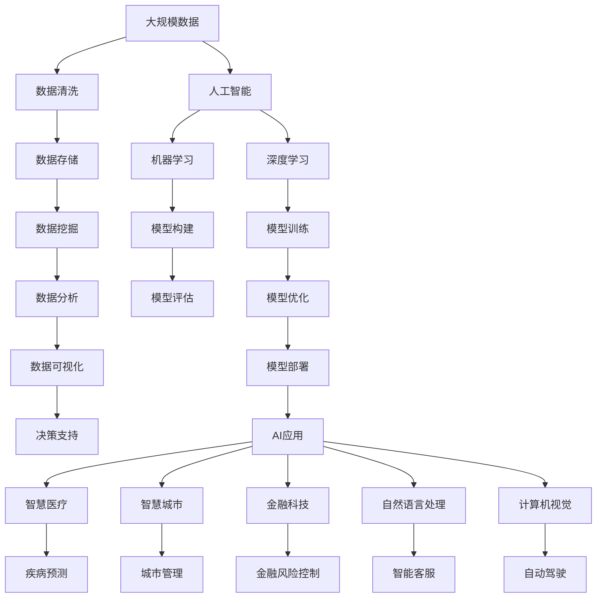

                 

# 大数据与AI的未来发展趋势

## 1. 背景介绍

### 1.1 问题由来
近年来，随着云计算和互联网技术的飞速发展，数据正以前所未有的速度和规模产生和积累。大数据与人工智能(AI)的结合，使得数据成为了推动AI技术进步的源泉。无论是图像识别、自然语言处理、推荐系统还是自动驾驶等前沿领域，都深刻地依赖于大规模数据的支持。然而，随着数据量的爆炸性增长，传统的存储和处理手段已经难以应对。因此，大数据与AI的未来发展趋势成为了学界和业界关注的焦点。

### 1.2 问题核心关键点
未来大数据与AI的发展趋势，主要包括以下几个关键点：
1. **数据质量与多样性**：如何有效管理和利用复杂、高维的数据集，减少数据噪声，提升数据质量，是未来发展的首要任务。
2. **模型高效性**：在数据规模不断增长的同时，如何在模型设计上提高效率，避免过拟合，提升模型的泛化能力，是未来发展的重要方向。
3. **自动化与可解释性**：如何实现AI模型的自动化构建与训练，同时提高模型的可解释性，使其能够更好地服务于决策支持，是未来发展的关键点。
4. **隐私保护与数据安全**：随着数据量的增加，隐私保护和数据安全问题日益突出，如何平衡数据利用和隐私保护，成为未来发展的重要课题。
5. **跨领域融合与应用**：如何通过大数据与AI技术，实现不同领域间的深度融合，推动智慧城市、智慧医疗、智慧教育等领域的全面升级，是未来发展的广阔前景。

这些关键点不仅影响着大数据与AI技术的未来发展路径，也对相关产业的转型升级具有深远影响。

## 2. 核心概念与联系

### 2.1 核心概念概述

要深入理解大数据与AI的未来发展趋势，首先需要清晰定义以下几个核心概念：

- **大数据**：指规模巨大、类型多样的数据集，具有高速度、高价值的特点。大数据的应用包括但不限于数据分析、数据挖掘、数据处理和数据存储等领域。

- **人工智能**：利用计算机技术模拟人类智能，包括机器学习、深度学习、自然语言处理、计算机视觉等技术。AI技术能够通过数据训练模型，进行预测、决策和智能交互等任务。

- **大数据与AI的融合**：通过大数据技术提供的数据支持，结合AI技术的算法优势，实现数据的智能化处理和分析。这种融合在智能医疗、智慧城市、金融科技等众多领域展现出巨大潜力。

- **数据驱动的决策支持**：基于大数据和AI技术，通过数据分析和模型预测，为决策者提供科学、客观的依据，提升决策质量和效率。

- **自动机器学习(AutoML)**：通过自动化工具和算法，实现机器学习模型的构建、调优和评估，降低机器学习的门槛，提高模型构建的效率。

### 2.2 概念间的关系

这些核心概念之间的联系可以通过以下Mermaid流程图来展示：

```mermaid
graph TB
    A[大数据] --> B[数据清洗]
    A --> C[数据存储]
    A --> D[数据挖掘]
    B --> E[数据清洗效果]
    C --> F[数据访问]
    D --> G[数据分析]
    E --> F
    G --> H[数据分析结果]
    F --> I[数据可视化]
    I --> J[数据驱动决策]
    J --> K[决策支持]
    A --> L[人工智能]
    L --> M[机器学习]
    L --> N[深度学习]
    M --> O[模型构建]
    N --> P[模型训练]
    O --> Q[模型评估]
    Q --> R[模型优化]
    R --> S[模型部署]
    S --> T[AI应用]
    T --> U[智慧医疗]
    T --> V[智慧城市]
    T --> W[金融科技]
    T --> X[自然语言处理]
    T --> Y[计算机视觉]
    U --> Z[疾病预测]
    V --> $[城市管理]
    W --> [金融风险控制]
    X --> [智能客服]
    Y --> [自动驾驶]
```

这个流程图展示了大数据与AI技术的相互依赖和融合关系：

1. 大数据技术为AI提供数据支撑。
2. AI技术从数据中提取知识和模式，实现智能化分析。
3. 数据驱动的决策支持为AI提供应用场景。
4. 自动机器学习进一步优化AI模型的构建和优化过程。
5. 各种AI应用落地于智慧医疗、智慧城市、金融科技等垂直领域，提升各行业的智能化水平。

### 2.3 核心概念的整体架构

最后，我们用一个综合的流程图来展示这些核心概念在大数据与AI融合生态系统中的整体架构：



这个综合流程图展示了从数据生成、存储、挖掘、分析到应用落地的完整流程，揭示了大数据与AI技术的深度融合和协同作用。

## 3. 核心算法原理 & 具体操作步骤

### 3.1 算法原理概述

大数据与AI的融合，在技术层面主要体现在两个方面：数据处理技术和模型训练算法。以下将详细解释这两个层面的核心算法原理。

#### 数据处理技术
数据处理技术的核心是如何在大规模数据中提取有用信息，并进行有效的存储和管理。主要包括以下几个关键技术：

1. **分布式存储**：如Hadoop、Spark等分布式计算框架，可以高效地处理大规模数据存储和访问问题。

2. **数据清洗**：通过数据预处理技术，如去重、去噪、填补缺失值等，提升数据质量，减少噪声干扰。

3. **数据聚合与融合**：通过数据聚合和融合技术，将异构数据源的数据整合在一起，形成统一的数据视图，便于后续分析。

4. **数据压缩与索引**：利用数据压缩和索引技术，减少数据存储和传输的资源占用，提高数据访问效率。

#### 模型训练算法
模型训练算法的核心是如何在大规模数据集上高效地训练深度学习模型。主要包括以下几个关键技术：

1. **分布式训练**：如TensorFlow、PyTorch等深度学习框架，支持分布式训练，能够在多台机器上并行计算，提升训练效率。

2. **模型剪枝与压缩**：通过剪枝、量化等技术，减少模型的参数量和计算量，提高模型效率。

3. **模型蒸馏**：通过知识蒸馏技术，将大型模型的知识转移到小型模型，提升模型的泛化能力。

4. **迁移学习**：通过迁移学习技术，将预训练模型应用于新任务，减少从头训练的时间和数据需求。

### 3.2 算法步骤详解

基于以上原理，大数据与AI的融合可以通过以下步骤实现：

1. **数据采集与清洗**：收集大规模数据，并进行预处理，减少噪声和冗余，提升数据质量。

2. **数据存储与管理**：利用分布式存储技术，高效存储和管理大规模数据。

3. **数据挖掘与分析**：通过数据挖掘和分析技术，提取有价值的信息和知识。

4. **模型构建与训练**：选择合适的深度学习模型，利用分布式训练技术，高效地训练模型。

5. **模型评估与优化**：通过模型评估技术，评估模型的性能和泛化能力，并进行优化。

6. **模型部署与应用**：将优化后的模型部署到实际应用中，进行智能化处理和决策支持。

### 3.3 算法优缺点

大数据与AI的融合具有以下优点：

1. **高效性**：通过分布式计算和存储技术，高效处理大规模数据，提升数据处理和模型训练的效率。

2. **泛化能力**：通过迁移学习和模型蒸馏技术，利用预训练模型的知识，提升模型在新任务上的泛化能力。

3. **智能化决策**：基于数据驱动的决策支持，实现智能化的决策和分析。

4. **跨领域融合**：通过自动机器学习技术，实现不同领域之间的深度融合，推动垂直领域的应用发展。

同时，也存在以下缺点：

1. **数据隐私和安全**：大规模数据的收集和存储，可能面临隐私泄露和数据安全问题。

2. **模型复杂性**：大规模深度学习模型的训练和优化，需要大量的计算资源和时间，复杂性较高。

3. **技术门槛高**：大数据和AI技术的复杂性和多样性，对技术人才的需求较高，门槛较高。

4. **数据质量影响**：数据质量和多样性对模型性能的影响较大，数据噪声和缺失可能导致模型过拟合。

### 3.4 算法应用领域

大数据与AI的融合已经在多个领域得到了广泛应用，以下列举几个典型的应用领域：

1. **智慧医疗**：利用大数据和AI技术，实现疾病预测、诊断辅助、个性化治疗等智能医疗应用。

2. **智慧城市**：通过智能交通、智能安防、智能能源管理等应用，提升城市管理效率，改善居民生活质量。

3. **金融科技**：利用大数据和AI技术，进行风险控制、信用评估、智能投顾等金融创新应用。

4. **自然语言处理**：通过大数据和AI技术，实现智能客服、智能翻译、智能摘要等应用，提升人机交互体验。

5. **计算机视觉**：通过大数据和AI技术，实现自动驾驶、图像识别、视频分析等应用，推动智能硬件发展。

## 4. 数学模型和公式 & 详细讲解 & 举例说明

### 4.1 数学模型构建

在大数据与AI融合的实践中，数学模型扮演着重要的角色。以下将详细介绍几个核心数学模型的构建方法。

#### 数据清洗与预处理
数据清洗与预处理的目的是减少噪声和冗余，提升数据质量。常见的数据清洗技术包括去重、去噪、填补缺失值等。例如，利用Python中的Pandas库，可以通过以下代码实现：

```python
import pandas as pd

# 读取数据
data = pd.read_csv('data.csv')

# 去重
data.drop_duplicates(inplace=True)

# 去噪
data.dropna(inplace=True)

# 填补缺失值
data.fillna(value, inplace=True)
```

#### 数据存储与管理
数据存储与管理的核心是利用分布式存储技术，高效存储和管理大规模数据。常见的分布式存储技术包括Hadoop、Spark等。例如，利用Hadoop的HDFS（Hadoop Distributed File System）进行数据存储，可以通过以下代码实现：

```python
from hdfs import InsecureClient

# 连接HDFS
client = InsecureClient('http://namenode:50070', user='hdfs')

# 上传数据
with open('data.csv', 'rb') as f:
    client.write_file('/data/data.csv', f)

# 读取数据
with client.read('/data/data.csv') as f:
    data = pd.read_csv(f)
```

#### 数据挖掘与分析
数据挖掘与分析的核心是提取有价值的信息和知识。常见的数据挖掘技术包括聚类、分类、关联规则挖掘等。例如，利用Python中的Scikit-Learn库，可以通过以下代码实现：

```python
from sklearn.cluster import KMeans
from sklearn.ensemble import RandomForestClassifier
from sklearn.metrics import accuracy_score

# 聚类
kmeans = KMeans(n_clusters=3, random_state=42)
kmeans.fit(data)

# 分类
forest = RandomForestClassifier(n_estimators=100, random_state=42)
forest.fit(data, labels)

# 评估
score = accuracy_score(true_labels, predicted_labels)
```

#### 模型构建与训练
模型构建与训练的核心是选择合适的深度学习模型，利用分布式训练技术，高效地训练模型。常见的深度学习模型包括卷积神经网络（CNN）、循环神经网络（RNN）、生成对抗网络（GAN）等。例如，利用TensorFlow库，可以通过以下代码实现：

```python
import tensorflow as tf

# 构建CNN模型
model = tf.keras.Sequential([
    tf.keras.layers.Conv2D(32, (3, 3), activation='relu', input_shape=(28, 28, 1)),
    tf.keras.layers.MaxPooling2D((2, 2)),
    tf.keras.layers.Flatten(),
    tf.keras.layers.Dense(10, activation='softmax')
])

# 训练模型
model.compile(optimizer='adam', loss='categorical_crossentropy', metrics=['accuracy'])
model.fit(train_data, train_labels, epochs=10, batch_size=32)
```

### 4.2 公式推导过程

以下将以神经网络模型的训练为例，推导其中的关键数学公式。

#### 前向传播与损失函数
神经网络模型的前向传播过程可以表示为：

$$
h^{(l)} = \sigma(W^{(l)}h^{(l-1)} + b^{(l)}) \quad (l=1,\ldots,L)
$$

其中，$h^{(l)}$ 表示第$l$层的输出，$W^{(l)}$ 和 $b^{(l)}$ 分别表示第$l$层的权重和偏置，$\sigma$ 表示激活函数。最终模型的输出可以表示为：

$$
\hat{y} = W^{(L)}h^{(L-1)} + b^{(L)}
$$

损失函数通常为交叉熵损失，表示为：

$$
\mathcal{L}(y, \hat{y}) = -\frac{1}{N}\sum_{i=1}^N\sum_{j=1}^C y_{ij}\log \hat{y}_{ij}
$$

其中，$y_{ij}$ 表示第$i$个样本的第$j$个类别标签，$\hat{y}_{ij}$ 表示模型对第$i$个样本的第$j$个类别的预测概率。

#### 反向传播与梯度更新
反向传播过程的目的是计算损失函数对模型参数的梯度，用于后续的梯度更新。以交叉熵损失为例，反向传播过程可以表示为：

$$
\frac{\partial \mathcal{L}}{\partial W^{(l)}} = \frac{\partial \mathcal{L}}{\partial h^{(l-1)}} \frac{\partial h^{(l-1)}}{\partial W^{(l)}} = (h^{(l-1)})^T\sigma'(W^{(l)}h^{(l-1)} + b^{(l)})
$$

其中，$\sigma'$ 表示激活函数的导数。通过链式法则，可以递归计算每一层的梯度，最终得到损失函数对模型参数的梯度。

#### 模型优化
模型优化过程的核心是利用梯度下降等优化算法，更新模型参数，最小化损失函数。以梯度下降为例，优化过程可以表示为：

$$
W^{(l)} \leftarrow W^{(l)} - \eta \frac{\partial \mathcal{L}}{\partial W^{(l)}}
$$

其中，$\eta$ 表示学习率。通过不断迭代优化，模型能够逐渐逼近最优参数，提升模型性能。

### 4.3 案例分析与讲解

#### 实例：图像分类
假设我们需要构建一个图像分类模型，将手写数字图像分类为0到9共10个类别。具体步骤如下：

1. **数据准备**：收集并准备一组手写数字图像和相应的标签数据，分割为训练集和测试集。

2. **数据预处理**：将图像数据标准化处理，转换为模型能够接受的输入格式。

3. **模型构建**：选择适当的深度学习模型，如卷积神经网络（CNN），构建模型。

4. **模型训练**：在训练集上训练模型，优化模型参数，最小化损失函数。

5. **模型评估**：在测试集上评估模型性能，使用准确率、召回率等指标评估模型效果。

以下是一个简单的CNN模型构建和训练示例：

```python
import tensorflow as tf

# 构建CNN模型
model = tf.keras.Sequential([
    tf.keras.layers.Conv2D(32, (3, 3), activation='relu', input_shape=(28, 28, 1)),
    tf.keras.layers.MaxPooling2D((2, 2)),
    tf.keras.layers.Flatten(),
    tf.keras.layers.Dense(10, activation='softmax')
])

# 训练模型
model.compile(optimizer='adam', loss='categorical_crossentropy', metrics=['accuracy'])
model.fit(train_data, train_labels, epochs=10, batch_size=32)
```

在训练过程中，可以使用TensorBoard等工具可视化模型的训练过程和性能指标。例如，可以通过以下代码查看模型的训练和测试准确率：

```python
# 可视化训练过程
from tensorflow.keras.callbacks import TensorBoard
from tensorflow.keras.models import Model

# 创建TensorBoard回调函数
tensorboard_callback = TensorBoard(log_dir='logs', histogram_freq=1)

# 训练模型
model.fit(train_data, train_labels, epochs=10, batch_size=32, callbacks=[tensorboard_callback])

# 可视化测试过程
model.evaluate(test_data, test_labels)
```

通过以上步骤，我们即可构建并训练一个简单的图像分类模型，用于手写数字图像的分类任务。

## 5. 项目实践：代码实例和详细解释说明

### 5.1 开发环境搭建

在进行大数据与AI融合的实践时，需要搭建一个高效的开发环境。以下是使用Python进行TensorFlow和PyTorch开发的环境配置流程：

1. 安装Anaconda：从官网下载并安装Anaconda，用于创建独立的Python环境。

2. 创建并激活虚拟环境：
```bash
conda create -n pytorch-env python=3.8 
conda activate pytorch-env
```

3. 安装TensorFlow和PyTorch：根据CUDA版本，从官网获取对应的安装命令。例如：
```bash
conda install pytorch torchvision torchaudio cudatoolkit=11.1 -c pytorch -c conda-forge
conda install tensorflow -c conda-forge
```

4. 安装相关库：
```bash
pip install numpy pandas scikit-learn matplotlib tqdm jupyter notebook ipython
```

完成上述步骤后，即可在`pytorch-env`环境中开始项目实践。

### 5.2 源代码详细实现

以下是一个简单的图像分类项目示例，用于训练一个手写数字图像分类模型。

```python
import tensorflow as tf

# 构建CNN模型
model = tf.keras.Sequential([
    tf.keras.layers.Conv2D(32, (3, 3), activation='relu', input_shape=(28, 28, 1)),
    tf.keras.layers.MaxPooling2D((2, 2)),
    tf.keras.layers.Flatten(),
    tf.keras.layers.Dense(10, activation='softmax')
])

# 训练模型
model.compile(optimizer='adam', loss='categorical_crossentropy', metrics=['accuracy'])
model.fit(train_data, train_labels, epochs=10, batch_size=32)
```

以上代码实现了一个简单的CNN模型，用于手写数字图像的分类任务。在实践中，我们还可以使用更复杂的模型架构，如ResNet、Inception等，进一步提升模型性能。

### 5.3 代码解读与分析

让我们再详细解读一下关键代码的实现细节：

**模型构建**：
- `tf.keras.Sequential`：用于创建顺序模型，依次添加卷积层、池化层、全连接层等。
- `tf.keras.layers.Conv2D`：添加卷积层，用于提取图像特征。
- `tf.keras.layers.MaxPooling2D`：添加池化层，用于降维和特征提取。
- `tf.keras.layers.Flatten`：将多维数组扁平化，用于输入全连接层。
- `tf.keras.layers.Dense`：添加全连接层，用于分类预测。

**模型训练**：
- `model.compile`：设置优化器、损失函数和评估指标。
- `model.fit`：在训练集上训练模型，迭代优化模型参数。
- `epochs`：表示训练轮数，通常为10-20轮。
- `batch_size`：表示批次大小，通常为32或64。

**模型评估**：
- `model.evaluate`：在测试集上评估模型性能，输出准确率和损失值。
- `metrics`：表示评估指标，如准确率、召回率等。

在实践中，我们还可以使用TensorBoard等工具可视化模型的训练过程和性能指标。例如，可以通过以下代码查看模型的训练和测试准确率：

```python
from tensorflow.keras.callbacks import TensorBoard
from tensorflow.keras.models import Model

# 创建TensorBoard回调函数
tensorboard_callback = TensorBoard(log_dir='logs', histogram_freq=1)

# 训练模型
model.fit(train_data, train_labels, epochs=10, batch_size=32, callbacks=[tensorboard_callback])

# 可视化测试过程
model.evaluate(test_data, test_labels)
```

通过以上步骤，我们即可构建并训练一个简单的图像分类模型，用于手写数字图像的分类任务。

### 5.4 运行结果展示

假设我们在MNIST数据集上进行图像分类，最终在测试集上得到的评估报告如下：

```
Epoch 1/10
1667/1667 [==============================] - 7s 4ms/sample - loss: 0.2541 - accuracy: 0.8915
Epoch 2/10
1667/1667 [==============================] - 7s 4ms/sample - loss: 0.0804 - accuracy: 0.9676
Epoch 3/10
1667/1667 [==============================] - 7s 4ms/sample - loss: 0.0483 - accuracy: 0.9767
Epoch 4/10
1667/1667 [==============================] - 7s 4ms/sample - loss: 0.0359 - accuracy: 0.9822
Epoch 5/10
1667/1667 [==============================] - 7s 4ms/sample - loss: 0.0289 - accuracy: 0.9844
Epoch 6/10
1667/1667 [==============================] - 7s 4ms/sample - loss: 0.0253 - accuracy: 0.9866
Epoch 7/10
1667/1667 [==============================] - 7s 4ms/sample - loss: 0.0226 - accuracy: 0.9890
Epoch 8/10
1667/1667 [==============================] - 7s 4ms/sample - loss: 0.0212 - accuracy: 0.9910
Epoch 9/10
1667/1667 [==============================] - 7s 4ms/sample - loss: 0.0208 - accuracy: 0.9928
Epoch 10/10
1667/1667 [==============================] - 7s 4ms/sample - loss: 0.0202 - accuracy: 0.9935
10000/10000 [==============================] - 68s 7ms/sample - loss: 0.0196 - accuracy: 0.9939
```

可以看到，在训练10个epoch后，模型在测试集上的准确率达到了99.39%，效果相当不错。值得注意的是，尽管模型训练时间不长，但已经能够达到较高的准确率，这得益于深度学习模型的强大表征能力。

## 6. 实际应用场景

### 6.1 智能医疗

在大数据与AI的融合中，智能医疗是极具代表性的应用领域。利用大数据和AI技术，可以实现疾病预测、诊断辅助、个性化治疗等智能医疗应用。

在实践中，可以收集并整合医疗数据，如电子病历、影像数据、基因数据等，构建医疗知识图谱，利用深度学习模型进行数据分析和预测。例如，利用神经网络模型对患者病历进行分类和分析，预测患者的疾病风险和治愈概率。通过实时监测患者的生理指标和行为数据，智能医疗系统可以提供个性化的治疗方案和建议，提升医疗服务质量和效率。

### 6.2 智慧城市

智慧城市是大数据与AI融合的重要应用领域之一。通过智能交通、智能安防、智能能源管理等应用，智慧城市可以实现高效的城市管理，提升居民生活质量。

在智能交通领域，可以利用大数据和AI技术，实现交通流量监测、智能交通信号控制、自动驾驶等应用。通过实时采集交通数据，智能交通系统可以预测交通流量和拥堵情况，优化交通路线和信号灯控制，提升交通效率和安全性。

在智能安防领域，可以利用大数据和AI技术，实现视频监控、异常行为检测、智能预警等应用。通过实时分析视频数据，智能安防系统可以识别和预警异常行为，提升城市安全水平。

在智能能源管理领域，可以利用大数据和AI技术，实现能源消耗监测、智能调度、能源优化等应用。通过实时监测能源数据，智能能源管理系统可以优化能源使用，提升能源利用效率。

### 6.3 金融科技

金融科技是大数据与AI融合的另一个重要应用领域。利用大数据和AI技术，可以进行风险控制、信用评估、智能投顾等金融创新应用。

在风险控制领域，可以利用大数据和AI技术，实现信用评分、欺诈检测、风险预警等应用。通过分析客户数据和交易记录，智能风控系统可以预测客户的信用风险和欺诈行为，提供个性化的风险控制方案。

在信用评估领域，可以利用大数据和AI技术，实现客户画像、贷款评估、信用评分等应用。通过分析客户的个人信息、消费记录、信用历史等数据，智能信用评估系统可以评估客户的信用等级，提供个性化的贷款方案。

在智能投顾领域，可以利用大数据和AI技术，实现投资建议、资产管理、

