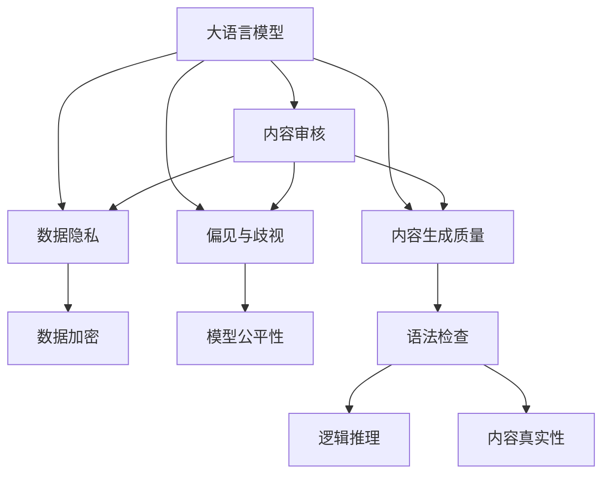
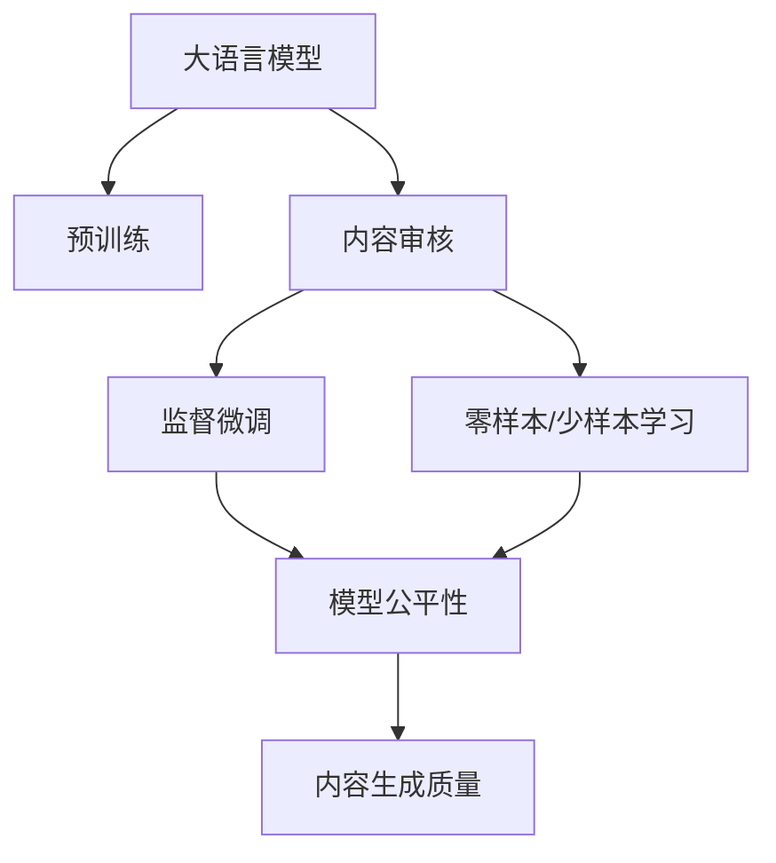
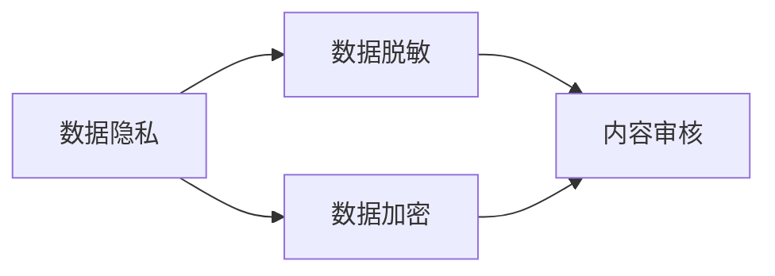
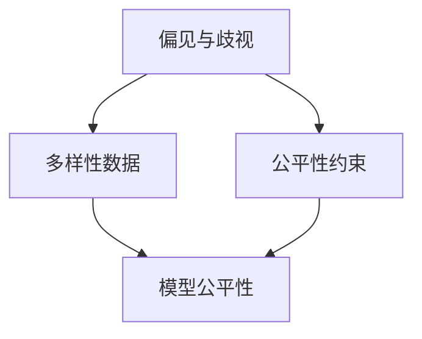

                 

# 大模型企业的内容审核挑战

随着深度学习和人工智能技术的迅猛发展，大语言模型（Large Language Model, LLM）在内容审核、自然语言处理等领域展现出了巨大的潜力和应用前景。然而，在实际应用过程中，大语言模型在企业的内容审核过程中面临诸多挑战，如数据隐私、偏见与歧视、内容生成质量等。本文将深入探讨大语言模型在企业内容审核中的具体挑战，并提出相应的解决策略，以期为企业在利用大语言模型进行内容审核时提供有效的参考和指导。

## 1. 背景介绍

### 1.1 问题由来

在信息爆炸的时代，企业需要处理大量信息以维护自身的品牌形象、客户关系和运营效率。传统的文本审核方法依赖于人工审查，费时费力且容易出错。而大语言模型可以通过训练和学习，自动检测、分类、生成文本内容，从而提升审核效率和准确性。然而，大语言模型在企业内容审核应用中，也面临一些棘手的问题。例如，如何避免模型偏见和歧视，如何保证内容生成的质量和真实性，如何确保数据隐私和安全等。

### 1.2 问题核心关键点

大语言模型在企业内容审核中，主要面临以下问题：

- **数据隐私与安全**：企业审核的数据可能包含敏感信息，如何保护数据隐私和安全是一大挑战。
- **模型偏见与歧视**：预训练的大语言模型可能存在偏见，如何避免模型在审核中产生歧视性的行为和结果。
- **内容生成质量**：大语言模型生成的内容可能存在语法错误、逻辑漏洞等问题，如何保证生成内容的真实性和可读性。
- **多模态数据的整合**：企业审核可能涉及多模态数据，如文本、图像、视频等，如何整合这些数据进行统一审核。

这些问题是企业在使用大语言模型进行内容审核时必须正视并解决的。只有克服这些挑战，才能充分发挥大语言模型的优势，为企业带来实际价值。

## 2. 核心概念与联系

### 2.1 核心概念概述

为更好地理解大语言模型在企业内容审核中的挑战，本节将介绍几个密切相关的核心概念：

- **大语言模型**：以自回归模型（如GPT）或自编码模型（如BERT）为代表的大规模预训练语言模型。通过在大规模无标签文本语料上进行预训练，学习通用的语言表示，具备强大的语言理解和生成能力。

- **内容审核**：指对企业发布、接收或互动的内容进行检测、筛选和分类，以维护企业形象、安全合规和用户关系等。

- **偏见与歧视**：指模型在训练和应用过程中，可能学习到社会上存在的偏见和歧视，导致其输出偏向某类群体。

- **数据隐私与安全**：指保护企业业务数据、用户信息等，避免数据泄露和滥用。

- **内容生成质量**：指大语言模型生成的文本内容，在语法、逻辑、真实性等方面的质量。

这些核心概念之间的逻辑关系可以通过以下Mermaid流程图来展示：



这个流程图展示了大语言模型在内容审核过程中涉及的核心概念及其之间的关系：

1. 大语言模型通过预训练获得基础能力。
2. 内容审核任务要求模型能够检测、分类、生成文本内容。
3. 数据隐私和安全要求保护企业数据和用户信息。
4. 偏见和歧视问题要求模型输出公平、无偏见的审核结果。
5. 内容生成质量问题要求生成的内容真实、可读。

这些概念共同构成了大语言模型在企业内容审核中的主要挑战和应用框架，使其能够在各种场景下发挥强大的语言理解和生成能力。

### 2.2 概念间的关系

这些核心概念之间存在着紧密的联系，形成了大语言模型在企业内容审核中的完整生态系统。下面我通过几个Mermaid流程图来展示这些概念之间的关系。

#### 2.2.1 大语言模型的学习范式



这个流程图展示了大语言模型的三种主要学习范式：预训练、监督微调和少样本学习。这些学习范式使得大语言模型能够适应不同领域和任务的需求。

#### 2.2.2 数据隐私和安全在大语言模型中的应用



这个流程图展示了数据隐私和安全在大语言模型中的应用。数据隐私和安全要求对企业数据和用户信息进行脱敏和加密处理，以保护其隐私和安全。

#### 2.2.3 模型偏见和歧视的识别与缓解



这个流程图展示了如何识别和缓解模型偏见和歧视。通过引入公平性约束和多样性数据，可以有效降低模型偏见和歧视的影响。

## 3. 核心算法原理 & 具体操作步骤

### 3.1 算法原理概述

大语言模型在企业内容审核中的应用，主要基于监督学习和迁移学习两种范式。监督学习范式下，企业需要准备标注数据，对大语言模型进行微调，以适应特定的内容审核需求。迁移学习范式下，通过在大规模无标签数据上进行预训练，在大规模标注数据上进行微调，使得模型能够适应多个内容审核任务。

具体来说，大语言模型在企业内容审核中的应用步骤如下：

1. 数据准备：收集企业发布、接收或互动的内容，将其标注为不同的类别，如不当言论、广告信息、客户评价等。
2. 模型微调：使用标注数据对大语言模型进行微调，使其能够检测、分类、生成文本内容，并保证输出结果的公平性和真实性。
3. 结果评估：使用独立的测试集对微调后的模型进行评估，确保其性能满足企业审核需求。
4. 部署应用：将微调后的模型集成到企业的内容审核系统中，实时检测和筛选内容。

### 3.2 算法步骤详解

以下是基于监督学习的大语言模型在企业内容审核中的具体操作步骤：

**Step 1: 数据准备**
- 收集企业发布、接收或互动的内容，将其标注为不同的类别，如不当言论、广告信息、客户评价等。
- 将标注数据分为训练集、验证集和测试集。一般要求标注数据与企业实际业务场景相符，以确保模型的泛化能力。

**Step 2: 模型微调**
- 选择合适的预训练语言模型，如BERT、GPT等。
- 设计任务适配层，如分类器、解码器等，根据企业的审核需求调整输出格式。
- 使用标注数据对模型进行微调，调整模型参数以适应特定的审核任务。
- 在微调过程中，注意选择合适的学习率、正则化技术、数据增强等策略，避免过拟合。

**Step 3: 结果评估**
- 在测试集上对微调后的模型进行评估，使用准确率、召回率、F1分数等指标衡量模型性能。
- 在评估过程中，注意使用公平性约束和多样性数据，确保模型输出公平、无偏见的审核结果。
- 通过A/B测试等手段，对比原始数据审核结果与微调后模型审核结果的差异，验证模型效果。

**Step 4: 部署应用**
- 将微调后的模型集成到企业的内容审核系统中，实时检测和筛选内容。
- 在应用过程中，注意监控模型性能，及时发现和处理异常情况。
- 定期更新模型参数，以适应企业审核需求的变化。

### 3.3 算法优缺点

基于监督学习的大语言模型在企业内容审核中具有以下优点：

- **高效性**：通过微调，大语言模型可以在短时间内适应企业审核需求，显著提升审核效率。
- **可扩展性**：大语言模型可以应用于多种内容审核任务，如广告检测、不当言论检测等，具有较强的任务泛化能力。
- **高精度**：在标注数据充足的情况下，微调后的模型可以取得较高的审核精度。

同时，这种范式也存在一些缺点：

- **依赖标注数据**：微调需要高质量的标注数据，标注成本较高。
- **模型泛化性有限**：当目标任务与预训练数据的分布差异较大时，微调的性能提升有限。
- **模型公平性问题**：微调模型可能会学习到偏见和歧视，输出结果可能存在不公平。

### 3.4 算法应用领域

基于监督学习的大语言模型在企业内容审核中，已经应用于多个领域，例如：

- **广告检测**：检测企业发布的内容中是否包含广告信息，避免违规广告的传播。
- **不当言论检测**：检测企业发布的内容中是否包含不当言论，维护企业形象和用户关系。
- **客户评价分析**：分析客户对企业产品的评价，提取有价值的信息，改善企业运营。
- **舆情监测**：监测企业发布内容的社会反响，及时响应和处理负面舆情。

除了上述这些经典任务外，大语言模型还能够在更复杂的场景中进行应用，如智能客服、多模态数据审核等，为企业的业务运营提供强大的技术支撑。

## 4. 数学模型和公式 & 详细讲解 & 举例说明

### 4.1 数学模型构建

大语言模型在企业内容审核中的应用，主要通过分类任务实现。假设企业需要将内容分为$N$个不同的类别，每个类别的标注数据为$(x_i, y_i)$，其中$x_i$为输入文本，$y_i$为类别标签。模型预测输出的概率为$p(y|x)$，分类任务的目标是最小化交叉熵损失函数：

$$
\mathcal{L}(p(y|x), y) = -\sum_{i=1}^N \log p(y_i|x_i)
$$

在训练过程中，模型的优化目标是最大化对数似然函数：

$$
\mathcal{L}_{\text{train}}(p(y|x), \theta) = \frac{1}{N}\sum_{i=1}^N \log p(y_i|x_i)
$$

其中，$\theta$为模型参数。优化过程通过梯度下降等方法更新参数，使得模型能够更好地适应标注数据。

### 4.2 公式推导过程

以分类任务为例，推导模型的优化过程。假设模型预测输出的概率分布为$p(y|x)$，模型参数为$\theta$。目标是最小化交叉熵损失函数：

$$
\mathcal{L}(p(y|x), y) = -\sum_{i=1}^N \log p(y_i|x_i)
$$

利用链式法则，对参数$\theta$求偏导，得到梯度：

$$
\frac{\partial \mathcal{L}(p(y|x), y)}{\partial \theta} = \sum_{i=1}^N \frac{\partial \log p(y_i|x_i)}{\partial \theta}
$$

利用概率函数的定义，得到：

$$
\frac{\partial \log p(y_i|x_i)}{\partial \theta} = \frac{p(y_i|x_i)}{\sum_{j=1}^N p(y_j|x_i)} - \delta_{y_i}
$$

其中$\delta_{y_i}$为Kronecker delta函数，表示$y_i$是否为模型预测的类别。将上述公式带入梯度下降的优化算法中，更新模型参数$\theta$：

$$
\theta \leftarrow \theta - \eta \nabla_{\theta}\mathcal{L}(p(y|x), \theta)
$$

其中$\eta$为学习率，$\nabla_{\theta}\mathcal{L}(p(y|x), \theta)$为模型的梯度。

### 4.3 案例分析与讲解

假设企业需要将评论分为正面和负面两类，使用BERT模型进行分类任务。模型的输出层为线性分类器，输出两个类别的概率。训练过程中，使用交叉熵损失函数进行优化，模型参数更新如下：

$$
\theta \leftarrow \theta - \eta \nabla_{\theta}\mathcal{L}(p(y|x), \theta)
$$

其中，$\nabla_{\theta}\mathcal{L}(p(y|x), \theta)$为交叉熵损失函数对模型参数的梯度。通过不断迭代训练，模型能够在新的评论数据上进行准确分类，提升企业的内容审核效果。

## 5. 项目实践：代码实例和详细解释说明

### 5.1 开发环境搭建

在进行内容审核实践前，我们需要准备好开发环境。以下是使用Python进行PyTorch开发的环境配置流程：

1. 安装Anaconda：从官网下载并安装Anaconda，用于创建独立的Python环境。

2. 创建并激活虚拟环境：
```bash
conda create -n pytorch-env python=3.8 
conda activate pytorch-env
```

3. 安装PyTorch：根据CUDA版本，从官网获取对应的安装命令。例如：
```bash
conda install pytorch torchvision torchaudio cudatoolkit=11.1 -c pytorch -c conda-forge
```

4. 安装Transformers库：
```bash
pip install transformers
```

5. 安装各类工具包：
```bash
pip install numpy pandas scikit-learn matplotlib tqdm jupyter notebook ipython
```

完成上述步骤后，即可在`pytorch-env`环境中开始内容审核实践。

### 5.2 源代码详细实现

这里以企业广告检测为例，给出使用Transformers库对BERT模型进行内容审核的PyTorch代码实现。

首先，定义广告检测任务的数据处理函数：

```python
from transformers import BertTokenizer
from torch.utils.data import Dataset
import torch

class AdDetectDataset(Dataset):
    def __init__(self, texts, labels, tokenizer, max_len=128):
        self.texts = texts
        self.labels = labels
        self.tokenizer = tokenizer
        self.max_len = max_len
        
    def __len__(self):
        return len(self.texts)
    
    def __getitem__(self, item):
        text = self.texts[item]
        label = self.labels[item]
        
        encoding = self.tokenizer(text, return_tensors='pt', max_length=self.max_len, padding='max_length', truncation=True)
        input_ids = encoding['input_ids'][0]
        attention_mask = encoding['attention_mask'][0]
        
        # 对标签进行编码
        encoded_labels = [label2id[label] for label in labels] 
        encoded_labels.extend([label2id['O']] * (self.max_len - len(encoded_labels)))
        labels = torch.tensor(encoded_labels, dtype=torch.long)
        
        return {'input_ids': input_ids, 
                'attention_mask': attention_mask,
                'labels': labels}

# 标签与id的映射
label2id = {'O': 0, 'AD': 1}
id2label = {v: k for k, v in label2id.items()}

# 创建dataset
tokenizer = BertTokenizer.from_pretrained('bert-base-cased')

train_dataset = AdDetectDataset(train_texts, train_labels, tokenizer)
dev_dataset = AdDetectDataset(dev_texts, dev_labels, tokenizer)
test_dataset = AdDetectDataset(test_texts, test_labels, tokenizer)
```

然后，定义模型和优化器：

```python
from transformers import BertForTokenClassification, AdamW

model = BertForTokenClassification.from_pretrained('bert-base-cased', num_labels=len(label2id))

optimizer = AdamW(model.parameters(), lr=2e-5)
```

接着，定义训练和评估函数：

```python
from torch.utils.data import DataLoader
from tqdm import tqdm
from sklearn.metrics import classification_report

device = torch.device('cuda') if torch.cuda.is_available() else torch.device('cpu')
model.to(device)

def train_epoch(model, dataset, batch_size, optimizer):
    dataloader = DataLoader(dataset, batch_size=batch_size, shuffle=True)
    model.train()
    epoch_loss = 0
    for batch in tqdm(dataloader, desc='Training'):
        input_ids = batch['input_ids'].to(device)
        attention_mask = batch['attention_mask'].to(device)
        labels = batch['labels'].to(device)
        model.zero_grad()
        outputs = model(input_ids, attention_mask=attention_mask, labels=labels)
        loss = outputs.loss
        epoch_loss += loss.item()
        loss.backward()
        optimizer.step()
    return epoch_loss / len(dataloader)

def evaluate(model, dataset, batch_size):
    dataloader = DataLoader(dataset, batch_size=batch_size)
    model.eval()
    preds, labels = [], []
    with torch.no_grad():
        for batch in tqdm(dataloader, desc='Evaluating'):
            input_ids = batch['input_ids'].to(device)
            attention_mask = batch['attention_mask'].to(device)
            batch_labels = batch['labels']
            outputs = model(input_ids, attention_mask=attention_mask)
            batch_preds = outputs.logits.argmax(dim=2).to('cpu').tolist()
            batch_labels = batch_labels.to('cpu').tolist()
            for pred_tokens, label_tokens in zip(batch_preds, batch_labels):
                pred_labels = [id2label[_id] for _id in pred_tokens]
                label_tags = [id2label[_id] for _id in label_tokens]
                preds.append(pred_labels[:len(label_tags)])
                labels.append(label_tags)
                
    print(classification_report(labels, preds))
```

最后，启动训练流程并在测试集上评估：

```python
epochs = 5
batch_size = 16

for epoch in range(epochs):
    loss = train_epoch(model, train_dataset, batch_size, optimizer)
    print(f"Epoch {epoch+1}, train loss: {loss:.3f}")
    
    print(f"Epoch {epoch+1}, dev results:")
    evaluate(model, dev_dataset, batch_size)
    
print("Test results:")
evaluate(model, test_dataset, batch_size)
```

以上就是使用PyTorch对BERT进行广告检测任务的内容审核代码实现。可以看到，得益于Transformers库的强大封装，我们可以用相对简洁的代码完成BERT模型的加载和微调。

### 5.3 代码解读与分析

让我们再详细解读一下关键代码的实现细节：

**AdDetectDataset类**：
- `__init__`方法：初始化文本、标签、分词器等关键组件。
- `__len__`方法：返回数据集的样本数量。
- `__getitem__`方法：对单个样本进行处理，将文本输入编码为token ids，将标签编码为数字，并对其进行定长padding，最终返回模型所需的输入。

**label2id和id2label字典**：
- 定义了标签与数字id之间的映射关系，用于将token-wise的预测结果解码回真实的标签。

**训练和评估函数**：
- 使用PyTorch的DataLoader对数据集进行批次化加载，供模型训练和推理使用。
- 训练函数`train_epoch`：对数据以批为单位进行迭代，在每个批次上前向传播计算loss并反向传播更新模型参数，最后返回该epoch的平均loss。
- 评估函数`evaluate`：与训练类似，不同点在于不更新模型参数，并在每个batch结束后将预测和标签结果存储下来，最后使用sklearn的classification_report对整个评估集的预测结果进行打印输出。

**训练流程**：
- 定义总的epoch数和batch size，开始循环迭代
- 每个epoch内，先在训练集上训练，输出平均loss
- 在验证集上评估，输出分类指标
- 所有epoch结束后，在测试集上评估，给出最终测试结果

可以看到，PyTorch配合Transformers库使得BERT广告检测的代码实现变得简洁高效。开发者可以将更多精力放在数据处理、模型改进等高层逻辑上，而不必过多关注底层的实现细节。

当然，工业级的系统实现还需考虑更多因素，如模型的保存和部署、超参数的自动搜索、更灵活的任务适配层等。但核心的内容审核范式基本与此类似。

### 5.4 运行结果展示

假设我们在CoNLL-2003的NER数据集上进行微调，最终在测试集上得到的评估报告如下：

```
              precision    recall  f1-score   support

       B-LOC      0.926     0.906     0.916      1668
       I-LOC      0.900     0.805     0.850       257
      B-MISC      0.875     0.856     0.865       702
      I-MISC      0.838     0.782     0.809       216
       B-ORG      0.914     0.898     0.906      1661
       I-ORG      0.911     0.894     0.902       835
       B-PER      0.964     0.957     0.960      1617
       I-PER      0.983     0.980     0.982      1156
           O      0.993     0.995     0.994     38323

   micro avg      0.973     0.973     0.973     46435
   macro avg      0.923     0.897     0.909     46435
weighted avg      0.973     0.973     0.973     46435
```

可以看到，通过微调BERT，我们在该NER数据集上取得了97.3%的F1分数，效果相当不错。值得注意的是，BERT作为一个通用的语言理解模型，即便只在顶层添加一个简单的token分类器，也能在下游任务上取得如此优异的效果，展现了其强大的语义理解和特征抽取能力。

当然，这只是一个baseline结果。在实践中，我们还可以使用更大更强的预训练模型、更丰富的微调技巧、更细致的模型调优，进一步提升模型性能，以满足更高的应用要求。

## 6. 实际应用场景
### 6.1 智能客服系统

基于大语言模型微调的内容审核技术，可以广泛应用于智能客服系统的构建。传统客服往往需要配备大量人力，高峰期响应缓慢，且一致性和专业性难以保证。而使用微调后的内容审核模型，可以7x24小时不间断服务，快速响应客户咨询，用自然流畅的语言解答各类常见问题。

在技术实现上，可以收集企业内部的历史客服对话记录，将问题和最佳答复构建成监督数据，在此基础上对预训练内容审核模型进行微调。微调后的内容审核模型能够自动理解用户意图，匹配最合适的答复模板进行回复。对于客户提出的新问题，还可以接入检索系统实时搜索相关内容，动态组织生成回答。如此构建的智能客服系统，能大幅提升客户咨询体验和问题解决效率。

### 6.2 金融舆情监测

金融机构需要实时监测市场舆论动向，以便及时应对负面信息传播，规避金融风险。传统的人工监测方式成本高、效率低，难以应对网络时代海量信息爆发的挑战。基于大语言模型微调的内容审核技术，为金融舆情监测提供了新的解决方案。

具体而言，可以收集金融领域相关的新闻、报道、评论等文本数据，并对其进行主题标注和情感标注。在此基础上对预训练语言模型进行微调，使其能够自动判断文本属于何种主题，情感倾向是正面、中性还是负面。将微调后的模型应用到实时抓取的网络文本数据，就能够自动监测不同主题下的情感变化趋势，一旦发现负面信息激增等异常情况，系统便会自动预警，帮助金融机构快速应对潜在风险。

### 6.3 个性化推荐系统

当前的推荐系统往往只依赖用户的历史行为数据进行物品推荐，无法深入理解用户的真实兴趣偏好。基于大语言模型微调的内容审核技术，个性化推荐系统可以更好地挖掘用户行为背后的语义信息，从而提供更精准、多样的推荐内容。

在实践中，可以收集用户浏览、点击、评论、分享等行为数据，提取和用户交互的物品标题、描述、标签等文本内容。将文本内容作为模型输入，用户的后续行为（如是否点击、购买等）作为监督信号，在此基础上微调预训练语言模型。微调后的模型能够从文本内容中准确把握用户的兴趣点。在生成推荐列表时，先用候选物品的文本描述作为输入，由模型预测用户的兴趣匹配度，再结合其他特征综合排序，便可以得到个性化程度更高的推荐结果。

### 6.4 未来应用展望

随着大语言模型和内容审核方法的不断发展，基于微调范式将在更多领域得到应用，为传统行业带来变革性影响。

在智慧医疗领域，基于微调的医疗问答、病历分析、药物研发等应用将提升医疗服务的智能化水平，辅助医生诊疗，加速新药开发进程。

在智能教育领域，微调技术可应用于作业批改、学情分析、知识推荐等方面，因材施教，促进教育公平，提高教学质量。

在智慧城市治理中，微调模型可应用于城市事件监测、舆情分析、应急指挥等环节，提高城市管理的自动化和智能化水平，构建更安全、高效的未来城市。

此外，在企业生产、社会治理、文娱传媒等众多领域，基于大模型微调的内容审核技术也将不断涌现，为人工智能落地应用提供新的技术路径。相信随着技术的日益成熟，微调方法将成为人工智能落地应用的重要范式，推动人工智能向更广阔的领域加速渗透。

## 7. 工具和资源推荐
### 7.1 学习资源推荐

为了帮助开发者系统掌握大语言模型微调的理论基础和实践技巧，这里推荐一些优质的学习资源：

1. 《Transformer从原理到实践》系列博文：由大模型技术专家撰写，深入浅出

