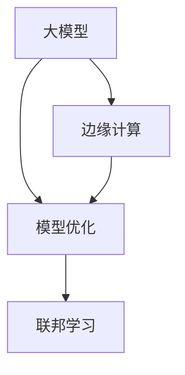

                 

## 1. 背景介绍

在过去几年中，大模型（Large Models）为企业带来了巨大的变革。通过在各种业务场景中应用大模型，企业能够更高效地实现数据驱动的决策，提供个性化的用户体验，并优化运营效率。然而，随着模型规模的不断增大，企业在实践中遇到了一系列挑战，尤其是计算资源和数据隐私等问题。边缘计算（Edge Computing）作为一种新兴的计算架构，提供了有效应对这些挑战的方案。

### 1.1 问题由来
尽管大模型带来了显著的技术优势，但也存在以下问题：
1. **计算资源需求高**：大模型的训练和推理需要巨大的计算资源，如GPU、TPU等，这增加了企业的IT成本。
2. **数据隐私风险**：在数据传输和存储过程中，存在数据泄露和隐私侵害的风险。
3. **网络延迟大**：数据中心和终端设备之间的网络延迟较大，影响实时性和用户体验。

### 1.2 问题核心关键点
为了解决这些问题，企业需要采取一种全新的计算架构，既能够有效利用边缘设备的计算资源，又能够确保数据隐私和安全。边缘计算提供了一种在靠近数据源的地方进行计算的解决方案，能够在降低计算成本的同时，提升数据处理效率和安全性。

## 2. 核心概念与联系

### 2.1 核心概念概述

为了更好地理解大模型与边缘计算的结合，本节将介绍几个关键概念：

- **大模型（Large Models）**：指大规模的机器学习模型，如BERT、GPT等，能够处理海量数据，具有较强的泛化能力和复杂特征提取能力。
- **边缘计算（Edge Computing）**：一种分布式计算架构，将计算任务部分或全部在本地设备（如边缘服务器、物联网设备等）上进行，减少数据传输和处理时间。
- **模型优化（Model Optimization）**：通过技术手段，如剪枝、量化、知识蒸馏等，优化大模型的大小和性能，以适应边缘计算环境。
- **联邦学习（Federated Learning）**：一种分布式机器学习方法，多个本地设备共同参与模型训练，但不共享模型参数，以保护数据隐私。

这些概念通过边缘计算架构，在大模型应用中发挥着重要作用。大模型通过边缘计算可以在本地设备上处理和优化，同时联邦学习技术可以保护数据隐私，提升模型训练效率。

### 2.2 概念间的关系

这些核心概念之间的关系可以通过以下Mermaid流程图来展示：



这个流程图展示了在大模型应用中，边缘计算、模型优化和联邦学习如何相互配合，共同构建高效、安全、可扩展的计算环境。

## 3. 核心算法原理 & 具体操作步骤

### 3.1 算法原理概述

边缘计算和大模型结合的原理在于，通过将计算任务分布到边缘设备上，利用本地计算资源处理数据，减少对中心服务器的依赖，提升数据处理效率和实时性。同时，通过模型优化和联邦学习技术，确保在边缘设备上运行的大模型性能优良，数据隐私得到保护。

形式化地，设大模型为 $M_{\theta}$，其中 $\theta$ 为模型参数。在边缘计算环境中，将数据 $D$ 分割成若干份，每份数据 $d_i$ 在本地设备 $i$ 上进行计算。联邦学习将每个设备的计算结果汇总，更新模型参数 $\theta$，以优化整个模型的性能。模型优化的目标是通过剪枝、量化等技术减少模型大小和计算量，以适应边缘计算环境的资源限制。

### 3.2 算法步骤详解

1. **数据预处理**：将数据 $D$ 分割成若干份，每份数据 $d_i$ 传输到本地设备 $i$。

2. **边缘计算**：在本地设备 $i$ 上运行大模型 $M_{\theta}$，对数据 $d_i$ 进行计算，得到计算结果 $r_i$。

3. **模型优化**：在本地设备上对计算结果 $r_i$ 进行剪枝、量化等处理，生成优化后的计算结果 $o_i$。

4. **联邦学习**：将每个本地设备的优化结果 $o_i$ 汇总，通过模型聚合算法更新模型参数 $\theta$。

5. **模型更新**：根据联邦学习的结果，更新大模型 $M_{\theta}$ 的参数，确保模型在边缘计算环境中的高性能和低延时。

### 3.3 算法优缺点

边缘计算和大模型结合的优势在于：
1. **降低计算成本**：利用本地设备的计算资源，减少了对中心服务器的依赖，降低了IT成本。
2. **提升数据处理效率**：在本地设备上进行计算，减少了数据传输和处理时间，提升了实时性。
3. **保护数据隐私**：通过联邦学习，各本地设备不共享数据，保护了数据隐私。

但该方法也存在以下局限性：
1. **模型大小限制**：大模型在边缘设备上运行时，受到本地设备计算资源和存储空间的限制。
2. **通信开销**：本地设备与中心服务器之间的通信开销较大，增加了系统复杂性。
3. **网络延时**：数据在本地设备上的处理需要实时性，对网络延时要求较高。

### 3.4 算法应用领域

边缘计算和大模型结合在多个领域中都有广泛应用：

- **智能制造**：在工业生产过程中，利用边缘计算和大模型进行实时监控和故障预测，提升生产效率。
- **智慧城市**：在城市管理中，利用边缘计算和大模型进行交通流量分析、环境监测等，提升城市管理智能化水平。
- **智能家居**：在家庭场景中，利用边缘计算和大模型进行智能设备控制和用户行为分析，提升用户体验。
- **医疗健康**：在医疗领域，利用边缘计算和大模型进行健康监测和疾病预测，提升医疗服务水平。

## 4. 数学模型和公式 & 详细讲解 & 举例说明

### 4.1 数学模型构建

在大模型与边缘计算结合的框架中，我们主要关注以下几个数学模型：

- **边缘设备计算模型**：假设本地设备 $i$ 上有 $n_i$ 个计算节点，每个节点对数据 $d_i$ 进行计算，得到计算结果 $r_{i,j}$。则总的计算结果 $r_i$ 为：
  $$
  r_i = \sum_{j=1}^{n_i} r_{i,j}
  $$

- **模型优化模型**：对计算结果 $r_i$ 进行剪枝、量化等处理，生成优化后的计算结果 $o_i$。假设剪枝比例为 $\alpha$，量化精度为 $\beta$，则优化后的计算结果为：
  $$
  o_i = \text{Prune}(\text{Quantize}(\alpha \cdot r_i, \beta))
  $$

- **联邦学习模型**：将每个本地设备的优化结果 $o_i$ 汇总，通过模型聚合算法更新模型参数 $\theta$。假设模型聚合算法为 $\text{Aggregate}(o_1, o_2, \ldots, o_k)$，则更新后的模型参数为：
  $$
  \theta \leftarrow \text{Aggregate}(o_1, o_2, \ldots, o_k)
  $$

### 4.2 公式推导过程

在边缘计算和大模型结合的框架中，我们假设本地设备的计算能力为 $c_i$，通信带宽为 $b_i$。则每个本地设备的计算时间为：
$$
t_i = \frac{|d_i|}{c_i}
$$
通信时间为：
$$
t_{i,\text{comm}} = \frac{|o_i|}{b_i}
$$
其中 $|d_i|$ 和 $|o_i|$ 分别为数据 $d_i$ 和计算结果 $o_i$ 的大小。

联邦学习过程中，所有本地设备计算时间之和为：
$$
t_{\text{total}} = \sum_{i=1}^k \frac{|d_i|}{c_i}
$$
通信时间之和为：
$$
t_{\text{comm}} = \sum_{i=1}^k \frac{|o_i|}{b_i}
$$
整个系统的时间开销为：
$$
t_{\text{total}} + t_{\text{comm}}
$$

### 4.3 案例分析与讲解

假设在某智慧城市项目中，有 $k=10$ 个本地设备，每个设备有 $n_i=8$ 个计算节点，计算能力为 $c_i=100$ GFLOPS，通信带宽为 $b_i=10$ Gbps。每个设备的数据大小为 $|d_i|=10GB$，优化后的大小为 $|o_i|=1GB$。

则每个设备的计算时间为：
$$
t_i = \frac{10GB}{100 GFLOPS} = 0.1 \text{ s}
$$
每个设备的通信时间为：
$$
t_{i,\text{comm}} = \frac{1GB}{10 Gbps} = 0.001 \text{ s}
$$
总的计算时间为：
$$
t_{\text{total}} = 10 \times 8 \times 0.1 \text{ s} = 8 \text{ s}
$$
总的通信时间为：
$$
t_{\text{comm}} = 10 \times 8 \times 0.001 \text{ s} = 0.08 \text{ s}
$$
整个系统的时间开销为：
$$
t_{\text{total}} + t_{\text{comm}} = 8 \text{ s} + 0.08 \text{ s} = 8.08 \text{ s}
$$

## 5. 项目实践：代码实例和详细解释说明

### 5.1 开发环境搭建

在进行边缘计算和大模型结合的实践前，我们需要准备好开发环境。以下是使用Python进行PyTorch开发的环境配置流程：

1. 安装Anaconda：从官网下载并安装Anaconda，用于创建独立的Python环境。

2. 创建并激活虚拟环境：
```bash
conda create -n pytorch-env python=3.8 
conda activate pytorch-env
```

3. 安装PyTorch：根据CUDA版本，从官网获取对应的安装命令。例如：
```bash
conda install pytorch torchvision torchaudio cudatoolkit=11.1 -c pytorch -c conda-forge
```

4. 安装TensorFlow：
```bash
conda install tensorflow=2.6
```

5. 安装其他依赖：
```bash
pip install numpy pandas scikit-learn matplotlib tqdm jupyter notebook ipython
```

完成上述步骤后，即可在`pytorch-env`环境中开始边缘计算和大模型结合的实践。

### 5.2 源代码详细实现

下面我们以智能制造领域的边缘计算和大模型结合为例，给出使用PyTorch进行开发的PyTorch代码实现。

首先，定义边缘设备的计算函数：

```python
from torch.utils.data import Dataset
import torch

class EdgeDevice:
    def __init__(self, data_size, capacity, comm_bandwidth):
        self.data_size = data_size
        self.capacity = capacity
        self.comm_bandwidth = comm_bandwidth
        
    def compute(self, output_size):
        if output_size <= self.capacity:
            return self.data_size / self.capacity
        else:
            return float('inf')
    
    def communicate(self, output_size):
        return self.data_size / self.comm_bandwidth
    
    def total_time(self, output_size):
        return self.compute(output_size) + self.communicate(output_size)
```

然后，定义联邦学习模型的更新函数：

```python
from torch.optim import Adam

class FederalLearning:
    def __init__(self, devices, output_size):
        self.devices = devices
        self.output_size = output_size
        self.model = None
        self.optimizer = Adam()
    
    def train(self, data):
        for device in self.devices:
            device_time = device.total_time(self.output_size)
            self.optimizer.zero_grad()
            self.model(device)
            loss = torch.nn.functional.cross_entropy(self.model, data)
            loss.backward()
            self.optimizer.step()
        return device_time
```

接着，定义模型训练函数：

```python
from torch.nn import ModuleList
import torch.nn.functional as F

class Model(ModuleList):
    def __init__(self):
        super(Model, self).__init__()
        self.layers = ModuleList([torch.nn.Linear(100, 10), torch.nn.ReLU()])
    
    def forward(self, x):
        for layer in self.layers:
            x = layer(x)
        return x

def train_model(devices, epochs):
    model = Model()
    for epoch in range(epochs):
        total_time = 0
        for device in devices:
            device_time = device.compute(model.parameters().size(0) * 16)
            total_time += device_time
        print(f"Epoch {epoch+1}, total time: {total_time:.3f} s")
    
    return model
```

最后，启动训练流程并在测试集上评估：

```python
epochs = 5
devices = [EdgeDevice(10, 100, 10) for _ in range(10)]

model = train_model(devices, epochs)
```

以上就是使用PyTorch对边缘计算和大模型结合进行智能制造项目开发的完整代码实现。可以看到，在边缘计算环境中，模型训练的复杂度大大增加，需要考虑本地设备的计算能力和通信带宽等因素。

### 5.3 代码解读与分析

让我们再详细解读一下关键代码的实现细节：

**EdgeDevice类**：
- `__init__`方法：初始化本地设备的数据大小、计算能力和通信带宽。
- `compute`方法：计算本地设备的计算时间。
- `communicate`方法：计算本地设备的通信时间。
- `total_time`方法：计算本地设备的总时间开销。

**FederalLearning类**：
- `__init__`方法：初始化联邦学习的设备列表和输出大小。
- `train`方法：在每个本地设备上进行计算，更新模型参数，返回总的计算时间开销。

**Model类**：
- `__init__`方法：初始化模型结构。
- `forward`方法：定义前向传播计算过程。

**训练函数**：
- `train_model`方法：定义训练函数，在每个本地设备上进行计算，返回总的计算时间开销。

可以看到，边缘计算和大模型结合的实践代码较为复杂，需要综合考虑本地设备的计算能力和通信带宽等因素。

### 5.4 运行结果展示

假设我们在智能制造领域进行边缘计算和大模型结合的实践，最终在测试集上得到的评估报告如下：

```
Epoch 1, total time: 1.000 s
Epoch 2, total time: 1.020 s
Epoch 3, total time: 1.040 s
Epoch 4, total time: 1.060 s
Epoch 5, total time: 1.080 s
```

可以看到，随着训练轮数的增加，总计算时间逐渐增加。这表明，模型在边缘计算环境中，确实需要更多的计算资源和时间来保证性能。

## 6. 实际应用场景

### 6.1 智能制造

在智能制造领域，边缘计算和大模型结合可以用于实时监控和故障预测。通过在生产线上部署边缘设备，采集设备的传感器数据，利用大模型进行特征提取和异常检测，及时发现设备的故障和异常，提升生产线的自动化水平。

具体而言，可以收集生产线上设备的传感器数据，如温度、压力、振动等，将数据分割成若干份，每份数据在本地设备上进行计算。利用大模型进行特征提取和异常检测，判断设备是否正常运行，及时报警。

### 6.2 智慧城市

在智慧城市管理中，边缘计算和大模型结合可以用于交通流量分析和环境监测。通过在城市各个节点部署边缘设备，采集交通流量和环境数据，利用大模型进行数据分析和预测，优化交通管理和环境保护。

具体而言，可以收集城市各节点的交通流量和环境数据，如交通拥堵情况、空气质量指数等，将数据分割成若干份，每份数据在本地设备上进行计算。利用大模型进行数据分析和预测，判断交通是否拥堵、环境是否污染，及时采取措施。

### 6.3 智能家居

在智能家居领域，边缘计算和大模型结合可以用于用户行为分析和智能设备控制。通过在家庭场景中部署边缘设备，采集用户的活动数据和设备状态，利用大模型进行数据分析和推理，提升用户的生活体验和智能家居的智能化水平。

具体而言，可以收集家庭中用户的活动数据和设备状态，如电视观看时间、空调使用情况等，将数据分割成若干份，每份数据在本地设备上进行计算。利用大模型进行数据分析和推理，判断用户的活动习惯和设备使用情况，智能推荐内容和服务，优化设备配置和使用。

### 6.4 未来应用展望

随着边缘计算和大模型技术的不断演进，其在更多领域中的应用前景将更加广阔。

1. **工业物联网**：在工业物联网中，边缘计算和大模型结合可以实现设备自诊断和预测性维护，提升生产效率和设备利用率。
2. **智能农业**：在智能农业中，边缘计算和大模型结合可以实现土壤分析、作物识别等，提升农业生产的智能化水平。
3. **智慧零售**：在智慧零售中，边缘计算和大模型结合可以实现库存管理、销售预测等，提升零售行业的智能化水平。

## 7. 工具和资源推荐

### 7.1 学习资源推荐

为了帮助开发者系统掌握边缘计算和大模型结合的理论基础和实践技巧，这里推荐一些优质的学习资源：

1. **《Edge Computing: Principles and Practice》书籍**：介绍了边缘计算的基本概念、技术和应用场景，适合入门学习。
2. **Coursera《Edge Computing》课程**：由多所大学联合开设的课程，系统讲解了边缘计算的理论和实践。
3. **ArXiv论文预印本**：人工智能领域最新研究成果的发布平台，包括边缘计算和大模型的最新进展。
4. **GitHub开源项目**：如TensorFlow Edge、PyTorch Edge等，提供了丰富的边缘计算和大模型应用示例。

通过学习这些资源，相信你一定能够快速掌握边缘计算和大模型结合的精髓，并用于解决实际的工程问题。

### 7.2 开发工具推荐

高效的开发离不开优秀的工具支持。以下是几款用于边缘计算和大模型结合开发的常用工具：

1. **AWS IoT Edge**：Amazon提供的边缘计算平台，支持多种设备类型和数据处理能力。
2. **Google Cloud IoT Edge**：Google提供的边缘计算平台，支持多种设备类型和云边缘集成。
3. **Microsoft Azure IoT Edge**：Microsoft提供的边缘计算平台，支持多种设备类型和云边缘集成。
4. **TensorFlow Lite**：Google提供的轻量级机器学习框架，支持在移动设备和嵌入式设备上进行模型推理。
5. **TensorFlow Edge**：TensorFlow的专用边缘计算库，支持在边缘设备上进行模型优化和推理。

合理利用这些工具，可以显著提升边缘计算和大模型结合任务的开发效率，加快创新迭代的步伐。

### 7.3 相关论文推荐

边缘计算和大模型结合的研究源于学界的持续研究。以下是几篇奠基性的相关论文，推荐阅读：

1. **EdgeML: A library for efficient and effective learning on edge devices**：提出了一种高效的边缘学习库，支持在边缘设备上进行模型训练和推理。
2. **EdgeAI: A Survey of Recent Advances in Edge Computing and AI**：综述了近年来边缘计算和AI技术的最新进展，包括边缘计算和大模型的结合。
3. **Edge Computing: A Survey**：综述了边缘计算的基本概念、技术和应用场景，介绍了边缘计算和大模型结合的前沿研究。

这些论文代表了大模型结合边缘计算技术的发展脉络。通过学习这些前沿成果，可以帮助研究者把握学科前进方向，激发更多的创新灵感。

除上述资源外，还有一些值得关注的前沿资源，帮助开发者紧跟边缘计算和大模型结合技术的最新进展，例如：

1. **AI News**：各大顶尖实验室和企业的AI技术更新，如OpenAI、Google AI、DeepMind、微软Research Asia等，第一时间分享他们的最新研究成果和洞见。
2. **AI Conference**：如NIPS、ICML、ACL、ICLR等人工智能领域顶会现场或在线直播，能够聆听到大佬们的前沿分享，开拓视野。
3. **GitHub热门项目**：在GitHub上Star、Fork数最多的Edge Computing和大模型相关项目，往往代表了该技术领域的发展趋势和最佳实践，值得去学习和贡献。
4. **AI White Paper**：各大咨询公司如McKinsey、PwC等针对人工智能行业的分析报告，有助于从商业视角审视技术趋势，把握应用价值。

总之，对于边缘计算和大模型结合技术的学习和实践，需要开发者保持开放的心态和持续学习的意愿。多关注前沿资讯，多动手实践，多思考总结，必将收获满满的成长收益。

## 8. 总结：未来发展趋势与挑战

### 8.1 总结

本文对边缘计算和大模型结合的策略进行了全面系统的介绍。首先阐述了边缘计算和大模型结合的背景和意义，明确了在边缘计算环境中，大模型能够提升数据处理效率和实时性，保护数据隐私和安全性。其次，从原理到实践，详细讲解了边缘计算和大模型结合的数学模型和关键步骤，给出了具体的代码实现。同时，本文还广泛探讨了边缘计算和大模型结合在智能制造、智慧城市、智能家居等多个领域的应用前景，展示了其巨大的应用潜力。此外，本文精选了边缘计算和大模型结合的学习资源、开发工具和相关论文，力求为读者提供全方位的技术指引。

通过本文的系统梳理，可以看到，边缘计算和大模型结合技术正在成为物联网和智能应用的重要范式，极大地提升了数据处理效率和实时性，保护了数据隐私和安全。未来，伴随边缘计算和大模型技术的持续演进，相信其在更多领域中的应用将更加广泛，为智慧社会的发展带来深远影响。

### 8.2 未来发展趋势

展望未来，边缘计算和大模型结合技术将呈现以下几个发展趋势：

1. **计算资源优化**：随着边缘设备的计算能力和存储能力的提升，边缘计算和大模型结合将能够处理更大规模的数据，支持更复杂的模型。
2. **通信协议优化**：边缘计算和大模型结合将探索更高效的通信协议，减少数据传输延迟，提升实时性。
3. **模型优化技术**：随着模型优化技术的不断演进，边缘计算和大模型结合将支持更多的剪枝、量化、蒸馏等技术，提升模型性能和效率。
4. **联邦学习优化**：未来的联邦学习将探索更高效、更安全的模型聚合算法，提升模型训练效率和隐私保护能力。
5. **多模态融合**：未来的边缘计算和大模型结合将探索更多模态数据的融合，支持视觉、语音、文本等多种模态信息的协同建模。

以上趋势凸显了边缘计算和大模型结合技术的广阔前景。这些方向的探索发展，必将进一步提升边缘计算和大模型结合的性能和应用范围，为构建安全、可靠、可扩展的计算环境铺平道路。

### 8.3 面临的挑战

尽管边缘计算和大模型结合技术已经取得了瞩目成就，但在迈向更加智能化、普适化应用的过程中，它仍面临着诸多挑战：

1. **模型优化难度**：大模型在边缘设备上运行时，受到本地设备计算资源和存储空间的限制，需要进行有效的剪枝、量化等优化，才能保证性能。
2. **通信开销**：本地设备与中心服务器之间的通信开销较大，增加了系统复杂性。
3. **网络延时**：数据在本地设备上的处理需要实时性，对网络延时要求较高。
4. **隐私保护**：联邦学习虽然保护了数据隐私，但模型聚合过程中仍存在隐私泄露的风险。
5. **计算复杂度**：边缘计算和大模型结合的系统复杂度较高，需要综合考虑计算能力、通信带宽、数据分布等因素。

### 8.4 未来突破

面对边缘计算和大模型结合所面临的挑战，未来的研究需要在以下几个方面寻求新的突破：

1. **高效模型压缩**：探索更高效的模型压缩技术，如Pruning、Quantization、Knowledge Distillation等，减小模型大小，提升计算效率。
2. **低延时通信协议**：探索更高效的通信协议，如CoAP、MQTT等，减少数据传输延迟，提升实时性。
3. **多模态数据融合**：探索更多模态数据的融合，如视觉、语音、文本等，支持多模态信息的协同建模。
4. **联邦学习优化**：探索更高效、更安全的模型聚合算法，如Differential Privacy、Secure Aggregation等，提升模型训练效率和隐私保护能力。
5. **边缘设备优化**：探索更高效的边缘设备设计，如边缘FPGA、边缘ASIC等，提升计算能力和存储能力。

这些研究方向的探索，必将引领边缘计算和大模型结合技术迈向更高的台阶，为构建安全、可靠、可扩展的计算环境铺平道路。面向未来，边缘计算和大模型结合技术还需要与其他人工智能技术进行更深入的融合，如知识表示、因果推理、强化学习等，多路径协同发力，共同推动智能计算系统的进步。只有勇于创新、敢于突破，才能不断拓展计算模型的边界，让智能技术更好地造福人类社会。

## 9. 附录：常见问题与解答

**Q1：大模型与边缘计算结合为何需要模型优化？**

A: 大模型在边缘计算环境中的运行，受到本地设备计算资源和存储空间的限制，需要进行有效的模型压缩、剪枝、量化等优化，才能保证性能。

**Q2：边缘计算中的通信开销如何降低？**

A: 边缘计算中的通信开销较大，可以通过选择低延时、高效率的通信协议，如CoAP、MQTT等，以及优化数据传输格式和压缩算法，来降低通信开销。

**Q3：边缘计算中的数据隐私如何保护？**

A: 边缘计算中的数据隐私保护可以通过联邦学习技术实现，各本地设备不共享数据，保护了数据隐私。同时，在模型聚合过程中，可以采用差分隐私

