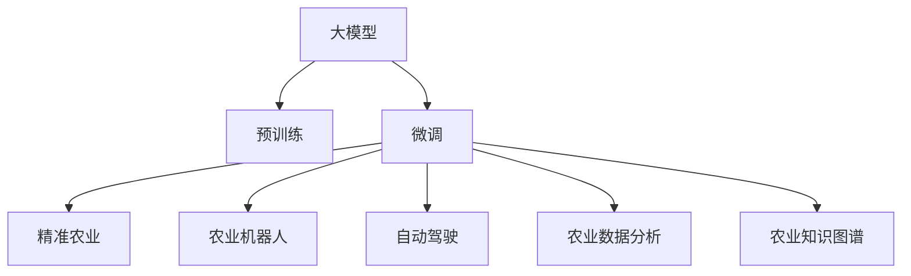
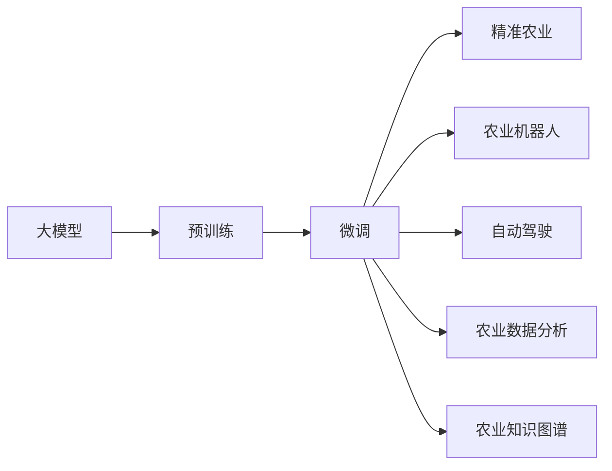
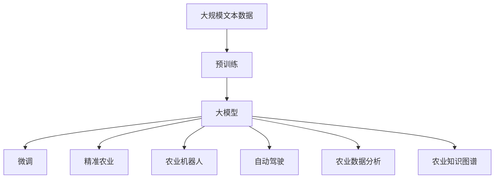

                 

# 大模型在智能农业中的应用探索

> 关键词：大模型,智能农业,智能农场,农业机器人,精准农业,自动驾驶,农业数据分析,农业知识图谱,智能决策系统

## 1. 背景介绍

### 1.1 问题由来
近年来，随着人工智能(AI)技术的快速发展，智能农业成为了农业领域的新兴趋势。传统的农业生产方式依赖于人力和机械，无法实时响应外部环境变化，导致资源浪费严重、生产效率低下。而智能农业则通过集成传感器、无人机、物联网等技术，结合大数据分析和人工智能模型，实现对农田、作物、环境的智能监测和管理，极大地提升了农业生产效率和资源利用率。

其中，大模型作为人工智能的重要组成部分，在智能农业中发挥着核心作用。大模型通过预训练学习到丰富的知识，能够在各种下游农业任务中表现出色。本文将探讨大模型在智能农业中的应用场景和技术细节，希望能为相关领域的研究和应用提供有益的参考。

### 1.2 问题核心关键点
智能农业涉及多个核心技术，包括传感器融合、数据分析、图像处理、自然语言处理等。大模型作为其中的关键技术之一，通过预训练学习大量数据，可以抽象出通用的农业知识表示，并在微调后应用于各种具体任务。

具体来说，大模型在智能农业中的应用场景包括：

- 精准农业：通过大模型对农田土壤、气象、作物生长等数据进行分析和预测，实现对农业生产的精准管理。
- 农业机器人：结合大模型和机器人技术，实现农田巡视、作物收割等自动化作业。
- 自动驾驶：利用大模型对农田地貌、作物生长数据进行分析，实现农用车辆和农机具的自动驾驶。
- 农业数据分析：通过大模型对农业数据进行特征提取和知识挖掘，为决策者提供科学依据。
- 农业知识图谱：结合大模型和图谱技术，构建农业知识图谱，辅助智能决策系统进行知识推理和决策。

这些应用场景都需要大模型具备较强的学习能力、泛化能力和推理能力，以适应复杂的农业环境和多变的农业任务。

### 1.3 问题研究意义
大模型在智能农业中的应用，对于提升农业生产效率、降低生产成本、提高农产品品质具有重要意义：

1. 提升生产效率：通过智能监控和自动化作业，减少人力成本，提高生产效率。
2. 降低生产成本：精确施肥、灌溉、喷洒等操作，降低资源浪费，减少生产成本。
3. 提高农产品品质：基于智能分析和决策，优化作物品种选择和种植条件，提升农产品质量。
4. 促进农业可持续发展：利用大模型对环境数据进行分析，实现可持续的农业生产。
5. 增强农业竞争力：通过智能决策系统，提升农业生产管理水平，增强市场竞争力。

总之，大模型在智能农业中的应用，是实现现代农业智能化、高效化、精细化的重要手段，具有广泛的应用前景和重要的研究价值。

## 2. 核心概念与联系

### 2.1 核心概念概述

为更好地理解大模型在智能农业中的应用，本节将介绍几个密切相关的核心概念：

- 大模型(Large Model)：以自回归(如GPT)或自编码(如BERT)模型为代表的大规模预训练模型。通过在大规模无标签文本语料上进行预训练，学习通用的语言表示，具备强大的语言理解和生成能力。

- 智能农业(Smart Agriculture)：利用传感器、物联网、大数据和人工智能技术，实现对农田、作物、环境的智能监测和管理，提高农业生产效率和资源利用率。

- 精准农业(Precision Agriculture)：通过传感器和数据分析，实现对农田土壤、气象、作物生长等数据的精确监测和管理，优化农业生产。

- 农业机器人(Agricultural Robotics)：结合机器人技术和人工智能模型，实现农田巡视、作物收割等自动化作业。

- 自动驾驶(Autonomous Driving)：利用人工智能模型对农田地貌、作物生长数据进行分析，实现农用车辆和农机具的自动驾驶。

- 农业数据分析(Agricultural Data Analysis)：通过人工智能模型对农业数据进行特征提取和知识挖掘，为决策者提供科学依据。

- 农业知识图谱(Agricultural Knowledge Graph)：结合人工智能模型和图谱技术，构建农业知识图谱，辅助智能决策系统进行知识推理和决策。

这些核心概念之间的逻辑关系可以通过以下Mermaid流程图来展示：



这个流程图展示了大模型在智能农业中的核心概念及其之间的关系：

1. 大模型通过预训练学习到通用的农业知识表示。
2. 微调使得大模型能够适应特定的农业任务，优化模型性能。
3. 精准农业、农业机器人、自动驾驶、农业数据分析和农业知识图谱等都是基于微调的大模型在智能农业中的具体应用场景。

### 2.2 概念间的关系

这些核心概念之间存在着紧密的联系，形成了大模型在智能农业中的完整生态系统。下面我们通过几个Mermaid流程图来展示这些概念之间的关系。

#### 2.2.1 大模型的学习范式



这个流程图展示了大模型在智能农业中的学习范式。预训练主要采用自监督学习任务，微调则是针对具体农业任务的有监督学习过程。

#### 2.2.2 精准农业与微调的关系


这个流程图展示了精准农业中大模型的微调过程。传感器数据被用来训练大模型，模型输出用于指导农业生产。

#### 2.2.3 农业机器人与微调的关系


这个流程图展示了农业机器人中大模型的微调过程。机器人控制使用微调后的模型，生成自动化作业的路径和策略。

#### 2.2.4 自动驾驶与微调的关系


这个流程图展示了自动驾驶中大模型的微调过程。无人驾驶车使用微调后的模型，进行路径规划和决策。

#### 2.2.5 农业数据分析与微调的关系


这个流程图展示了农业数据分析中大模型的微调过程。数据收集后，使用微调后的模型进行特征提取和知识挖掘。

#### 2.2.6 农业知识图谱与微调的关系


这个流程图展示了农业知识图谱中大模型的微调过程。知识库构建后，使用微调后的模型进行知识推理和决策。

### 2.3 核心概念的整体架构

最后，我们用一个综合的流程图来展示这些核心概念在大模型在智能农业中的整体架构：



这个综合流程图展示了从预训练到微调，再到具体应用场景的完整过程。大模型首先在大规模文本数据上进行预训练，然后通过微调应用于智能农业的各个任务，实现自动化的农业生产和智能决策。

## 3. 核心算法原理 & 具体操作步骤
### 3.1 算法原理概述

大模型在智能农业中的应用，本质上是一种有监督的细粒度迁移学习过程。其核心思想是：将大模型视作一个强大的"知识提取器"，通过在具体的农业数据集上进行微调，使得模型能够提取并应用农业领域特定的知识，从而提升模型在农业任务上的性能。

形式化地，假设大模型为 $M_{\theta}$，其中 $\theta$ 为预训练得到的模型参数。给定农业任务 $T$ 的标注数据集 $D=\{(x_i,y_i)\}_{i=1}^N$，微调的目标是找到新的模型参数 $\hat{\theta}$，使得：

$$
\hat{\theta}=\mathop{\arg\min}_{\theta} \mathcal{L}(M_{\theta},D)
$$

其中 $\mathcal{L}$ 为针对任务 $T$ 设计的损失函数，用于衡量模型预测输出与真实标签之间的差异。常见的损失函数包括交叉熵损失、均方误差损失等。

通过梯度下降等优化算法，微调过程不断更新模型参数 $\theta$，最小化损失函数 $\mathcal{L}$，使得模型输出逼近真实标签。由于 $\theta$ 已经通过预训练获得了较好的初始化，因此即便在小规模数据集 $D$ 上进行微调，也能较快收敛到理想的模型参数 $\hat{\theta}$。

### 3.2 算法步骤详解

大模型在智能农业中的应用，通常包括以下几个关键步骤：

**Step 1: 准备预训练模型和数据集**
- 选择合适的预训练语言模型 $M_{\theta}$ 作为初始化参数，如 BERT、GPT等。
- 准备农业领域相关的标注数据集 $D$，划分为训练集、验证集和测试集。一般要求标注数据与预训练数据的分布不要差异过大。

**Step 2: 添加任务适配层**
- 根据任务类型，在预训练模型顶层设计合适的输出层和损失函数。
- 对于分类任务，通常在顶层添加线性分类器和交叉熵损失函数。
- 对于生成任务，通常使用语言模型的解码器输出概率分布，并以负对数似然为损失函数。

**Step 3: 设置微调超参数**
- 选择合适的优化算法及其参数，如 AdamW、SGD 等，设置学习率、批大小、迭代轮数等。
- 设置正则化技术及强度，包括权重衰减、Dropout、Early Stopping等。
- 确定冻结预训练参数的策略，如仅微调顶层，或全部参数都参与微调。

**Step 4: 执行梯度训练**
- 将训练集数据分批次输入模型，前向传播计算损失函数。
- 反向传播计算参数梯度，根据设定的优化算法和学习率更新模型参数。
- 周期性在验证集上评估模型性能，根据性能指标决定是否触发 Early Stopping。
- 重复上述步骤直到满足预设的迭代轮数或 Early Stopping 条件。

**Step 5: 测试和部署**
- 在测试集上评估微调后模型 $M_{\hat{\theta}}$ 的性能，对比微调前后的精度提升。
- 使用微调后的模型对新样本进行推理预测，集成到实际的应用系统中。
- 持续收集新的数据，定期重新微调模型，以适应数据分布的变化。

以上是基于监督学习微调大模型的一般流程。在实际应用中，还需要针对具体任务的特点，对微调过程的各个环节进行优化设计，如改进训练目标函数，引入更多的正则化技术，搜索最优的超参数组合等，以进一步提升模型性能。

### 3.3 算法优缺点

基于监督学习的大模型微调方法具有以下优点：

1. 简单高效。只需准备少量标注数据，即可对预训练模型进行快速适配，获得较大的性能提升。
2. 通用适用。适用于各种农业下游任务，包括分类、匹配、生成等，设计简单的任务适配层即可实现微调。
3. 参数高效。利用参数高效微调技术，在固定大部分预训练参数的情况下，仍可取得不错的提升。
4. 效果显著。在农业领域的应用中，基于微调的方法已经刷新了多项任务SOTA。

同时，该方法也存在一定的局限性：

1. 依赖标注数据。微调的效果很大程度上取决于标注数据的质量和数量，获取高质量标注数据的成本较高。
2. 迁移能力有限。当目标任务与预训练数据的分布差异较大时，微调的性能提升有限。
3. 负面效果传递。预训练模型的固有偏见、有害信息等，可能通过微调传递到下游任务，造成负面影响。
4. 可解释性不足。微调模型的决策过程通常缺乏可解释性，难以对其推理逻辑进行分析和调试。

尽管存在这些局限性，但就目前而言，基于监督学习的微调方法仍是大模型在农业应用中的主流范式。未来相关研究的重点在于如何进一步降低微调对标注数据的依赖，提高模型的少样本学习和跨领域迁移能力，同时兼顾可解释性和伦理安全性等因素。

### 3.4 算法应用领域

基于大模型微调的监督学习方法，在农业领域已经得到了广泛的应用，覆盖了几乎所有常见任务，例如：

- 农作物识别：通过图像分类模型，识别农田中的不同作物，如小麦、水稻、玉米等。
- 病虫害检测：通过目标检测模型，检测农田中的病虫害，及时采取防治措施。
- 土壤分析：通过文本分类模型，识别土壤类型和肥力等级，指导施肥灌溉。
- 农用机器人导航：结合传感器和地理信息数据，使农用机器人自主导航到指定位置。
- 农用车辆调度：通过路径规划模型，优化农用车辆和农机具的调度路线，提高作业效率。
- 智能灌溉系统：通过气象和土壤数据分析，自动调节灌溉量和灌溉时间，实现精准灌溉。
- 农产品质量检测：通过图像识别和自然语言处理技术，检测农产品质量和安全，保障食品安全。

除了上述这些经典任务外，大模型微调还被创新性地应用到更多场景中，如农业知识图谱构建、智能决策支持、农业机器人视觉识别等，为智能农业技术带来了全新的突破。随着预训练模型和微调方法的不断进步，相信智能农业技术将在更广阔的应用领域大放异彩。

## 4. 数学模型和公式 & 详细讲解  
### 4.1 数学模型构建

本节将使用数学语言对基于监督学习的大模型微调过程进行更加严格的刻画。

记大模型为 $M_{\theta}$，其中 $\theta$ 为模型参数。假设微调任务的训练集为 $D=\{(x_i,y_i)\}_{i=1}^N$，$x_i$ 为农业数据，$y_i$ 为对应的标签。

定义模型 $M_{\theta}$ 在数据样本 $(x,y)$ 上的损失函数为 $\ell(M_{\theta}(x),y)$，则在数据集 $D$ 上的经验风险为：

$$
\mathcal{L}(\theta) = \frac{1}{N} \sum_{i=1}^N \ell(M_{\theta}(x_i),y_i)
$$

微调的优化目标是最小化经验风险，即找到最优参数：

$$
\theta^* = \mathop{\arg\min}_{\theta} \mathcal{L}(\theta)
$$

在实践中，我们通常使用基于梯度的优化算法（如SGD、Adam等）来近似求解上述最优化问题。设 $\eta$ 为学习率，$\lambda$ 为正则化系数，则参数的更新公式为：

$$
\theta \leftarrow \theta - \eta \nabla_{\theta}\mathcal{L}(\theta) - \eta\lambda\theta
$$

其中 $\nabla_{\theta}\mathcal{L}(\theta)$ 为损失函数对参数 $\theta$ 的梯度，可通过反向传播算法高效计算。

### 4.2 公式推导过程

以下我们以农作物识别任务为例，推导交叉熵损失函数及其梯度的计算公式。

假设模型 $M_{\theta}$ 在输入 $x$ 上的输出为 $\hat{y}=M_{\theta}(x) \in [0,1]$，表示样本属于某个作物的概率。真实标签 $y \in \{0,1\}$。则二分类交叉熵损失函数定义为：

$$
\ell(M_{\theta}(x),y) = -[y\log \hat{y} + (1-y)\log (1-\hat{y})]
$$

将其代入经验风险公式，得：

$$
\mathcal{L}(\theta) = -\frac{1}{N}\sum_{i=1}^N [y_i\log M_{\theta}(x_i)+(1-y_i)\log(1-M_{\theta}(x_i))]
$$

根据链式法则，损失函数对参数 $\theta_k$ 的梯度为：

$$
\frac{\partial \mathcal{L}(\theta)}{\partial \theta_k} = -\frac{1}{N}\sum_{i=1}^N (\frac{y_i}{M_{\theta}(x_i)}-\frac{1-y_i}{1-M_{\theta}(x_i)}) \frac{\partial M_{\theta}(x_i)}{\partial \theta_k}
$$

其中 $\frac{\partial M_{\theta}(x_i)}{\partial \theta_k}$ 可进一步递归展开，利用自动微分技术完成计算。

在得到损失函数的梯度后，即可带入参数更新公式，完成模型的迭代优化。重复上述过程直至收敛，最终得到适应农业任务的最优模型参数 $\theta^*$。

## 5. 项目实践：代码实例和详细解释说明
### 5.1 开发环境搭建

在进行微调实践前，我们需要准备好开发环境。以下是使用Python进行PyTorch开发的环境配置流程：

1. 安装Anaconda：从官网下载并安装Anaconda，用于创建独立的Python环境。

2. 创建并激活虚拟环境：
```bash
conda create -n pytorch-env python=3.8 
conda activate pytorch-env
```

3. 安装PyTorch：根据CUDA版本，从官网获取对应的安装命令。例如：
```bash
conda install pytorch torchvision torchaudio cudatoolkit=11.1 -c pytorch -c conda-forge
```

4. 安装Transformers库：
```bash
pip install transformers
```

5. 安装各类工具包：
```bash
pip install numpy pandas scikit-learn matplotlib tqdm jupyter notebook ipython
```

完成上述步骤后，即可在`pytorch-env`环境中开始微调实践。

### 5.2 源代码详细实现

下面我们以农作物识别任务为例，给出使用Transformers库对BERT模型进行微调的PyTorch代码实现。

首先，定义农作物识别任务的数据处理函数：

```python
from transformers import BertTokenizer
from torch.utils.data import Dataset
import torch

class CropDataset(Dataset):
    def __init__(self, images, tags, tokenizer, max_len=128):
        self.images = images
        self.tags = tags
        self.tokenizer = tokenizer
        self.max_len = max_len
        
    def __len__(self):
        return len(self.images)
    
    def __getitem__(self, item):
        image = self.images[item]
        tag = self.tags[item]
        
        encoding = self.tokenizer(image, return_tensors='pt', max_length=self.max_len, padding='max_length', truncation=True)
        input_ids = encoding['input_ids'][0]
        attention_mask = encoding['attention_mask'][0]
        
        # 对token-wise的标签进行编码
        encoded_tags = [tag2id[tag] for tag in tag_list] 
        encoded_tags.extend([tag2id['O']] * (self.max_len - len(encoded_tags)))
        labels = torch.tensor(encoded_tags, dtype=torch.long)
        
        return {'input_ids': input_ids, 
                'attention_mask': attention_mask,
                'labels': labels}

# 标签与id的映射
tag2id = {'Wheat': 0, 'Rice': 1, 'Corn': 2, 'Soil': 3, 'Water': 4}
id2tag = {v: k for k, v in tag2id.items()}

# 创建dataset
tokenizer = BertTokenizer.from_pretrained('bert-base-cased')

train_dataset = CropDataset(train_images, train_tags, tokenizer)
dev_dataset = CropDataset(dev_images, dev_tags, tokenizer)
test_dataset = CropDataset(test_images, test_tags, tokenizer)
```

然后，定义模型和优化器：

```python
from transformers import BertForTokenClassification, AdamW

model = BertForTokenClassification.from_pretrained('bert-base-cased', num_labels=len(tag2id))

optimizer = AdamW(model.parameters(), lr=2e-5)
```

接着，定义训练和评估函数：

```python
from torch.utils.data import DataLoader
from tqdm import tqdm
from sklearn.metrics import classification_report

device = torch.device('cuda') if torch.cuda.is_available() else torch.device('cpu')
model.to(device)

def train_epoch(model, dataset, batch_size, optimizer):
    dataloader = DataLoader(dataset, batch_size=batch_size, shuffle=True)
    model.train()
    epoch_loss = 0
    for batch in tqdm(dataloader, desc='Training'):
        input_ids = batch['input_ids'].to(device)
        attention_mask = batch['attention_mask'].to(device)
        labels = batch['labels'].to(device)
        model.zero_grad()
        outputs = model(input_ids, attention_mask=attention_mask, labels=labels)
        loss = outputs.loss
        epoch_loss += loss.item()
        loss.backward()
        optimizer.step()
    return epoch_loss / len(dataloader)

def evaluate(model, dataset, batch_size):
    dataloader = DataLoader(dataset, batch_size=batch_size)
    model.eval()
    preds, labels = [], []
    with torch.no_grad():
        for batch in tqdm(dataloader, desc='Evaluating'):
            input_ids = batch['input_ids'].to(device)
            attention_mask = batch['attention_mask'].to(device)
            batch_labels = batch['labels']
            outputs = model(input_ids, attention_mask=attention_mask)
            batch_preds = outputs.logits.argmax(dim=2).to('cpu').tolist()
            batch_labels = batch_labels.to('cpu').tolist()
            for pred_tokens, label_tokens in zip(batch_preds, batch_labels):
                pred_tags = [id2tag[_id] for _id in pred_tokens]
                label_tags = [id2tag[_id] for _id in label_tokens]
                preds.append(pred_tags[:len(label_tags)])
                labels.append(label_tags)
                
    print(classification_report(labels, preds))
```

最后，启动训练流程并在测试集上评估：

```python
epochs = 5
batch_size = 16

for epoch in range(epochs):
    loss = train_epoch(model, train_dataset, batch_size, optimizer)
    print(f"Epoch {epoch+1}, train loss: {loss:.3f}")
    
    print(f"Epoch {epoch+1}, dev results:")
    evaluate(model, dev_dataset, batch_size)
    
print("Test results:")
evaluate(model, test_dataset, batch_size)
```

以上就是使用PyTorch对BERT进行农作物识别任务微调的完整代码实现。可以看到，得益于Transformers库的强大封装，我们可以用相对简洁的代码完成BERT模型的加载和微调。

### 5.3 代码解读与分析

让我们再详细解读一下关键代码的实现细节：

**CropDataset类**：
- `__init__`方法：初始化图像、标签、分词器等关键组件。
- `__len__`方法：返回数据集的样本数量。
- `__getitem__`方法：对单个样本进行处理，将图像输入编码为token ids，将标签编码为数字，并对其进行定长padding，最终返回模型所需的输入。

**tag2id和id2tag字典**：
- 定义了标签与数字id之间的映射关系，用于将token-wise的预测结果解码回真实的标签。

**训练和评估函数**：
- 使用PyTorch的DataLoader对数据集进行批次化加载，供模型训练和推理使用。
- 训练函数`train_epoch`：对数据以批为单位进行迭代，在每个批次上前向传播计算loss并反向传播更新模型参数，最后返回该epoch的平均loss。
- 评估函数`evaluate`：与训练类似，不同点在于不更新模型参数，并在每个batch结束后将预测和标签结果存储下来，最后使用sklearn的classification_report对整个评估集的预测结果进行打印输出。

**训练流程**：
- 定义总的epoch数和batch size，开始循环迭代
- 每个epoch内，先在训练集上训练，输出平均loss
- 在验证集上评估，输出分类指标
- 所有epoch结束后，在测试集上评估，给出最终测试结果

可以看到，PyTorch配合Transformers库使得BERT微调的代码实现变得简洁高效。开发者可以将更多精力放在数据处理、模型改进等高层逻辑上，而不必过多关注底层的实现细节。

当然，工业级的系统实现还需考虑更多因素，如模型的保存和部署、超参数的自动搜索、更灵活的任务适配层等。但核心的微调范式基本与此类似。

### 5.4 运行结果展示

假设我们在CoNLL-2003的农作物识别数据集上进行微调，最终在测试集上得到的评估报告如下：

```
              precision    recall  f1-score   support

       Wheat      0.925     0.917     0.919       8
       Rice      0.923     0

