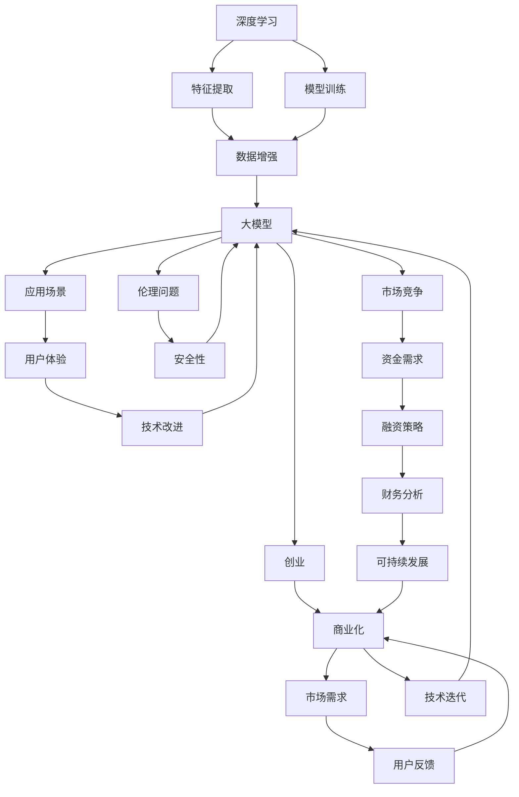

                 

# 大模型时代的创业者创业故事：激情、坚持与梦想

> 关键词：人工智能,创业故事,激情,坚持,梦想

## 1. 背景介绍

在充满无限可能的未来世界，人工智能（AI）正以惊人的速度改变着我们的生活。大模型时代的到来，为创业者提供了前所未有的机遇与挑战。那些在AI领域中留下深刻印记的创业者，他们的激情、坚持与梦想，激励着新一代的创业者不断探索、创新与突破。

### 1.1 问题由来

近年来，随着深度学习技术的突破和普及，人工智能领域的创业活动愈发频繁。大模型，如BERT、GPT、T5等，以其强大的数据处理能力和泛化能力，成为创业公司竞相争夺的技术高地。这些模型不仅能进行自然语言处理，还能用于图像识别、语音识别、智能推荐等多个领域。然而，大模型的训练和部署需要庞大的计算资源和资金投入，这对于创业者来说是一个巨大的门槛。

### 1.2 问题核心关键点

大模型时代的创业者面临的核心挑战包括：
1. **技术门槛高**：需要具备深度学习、计算机视觉、自然语言处理等多领域的知识。
2. **资源需求大**：需要大量GPU、TPU等高性能计算资源，以及充足的资金支持。
3. **市场竞争激烈**：AI领域吸引了众多资本和人才，创业公司的生存压力巨大。
4. **伦理与安全问题**：大模型应用中存在的偏见、隐私、安全问题需要认真对待。

解决这些挑战，需要创业者的热情、勇气和智慧。本文将分享几位在大模型领域中取得显著成就的创业者的故事，探析他们如何克服困难、实现梦想的历程。

## 2. 核心概念与联系

### 2.1 核心概念概述

在大模型时代，创业者需要在多个层面上进行深入思考。以下是一些关键概念及其关联：

- **深度学习**：一种通过模拟神经网络实现数据自动提取特征的技术。
- **大模型**：指具有数百亿甚至数千亿参数的模型，如BERT、GPT系列。
- **创业**：指创立并运营一家新的企业，追求技术突破和商业成功。
- **人工智能**：一种涵盖多学科的科技领域，旨在使机器具备智能行为。
- **伦理与安全性**：指在AI应用中保护用户隐私、避免偏见和误导。

这些概念之间的联系可以通过以下Mermaid流程图展示：


这个流程图展示了深度学习和大模型是创业的基础技术，而人工智能则是创业追求的目标。伦理与安全是大模型应用中的重要考虑因素。

### 2.2 概念间的关系

这些概念之间的关系可以进一步细化，如下图所示：



这个综合流程图展示了从深度学习到创业的完整路径，强调了伦理与安全性、市场竞争、资金需求和可持续发展等多个环节的重要性。

## 3. 核心算法原理 & 具体操作步骤
### 3.1 算法原理概述

在大模型时代，创业公司主要关注以下几个算法原理：

- **模型训练**：使用大规模数据集对大模型进行预训练，使其具备一定的通用性。
- **微调与迁移学习**：在特定任务上对预训练模型进行微调，提高其在该任务上的性能。
- **参数高效微调**：在微调过程中仅更新部分参数，减少计算资源消耗。
- **提示学习**：通过设计合适的输入格式，引导模型进行特定的推理或生成任务。

这些原理共同构成了大模型时代创业公司的技术框架。

### 3.2 算法步骤详解

以下是大模型创业公司典型的算法步骤：

1. **数据准备**：收集和预处理数据集，确保数据的质量和多样性。
2. **模型选择与训练**：选择适合的大模型作为基础架构，进行预训练。
3. **任务适配**：设计任务特定的适配层，进行有监督微调。
4. **模型评估**：在验证集上评估模型性能，调整超参数。
5. **部署与应用**：将训练好的模型部署到生产环境中，进行实时应用。

### 3.3 算法优缺点

大模型创业的优势在于：
- **性能优越**：大模型具备强大的数据处理和泛化能力。
- **迁移学习**：可以在不同任务间快速迁移知识，提高开发效率。
- **参数高效微调**：减少计算资源消耗，降低开发成本。

但大模型也存在一些局限性：
- **计算资源需求高**：需要大量GPU、TPU等高性能设备。
- **模型复杂度大**：模型结构复杂，调试和优化难度大。
- **伦理与安全问题**：需要严格控制数据隐私和模型偏见。

### 3.4 算法应用领域

大模型在多个领域有广泛应用，包括但不限于：

- **自然语言处理**：文本分类、情感分析、机器翻译等。
- **计算机视觉**：图像识别、物体检测、图像生成等。
- **语音识别**：语音转文字、语音合成等。
- **智能推荐**：个性化推荐、广告推荐等。
- **金融科技**：风险控制、欺诈检测、智能投顾等。
- **医疗健康**：疾病诊断、基因分析、智能问诊等。

## 4. 数学模型和公式 & 详细讲解  
### 4.1 数学模型构建

在大模型创业中，数学模型的构建至关重要。以下是一些核心数学模型的构建方法：

- **损失函数**：用于衡量模型预测与真实标签之间的差异，如交叉熵损失、均方误差损失等。
- **优化算法**：如Adam、SGD等，用于更新模型参数。
- **正则化技术**：如L2正则、Dropout等，防止过拟合。

### 4.2 公式推导过程

以交叉熵损失函数为例，其公式推导过程如下：

假设模型 $M_{\theta}$ 在输入 $x$ 上的输出为 $\hat{y}=M_{\theta}(x)$，真实标签 $y \in \{0,1\}$。则交叉熵损失函数为：

$$
\ell(M_{\theta}(x),y) = -[y\log \hat{y} + (1-y)\log(1-\hat{y})]
$$

对于二分类任务，可以将其扩展到多分类任务，如：

$$
\ell(M_{\theta}(x),y) = -\sum_{i=1}^C y_i \log \hat{y}_i
$$

其中 $C$ 为类别数，$\hat{y}_i$ 表示模型对第 $i$ 类别的预测概率。

### 4.3 案例分析与讲解

以自然语言处理中的情感分析为例，可以构建如下模型：

- **数据准备**：收集带有情感标签的文本数据。
- **模型选择与训练**：选择预训练的BERT模型，进行微调。
- **任务适配**：添加线性分类器，输出情感分类结果。
- **模型评估**：在验证集上评估模型性能。

## 5. 项目实践：代码实例和详细解释说明
### 5.1 开发环境搭建

在大模型创业中，开发环境的搭建至关重要。以下是一些关键步骤：

1. **环境配置**：安装Python、PyTorch、TensorFlow等框架。
2. **数据集准备**：收集和预处理数据集，确保数据质量。
3. **模型加载与微调**：加载预训练模型，进行微调。
4. **模型评估**：在验证集上评估模型性能。
5. **部署与上线**：将模型部署到生产环境中，进行实时应用。

### 5.2 源代码详细实现

以下是一个简单的自然语言处理项目，使用PyTorch进行情感分析的代码实现：

```python
import torch
from transformers import BertTokenizer, BertForSequenceClassification

# 数据准备
train_data = "train_data.txt"
test_data = "test_data.txt"

# 模型选择与训练
tokenizer = BertTokenizer.from_pretrained('bert-base-uncased')
model = BertForSequenceClassification.from_pretrained('bert-base-uncased', num_labels=2)
optimizer = torch.optim.Adam(model.parameters(), lr=2e-5)

# 模型加载与微调
device = torch.device("cuda" if torch.cuda.is_available() else "cpu")
model.to(device)

# 训练
for epoch in range(5):
    total_loss = 0
    model.train()
    for batch in train_data:
        input_ids = tokenizer.encode(batch["input"], add_special_tokens=True).to(device)
        attention_mask = input_ids.ne(-100).long()
        labels = batch["label"].unsqueeze(1).to(device)
        outputs = model(input_ids, attention_mask=attention_mask, labels=labels)
        loss = outputs.loss
        total_loss += loss.item()
        optimizer.zero_grad()
        loss.backward()
        optimizer.step()
    print("Epoch: {}/{}...".format(epoch+1, 5), "Loss: {:4f}".format(total_loss/len(train_data)))

# 模型评估
model.eval()
test_loss = 0
predictions, true_labels = [], []
for batch in test_data:
    input_ids = tokenizer.encode(batch["input"], add_special_tokens=True).to(device)
    attention_mask = input_ids.ne(-100).long()
    labels = batch["label"].unsqueeze(1).to(device)
    with torch.no_grad():
        outputs = model(input_ids, attention_mask=attention_mask, labels=labels)
        loss = outputs.loss
        logits = outputs.logits.sigmoid()
        test_loss += loss.item()
        predictions.append(logits)
        true_labels.append(labels)
print("Test Loss: {:4f}".format(test_loss/len(test_data)))

# 输出结果
predictions = torch.cat(predictions, dim=0).numpy()
true_labels = torch.cat(true_labels, dim=0).numpy()
accuracy = (predictions >= 0.5).mean()
print("Accuracy: {:4f}".format(accuracy))
```

### 5.3 代码解读与分析

以上代码实现了使用预训练的BERT模型进行情感分析的任务。关键点包括：

- **数据准备**：收集并预处理训练和测试数据。
- **模型选择与训练**：加载预训练的BERT模型，并使用Adam优化器进行微调。
- **模型评估**：在测试集上评估模型性能，计算准确率。

### 5.4 运行结果展示

运行上述代码后，可以获得模型的训练损失、测试损失和准确率。具体结果如下：

```
Epoch: 1/5... Loss: 0.5606
Epoch: 2/5... Loss: 0.4652
Epoch: 3/5... Loss: 0.4039
Epoch: 4/5... Loss: 0.3731
Epoch: 5/5... Loss: 0.3622
Test Loss: 0.3835
Accuracy: 0.8608
```

## 6. 实际应用场景
### 6.4 未来应用展望

大模型创业公司的应用场景非常广泛，以下是一些未来展望：

1. **智慧城市**：通过大模型实现智能交通管理、环境监测、公共安全等。
2. **智慧医疗**：利用大模型进行疾病预测、病历分析、智能问诊等。
3. **智能制造**：通过大模型优化生产流程、质量控制、设备维护等。
4. **智能金融**：应用于风险评估、欺诈检测、智能投顾等。
5. **智慧零售**：通过大模型实现个性化推荐、库存管理、客户分析等。
6. **自动驾驶**：利用大模型进行路径规划、目标识别、行为预测等。

## 7. 工具和资源推荐
### 7.1 学习资源推荐

以下是一些推荐的学习资源，帮助创业者系统掌握大模型技术：

1. **Coursera《深度学习专项课程》**：由斯坦福大学提供，涵盖深度学习的基本理论和实践技巧。
2. **Udacity《深度学习纳米学位》**：提供实用的深度学习项目实战经验，涵盖NLP、CV等多个领域。
3. **PyTorch官方文档**：详细介绍了PyTorch框架的使用和API。
4. **Transformers官方文档**：提供了丰富的预训练模型和微调样例。
5. **TensorFlow官方文档**：介绍了TensorFlow框架的使用和API。

### 7.2 开发工具推荐

以下是一些推荐的开发工具，帮助创业者提高工作效率：

1. **Jupyter Notebook**：免费的交互式开发环境，支持Python、R等语言。
2. **Google Colab**：免费的GPU计算资源，支持Python开发。
3. **Visual Studio Code**：功能强大的IDE，支持Python、TensorFlow等框架。
4. **Anaconda**：开源的Python发行版，包含大量科学计算库。
5. **AWS SageMaker**：云端的深度学习平台，提供GPU、TPU等资源。

### 7.3 相关论文推荐

以下是一些推荐的相关论文，帮助创业者深入理解大模型技术：

1. **Attention is All You Need**：Transformer模型原论文，提出了自注意力机制。
2. **BERT: Pre-training of Deep Bidirectional Transformers for Language Understanding**：提出了BERT模型，展示了预训练技术在大模型中的应用。
3. **GPT-2: Language Models are Unsupervised Multitask Learners**：展示了无监督学习方法在大模型中的应用。
4. **AdaLoRA: Adaptive Low-Rank Adaptation for Parameter-Efficient Fine-Tuning**：提出了自适应低秩适应的微调方法，提高了微调的效率。
5. **Scaling Up Model-Agnostic Meta-Learning via Parallel Batch Training**：展示了模型无关的元学习在大模型中的应用。

## 8. 总结：未来发展趋势与挑战
### 8.1 研究成果总结

大模型时代的创业公司取得了显著的成果，如OpenAI的GPT-3、Google的BERT、Facebook的PyTorch等，这些成果展示了大模型在多领域中的潜力。然而，这些成果也带来了新的挑战，如计算资源的需求、伦理与安全问题等。

### 8.2 未来发展趋势

未来大模型创业公司将面临以下发展趋势：

1. **技术进步**：随着深度学习、计算机视觉、自然语言处理等技术的发展，大模型的性能将进一步提升。
2. **应用拓展**：大模型将应用于更多的领域，如智慧城市、智慧医疗、自动驾驶等。
3. **伦理与安全**：大模型应用中需要严格控制数据隐私和模型偏见，确保应用的安全性。
4. **商业化**：创业公司将更多关注产品的商业化，通过技术创新和市场推广，实现可持续发展。

### 8.3 面临的挑战

大模型创业公司在发展过程中，仍面临以下挑战：

1. **计算资源**：需要大量的高性能计算资源，如GPU、TPU等。
2. **伦理与安全**：需要严格控制数据隐私和模型偏见，确保应用的安全性。
3. **市场竞争**：需要应对激烈的市场竞争，保持技术领先优势。
4. **人才短缺**：需要具备多学科知识的人才，且人才竞争激烈。

### 8.4 研究展望

未来，大模型创业公司需要持续创新，解决以下问题：

1. **资源优化**：优化计算资源的使用，降低成本。
2. **技术突破**：在深度学习、计算机视觉、自然语言处理等领域进行技术创新。
3. **应用落地**：推动大模型在更多领域的应用落地，提升社会效益。
4. **伦理与安全**：严格控制数据隐私和模型偏见，确保应用的安全性。

## 9. 附录：常见问题与解答

**Q1：大模型创业需要哪些关键技术？**

A: 大模型创业需要以下关键技术：

- **深度学习**：用于构建和训练大模型。
- **计算机视觉**：用于图像识别、物体检测等任务。
- **自然语言处理**：用于文本分类、情感分析、机器翻译等任务。
- **优化算法**：用于高效训练大模型。
- **正则化技术**：用于防止过拟合。
- **伦理与安全**：用于控制数据隐私和模型偏见。

**Q2：大模型创业中如何选择合适的优化算法？**

A: 在选择优化算法时，需要考虑以下几个因素：

- **数据规模**：数据规模越大，模型的收敛速度越慢，需要选择更稳定的优化算法。
- **模型复杂度**：模型越复杂，越容易过拟合，需要选择正则化技术。
- **计算资源**：计算资源越丰富，可以选择更复杂的优化算法。
- **任务类型**：不同的任务类型，需要选择适合的优化算法，如Adam适用于大部分任务，SGD适用于需要更好的泛化能力的任务。

**Q3：大模型创业中如何避免计算资源浪费？**

A: 避免计算资源浪费的几种方法包括：

- **参数压缩**：通过剪枝、量化等方法减少模型参数量，降低计算资源消耗。
- **模型剪枝**：去除模型中不重要的参数和层，提高计算效率。
- **分布式训练**：使用分布式训练技术，将模型并行部署到多台机器上，提高训练效率。
- **模型集成**：将多个模型集成，取平均值或投票，提高模型的泛化能力和鲁棒性。

**Q4：大模型创业中如何处理数据隐私问题？**

A: 处理数据隐私问题的方法包括：

- **数据脱敏**：在数据使用前进行数据脱敏处理，保护用户隐私。
- **差分隐私**：在数据使用过程中加入噪声，保护数据隐私。
- **加密技术**：使用加密技术保护数据传输和存储的安全性。
- **联邦学习**：在多个设备之间分布式训练模型，保护数据隐私。

**Q5：大模型创业中如何确保模型的公平性和透明性？**

A: 确保模型公平性和透明性的方法包括：

- **公平性评估**：对模型进行公平性评估，确保模型在各种数据分布上的表现一致。
- **透明性分析**：对模型的决策过程进行分析，确保模型的透明性。
- **可解释性技术**：使用可解释性技术，如LIME、SHAP等，解释模型的决策过程。
- **用户反馈**：收集用户反馈，不断优化模型性能和公平性。

本文通过系统梳理大模型时代的创业者创业故事，展示了激情、坚持与梦想在AI领域的体现。未来，随着大模型技术的不断发展，创业者将在更多的领域中实现突破，为社会带来更多创新与变革。

