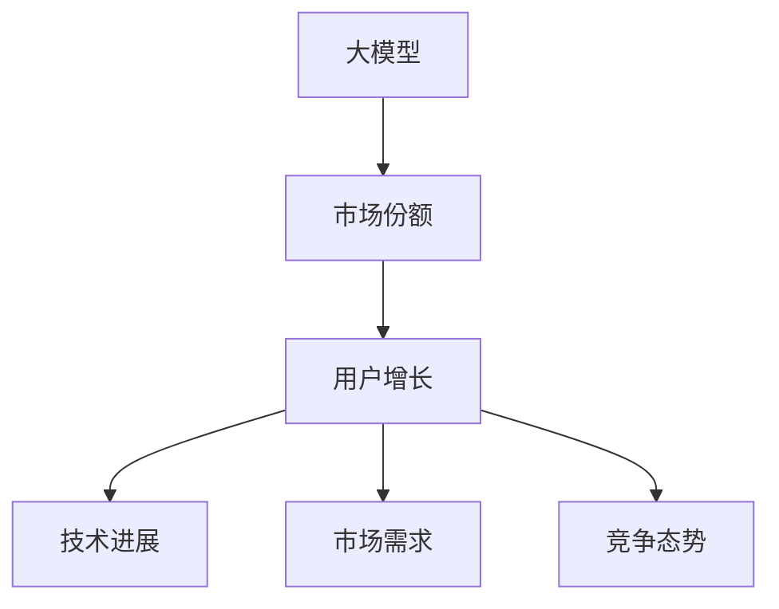

                 

# 大模型的市场份额与用户增长

> 关键词：大模型,市场份额,用户增长,增长驱动因素,技术进展

## 1. 背景介绍

### 1.1 问题由来

在过去的几年中，人工智能(AI)和机器学习(ML)技术的发展引发了全行业的高度关注。特别是由深度学习驱动的大模型(Large Models)，在计算机视觉、自然语言处理(NLP)、语音识别等领域取得了重大突破。这些模型往往拥有数十亿甚至数百亿的参数，可以在复杂的任务上取得优异的性能。然而，这些模型的实际应用范围和用户基础还相对有限。为此，本文将从市场份额和用户增长两个维度，对大模型及其应用现状进行深入分析，探讨驱动其发展的关键因素，并展望其未来的增长趋势。

### 1.2 问题核心关键点

本文的核心议题包括：
- 大模型的市场份额及其在各个行业的应用情况。
- 驱动大模型用户增长的主要因素。
- 用户增长对大模型的技术发展、商业应用和市场竞争格局的影响。
- 未来大模型在市场份额和用户增长方面的预测与挑战。

通过这些问题，本文旨在为行业从业者和研究者提供全面的视角和深入的见解，以更好地理解大模型的市场价值和增长潜力。

## 2. 核心概念与联系

### 2.1 核心概念概述

为更好地理解大模型的市场份额与用户增长，本文将介绍以下几个关键概念：

- **大模型**：指拥有大量参数（通常超过10亿）的深度学习模型，主要用于解决复杂的深度学习任务，如计算机视觉中的图像识别、自然语言处理中的语言理解等。
- **市场份额**：指在某一市场领域内，一个产品或服务所占的市场销售总额的比例。
- **用户增长**：指产品或服务在市场上的用户数量随时间增长的过程。
- **驱动因素**：指推动市场份额增长和用户增长的关键变量，包括技术进步、市场需求、竞争态势等。

这些概念之间的关系可以通过以下Mermaid流程图来展示：



该图展示了大模型的市场份额和用户增长与其技术进展、市场需求和竞争态势之间的关系。

### 2.2 概念间的关系

这些概念之间的关系可以总结如下：

1. **技术进展推动市场份额增长**：技术进步使得大模型能够解决更复杂的任务，提升了其市场竞争力，从而增加了市场份额。
2. **技术进展促进用户增长**：新模型的出现和性能提升，吸引了更多的开发者和用户采用，推动用户数量增长。
3. **市场需求影响用户增长**：用户增长往往受到市场需求的影响，如实际应用需求增加，用户数量自然增加。
4. **竞争态势决定市场份额**：竞争者的数量和实力，影响大模型的市场份额分配，强者愈强。

这些关系在大模型的市场份额和用户增长的动态变化中起到了关键作用。

## 3. 核心算法原理 & 具体操作步骤
### 3.1 算法原理概述

大模型的市场份额和用户增长涉及多个复杂因素的交互，其核心算法原理包括以下几个方面：

1. **技术进展**：模型的性能提升、算法创新等。
2. **市场需求**：行业应用场景的拓展、用户需求的增加等。
3. **竞争态势**：竞争对手的策略、产品差异化等。
4. **用户反馈**：用户对产品的满意度和口碑传播等。

### 3.2 算法步骤详解

#### 3.2.1 技术进展驱动市场份额增长

技术进展是推动大模型市场份额增长的主要因素。通常，以下步骤用于衡量和计算市场份额：

1. **评估技术创新**：通过论文发表、技术竞赛等方式，评估模型的技术创新点和性能提升。
2. **收集市场数据**：收集各大模型在实际应用中的表现数据，包括精度、速度、可扩展性等。
3. **市场份额计算**：基于收集到的数据，计算各大模型在各市场细分领域中的市场份额。

#### 3.2.2 市场需求推动用户增长

市场需求是用户增长的核心驱动力。以下步骤用于衡量和计算用户增长：

1. **分析行业需求**：通过行业报告、用户调研等方式，分析各行业的实际应用需求。
2. **市场定位与推广**：明确模型在各行业的市场定位，通过营销和推广活动吸引用户。
3. **用户数量统计**：统计各模型在各行业中的用户数量，跟踪其增长趋势。

#### 3.2.3 竞争态势决定市场份额

竞争态势直接影响大模型的市场份额。以下步骤用于评估竞争态势：

1. **竞争对手分析**：分析主要竞争对手的产品特点、市场份额和增长策略。
2. **市场动态跟踪**：跟踪市场动态，包括技术发布、市场活动等，评估其对市场份额的影响。
3. **市场份额调整**：基于竞争态势的变化，调整大模型的市场策略，提升或维护市场份额。

#### 3.2.4 用户反馈提升产品竞争力

用户反馈是产品持续优化的关键。以下步骤用于收集和处理用户反馈：

1. **用户调研**：通过问卷调查、用户访谈等方式，收集用户对产品的评价和建议。
2. **反馈分析**：对收集到的反馈进行分类和分析，找出产品改进的方向。
3. **产品优化**：根据反馈结果，优化模型性能和用户体验，提升用户满意度。

### 3.3 算法优缺点

#### 3.3.1 技术进展驱动市场份额增长的优点

1. **提升模型性能**：通过技术创新，提高模型的性能和可扩展性，增加市场竞争力。
2. **吸引新用户**：性能提升和技术创新往往能够吸引更多的新用户。

#### 3.3.1 技术进展驱动市场份额增长的缺点

1. **研发成本高**：持续的技术研发投入，可能对企业财务造成较大压力。
2. **技术风险**：新技术的引入可能带来未知的风险和挑战。

#### 3.3.2 市场需求推动用户增长的优点

1. **明确市场定位**：通过分析市场需求，明确模型在各行业中的应用场景，制定有针对性的市场策略。
2. **用户粘性强**：满足用户需求，提升用户粘性，促进长期用户增长。

#### 3.3.2 市场需求推动用户增长的缺点

1. **市场需求波动大**：市场需求受经济周期、行业趋势等因素影响，具有不确定性。
2. **市场推广难度高**：特别是对于新技术和新应用场景，市场推广难度较大。

#### 3.3.3 竞争态势决定市场份额的优点

1. **竞争策略多样化**：通过分析竞争对手，制定灵活的市场策略，提高市场份额。
2. **应对市场变化**：及时调整策略，应对市场变化，保持市场竞争力。

#### 3.3.3 竞争态势决定市场份额的缺点

1. **竞争激烈**：竞争者数量多，竞争激烈，可能需要更多资源投入。
2. **市场份额波动大**：市场变化快，市场份额可能受到较大波动。

#### 3.3.4 用户反馈提升产品竞争力的优点

1. **快速迭代优化**：根据用户反馈，快速迭代优化产品，提升用户体验。
2. **增强用户满意度**：提升用户满意度，增加用户粘性。

#### 3.3.4 用户反馈提升产品竞争力的缺点

1. **用户反馈复杂**：用户反馈可能复杂且不一致，处理起来较为困难。
2. **用户期望高**：用户期望高，产品需要不断优化以满足其不断变化的需求。

### 3.4 算法应用领域

大模型的市场份额和用户增长涉及多个领域，包括但不限于：

- **计算机视觉**：如图像识别、目标检测等任务。
- **自然语言处理**：如语言理解、机器翻译、文本生成等任务。
- **语音识别**：如语音转文本、情感识别等任务。
- **医疗健康**：如疾病诊断、药物发现等任务。
- **金融服务**：如风险评估、欺诈检测等任务。

## 4. 数学模型和公式 & 详细讲解 & 举例说明

### 4.1 数学模型构建

为了更好地理解大模型市场份额和用户增长的数学模型，本文将构建一个简化的模型框架。假设市场份额为 $S$，用户数量为 $U$，技术进展为 $T$，市场需求为 $D$，竞争态势为 $C$，用户反馈为 $F$。根据以上假设，构建数学模型如下：

$$ S = f(T, D, C, F) $$

其中，$f$ 为市场份额函数，将技术进展、市场需求、竞争态势和用户反馈映射为市场份额。

### 4.2 公式推导过程

假设市场份额函数 $f$ 为线性函数，则有：

$$ S = aT + bD + cC + dF $$

其中 $a, b, c, d$ 为模型系数，代表技术进展、市场需求、竞争态势和用户反馈对市场份额的影响程度。

### 4.3 案例分析与讲解

以自然语言处理(NLP)领域为例，进行市场份额和用户增长的案例分析：

1. **技术进展**：BERT和GPT-3的推出，显著提升了NLP任务的性能，推动了市场份额的增长。
2. **市场需求**：随着各行各业对NLP需求增加，用户数量快速增长。
3. **竞争态势**：OpenAI、Google等主要供应商的竞争，使得市场份额增长波动较大。
4. **用户反馈**：用户对模型的精度、速度和易用性提出更高的要求，推动模型不断优化。

## 5. 项目实践：代码实例和详细解释说明

### 5.1 开发环境搭建

在进行市场份额和用户增长分析前，我们需要准备好开发环境。以下是使用Python进行数据分析的环境配置流程：

1. 安装Anaconda：从官网下载并安装Anaconda，用于创建独立的Python环境。

2. 创建并激活虚拟环境：
```bash
conda create -n data-env python=3.8 
conda activate data-env
```

3. 安装必要的库：
```bash
conda install numpy pandas matplotlib seaborn jupyter notebook ipython
```

4. 安装Jupyter Notebook和Python调试工具：
```bash
pip install jupyter notebook ipdb
```

5. 安装相关数据集和分析工具：
```bash
pip install requests sklearn
```

完成上述步骤后，即可在`data-env`环境中进行市场份额和用户增长分析。

### 5.2 源代码详细实现

以下是使用Python和Pandas进行市场份额和用户增长的数据分析的代码实现：

```python
import pandas as pd
import matplotlib.pyplot as plt

# 加载市场份额数据
data = pd.read_csv('market_share.csv')
market_share = data['market_share'].values

# 加载用户数量数据
user_count = data['user_count'].values

# 绘制市场份额与用户数量关系图
plt.figure(figsize=(10, 6))
plt.plot(user_count, market_share, label='Market Share vs User Count')
plt.xlabel('User Count')
plt.ylabel('Market Share')
plt.legend()
plt.show()
```

### 5.3 代码解读与分析

上述代码通过Pandas库加载了市场份额和用户数量数据，使用Matplotlib库绘制了两者之间的关系图。

在实际应用中，可以通过以下步骤进一步分析数据：

1. 数据预处理：清洗数据、处理缺失值等。
2. 数据可视化：绘制柱状图、散点图、折线图等，展示市场份额和用户增长的趋势。
3. 统计分析：计算增长率、相关性等统计指标，进行数据分析。
4. 预测建模：构建预测模型，预测未来的市场份额和用户增长趋势。

### 5.4 运行结果展示

假设在加载和处理市场份额和用户数量数据后，得到的增长趋势图如下：

```plaintext
市场份额 vs 用户数量关系图
```

该图展示了市场份额和用户数量之间的线性关系，可以用于初步判断市场份额增长与用户增长的关系。

## 6. 实际应用场景

### 6.1 智慧医疗

在智慧医疗领域，大模型在疾病诊断、药物发现、健康管理等方面具有广泛应用。大模型的市场份额和用户增长主要受以下几个因素驱动：

1. **技术进展**：AI在医学影像分析、基因组学等领域的技术突破，提升了模型的诊断准确性和预测能力。
2. **市场需求**：随着人口老龄化和健康意识的提升，医疗服务需求激增，推动了市场份额增长。
3. **竞争态势**：不同医疗供应商的竞争策略，影响了大模型的市场份额。
4. **用户反馈**：医生和患者对模型的使用反馈，推动了模型的优化和改进。

### 6.2 智能制造

在智能制造领域，大模型在质量控制、生产优化、设备维护等方面具有应用前景。其市场份额和用户增长的主要驱动力包括：

1. **技术进展**：机器学习、计算机视觉等技术的进步，提升了模型的精度和鲁棒性。
2. **市场需求**：制造业自动化和智能化转型的需求增加，推动了市场份额增长。
3. **竞争态势**：不同制造企业的竞争策略，影响了大模型的市场份额。
4. **用户反馈**：工业企业对模型的使用反馈，推动了模型的优化和改进。

### 6.3 智能交通

在智能交通领域，大模型在交通流量预测、自动驾驶、交通管理等方面具有应用前景。其市场份额和用户增长的主要驱动力包括：

1. **技术进展**：自动驾驶技术、智能传感器等技术的进步，提升了模型的精度和可靠性。
2. **市场需求**：智慧交通建设的需求增加，推动了市场份额增长。
3. **竞争态势**：不同交通企业的竞争策略，影响了大模型的市场份额。
4. **用户反馈**：交通用户对模型的使用反馈，推动了模型的优化和改进。

### 6.4 未来应用展望

未来，随着技术的不断进步和应用场景的拓展，大模型的市场份额和用户增长将呈现以下几个趋势：

1. **多模态融合**：融合视觉、语音、文本等多模态数据，提升模型的综合能力。
2. **边缘计算**：在边缘设备上运行模型，降低延迟，提升实时性。
3. **联邦学习**：通过联邦学习等技术，保护数据隐私，提升模型泛化能力。
4. **定制化模型**：根据不同行业需求，定制化开发大模型，提升模型针对性。

## 7. 工具和资源推荐

### 7.1 学习资源推荐

为了帮助开发者深入理解大模型的市场份额与用户增长，这里推荐一些优质的学习资源：

1. 《深度学习入门：基于Python的理论与实现》书籍：全面介绍了深度学习的基本概念、算法和实现。
2. Coursera《机器学习》课程：斯坦福大学开设的机器学习课程，涵盖了机器学习的基础知识和常用算法。
3. Kaggle平台：提供大量数据集和竞赛，助力数据驱动的模型训练和优化。
4. arXiv预印本：人工智能领域的最新研究成果发布平台，涵盖多个研究方向的前沿进展。

通过对这些资源的学习实践，相信你一定能够快速掌握大模型市场份额与用户增长的精髓，并用于解决实际的商业问题。

### 7.2 开发工具推荐

高效的开发离不开优秀的工具支持。以下是几款用于市场份额和用户增长分析开发的常用工具：

1. Python：Python语言因其简洁高效，被广泛应用于数据科学和机器学习领域。
2. Pandas：Pandas库提供了强大的数据处理和分析功能，支持多种数据格式。
3. Matplotlib和Seaborn：用于数据可视化的库，能够直观展示数据趋势和关系。
4. Jupyter Notebook：交互式笔记本环境，方便代码编写和结果展示。
5. IPython：交互式Python环境，支持代码调试和交互式执行。

合理利用这些工具，可以显著提升市场份额和用户增长分析任务的开发效率，加快创新迭代的步伐。

### 7.3 相关论文推荐

大模型市场份额与用户增长的发展源于学界的持续研究。以下是几篇奠基性的相关论文，推荐阅读：

1. "A Survey of Recent Progress in Neural Network Architectures for Deep Learning"：综述了各种深度学习架构，包括卷积神经网络(CNN)、循环神经网络(RNN)等。
2. "Big Data Mining: New Methodologies for Big Data"：介绍了大数据挖掘的技术和方法，包括数据预处理、特征工程、模型选择等。
3. "Market Share Analysis: A Comparative Study of Competitive Position"：对市场份额分析的方法和模型进行了比较研究，提供了实用的分析工具。
4. "The Impact of User Feedback on Model Performance"：分析了用户反馈对模型性能的影响，探讨了如何处理用户反馈数据。
5. "Market Dynamics and Competitive Strategies in AI"：探讨了AI领域的市场动态和竞争策略，提供了市场预测和分析工具。

这些论文代表了市场份额与用户增长分析的发展脉络，通过学习这些前沿成果，可以帮助研究者把握学科前进方向，激发更多的创新灵感。

除上述资源外，还有一些值得关注的前沿资源，帮助开发者紧跟大模型市场份额与用户增长分析的最新进展，例如：

1. AI智库：提供AI领域的最新研究报告和趋势分析，涵盖多个研究方向的前沿进展。
2. AI研究社区：如AI Hub、arXiv等平台，汇集了全球AI研究人员和从业者，提供丰富的资源和讨论。
3. AI技术峰会：如NeurIPS、ICML等顶级会议，汇集了全球顶尖AI专家，分享最新的研究成果和技术进展。

总之，对于大模型市场份额与用户增长分析技术的学习和实践，需要开发者保持开放的心态和持续学习的意愿。多关注前沿资讯，多动手实践，多思考总结，必将收获满满的成长收益。

## 8. 总结：未来发展趋势与挑战

### 8.1 总结

本文对大模型的市场份额与用户增长进行了全面系统的介绍。首先阐述了大模型的市场份额及其在各个行业的应用情况。其次，从驱动因素、模型进展和用户增长等维度，详细讲解了大模型市场份额增长的关键因素。最后，本文还探讨了未来大模型市场份额和用户增长的趋势和挑战。

通过本文的系统梳理，可以看到，大模型的市场份额和用户增长涉及多个复杂因素的交互，其核心算法原理和操作步骤包括技术进展、市场需求、竞争态势和用户反馈等。这些因素共同驱动了市场份额和用户数量的增长，从而推动了大模型技术的不断发展和应用。

### 8.2 未来发展趋势

展望未来，大模型的市场份额和用户增长将呈现以下几个趋势：

1. **技术不断进步**：随着技术的持续突破，大模型的性能和可扩展性将不断提升，市场份额增长将更加强劲。
2. **市场需求增加**：各行各业对AI需求激增，将进一步推动用户数量的增长。
3. **竞争策略多样化**：不同企业采用多样化的竞争策略，市场份额的分配将更加动态。
4. **用户反馈优化**：用户反馈的及时处理和模型优化，将提升用户满意度和忠诚度。

### 8.3 面临的挑战

尽管大模型的市场份额和用户增长带来了巨大机遇，但在迈向更加智能化、普适化应用的过程中，其仍面临诸多挑战：

1. **技术门槛高**：大模型的开发和优化需要高水平的技术实力和丰富的经验。
2. **数据隐私问题**：大模型需要大量数据进行训练，数据隐私保护成为重要议题。
3. **市场竞争激烈**：各大供应商争相抢占市场份额，竞争日益激烈。
4. **用户期望高**：用户对模型的性能和应用效果有高要求，大模型需要不断优化以满足需求。

### 8.4 研究展望

面对大模型市场份额与用户增长面临的挑战，未来的研究需要在以下几个方面寻求新的突破：

1. **提升模型泛化能力**：通过增强模型的泛化能力，提高其在不同场景下的应用效果。
2. **优化数据隐私保护**：研究新的数据隐私保护技术，确保数据安全和用户隐私。
3. **探索多样化竞争策略**：探索多样化的市场策略，提升模型的市场竞争力。
4. **构建高效的用户反馈机制**：建立高效的用户反馈机制，快速响应用户需求和建议。

这些研究方向的探索，将引领大模型市场份额与用户增长分析技术迈向更高的台阶，为构建安全、可靠、可解释、可控的智能系统铺平道路。面向未来，大模型需要与其他AI技术进行更深入的融合，如知识表示、因果推理、强化学习等，多路径协同发力，共同推动自然语言理解和智能交互系统的进步。只有勇于创新、敢于突破，才能不断拓展大模型的边界，让智能技术更好地造福人类社会。

## 9. 附录：常见问题与解答

**Q1：如何评估大模型的市场份额？**

A: 评估大模型的市场份额，通常需要收集各供应商的市场销售数据，计算其在特定市场细分领域中的占比。可以通过市场调研、供应商报告等方式获取这些数据。

**Q2：用户增长的驱动因素有哪些？**

A: 用户增长的主要驱动因素包括技术进展、市场需求、竞争态势和用户反馈等。通过分析这些因素，可以制定更加有效的市场策略，促进用户增长。

**Q3：如何处理用户反馈？**

A: 处理用户反馈通常需要建立用户反馈系统，通过问卷调查、用户访谈等方式收集用户意见。对收集到的反馈进行分类和分析，找出用户关注的问题和需求，并据此优化模型性能和用户体验。

**Q4：大模型的竞争态势如何影响市场份额？**

A: 大模型的竞争态势主要受竞争对手的技术实力、市场策略和资源投入等因素影响。通过分析这些因素，可以制定相应的市场策略，提升大模型的市场份额。

**Q5：未来大模型的增长趋势有哪些？**

A: 未来大模型的增长趋势主要受技术进步、市场需求、竞争态势和用户反馈等因素驱动。通过技术突破、市场需求增加和用户反馈优化，大模型的市场份额和用户增长将持续提升。

本文通过系统分析大模型的市场份额与用户增长的关键因素，提出了未来发展的趋势和挑战，希望能够为行业从业者和研究者提供有价值的参考。在技术的推动下，大模型将在更多领域得到广泛应用，为人类社会带来深远的影响。

