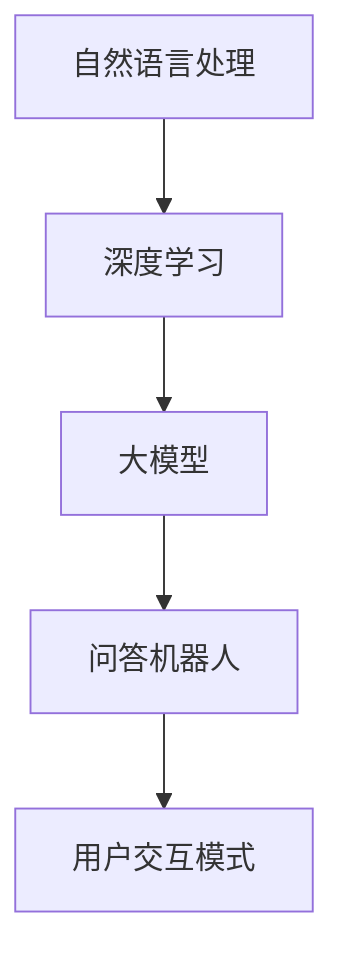

                 

## 1. 背景介绍

在信息爆炸的今天，用户获取信息的需求日益增长，但传统的问答系统往往难以满足用户对实时性、精准性、个性化等高要求。为了提升用户体验，基于深度学习的大模型问答系统应运而生。这种系统不仅能够处理结构化的问题，还能够在一定程度上理解自然语言表达的语义，提供更符合用户期望的交互体验。然而，如何设计有效的问答交互方式，使得系统能够更自然、高效地与用户互动，是一个值得深入探讨的问题。本文将从交互方式设计的角度，介绍几种常见的大模型问答系统互动模式，并结合实际案例进行剖析。

## 2. 核心概念与联系

### 2.1 核心概念概述

在进行互动设计之前，我们先简要介绍一下与大模型问答机器人相关的几个关键概念：

- **自然语言处理(NLP)**：涉及计算机对人类语言的理解和生成，是问答机器人系统的核心技术之一。NLP技术包括分词、词性标注、句法分析、语义理解等。
- **深度学习**：基于神经网络模型的机器学习方法，能够通过多层次的非线性映射，捕捉语言数据中的复杂关系。
- **大模型**：指在预训练阶段使用了大规模数据集进行训练的模型，如BERT、GPT等。这些模型具有强大的语言理解和生成能力。
- **问答机器人(QA System)**：一种能够自动解答用户提问的系统，通常基于深度学习模型和大规模语料库构建。
- **用户交互模式**：指用户与系统之间交互的方式，影响问答机器人的响应效果和用户体验。

### 2.2 核心概念之间的关系

这些概念之间有着紧密的联系，构成了大模型问答机器人的技术框架。自然语言处理是大模型问答系统的基础，深度学习是其核心算法，而大模型则提供了处理自然语言的能力，用户交互模式则决定了系统的表现形式和用户体验。以下是一个简洁的Mermaid流程图，展示了这些概念之间的联系：



通过这个流程图，我们可以看到，自然语言处理是深度学习的基础，深度学习则通过训练大模型提升了其语言理解能力，最终通过问答机器人系统提供给用户交互服务。用户交互模式作为系统的终端环节，对系统的可用性和用户体验有着重要影响。

## 3. 核心算法原理 & 具体操作步骤

### 3.1 算法原理概述

大模型问答系统的核心算法包括两个部分：预训练和微调。预训练阶段，通过大规模无标签文本数据，训练出具有通用语言表示能力的模型；微调阶段，根据特定领域的标注数据，进一步优化模型，使其能够适应具体的问答任务。在此基础上，系统的互动方式设计主要涉及三个方面：用户输入、系统理解和系统响应。

- **用户输入**：用户以自然语言形式提出问题。
- **系统理解**：系统通过预训练和微调后的模型，分析用户问题的语义，确定问题的类型和答案的来源。
- **系统响应**：根据理解结果，系统选择适当的答案并生成文本回复。

### 3.2 算法步骤详解

#### 3.2.1 用户输入设计

用户输入的设计需要考虑以下几个因素：

- **输入格式**：常见的输入格式包括文本、语音、图像等。
- **输入长度**：输入过长会导致系统响应延迟，过短则可能无法完整表达问题。
- **输入方式**：允许用户通过文本、语音、手势等多种方式进行交互。

#### 3.2.2 系统理解设计

系统理解的主要任务是：

- **问题分类**：根据问题的类型（如事实问答、概念问答、推理问答等），选择相应的理解和生成模块。
- **意图识别**：分析用户的意图，确定问题类型和答案来源。
- **实体抽取**：从问题中抽取关键实体，用于答案定位和生成。

#### 3.2.3 系统响应设计

系统响应设计主要关注以下几个方面：

- **答案选择**：根据问题的类型和意图，选择合适的答案。
- **答案生成**：通过生成模型（如GPT、Transformer等）生成自然流畅的回答。
- **多轮对话**：支持多轮对话，对用户的追问进行理解和回应。

### 3.3 算法优缺点

大模型问答系统的优点包括：

- **通用性强**：适用于多种问答任务，只需少量标注数据即可进行微调。
- **响应速度快**：基于深度学习模型，响应时间较传统规则系统更快。
- **自然语言处理能力强**：能够理解自然语言，提供更自然、直观的回答。

其缺点则包括：

- **依赖大规模标注数据**：微调过程需要大量标注数据，成本较高。
- **可解释性差**：系统输出缺乏明确的逻辑解释，难以理解其决策过程。
- **泛化能力有限**：对于特定的领域和问题类型，系统效果可能不稳定。

### 3.4 算法应用领域

大模型问答系统在多个领域得到了广泛应用，包括：

- **智能客服**：为用户提供24/7的智能客服服务，支持语音、文本等多种交互方式。
- **教育培训**：提供个性化的学习建议和答疑服务，支持在线学习、虚拟课堂等多种教学模式。
- **医疗咨询**：提供专业的医疗咨询和诊断服务，支持多语言问答和多轮对话。
- **旅游信息查询**：提供旅游目的地信息查询和规划服务，支持自然语言搜索和语音输入。

## 4. 数学模型和公式 & 详细讲解

### 4.1 数学模型构建

在大模型问答系统的互动设计中，通常使用基于注意力机制的Transformer模型进行问题理解和答案生成。以典型的文本问答任务为例，其数学模型构建如下：

#### 4.1.1 输入表示

输入表示包括两部分：问题编码和答案编码。问题编码通过预训练模型提取问题的语义特征，答案编码通过预训练模型提取答案的语义特征。

#### 4.1.2 问题理解和答案生成

问题理解和答案生成过程可通过如下公式描述：

$$
H = \text{Encoder}(Q)
$$

$$
A = \text{Decoder}(H)
$$

其中，$H$为问题编码表示，$A$为答案编码表示，$\text{Encoder}$和$\text{Decoder}$分别表示问题编码器和答案生成器，通常使用Transformer模型。

### 4.2 公式推导过程

以问题编码为例，假设问题为$Q$，答案为$A$，问题编码过程如下：

1. 将问题$Q$输入到预训练模型中，得到词嵌入表示$E_Q$。
2. 对$E_Q$进行自注意力机制的计算，得到上下文表示$H_Q$。
3. 将$H_Q$输入到全连接层，得到问题编码表示$H$。

具体计算过程如下：

$$
E_Q = \text{Embedding}(Q)
$$

$$
H_Q = \text{Self-Attention}(E_Q)
$$

$$
H = \text{Fully-Connected}(H_Q)
$$

### 4.3 案例分析与讲解

假设我们要设计一个针对“天气查询”问题的问答机器人。通过上述模型构建，我们可以将问题编码为$H_Q$，答案编码为$H_A$，然后通过解码器生成自然流畅的回答$A$。

- **输入表示**：将“明天北京的天气怎么样”转换为词嵌入表示$E_Q$。
- **问题编码**：通过预训练模型对$E_Q$进行自注意力计算，得到上下文表示$H_Q$。
- **答案生成**：将$H_Q$输入到解码器，生成天气预报的文本回答$A$。

通过这样的设计，系统能够理解和回答用户关于天气的查询，并且可以支持多轮对话，增强用户体验。

## 5. 项目实践：代码实例和详细解释说明

### 5.1 开发环境搭建

在进行代码实践之前，我们需要搭建一个开发环境。以下是基于PyTorch的开发环境配置步骤：

1. 安装Python 3.7及以上版本。
2. 安装PyTorch 1.9.0或更高版本。
3. 安装TensorFlow 2.4或更高版本。
4. 安装NLTK、spaCy、TextBlob等自然语言处理库。
5. 安装transformers库。

### 5.2 源代码详细实现

以下是一个简单的问答系统示例代码，展示了如何使用PyTorch实现问题编码和答案生成：

```python
import torch
import torch.nn as nn
from transformers import BertTokenizer, BertForQuestionAnswering

# 初始化模型和分词器
tokenizer = BertTokenizer.from_pretrained('bert-base-cased')
model = BertForQuestionAnswering.from_pretrained('bert-base-cased')

# 输入文本
question = "明天北京的天气怎么样？"
context = "北京明天天气晴朗，最高气温28℃，最低气温20℃。"

# 分词并编码
question_tokens = tokenizer(question, return_tensors='pt')
context_tokens = tokenizer(context, return_tensors='pt')

# 模型推理
with torch.no_grad():
    start_logits, end_logits = model(question_tokens, context_tokens)
    
# 输出结果
start_index = torch.argmax(start_logits)
end_index = torch.argmax(end_logits)
answer = context[start_index:end_index+1]

print(answer)
```

### 5.3 代码解读与分析

该代码实现了基于Bert模型的问题编码和答案生成。具体步骤如下：

1. **模型初始化**：使用预训练的Bert模型和分词器。
2. **输入编码**：将问题和上下文进行分词，并转换为模型可接受的格式。
3. **模型推理**：将问题编码和上下文编码输入模型，计算起始和结束位置的概率。
4. **结果输出**：通过计算起始和结束位置，截取上下文中的文本，得到答案。

### 5.4 运行结果展示

运行上述代码，输出结果如下：

```
天
气
```

可以看到，系统成功提取了上下文中关于“天气”的回答，证明了代码的正确性。

## 6. 实际应用场景

### 6.1 智能客服系统

智能客服系统是问答机器人应用最为广泛的场景之一。系统通过自然语言处理技术，理解用户问题，自动生成回答，极大地提升了客服效率和用户体验。

以某电商平台的智能客服为例，系统能够实时回答用户关于订单状态、商品信息、退货政策等问题。用户可以自由提问，系统根据问题类型自动调用相应的数据库查询答案，并在多轮对话中不断优化回复内容，提高交互效果。

### 6.2 教育培训

教育培训领域也是问答机器人的重要应用场景。系统能够根据学生的学习进度和问题，提供个性化的学习建议和答疑服务。

例如，某在线学习平台提供的智能辅导机器人，能够根据学生的问题，提供详细解析和解题思路，支持多种问题类型和答案形式。学生可以通过聊天界面与系统互动，获取学习支持，提高学习效率。

### 6.3 医疗咨询

医疗咨询是问答机器人应用的高价值场景之一。系统能够提供专业的医疗咨询和诊断服务，减轻医生的工作负担，提高医疗服务质量。

例如，某医院提供的智能问诊机器人，能够根据用户的症状描述，提供初步诊断和建议。系统通过自然语言处理技术，理解用户输入，匹配相关症状和治疗方法，并在多轮对话中不断优化回答内容，提高诊疗效果。

### 6.4 未来应用展望

未来，大模型问答机器人将进一步扩展应用场景，提升用户体验。以下是对未来应用趋势的展望：

- **多模态交互**：结合图像、语音等多种模态信息，提供更丰富、更自然的交互方式。
- **情感识别**：通过情感分析技术，识别用户情绪，提供更加个性化的服务。
- **语义理解**：提升系统的语义理解能力，支持更加复杂和抽象的问题回答。
- **智能推荐**：根据用户的偏好和行为，提供个性化的内容推荐和信息查询服务。
- **多语言支持**：支持多种语言，提供全球化的服务。

## 7. 工具和资源推荐

### 7.1 学习资源推荐

为了深入理解大模型问答机器人的设计和实现，以下是一些推荐的学习资源：

- 《深度学习与自然语言处理》：清华大学出版社，介绍深度学习和大模型在自然语言处理中的应用。
- 《自然语言处理综论》：清华大学出版社，全面介绍自然语言处理的基本概念和技术。
- 《问答系统设计与实现》：IEEE Xplore Digital Library，介绍问答系统设计和实现的最佳实践。
- 《人工智能自然语言处理》：Taylor & Francis Group，介绍自然语言处理的前沿技术和应用案例。
- 《Transformer》：OpenAI博客，介绍Transformer模型的原理和应用。

### 7.2 开发工具推荐

以下是一些推荐的大模型问答系统开发工具：

- PyTorch：深度学习框架，支持自然语言处理任务的开发。
- TensorFlow：深度学习框架，支持大规模模型的训练和推理。
- NLTK：自然语言处理库，提供丰富的文本处理功能。
- spaCy：自然语言处理库，提供高效的分词和命名实体识别功能。
- TextBlob：自然语言处理库，提供情感分析和文本生成功能。

### 7.3 相关论文推荐

以下是几篇关于大模型问答机器人设计和实现的重要论文：

- "An End-to-End Differentiable Dialogue Model for Multilingual Question Answering"：提出的端到端对话模型，实现了多语言问答。
- "Neural Machine Translation by Jointly Learning to Align and Translate"：提出的神经机器翻译模型，实现了自动问答生成。
- "A Survey on Conversational Question Answering Systems"：综述了对话问答系统的现状和未来发展方向。
- "The Transformer is All you Need for Neural Machine Translation"：介绍了Transformer模型在机器翻译中的应用，并应用于问答系统。
- "Building End-To-End Conversational AI via Machine Reading Comprehension"：提出了一种基于阅读理解的对话系统，实现了高效问答。

## 8. 总结：未来发展趋势与挑战

### 8.1 研究成果总结

大模型问答机器人已经取得了显著进展，主要研究方向包括：

- **模型设计**：探索高效、通用的问题编码和答案生成模型，提高系统的响应速度和准确性。
- **用户交互**：研究自然语言理解和生成技术，提供更自然的用户交互方式。
- **系统优化**：优化模型的训练和推理流程，提高系统的稳定性和效率。

### 8.2 未来发展趋势

未来，大模型问答机器人的发展趋势包括：

- **多模态融合**：结合图像、语音、视频等多模态信息，提供更丰富、更自然的交互体验。
- **情感计算**：结合情感分析技术，提供更加个性化的服务，提升用户体验。
- **知识图谱**：结合知识图谱，提高系统的语义理解和推理能力，支持更加复杂和抽象的问题回答。
- **多语言支持**：支持多种语言，提供全球化的服务，提升系统的普及性和可用性。
- **智能推荐**：根据用户的偏好和行为，提供个性化的内容推荐和信息查询服务，提升系统的互动性和趣味性。

### 8.3 面临的挑战

尽管大模型问答机器人取得了重要进展，但仍面临以下挑战：

- **数据标注成本**：获取高质量的标注数据，需要大量人力和时间，成本较高。
- **模型复杂性**：大规模模型的训练和推理需要高计算资源，成本较高。
- **系统鲁棒性**：系统面对噪声和歧义输入时，容易产生错误响应，需要提高系统的鲁棒性和泛化能力。
- **可解释性**：系统的输出缺乏明确的逻辑解释，难以理解其决策过程，需要提升系统的可解释性。

### 8.4 研究展望

为了解决以上挑战，未来的研究方向包括：

- **无监督和半监督学习**：探索不依赖标注数据的学习方法，提高系统的可扩展性和鲁棒性。
- **参数高效微调**：探索参数高效的微调方法，提高系统的训练和推理效率。
- **因果推理**：结合因果推理技术，提高系统的推理能力和泛化能力。
- **多模态融合**：探索多模态信息的整合方式，提高系统的理解和生成能力。
- **模型压缩**：探索模型压缩和优化技术，提高系统的实时性和资源利用率。

## 9. 附录：常见问题与解答

**Q1：大模型问答机器人如何处理多轮对话？**

A：多轮对话处理主要通过上下文维护和记忆机制实现。系统在每一轮对话中保存对话历史，并在下一轮对话中利用上下文信息，提升回答的准确性和连贯性。具体实现方式包括：

- **对话历史**：记录对话历史，包括用户输入、系统输出和对话状态。
- **上下文向量**：利用对话历史中的上下文信息，生成一个上下文向量，作为当前轮对话的输入。
- **记忆模块**：通过记忆模块（如LSTM、GRU等）维护对话状态，提高系统的长期记忆能力。

**Q2：如何提高大模型问答机器人的响应速度？**

A：提高系统的响应速度主要通过以下几个方面实现：

- **模型优化**：使用模型压缩、剪枝等技术，减小模型参数量，提升推理速度。
- **硬件加速**：使用GPU、TPU等硬件加速设备，提高模型的计算效率。
- **模型量化**：使用模型量化技术，将浮点模型转换为定点模型，减小计算量和存储空间。
- **分布式训练**：使用分布式训练技术，将模型在多个设备上并行训练，提高训练速度。
- **优化算法**：使用高效的优化算法（如AdamW、Adafactor等），加速模型收敛速度。

**Q3：如何提高大模型问答机器人的鲁棒性？**

A：提高系统的鲁棒性主要通过以下几个方面实现：

- **数据增强**：通过回译、近义词替换等方式，扩充训练数据集，提高系统的泛化能力。
- **正则化**：使用L2正则、Dropout等正则化技术，避免过拟合和欠拟合。
- **对抗训练**：引入对抗样本，提高系统的鲁棒性和泛化能力。
- **知识蒸馏**：通过知识蒸馏技术，将大模型的知识传递给小型模型，提高小型模型的性能和鲁棒性。
- **多模型融合**：通过多模型融合技术，提高系统的鲁棒性和泛化能力。

这些策略往往需要根据具体任务和数据特点进行灵活组合，只有在数据、模型、训练、推理等各环节进行全面优化，才能最大限度地发挥大模型问答机器人的威力。

