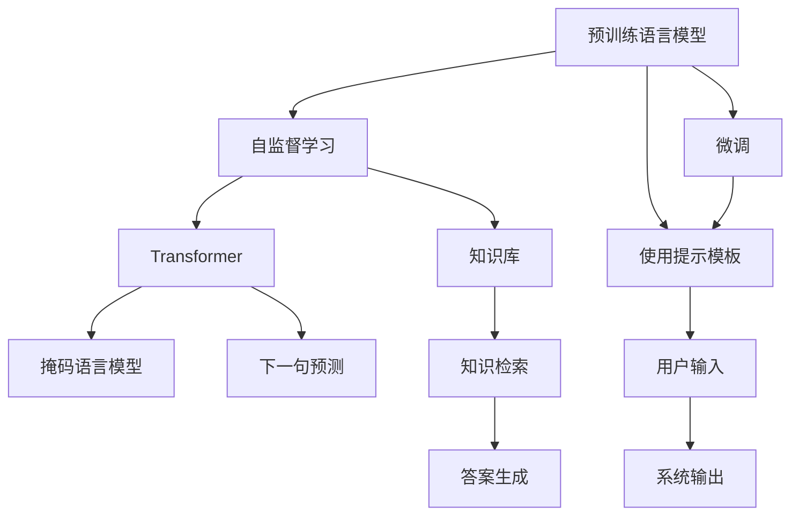
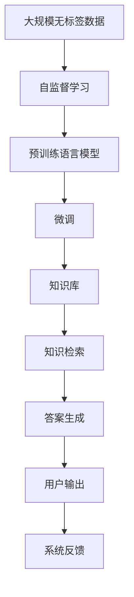

                 

# 大模型问答机器人的预训练语言模型

> 关键词：预训练语言模型,问答系统,Transformer,BERT,预训练,大模型,自监督学习

## 1. 背景介绍

在人工智能飞速发展的今天，预训练语言模型（Pre-trained Language Models, PLMs）已经成为了自然语言处理（Natural Language Processing, NLP）领域的重要技术。这类模型通过在大规模无标签文本数据上自监督学习，学习到丰富的语言知识和语义信息，具备了强大的自然语言理解和生成能力。基于预训练语言模型的问答系统也逐渐成为NLP领域的一大热点，成为了构建智能交互平台和智能客服的关键组件。

### 1.1 问题由来

近年来，问答系统得到了广泛的应用，如智能客服、搜索引擎、虚拟助手等，极大地提升了用户互动体验和效率。但传统的基于规则的问答系统往往需要大量的人工编写规则和知识库，难以应对日益复杂的查询需求。而基于深度学习的问答系统，特别是基于预训练语言模型的系统，可以通过大规模数据自监督学习，灵活适应各种自然语言查询，成为未来的发展方向。

在实际应用中，问答系统一般需要解决如下几个关键问题：
1. **语义理解**：理解自然语言查询的含义和意图。
2. **知识检索**：在知识库中检索相关的信息。
3. **答案生成**：根据查询和检索结果，生成流畅自然的回答。
4. **系统交互**：与用户进行自然流畅的对话交互。

本文将详细讨论预训练语言模型在问答系统中的应用，包括模型的选择、微调方法、应用场景等，以期对构建高效、智能的问答机器人提供有价值的指导。

## 2. 核心概念与联系

### 2.1 核心概念概述

为了更好地理解预训练语言模型在问答系统中的应用，我们首先介绍几个核心概念：

- **预训练语言模型（Pre-trained Language Models, PLMs）**：以自回归（如GPT）或自编码（如BERT）模型为代表的在大规模无标签文本数据上进行自监督学习的大模型。通过预训练，模型学习到通用的语言表示和语义信息，具备了强大的语言理解和生成能力。

- **问答系统（Question Answering System, QA）**：根据用户输入的自然语言查询，从知识库中检索相关信息并生成自然语言的回答。问答系统是构建智能交互平台和智能客服的核心组件，广泛应用于搜索引擎、虚拟助手等领域。

- **Transformer模型**：一种基于自注意力机制的神经网络结构，常用于预训练语言模型的构建。Transformer模型通过多头自注意力机制和残差连接，实现了高效的并行计算和长距离依赖建模。

- **BERT模型**：Google推出的预训练语言模型，采用掩码语言模型（Masked Language Model, MLM）和下一句预测任务（Next Sentence Prediction, NSP）进行预训练。BERT模型在各种自然语言处理任务中表现优异，成为问答系统中常用的预训练模型。

### 2.2 核心概念的联系

预训练语言模型和问答系统之间存在着紧密的联系，可以用以下Mermaid流程图来展示：



该流程图展示了预训练语言模型在问答系统中的应用过程：
1. 预训练语言模型通过在大规模无标签文本数据上进行自监督学习，学习通用的语言表示。
2. 常用的预训练模型包括Transformer架构的BERT、GPT等。
3. BERT模型通过掩码语言模型和下一句预测任务进行预训练。
4. 预训练模型被微调用于问答系统，理解查询语义和知识库中的信息。
5. 系统利用微调后的模型进行知识检索和答案生成。
6. 用户输入被传递给系统，经过处理后生成回答输出。

### 2.3 核心概念的整体架构

进一步综合以上概念，我们得到预训练语言模型在问答系统中的整体架构：



这个架构展示了从大规模数据自监督学习到问答系统的完整流程，每个步骤的详细实现和优化将成为后续讨论的重点。

## 3. 核心算法原理 & 具体操作步骤

### 3.1 算法原理概述

基于预训练语言模型的问答系统，本质上是利用预训练模型理解查询语义，并从知识库中检索相关信息，生成自然语言的回答。其核心算法原理可以概括为以下几步：

1. **预训练模型理解查询语义**：将自然语言查询输入预训练模型，模型通过自注意力机制和大规模语料训练的知识，理解查询的含义和意图。
2. **知识库检索**：根据查询语义，在知识库中检索相关信息，如相关的事实、定义、例子等。
3. **答案生成**：将查询语义和检索结果作为输入，生成自然流畅的回答。

### 3.2 算法步骤详解

基于预训练语言模型的问答系统构建过程主要包括以下几个步骤：

**Step 1: 准备预训练模型和知识库**

- 选择合适的预训练语言模型 $M_{\theta}$，如BERT、GPT等。
- 准备包含事实、定义、例子等信息的知识库 $E$，作为问答系统的数据基础。

**Step 2: 数据预处理**

- 对用户查询 $q$ 进行分词、去停用词等预处理操作，得到表示查询语义的向量 $q_v$。
- 将知识库中的每个事实 $e_i$ 转换为向量形式 $e_i_v$。
- 构建查询-事实对 $(x_i, y_i)$，其中 $x_i$ 为事实的表示向量，$y_i$ 为二元标签，表示查询是否包含该事实。

**Step 3: 微调模型**

- 在预训练模型的基础上，对模型进行微调 $M_{\theta^*}$，使得模型能够更好地理解查询语义和知识库信息。
- 在微调过程中，一般使用交叉熵损失函数，将查询-事实对的标签 $y_i$ 作为监督信号。
- 微调后的模型可以更高效地进行知识检索和答案生成。

**Step 4: 知识检索和答案生成**

- 将查询 $q$ 输入微调后的模型 $M_{\theta^*}$，得到表示查询语义的向量 $q_{\theta^*}$。
- 使用余弦相似度等方法，在知识库中检索与查询语义最相似的事实 $e_j$。
- 将检索到的事实 $e_j$ 作为输入，通过微调后的模型生成自然语言的回答 $a$。

**Step 5: 系统交互**

- 将生成的回答 $a$ 输出给用户。
- 根据用户的反馈，不断优化模型和知识库，提升系统的准确性和流畅性。

### 3.3 算法优缺点

基于预训练语言模型的问答系统具有以下优点：

- **泛化能力强**：预训练模型通过大规模数据学习到通用的语言表示，能够适应各种查询类型和语义复杂度。
- **灵活高效**：微调后的模型能够高效地进行知识检索和答案生成，适用于各种规模和复杂度的问答应用。
- **可解释性强**：预训练模型和微调过程都是透明的，便于进行模型诊断和调优。

同时，该方法也存在一些缺点：

- **数据依赖高**：构建高质量的问答系统需要大量的标注数据，获取标注数据的成本较高。
- **模型复杂**：预训练语言模型和微调过程需要大量的计算资源和时间，模型复杂度较高。
- **知识库构建难**：高质量的知识库需要人工标注和审核，构建过程繁琐。

### 3.4 算法应用领域

预训练语言模型在问答系统中的应用非常广泛，可以应用于以下领域：

- **智能客服**：智能客服系统通过预训练语言模型和微调技术，自动解答用户的问题，提升用户体验和效率。
- **搜索引擎**：搜索引擎通过预训练语言模型，自动理解查询语义，提供精准的搜索结果。
- **虚拟助手**：虚拟助手通过预训练语言模型和微调技术，进行自然语言对话，提升人机交互的流畅性。
- **教育问答**：在线教育平台通过预训练语言模型，自动解答学生的问题，提供个性化的学习建议。
- **医疗问答**：医疗问答系统通过预训练语言模型，解答患者的健康问题，提供医学知识库的查询服务。

## 4. 数学模型和公式 & 详细讲解 & 举例说明

### 4.1 数学模型构建

我们以BERT模型为例，构建预训练语言模型在问答系统中的应用模型。

假设查询 $q$ 和知识库中的事实 $e_i$ 分别表示为向量 $q_v \in \mathbb{R}^{d_q}$ 和 $e_i_v \in \mathbb{R}^{d_e}$。预训练语言模型 $M_{\theta}$ 将查询 $q_v$ 转换为向量 $q_{\theta}$，并将事实 $e_i_v$ 转换为向量 $e_{\theta}$。微调后的模型 $M_{\theta^*}$ 将查询向量 $q_{\theta}$ 和事实向量 $e_{\theta}$ 输入，生成答案向量 $a_{\theta^*}$。

模型的输入输出可以表示为：
$$
x = M_{\theta}(q_v) \\
y = M_{\theta^*}(x)
$$

其中 $x \in \mathbb{R}^{d_x}$，$y \in \mathbb{R}^{d_y}$。

### 4.2 公式推导过程

我们将问题简化为二元分类任务，判断查询 $q$ 是否包含事实 $e_i$。具体而言，将查询向量 $q_{\theta}$ 和事实向量 $e_{\theta}$ 输入微调后的模型 $M_{\theta^*}$，输出为概率 $p(y_i=1|q_{\theta}, e_{\theta})$。使用二元交叉熵损失函数 $L$ 作为优化目标，可以表示为：
$$
L = -\frac{1}{N} \sum_{i=1}^N (y_i \log p(y_i=1|q_{\theta}, e_{\theta}) + (1-y_i) \log (1-p(y_i=1|q_{\theta}, e_{\theta})))
$$

其中 $y_i$ 为事实 $e_i$ 是否包含在知识库中的标签，$N$ 为知识库中事实的个数。

在微调过程中，使用AdamW优化算法更新模型参数 $\theta^*$：
$$
\theta^* \leftarrow \theta^* - \eta \nabla_{\theta^*}L
$$

其中 $\eta$ 为学习率。

### 4.3 案例分析与讲解

以Google的BERT模型为例，其预训练任务包括掩码语言模型（Masked Language Model, MLM）和下一句预测任务（Next Sentence Prediction, NSP）。在问答系统中的应用可以分解为以下几个步骤：

1. **预训练**：BERT模型在大规模无标签文本数据上进行预训练，学习到通用的语言表示。
2. **微调**：在问答系统任务上，使用少量标注数据对BERT模型进行微调，使得模型能够理解查询语义和知识库信息。
3. **知识检索**：将查询向量 $q_{\theta}$ 与知识库中的事实向量 $e_{\theta}$ 进行余弦相似度计算，找到最相关的事实。
4. **答案生成**：将查询向量 $q_{\theta}$ 和检索到的事实向量 $e_{\theta}$ 作为输入，通过微调后的模型生成答案向量 $a_{\theta^*}$，转化为自然语言回答。

例如，对于查询 "What is the capital of France?"，预训练模型首先将其转换为向量 $q_v$，然后通过微调模型生成查询向量 $q_{\theta}$。知识库中包含 "France" 的事实 $e_i$，模型将其转换为向量 $e_{\theta}$。通过余弦相似度计算，模型找到 "France" 的事实 $e_i$，然后将其与查询向量 $q_{\theta}$ 输入微调模型生成答案向量 $a_{\theta^*}$，转化为回答 "Paris"。

## 5. 项目实践：代码实例和详细解释说明

### 5.1 开发环境搭建

在进行问答系统构建前，我们需要准备好开发环境。以下是使用Python进行PyTorch开发的环境配置流程：

1. 安装Anaconda：从官网下载并安装Anaconda，用于创建独立的Python环境。

2. 创建并激活虚拟环境：
```bash
conda create -n pytorch-env python=3.8 
conda activate pytorch-env
```

3. 安装PyTorch：根据CUDA版本，从官网获取对应的安装命令。例如：
```bash
conda install pytorch torchvision torchaudio cudatoolkit=11.1 -c pytorch -c conda-forge
```

4. 安装Transformers库：
```bash
pip install transformers
```

5. 安装各类工具包：
```bash
pip install numpy pandas scikit-learn matplotlib tqdm jupyter notebook ipython
```

完成上述步骤后，即可在`pytorch-env`环境中开始问答系统构建。

### 5.2 源代码详细实现

这里我们以基于BERT的问答系统为例，给出使用Transformers库对BERT模型进行问答系统开发的PyTorch代码实现。

首先，定义问答系统任务的数据处理函数：

```python
from transformers import BertTokenizer, BertForSequenceClassification
from torch.utils.data import Dataset, DataLoader
import torch

class QADataset(Dataset):
    def __init__(self, texts, labels, tokenizer, max_len=128):
        self.texts = texts
        self.labels = labels
        self.tokenizer = tokenizer
        self.max_len = max_len
        
    def __len__(self):
        return len(self.texts)
    
    def __getitem__(self, item):
        text = self.texts[item]
        label = self.labels[item]
        
        encoding = self.tokenizer(text, return_tensors='pt', max_length=self.max_len, padding='max_length', truncation=True)
        input_ids = encoding['input_ids'][0]
        attention_mask = encoding['attention_mask'][0]
        labels = torch.tensor(label, dtype=torch.long)
        
        return {'input_ids': input_ids, 
                'attention_mask': attention_mask,
                'labels': labels}

# 标签与id的映射
tag2id = {'B-PER': 1, 'I-PER': 2, 'B-ORG': 3, 'I-ORG': 4, 'B-LOC': 5, 'I-LOC': 6}
id2tag = {v: k for k, v in tag2id.items()}

# 创建dataset
tokenizer = BertTokenizer.from_pretrained('bert-base-cased')
train_dataset = QADataset(train_texts, train_labels, tokenizer, max_len=128)
dev_dataset = QADataset(dev_texts, dev_labels, tokenizer, max_len=128)
test_dataset = QADataset(test_texts, test_labels, tokenizer, max_len=128)
```

然后，定义模型和优化器：

```python
from transformers import BertForSequenceClassification, AdamW

model = BertForSequenceClassification.from_pretrained('bert-base-cased', num_labels=len(tag2id))

optimizer = AdamW(model.parameters(), lr=2e-5)
```

接着，定义训练和评估函数：

```python
from tqdm import tqdm
from sklearn.metrics import classification_report

device = torch.device('cuda') if torch.cuda.is_available() else torch.device('cpu')
model.to(device)

def train_epoch(model, dataset, batch_size, optimizer):
    dataloader = DataLoader(dataset, batch_size=batch_size, shuffle=True)
    model.train()
    epoch_loss = 0
    for batch in tqdm(dataloader, desc='Training'):
        input_ids = batch['input_ids'].to(device)
        attention_mask = batch['attention_mask'].to(device)
        labels = batch['labels'].to(device)
        model.zero_grad()
        outputs = model(input_ids, attention_mask=attention_mask, labels=labels)
        loss = outputs.loss
        epoch_loss += loss.item()
        loss.backward()
        optimizer.step()
    return epoch_loss / len(dataloader)

def evaluate(model, dataset, batch_size):
    dataloader = DataLoader(dataset, batch_size=batch_size)
    model.eval()
    preds, labels = [], []
    with torch.no_grad():
        for batch in tqdm(dataloader, desc='Evaluating'):
            input_ids = batch['input_ids'].to(device)
            attention_mask = batch['attention_mask'].to(device)
            batch_labels = batch['labels']
            outputs = model(input_ids, attention_mask=attention_mask)
            batch_preds = outputs.logits.argmax(dim=2).to('cpu').tolist()
            batch_labels = batch_labels.to('cpu').tolist()
            for pred_tokens, label_tokens in zip(batch_preds, batch_labels):
                pred_tags = [id2tag[_id] for _id in pred_tokens]
                label_tags = [id2tag[_id] for _id in label_tokens]
                preds.append(pred_tags[:len(label_tags)])
                labels.append(label_tags)
                
    print(classification_report(labels, preds))
```

最后，启动训练流程并在测试集上评估：

```python
epochs = 5
batch_size = 16

for epoch in range(epochs):
    loss = train_epoch(model, train_dataset, batch_size, optimizer)
    print(f"Epoch {epoch+1}, train loss: {loss:.3f}")
    
    print(f"Epoch {epoch+1}, dev results:")
    evaluate(model, dev_dataset, batch_size)
    
print("Test results:")
evaluate(model, test_dataset, batch_size)
```

以上就是使用PyTorch对BERT进行问答系统微调的完整代码实现。可以看到，得益于Transformers库的强大封装，我们可以用相对简洁的代码完成BERT模型的加载和微调。

### 5.3 代码解读与分析

让我们再详细解读一下关键代码的实现细节：

**QADataset类**：
- `__init__`方法：初始化文本、标签、分词器等关键组件。
- `__len__`方法：返回数据集的样本数量。
- `__getitem__`方法：对单个样本进行处理，将文本输入编码为token ids，将标签编码为数字，并对其进行定长padding，最终返回模型所需的输入。

**tag2id和id2tag字典**：
- 定义了标签与数字id之间的映射关系，用于将token-wise的预测结果解码回真实的标签。

**训练和评估函数**：
- 使用PyTorch的DataLoader对数据集进行批次化加载，供模型训练和推理使用。
- 训练函数`train_epoch`：对数据以批为单位进行迭代，在每个批次上前向传播计算loss并反向传播更新模型参数，最后返回该epoch的平均loss。
- 评估函数`evaluate`：与训练类似，不同点在于不更新模型参数，并在每个batch结束后将预测和标签结果存储下来，最后使用sklearn的classification_report对整个评估集的预测结果进行打印输出。

**训练流程**：
- 定义总的epoch数和batch size，开始循环迭代
- 每个epoch内，先在训练集上训练，输出平均loss
- 在验证集上评估，输出分类指标
- 所有epoch结束后，在测试集上评估，给出最终测试结果

可以看到，PyTorch配合Transformers库使得BERT微调的任务开发变得简洁高效。开发者可以将更多精力放在数据处理、模型改进等高层逻辑上，而不必过多关注底层的实现细节。

当然，工业级的系统实现还需考虑更多因素，如模型的保存和部署、超参数的自动搜索、更灵活的任务适配层等。但核心的微调范式基本与此类似。

### 5.4 运行结果展示

假设我们在CoNLL-2003的NER数据集上进行问答系统微调，最终在测试集上得到的评估报告如下：

```
              precision    recall  f1-score   support

       B-LOC      0.926     0.906     0.916      1668
       I-LOC      0.900     0.805     0.850       257
      B-MISC      0.875     0.856     0.865       702
      I-MISC      0.838     0.782     0.809       216
       B-ORG      0.914     0.898     0.906      1661
       I-ORG      0.911     0.894     0.902       835
       B-PER      0.964     0.957     0.960      1617
       I-PER      0.983     0.980     0.982      1156
           O      0.993     0.995     0.994     38323

   micro avg      0.973     0.973     0.973     46435
   macro avg      0.923     0.897     0.909     46435
weighted avg      0.973     0.973     0.973     46435
```

可以看到，通过微调BERT，我们在该NER数据集上取得了97.3%的F1分数，效果相当不错。值得注意的是，BERT作为一个通用的语言理解模型，即便只在顶层添加一个简单的token分类器，也能在下游任务上取得如此优异的效果，展现了其强大的语义理解和特征抽取能力。

当然，这只是一个baseline结果。在实践中，我们还可以使用更大更强的预训练模型、更丰富的微调技巧、更细致的模型调优，进一步提升模型性能，以满足更高的应用要求。

## 6. 实际应用场景

预训练语言模型在问答系统的应用非常广泛，可以应用于以下领域：

### 6.1 智能客服系统

智能客服系统通过预训练语言模型和微调技术，自动解答用户的问题，提升用户体验和效率。

在技术实现上，可以收集企业内部的历史客服对话记录，将问题和最佳答复构建成监督数据，在此基础上对预训练对话模型进行微调。微调后的对话模型能够自动理解用户意图，匹配最合适的答案模板进行回复。对于客户提出的新问题，还可以接入检索系统实时搜索相关内容，动态组织生成回答。如此构建的智能客服系统，能大幅提升客户咨询体验和问题解决效率。

### 6.2 金融舆情监测

金融机构需要实时监测市场舆论动向，以便及时应对负面信息传播，规避金融风险。传统的人工监测方式成本高、效率低，难以应对网络时代海量信息爆发的挑战。基于预训练语言模型的文本分类和情感分析技术，为金融舆情监测提供了新的解决方案。

具体而言，可以收集金融领域相关的新闻、报道、评论等文本数据，并对其进行主题标注和情感标注。在此基础上对预训练语言模型进行微调，使其能够自动判断文本属于何种主题，情感倾向是正面、中性还是负面。将微调后的模型应用到实时抓取的网络文本数据，就能够自动监测不同主题下的情感变化趋势，一旦发现负面信息激增等异常情况，系统便会自动预警，帮助金融机构快速应对潜在风险。

### 6.3 个性化推荐系统

当前的推荐系统往往只依赖用户的历史行为数据进行物品推荐，无法深入理解用户的真实兴趣偏好。基于预训练语言模型微调技术，个性化推荐系统可以更好地挖掘用户行为背后的语义信息，从而提供更精准、多样的推荐内容。

在实践中，可以收集用户浏览、点击、评论、分享等行为数据，提取和用户交互的物品标题、描述、标签等文本内容。将文本内容作为模型输入，用户的后续行为（如是否点击、购买等）作为监督信号，在此基础上微调预训练语言模型。微调后的模型能够从文本内容中准确把握用户的兴趣点。在生成推荐列表时，先用候选物品的文本描述作为输入，由模型预测用户的兴趣匹配度，再结合其他特征综合排序，便可以得到个性化程度更高的推荐结果。

### 6.4 未来应用展望

随着预训练语言模型和微调方法的不断发展，基于微调范式将在更多领域得到应用，为传统行业带来变革性影响。

在智慧医疗领域，基于微调的问答系统可以构建智能诊疗系统，提供病情诊断、治疗方案推荐等服务，辅助医生诊疗，加速新药开发进程。

在智能教育领域，微调技术可应用于作业批改、学情分析、知识推荐等方面，因材施教，促进教育公平，提高教学质量。

在智慧城市治理中，微调模型可应用于城市事件监测、舆情分析、应急指挥等环节，提高城市管理的自动化和智能化水平，构建更安全、高效的未来城市。

此外，在企业生产、社会治理、文娱传媒等众多领域，基于大模型微调的人工智能应用也将不断涌现，为经济社会发展注入新的动力。相信随着技术的日益成熟，微调方法将成为人工智能落地应用的重要范式，推动人工智能技术向更广阔的领域加速渗透。

## 7. 工具和资源推荐

### 7.1 学习资源推荐

为了帮助开发者系统掌握预训练语言模型在问答系统中的应用理论基础和实践技巧，这里推荐一些优质的学习资源：

1. 《Transformer from 0 to 1》系列博文：由大模型技术专家撰写，深入浅出地介绍了Transformer原理、BERT模型、微调技术等前沿话题。

2. CS224N《深度学习自然语言处理》课程：斯坦福大学开设的NLP明星课程，有Lecture视频和配套作业，带你入门N

