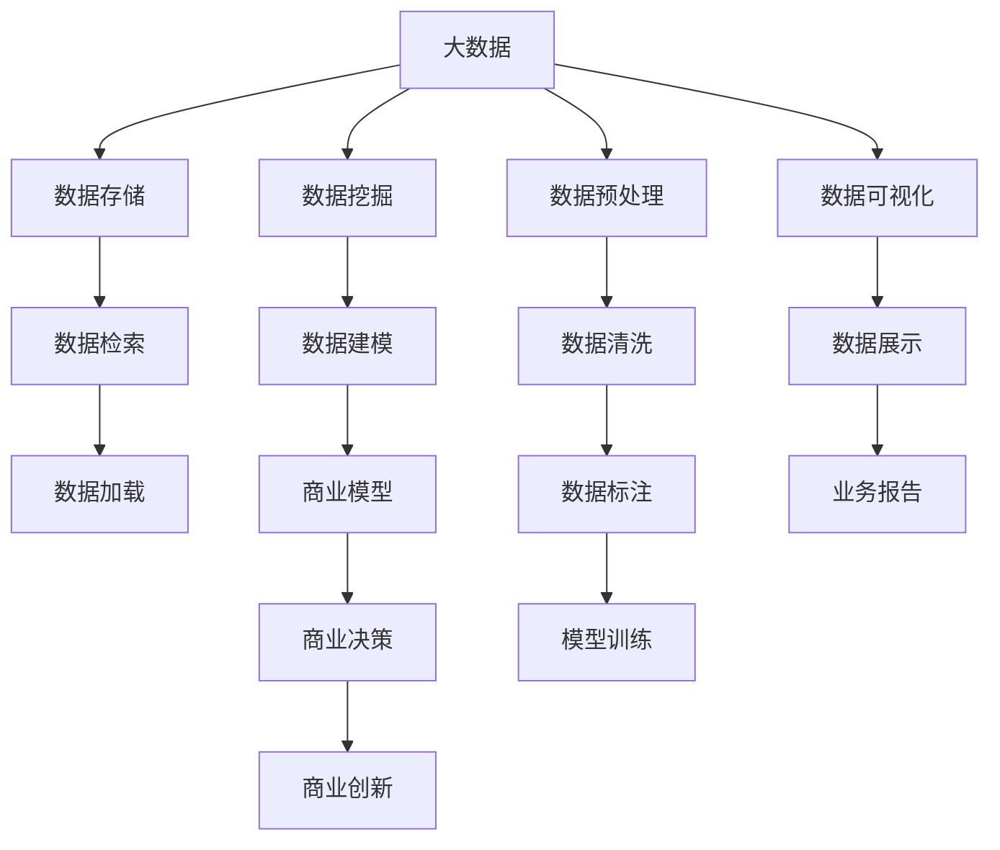

                 

# 大模型：数据驱动的商业创新

## 1. 背景介绍

### 1.1 问题由来

近年来，数据驱动的商业创新模式在全球范围内迅速兴起。在移动互联网、大数据、云计算等技术的推动下，海量数据资源被广泛挖掘和利用，为企业创新提供了前所未有的机会。然而，数据规模的激增也带来了巨大的挑战，如何高效利用海量数据进行商业创新，成为企业面临的重要课题。

大模型（Large Models）作为数据驱动创新的核心引擎，在金融、零售、医疗、制造等多个领域展现出了强大的商业价值。这些模型基于深度学习和大数据技术，通过大规模预训练和微调，能够捕捉到数据中的复杂规律和关联，为商业决策提供有力支持。

### 1.2 问题核心关键点

大模型在商业创新中的应用主要体现在以下几个方面：

- **数据驱动决策**：通过分析海量数据，挖掘其背后隐藏的商业规律和趋势，辅助企业制定更加精准的决策方案。
- **客户行为预测**：基于用户行为数据，预测其未来的消费行为，实现精准营销和个性化服务。
- **业务流程优化**：利用数据驱动的智能推荐系统，优化供应链管理、库存控制等业务流程，提升效率和效益。
- **产品创新设计**：通过数据挖掘和模式识别，洞察市场需求，指导新产品开发和设计，加速产品迭代。

### 1.3 问题研究意义

大模型在商业创新中的应用，不仅能够提升企业决策的科学性和精准性，还能实现业务流程的智能化优化，加速产品创新设计，从而在激烈的市场竞争中取得优势。具体而言，大模型的应用意义如下：

- **降低决策风险**：通过大数据分析，能够更准确地预测市场变化和客户需求，减少决策失误，降低投资风险。
- **提高运营效率**：利用智能推荐系统，优化业务流程，减少人工干预，提高运营效率和准确性。
- **增强市场竞争力**：通过精准营销和个性化服务，提升客户满意度和忠诚度，增强市场竞争力。
- **推动技术创新**：大模型与商业创新深度融合，推动技术进步和应用场景的拓展，为产业升级和经济社会发展提供新动力。

## 2. 核心概念与联系

### 2.1 核心概念概述

在进行商业创新的大模型应用中，需要关注以下核心概念：

- **大模型**：指基于深度学习架构，使用大规模无标签数据进行预训练，通过微调适应特定任务的语言模型。如BERT、GPT等。
- **微调**：指在大模型上进行有监督学习，通过特定任务的标注数据，优化模型在该任务上的性能。
- **迁移学习**：指将预训练模型的知识迁移到新的任务上，减少训练时间，提高模型性能。
- **数据驱动**：指基于数据进行商业决策和创新，通过数据分析和挖掘，发现隐藏的市场规律和客户需求。
- **智能推荐系统**：指通过数据分析和机器学习技术，对用户行为进行预测，推荐个性化的产品和服务。
- **业务流程优化**：指利用数据分析和智能系统，优化供应链管理、库存控制等业务流程，提升运营效率。

这些核心概念共同构成了大模型在商业创新中的关键框架，帮助企业充分利用数据资源，提升商业决策的科学性和精准性。

### 2.2 概念间的关系

以下通过几个Mermaid流程图展示这些核心概念之间的关系：



这个流程图展示了从数据存储、预处理、挖掘到可视化和商业决策的全过程，以及其中各个环节的相互关系。大模型作为数据驱动创新的核心引擎，通过微调和迁移学习等技术，将数据转化为知识，辅助企业进行商业创新。

## 3. 核心算法原理 & 具体操作步骤

### 3.1 算法原理概述

基于大模型的商业创新，其核心算法原理主要包括以下几个方面：

- **数据预处理**：对原始数据进行清洗、标注、归一化等预处理，确保数据的质量和一致性。
- **特征提取**：利用深度学习模型对数据进行特征提取，捕捉数据中的隐藏规律和关联。
- **模型训练**：通过大规模预训练和微调，构建能够适应特定任务的模型。
- **模型评估与优化**：使用验证集和测试集对模型进行评估，根据评估结果进行模型优化。

### 3.2 算法步骤详解

以下是大模型商业创新的一般算法步骤：

**Step 1: 数据准备与预处理**

1. **数据收集**：从企业内部系统和外部数据源（如社交媒体、客户反馈、销售记录等）收集数据。
2. **数据清洗**：去除重复、缺失、异常数据，进行数据标准化和归一化。
3. **数据标注**：对部分数据进行标注，用于模型训练和评估。
4. **特征工程**：根据业务需求设计特征，包括文本、图像、时间序列等。

**Step 2: 模型构建与训练**

1. **选择模型**：根据业务需求选择合适的预训练模型（如BERT、GPT等）。
2. **微调**：使用标注数据对模型进行微调，优化模型在特定任务上的性能。
3. **评估**：使用验证集评估模型性能，调整超参数和模型结构。
4. **部署**：将训练好的模型部署到生产环境中，实现商业应用。

**Step 3: 模型应用与优化**

1. **预测与推荐**：利用模型对用户行为进行预测，实现个性化推荐。
2. **业务流程优化**：利用模型优化供应链管理、库存控制等业务流程。
3. **决策支持**：将模型预测结果用于辅助商业决策，提高决策科学性和准确性。
4. **持续优化**：根据新数据不断更新和优化模型，提升模型性能。

### 3.3 算法优缺点

大模型在商业创新中的应用具有以下优点：

- **高效精准**：通过大规模数据训练，大模型能够捕捉复杂的商业规律和趋势，辅助企业进行精准决策。
- **灵活可扩展**：大模型能够适应多种业务场景，通过微调和迁移学习快速适应新任务。
- **数据驱动**：利用数据驱动决策，减少人为干预，提高决策效率和准确性。

同时，大模型也存在以下缺点：

- **数据依赖**：大模型的性能很大程度上依赖于数据的质量和数量，数据不足可能导致模型泛化能力差。
- **计算资源消耗大**：大规模预训练和微调需要大量的计算资源和时间，对企业技术能力提出较高要求。
- **解释性不足**：大模型通常被视为“黑盒”模型，缺乏对决策过程的解释性。

### 3.4 算法应用领域

大模型在商业创新中的应用广泛，以下列举几个典型的应用领域：

- **金融科技**：利用大模型进行风险评估、信用评分、欺诈检测等，提升金融服务的精准性和安全性。
- **零售电商**：通过个性化推荐系统，提升用户购物体验，提高销售额和客户满意度。
- **医疗健康**：利用大模型进行疾病预测、药物研发、患者管理等，提升医疗服务水平。
- **制造业**：通过预测维护和质量控制，优化生产流程，减少停机时间和生产成本。
- **能源环保**：利用大模型进行能源消耗预测、环境监测，推动绿色可持续发展。

## 4. 数学模型和公式 & 详细讲解 & 举例说明

### 4.1 数学模型构建

大模型在商业创新中的应用，主要涉及以下数学模型：

- **线性回归模型**：用于预测连续型数值，如销售预测、信用评分等。
- **逻辑回归模型**：用于分类任务，如客户分类、欺诈检测等。
- **决策树模型**：用于特征选择和规则生成，提升模型可解释性。
- **支持向量机（SVM）**：用于解决高维数据分类问题，如客户行为分类等。
- **神经网络模型**：如卷积神经网络（CNN）、循环神经网络（RNN）等，用于处理序列数据，如自然语言处理等。

### 4.2 公式推导过程

以线性回归模型为例，其基本公式为：

$$
y = \beta_0 + \beta_1 x_1 + \beta_2 x_2 + ... + \beta_n x_n + \epsilon
$$

其中，$y$ 为预测值，$x_i$ 为输入特征，$\beta_i$ 为系数，$\epsilon$ 为误差项。利用最小二乘法，可以通过以下公式求解模型参数：

$$
\beta = (X^T X)^{-1} X^T y
$$

其中，$X$ 为特征矩阵，$y$ 为标签向量。通过求解模型参数，大模型可以构建预测函数，对数据进行预测和分类。

### 4.3 案例分析与讲解

假设某电商企业需要预测用户的购买概率，可以利用大模型构建线性回归模型。具体步骤如下：

1. **数据准备**：收集用户历史购买记录，提取购买时间、购买金额、购买次数等特征。
2. **模型构建**：选择线性回归模型，使用部分数据进行预训练。
3. **微调**：使用标注数据对模型进行微调，优化预测效果。
4. **评估与部署**：使用测试集评估模型性能，将模型部署到推荐系统中，实现个性化推荐。

## 5. 项目实践：代码实例和详细解释说明

### 5.1 开发环境搭建

以下是使用Python和PyTorch搭建大模型商业创新环境的步骤：

1. **安装Python**：从官网下载并安装Python 3.8版本。
2. **创建虚拟环境**：
```bash
conda create -n pytorch-env python=3.8
conda activate pytorch-env
```
3. **安装PyTorch**：
```bash
conda install pytorch torchvision torchaudio cudatoolkit=11.1 -c pytorch -c conda-forge
```
4. **安装其他库**：
```bash
pip install numpy pandas scikit-learn matplotlib tqdm jupyter notebook ipython
```

完成上述步骤后，即可在`pytorch-env`环境中进行大模型的商业创新实践。

### 5.2 源代码详细实现

以金融风险评估为例，展示大模型的代码实现：

```python
import torch
from torch import nn
from torch.nn import functional as F
from sklearn.model_selection import train_test_split
from sklearn.metrics import accuracy_score

# 准备数据
X_train, X_test, y_train, y_test = train_test_split(X, y, test_size=0.2, random_state=42)

# 定义模型
class LinearRegression(nn.Module):
    def __init__(self, input_dim):
        super(LinearRegression, self).__init__()
        self.linear = nn.Linear(input_dim, 1)

    def forward(self, x):
        out = self.linear(x)
        return out

# 构建模型
model = LinearRegression(input_dim=4)

# 设置损失函数和优化器
criterion = nn.MSELoss()
optimizer = torch.optim.SGD(model.parameters(), lr=0.01)

# 训练模型
for epoch in range(100):
    optimizer.zero_grad()
    output = model(X_train)
    loss = criterion(output, y_train)
    loss.backward()
    optimizer.step()
    if epoch % 10 == 0:
        print(f'Epoch {epoch}, Loss: {loss.item()}')

# 评估模型
output = model(X_test)
predictions = torch.sigmoid(output).detach().cpu().numpy()
y_test_pred = (predictions > 0.5).astype(int)
accuracy = accuracy_score(y_test, y_test_pred)
print(f'Accuracy: {accuracy:.2f}')
```

### 5.3 代码解读与分析

上述代码实现了使用线性回归模型进行金融风险评估的大模型商业创新。

**数据准备**：使用`train_test_split`函数将数据分为训练集和测试集。

**模型构建**：定义线性回归模型，包含一个线性层。

**训练模型**：定义损失函数和优化器，使用随机梯度下降法进行模型训练，每10个epoch输出一次训练误差。

**评估模型**：使用测试集进行模型评估，计算模型预测准确率。

## 6. 实际应用场景

### 6.1 智能推荐系统

智能推荐系统是大模型在商业创新中的典型应用之一。通过分析用户的历史行为数据，大模型可以预测用户对特定商品或服务的兴趣，实现个性化推荐。

以电商推荐为例，大模型可以通过以下步骤实现：

1. **数据准备**：收集用户历史浏览、购买、评价等数据，提取商品标题、价格、销量等特征。
2. **模型训练**：选择预训练模型（如BERT），使用标注数据进行微调，训练推荐模型。
3. **预测与推荐**：使用模型对用户进行推荐，提升用户体验和购买转化率。

### 6.2 客户行为预测

客户行为预测是大模型在商业创新中的另一个重要应用。通过分析客户的历史数据，大模型可以预测其未来的购买行为，实现精准营销和个性化服务。

以金融客户预测为例，大模型可以通过以下步骤实现：

1. **数据准备**：收集客户历史交易记录、信用评分、社交媒体行为等数据。
2. **模型训练**：选择预训练模型（如LSTM），使用标注数据进行微调，训练预测模型。
3. **预测与决策**：使用模型预测客户行为，辅助决策制定。

### 6.3 供应链管理优化

供应链管理优化是大模型在商业创新中的另一个重要应用。通过分析供应链数据，大模型可以预测库存需求、优化物流管理，提升供应链效率和响应速度。

以物流优化为例，大模型可以通过以下步骤实现：

1. **数据准备**：收集物流历史数据，提取订单数量、时间、地点等特征。
2. **模型训练**：选择预训练模型（如RNN），使用标注数据进行微调，训练预测模型。
3. **优化管理**：使用模型预测库存需求、优化配送路线，提升物流管理效率。

### 6.4 未来应用展望

随着大模型的不断发展，其在商业创新中的应用前景将更加广阔。未来可能的应用场景包括：

- **智能客服**：利用大模型构建智能客服系统，提升客户服务体验。
- **风险管理**：利用大模型进行信用评估、欺诈检测，提升金融服务安全性。
- **市场营销**：利用大模型进行消费者行为预测，实现精准营销。
- **人力资源管理**：利用大模型进行员工绩效评估、招聘筛选，提升人力资源管理水平。
- **智慧城市**：利用大模型进行交通管理、环境监测，推动智慧城市建设。

## 7. 工具和资源推荐

### 7.1 学习资源推荐

以下推荐一些有助于掌握大模型商业创新的学习资源：

1. **《Python深度学习》**：由深度学习领域权威人士编写的入门书籍，涵盖深度学习基础知识和大模型应用。
2. **《深度学习入门：基于TensorFlow的实践》**：利用TensorFlow实现深度学习模型的实践教程，适合动手学习。
3. **Coursera《深度学习》课程**：由斯坦福大学开设的深度学习课程，提供理论知识和动手实践。
4. **Kaggle竞赛**：参加Kaggle数据科学竞赛，实战练习大模型商业创新。
5. **GitHub开源项目**：加入GitHub上的大模型商业创新开源项目，学习和贡献代码。

### 7.2 开发工具推荐

以下是一些常用的开发工具，适合大模型商业创新：

1. **PyTorch**：开源深度学习框架，灵活便捷，适合研究与实践。
2. **TensorFlow**：由Google主导的开源深度学习框架，适合大规模工程应用。
3. **Jupyter Notebook**：支持多种编程语言的交互式开发环境，适合学习与实验。
4. **GitHub**：代码托管平台，适合分享和协作。
5. **Google Colab**：免费提供GPU算力的在线开发环境，适合快速实验。

### 7.3 相关论文推荐

以下推荐一些前沿的大模型商业创新论文，供进一步学习和研究：

1. **《Large-Scale Attention Models for Language Understanding》**：提出BERT模型，利用大规模数据进行预训练，改进自然语言处理性能。
2. **《Transformers: State-of-the-Art Natural Language Processing》**：介绍Transformer模型，改进神经网络架构，提升自然语言处理效果。
3. **《Understanding Deep Learning Requires Rethinking Famous Ideas》**：深度学习专家提出的深度学习新理念，影响广泛。
4. **《Large-Scale Web Scraping for Multi-Lingual Fine-Tuning》**：介绍大规模数据采集和预处理技术，改进大模型性能。
5. **《GPT-3: Language Models are Few-Shot Learners》**：提出GPT-3模型，利用提示学习方法，改进自然语言处理效果。

## 8. 总结：未来发展趋势与挑战

### 8.1 研究成果总结

大模型在商业创新中的应用，已经取得了显著的进展和成效。主要的研究成果包括：

1. **算法框架成熟**：基于深度学习和大数据的算法框架已经基本成熟，适合大规模商业应用。
2. **模型性能提升**：通过大规模数据训练和微调，模型性能显著提升，能够处理复杂任务。
3. **应用场景丰富**：大模型在金融、零售、医疗、制造等多个领域得到广泛应用，取得显著效果。

### 8.2 未来发展趋势

大模型在商业创新中的未来发展趋势如下：

1. **算法优化**：未来将探索更多高效、可解释的算法模型，提升模型性能和应用效果。
2. **跨领域融合**：大模型将与人工智能、物联网、区块链等技术深度融合，推动跨领域创新。
3. **数据驱动决策**：未来将更多利用大数据和人工智能技术，实现数据驱动的商业决策和创新。
4. **智能化升级**：通过智能推荐、智能客服、智能决策等技术，推动商业智能化升级。
5. **隐私保护**：在数据驱动创新的同时，将更加注重数据隐私和安全，保护用户权益。

### 8.3 面临的挑战

大模型在商业创新中面临以下挑战：

1. **数据质量**：数据质量不稳定，存在噪音、缺失等问题，影响模型性能。
2. **计算资源**：大规模数据训练和微调需要大量计算资源，对企业技术能力提出高要求。
3. **模型复杂度**：大模型复杂度高，难以解释，存在“黑盒”问题。
4. **跨领域迁移**：大模型在不同领域之间的迁移性能有待提高。
5. **隐私保护**：在数据驱动创新中，数据隐私和安全问题亟待解决。

### 8.4 研究展望

未来，大模型在商业创新中的应用需要关注以下几个方向：

1. **数据治理**：建立数据质量管理和治理机制，提高数据可用性。
2. **模型优化**：探索高效、可解释的算法模型，提升模型性能。
3. **跨领域融合**：推动大模型与人工智能、物联网等技术的深度融合，拓展应用场景。
4. **隐私保护**：加强数据隐私保护技术研究，保护用户权益。
5. **可持续发展**：推动绿色可持续发展，利用大数据和人工智能技术，实现经济和环境双赢。

总之，大模型在商业创新中的应用具有广阔前景。通过持续技术创新和优化，将能够更好地应对未来挑战，推动商业创新和产业升级。

## 9. 附录：常见问题与解答

**Q1：大模型在商业创新中的应用场景有哪些？**

A: 大模型在商业创新中的应用场景非常广泛，包括智能推荐、客户行为预测、供应链管理优化、风险管理、市场营销、人力资源管理、智慧城市等。这些场景能够充分利用大数据和人工智能技术，实现业务智能化升级。

**Q2：如何选择适合的大模型？**

A: 选择适合的大模型需要考虑业务需求和数据特点。常用的预训练模型包括BERT、GPT、RNN、CNN等，每种模型适用于不同的任务和数据类型。通常先选择通用预训练模型进行微调，再根据实际需求进行模型优化和参数调整。

**Q3：如何优化大模型的性能？**

A: 优化大模型性能的方法包括：
1. **数据预处理**：对数据进行清洗、标注、归一化等预处理，提高数据质量。
2. **特征工程**：设计合适的特征，提升模型性能。
3. **模型优化**：调整模型结构、超参数，优化模型性能。
4. **正则化**：使用L2正则、Dropout等技术，防止过拟合。
5. **数据增强**：利用数据增强技术，提高模型泛化能力。
6. **模型融合**：将多个模型进行融合，提升整体性能。

**Q4：大模型在商业创新中需要注意哪些问题？**

A: 大模型在商业创新中需要注意以下问题：
1. **数据隐私和安全**：在数据驱动创新中，必须重视数据隐私和安全问题，保护用户权益。
2. **模型复杂度**：大模型通常较为复杂，难以解释，需要采取措施提高模型可解释性。
3. **计算资源**：大规模数据训练和微调需要大量计算资源，需要优化资源使用。
4. **跨领域迁移**：大模型在不同领域之间的迁移性能有待提高，需要针对具体任务进行优化。
5. **模型鲁棒性**：模型需要具备较高的鲁棒性，避免对异常数据产生误判。

**Q5：如何评估大模型的性能？**

A: 评估大模型性能的方法包括：
1. **数据集划分**：将数据划分为训练集、验证集和测试集，使用验证集和测试集评估模型性能。
2. **指标选择**：选择适合的评估指标，如准确率、精确率、召回率、F1分数等，评估模型性能。
3. **交叉验证**：采用交叉验证技术，提高模型评估的准确性。
4. **超参数调优**：通过超参数调优，找到最优的模型参数组合，提升模型性能。

总之，大模型在商业创新中具有广泛的应用前景，但需要重视数据治理、模型优化、隐私保护等问题，才能充分发挥其商业价值。通过持续技术创新和优化，大模型必将在商业创新中发挥更大的作用。

---

作者：禅与计算机程序设计艺术 / Zen and the Art of Computer Programming

