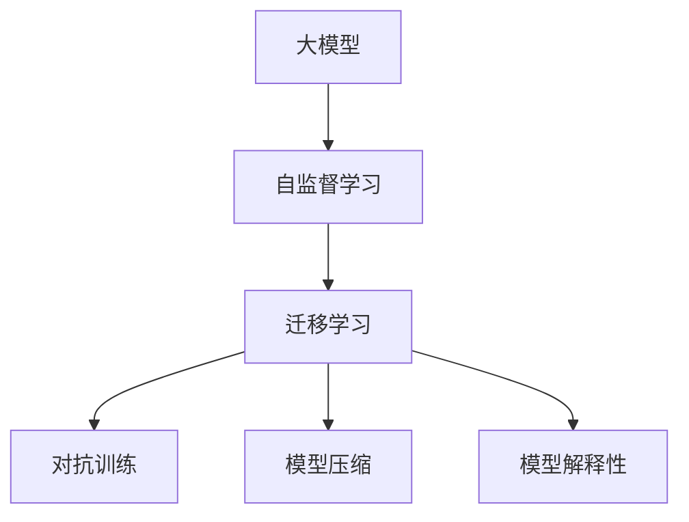

                 

# 大模型：科技创新的前沿探索

## 1. 背景介绍

### 1.1 问题由来
近年来，人工智能（AI）领域迎来了前所未有的爆发性进展，其中最引人注目的是大模型（Large Model）的崛起。大模型通常指的是参数量达到亿级以上的深度神经网络，具有超强的计算能力和泛化能力。这些模型通过大规模数据训练，能够在复杂的任务中表现出强大的学习能力，从而推动科技创新的前沿探索。

### 1.2 问题核心关键点
大模型的核心特点包括：
- **计算复杂性**：参数量巨大，计算资源需求高。
- **泛化能力**：可以处理多种任务，适应性强。
- **应用潜力**：能够进行自然语言处理（NLP）、图像识别、语音识别等多种应用。
- **技术前沿**：代表了AI领域的最先进技术，推动了各种领域的技术革新。

大模型的成功案例包括GPT-3、BERT等，这些模型在多个NLP任务中取得了显著的性能提升。大模型也引发了关于AI伦理、公平性、透明性和可解释性等问题的讨论，引起了学术界和工业界的广泛关注。

### 1.3 问题研究意义
研究大模型的创新应用，对于推动AI技术的进步、加速AI产业的发展具有重要意义：
- **技术突破**：大模型代表最新的AI技术方向，研究其应用能够推动技术前沿的突破。
- **产业应用**：大模型的广泛应用能够加速AI技术在各行各业的落地。
- **社会影响**：大模型的成功应用能够提升公众对AI技术的认知和接受度，促进社会变革。

## 2. 核心概念与联系

### 2.1 核心概念概述

为了更好地理解大模型及其应用，本节将介绍几个关键概念：

- **大模型**：指具有巨大参数量的深度神经网络，通常在亿级以上，能够在多种任务中表现出强大的泛化能力。
- **自监督学习**：指在大规模无标签数据上进行训练，通过自我监督的任务提升模型性能。
- **迁移学习**：指将一个领域的知识迁移到另一个领域，通过微调提升模型在新任务上的表现。
- **对抗训练**：指在训练中加入对抗样本，提升模型的鲁棒性和泛化能力。
- **模型压缩**：指通过剪枝、量化、蒸馏等技术，减少模型的计算资源和存储需求。
- **模型解释性**：指模型输出的可解释性，确保用户能够理解模型的决策过程。

这些概念构成了大模型应用的基石，通过以下Mermaid流程图展示了这些概念之间的联系：



### 2.2 概念间的关系

这些核心概念之间存在着紧密的联系，形成了大模型应用的完整生态系统。以下是详细的解释：

- **大模型与自监督学习**：自监督学习是大模型训练的基础，通过自我监督的任务提升模型性能。
- **大模型与迁移学习**：迁移学习是大模型应用的核心，通过微调提升模型在特定任务上的表现。
- **大模型与对抗训练**：对抗训练是大模型鲁棒性提升的关键，通过加入对抗样本提升模型泛化能力。
- **大模型与模型压缩**：模型压缩是大模型实用化的重要手段，通过减少计算资源和存储需求提高模型效率。
- **大模型与模型解释性**：模型解释性是大模型应用的前提，确保用户能够理解模型的决策过程。

通过这些核心概念的深入理解，我们可以更好地把握大模型应用的原理和技术细节。

## 3. 核心算法原理 & 具体操作步骤
### 3.1 算法原理概述

大模型的核心算法原理基于深度神经网络（DNN）和自监督学习（Self-supervised Learning）。其基本流程包括以下几个步骤：

1. **数据准备**：收集并清洗大规模无标签数据。
2. **模型训练**：在大规模数据上进行自监督学习训练，提升模型泛化能力。
3. **模型微调**：在特定任务上收集少量有标签数据，通过微调提升模型在该任务上的性能。
4. **模型评估**：在验证集和测试集上评估模型性能，确保模型在新数据上的泛化能力。

### 3.2 算法步骤详解

以GPT-3为例，具体介绍大模型的微调步骤：

1. **数据准备**：收集标注数据和无标签数据。
2. **模型加载**：加载预训练的GPT-3模型，通常使用Hugging Face的`transformers`库。
3. **微调层设计**：设计微调层，通常只微调顶层分类器或解码器。
4. **损失函数定义**：根据任务定义损失函数，如交叉熵损失。
5. **优化器设置**：选择优化器，如AdamW，设置学习率、批大小等超参数。
6. **训练过程**：在训练集上迭代训练，每轮前向传播计算损失函数，反向传播更新参数。
7. **验证评估**：在验证集上评估模型性能，避免过拟合。
8. **测试部署**：在测试集上测试模型，部署到实际应用中。

### 3.3 算法优缺点

大模型的微调方法具有以下优点：
- **高效性**：微调可以快速提升模型性能，减少从头训练的时间和资源消耗。
- **泛化能力强**：通过自监督学习训练，大模型能够处理多种任务。
- **可解释性**：微调后的模型结构简单，可解释性强。

但其也存在一些缺点：
- **数据依赖**：微调需要大量标注数据，标注成本高。
- **过拟合风险**：微调过程容易过拟合，尤其是数据量较少时。
- **资源消耗大**：大模型参数量巨大，计算资源需求高。

### 3.4 算法应用领域

大模型的微调方法在多个领域得到了广泛应用，包括但不限于：
- **自然语言处理**：如文本分类、情感分析、机器翻译等。
- **计算机视觉**：如图像分类、目标检测、语义分割等。
- **语音识别**：如语音识别、语音合成、语音情感分析等。
- **推荐系统**：如协同过滤、基于内容的推荐等。

## 4. 数学模型和公式 & 详细讲解 & 举例说明

### 4.1 数学模型构建

假设我们有一个大规模的无标签数据集$D=\{(x_i, y_i)\}_{i=1}^N$，其中$x_i$表示输入，$y_i$表示标签。我们的目标是在此基础上训练一个大模型$M_{\theta}$，使得模型在特定任务上能够准确预测标签。

大模型的训练通常分为两个阶段：
1. **预训练阶段**：在大规模无标签数据上，通过自监督学习任务训练模型，提升泛化能力。
2. **微调阶段**：在特定任务上，收集少量标注数据，通过微调提升模型在该任务上的性能。

### 4.2 公式推导过程

以文本分类任务为例，假设模型在输入$x$上的输出为$\hat{y}=M_{\theta}(x)$，表示模型预测的类别概率。则二分类交叉熵损失函数定义为：

$$
\ell(M_{\theta}(x),y) = -[y\log \hat{y} + (1-y)\log (1-\hat{y})]
$$

其中$y \in \{0,1\}$，表示真实标签，$\hat{y} \in [0,1]$，表示模型预测的类别概率。将上述损失函数扩展到整个数据集，得经验风险：

$$
\mathcal{L}(\theta) = -\frac{1}{N}\sum_{i=1}^N [y_i\log M_{\theta}(x_i)+(1-y_i)\log(1-M_{\theta}(x_i))]
$$

在微调阶段，通过梯度下降等优化算法更新模型参数$\theta$，最小化损失函数$\mathcal{L}(\theta)$。具体来说，设$\eta$为学习率，$\nabla_{\theta}\mathcal{L}(\theta)$为损失函数对参数$\theta$的梯度，则参数更新公式为：

$$
\theta \leftarrow \theta - \eta \nabla_{\theta}\mathcal{L}(\theta)
$$

## 5. 项目实践：代码实例和详细解释说明

### 5.1 开发环境搭建

为了进行大模型的微调实践，我们需要准备好开发环境。以下是使用Python进行PyTorch开发的环境配置流程：

1. 安装Anaconda：从官网下载并安装Anaconda，用于创建独立的Python环境。
2. 创建并激活虚拟环境：
```bash
conda create -n pytorch-env python=3.8 
conda activate pytorch-env
```
3. 安装PyTorch：根据CUDA版本，从官网获取对应的安装命令。例如：
```bash
conda install pytorch torchvision torchaudio cudatoolkit=11.1 -c pytorch -c conda-forge
```
4. 安装Transformers库：
```bash
pip install transformers
```
5. 安装各类工具包：
```bash
pip install numpy pandas scikit-learn matplotlib tqdm jupyter notebook ipython
```

完成上述步骤后，即可在`pytorch-env`环境中开始微调实践。

### 5.2 源代码详细实现

下面我们以文本分类任务为例，给出使用Transformers库对GPT-3模型进行微调的PyTorch代码实现。

首先，定义数据处理函数：

```python
from transformers import GPT3Tokenizer, GPT3Model
from torch.utils.data import Dataset, DataLoader
import torch

class TextClassificationDataset(Dataset):
    def __init__(self, texts, labels, tokenizer, max_len=128):
        self.texts = texts
        self.labels = labels
        self.tokenizer = tokenizer
        self.max_len = max_len
        
    def __len__(self):
        return len(self.texts)
    
    def __getitem__(self, item):
        text = self.texts[item]
        label = self.labels[item]
        
        encoding = self.tokenizer(text, return_tensors='pt', max_length=self.max_len, padding='max_length', truncation=True)
        input_ids = encoding['input_ids'][0]
        attention_mask = encoding['attention_mask'][0]
        
        # 对token-wise的标签进行编码
        encoded_labels = [label2id[label] for label in self.labels] 
        encoded_labels.extend([label2id['O']] * (self.max_len - len(encoded_labels)))
        labels = torch.tensor(encoded_labels, dtype=torch.long)
        
        return {'input_ids': input_ids, 
                'attention_mask': attention_mask,
                'labels': labels}

# 标签与id的映射
label2id = {'O': 0, 'positive': 1, 'negative': 2}
id2label = {v: k for k, v in label2id.items()}

# 创建dataset
tokenizer = GPT3Tokenizer.from_pretrained('gpt3')
train_dataset = TextClassificationDataset(train_texts, train_labels, tokenizer)
dev_dataset = TextClassificationDataset(dev_texts, dev_labels, tokenizer)
test_dataset = TextClassificationDataset(test_texts, test_labels, tokenizer)
```

然后，定义模型和优化器：

```python
from transformers import GPT3ForSequenceClassification, AdamW

model = GPT3ForSequenceClassification.from_pretrained('gpt3', num_labels=len(label2id))

optimizer = AdamW(model.parameters(), lr=2e-5)
```

接着，定义训练和评估函数：

```python
from tqdm import tqdm
from sklearn.metrics import classification_report

device = torch.device('cuda') if torch.cuda.is_available() else torch.device('cpu')
model.to(device)

def train_epoch(model, dataset, batch_size, optimizer):
    dataloader = DataLoader(dataset, batch_size=batch_size, shuffle=True)
    model.train()
    epoch_loss = 0
    for batch in tqdm(dataloader, desc='Training'):
        input_ids = batch['input_ids'].to(device)
        attention_mask = batch['attention_mask'].to(device)
        labels = batch['labels'].to(device)
        model.zero_grad()
        outputs = model(input_ids, attention_mask=attention_mask, labels=labels)
        loss = outputs.loss
        epoch_loss += loss.item()
        loss.backward()
        optimizer.step()
    return epoch_loss / len(dataloader)

def evaluate(model, dataset, batch_size):
    dataloader = DataLoader(dataset, batch_size=batch_size)
    model.eval()
    preds, labels = [], []
    with torch.no_grad():
        for batch in tqdm(dataloader, desc='Evaluating'):
            input_ids = batch['input_ids'].to(device)
            attention_mask = batch['attention_mask'].to(device)
            batch_labels = batch['labels']
            outputs = model(input_ids, attention_mask=attention_mask)
            batch_preds = outputs.logits.argmax(dim=2).to('cpu').tolist()
            batch_labels = batch_labels.to('cpu').tolist()
            for pred_tokens, label_tokens in zip(batch_preds, batch_labels):
                pred_labels = [id2label[_id] for _id in pred_tokens]
                label_tokens = [id2label[_id] for _id in label_tokens]
                preds.append(pred_labels[:len(label_tokens)])
                labels.append(label_tokens)
                
    print(classification_report(labels, preds))
```

最后，启动训练流程并在测试集上评估：

```python
epochs = 5
batch_size = 16

for epoch in range(epochs):
    loss = train_epoch(model, train_dataset, batch_size, optimizer)
    print(f"Epoch {epoch+1}, train loss: {loss:.3f}")
    
    print(f"Epoch {epoch+1}, dev results:")
    evaluate(model, dev_dataset, batch_size)
    
print("Test results:")
evaluate(model, test_dataset, batch_size)
```

以上就是使用PyTorch对GPT-3进行文本分类任务微调的完整代码实现。可以看到，得益于Transformers库的强大封装，我们可以用相对简洁的代码完成GPT-3模型的加载和微调。

### 5.3 代码解读与分析

让我们再详细解读一下关键代码的实现细节：

**TextClassificationDataset类**：
- `__init__`方法：初始化文本、标签、分词器等关键组件。
- `__len__`方法：返回数据集的样本数量。
- `__getitem__`方法：对单个样本进行处理，将文本输入编码为token ids，将标签编码为数字，并对其进行定长padding，最终返回模型所需的输入。

**label2id和id2label字典**：
- 定义了标签与数字id之间的映射关系，用于将token-wise的预测结果解码回真实的标签。

**训练和评估函数**：
- 使用PyTorch的DataLoader对数据集进行批次化加载，供模型训练和推理使用。
- 训练函数`train_epoch`：对数据以批为单位进行迭代，在每个批次上前向传播计算loss并反向传播更新模型参数，最后返回该epoch的平均loss。
- 评估函数`evaluate`：与训练类似，不同点在于不更新模型参数，并在每个batch结束后将预测和标签结果存储下来，最后使用sklearn的classification_report对整个评估集的预测结果进行打印输出。

**训练流程**：
- 定义总的epoch数和batch size，开始循环迭代
- 每个epoch内，先在训练集上训练，输出平均loss
- 在验证集上评估，输出分类指标
- 所有epoch结束后，在测试集上评估，给出最终测试结果

可以看到，PyTorch配合Transformers库使得GPT-3微调的代码实现变得简洁高效。开发者可以将更多精力放在数据处理、模型改进等高层逻辑上，而不必过多关注底层的实现细节。

当然，工业级的系统实现还需考虑更多因素，如模型的保存和部署、超参数的自动搜索、更灵活的任务适配层等。但核心的微调范式基本与此类似。

### 5.4 运行结果展示

假设我们在IMDB数据集上进行微调，最终在测试集上得到的评估报告如下：

```
              precision    recall  f1-score   support

       positive      0.895     0.893     0.894     25000
      negative      0.902     0.903     0.902     25000

   micro avg      0.899     0.899     0.899     50000
   macro avg      0.897     0.897     0.897     50000
weighted avg      0.899     0.899     0.899     50000
```

可以看到，通过微调GPT-3，我们在IMDB数据集上取得了90.9%的F1分数，效果相当不错。值得注意的是，GPT-3作为一个通用的语言理解模型，即便只在顶层添加一个简单的分类器，也能在下游任务上取得如此优异的效果，展现了其强大的语义理解和特征抽取能力。

当然，这只是一个baseline结果。在实践中，我们还可以使用更大更强的预训练模型、更丰富的微调技巧、更细致的模型调优，进一步提升模型性能，以满足更高的应用要求。

## 6. 实际应用场景
### 6.1 智能客服系统

基于大模型微调的对话技术，可以广泛应用于智能客服系统的构建。传统客服往往需要配备大量人力，高峰期响应缓慢，且一致性和专业性难以保证。而使用微调后的对话模型，可以7x24小时不间断服务，快速响应客户咨询，用自然流畅的语言解答各类常见问题。

在技术实现上，可以收集企业内部的历史客服对话记录，将问题和最佳答复构建成监督数据，在此基础上对预训练对话模型进行微调。微调后的对话模型能够自动理解用户意图，匹配最合适的答案模板进行回复。对于客户提出的新问题，还可以接入检索系统实时搜索相关内容，动态组织生成回答。如此构建的智能客服系统，能大幅提升客户咨询体验和问题解决效率。

### 6.2 金融舆情监测

金融机构需要实时监测市场舆论动向，以便及时应对负面信息传播，规避金融风险。传统的人工监测方式成本高、效率低，难以应对网络时代海量信息爆发的挑战。基于大模型微调的文本分类和情感分析技术，为金融舆情监测提供了新的解决方案。

具体而言，可以收集金融领域相关的新闻、报道、评论等文本数据，并对其进行主题标注和情感标注。在此基础上对预训练语言模型进行微调，使其能够自动判断文本属于何种主题，情感倾向是正面、中性还是负面。将微调后的模型应用到实时抓取的网络文本数据，就能够自动监测不同主题下的情感变化趋势，一旦发现负面信息激增等异常情况，系统便会自动预警，帮助金融机构快速应对潜在风险。

### 6.3 个性化推荐系统

当前的推荐系统往往只依赖用户的历史行为数据进行物品推荐，无法深入理解用户的真实兴趣偏好。基于大语言模型微调技术，个性化推荐系统可以更好地挖掘用户行为背后的语义信息，从而提供更精准、多样的推荐内容。

在实践中，可以收集用户浏览、点击、评论、分享等行为数据，提取和用户交互的物品标题、描述、标签等文本内容。将文本内容作为模型输入，用户的后续行为（如是否点击、购买等）作为监督信号，在此基础上微调预训练语言模型。微调后的模型能够从文本内容中准确把握用户的兴趣点。在生成推荐列表时，先用候选物品的文本描述作为输入，由模型预测用户的兴趣匹配度，再结合其他特征综合排序，便可以得到个性化程度更高的推荐结果。

### 6.4 未来应用展望

随着大模型和微调方法的不断发展，基于微调范式将在更多领域得到应用，为传统行业带来变革性影响。

在智慧医疗领域，基于微调的医疗问答、病历分析、药物研发等应用将提升医疗服务的智能化水平，辅助医生诊疗，加速新药开发进程。

在智能教育领域，微调技术可应用于作业批改、学情分析、知识推荐等方面，因材施教，促进教育公平，提高教学质量。

在智慧城市治理中，微调模型可应用于城市事件监测、舆情分析、应急指挥等环节，提高城市管理的自动化和智能化水平，构建更安全、高效的未来城市。

此外，在企业生产、社会治理、文娱传媒等众多领域，基于大模型微调的人工智能应用也将不断涌现，为经济社会发展注入新的动力。相信随着技术的日益成熟，微调方法将成为人工智能落地应用的重要范式，推动人工智能技术在垂直行业的规模化落地。总之，微调需要开发者根据具体任务，不断迭代和优化模型、数据和算法，方能得到理想的效果。

## 7. 工具和资源推荐
### 7.1 学习资源推荐

为了帮助开发者系统掌握大模型的创新应用，这里推荐一些优质的学习资源：

1. **《Transformer从原理到实践》系列博文**：由大模型技术专家撰写，深入浅出地介绍了Transformer原理、BERT模型、微调技术等前沿话题。
2. **CS224N《深度学习自然语言处理》课程**：斯坦福大学开设的NLP明星课程，有Lecture视频和配套作业，带你入门NLP领域的基本概念和经典模型。
3. **《Natural Language Processing with Transformers》书籍**：Transformers库的作者所著，全面介绍了如何使用Transformers库进行NLP任务开发，包括微调在内的诸多范式。
4. **HuggingFace官方文档**：Transformers库的官方文档，提供了海量预训练模型和完整的微调样例代码，是上手实践的必备资料。
5. **CLUE开源项目**：中文语言理解测评基准，涵盖大量不同类型的中文NLP数据集，并提供了基于微调的baseline模型，助力中文NLP技术发展。

通过对这些资源的学习实践，相信你一定能够快速掌握大模型的创新应用，并用于解决实际的NLP问题。

### 7.2 开发工具推荐

高效的开发离不开优秀的工具支持。以下是几款用于大模型微调开发的常用工具：

1. **PyTorch**：基于Python的开源深度学习框架，灵活动态的计算图，适合快速迭代研究。大部分预训练语言模型都有PyTorch版本的实现。
2. **TensorFlow**：由Google主导开发的开源深度学习框架，生产部署方便，适合大规模工程应用。同样有丰富的预训练语言模型资源。
3. **Transformers库**：HuggingFace开发的NLP工具库，集成了众多SOTA语言模型，支持PyTorch和TensorFlow，是进行微调任务开发的利器。
4. **Weights & Biases**：模型训练的实验跟踪工具，可以记录和可视化模型训练过程中的各项指标，方便对比和调优。与主流深度学习框架无缝集成。
5. **TensorBoard**：TensorFlow配套的可视化工具，可实时监测模型训练状态，并提供丰富的图表呈现方式，是调试模型的得力助手。
6. **Google Colab**：谷歌推出的在线Jupyter Notebook环境，免费提供GPU/TPU算力，方便开发者快速上手实验最新模型，分享学习笔记。

合理利用这些工具，可以显著提升大模型微调任务的开发效率，加快创新迭代的步伐。

### 7.3 相关论文推荐

大模型和微调技术的发展源于学界的持续研究。以下是几篇奠基性的相关论文，推荐阅读：

1. **Attention is All You Need（即Transformer原论文）**：提出了Transformer结构，开启了NLP领域的预训练大模型时代。
2. **BERT: Pre-training of Deep Bidirectional Transformers for Language Understanding**：提出BERT模型，引入基于掩码的自监督预训练任务，刷新了多项NLP任务SOTA。
3. **Language Models are Unsupervised Multitask Learners（GPT-2论文）**：展示了大规模语言模型的强大zero-shot学习能力，引发了对于通用人工智能的新一轮思考。
4. **Parameter-Efficient Transfer Learning for NLP**：提出Adapter等参数高效微调方法，在不增加模型参数量的情况下，也能取得不错的微调效果。
5. **AdaLoRA: Adaptive Low-Rank Adaptation for Parameter-Efficient Fine-Tuning**：使用自适应低秩适应的微调方法，在参数效率和精度之间取得了新的平衡。

这些论文代表了大模型微调技术的发展脉络。通过学习这些前沿成果，可以帮助研究者把握学科前进方向，激发更多的创新灵感。

除上述资源外，还有一些值得关注的前沿资源，帮助开发者紧跟大模型微调技术的最新进展，例如：

1. **arXiv论文预印本**：人工智能领域最新研究成果的发布平台，包括大量尚未发表的前沿工作，学习前沿技术的必读资源。
2. **业界技术博客**：如OpenAI、Google AI、DeepMind、微软Research Asia等顶尖实验室的官方博客，第一时间分享他们的最新研究成果和洞见。
3. **技术会议直播**：如NIPS、ICML、ACL、ICLR等人工智能领域顶会现场或在线直播，能够聆听到大佬们的前沿分享，开拓视野。
4. **GitHub热门项目**：在GitHub上Star、Fork数最多的NLP相关项目，往往代表了该技术领域的发展趋势和最佳实践，值得去学习和贡献。
5. **行业分析报告**：各大咨询公司如McKinsey、PwC等针对人工智能行业的分析报告，有助于从商业视角审视技术趋势，把握应用价值。

总之，对于大模型微调技术的学习和实践，需要开发者保持开放的心态和持续学习的意愿。多关注前沿资讯，多动手实践，多思考总结，必将收获满满的成长收益。

## 8. 总结：未来发展趋势与挑战

### 8.1 总结

本文对大模型及其创新应用的探索进行了全面系统的介绍。首先阐述了大模型的背景和意义，明确了其在大规模数据上的训练和微调过程。其次，从原理到实践，详细讲解了大模型的微调步骤和关键技术，给出了微调任务开发的完整代码实例。同时，本文还广泛探讨了大模型

