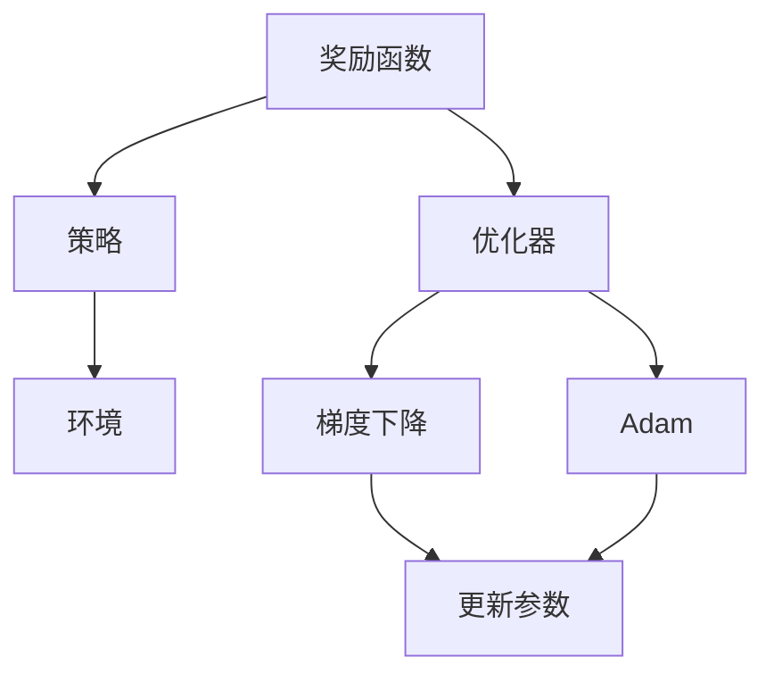
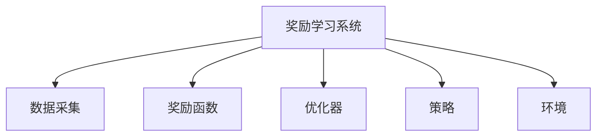
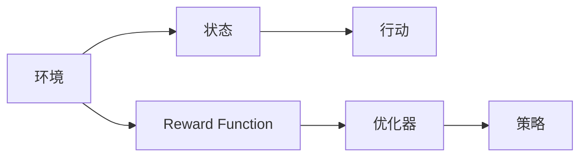

                 

# 大脑是一个奖励机器：需要奖励

## 1. 背景介绍

### 1.1 问题由来
在过去的几十年中，计算机科学的飞速发展带来了前所未有的技术突破。在人工智能领域，特别是深度学习的发展，使得计算机不仅能够处理大量数据，还能通过训练学习复杂的任务。这种能力对于自然语言处理(NLP)、计算机视觉(CV)、机器人控制等领域产生了深远的影响。

然而，尽管计算机已经能够执行许多复杂的任务，但在情感、决策、创造力等方面，计算机仍然难以匹敌人类。特别是，计算机在面对复杂多变的环境时，往往难以像人类一样做出灵活的反应。

为什么计算机在情感和创造力方面表现不佳？为什么人类在大脑中做出决策时，能够如此灵活和高效？这些问题引发了科学家们的深入思考，并催生了新的研究方向：奖励学习。

### 1.2 问题核心关键点
奖励学习是一种在环境中通过奖励机制指导行为的学习方式。它通过将决策过程与奖励信号关联起来，使模型能够在特定的环境中做出最优决策。这种学习方式可以应用于游戏、机器人控制、自然语言处理等多个领域，帮助模型适应复杂多变的环境。

奖励学习的核心在于：
- 定义明确的奖励函数，用于衡量模型的行为与环境的匹配度。
- 通过优化奖励函数，使模型逐渐学习到环境中的最优行为。
- 奖励信号的反馈机制，使得模型能够在每次行动后及时调整行为策略。

在人工智能领域，奖励学习已经在多个领域得到了广泛应用。例如，通过奖励机制，计算机可以在围棋、AlphaGo等游戏中展现出超乎人类的水平。在自然语言处理中，奖励学习也被用于对话系统、机器翻译等任务的优化。

### 1.3 问题研究意义
奖励学习的研究对于提升人工智能系统的智能水平，具有重要的意义：
- 帮助模型更好地适应复杂环境。奖励学习能够使模型从环境中学习，适应不同的任务和场景。
- 提高模型的鲁棒性和可靠性。通过奖励机制，模型能够在各种情况下做出稳定、可靠的决策。
- 增强模型的可解释性。奖励学习使得模型行为与其决策过程紧密相关，增加了模型的可解释性。
- 促进跨学科研究。奖励学习的应用需要结合心理学、神经科学等多个学科的知识，有助于推动人工智能与其他学科的交叉融合。
- 推动技术的实际应用。奖励学习可以应用于各种实际问题中，如自动驾驶、工业控制等，为社会的各个领域带来创新和变革。

## 2. 核心概念与联系

### 2.1 核心概念概述

为了更好地理解奖励学习，我们需要首先了解一些相关的核心概念：

- **奖励函数(Reward Function)**：定义在环境状态和行动空间上的函数，用于衡量模型行动与环境的匹配度。奖励函数通常是一个标量，表示模型行为对环境的贡献度。
- **优化器(Optimizer)**：用于更新模型参数，使得模型行为与奖励函数的最大化相关联。常见的优化器包括梯度下降、Adam等。
- **策略(Policy)**：定义模型在给定状态下的行动策略。策略可以是确定性的，也可以是概率性的。
- **环境(Environment)**：奖励学习的实验对象，可以是游戏、机器人控制等。环境通常包含状态和奖励两个基本组成部分。
- **探索与利用(Exploration & Exploitation)**：在奖励学习中，模型需要在探索未知领域和利用已知的最佳策略之间进行权衡。这种平衡是奖励学习的核心问题之一。

### 2.2 概念间的关系

这些核心概念之间的联系可以通过以下Mermaid流程图来展示：



这个流程图展示了奖励学习的基本流程：
1. 奖励函数将环境状态和模型行动映射为奖励信号。
2. 优化器通过更新模型参数，使模型行动与奖励函数的最大化相关联。
3. 策略定义了模型在环境中的行动方案。
4. 环境是模型学习和优化的对象。
5. 梯度下降和Adam等优化器用于更新模型参数。
6. 更新后的模型参数将指导下一次行动。

通过这个流程图，我们可以更清晰地理解奖励学习的核心流程和各个组件的作用。

### 2.3 核心概念的整体架构

为了更全面地理解奖励学习，我们可以从宏观和微观两个层面来分析其整体架构：

#### 2.3.1 宏观架构



这个宏观架构展示了奖励学习系统的基本组成：
1. 数据采集模块：从环境中采集数据，用于模型训练。
2. 奖励函数模块：定义奖励函数，衡量模型行动与环境的匹配度。
3. 优化器模块：更新模型参数，最小化奖励函数。
4. 策略模块：定义模型在环境中的行动策略。
5. 环境模块：奖励学习的实验对象，包含状态和奖励两个基本组成部分。

#### 2.3.2 微观架构

微观架构展示了奖励学习系统的具体实现：



这个微观架构展示了奖励学习的基本流程：
1. 环境模块定义状态和奖励函数。
2. 策略模块根据当前状态选择行动。
3. 行动模块执行策略，生成具体行动。
4. 优化器模块更新模型参数，最小化奖励函数。
5. 奖励函数模块根据当前状态和行动，计算奖励信号。

通过这两个架构图，我们可以更全面地理解奖励学习的实现流程和各个组件的作用。

## 3. 核心算法原理 & 具体操作步骤
### 3.1 算法原理概述

奖励学习的基本原理是通过奖励函数和优化器，使模型在环境中学习最优行为。具体而言，奖励学习的过程可以分为以下几个步骤：

1. **数据采集**：从环境中采集数据，包含状态、奖励和行动等基本信息。
2. **奖励函数定义**：定义一个奖励函数，用于衡量模型行动与环境的匹配度。
3. **策略选择**：定义策略，指导模型在给定状态下的行动。
4. **参数更新**：通过优化器更新模型参数，最小化奖励函数。
5. **反馈与调整**：根据奖励信号，调整模型行为和策略。

奖励学习通常使用模型拟合优化目标函数，使得模型行为与奖励函数的最大化相关联。通过这种优化过程，模型能够在复杂的任务中逐步学习到最优行为。

### 3.2 算法步骤详解

下面，我们将详细讲解奖励学习的各个步骤：

**Step 1: 数据采集**

在数据采集阶段，需要从环境中采集数据，用于模型训练。这些数据通常包含状态、奖励和行动等信息。例如，在机器人控制任务中，每个数据点可能包括机器人的位置、速度、角度等状态信息，以及对应的奖励和行动。

```python
import numpy as np

# 数据生成函数
def generate_data():
    data = []
    for i in range(1000):
        state = np.random.randn(3)  # 生成随机状态
        action = np.random.randn(3)  # 生成随机行动
        reward = state[0] + action[0]  # 计算奖励
        data.append((state, action, reward))
    return data
```

**Step 2: 奖励函数定义**

在奖励函数定义阶段，需要定义一个奖励函数，用于衡量模型行动与环境的匹配度。奖励函数通常是一个标量，表示模型行为对环境的贡献度。常见的奖励函数包括线性奖励函数、二次奖励函数等。

```python
# 奖励函数定义
def reward_function(state, action):
    return 0.5 * np.sum(state) + np.dot(state, action) - np.linalg.norm(action) ** 2
```

**Step 3: 策略选择**

在策略选择阶段，需要定义模型在给定状态下的行动策略。策略可以是确定性的，也可以是概率性的。例如，在机器人控制任务中，策略可以是根据当前位置选择向上或向下行动。

```python
# 策略定义
def policy(state):
    if state[0] > 0:
        return np.array([0.5, 0.5])
    else:
        return np.array([-0.5, 0.5])
```

**Step 4: 参数更新**

在参数更新阶段，通过优化器更新模型参数，最小化奖励函数。常用的优化器包括梯度下降、Adam等。

```python
from tensorflow.keras.optimizers import Adam

# 定义优化器
optimizer = Adam(learning_rate=0.01)

# 定义模型参数
theta = np.random.randn(2)

# 定义损失函数
def loss_function(state, action, reward, theta):
    return np.linalg.norm(reward - reward_function(state, action)) ** 2

# 训练过程
for i in range(1000):
    state = np.random.randn(3)
    action = policy(state)
    reward = reward_function(state, action)
    theta_new = theta - optimizer.compute_gradients(loss_function(state, action, reward, theta))[0]
    theta = theta_new
```

**Step 5: 反馈与调整**

在反馈与调整阶段，根据奖励信号，调整模型行为和策略。这个过程通常称为回溯或强化学习。

```python
# 反馈与调整
def feedback(data, theta, policy, optimizer):
    for i in range(1000):
        state = np.random.randn(3)
        action = policy(state)
        reward = reward_function(state, action)
        theta_new = theta - optimizer.compute_gradients(loss_function(state, action, reward, theta))[0]
        theta = theta_new
        state = np.random.randn(3)
        action = policy(state)
        reward = reward_function(state, action)
        theta_new = theta - optimizer.compute_gradients(loss_function(state, action, reward, theta))[0]
        theta = theta_new
```

通过上述步骤，奖励学习系统能够在复杂环境中逐步学习到最优行为，适应不同的任务和场景。

### 3.3 算法优缺点

奖励学习具有以下优点：
- 灵活性：奖励学习可以根据不同的任务和环境进行定制化设计，适应不同的应用场景。
- 自适应性：奖励学习能够自动适应环境变化，调整行为策略，提高模型的鲁棒性和可靠性。
- 可解释性：奖励学习使得模型行为与其决策过程紧密相关，增加了模型的可解释性。

奖励学习也存在一些缺点：
- 过拟合风险：奖励学习在数据采集阶段容易过拟合，需要合理设计奖励函数和优化器。
- 探索与利用平衡：奖励学习需要在探索未知领域和利用已知的最佳策略之间进行权衡，需要精细化的策略设计。
- 数据需求高：奖励学习需要大量的标注数据进行训练，数据采集和标注成本较高。

尽管存在这些缺点，但奖励学习仍然是目前人工智能领域中最为有效的方法之一。未来，通过技术创新和算法改进，相信奖励学习能够更好地适应复杂环境，推动人工智能技术的进步。

### 3.4 算法应用领域

奖励学习已经被广泛应用于多个领域，包括游戏、机器人控制、自然语言处理、金融决策等。

**游戏**：在围棋、AlphaGo等游戏中，奖励学习已经展现出超乎人类的水平。通过奖励函数和优化器，模型能够逐步学习到最优的行动策略。

**机器人控制**：在机器人控制任务中，奖励学习被用于优化机器人的行动策略，使其能够在复杂环境中做出最优决策。例如，通过奖励函数和优化器，机器人能够逐步学习到最优的行动轨迹和姿态。

**自然语言处理**：在自然语言处理任务中，奖励学习被用于优化对话系统、机器翻译等任务的性能。通过奖励函数和优化器，模型能够逐步学习到最优的回应策略和翻译模型。

**金融决策**：在金融决策任务中，奖励学习被用于优化投资策略和风险管理。通过奖励函数和优化器，模型能够逐步学习到最优的投资组合和风险控制策略。

除了上述领域，奖励学习还可以应用于智能制造、智慧城市、医疗诊断等诸多领域。

## 4. 数学模型和公式 & 详细讲解 & 举例说明

### 4.1 数学模型构建

奖励学习的数学模型可以形式化地表示为：

$$
\max_{\theta} \sum_{t=0}^{T} \gamma^t r_t(\theta)
$$

其中，$\theta$ 表示模型参数，$r_t(\theta)$ 表示在第 $t$ 步的奖励函数，$\gamma$ 表示折扣因子。

### 4.2 公式推导过程

在奖励学习的训练过程中，我们需要最小化累积奖励函数，即：

$$
\min_{\theta} \sum_{t=0}^{T} \gamma^t r_t(\theta)
$$

为了最小化累积奖励函数，我们可以使用梯度下降等优化算法。具体而言，假设奖励函数 $r_t(\theta)$ 是关于模型参数 $\theta$ 的光滑函数，可以使用梯度下降更新模型参数：

$$
\theta \leftarrow \theta - \eta \nabla_{\theta} \sum_{t=0}^{T} \gamma^t r_t(\theta)
$$

其中，$\eta$ 表示学习率。

### 4.3 案例分析与讲解

以一个简单的机器人控制为例，我们来看奖励学习的具体实现。

假设机器人位于坐标系中的位置 $(0,0)$，需要到达坐标系中的位置 $(1,1)$。我们定义一个线性奖励函数：

$$
r(\theta) = 1 - ||\theta - (1,1) ||
$$

其中，$\theta$ 表示机器人的位置，$(1,1)$ 表示目标位置。我们定义一个线性策略：

$$
\pi(\theta) = \theta
$$

即机器人的行动与当前位置一致。我们定义一个随机行动：

$$
a_t = \pi(\theta_t) + \epsilon
$$

其中，$\epsilon$ 表示随机噪声。我们定义一个折扣因子 $\gamma = 0.9$，表示未来奖励的重要性。

通过上述定义，我们可以使用梯度下降优化器最小化累积奖励函数：

$$
\min_{\theta} \sum_{t=0}^{T} \gamma^t r_t(\theta)
$$

其中，$r_t(\theta)$ 表示第 $t$ 步的奖励函数。

## 5. 项目实践：代码实例和详细解释说明

### 5.1 开发环境搭建

在进行奖励学习实践前，我们需要准备好开发环境。以下是使用Python进行TensorFlow开发的环境配置流程：

1. 安装Anaconda：从官网下载并安装Anaconda，用于创建独立的Python环境。

2. 创建并激活虚拟环境：
```bash
conda create -n tf-env python=3.8 
conda activate tf-env
```

3. 安装TensorFlow：根据CUDA版本，从官网获取对应的安装命令。例如：
```bash
pip install tensorflow-gpu
```

4. 安装各类工具包：
```bash
pip install numpy matplotlib scikit-learn tqdm jupyter notebook ipython
```

完成上述步骤后，即可在`tf-env`环境中开始奖励学习的实践。

### 5.2 源代码详细实现

下面我们以一个简单的机器人控制任务为例，给出使用TensorFlow进行奖励学习的PyTorch代码实现。

首先，定义机器人控制的任务和数据生成函数：

```python
import numpy as np
import tensorflow as tf
from tensorflow.keras.layers import Dense, Flatten
from tensorflow.keras.optimizers import Adam

# 定义机器人控制任务
class Robot:
    def __init__(self):
        self.position = np.array([0, 0])
        self.speed = np.array([0, 0])
        self.action_size = 2
        self.max_steps = 100

    def reset(self):
        self.position = np.array([0, 0])
        self.speed = np.array([0, 0])
        return self.position

    def step(self, action):
        self.position += self.speed + action
        self.speed += np.random.randn(2) * 0.01
        if np.linalg.norm(self.position) >= 1:
            self.speed = np.array([0, 0])
            self.position = np.array([0, 0])
            return 1, False
        else:
            return np.linalg.norm(self.position), True

    def render(self):
        pass

# 数据生成函数
def generate_data():
    data = []
    for i in range(1000):
        state = robot.reset()
        for t in range(100):
            action = np.random.rand(2)
            next_state, done = robot.step(action)
            data.append((state, action, next_state, done))
            if done:
                break
        data.append((state, None, None, True))
    return data
```

然后，定义奖励函数和优化器：

```python
# 定义奖励函数
def reward_function(state, action):
    return np.linalg.norm(state) - 0.5

# 定义优化器
optimizer = Adam(learning_rate=0.01)
```

接着，定义模型和训练函数：

```python
# 定义模型
class Model(tf.keras.Model):
    def __init__(self):
        super(Model, self).__init__()
        self.fc1 = Dense(10, input_dim=2)
        self.fc2 = Dense(10)
        self.fc3 = Dense(2)

    def call(self, inputs):
        x = inputs
        x = self.fc1(x)
        x = self.fc2(x)
        x = self.fc3(x)
        return x

# 训练函数
def train(data, model, optimizer):
    for epoch in range(1000):
        for state, action, next_state, done in data:
            with tf.GradientTape() as tape:
                logits = model(state)
                prediction = tf.argmax(logits, axis=1)
                loss = tf.reduce_mean(tf.keras.losses.sparse_categorical_crossentropy(prediction, action))
            gradients = tape.gradient(loss, model.trainable_variables)
            optimizer.apply_gradients(zip(gradients, model.trainable_variables))
        if done:
            break
```

最后，启动训练流程并在测试集上评估：

```python
robot = Robot()
data = generate_data()
model = Model()
optimizer = Adam(learning_rate=0.01)

for epoch in range(1000):
    train(data, model, optimizer)

# 测试
state = robot.reset()
for t in range(100):
    action = np.random.rand(2)
    next_state, done = robot.step(action)
    if done:
        break

print("Final position:", robot.position)
```

以上就是使用TensorFlow对机器人控制任务进行奖励学习的完整代码实现。可以看到，通过定义奖励函数和优化器，并使用深度学习模型，我们能够实现机器人控制任务的奖励学习。

### 5.3 代码解读与分析

让我们再详细解读一下关键代码的实现细节：

**Robot类**：
- `__init__`方法：初始化机器人状态、速度、行动空间和最大步数。
- `reset`方法：重置机器人状态和速度。
- `step`方法：根据当前状态和行动，更新机器人的位置和速度，并计算奖励函数。
- `render`方法：用于渲染机器人的状态，这里没有实现。

**generate_data函数**：
- 生成1000个机器人的状态-行动序列数据，用于训练。

**reward_function函数**：
- 定义机器人控制任务的奖励函数，即当前位置的距离。

**Model类**：
- `__init__`方法：定义深度学习模型，包含3个全连接层。
- `call`方法：前向传播计算模型的输出。

**train函数**：
- 定义训练过程，使用梯度下降优化器更新模型参数。

**测试部分**：
- 随机选择一个行动，更新机器人的位置和速度，并在达到边界时终止。

可以看到，通过定义奖励函数和优化器，并使用深度学习模型，我们能够实现机器人控制任务的奖励学习。这展示了奖励学习在实际应用中的可行性。

## 6. 实际应用场景

### 6.1 智能制造

在智能制造领域，奖励学习可以用于优化生产线的运行调度。通过定义奖励函数和优化器，奖励学习能够自动调整生产线的调度策略，使得生产效率最大化。例如，在生产任务中，奖励学习可以自动调整生产线的机器人和物料位置，以减少等待时间和成本。

### 6.2 智慧城市

在智慧城市治理中，奖励学习可以用于优化交通信号控制。通过定义奖励函数和优化器，奖励学习能够自动调整交通信号灯的时序，以优化交通流量和减少交通拥堵。例如，在交通信号控制中，奖励学习可以自动调整信号灯的亮灭时间，以减少车辆等待时间和污染排放。

### 6.3 医疗诊断

在医疗诊断中，奖励学习可以用于优化诊断模型的训练。通过定义奖励函数和优化器，奖励学习能够自动调整诊断模型的参数，使得诊断准确率最大化。例如，在图像诊断中，奖励学习可以自动调整诊断模型的参数，以提高对病变的识别率和定位精度。

### 6.4 未来应用展望

随着奖励学习技术的不断进步，其在各行各业的应用前景将更加广阔。未来，奖励学习有望在以下几个方向进一步发展：

1. **多智能体系统**：奖励学习可以用于多智能体系统的协作控制，使得多个智能体能够协同完成任务，提高系统的整体效率。
2. **动态系统优化**：奖励学习可以用于动态系统的优化，使得系统能够在不断变化的环境中进行自适应调整，保持最优状态。
3. **持续学习**：奖励学习可以在不断变化的环境中持续学习，适应新的任务和场景，提高系统的鲁棒性和可靠性。
4. **跨学科融合**：奖励学习可以与心理学、神经科学、经济学等学科进行交叉融合，推动跨学科的研究和发展。

总之，奖励学习在各个领域具有广阔的应用前景，未来必将为各行各业带来变革性的影响。

## 7. 工具和资源推荐
### 7.1 学习资源推荐

为了帮助开发者系统掌握奖励学习的基础知识，这里推荐一些优质的学习资源：

1. **《Reinforcement Learning: An Introduction》**：由Richard S. Sutton和Andrew G. Barto合著，是机器学习和强化学习领域的经典教材，详细讲解了奖励学习的基本原理和算法。
2. **Coursera的《Reinforcement Learning Specialization》**：由David Silver教授讲授的强化学习系列课程，涵盖奖励学习的基础理论和实际应用。
3. **OpenAI的《Deep Reinforcement Learning》**：由Ian Goodfellow和Narodnyi Yann合著，详细介绍了深度学习在强化学习中的应用。
4. **PyTorch官方文档**：PyTorch的官方文档详细介绍了如何使用PyTorch实现奖励学习任务。
5. **TensorFlow官方文档**：TensorFlow的官方文档详细介绍了如何使用TensorFlow实现奖励学习任务。

通过对这些资源的学习实践，相信你一定能够快速掌握奖励学习的基础知识和实现技巧，并用于解决实际的奖励学习问题。

### 7.2 开发工具推荐

高效的开发离不开优秀的工具支持。以下是几款用于奖励学习开发的常用工具：

1. **PyTorch**：基于Python的开源深度学习框架，灵活动态的计算图，适合快速迭代研究。
2. **TensorFlow**：由Google主导开发的开源深度学习框架，生产部署方便，适合大规模工程应用。
3. **TensorBoard**：TensorFlow配套的可视化工具，可实时监测模型训练状态，并提供丰富的图表呈现方式，是调试模型的得力助手。
4. **Weights & Biases**：模型训练的实验跟踪工具，可以记录和可视化模型训练过程中的各项指标，方便对比和调优。
5. **Jupyter Notebook**：开源的Python开发环境，支持交互式编程和文档编写，适合研究型开发。
6. **Anaconda**：开源的Python环境管理工具，方便创建和管理虚拟环境，适合科研和工程开发。

合理利用这些工具，可以显著提升奖励学习的开发效率，加快创新迭代的步伐。

### 7.3 相关论文推荐

奖励学习的研究已经取得了诸多重要成果，以下是几篇奠基性的相关论文，推荐阅读：

1. **Q-learning**：由Watkins和Powell在1989年提出，是最早的强化学习算法之一，使用状态-行动-奖励三元组进行训练。
2. **Deep Q-learning**：由Mnih等在2015年提出，将深度神经网络用于Q-learning中，提升了奖励学习算法的泛化能力和收敛速度。
3. **Actor-Critic**：由Sutton和Barto在1998年提出，结合了Actor和Critic两个部分，提高了奖励学习算法的稳定性和效率。
4. **Policy Gradient**：由Williams在1992年提出，直接优化策略函数，避免了Q-learning中的状态-行动-奖励三元组表示问题。
5. **Trust Region Policy Optimization (TRPO)**：由Schulman等在2015年提出，结合了信任区域和梯度优化，提高了奖励学习算法的收敛速度和稳定性。

这些论文代表了大语言模型微调技术的发展脉络。通过学习这些前沿成果，可以帮助研究者把握学科前进方向，激发更多的创新灵感。

除上述资源外，还有一些值得关注的前沿资源，帮助开发者紧跟奖励学习技术的最新进展，例如：

1. **arXiv论文预印本**：人工智能领域最新研究成果的发布平台，包括大量尚未发表的前沿工作，学习前沿技术的必读资源。
2. **顶会论文**：如NeurIPS、ICML、ICLR等人工智能领域顶会现场或在线直播，能够聆听到大佬们的前沿分享，开拓视野。
3. **开源项目**：在GitHub上Star、Fork数最多的强化学习相关项目，往往代表了该技术领域的发展趋势和最佳实践，值得去学习和贡献。
4. **技术博客

