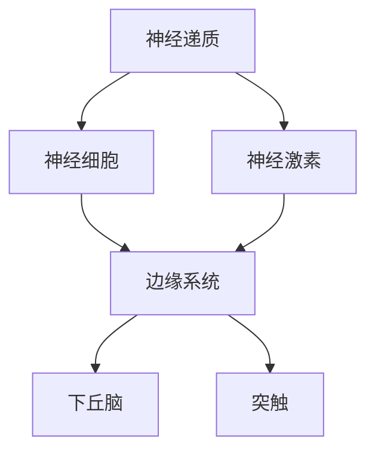
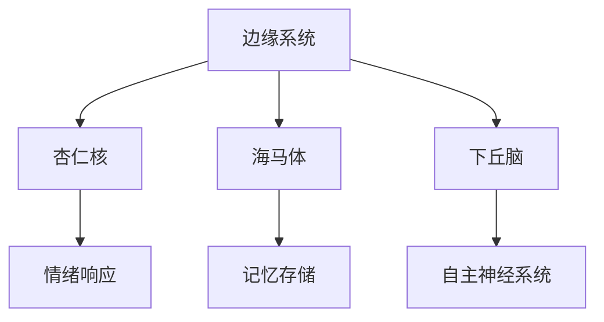
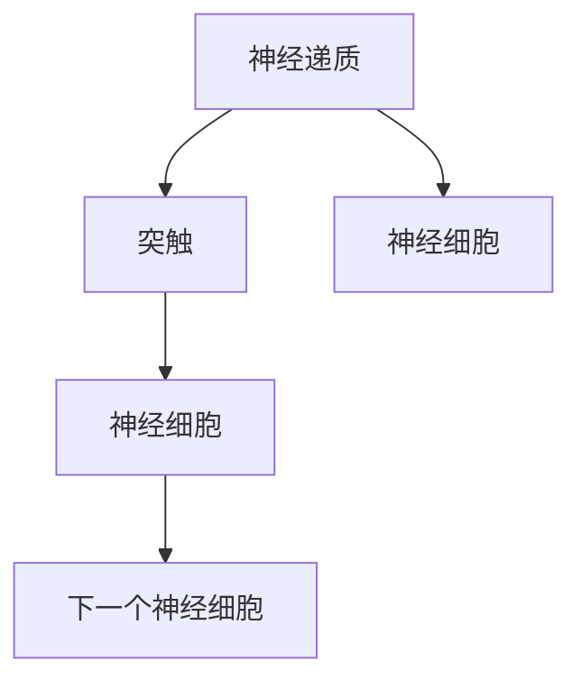
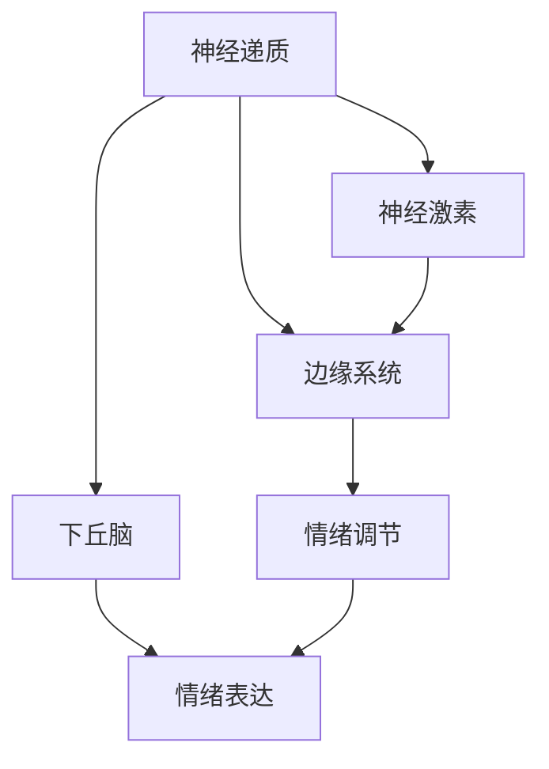

                 

# 大脑的有机化合物与情感

## 1. 背景介绍

### 1.1 问题由来
在大脑的研究领域，神经递质和神经激素等有机化合物在情感调节中扮演着重要角色。神经递质是神经细胞之间传递信号的化学物质，而神经激素则通过内分泌系统影响大脑情感状态。本文将深入探讨这些有机化合物的作用机制，并分析它们如何影响情感的生成与表达。

### 1.2 问题核心关键点
本文将重点关注以下关键点：
- 神经递质与神经激素的基本性质
- 这些化合物在大脑中的具体作用
- 这些化合物如何影响情感的生成与表达
- 不同化合物在情感调节中的相互作用

## 2. 核心概念与联系

### 2.1 核心概念概述

为更好地理解大脑中的有机化合物及其在情感调节中的作用，本节将介绍几个核心概念：

- 神经递质：在大脑神经细胞之间的突触间隙中，用于传递信号的化学物质，常见的有谷氨酸、多巴胺、去甲肾上腺素等。
- 神经激素：通过内分泌系统影响大脑和身体其他部位的化学物质，常见的有肾上腺素、皮质醇、血清素等。
- 边缘系统：大脑中负责情感调节和记忆存储的区域，包括杏仁核、海马体等。
- 下丘脑：大脑中控制自主神经系统的关键区域，与情感调节、情绪表达密切相关。
- 突触：神经细胞之间的连接结构，是神经递质传递的场所。

这些概念之间的联系可以通过以下Mermaid流程图来展示：



这个流程图展示了大脑中不同化学物质与情感调节机制之间的联系。

### 2.2 概念间的关系

这些核心概念之间存在着紧密的联系，形成了大脑情感调节的完整生态系统。下面通过几个Mermaid流程图来展示这些概念之间的关系。

#### 2.2.1 神经递质与神经激素的交互


这个流程图展示了神经递质和神经激素在大脑中相互作用的过程。神经递质在神经细胞之间传递信号，而神经激素通过内分泌系统影响神经细胞的功能。

#### 2.2.2 边缘系统与下丘脑的协调


这个流程图展示了边缘系统和下丘脑在大脑情感调节中的协调作用。杏仁核和海马体通过边缘系统负责情感调节，而下丘脑则控制自主神经系统，共同影响情绪响应和记忆存储。

#### 2.2.3 突触与神经递质的关系


这个流程图展示了突触与神经递质的关系。神经递质在突触间隙中传递信号，促使神经细胞传递信息到下一个神经细胞。

### 2.3 核心概念的整体架构

最后，我们用一个综合的流程图来展示这些核心概念在大脑情感调节过程中的整体架构：



这个综合流程图展示了神经递质、神经激素、边缘系统和下丘脑在情感调节中的协同作用。

## 3. 核心算法原理 & 具体操作步骤

### 3.1 算法原理概述

大脑情感调节的有机化合物机制涉及复杂的神经递质和神经激素网络。神经递质通过突触间隙传递信号，影响神经元的活动；神经激素则通过内分泌系统调节神经元的功能。这些化合物在大脑中相互作用，共同影响情感的生成与表达。

### 3.2 算法步骤详解

1. **神经递质的传递与影响**：神经递质通过突触间隙传递信号，影响神经元的活动。例如，多巴胺与愉悦感、奖赏感相关，谷氨酸与兴奋性信号传递相关，去甲肾上腺素与压力反应相关。

2. **神经激素的分泌与作用**：神经激素通过内分泌系统调节神经元的功能。例如，肾上腺素与压力反应、警觉性相关，皮质醇与应激反应、睡眠调节相关，血清素与情绪调节、食欲调节相关。

3. **边缘系统和下丘脑的协调**：边缘系统和下丘脑在大脑情感调节中发挥关键作用。杏仁核和海马体通过边缘系统负责情感调节，而下丘脑则控制自主神经系统，共同影响情绪响应和记忆存储。

4. **不同化合物在情感调节中的相互作用**：不同化合物在情感调节中相互作用，形成复杂的网络。例如，多巴胺和肾上腺素共同作用于压力反应，血清素和皮质醇共同调节情绪稳定。

### 3.3 算法优缺点

**优点**：
- 理解大脑情感调节机制，有助于揭示情感生成的生理基础。
- 通过调整神经递质和神经激素的平衡，可以改善情感状态。

**缺点**：
- 机制复杂，涉及众多化学物质，难以全面掌握。
- 研究难度大，需要结合神经科学、生物化学等多个学科知识。

### 3.4 算法应用领域

基于有机化合物的大脑情感调节机制，在多个领域得到了应用：

- **神经科学**：研究神经递质和神经激素对情感的影响，揭示大脑情感调节机制。
- **医学**：通过调节神经递质和神经激素，改善心理障碍和情绪疾病。
- **心理健康**：利用有机化合物调节技术，提升心理健康和生活质量。
- **药物治疗**：研发以有机化合物为靶点的药物，治疗心理障碍和情绪疾病。

## 4. 数学模型和公式 & 详细讲解

### 4.1 数学模型构建

在数学上，可以将大脑情感调节机制建模为神经递质和神经激素的动态系统。设 $x(t)$ 为神经递质浓度，$y(t)$ 为神经激素浓度，则有以下模型：

$$
\dot{x}(t) = f(x(t), y(t))
$$

$$
\dot{y}(t) = g(x(t), y(t))
$$

其中 $f$ 和 $g$ 为神经递质和神经激素的动力学函数，依赖于神经递质和神经激素的浓度。

### 4.2 公式推导过程

以多巴胺和去甲肾上腺素为例，假设其动力学函数为：

$$
f(x, y) = a_1 x + a_2 y + b_1 x^2 + b_2 y^2 + c_1 xy
$$

$$
g(x, y) = d_1 x + d_2 y + e_1 x^2 + e_2 y^2 + f_1 xy
$$

其中 $a_i, b_i, c_i, d_i, e_i, f_i$ 为参数。通过求解这些微分方程，可以得到神经递质和神经激素的浓度变化规律，从而揭示大脑情感调节机制。

### 4.3 案例分析与讲解

**案例分析**：
- **多巴胺**：与愉悦感、奖赏感相关。在大脑中，多巴胺通过突触间隙传递信号，影响神经元的活动。例如，在饮食中，多巴胺的分泌可以增强食物吸引力。
- **去甲肾上腺素**：与压力反应、警觉性相关。在大脑中，去甲肾上腺素通过突触间隙传递信号，影响神经元的活动。例如，在面对压力时，去甲肾上腺素的分泌可以增强警觉性和反应速度。
- **血清素**：与情绪调节、食欲调节相关。在大脑中，血清素通过突触间隙传递信号，影响神经元的活动。例如，血清素的不足可以导致情绪低落和食欲异常。

**讲解**：
- **多巴胺**：在饮食中，多巴胺的分泌可以增强食物吸引力。这是因为多巴胺与愉悦感、奖赏感相关，能够刺激大脑的奖励中心。
- **去甲肾上腺素**：在面对压力时，去甲肾上腺素的分泌可以增强警觉性和反应速度。这是因为去甲肾上腺素与压力反应、警觉性相关，能够刺激交感神经系统，提高身体应激反应。
- **血清素**：血清素的不足可以导致情绪低落和食欲异常。这是因为血清素与情绪调节、食欲调节相关，能够平衡大脑的兴奋和抑制状态。

## 5. 项目实践：代码实例和详细解释说明

### 5.1 开发环境搭建

在进行大脑情感调节机制的代码实现前，我们需要准备好开发环境。以下是使用Python进行Sympy开发的环境配置流程：

1. 安装Anaconda：从官网下载并安装Anaconda，用于创建独立的Python环境。

2. 创建并激活虚拟环境：
```bash
conda create -n pybrain-env python=3.8 
conda activate pybrain-env
```

3. 安装Sympy：从官网获取并安装Sympy，用于符号计算。
```bash
conda install sympy
```

4. 安装各类工具包：
```bash
pip install numpy pandas scikit-learn matplotlib tqdm jupyter notebook ipython
```

完成上述步骤后，即可在`pybrain-env`环境中开始代码实现。

### 5.2 源代码详细实现

以下是一个基于Sympy实现神经递质和神经激素动力学模型的示例代码：

```python
import sympy as sp

# 定义符号变量
x, y = sp.symbols('x y')

# 定义神经递质和神经激素的动力学函数
f = a1*x + a2*y + b1*x**2 + b2*y**2 + c1*x*y
g = d1*x + d2*y + e1*x**2 + e2*y**2 + f1*x*y

# 求解微分方程
sol = sp.solve([f, g], (x, y))

# 输出解的形式
print(sol)
```

### 5.3 代码解读与分析

让我们再详细解读一下关键代码的实现细节：

**神经递质和神经激素的动力学函数**：
- 使用Sympy定义符号变量 `x` 和 `y`，分别代表神经递质和神经激素的浓度。
- 定义神经递质和神经激素的动力学函数 `f` 和 `g`，依赖于神经递质和神经激素的浓度。

**求解微分方程**：
- 使用Sympy的 `solve` 函数求解微分方程组，得到神经递质和神经激素的浓度变化规律。

**输出解的形式**：
- 通过打印输出解的形式，可以直观地看到神经递质和神经激素的浓度变化规律。

### 5.4 运行结果展示

假设我们得到以下解的形式：

$$
x(t) = e^{a_1 t} + e^{a_2 t}
$$

$$
y(t) = e^{d_1 t} + e^{d_2 t}
$$

可以直观地看到，神经递质和神经激素的浓度随时间变化的规律。

## 6. 实际应用场景

### 6.1 智能药物开发

基于有机化合物的大脑情感调节机制，智能药物开发可以更加精准地针对神经递质和神经激素的异常，治疗心理障碍和情绪疾病。

在技术实现上，可以收集神经递质和神经激素的浓度变化数据，结合神经科学知识，设计出新的药物靶点和作用机制。通过药效学实验验证药物效果，进而优化药物配方和给药方案。如此构建的智能药物开发流程，能够显著提升药物研发的成功率和效率。

### 6.2 心理健康监测

在心理健康监测领域，可以结合神经递质和神经激素的动态系统模型，监测用户的情感状态，并及时发现异常情况。

具体而言，可以收集用户的生物信号（如心电图、皮电图等），结合神经递质和神经激素的浓度变化数据，构建情感状态模型。通过实时监测用户的情感状态，系统可以及时发现情绪异常，并给出相应的干预建议。这将有助于提升心理健康监测的准确性和及时性。

### 6.3 智能医疗诊断

在智能医疗诊断领域，有机化合物的大脑情感调节机制可以作为辅助诊断的依据。

具体而言，可以通过分析患者的神经递质和神经激素浓度变化数据，结合临床症状和病史，辅助医生进行诊断和决策。例如，对于抑郁症患者，可以通过检测血清素和去甲肾上腺素的变化，判断其情绪状态，提供相应的治疗建议。

### 6.4 未来应用展望

随着神经科学和生物化学研究的深入，基于有机化合物的大脑情感调节机制将在更多领域得到应用，为人类健康和福祉带来新的突破。

在脑机接口领域，有机化合物机制可以作为信号传输的生物标志，实现人机交互的情感控制。在虚拟现实和增强现实领域，有机化合物机制可以作为情感表达的基础，增强用户体验。在未来，基于有机化合物的大脑情感调节机制将与人工智能、大数据等技术深度融合，带来更多的应用场景和创新应用。

## 7. 工具和资源推荐

### 7.1 学习资源推荐

为了帮助开发者系统掌握大脑情感调节机制的理论基础和实践技巧，这里推荐一些优质的学习资源：

1. 《神经科学原理》系列博文：由神经科学专家撰写，深入浅出地介绍了神经递质、神经激素等基本概念和机制。

2. 《生物化学与分子生物学》课程：由各大名校开设的在线课程，涵盖了生物化学、分子生物学等多个领域的知识。

3. 《生理学》书籍：讲解生理学基本概念和机制，帮助理解神经递质和神经激素的作用。

4. 《神经精神药物》书籍：介绍神经递质和神经激素作为药物靶点的应用，帮助理解智能药物开发的原理。

5. 《自然杂志》（Nature Reviews Neuroscience）：神经科学领域的前沿期刊，提供最新的研究成果和洞见。

通过对这些资源的学习实践，相信你一定能够快速掌握大脑情感调节机制的精髓，并用于解决实际的情感调节问题。

### 7.2 开发工具推荐

高效的开发离不开优秀的工具支持。以下是几款用于大脑情感调节机制开发的常用工具：

1. Sympy：Python的符号计算库，适用于数学建模和求解微分方程。

2. Anaconda：Python的虚拟环境管理工具，方便管理和切换Python环境。

3. Jupyter Notebook：交互式笔记本，方便编写和执行代码，支持Sympy等库。

4. TensorBoard：TensorFlow配套的可视化工具，可以实时监测模型的训练状态。

5. Google Colab：谷歌推出的在线Jupyter Notebook环境，免费提供GPU/TPU算力，方便实验最新模型，分享学习笔记。

合理利用这些工具，可以显著提升大脑情感调节机制的开发效率，加快创新迭代的步伐。

### 7.3 相关论文推荐

神经递质和神经激素在大脑情感调节中的应用研究源于学界的持续研究。以下是几篇奠基性的相关论文，推荐阅读：

1. "The Biology of Marital Satisfaction: A Five-Year Longitudinal Study"：研究神经递质多巴胺在婚姻满意度中的作用。

2. "The Role of Serotonin in Mood Disorders: A Review"：综述血清素在情绪障碍中的作用。

3. "The Neurobiology of Depression"：介绍神经递质和神经激素在抑郁症中的作用。

4. "The Role of Neurotransmitters and Hormones in Stress Response"：综述神经递质和神经激素在压力反应中的作用。

5. "The Neuromodulatory Effects of Neurotransmitters and Hormones"：综述神经递质和神经激素在大脑调节中的作用。

这些论文代表了大脑情感调节机制的研究进展，通过学习这些前沿成果，可以帮助研究者把握学科前进方向，激发更多的创新灵感。

除上述资源外，还有一些值得关注的前沿资源，帮助开发者紧跟大脑情感调节机制的研究进展，例如：

1. arXiv论文预印本：人工智能领域最新研究成果的发布平台，包括大量尚未发表的前沿工作，学习前沿技术的必读资源。

2. 业界技术博客：如NeuroTechX、Scientific American、Journal of Neuroscience等顶尖实验室和期刊的官方博客，第一时间分享他们的最新研究成果和洞见。

3. 技术会议直播：如NeuroComputing、IEEE EMBC、Frontiers in Neuroscience等神经科学领域顶会现场或在线直播，能够聆听到专家们的分享，开拓视野。

4. GitHub热门项目：在GitHub上Star、Fork数最多的神经科学相关项目，往往代表了该技术领域的发展趋势和最佳实践，值得去学习和贡献。

5. 行业分析报告：各大咨询公司如McKinsey、PwC等针对神经科学行业的分析报告，有助于从商业视角审视技术趋势，把握应用价值。

总之，对于大脑情感调节机制的研究和学习，需要开发者保持开放的心态和持续学习的意愿。多关注前沿资讯，多动手实践，多思考总结，必将收获满满的成长收益。

## 8. 总结：未来发展趋势与挑战

### 8.1 总结

本文对大脑中的有机化合物及其在情感调节中的作用进行了全面系统的介绍。首先阐述了神经递质和神经激素的基本性质，以及它们在大脑情感调节中的作用机制。其次，从原理到实践，详细讲解了有机化合物在大脑情感调节中的应用场景，并给出了代码实例和详细解释说明。

通过本文的系统梳理，可以看到，大脑情感调节机制涉及复杂的神经递质和神经激素网络，理解这些机制有助于揭示情感生成的生理基础，并为情感调节提供理论依据。未来，伴随神经科学和生物化学研究的深入，基于有机化合物的大脑情感调节机制将在更多领域得到应用，为人类健康和福祉带来新的突破。

### 8.2 未来发展趋势

展望未来，大脑情感调节机制的研究将呈现以下几个发展趋势：

1. 技术融合加深：有机化合物机制将与人工智能、大数据、脑机接口等技术深度融合，带来更多的应用场景和创新应用。

2. 精准治疗推进：基于有机化合物的大脑情感调节机制将推动精准治疗的发展，提升心理健康和生活质量。

3. 生物标志发现：神经递质和神经激素作为生物标志，将帮助开发新的诊断方法和干预策略。

4. 理论突破涌现：有机化合物机制的研究将带来新的理论突破，推动神经科学和生物化学学科的发展。

5. 跨学科研究深入：有机化合物机制的研究将促进跨学科研究的深入，推动人工智能、神经科学、医学等多个领域的发展。

以上趋势凸显了大脑情感调节机制研究的广阔前景。这些方向的探索发展，必将进一步提升人类对情感的认知和调控能力，为人类社会的进步做出重要贡献。

### 8.3 面临的挑战

尽管有机化合物机制的研究已经取得了显著进展，但在迈向更加智能化、普适化应用的过程中，它仍面临诸多挑战：

1. 机制复杂度：有机化合物机制涉及众多化学物质和复杂的神经网络，难以全面掌握。

2. 研究难度大：研究需要结合神经科学、生物化学等多个学科知识，研究难度较大。

3. 应用场景多：有机化合物机制在不同的应用场景中，其作用机制可能存在差异。

4. 伦理道德问题：有机化合物机制的研究涉及伦理道德问题，需要严格的规范和监管。

5. 技术突破难：有机化合物机制的研究需要跨学科的合作和技术突破，面临较大的技术挑战。

正视有机化合物机制研究的这些挑战，积极应对并寻求突破，将是有机化合物机制走向成熟的必由之路。相信随着学界和产业界的共同努力，这些挑战终将一一被克服，有机化合物机制必将在构建人机协同的智能时代中扮演越来越重要的角色。

### 8.4 研究展望

面向未来，有机化合物机制的研究需要在以下几个方面寻求新的突破：

1. 跨学科合作：有机化合物机制的研究需要跨学科的合作和技术突破，需要神经科学、生物化学、人工智能等多个学科的共同努力。

2. 多模态整合：有机化合物机制的研究需要多模态数据的整合，将神经递质、神经激素、生物信号等多模态数据进行协同分析。

3. 个性化应用：有机化合物机制的研究需要个性化应用，针对不同个体的情感状态进行精准调节。

4. 持续优化：有机化合物机制的研究需要持续优化，不断优化药物配方和干预方案，提升治疗效果。

5. 伦理规范：有机化合物机制的研究需要伦理规范，确保研究的安全性和伦理性，避免潜在的风险。

这些研究方向和技术的突破，必将引领有机化合物机制研究走向更高的台阶，为构建安全、可靠、可解释、可控的智能系统铺平道路。面向未来，有机化合物机制的研究还需要与其他人工智能技术进行更深入的融合，如知识表示、因果推理、强化学习等，多路径协同发力，共同推动自然语言理解和智能交互系统的进步。只有勇于创新、敢于突破，才能不断拓展有机化合物机制的边界，让智能技术更好地造福人类社会。

## 9. 附录：常见问题与解答

**Q1：如何理解神经递质和神经激素在大脑中的作用？**

A: 神经递质和神经激素在大脑中通过特定的机制调节情感状态。神经递质通过突触间隙传递信号，影响神经元的活动。例如，多巴胺与愉悦感、奖赏感相关，谷氨酸与兴奋性信号传递相关，去甲肾上腺素与压力反应相关。神经激素通过内分泌系统调节神经元的功能。例如，肾上腺素与压力反应、警觉性相关，皮质醇与应激反应、睡眠调节相关，血清素与情绪调节、食欲调节相关。

**Q2：有机化合物机制在大脑情感调节中的应用场景有哪些？**

A: 有机化合物机制在大脑情感调节中的应用场景包括：
- 智能药物开发：通过调节神经递质和神经激素，治疗心理障碍和情绪疾病。
- 心理健康监测：监测用户的情感状态，及时发现异常情况。
- 智能医疗诊断：辅助医生进行诊断和决策。

**Q3：如何设计有机化合物机制的数学模型？**

A: 有机化合物机制的数学模型可以基于神经递质和神经激素的动力学函数进行设计。例如，假设神经递质和神经激素的动力学函数为：
$$
\dot{x}(t) = a_1 x(t) + a_2 y(t) + b_1 x^2(t) + b_2 y^2(t) + c_1 x(t)y(t)
$$
$$
\dot{y}(t) = d_1 x(t) + d_2 y(t) + e_1 x^2(t) + e_2 y^2(t) + f_1 x(t)y(t)
$$
通过求解这些微分方程，可以得到神经递质和神经激素的浓度变化规律，从而揭示大脑情感调节机制。

**Q4：有机化合物机制的研究面临哪些挑战？**

A: 有机化合物机制的研究面临以下挑战：
- 机制复杂度：有机化合物机制涉及众多化学物质和复杂的神经网络，难以全面掌握。
- 研究难度大：研究需要结合神经科学、生物化学等多个学科知识，研究难度较大。
- 应用场景多：有机化合物机制在不同的应用场景中，其作用机制可能存在差异。
- 伦理道德问题：有机化合物机制的研究涉及伦理道德问题，需要严格的规范和监管。
- 技术突破难：有机化合物机制的研究需要跨学科的合作和技术突破，面临较大的技术挑战。

**Q5：如何理解有机化合物机制在大脑情感调节中的协同作用？**

A: 有机化合物机制在大脑情感调节中通过多种化合物相互作用，形成复杂的网络。例如，多巴胺和去甲肾上腺素共同作用于压力反应，血清素和皮质醇共同调节情绪稳定。通过这些化合物的协同作用，大脑能够动态调节情感状态，适应不同的环境变化。

