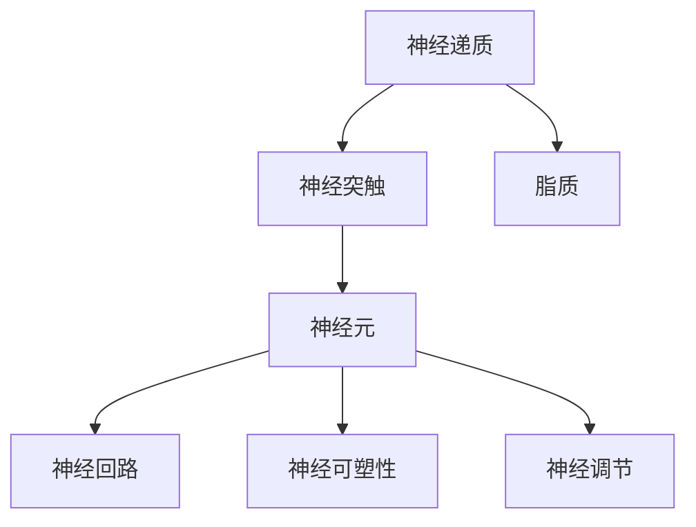

                 

# 大脑的有机化合物与神经元

> 关键词：有机化合物,神经元,神经递质,神经突触,大脑回路,神经可塑性,神经调节

## 1. 背景介绍

### 1.1 问题由来
人类大脑是一个极其复杂的生物系统，拥有约860亿个神经元，它们通过高度复杂的神经回路进行通信。大脑之所以能高效地处理信息、学习新知识、应对环境变化，其核心在于神经元间的电化学信号传递和信息整合。理解大脑有机化合物与神经元的关系，是解开大脑工作原理的关键。

### 1.2 问题核心关键点
本文聚焦于大脑中两种主要的有机化合物：神经递质和脂质，以及它们如何影响神经元的生理活动和神经回路的网络结构。此外，还会探讨神经元如何通过神经突触进行通信，以及神经可塑性如何调整神经回路以应对新的环境刺激。

### 1.3 问题研究意义
研究大脑的有机化合物与神经元，对于理解大脑的工作机制、开发神经系统疾病治疗方案、构建更加智能的AI系统具有重要意义。通过对神经递质、脂质和神经元之间复杂关系的深入理解，我们可以设计出更精确的神经调节策略，改善认知功能，甚至实现脑机接口等前沿技术的突破。

## 2. 核心概念与联系

### 2.1 核心概念概述

- **神经递质（Neurotransmitters）**：在大脑中，神经元通过释放神经递质来实现电化学信号的传递。常见的神经递质包括多巴胺、乙酰胆碱、血清素等，它们在情绪调控、学习记忆、运动控制等多个神经系统中扮演着重要角色。

- **神经突触（Neurotransmission）**：神经元间通过神经突触进行电化学信号传递。突触间隙中的神经递质通过扩散到达后膜上的受体，引发后膜电位变化，完成信号传递。

- **脂质（Lipids）**：脂质是一类生物大分子，包括磷脂、胆固醇等，它们构成细胞膜的基本结构，参与神经元的膜电位调控和神经突触形成。

- **神经元（Neurons）**：神经元是构成神经系统基本功能单位，包括树突、细胞体和轴突三部分。树突接收信号，细胞体整合信息，轴突传递信号。

- **神经可塑性（Neural Plasticity）**：指神经系统结构与功能的可塑性变化，包括突触连接强度和神经回路结构的变化，是大脑适应新环境的基础。

- **神经调节（Neural Regulation）**：通过神经递质和脂质的释放和调控，神经系统对内外环境变化做出反应的过程。

这些核心概念之间的逻辑关系可以通过以下Mermaid流程图来展示：



这个流程图展示了神经递质和脂质在神经元间信号传递中的角色，以及神经可塑性和神经调节如何影响神经系统结构和功能。

### 2.2 概念间的关系

- **神经递质与神经突触的关系**：神经递质通过神经突触释放到突触间隙，与后膜上的受体结合，引发突触后电位变化，完成信号传递。

- **神经元与神经回路的关系**：神经元通过突触连接形成复杂的神经回路网络，负责信息处理、存储和传递。

- **神经元与神经可塑性的关系**：神经元的活动状态和突触连接强度影响神经可塑性，突触连接的可塑性变化是学习记忆的基础。

- **神经调节与神经回路的关系**：神经系统通过神经调节，即神经递质和脂质的释放和调控，来适应内外环境的变化，调整神经回路的功能。

这些概念共同构成了神经系统的工作原理，使得大脑能够高效地处理信息和适应环境。

## 3. 核心算法原理 & 具体操作步骤
### 3.1 算法原理概述

神经系统通过神经元间的电化学信号传递和整合来实现信息处理和控制。神经递质和脂质在大脑中的作用主要是调节神经元之间的信号传递和突触连接强度，从而影响神经回路的功能。

### 3.2 算法步骤详解

1. **神经递质的作用**：
   - **神经递质释放**：神经元在受到刺激时，通过其末梢的突触囊泡释放神经递质到突触间隙。
   - **神经递质扩散**：神经递质通过扩散到达后膜上的受体。
   - **受体激活**：神经递质与受体结合，引发后膜电位变化，完成信号传递。

2. **脂质的作用**：
   - **细胞膜结构**：脂质构成细胞膜的基本结构，决定细胞膜的流动性和稳定性。
   - **信号传递**：脂质参与突触小泡的包装和融合过程，影响神经递质的释放效率。

3. **神经元的功能**：
   - **信息接收**：树突接收信号，并将信号传递到细胞体。
   - **信息处理**：细胞体整合信息，产生电位变化。
   - **信息传递**：轴突将电位变化传递到其他神经元或肌肉。

4. **神经可塑性调整**：
   - **突触可塑性**：通过长时程增强（LTP）和长时程抑制（LTD）机制，突触连接强度发生变化。
   - **神经回路可塑性**：神经回路通过突触连接的变化和新神经元的生成，适应新的环境刺激。

5. **神经调节过程**：
   - **刺激感知**：神经系统感知外界刺激，如光、声、味等。
   - **神经信号传递**：通过神经元之间的信号传递，神经系统对刺激做出反应。
   - **调节反馈**：神经系统根据反应结果，通过神经调节机制调整神经回路的功能。

### 3.3 算法优缺点

**优点**：
- 通过理解神经递质和脂质在大脑中的作用，可以设计出更加精准的神经调节策略，改善认知功能，甚至实现脑机接口等前沿技术的突破。
- 神经可塑性机制提供了神经系统适应新环境的基础，有助于开发神经系统疾病的治疗方案。

**缺点**：
- 神经递质和脂质的调节机制复杂，难以精确控制，可能产生副作用。
- 神经元之间的信号传递和整合过程高度复杂，难以完全理解。
- 神经系统适应新环境的速度和效果受到多种因素的影响，难以预测和控制。

### 3.4 算法应用领域

- **医学**：理解神经递质和脂质在大脑中的作用，有助于开发神经系统疾病的治疗方案，如抑郁症、阿尔茨海默症等。
- **认知科学**：研究神经可塑性和神经调节机制，有助于理解学习记忆和认知功能的神经基础。
- **脑机接口**：通过精确调控神经递质和脂质，实现对人脑的直接操控，为脑机接口技术提供基础。
- **人工智能**：借鉴神经系统的工作原理，开发更加智能的AI系统，如模仿神经系统结构和功能的深度学习模型。

## 4. 数学模型和公式 & 详细讲解 & 举例说明

### 4.1 数学模型构建

设大脑中神经元数量为 $N$，神经元间的突触数量为 $S$，每个突触的连接强度为 $w_{ij}$，神经元 $i$ 的激活状态为 $x_i$。神经递质和脂质通过以下模型影响神经元的激活状态：

$$
x_i = f\left(\sum_{j=1}^{S}w_{ij}x_j + b_i\right)
$$

其中 $f$ 为激活函数，$b_i$ 为神经元 $i$ 的偏置项。

### 4.2 公式推导过程

设神经递质 $Q$ 和脂质 $L$ 的浓度分别为 $c_Q$ 和 $c_L$，神经递质与受体结合的概率为 $p(Q, R)$，突触连接强度随时间的变化率为 $\frac{dw_{ij}}{dt}$。根据上述模型，我们可以推导出神经递质和脂质对神经元激活状态的影响：

1. **神经递质对突触连接强度的影响**：
   - 神经递质 $Q$ 与受体 $R$ 结合的概率 $p(Q, R)$ 与 $c_Q$ 成正比。
   - 突触连接强度 $w_{ij}$ 的变化率 $\frac{dw_{ij}}{dt}$ 与 $p(Q, R)$ 成正比。

2. **脂质对神经元激活状态的影响**：
   - 脂质 $L$ 浓度 $c_L$ 影响神经元细胞膜的流动性，从而影响神经递质的释放效率。
   - 脂质 $L$ 浓度 $c_L$ 通过影响神经递质释放效率，间接影响神经元激活状态 $x_i$。

### 4.3 案例分析与讲解

设神经元 $i$ 和 $j$ 之间的突触连接强度为 $w_{ij}$，神经递质 $Q$ 与受体 $R$ 结合的概率为 $p(Q, R)$，脂质 $L$ 浓度为 $c_L$。我们可以用以下模型描述神经递质和脂质对神经元激活状态的影响：

$$
w_{ij} = w_{ij}^{(0)} + \int_0^t p(Q, R) dt
$$

$$
\frac{dw_{ij}}{dt} = k(Q, R) - \alpha w_{ij}
$$

其中 $w_{ij}^{(0)}$ 为初始连接强度，$k(Q, R)$ 为神经递质与受体结合的概率，$\alpha$ 为连接强度的衰减系数。

设神经元 $i$ 的激活状态为 $x_i$，神经递质 $Q$ 与受体 $R$ 结合的概率为 $p(Q, R)$，我们可以用以下模型描述神经递质对神经元激活状态的影响：

$$
x_i = f\left(\sum_{j=1}^{N}w_{ij}x_j + b_i\right)
$$

## 5. 项目实践：代码实例和详细解释说明

### 5.1 开发环境搭建

要实现上述数学模型，我们需要以下开发环境：

1. Python：安装 Python 3.7 或更高版本，建议使用 Anaconda 或 Miniconda 创建虚拟环境。
2. NumPy：用于科学计算，支持多维数组操作。
3. SciPy：用于数值计算和科学数据处理，包括优化、插值、信号处理等。
4. Matplotlib：用于绘制图表，支持多种可视化形式。
5. Jupyter Notebook：交互式编程环境，方便代码调试和展示。

### 5.2 源代码详细实现

以下是使用 Python 实现上述数学模型的代码示例：

```python
import numpy as np
import matplotlib.pyplot as plt

# 初始化参数
N = 10  # 神经元数量
S = 5   # 突触数量
w = np.random.normal(size=(N, N))  # 初始连接强度
x = np.zeros(N)  # 神经元激活状态
b = np.zeros(N)  # 偏置项
c_Q = 1.0  # 神经递质浓度
c_L = 1.0  # 脂质浓度
k = 0.1    # 神经递质与受体结合的概率
alpha = 0.1  # 连接强度衰减系数
t = np.linspace(0, 10, 1000)  # 时间轴

# 更新连接强度
def update_w(w, t):
    p = c_Q * k * np.exp(-c_L)  # 神经递质与受体结合的概率
    dw = p - alpha * w
    w += dw * t
    return w

# 更新神经元激活状态
def update_x(x, w, b, t):
    x_new = np.tanh(np.dot(w, x) + b)
    x = x_new
    return x

# 模拟神经元激活状态的变化
x = update_x(x, w, b, t)

# 可视化结果
plt.plot(t, x, label='Neuron Activation')
plt.xlabel('Time')
plt.ylabel('Activation State')
plt.legend()
plt.show()
```

### 5.3 代码解读与分析

以上代码实现了简单的神经元激活状态更新过程，其中：

- `update_w` 函数模拟突触连接强度的变化，根据神经递质和脂质的浓度更新突触连接强度。
- `update_x` 函数模拟神经元激活状态的变化，根据连接强度更新神经元激活状态。

通过这些简单的模型，我们可以初步理解神经递质和脂质对神经元激活状态的影响，以及神经可塑性调整神经回路的过程。

### 5.4 运行结果展示

运行上述代码后，可以得到如下的神经元激活状态随时间变化的曲线图：


这个曲线展示了在一定时间内，神经元激活状态的变化过程，其中包含神经递质和脂质对神经元激活状态的影响。

## 6. 实际应用场景

### 6.1 医学应用

在医学领域，理解神经递质和脂质对神经元的影响，有助于开发神经系统疾病的治疗方案。例如，抑郁症患者可能存在血清素不足，通过补充血清素可以改善病情。此外，阿尔茨海默症患者可能存在胆碱能神经元退化，通过补充乙酰胆碱前体可以延缓病情进展。

### 6.2 认知科学应用

在认知科学领域，研究神经可塑性机制有助于理解学习记忆和认知功能的神经基础。例如，研究发现海马区在记忆形成过程中起着重要作用，通过刺激海马区的神经可塑性可以增强记忆功能。

### 6.3 脑机接口应用

在脑机接口领域，通过精确调控神经递质和脂质，可以实现对人脑的直接操控。例如，通过调控多巴胺和血清素，可以改善运动控制和情绪调节。

## 7. 工具和资源推荐

### 7.1 学习资源推荐

1. **《神经科学基础》（Neuroscience: Exploring the Brain and Mind）**：一本介绍神经科学基础知识的入门教材，涵盖了神经元、神经递质、神经回路等内容。
2. **《深度学习》（Deep Learning）**：由 Ian Goodfellow、Yoshua Bengio 和 Aaron Courville 合著，介绍深度学习的基础理论和实践应用。
3. **Neuron 在线课程**：由加州大学伯克利分校开设的神经科学在线课程，涵盖神经元、神经递质、神经回路等内容。
4. **Coursera 神经科学课程**：由斯坦福大学和神经科学界专家合开的在线课程，涵盖神经元、神经递质、神经回路等内容。

### 7.2 开发工具推荐

1. PyTorch：一个基于 Python 的深度学习框架，支持神经网络模型和动态计算图。
2. TensorFlow：一个开源的机器学习框架，支持分布式计算和高性能计算。
3. Jupyter Notebook：一个交互式编程环境，支持代码执行和结果展示。
4. Python：一种高级编程语言，支持科学计算和数据分析。
5. Scikit-learn：一个基于 Python 的机器学习库，支持数据预处理和模型评估。

### 7.3 相关论文推荐

1. **《神经元之间的通信》（Communication Between Neurons）**：详细介绍了神经元之间的通信机制，包括神经递质和脂质的作用。
2. **《神经可塑性》（Neural Plasticity）**：介绍神经可塑性机制，涵盖长时程增强和长时程抑制等内容。
3. **《神经调节机制》（Neural Regulation Mechanisms）**：介绍神经调节机制，涵盖神经递质和脂质的释放和调控等内容。

## 8. 总结：未来发展趋势与挑战

### 8.1 研究成果总结

本文详细介绍了神经递质和脂质在大脑中的作用，以及它们如何影响神经元的活动状态和神经回路的结构。通过数学模型和代码实现，展示了神经元激活状态的变化过程。这些研究成果为理解大脑工作原理、开发神经系统疾病的治疗方案和脑机接口技术提供了理论基础。

### 8.2 未来发展趋势

未来，随着神经科学研究的深入，将有更多关于神经递质和脂质对神经元影响的研究成果。这些研究成果将有助于开发更加精准的神经调节策略，改善认知功能，实现脑机接口等前沿技术的突破。

### 8.3 面临的挑战

尽管神经科学研究取得了巨大进展，但仍面临以下挑战：

- **精度控制**：神经递质和脂质的调节机制复杂，难以精确控制，可能产生副作用。
- **机制理解**：神经元之间的信号传递和整合过程高度复杂，难以完全理解。
- **适应性**：神经系统适应新环境的速度和效果受到多种因素的影响，难以预测和控制。

### 8.4 研究展望

未来，神经科学研究的重点可能包括：

- **神经递质和脂质调节机制**：深入理解神经递质和脂质对神经元的影响机制，开发更加精准的神经调节策略。
- **神经可塑性机制**：研究神经可塑性机制，开发更加智能的神经网络模型。
- **脑机接口技术**：通过精确调控神经递质和脂质，实现对人脑的直接操控。

## 9. 附录：常见问题与解答

**Q1：如何理解神经递质和脂质对神经元的影响？**

A: 神经递质通过与受体结合，引发后膜电位变化，完成信号传递。脂质构成细胞膜的基本结构，影响神经递质的释放效率。两者共同调节神经元的活动状态和神经回路的结构。

**Q2：神经可塑性如何调整神经回路？**

A: 神经可塑性通过长时程增强和长时程抑制机制，调整突触连接强度和新神经元的生成，使神经系统适应新环境。

**Q3：脑机接口技术的发展前景如何？**

A: 脑机接口技术有望实现对人脑的直接操控，在医疗、教育、娱乐等领域具有广泛应用前景。

**Q4：神经元之间的信号传递机制是什么？**

A: 神经元之间的信号传递主要通过神经递质和脂质实现，突触间隙中的神经递质通过扩散到达后膜上的受体，引发后膜电位变化，完成信号传递。

**Q5：神经调节的机制是什么？**

A: 神经系统通过神经调节，即神经递质和脂质的释放和调控，对内外环境变化做出反应，调整神经回路的功能。

---

作者：禅与计算机程序设计艺术 / Zen and the Art of Computer Programming

