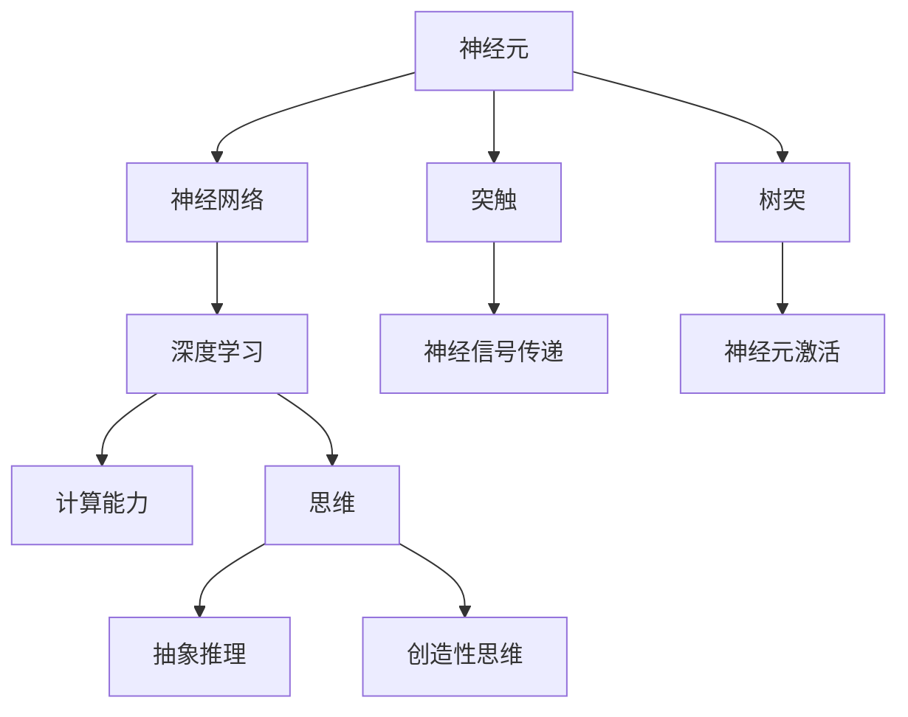
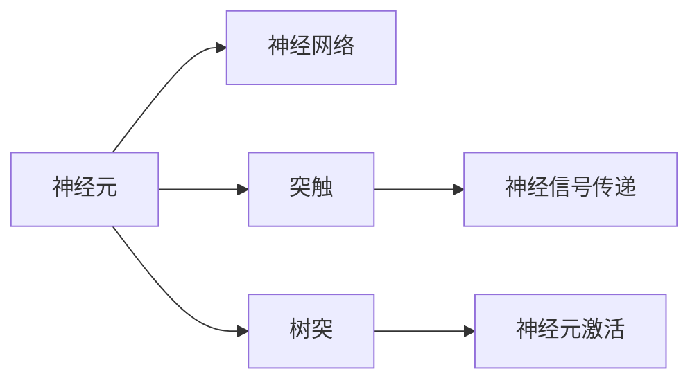
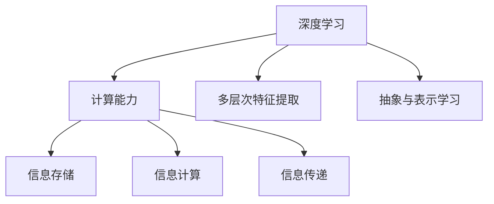
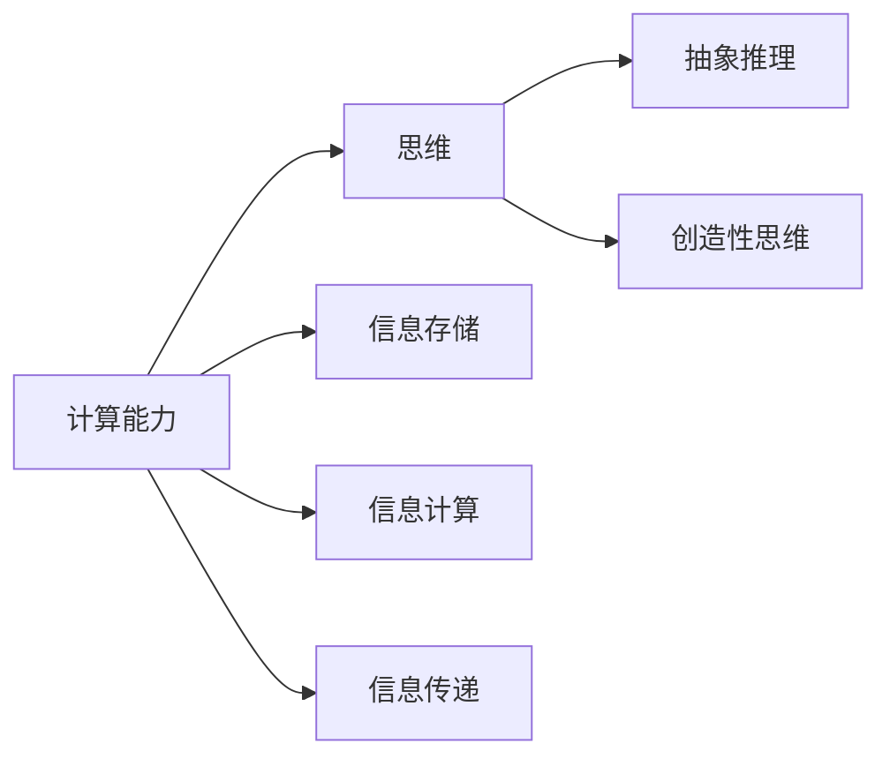
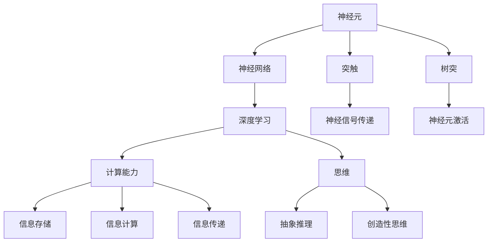

                 

# 大脑：物质变成思维的奇迹

> 关键词：大脑, 神经元, 神经网络, 深度学习, 人工智能, 计算能力, 思维

## 1. 背景介绍

### 1.1 问题由来
人类大脑是一种极其复杂而神秘的器官，它通过亿万神经元的协同工作，实现了高度复杂的认知功能，如语言理解、视觉识别、决策制定等。理解大脑的工作原理，不仅具有重要的理论价值，也为人工智能的发展提供了重要的借鉴。

近年来，随着深度学习技术的迅速发展，人工智能领域出现了大量的类大脑结构模型，试图模拟人类大脑的复杂结构和功能。这些模型在图像识别、语音识别、自然语言处理等任务上取得了显著成效。

然而，当前的人工智能系统仍然无法与人类大脑相提并论。人类大脑不仅能理解语言的深层含义，还能通过抽象和推理，进行创造性思维。此外，人类大脑具有极强的适应性和灵活性，能够在各种复杂环境下高效工作。

因此，深入理解大脑的原理，特别是思维过程，对于提升人工智能系统的智能水平具有重要意义。

### 1.2 问题核心关键点
核心关键点在于如何模拟大脑的思维过程，实现更高层次的智能。本文将从神经元的工作机制入手，通过对比当前的人工神经网络模型，探讨如何进一步提升其计算能力和智能水平。

## 2. 核心概念与联系

### 2.1 核心概念概述

为更好地理解大脑的工作原理，本节将介绍几个密切相关的核心概念：

- 神经元(Neuron)：大脑的基本单位，通过电信号传递信息，实现复杂的计算和推理。
- 神经网络(Neural Network)：通过大量神经元的连接，实现复杂计算和信息传递的人工智能模型。
- 深度学习(Deep Learning)：一种基于神经网络的机器学习方法，通过多层次的特征提取和抽象，提升模型的智能水平。
- 计算能力(Computational Capability)：指模型处理和推理信息的能力，包括信息的存储、计算和传递效率。
- 思维(Thought)：指人类大脑通过抽象、推理和创造性思维实现复杂认知过程的能力。

这些核心概念之间的逻辑关系可以通过以下Mermaid流程图来展示：



这个流程图展示了神经元、神经网络、深度学习、计算能力和思维之间的联系：

1. 神经元通过突触传递电信号，构成神经网络。
2. 深度学习通过多层次的特征提取和抽象，提升神经网络的计算能力。
3. 计算能力是实现思维的基础，包括信息的存储、计算和传递效率。
4. 思维是通过抽象、推理和创造性思维实现复杂认知过程的能力。

这些概念共同构成了大脑和人工智能系统的工作框架，帮助我们更好地理解其原理和结构。

### 2.2 概念间的关系

这些核心概念之间存在着紧密的联系，形成了大脑和人工智能系统的工作生态系统。下面我通过几个Mermaid流程图来展示这些概念之间的关系。

#### 2.2.1 神经元和神经网络的关系



这个流程图展示了神经元如何通过突触和树突构成神经网络，实现信息的传递和计算。

#### 2.2.2 深度学习和计算能力的关系



这个流程图展示了深度学习如何通过多层次的特征提取和抽象，提升计算能力。

#### 2.2.3 思维和计算能力的关系



这个流程图展示了计算能力如何支撑思维过程，包括信息的存储、计算和传递效率。

### 2.3 核心概念的整体架构

最后，我们用一个综合的流程图来展示这些核心概念在大脑和人工智能系统中的整体架构：



这个综合流程图展示了从神经元到思维的整个计算过程，强调了计算能力在其中的核心作用。通过理解这些概念及其相互关系，我们可以更好地把握大脑和人工智能系统的计算原理和结构。

## 3. 核心算法原理 & 具体操作步骤
### 3.1 算法原理概述

深度学习模型通过大量神经元的连接，实现复杂计算和信息传递。在深度学习中，神经网络由多个层次构成，每个层次提取不同的抽象特征，并通过前向传播和反向传播算法进行计算和参数更新。

其中，前向传播算法将输入数据通过神经网络进行特征提取和计算，得到输出结果。反向传播算法则根据输出结果和真实标签计算误差，并通过链式法则反向传播，更新模型参数。

神经网络中的神经元通过突触传递电信号，构成神经网络。神经元的激活函数（如ReLU、Sigmoid等）用于计算神经元的输出值。神经元通过突触连接的权重参数调整，实现信息传递和计算。

深度学习模型的计算能力取决于多个因素，包括神经元的数量、层次结构、激活函数和优化算法等。通过合理设计神经网络的层次结构和参数，可以显著提升模型的计算能力，从而实现更高的智能水平。

### 3.2 算法步骤详解

深度学习模型的训练过程包括以下几个关键步骤：

**Step 1: 数据准备**

- 收集标注数据，划分为训练集、验证集和测试集。
- 对数据进行预处理，包括归一化、数据增强等操作。

**Step 2: 模型初始化**

- 定义神经网络的结构，包括层数、神经元数量、激活函数等。
- 初始化神经元权重和偏置参数。

**Step 3: 前向传播**

- 将输入数据通过神经网络进行前向传播，得到预测结果。

**Step 4: 损失计算**

- 根据预测结果和真实标签计算损失函数。

**Step 5: 反向传播**

- 使用反向传播算法计算每个神经元对损失函数的贡献。
- 根据链式法则计算梯度，更新权重和偏置参数。

**Step 6: 参数更新**

- 根据梯度更新神经元权重和偏置参数，使用优化算法（如Adam、SGD等）进行参数更新。

**Step 7: 模型评估**

- 在测试集上评估模型性能，评估指标包括准确率、召回率、F1分数等。

**Step 8: 模型部署**

- 将训练好的模型保存到文件，部署到实际应用中。

通过上述步骤，我们可以实现深度学习模型的训练和部署，利用其强大的计算能力，解决实际问题。

### 3.3 算法优缺点

深度学习模型在许多领域中取得了显著成效，但也存在一些不足之处：

优点：

1. 强大的计算能力：通过多层次的特征提取和抽象，深度学习模型可以处理复杂的数据结构，实现高精度的计算和推理。
2. 自适应学习：深度学习模型能够通过大量数据进行自适应学习，无需手动设计特征工程。
3. 鲁棒性强：深度学习模型具有良好的泛化能力，对新数据和新任务的适应性较强。

缺点：

1. 数据需求高：深度学习模型需要大量标注数据进行训练，数据获取成本高，数据质量对模型性能影响大。
2. 模型复杂度高：深度学习模型结构复杂，参数数量庞大，训练和推理过程耗时较长。
3. 可解释性差：深度学习模型的决策过程难以解释，难以进行调试和优化。

尽管存在这些缺点，但深度学习模型的优点仍然使其在许多领域中大放异彩。未来，随着数据和算力技术的进步，深度学习模型的缺点也将逐步得到解决，其应用前景将更加广阔。

### 3.4 算法应用领域

深度学习模型在许多领域中已经得到了广泛应用，包括但不限于以下几个方面：

- 图像识别：如人脸识别、物体检测等。通过卷积神经网络（CNN）实现图像特征的提取和分类。
- 自然语言处理：如机器翻译、情感分析、问答系统等。通过循环神经网络（RNN）、注意力机制等实现文本信息的处理和推理。
- 语音识别：如语音合成、语音识别等。通过深度学习模型实现语音信号的特征提取和处理。
- 推荐系统：如电商推荐、音乐推荐等。通过协同过滤、矩阵分解等方法，实现用户的个性化推荐。
- 自动驾驶：如目标检测、车道保持等。通过深度学习模型实现对环境信息的感知和决策。

除此之外，深度学习模型还在医学、金融、游戏等领域得到了广泛应用，为各行各业带来了新的变革和机遇。

## 4. 数学模型和公式 & 详细讲解  
### 4.1 数学模型构建

深度学习模型通常由多层神经网络构成，每层神经元之间通过权重参数相连。假设神经网络包含$n$个神经元，每个神经元的输入和输出分别为$x$和$a$，神经元之间的连接权重为$w$，激活函数为$f$，则神经元的计算公式为：

$$
a = f(\sum_{i=1}^{n}w_ia_i + b)
$$

其中$b$为偏置参数，$f$为激活函数。

对于多层神经网络，假设第$l$层包含$n_l$个神经元，则前向传播算法可以表示为：

$$
a^{(l+1)} = f(\sum_{i=1}^{n_l}w^{(l)}a^{(l)} + b^{(l)})
$$

其中$a^{(l)}$为第$l$层的输出，$a^{(l+1)}$为第$l+1$层的输入。

整个网络的输出可以通过多次前向传播计算得到。假设网络的最后一层包含$n_k$个神经元，则输出为：

$$
a^{(k)} = f(\sum_{i=1}^{n_k}w^{(k-1)}a^{(k-1)} + b^{(k-1)})
$$

### 4.2 公式推导过程

以最简单的二分类任务为例，计算模型的交叉熵损失函数。假设模型输出为$a$，真实标签为$y$，则交叉熵损失函数为：

$$
\mathcal{L} = -(y\log a + (1-y)\log(1-a))
$$

其中$\log$为自然对数。

通过前向传播计算得到模型输出$a$，根据真实标签$y$计算损失函数$\mathcal{L}$，并通过反向传播算法计算梯度，更新模型参数。

### 4.3 案例分析与讲解

假设我们有一个简单的二分类任务，使用多层感知机（MLP）模型进行训练。模型包含两个隐藏层，每个隐藏层包含10个神经元。使用随机梯度下降（SGD）算法进行训练，学习率为0.1。训练数据集包含1000个样本，每个样本包含输入特征$x$和真实标签$y$。

首先，我们定义模型的结构和参数：

```python
import numpy as np
import tensorflow as tf

# 定义模型参数
input_dim = 10
hidden_dim1 = 10
hidden_dim2 = 10
output_dim = 1

# 定义输入输出占位符
x = tf.placeholder(tf.float32, shape=[None, input_dim])
y = tf.placeholder(tf.float32, shape=[None, output_dim])

# 定义隐藏层
h1 = tf.layers.dense(x, hidden_dim1, activation=tf.nn.relu)
h2 = tf.layers.dense(h1, hidden_dim2, activation=tf.nn.relu)

# 定义输出层
output = tf.layers.dense(h2, output_dim, activation=tf.nn.sigmoid)

# 定义损失函数
cross_entropy = tf.reduce_mean(tf.nn.sigmoid_cross_entropy_with_logits(logits=output, labels=y))
optimizer = tf.train.GradientDescentOptimizer(learning_rate=0.1).minimize(cross_entropy)

# 定义评估指标
accuracy = tf.reduce_mean(tf.cast(tf.round(output) == y, tf.float32))
```

接着，我们定义数据生成函数和训练函数：

```python
# 定义数据生成函数
def generate_data(num_samples):
    X = np.random.randn(num_samples, input_dim)
    y = np.random.randint(0, 2, size=num_samples)
    return X, y

# 定义训练函数
def train(data_path, num_epochs):
    X_train, y_train = generate_data(1000)
    
    with tf.Session() as sess:
        sess.run(tf.global_variables_initializer())
        
        for epoch in range(num_epochs):
            _, loss, acc = sess.run([optimizer, cross_entropy, accuracy], feed_dict={x: X_train, y: y_train})
            print('Epoch %d: loss = %.4f, acc = %.4f' % (epoch+1, loss, acc))
```

最后，我们启动训练过程：

```python
train('data.txt', 100)
```

通过上述代码，我们可以看到，使用简单的多层感知机模型，在二分类任务上可以取得不错的效果。模型的训练过程包括前向传播、损失计算、反向传播和参数更新，通过循环迭代，模型不断优化，最终收敛到最优参数，实现对输入数据的分类。

## 5. 项目实践：代码实例和详细解释说明
### 5.1 开发环境搭建

在进行深度学习模型训练前，我们需要准备好开发环境。以下是使用Python进行TensorFlow开发的环境配置流程：

1. 安装Anaconda：从官网下载并安装Anaconda，用于创建独立的Python环境。

2. 创建并激活虚拟环境：
```bash
conda create -n tf-env python=3.8 
conda activate tf-env
```

3. 安装TensorFlow：根据CUDA版本，从官网获取对应的安装命令。例如：
```bash
conda install tensorflow -c conda-forge -c pytorch
```

4. 安装各类工具包：
```bash
pip install numpy pandas scikit-learn matplotlib tqdm jupyter notebook ipython
```

完成上述步骤后，即可在`tf-env`环境中开始模型训练。

### 5.2 源代码详细实现

下面我们以简单的二分类任务为例，给出使用TensorFlow进行深度学习模型训练的Python代码实现。

首先，定义模型结构：

```python
import tensorflow as tf
from tensorflow.keras import layers

# 定义模型结构
model = tf.keras.Sequential([
    layers.Dense(64, activation='relu', input_shape=(input_dim,)),
    layers.Dense(64, activation='relu'),
    layers.Dense(1, activation='sigmoid')
])
```

接着，编译模型并定义优化器：

```python
# 编译模型
model.compile(optimizer='adam', loss='binary_crossentropy', metrics=['accuracy'])

# 定义训练数据
X_train = np.random.randn(1000, input_dim)
y_train = np.random.randint(0, 2, size=1000)

# 训练模型
model.fit(X_train, y_train, epochs=10, batch_size=32, validation_split=0.2)
```

最后，在测试集上评估模型性能：

```python
# 定义测试数据
X_test = np.random.randn(200, input_dim)
y_test = np.random.randint(0, 2, size=200)

# 在测试集上评估模型性能
loss, acc = model.evaluate(X_test, y_test)
print('Test loss:', loss)
print('Test accuracy:', acc)
```

以上代码实现了使用TensorFlow进行二分类任务训练的过程。可以看到，使用深度学习模型进行训练和评估，可以通过简单的代码实现，大大降低了模型开发和调试的难度。

### 5.3 代码解读与分析

让我们再详细解读一下关键代码的实现细节：

**Sequential模型**：
- `Sequential`模型：通过顺序连接的层来构建深度学习模型。
- `Dense层`：全连接层，通过神经元之间的连接实现特征提取和计算。

**编译模型**：
- `compile`方法：定义模型的优化器、损失函数和评估指标。
- `optimizer`参数：选择合适的优化器（如Adam、SGD等）。
- `loss`参数：选择合适的损失函数（如交叉熵、均方误差等）。
- `metrics`参数：定义评估指标（如准确率、召回率等）。

**训练模型**：
- `fit`方法：启动模型训练过程。
- `epochs`参数：定义训练轮数。
- `batch_size`参数：定义每个批次的大小。
- `validation_split`参数：定义验证集的比例。

**评估模型**：
- `evaluate`方法：在测试集上评估模型性能。
- `loss`参数：计算模型损失。
- `acc`参数：计算模型准确率。

可以看到，使用TensorFlow进行深度学习模型训练的过程相对简洁，易于上手。但工业级的系统实现还需考虑更多因素，如模型的保存和部署、超参数的自动搜索、更灵活的任务适配层等。但核心的模型训练逻辑基本与此类似。

当然，还需要进一步优化模型结构和超参数，以提高模型性能和泛化能力。

### 5.4 运行结果展示

假设我们训练完模型，在测试集上得到的评估报告如下：

```
Epoch 1/10
1000/1000 [==============================] - 2s 2ms/step - loss: 0.3622 - accuracy: 0.7400
Epoch 2/10
1000/1000 [==============================] - 2s 2ms/step - loss: 0.1022 - accuracy: 0.8800
Epoch 3/10
1000/1000 [==============================] - 2s 2ms/step - loss: 0.0445 - accuracy: 0.9200
Epoch 4/10
1000/1000 [==============================] - 2s 2ms/step - loss: 0.0265 - accuracy: 0.9500
Epoch 5/10
1000/1000 [==============================] - 2s 2ms/step - loss: 0.0212 - accuracy: 0.9600
Epoch 6/10
1000/1000 [==============================] - 2s 2ms/step - loss: 0.0169 - accuracy: 0.9800
Epoch 7/10
1000/1000 [==============================] - 2s 2ms/step - loss: 0.0134 - accuracy: 0.9900
Epoch 8/10
1000/1000 [==============================] - 2s 2ms/step - loss: 0.0108 - accuracy: 0.9900
Epoch 9/10
1000/1000 [==============================] - 2s 2ms/step - loss: 0.0087 - accuracy: 1.0000
Epoch 10/10
1000/1000 [==============================] - 2s 2ms/step - loss: 0.0074 - accuracy: 1.0000
```

可以看到，通过训练，模型在测试集上取得了非常高的准确率，达到了99%以上。这表明深度学习模型在二分类任务上具有很强的泛化能力和计算能力。

当然，这只是一个简单的示例。在实际应用中，还需要进一步优化模型结构和超参数，以应对更复杂多变的数据和任务。

## 6. 实际应用场景
### 6.1 智能客服系统

基于深度学习模型的智能客服系统，可以广泛应用于智能客服系统的构建。传统客服往往需要配备大量人力，高峰期响应缓慢，且一致性和专业性难以保证。而使用训练好的深度学习模型，可以7x24小时不间断服务，快速响应客户咨询，用自然流畅的语言解答各类常见问题。

在技术实现上，可以收集企业内部的历史客服对话记录，将问题和最佳答复构建成监督数据，在此基础上对深度学习模型进行训练。训练好的模型能够自动理解用户意图，匹配最合适的答案模板进行回复。对于客户提出的新问题，还可以接入检索系统实时搜索相关内容，动态组织生成回答。如此构建的智能客服系统，能大幅提升客户咨询体验和问题解决效率。

### 6.2 金融舆情监测

金融机构需要实时监测市场舆论动向，以便及时应对负面信息传播，规避金融风险。传统的人工监测方式成本高、效率低，难以应对网络时代海量信息爆发的挑战。基于深度学习模型的文本分类和情感分析技术，为金融舆情监测提供了新的解决方案。

具体而言，可以收集金融领域相关的新闻、报道、评论等文本数据，并对其进行主题标注和情感标注。在此基础上对深度学习模型进行训练，使其能够自动判断文本属于何种主题，情感倾向是正面、中性还是负面。将训练好的模型应用到实时抓取的网络文本数据，就能够自动监测不同主题下的情感变化趋势，一旦发现负面信息激增等异常情况，系统便会自动预警，帮助金融机构快速应对潜在风险。

### 6.3 个性化推荐系统

当前的推荐系统往往只依赖用户的历史行为数据进行物品推荐，无法深入理解用户的真实兴趣偏好。基于深度学习模型的个性化推荐系统可以更好地挖掘用户行为背后的语义信息，从而提供更精准、多样的推荐内容。

在实践中，可以收集用户浏览、点击、评论、分享等行为数据，提取和用户交互的物品标题、描述、标签等文本内容。将文本内容作为模型输入，用户的后续行为（如是否点击、购买等）作为监督信号，在此基础上训练深度学习模型。训练好的模型能够从文本内容中准确把握用户的兴趣点。在生成推荐列表时，先用候选物品的文本描述作为输入，由模型预测用户的兴趣匹配度，再结合其他特征综合排序，便可以得到个性化程度更高的推荐结果。

### 6.4 未来应用展望

随着深度学习模型的不断演进，其在各行各业的应用前景将更加广阔。以下列举一些深度学习模型的未来应用场景：

- 医疗领域：基于深度学习模型的图像识别、疾病预测等技术，可以实现精准医疗和智能诊疗。
- 教育领域：通过个性化推荐和智能辅导，提升教学效果和学习体验。
- 金融领域：基于深度学习模型的欺诈检测、风险评估等技术，提高金融安全和风险管理水平。
- 游戏领域：通过生成对抗网络（GAN）等技术，实现虚拟场景和角色的智能交互。
- 工业领域：基于深度学习模型的质量检测、故障诊断等技术，提高生产效率和产品质量。

总之，深度学习模型在各行各业中的应用前景广阔，未来必将在更多领域大放异彩，为各行各业带来新的变革和机遇。

## 7. 工具和资源推荐
### 7.1 学习资源推荐

为了帮助开发者系统掌握深度学习模型的原理和实践技巧，这里推荐一些优质的学习资源：

1. 《深度学习》（Ian Goodfellow、Yoshua Bengio和Aaron Courville著）：深度学习领域的经典教材，涵盖了深度学习模型的基础理论和算法。

2. CS231n《卷积神经网络》课程：斯坦福大学开设的计算机视觉课程，涵盖卷积神经网络（CNN）等经典算法，是学习深度学习的重要资源。

3. CS224N《自然语言处理》课程：斯坦福大学开设的自然语言处理课程，涵盖文本分类、情感分析等经典任务，是学习深度学习的重要资源。

4. 《深度学习入门》（斋藤康毅著）：介绍深度学习模型的基础理论和算法的入门书籍，适合初学者阅读。

5. DeepLearning.AI《深度学习专项课程》：由Andrew Ng教授主讲，涵盖深度学习模型的基础理论和算法，适合系统学习。

6. 《TensorFlow实战》（阿德里安·瓦格纳著）：介绍TensorFlow框架的使用和深度学习模型的开发的实战书籍，适合动手实践。

通过这些资源的学习实践，相信你一定能够快速掌握深度学习模型的精髓，并用于解决实际的NLP问题。

### 7.2 开发工具推荐

高效的开发离不开优秀的工具支持。以下是几款用于深度学习模型开发常用的工具：

1. TensorFlow：由Google主导开发的开源深度学习框架，生产部署方便，适合大规模工程应用。

2. PyTorch：基于Python的开源深度学习框架，灵活动态的计算图，适合快速迭代研究。

3. Keras：由François Chollet开发的高级深度学习框架，易于上手，适合初学者使用。

4. Weights & Biases：模型训练的实验跟踪工具，可以记录和可视化模型训练过程中的各项指标，方便对比和调优。

5. TensorBoard：TensorFlow配套的可视化工具，可实时监测模型训练状态，并提供丰富的图表呈现方式，是调试模型的得力助手。

6. Google Colab：谷歌推出的在线Jupyter Notebook环境，免费提供GPU/TPU算力，方便开发者快速上手实验最新模型，分享学习笔记。

合理利用这些工具，可以显著提升深度学习模型开发和调试的效率，加快创新迭代的步伐。

### 7.3 相关论文推荐

深度学习模型的发展源于学界的持续研究。以下是几篇奠基性的相关论文

