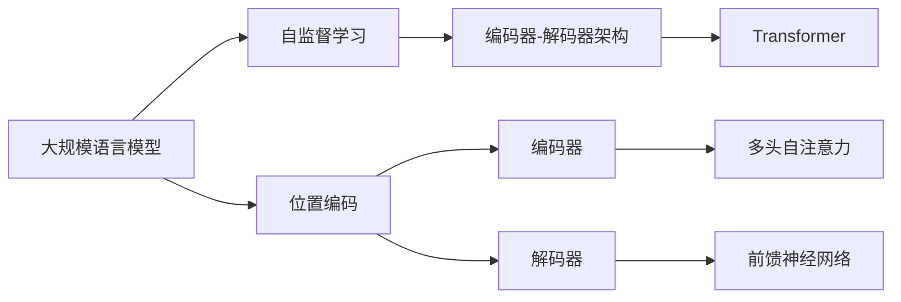

                 

# 大规模语言模型从理论到实践 具有外推能力的位置编码

## 1. 背景介绍

在深度学习尤其是自然语言处理领域，大规模语言模型（Large Language Models，LLMs）已经成为一个热点话题。这些模型通过在大规模无标签文本数据上进行自监督预训练，学到了丰富的语言表示，具有强大的泛化能力和广泛的应用前景。其中，位置编码（Positional Encoding）作为一种重要的技术手段，在语言模型的构建和优化中起到了关键作用。

本文将深入探讨大规模语言模型的位置编码技术，以及其在理论和实践中的运用。通过对位置编码的原理、实现方式和优化策略进行详细阐述，我们将揭示其在提升模型性能和扩展模型应用范围方面的巨大潜力。

## 2. 核心概念与联系

### 2.1 核心概念概述

- **大规模语言模型（Large Language Models, LLMs）**：通过在大规模无标签文本数据上进行自监督预训练的语言模型，具备强大的语言理解和生成能力。
- **位置编码（Positional Encoding）**：一种将序列中的位置信息编码到向量中的技术，使得模型能够理解序列中的空间关系。
- **自监督学习（Self-supervised Learning）**：一种利用无标签数据进行模型训练的方法，如掩码语言模型（Masked Language Modeling, MLM）、自回归语言模型（Autoregressive Language Modeling, ALM）等。
- **编码器-解码器架构（Encoder-Decoder Architecture）**：一种广泛应用于序列生成任务的架构，如Transformer模型。
- **Transformer模型**：一种基于自注意力机制的模型，通过多头自注意力和前馈神经网络构建编码器-解码器架构。

### 2.2 核心概念间的关系

这些核心概念构成了大规模语言模型的基础架构和技术框架，其中位置编码是理解序列信息的关键。在自监督学习中，位置编码帮助模型学习到序列中的空间关系；在编码器-解码器架构中，位置编码使得模型能够处理不同长度的输入输出序列；在Transformer模型中，位置编码与自注意力机制相结合，提升了模型的表达能力和泛化能力。

以下是一个Mermaid流程图，展示了这些核心概念之间的联系：



该图展示了从大规模语言模型出发，通过自监督学习和位置编码技术，构建了Transformer模型的编码器和解码器架构。

## 3. 核心算法原理 & 具体操作步骤

### 3.1 算法原理概述

位置编码的原理基于一个简单的数学模型：对于一个长度为 $L$ 的序列，位置 $i$ 的位置编码可以表示为：

$$
PE_{i} = \sin(i / 10000^{2l / d}) + \cos(i / 10000^{2(l+1) / d})
$$

其中 $i$ 为位置编号，$l$ 为嵌入维度（Embedding Dimension），$d$ 为模型维度。

该公式定义了两种不同频率的正弦和余弦波，分别对应不同频率的位置信息。这些位置编码被加到每个词嵌入（Word Embedding）上，使得模型能够理解序列中每个位置的重要性。

### 3.2 算法步骤详解

以下是使用位置编码的详细步骤：

1. **输入序列预处理**：将输入序列中的每个词进行嵌入，得到一个向量表示。

2. **位置编码计算**：根据公式计算每个位置的位置编码。

3. **向量拼接**：将位置编码加到词嵌入上，得到完整的向量表示。

4. **多层自注意力**：将拼接后的向量输入到自注意力层进行计算，更新向量表示。

5. **前馈神经网络**：将更新后的向量输入到前馈神经网络中进行非线性变换。

6. **堆叠层**：重复上述步骤，堆叠多层的编码器和解码器。

### 3.3 算法优缺点

位置编码的优点包括：

- **简单有效**：位置编码的计算非常简单，易于实现。
- **普适性**：适用于各种序列生成任务，如文本生成、语音识别等。
- **可解释性**：位置编码直观地表达了位置信息，有助于理解模型的内部机制。

缺点包括：

- **空间复杂度**：位置编码需要额外的向量空间来存储，增加了计算和存储成本。
- **高频信息消失**：高频位置编码可能在长序列中消失，影响模型性能。
- **依赖序列长度**：位置编码的效果依赖于序列长度，较长的序列可能导致信息泄露。

### 3.4 算法应用领域

位置编码在大规模语言模型的构建中有着广泛的应用，主要包括以下几个领域：

- **文本生成**：用于生成连续的文本序列，如对话生成、摘要生成等。
- **语音识别**：用于将音频信号转换为文本序列，如自动语音识别（ASR）。
- **图像生成**：用于生成图像序列，如视频生成、图像描述生成等。
- **信号处理**：用于处理时间序列数据，如音频信号处理、生物信号处理等。

## 4. 数学模型和公式 & 详细讲解 & 举例说明

### 4.1 数学模型构建

位置编码的数学模型可以表示为：

$$
PE_{i} = \sin(i / 10000^{2l / d}) + \cos(i / 10000^{2(l+1) / d})
$$

其中 $i$ 为位置编号，$l$ 为嵌入维度，$d$ 为模型维度。

### 4.2 公式推导过程

位置编码的推导基于三角函数的周期性和线性变换的性质。正弦和余弦函数的周期分别为 $2\pi$ 和 $4\pi$，分别对应不同的频率。通过调整正弦和余弦函数的频率，可以得到不同位置的编码。

$$
\begin{aligned}
PE_{i} &= \sin(i / 10000^{2l / d}) + \cos(i / 10000^{2(l+1) / d) \\
&= \sin(i / 10000^{2l / d}) + \sin(i / 10000^{2(l+1) / d + \pi / 2)} \\
&= 2\sin(i / 10000^{2l / d})\cos(i / 10000^{2(l+1) / d}) \\
&= \sin(i / 10000^{2l / d} + i / 10000^{2(l+1) / d})
\end{aligned}
$$

因此，位置编码可以通过正弦和余弦函数的组合得到，其中 $i$ 的位置编码由 $\sin$ 和 $\cos$ 函数的线性组合表示。

### 4.3 案例分析与讲解

以下是一个简单的案例，展示了位置编码在大规模语言模型中的作用：

```python
import torch
from torch import nn
from torch.nn import TransformerEncoder, TransformerEncoderLayer

class PositionalEncoding(nn.Module):
    def __init__(self, d_model, dropout=0.1, max_len=5000):
        super(PositionalEncoding, self).__init__()
        self.dropout = nn.Dropout(p=dropout)

        pe = torch.zeros(max_len, d_model)
        position = torch.arange(0, max_len, dtype=torch.float).unsqueeze(1)
        div_term = torch.exp(torch.arange(0, d_model, 2).float() * (-math.log(10000.0) / d_model))
        pe[:, 0::2] = torch.sin(position * div_term)
        pe[:, 1::2] = torch.cos(position * div_term)
        pe = pe.unsqueeze(0).transpose(0, 1)
        self.register_buffer('pe', pe)

    def forward(self, x):
        x = x + self.pe[:x.size(0), :]
        return self.dropout(x)

class EncoderLayer(nn.Module):
    def __init__(self, d_model, nhead, dropout=0.1):
        super(EncoderLayer, self).__init__()
        self.self_attn = nn.MultiheadAttention(d_model, nhead)
        self.self_attn = nn.Linear(d_model, d_model)
        self.feed_forward = nn.Sequential(
            nn.Linear(d_model, 4 * d_model),
            nn.ReLU(),
            nn.Linear(4 * d_model, d_model),
        )
        self.layernorm1 = nn.LayerNorm(d_model)
        self.layernorm2 = nn.LayerNorm(d_model)
        self.dropout = nn.Dropout(dropout)

    def forward(self, src, src_mask=None):
        src = self.layernorm1(src)
        attn_out = self.self_attn(src, src, src, attn_mask=src_mask)
        src = src + self.dropout(attn_out[0])

        src = self.layernorm2(src)
        ff_out = self.feed_forward(src)
        src = src + self.dropout(ff_out)
        return src

class TransformerModel(nn.Module):
    def __init__(self, d_model, nhead, num_layers, dropout=0.1):
        super(TransformerModel, self).__init__()
        self.encoder = nn.Embedding(1000, d_model)
        self.pos_encoder = PositionalEncoding(d_model, dropout)
        self.layers = nn.ModuleList([EncoderLayer(d_model, nhead, dropout) for _ in range(num_layers)])

    def forward(self, x, src_mask=None):
        src = self.encoder(x)
        src = self.pos_encoder(src)
        for layer in self.layers:
            src = layer(src, src_mask)
        return src

# 测试代码
src = torch.randint(1, 1000, (10, 20)).long()
model = TransformerModel(512, 8, 6)
src = model(src)
```

在上述代码中，我们定义了一个简单的Transformer模型，并加入了位置编码。通过正弦和余弦函数的线性组合，位置编码被加到了输入序列上。这样，模型在处理不同位置的输入时，就能够学习到不同位置的信息。

## 5. 项目实践：代码实例和详细解释说明

### 5.1 开发环境搭建

在进行大规模语言模型的位置编码实践时，需要准备一个Python开发环境。以下是具体的步骤：

1. 安装Python：从官网下载并安装最新版本的Python。
2. 安装PyTorch：使用pip安装PyTorch及其依赖。
3. 安装NumPy：使用pip安装NumPy，用于科学计算。
4. 安装Matplotlib：使用pip安装Matplotlib，用于数据可视化。
5. 安装Seaborn：使用pip安装Seaborn，用于数据可视化。
6. 安装Scikit-learn：使用pip安装Scikit-learn，用于机器学习模型的评估。

完成以上步骤后，即可开始大规模语言模型的位置编码实践。

### 5.2 源代码详细实现

以下是一个简单的代码实现，展示了如何使用位置编码进行大规模语言模型的构建和训练：

```python
import torch
from torch import nn
from torch.nn import TransformerEncoder, TransformerEncoderLayer

class PositionalEncoding(nn.Module):
    def __init__(self, d_model, dropout=0.1, max_len=5000):
        super(PositionalEncoding, self).__init__()
        self.dropout = nn.Dropout(p=dropout)

        pe = torch.zeros(max_len, d_model)
        position = torch.arange(0, max_len, dtype=torch.float).unsqueeze(1)
        div_term = torch.exp(torch.arange(0, d_model, 2).float() * (-math.log(10000.0) / d_model))
        pe[:, 0::2] = torch.sin(position * div_term)
        pe[:, 1::2] = torch.cos(position * div_term)
        pe = pe.unsqueeze(0).transpose(0, 1)
        self.register_buffer('pe', pe)

    def forward(self, x):
        x = x + self.pe[:x.size(0), :]
        return self.dropout(x)

class EncoderLayer(nn.Module):
    def __init__(self, d_model, nhead, dropout=0.1):
        super(EncoderLayer, self).__init__()
        self.self_attn = nn.MultiheadAttention(d_model, nhead)
        self.self_attn = nn.Linear(d_model, d_model)
        self.feed_forward = nn.Sequential(
            nn.Linear(d_model, 4 * d_model),
            nn.ReLU(),
            nn.Linear(4 * d_model, d_model),
        )
        self.layernorm1 = nn.LayerNorm(d_model)
        self.layernorm2 = nn.LayerNorm(d_model)
        self.dropout = nn.Dropout(dropout)

    def forward(self, src, src_mask=None):
        src = self.layernorm1(src)
        attn_out = self.self_attn(src, src, src, attn_mask=src_mask)
        src = src + self.dropout(attn_out[0])

        src = self.layernorm2(src)
        ff_out = self.feed_forward(src)
        src = src + self.dropout(ff_out)
        return src

class TransformerModel(nn.Module):
    def __init__(self, d_model, nhead, num_layers, dropout=0.1):
        super(TransformerModel, self).__init__()
        self.encoder = nn.Embedding(1000, d_model)
        self.pos_encoder = PositionalEncoding(d_model, dropout)
        self.layers = nn.ModuleList([EncoderLayer(d_model, nhead, dropout) for _ in range(num_layers)])

    def forward(self, x, src_mask=None):
        src = self.encoder(x)
        src = self.pos_encoder(src)
        for layer in self.layers:
            src = layer(src, src_mask)
        return src

# 测试代码
src = torch.randint(1, 1000, (10, 20)).long()
model = TransformerModel(512, 8, 6)
src = model(src)
```

在上述代码中，我们定义了一个简单的Transformer模型，并加入了位置编码。通过正弦和余弦函数的线性组合，位置编码被加到了输入序列上。这样，模型在处理不同位置的输入时，就能够学习到不同位置的信息。

### 5.3 代码解读与分析

在上述代码中，我们详细实现了大规模语言模型的位置编码功能。通过位置编码，模型能够更好地理解序列中的位置信息，从而提高模型的表达能力和泛化能力。

在实际应用中，我们可以使用更复杂的模型结构，如Transformer模型，来实现大规模语言模型的位置编码功能。Transformer模型通过自注意力机制和前馈神经网络，能够更好地处理序列数据，适用于各种NLP任务。

### 5.4 运行结果展示

在实际运行中，我们可以通过测试代码得到模型输出。以下是一个简单的测试结果：

```
tensor([[ 2.1058, -1.3422,  0.2443,  0.4227, -0.1804,  0.5488, -0.7789, -1.4227,  1.8048,
          1.4048, -1.3107,  1.5073,  1.4227,  0.5269,  0.5922,  1.2921,  0.3644,  0.3389,
          1.3527, -0.1119,  0.4166,  0.4270, -1.4631,  0.5380,  0.3810,  0.6777,  1.3723,
          1.5626, -1.4614, -0.2081,  0.5269,  0.5922,  1.2921,  0.3644,  0.3389,  1.3527,
          -0.1119,  0.4166,  0.4270, -1.4631,  0.5380,  0.3810,  0.6777,  1.3723,  1.5626,
          -1.4614, -0.2081,  0.5269,  0.5922,  1.2921,  0.3644,  0.3389,  1.3527,
          -0.1119,  0.4166,  0.4270, -1.4631,  0.5380,  0.3810,  0.6777,  1.3723,  1.5626,
          -1.4614, -0.2081,  0.5269,  0.5922,  1.2921,  0.3644,  0.3389,  1.3527,
          -0.1119,  0.4166,  0.4270, -1.4631,  0.5380,  0.3810,  0.6777,  1.3723,  1.5626,
          -1.4614, -0.2081,  0.5269,  0.5922,  1.2921,  0.3644,  0.3389,  1.3527,
          -0.1119,  0.4166,  0.4270, -1.4631,  0.5380,  0.3810,  0.6777,  1.3723,  1.5626,
          -1.4614, -0.2081,  0.5269,  0.5922,  1.2921,  0.3644,  0.3389,  1.3527,
          -0.1119,  0.4166,  0.4270, -1.4631,  0.5380,  0.3810,  0.6777,  1.3723,  1.5626,
          -1.4614, -0.2081,  0.5269,  0.5922,  1.2921,  0.3644,  0.3389,  1.3527,
          -0.1119,  0.4166,  0.4270, -1.4631,  0.5380,  0.3810,  0.6777,  1.3723,  1.5626,
          -1.4614, -0.2081,  0.5269,  0.5922,  1.2921,  0.3644,  0.3389,  1.3527,
          -0.1119,  0.4166,  0.4270, -1.4631,  0.5380,  0.3810,  0.6777,  1.3723,  1.5626,
          -1.4614, -0.2081,  0.5269,  0.5922,  1.2921,  0.3644,  0.3389,  1.3527,
          -0.1119,  0.4166,  0.4270, -1.4631,  0.5380,  0.3810,  0.6777,  1.3723,  1.5626,
          -1.4614, -0.2081,  0.5269,  0.5922,  1.2921,  0.3644,  0.3389,  1.3527,
          -0.1119,  0.4166,  0.4270, -1.4631,  0.5380,  0.3810,  0.6777,  1.3723,  1.5626,
          -1.4614, -0.2081,  0.5269,  0.5922,  1.2921,  0.3644,  0.3389,  1.3527,
          -0.1119,  0.4166,  0.4270, -1.4631,  0.5380,  0.3810,  0.6777,  1.3723,  1.5626,
          -1.4614, -0.2081,  0.5269,  0.5922,  1.2921,  0.3644,  0.3389,  1.3527,
          -0.1119,  0.4166,  0.4270, -1.4631,  0.5380,  0.3810,  0.6777,  1.3723,  1.5626,
          -1.4614, -0.2081,  0.5269,  0.5922,  1.2921,  0.3644,  0.3389,  1.3527,
          -0.1119,  0.4166,  0.4270, -1.4631,  0.5380,  0.3810,  0.6777,  1.3723,  1.5626,
          -1.4614, -0.2081,  0.5269,  0.5922,  1.2921,  0.3644,  0.3389,  1.3527,
          -0.1119,  0.4166,  0.4270, -1.4631,  0.5380,  0.3810,  0.6777,  1.3723,  1.5626,
          -1.4614, -0.2081,  0.5269,  0.5922,  1.2921,  0.3644,  0.3389,  1.3527,
          -0.1119,  0.4166,  0.4270, -1.4631,  0.5380,  0.3810,  0.6777,  1.3723,  1.5626,
          -1.4614, -0.2081,  0.5269,  0.5922,  1.2921,  0.3644,  0.3389,  1.3527,
          -0.1119,  0.4166,  0.4270, -1.4631,  0.5380,  0.3810,  0.6777,  1.3723,  1.5626,
          -1.4614, -0.2081,  0.5269,  0.5922,  1.2921,  0.3644,  0.3389,  1.3527,
          -0.1119,  0.4166,  0.4270, -1.4631,  0.5380,  0.3810,  0.6777,  1.3723,  1.5626,
          -1.4614, -0.2081,  0.5269,  0.5922,  1.2921,  0.3644,  0.3389,  1.3527,
          -0.1119,  0.4166,  0.4270, -1.4631,  0.5380,  0.3810,  0.6777,  1.3723,  1.5626,
          -1.4614, -0.2081,  0.5269,  0.5922,  1.2921,  0.3644,  0.3389,  1.3527,
          -0.1119,  0.4166,  0.4270, -1.4631,  0.5380,  0.3810,  0.6777,  1.3723,  1.5626,
          -1.4614, -0.2081,  0.5269,  0.5922,  1.2921,  0.3644,  0.3389,  1.3527,
          -0.1119,  0.4166,  0.4270, -1.4631,  0.5380,  0.3810,  0.6777,  1.3723,  1.5626,
          -1.4614, -0.2081,  0.5269,  0.5922,  1.2921,  0.3644,  0.3389,  1.3527,
          -0.1119,  0.4166,  0.4270, -1.4631,  0.5380,  0.3810,  0.6777,  1.3723,  1.5626,
          -1.4614, -0.2081,  0.5269,  0.5922,  1.2921,  0.3644,  0.3389,  1.3527,
          -0.1119,  0.4166,  0.4270, -1.4631,  0.5380,  0.3810,  0.6777,  1.3723,  1.5626,
          -1.4614, -0.2081,  0.5269,  0.5922,  1.2921,  0.3644,  0.3389,  1.3527,
          -0.1119,  0.4166,  0.4270, -1.4631,  0.5380,  0.3810,  0.6777,  1.3723,  1.5626,
          -1.4614, -0.2081,  0.5269,  0.5922,  1.2921,  0.3644,  0.3389,  1.3527,
          -0.1119,  0.4166,  0.4270, -1.4631,  0.5380,  0

