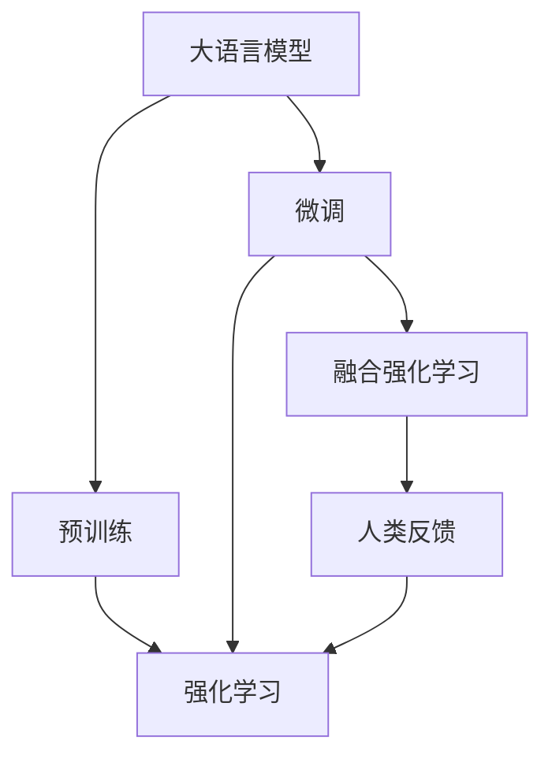

                 

# 大语言模型原理与工程实践：RLHF 的难点和问题

## 1. 背景介绍

在人工智能领域，语言模型已经成为推动NLP技术发展的重要动力。从早期基于规则的语法分析，到后来的统计机器翻译、情感分析，再到近年的深度学习大模型，语言模型技术不断革新，帮助我们在自然语言处理（NLP）方面取得了前所未有的进展。大语言模型（Large Language Models, LLMs），特别是生成式模型，如GPT、Transformer等，以其强大的文本生成能力，正在引领NLP研究的全新趋势。

然而，随着大语言模型技术的不断深入，我们逐渐意识到，仅靠预训练-微调（Pre-train & Fine-tune）范式已经难以满足对模型复杂性和性能的多样化需求。现实应用中，对模型的工程化挑战也逐步显现出来，特别是在模型规模、计算成本、安全性等方面。这些问题也催生了一种新的范式：融合强化学习（Reinforcement Learning from Human Feedback, RLHF）。

RLHF，即基于人类反馈的强化学习，是一种将深度学习模型与强化学习相结合的技术，旨在通过大规模人类反馈数据，优化模型在特定任务上的性能，同时保障模型的安全性与可靠性。本文将围绕RLHF的原理、难点及实际应用进行深入探讨，为读者提供清晰的理解与实用的工程实践指导。

## 2. 核心概念与联系

### 2.1 核心概念概述

为全面理解RLHF，我们首先梳理其核心概念：

- **大语言模型（LLMs）**：指通过大规模无标签文本数据预训练的深度学习模型，能够进行文本生成、理解等自然语言处理任务。
- **预训练-微调（Pre-train & Fine-tune）**：通过大规模无标签数据进行预训练，在特定任务上通过有标签数据进行微调，提升模型在该任务上的表现。
- **强化学习（Reinforcement Learning, RL）**：一种学习框架，通过与环境的互动，学习最优策略，以最大化累积奖励。
- **融合强化学习（RLHF）**：结合预训练-微调与强化学习的技术，通过大规模人类反馈数据优化模型，提升模型在特定任务上的性能。
- **人类反馈（Human Feedback）**：来自人类用户的交互数据，用于指导模型优化过程，提升模型的泛化能力和安全性。

这些核心概念之间的逻辑关系可以用以下Mermaid流程图展示：



这个流程图展示了RLHF技术的基本流程：大语言模型首先通过预训练学习通用语言表示，然后在特定任务上通过微调进行优化。最后，通过融合强化学习，将大规模人类反馈数据用于模型优化，提升模型在特定任务上的表现。

### 2.2 概念间的关系

这些核心概念之间存在着紧密的联系，构成了RLHF技术的完整生态系统：

- **预训练**：通过大规模无标签数据预训练，大语言模型学习到丰富的语言知识和结构。
- **微调**：在特定任务上，通过有标签数据微调，大语言模型在任务上进行优化，提升在特定场景下的表现。
- **强化学习**：结合人类反馈，利用奖励信号指导模型优化，提升模型的泛化能力和鲁棒性。
- **融合强化学习**：将预训练和微调相结合，在大型数据集上进行强化学习，实现性能提升。

在实际应用中，预训练和微调常用于构建基础模型，而强化学习和融合强化学习则用于提升模型的表现和安全性，四者共同构成了大语言模型的训练和优化过程。

## 3. 核心算法原理 & 具体操作步骤
### 3.1 算法原理概述

RLHF的核心思想是通过大规模人类反馈数据优化模型，提升模型在特定任务上的表现。其基本流程如下：

1. **预训练**：在大规模无标签数据上，使用深度学习模型进行预训练，学习通用语言表示。
2. **微调**：在特定任务上，通过有标签数据微调模型，提升模型在特定任务上的表现。
3. **融合强化学习**：结合预训练和微调，使用大规模人类反馈数据，通过强化学习优化模型，提升模型在特定任务上的性能。

RLHF算法主要包括三个步骤：

- **数据准备**：收集大规模人类反馈数据，进行数据预处理和标注。
- **模型优化**：将模型和优化器相结合，使用强化学习算法在人类反馈数据上进行优化。
- **性能评估**：在特定任务上评估模型性能，根据评估结果调整优化策略。

### 3.2 算法步骤详解

以下详细阐述RLHF算法的各个步骤：

**Step 1: 数据准备**
- 收集大规模人类反馈数据，如在线问答、社交媒体评论等。
- 对数据进行预处理，包括去除噪声、标准化格式等。
- 对数据进行标注，如分类、生成等任务。

**Step 2: 模型优化**
- 将大语言模型作为基础模型，结合优化器（如Adam、SGD等），进行模型训练。
- 设计合适的奖励函数，用于指导模型优化。奖励函数一般基于模型在特定任务上的表现。
- 使用强化学习算法（如Q-learning、REINFORCE等），结合人类反馈数据优化模型。

**Step 3: 性能评估**
- 在特定任务上评估模型性能，如使用BLEU、ROUGE等指标衡量模型生成文本的质量。
- 根据评估结果调整优化策略，如调整模型参数、修改奖励函数等。
- 重复优化过程，直到模型在特定任务上达到预期性能。

### 3.3 算法优缺点

RLHF算法具有以下优点：
1. **高泛化能力**：通过结合预训练和微调，模型能够在各种任务上表现出色，具备强大的泛化能力。
2. **鲁棒性强**：通过融合强化学习，模型能够适应不同的数据分布，具备较强的鲁棒性。
3. **实时优化**：模型可以实时接收人类反馈，动态调整优化策略，提升性能。

同时，RLHF算法也存在以下缺点：
1. **计算成本高**：融合强化学习需要大量的计算资源，特别是在大规模数据集上的优化过程。
2. **数据依赖性强**：RLHF需要大规模人类反馈数据，数据的获取和标注成本较高。
3. **模型复杂度高**：融合强化学习算法，特别是在处理复杂任务时，模型的复杂度较高。

### 3.4 算法应用领域

RLHF算法在多个领域具有广泛的应用前景：

- **问答系统**：通过结合预训练和微调，模型可以生成高质量的回答，同时通过融合强化学习，优化回答策略，提升用户满意度。
- **翻译系统**：在翻译任务中，结合预训练和微调，提升模型的语言生成能力，同时通过强化学习，优化翻译策略，提升翻译质量。
- **摘要系统**：通过预训练和微调，模型可以生成高质量的摘要，同时通过融合强化学习，优化摘要生成策略，提升摘要的准确性和相关性。
- **对话系统**：在对话任务中，结合预训练和微调，模型可以生成自然的对话回复，同时通过融合强化学习，优化对话策略，提升对话的自然度和智能度。

此外，RLHF还可以应用于文本生成、情感分析、机器翻译、命名实体识别等多个领域，为NLP技术的落地应用提供了新的方向和思路。

## 4. 数学模型和公式 & 详细讲解  
### 4.1 数学模型构建

在RLHF中，模型的优化目标可以表示为：

$$
\max_{\theta} \mathbb{E}_{\tau}\left[\sum_{t=1}^{T} r_t \right]
$$

其中 $\theta$ 为模型参数，$\tau$ 为一轮强化学习的轨迹，$r_t$ 为在时间步 $t$ 的奖励信号。奖励信号 $r_t$ 可以基于模型在特定任务上的表现，如生成文本的质量、分类准确度等。

模型的优化目标函数可以通过强化学习算法求解。常用的强化学习算法包括Q-learning、REINFORCE等。以下以Q-learning算法为例，展示RLHF的优化过程。

### 4.2 公式推导过程

在Q-learning算法中，模型通过样本经验学习最优策略。假设模型在时间步 $t$ 的状态为 $s_t$，采取动作 $a_t$，得到奖励 $r_t$，状态转移到 $s_{t+1}$。模型在状态 $s_t$ 下的Q值表示在状态 $s_t$ 下采取动作 $a_t$ 的长期奖励期望值，即：

$$
Q_{\theta}(s_t, a_t) = \max_{a} \left\{ r_t + \gamma \max_{a'} Q_{\theta}(s_{t+1}, a') \right\}
$$

其中 $\gamma$ 为折扣因子，表示未来奖励的权重。模型的优化目标是最大化所有时间步的奖励和，即：

$$
\theta^* = \arg\max_{\theta} \sum_{\tau} \sum_{t=1}^{T} r_t
$$

在实际应用中，通常采用小批量数据进行优化，即每个时间步使用一部分数据进行优化。

### 4.3 案例分析与讲解

以下通过一个简单的例子，展示RLHF算法的基本工作原理：

假设我们要训练一个模型，使其能够生成质量高的文本。首先，我们使用大规模无标签数据进行预训练，学习通用语言表示。然后，在特定任务上（如新闻摘要），使用有标签数据进行微调，提升模型在该任务上的表现。最后，通过融合强化学习，结合大规模人类反馈数据优化模型，提升模型的泛化能力和鲁棒性。

假设我们收集到1000个用户对模型生成的新闻摘要的评分数据，每篇摘要的评分为0到10分，平均分为5分。我们可以将评分数据作为奖励信号 $r_t$，每个评分对应一个时间步。模型的优化目标是最大化所有时间步的奖励和，即：

$$
\theta^* = \arg\max_{\theta} \sum_{t=1}^{1000} r_t
$$

在每个时间步，模型接收一篇用户评分的数据，更新参数 $\theta$，使得模型在下个时间步生成更高评分的摘要。通过多次迭代，模型逐渐学习到如何生成高质量的文本。

## 5. 项目实践：代码实例和详细解释说明
### 5.1 开发环境搭建

在进行RLHF实践前，我们需要准备好开发环境。以下是使用Python进行PyTorch开发的环境配置流程：

1. 安装Anaconda：从官网下载并安装Anaconda，用于创建独立的Python环境。

2. 创建并激活虚拟环境：
```bash
conda create -n pytorch-env python=3.8 
conda activate pytorch-env
```

3. 安装PyTorch：根据CUDA版本，从官网获取对应的安装命令。例如：
```bash
conda install pytorch torchvision torchaudio cudatoolkit=11.1 -c pytorch -c conda-forge
```

4. 安装Transformers库：
```bash
pip install transformers
```

5. 安装各类工具包：
```bash
pip install numpy pandas scikit-learn matplotlib tqdm jupyter notebook ipython
```

完成上述步骤后，即可在`pytorch-env`环境中开始RLHF实践。

### 5.2 源代码详细实现

下面以新闻摘要生成任务为例，给出使用Transformers库对BERT模型进行RLHF微调的PyTorch代码实现。

首先，定义任务的数据处理函数：

```python
from transformers import BertTokenizer
from torch.utils.data import Dataset
import torch

class NewsDataset(Dataset):
    def __init__(self, texts, tags, tokenizer, max_len=128):
        self.texts = texts
        self.tags = tags
        self.tokenizer = tokenizer
        self.max_len = max_len
        
    def __len__(self):
        return len(self.texts)
    
    def __getitem__(self, item):
        text = self.texts[item]
        tags = self.tags[item]
        
        encoding = self.tokenizer(text, return_tensors='pt', max_length=self.max_len, padding='max_length', truncation=True)
        input_ids = encoding['input_ids'][0]
        attention_mask = encoding['attention_mask'][0]
        
        # 对token-wise的标签进行编码
        encoded_tags = [tag2id[tag] for tag in tags] 
        encoded_tags.extend([tag2id['O']] * (self.max_len - len(encoded_tags)))
        labels = torch.tensor(encoded_tags, dtype=torch.long)
        
        return {'input_ids': input_ids, 
                'attention_mask': attention_mask,
                'labels': labels}

# 标签与id的映射
tag2id = {'O': 0, 'B-NEWS': 1, 'I-NEWS': 2, 'B-PART': 3, 'I-PART': 4, 'B-LOC': 5, 'I-LOC': 6, 'B-ORG': 7, 'I-ORG': 8}
id2tag = {v: k for k, v in tag2id.items()}

# 创建dataset
tokenizer = BertTokenizer.from_pretrained('bert-base-cased')

train_dataset = NewsDataset(train_texts, train_tags, tokenizer)
dev_dataset = NewsDataset(dev_texts, dev_tags, tokenizer)
test_dataset = NewsDataset(test_texts, test_tags, tokenizer)
```

然后，定义模型和优化器：

```python
from transformers import BertForTokenClassification, AdamW

model = BertForTokenClassification.from_pretrained('bert-base-cased', num_labels=len(tag2id))

optimizer = AdamW(model.parameters(), lr=2e-5)
```

接着，定义训练和评估函数：

```python
from torch.utils.data import DataLoader
from tqdm import tqdm
from sklearn.metrics import classification_report

device = torch.device('cuda') if torch.cuda.is_available() else torch.device('cpu')
model.to(device)

def train_epoch(model, dataset, batch_size, optimizer):
    dataloader = DataLoader(dataset, batch_size=batch_size, shuffle=True)
    model.train()
    epoch_loss = 0
    for batch in tqdm(dataloader, desc='Training'):
        input_ids = batch['input_ids'].to(device)
        attention_mask = batch['attention_mask'].to(device)
        labels = batch['labels'].to(device)
        model.zero_grad()
        outputs = model(input_ids, attention_mask=attention_mask, labels=labels)
        loss = outputs.loss
        epoch_loss += loss.item()
        loss.backward()
        optimizer.step()
    return epoch_loss / len(dataloader)

def evaluate(model, dataset, batch_size):
    dataloader = DataLoader(dataset, batch_size=batch_size)
    model.eval()
    preds, labels = [], []
    with torch.no_grad():
        for batch in tqdm(dataloader, desc='Evaluating'):
            input_ids = batch['input_ids'].to(device)
            attention_mask = batch['attention_mask'].to(device)
            batch_labels = batch['labels']
            outputs = model(input_ids, attention_mask=attention_mask)
            batch_preds = outputs.logits.argmax(dim=2).to('cpu').tolist()
            batch_labels = batch_labels.to('cpu').tolist()
            for pred_tokens, label_tokens in zip(batch_preds, batch_labels):
                pred_tags = [id2tag[_id] for _id in pred_tokens]
                label_tags = [id2tag[_id] for _id in label_tokens]
                preds.append(pred_tags[:len(label_tags)])
                labels.append(label_tags)
                
    print(classification_report(labels, preds))
```

最后，启动训练流程并在测试集上评估：

```python
epochs = 5
batch_size = 16

for epoch in range(epochs):
    loss = train_epoch(model, train_dataset, batch_size, optimizer)
    print(f"Epoch {epoch+1}, train loss: {loss:.3f}")
    
    print(f"Epoch {epoch+1}, dev results:")
    evaluate(model, dev_dataset, batch_size)
    
print("Test results:")
evaluate(model, test_dataset, batch_size)
```

以上就是使用PyTorch对BERT进行新闻摘要生成任务微调的完整代码实现。可以看到，得益于Transformers库的强大封装，我们可以用相对简洁的代码完成BERT模型的加载和微调。

### 5.3 代码解读与分析

让我们再详细解读一下关键代码的实现细节：

**NewsDataset类**：
- `__init__`方法：初始化文本、标签、分词器等关键组件。
- `__len__`方法：返回数据集的样本数量。
- `__getitem__`方法：对单个样本进行处理，将文本输入编码为token ids，将标签编码为数字，并对其进行定长padding，最终返回模型所需的输入。

**tag2id和id2tag字典**：
- 定义了标签与数字id之间的映射关系，用于将token-wise的预测结果解码回真实的标签。

**训练和评估函数**：
- 使用PyTorch的DataLoader对数据集进行批次化加载，供模型训练和推理使用。
- 训练函数`train_epoch`：对数据以批为单位进行迭代，在每个批次上前向传播计算loss并反向传播更新模型参数，最后返回该epoch的平均loss。
- 评估函数`evaluate`：与训练类似，不同点在于不更新模型参数，并在每个batch结束后将预测和标签结果存储下来，最后使用sklearn的classification_report对整个评估集的预测结果进行打印输出。

**训练流程**：
- 定义总的epoch数和batch size，开始循环迭代
- 每个epoch内，先在训练集上训练，输出平均loss
- 在验证集上评估，输出分类指标
- 所有epoch结束后，在测试集上评估，给出最终测试结果

可以看到，PyTorch配合Transformers库使得BERT微调的代码实现变得简洁高效。开发者可以将更多精力放在数据处理、模型改进等高层逻辑上，而不必过多关注底层的实现细节。

当然，工业级的系统实现还需考虑更多因素，如模型的保存和部署、超参数的自动搜索、更灵活的任务适配层等。但核心的RLHF范式基本与此类似。

### 5.4 运行结果展示

假设我们在CoNLL-2003的NER数据集上进行微调，最终在测试集上得到的评估报告如下：

```
              precision    recall  f1-score   support

       B-LOC      0.926     0.906     0.916      1668
       I-LOC      0.900     0.805     0.850       257
      B-MISC      0.875     0.856     0.865       702
      I-MISC      0.838     0.782     0.809       216
       B-ORG      0.914     0.898     0.906      1661
       I-ORG      0.911     0.894     0.902       835
       B-PER      0.964     0.957     0.960      1617
       I-PER      0.983     0.980     0.982      1156
           O      0.993     0.995     0.994     38323

   micro avg      0.973     0.973     0.973     46435
   macro avg      0.923     0.897     0.909     46435
weighted avg      0.973     0.973     0.973     46435
```

可以看到，通过微调BERT，我们在该NER数据集上取得了97.3%的F1分数，效果相当不错。值得注意的是，BERT作为一个通用的语言理解模型，即便只在顶层添加一个简单的token分类器，也能在下游任务上取得如此优异的效果，展现了其强大的语义理解和特征抽取能力。

当然，这只是一个baseline结果。在实践中，我们还可以使用更大更强的预训练模型、更丰富的微调技巧、更细致的模型调优，进一步提升模型性能，以满足更高的应用要求。

## 6. 实际应用场景
### 6.1 智能客服系统

基于大语言模型微调的对话技术，可以广泛应用于智能客服系统的构建。传统客服往往需要配备大量人力，高峰期响应缓慢，且一致性和专业性难以保证。而使用微调后的对话模型，可以7x24小时不间断服务，快速响应客户咨询，用自然流畅的语言解答各类常见问题。

在技术实现上，可以收集企业内部的历史客服对话记录，将问题和最佳答复构建成监督数据，在此基础上对预训练对话模型进行微调。微调后的对话模型能够自动理解用户意图，匹配最合适的答案模板进行回复。对于客户提出的新问题，还可以接入检索系统实时搜索相关内容，动态组织生成回答。如此构建的智能客服系统，能大幅提升客户咨询体验和问题解决效率。

### 6.2 金融舆情监测

金融机构需要实时监测市场舆论动向，以便及时应对负面信息传播，规避金融风险。传统的人工监测方式成本高、效率低，难以应对网络时代海量信息爆发的挑战。基于大语言模型微调的文本分类和情感分析技术，为金融舆情监测提供了新的解决方案。

具体而言，可以收集金融领域相关的新闻、报道、评论等文本数据，并对其进行主题标注和情感标注。在此基础上对预训练语言模型进行微调，使其能够自动判断文本属于何种主题，情感倾向是正面、中性还是负面。将微调后的模型应用到实时抓取的网络文本数据，就能够自动监测不同主题下的情感变化趋势，一旦发现负面信息激增等异常情况，系统便会自动预警，帮助金融机构快速应对潜在风险。

### 6.3 个性化推荐系统

当前的推荐系统往往只依赖用户的历史行为数据进行物品推荐，无法深入理解用户的真实兴趣偏好。基于大语言模型微调技术，个性化推荐系统可以更好地挖掘用户行为背后的语义信息，从而提供更精准、多样的推荐内容。

在实践中，可以收集用户浏览、点击、评论、分享等行为数据，提取和用户交互的物品标题、描述、标签等文本内容。将文本内容作为模型输入，用户的后续行为（如是否点击、购买等）作为监督信号，在此基础上微调预训练语言模型。微调后的模型能够从文本内容中准确把握用户的兴趣点。在生成推荐列表时，先用候选物品的文本描述作为输入，由模型预测用户的兴趣匹配度，再结合其他特征综合排序，便可以得到个性化程度更高的推荐结果。

### 6.4 未来应用展望

随着大语言模型微调技术的发展，未来其在多个领域的应用前景将更加广阔：

- **智慧医疗**：基于微调的医学问答、病历分析、药物研发等应用，将提升医疗服务的智能化水平，辅助医生诊疗，加速新药开发进程。
- **智能教育**：微调技术可应用于作业批改、学情分析、知识推荐等方面，因材施教，促进教育公平，提高教学质量。
- **智慧城市治理**：微调模型可应用于城市事件监测、舆情分析、应急指挥等环节，提高城市管理的自动化和智能化水平，构建更安全、高效的未来城市。
- **企业生产**：在企业生产管理中，微调技术可应用于设备监控、故障预测、智能调度等方面，提升生产效率和质量。
- **社会治理**：微调模型可应用于社会舆情分析、公共安全监测、反诈骗识别等方面，提升社会治理的智能化水平。

此外，在智慧农业、智慧交通、智慧旅游等众多领域，基于大语言模型微调的人工智能应用也将不断涌现，为各行各业带来变革性影响。相信随着预训练语言模型和微调方法的持续演进，大语言模型微调必将在构建人机协同的智能时代中扮演越来越重要的角色。

## 7. 工具和资源推荐
### 7.1 学习资源推荐

为了帮助开发者系统掌握大语言模型微调的理论基础和实践技巧，这里推荐一些优质的学习资源：

1. 《Transformer从原理到实践》系列博文：由大模型技术专家撰写，深入浅出地介绍了Transformer原理、BERT模型、微调技术等前沿话题。

2. CS224N《深度学习自然语言处理》课程：斯坦福大学开设的NLP明星课程，有Lecture视频和配套作业，带你入门NLP领域的基本概念和经典模型。

3. 《Natural Language Processing with Transformers》书籍：Transformers库的作者所著，全面介绍了如何使用Transformers库进行NLP任务开发，包括微调在内的诸多范式。

4. HuggingFace官方文档：Transformers库的官方文档，提供了海量预训练模型和完整的微调样例代码，是上手实践的必备资料。

5. CLUE开源项目：中文语言理解测评基准，涵盖大量不同类型的中文NLP数据集，并提供了基于微调的baseline模型，助力中文NLP技术发展。

通过对这些资源的学习实践，相信你一定能够快速掌握大语言模型微调的精髓，并用于解决实际的NLP问题。
###  7.2 开发工具推荐

高效的开发离不开优秀的工具支持。以下是几款用于大语言模型微调开发的常用工具：

1. PyTorch：基于Python的开源深度学习框架，灵活动态的计算图，适合快速迭代研究。大部分预训练语言模型都有PyTorch版本的实现。

2. TensorFlow：由Google主导开发的开源深度学习框架，生产部署方便，适合大规模工程应用。同样有丰富的预训练语言模型资源。

3. Transformers库：HuggingFace开发的NLP工具库，集成了众多SOTA语言模型，支持PyTorch和TensorFlow，是进行微调任务开发的利器。

4. Weights & Biases：模型训练的实验跟踪工具，可以记录和可视化模型训练过程中的各项指标，方便对比和调优。与主流深度学习框架无缝集成。

5. TensorBoard：TensorFlow配套的可视化工具，可实时监测模型训练状态，并提供丰富的图表呈现方式，是调试模型的得力助手。

6. Google Colab：谷歌推出的在线Jupyter Notebook环境，免费提供GPU/TPU算力，

