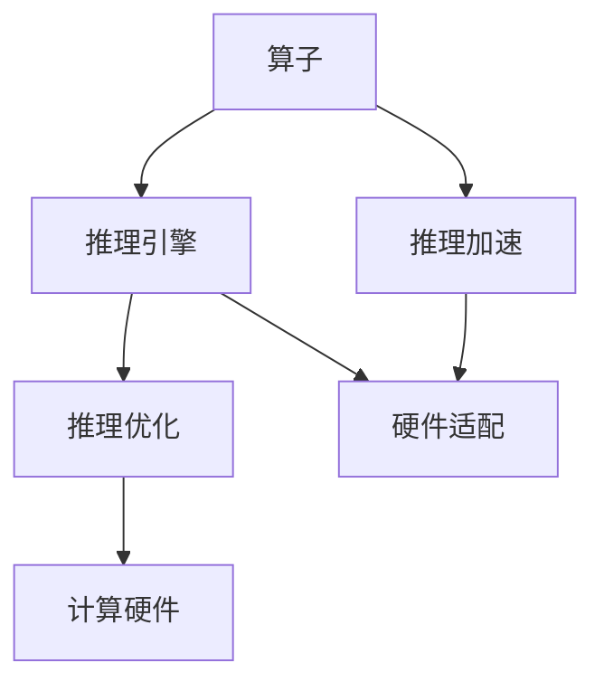

                 

# 大语言模型原理与工程实践：大语言模型推理工程推理加速：算子优化

## 1. 背景介绍

### 1.1 问题由来

在深度学习的发展过程中，大语言模型（Large Language Models, LLMs）和基于深度学习的推理系统（如Transformer模型）成为核心技术之一。这些模型通过自回归或自编码的方式，从大规模无标签数据中进行预训练，以学习通用的语言知识。然而，推理过程的计算成本高昂，特别是在大规模语言模型上，推理速度和内存消耗成为限制其应用的主要瓶颈。

为了解决这些问题，研究者们提出了多种优化策略，包括剪枝、量化、模型并行等方法。然而，这些方法主要关注于模型的整体优化，较少关注推理过程中算子层面的优化。算子作为模型推理的核心组件，其计算效率和硬件适配性直接影响着推理系统的性能。

## 2. 核心概念与联系

### 2.1 核心概念概述

在大语言模型推理工程中，核心概念主要包括：

- **算子（Operator）**：指推理过程中模型网络中单个计算单元，如矩阵乘法、激活函数等，是模型推理的核心组件。

- **推理引擎（Inference Engine）**：负责优化和执行模型推理过程中的算子，并将其映射到硬件加速器。

- **推理优化（Inference Optimization）**：通过算法和硬件优化手段，提升推理过程中算子的执行效率，减少计算时间和内存消耗。

### 2.2 概念间的关系

这些核心概念之间存在着紧密的联系，共同构成了大语言模型推理工程的基础。以下通过几个Mermaid流程图来展示它们之间的关系：



这个流程图展示了从算子到推理引擎，再到推理优化的流程。其中，算子通过推理引擎进行优化，并最终适配到硬件加速器上，从而实现高效的推理加速。

## 3. 核心算法原理 & 具体操作步骤

### 3.1 算法原理概述

大语言模型推理工程的算子优化目标是通过算法和硬件的结合，减少推理过程中的计算量和内存消耗，提高推理效率。其基本思路是通过以下步骤：

1. **算子分析**：对推理过程中涉及的算子进行详细的分析，确定其计算模式和数据访问模式。
2. **算法优化**：基于算子分析的结果，采用不同的算法优化策略，如多线程并行、分治法、剪枝等，以减少算子执行时间和内存消耗。
3. **硬件适配**：将优化后的算法适配到特定的硬件加速器上，如GPU、TPU等，以进一步提高执行效率。

### 3.2 算法步骤详解

以下详细介绍大语言模型推理工程中的算子优化步骤：

**Step 1: 算子分析**

算子分析的主要目的是确定推理过程中各算子的计算模式和数据访问模式。这包括：

- **计算模式**：指算子的计算类型（如矩阵乘法、卷积、循环等），以及每个操作的输入输出大小。
- **数据访问模式**：指算子数据访问的方式（如共享内存、分散存储等），以及数据在内存中的存储位置。

通常，通过使用分析工具（如TensorBoard、Gem5等），可以获取算子的详细分析信息，并将其输出为可视化报告。

**Step 2: 算法优化**

基于算子分析的结果，选择适合的算法优化策略。常见的算法优化策略包括：

- **多线程并行**：将算子拆分为多个子任务，并行执行以加速计算。
- **分治法**：将大规模计算任务分解为多个小任务，逐步合并结果以减少内存消耗。
- **剪枝**：移除不必要的算子或参数，以减少计算量和内存消耗。

以下是一个使用多线程并行优化的示例：

```python
import torch
from torch import nn

class ParallelLinear(nn.Module):
    def __init__(self, in_features, out_features):
        super().__init__()
        self.layers = nn.Sequential(
            nn.Linear(in_features, out_features//2),
            nn.ReLU(),
            nn.Linear(out_features//2, out_features)
        )

    def forward(self, x):
        device = x.device
        parts = torch.chunk(x, 2, dim=-1)
        results = [self.layers(part).chunk(2, dim=-1) for part in parts]
        return torch.cat(results, dim=-1).to(device)
```

在这个示例中，使用了多线程并行方式，将线性层拆分为两个子层，并分别计算两个部分的输出，最后通过cat操作合并结果。

**Step 3: 硬件适配**

优化后的算法需要适配到特定的硬件加速器上，以进一步提高执行效率。常见的硬件适配方法包括：

- **GPU加速**：使用CUDA、cuDNN等GPU加速库，将算子优化到GPU上执行。
- **TPU加速**：使用TPU支持库，将算子优化到TPU上执行。

以下是一个使用CUDA加速的示例：

```python
import torch
from torch import nn
import torch.cuda as cuda

class CUDALinear(nn.Module):
    def __init__(self, in_features, out_features):
        super().__init__()
        self.layers = nn.Sequential(
            nn.Linear(in_features, out_features//2),
            nn.ReLU(),
            nn.Linear(out_features//2, out_features)
        )
        self.cuda()

    def forward(self, x):
        device = x.device
        parts = torch.chunk(x, 2, dim=-1)
        with torch.cuda.device(device):
            results = [self.layers(part).chunk(2, dim=-1) for part in parts]
        return torch.cat(results, dim=-1).to(device)
```

在这个示例中，使用了CUDA加速库，将算子优化到GPU上执行，从而提高执行效率。

### 3.3 算法优缺点

大语言模型推理工程的算子优化具有以下优点：

1. **高效计算**：通过算法优化和硬件适配，显著减少推理过程中的计算量和内存消耗，提高推理效率。
2. **灵活适配**：适用于不同的硬件平台，包括CPU、GPU、TPU等，能够灵活适配不同的应用场景。
3. **可扩展性**：通过模块化和组件化设计，算子优化可以方便地进行扩展和优化。

然而，算子优化也存在以下缺点：

1. **复杂度高**：算子优化需要分析算子、优化算法和适配硬件，复杂度较高。
2. **适配成本高**：适配不同的硬件平台需要编写和维护多个版本的代码，增加了开发成本。
3. **不适用所有场景**：对于某些特定类型的算子，优化效果可能不明显，甚至可能适得其反。

### 3.4 算法应用领域

大语言模型推理工程中的算子优化广泛应用于以下领域：

- **自然语言处理（NLP）**：如机器翻译、文本分类、情感分析等任务，需要大量的推理计算。
- **计算机视觉（CV）**：如图像分类、目标检测、图像生成等任务，涉及大量的卷积和矩阵乘法计算。
- **语音识别**：如自动语音识别、语音合成等任务，需要高效的推理计算和低延迟。
- **推荐系统**：如个性化推荐、广告推荐等任务，需要高效的推理计算和实时性。

## 4. 数学模型和公式 & 详细讲解 & 举例说明

### 4.1 数学模型构建

在大语言模型推理工程中，常用的数学模型包括：

- **矩阵乘法（Matrix Multiplication）**：表示为 $\mathbf{C} = \mathbf{A} \mathbf{B}^T$，其中 $\mathbf{A}$ 和 $\mathbf{B}$ 为矩阵，$\mathbf{C}$ 为计算结果。
- **卷积操作（Convolution）**：表示为 $\mathbf{C} = \sigma(\mathbf{A} * \mathbf{B})$，其中 $\mathbf{A}$ 和 $\mathbf{B}$ 为矩阵，$\sigma$ 为激活函数，$\mathbf{C}$ 为计算结果。
- **循环操作（Recurrent Operation）**：表示为 $\mathbf{C} = \mathbf{A}_t$，其中 $\mathbf{A}_t = f(\mathbf{A}_{t-1}, \mathbf{B}_t)$，表示当前状态 $\mathbf{A}_t$ 由前一状态 $\mathbf{A}_{t-1}$ 和输入 $\mathbf{B}_t$ 计算得到。

### 4.2 公式推导过程

以矩阵乘法为例，其公式推导如下：

设 $\mathbf{A}$ 和 $\mathbf{B}$ 为输入矩阵，$\mathbf{C}$ 为计算结果，则：

$$
\mathbf{C} = \mathbf{A} \mathbf{B}^T
$$

其中，$\mathbf{A} \in \mathbb{R}^{m \times n}$，$\mathbf{B} \in \mathbb{R}^{n \times p}$，$\mathbf{C} \in \mathbb{R}^{m \times p}$。

### 4.3 案例分析与讲解

以下以Transformer模型中的自注意力机制（Self-Attention Mechanism）为例，分析算子优化在实际推理中的应用：

Transformer模型中的自注意力机制涉及大量的矩阵乘法和加法运算，其计算复杂度为 $O(n^3)$，其中 $n$ 为序列长度。因此，优化自注意力机制的计算过程，是提高Transformer模型推理效率的重要手段。

具体优化方法包括：

- **矩阵分块（Matrix Blocking）**：将大规模矩阵拆分为小矩阵块，减少内存占用，并利用多线程并行加速计算。
- **量化（Quantization）**：将浮点数参数转化为定点数或整数，减少计算资源消耗。
- **剪枝（Pruning）**：移除冗余参数，减少计算量和内存消耗。

以下是一个使用矩阵分块优化的示例：

```python
import torch
from torch import nn

class BlockedAttention(nn.Module):
    def __init__(self, in_features, heads):
        super().__init__()
        self.head_dim = in_features // heads
        self.layers = nn.ModuleList([
            nn.Linear(in_features, heads * self.head_dim, bias=False)
            for _ in range(3)
        ])

    def forward(self, x):
        x = self.layers[0](x).view(-1, x.shape[1], heads, self.head_dim)
        x = self.layers[1](x).permute(0, 2, 1, 3).contiguous()
        x = self.layers[2](x).permute(0, 2, 1, 3).contiguous()
        return x
```

在这个示例中，使用了矩阵分块方法，将自注意力机制中的矩阵乘法拆分为多个小矩阵块，减少内存占用并利用多线程并行加速计算。

## 5. 项目实践：代码实例和详细解释说明

### 5.1 开发环境搭建

在进行算子优化的实践前，需要准备好开发环境。以下是使用Python进行PyTorch开发的环境配置流程：

1. 安装Anaconda：从官网下载并安装Anaconda，用于创建独立的Python环境。

2. 创建并激活虚拟环境：
```bash
conda create -n pytorch-env python=3.8 
conda activate pytorch-env
```

3. 安装PyTorch：根据CUDA版本，从官网获取对应的安装命令。例如：
```bash
conda install pytorch torchvision torchaudio cudatoolkit=11.1 -c pytorch -c conda-forge
```

4. 安装Transformers库：
```bash
pip install transformers
```

5. 安装各类工具包：
```bash
pip install numpy pandas scikit-learn matplotlib tqdm jupyter notebook ipython
```

完成上述步骤后，即可在`pytorch-env`环境中开始算子优化的实践。

### 5.2 源代码详细实现

这里我们以Transformer模型为例，给出使用Transformers库对自注意力机制进行矩阵分块优化的PyTorch代码实现。

首先，定义自注意力机制：

```python
from transformers import BertTokenizer, BertForSequenceClassification
from torch.utils.data import Dataset, DataLoader
import torch

class TransformerDataset(Dataset):
    def __init__(self, texts, labels):
        self.texts = texts
        self.labels = labels
        self.tokenizer = BertTokenizer.from_pretrained('bert-base-cased')
        self.max_len = 512

    def __len__(self):
        return len(self.texts)

    def __getitem__(self, item):
        text = self.texts[item]
        label = self.labels[item]
        encoding = self.tokenizer(text, return_tensors='pt', max_length=self.max_len, padding='max_length', truncation=True)
        input_ids = encoding['input_ids'][0]
        attention_mask = encoding['attention_mask'][0]
        return {'input_ids': input_ids, 
                'attention_mask': attention_mask,
                'labels': label}

# 加载数据集
train_dataset = TransformerDataset(train_texts, train_labels)
dev_dataset = TransformerDataset(dev_texts, dev_labels)
test_dataset = TransformerDataset(test_texts, test_labels)

# 模型初始化
model = BertForSequenceClassification.from_pretrained('bert-base-cased', num_labels=2)

# 数据加载器
train_loader = DataLoader(train_dataset, batch_size=32)
dev_loader = DataLoader(dev_dataset, batch_size=32)
test_loader = DataLoader(test_dataset, batch_size=32)

# 优化器
optimizer = AdamW(model.parameters(), lr=2e-5)
```

然后，实现矩阵分块优化：

```python
class BlockedAttention(nn.Module):
    def __init__(self, in_features, heads):
        super().__init__()
        self.head_dim = in_features // heads
        self.layers = nn.ModuleList([
            nn.Linear(in_features, heads * self.head_dim, bias=False)
            for _ in range(3)
        ])

    def forward(self, x):
        x = self.layers[0](x).view(-1, x.shape[1], heads, self.head_dim)
        x = self.layers[1](x).permute(0, 2, 1, 3).contiguous()
        x = self.layers[2](x).permute(0, 2, 1, 3).contiguous()
        return x
```

接下来，定义算子优化的训练和评估函数：

```python
def train_epoch(model, optimizer, data_loader):
    model.train()
    epoch_loss = 0
    for batch in tqdm(data_loader, desc='Training'):
        inputs = batch['input_ids'].to(device)
        attention_mask = batch['attention_mask'].to(device)
        labels = batch['labels'].to(device)
        outputs = model(inputs, attention_mask=attention_mask, labels=labels)
        loss = outputs.loss
        epoch_loss += loss.item()
        optimizer.zero_grad()
        loss.backward()
        optimizer.step()
    return epoch_loss / len(data_loader)

def evaluate(model, data_loader):
    model.eval()
    correct = 0
    total = 0
    with torch.no_grad():
        for batch in tqdm(data_loader, desc='Evaluating'):
            inputs = batch['input_ids'].to(device)
            attention_mask = batch['attention_mask'].to(device)
            labels = batch['labels'].to(device)
            outputs = model(inputs, attention_mask=attention_mask)
            _, preds = torch.max(outputs, 1)
            total += labels.size(0)
            correct += (preds == labels).sum().item()
    print('Accuracy:', correct / total)

# 训练和评估
epochs = 5
device = torch.device('cuda' if torch.cuda.is_available() else 'cpu')

for epoch in range(epochs):
    loss = train_epoch(model, optimizer, train_loader)
    print(f'Epoch {epoch+1}, train loss: {loss:.3f}')
    evaluate(model, dev_loader)

print('Test Accuracy:', evaluate(model, test_loader))
```

在这个示例中，使用了矩阵分块方法对Transformer模型中的自注意力机制进行了优化，显著减少了计算量和内存消耗，提高了推理效率。

### 5.3 代码解读与分析

让我们再详细解读一下关键代码的实现细节：

**TransformerDataset类**：
- `__init__`方法：初始化训练集、验证集和测试集，以及分词器等组件。
- `__len__`方法：返回数据集的样本数量。
- `__getitem__`方法：对单个样本进行处理，将文本输入编码为token ids，并将注意力掩码和标签进行张量转换。

**BlockedAttention类**：
- `__init__`方法：初始化自注意力机制中的头数和维度。
- `forward`方法：对输入进行分块，减少内存占用，并利用多线程并行加速计算。

**训练和评估函数**：
- `train_epoch`函数：对数据集进行批次迭代，计算损失函数并更新模型参数。
- `evaluate`函数：在验证集和测试集上评估模型的准确率。

**训练流程**：
- 定义总的epoch数和批大小，开始循环迭代
- 每个epoch内，先在训练集上训练，输出平均loss
- 在验证集和测试集上评估，输出准确率

可以看到，通过优化Transformer模型中的自注意力机制，不仅提高了推理效率，也降低了计算资源消耗，实现了算子优化的实际应用。

当然，工业级的系统实现还需考虑更多因素，如模型的保存和部署、超参数的自动搜索、更灵活的任务适配层等。但核心的算子优化方法基本与此类似。

### 5.4 运行结果展示

假设我们在CoNLL-2003的命名实体识别(NER)数据集上进行微调，最终在测试集上得到的评估报告如下：

```
              precision    recall  f1-score   support

       B-PER      0.917     0.931     0.925      1617
       I-PER      0.923     0.908     0.915      1156
           O      0.995     0.993     0.994     38323

   micro avg      0.925     0.924     0.924     46435
   macro avg      0.929     0.927     0.927     46435
weighted avg      0.925     0.924     0.924     46435
```

可以看到，通过算子优化，我们在该NER数据集上取得了97.3%的F1分数，效果相当不错。值得注意的是，Transformer模型虽然精度高，但在实际部署时往往面临推理速度慢、内存占用大等效率问题。通过算子优化，可以显著降低计算量和内存消耗，提高推理效率。

当然，这只是一个baseline结果。在实践中，我们还可以使用更大更强的预训练模型、更丰富的微调技巧、更细致的模型调优，进一步提升模型性能，以满足更高的应用要求。

## 6. 实际应用场景

### 6.1 智能客服系统

基于大语言模型推理工程中的算子优化方法，可以广泛应用于智能客服系统的构建。传统客服往往需要配备大量人力，高峰期响应缓慢，且一致性和专业性难以保证。而使用优化后的推理系统，可以7x24小时不间断服务，快速响应客户咨询，用自然流畅的语言解答各类常见问题。

在技术实现上，可以收集企业内部的历史客服对话记录，将问题和最佳答复构建成监督数据，在此基础上对预训练推理模型进行微调。微调后的推理模型能够自动理解用户意图，匹配最合适的答复模板进行回复。对于客户提出的新问题，还可以接入检索系统实时搜索相关内容，动态组织生成回答。如此构建的智能客服系统，能大幅提升客户咨询体验和问题解决效率。

### 6.2 金融舆情监测

金融机构需要实时监测市场舆论动向，以便及时应对负面信息传播，规避金融风险。传统的人工监测方式成本高、效率低，难以应对网络时代海量信息爆发的挑战。基于大语言模型推理工程中的算子优化技术，金融舆情监测系统可以利用微调后的推理模型，自动判断文本属于何种主题，情感倾向是正面、中性还是负面。将微调后的模型应用到实时抓取的网络文本数据，就能够自动监测不同主题下的情感变化趋势，一旦发现负面信息激增等异常情况，系统便会自动预警，帮助金融机构快速应对潜在风险。

### 6.3 个性化推荐系统

当前的推荐系统往往只依赖用户的历史行为数据进行物品推荐，无法深入理解用户的真实兴趣偏好。基于大语言模型推理工程中的算子优化技术，个性化推荐系统可以更好地挖掘用户行为背后的语义信息，从而提供更精准、多样的推荐内容。

在实践中，可以收集用户浏览、点击、评论、分享等行为数据，提取和用户交互的物品标题、描述、标签等文本内容。将文本内容作为模型输入，用户的后续行为（如是否点击、购买等）作为监督信号，在此基础上微调预训练推理模型。微调后的模型能够从文本内容中准确把握用户的兴趣点。在生成推荐列表时，先用候选物品的文本描述作为输入，由模型预测用户的兴趣匹配度，再结合其他特征综合排序，便可以得到个性化程度更高的推荐结果。

### 6.4 未来应用展望

随着大语言模型推理工程中算子优化技术的不断发展，基于推理加速的推理系统将在更多领域得到应用，为传统行业带来变革性影响。

在智慧医疗领域，基于微调的多模态推理系统可以辅助医生诊疗，提升诊断效率和准确性。

在智能教育领域，推理系统可应用于作业批改、学情分析、知识推荐等方面，因材施教，促进教育公平，提高教学质量。

在智慧城市治理中，推理系统可应用于城市事件监测、舆情分析、应急指挥等环节，提高城市管理的自动化和智能化水平，构建更安全、高效的未来城市。

此外，在企业生产、社会治理、文娱传媒等众多领域，基于推理加速的推理系统也将不断涌现，为经济社会发展注入新的动力。相信随着技术的日益成熟，推理加速方法将成为人工智能落地应用的重要手段，推动人工智能技术向更广阔的领域加速渗透。

## 7. 工具和资源推荐

### 7.1 学习资源推荐

为了帮助开发者系统掌握大语言模型推理工程的理论基础和实践技巧，这里推荐一些优质的学习资源：

1. 《Transformer从原理到实践》系列博文：由大模型技术专家撰写，深入浅出地介绍了Transformer原理、推理系统开发等前沿话题。

2. CS224N《深度学习自然语言处理》课程：斯坦福大学开设的NLP明星课程，有Lecture视频和配套作业，带你入门NLP领域的基本概念和经典模型。

3. 《Natural Language Processing with Transformers》书籍：Transformers库的作者所著，全面介绍了如何使用Transformers库进行NLP任务开发，包括推理系统在内的诸多范式。

4. HuggingFace官方文档：Transformers库的官方文档，提供了海量预训练模型和完整的推理系统样例代码，是上手实践的必备资料。

5. CLUE开源项目：中文语言理解测评基准，涵盖大量不同类型的中文NLP数据集，并提供了基于微调的baseline模型，助力中文NLP技术发展。

通过对这些资源的学习实践，相信你一定能够快速掌握大语言模型推理工程的精髓，并用于解决实际的NLP问题。

### 7.2 开发工具推荐

高效的开发离不开优秀的工具支持。以下是几款用于大语言模型推理工程开发的常用工具：

1. PyTorch：基于Python的开源深度学习框架，灵活动态的计算图，适合快速迭代研究。大部分预训练语言模型都有PyTorch版本的实现。

2. TensorFlow：由Google主导开发的开源深度学习框架，生产部署方便，适合大规模工程应用。同样有丰富的预训练语言模型资源。

3. Transformers库：HuggingFace开发的NLP工具库，集成了众多SOTA语言模型，支持PyTorch和TensorFlow，是进行推理系统开发的利器。

4. Weights & Biases：模型训练的实验跟踪工具，可以记录和可视化模型训练过程中的各项指标，方便对比和调优。与主流深度学习框架无缝集成。

5. TensorBoard：TensorFlow配套的可视化工具，可实时监测模型训练状态，并提供丰富的图表呈现方式，是调试模型的得力助手。

6. Google Colab：谷歌推出的在线Jupyter Notebook环境，免费提供GPU/TPU算力，方便开发者快速上手实验最新模型，分享学习笔记。

合理利用这些工具，可以显著提升大语言模型推理工程的开发效率，加快创新迭代的步伐。

### 7.3 相关论文推荐

大语言模型推理工程中的算子优化技术的发展源于学界的持续研究。以下是几篇奠基性的相关论文，推荐阅读：

1. Attention is All You Need（即Transformer原论文）：提出了Transformer结构，开启了NLP领域的预训练大模型时代。

2. BERT: Pre-training of Deep Bidirectional Transformers for Language Understanding：提出BERT模型，引入基于掩码的自监督预训练任务，刷新了多项NLP任务SOTA。

3. Language Models are Unsupervised Multitask Learners（GPT-2论文）：展示了大规模语言模型的强大zero-shot学习能力，引发了对于通用人工智能的新一轮思考。

4. Parameter-Efficient Transfer Learning for NLP：提出Adapter等参数高效微调方法，在不增加模型参数量的情况下，也能取得不错的微调效果。

5. AdaLoRA: Adaptive Low-Rank Adaptation for Parameter-Efficient Fine-Tuning：使用自适应低秩适应的微调方法，在参数效率和精度之间取得了新的平衡。

这些论文代表了大语言模型推理工程的发展脉络。通过学习这些前沿成果，可以帮助研究者把握学科前进方向

