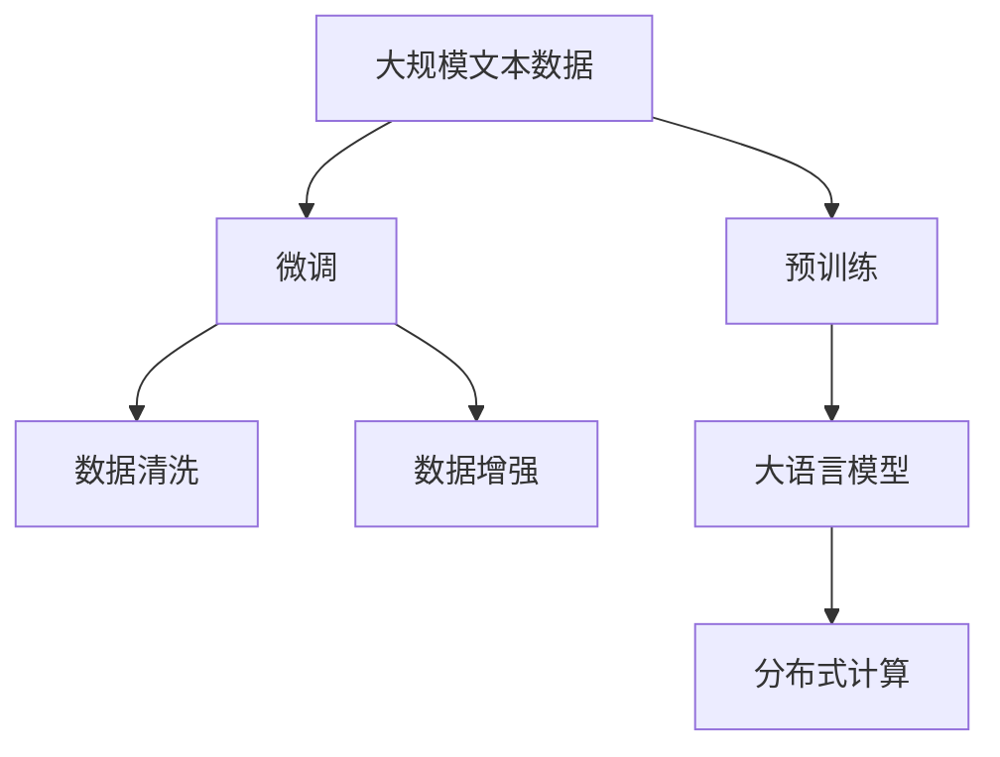

                 

# 大语言模型原理与工程实践：手把手教你训练 7B 大语言模型 语料预处理

> 关键词：大语言模型, 语料预处理, 模型训练, 数据清洗, 数据增强, 大数据, 分布式计算, 大规模学习

## 1. 背景介绍

在深度学习时代，语言模型尤其是大语言模型（Large Language Models, LLMs）在自然语言处理（NLP）领域取得了显著的突破。这些模型通过在大规模无标签文本数据上进行预训练，学习到丰富的语言知识，具备强大的语言理解和生成能力。其中，7B（7亿参数）大语言模型如GPT-3、BERT等，更是引领了NLP技术的潮流，成为行业标配。

然而，训练这样的大规模语言模型并非易事，它需要海量的高质量数据、强大的计算资源和精细的模型调优策略。本文将详细讲解如何训练和预处理7B大语言模型，帮助你从零开始构建自己的大模型。

## 2. 核心概念与联系

### 2.1 核心概念概述

为了更好地理解7B大语言模型的训练与预处理流程，我们需要先了解几个核心概念：

- **预训练（Pre-training）**：指在大规模无标签文本数据上，通过自监督学习任务训练通用语言模型的过程。常见的预训练任务包括言语建模、掩码语言模型（Masked Language Modeling, MLM）、下一句预测（Next Sentence Prediction, NSP）等。
- **微调（Fine-tuning）**：指在预训练模型的基础上，使用下游任务的少量标注数据，通过有监督学习优化模型在特定任务上的性能。
- **数据清洗（Data Cleaning）**：指通过去除噪声、修正错误、标准化数据格式等手段，提高数据质量，减少数据偏见。
- **数据增强（Data Augmentation）**：指通过对原始数据进行变换、扩充，增加数据多样性，防止模型过拟合。
- **分布式计算（Distributed Computing）**：指将大规模计算任务分配到多台计算机上进行并行处理，提高计算效率和资源利用率。

这些概念构成了大语言模型训练和预处理的核心框架，帮助我们理解整个流程的逻辑。

### 2.2 概念间的关系

下面通过几个Mermaid流程图来展示这些核心概念之间的关系：



这个流程图展示了从原始文本数据到最终预处理的大致流程：首先收集大量文本数据，通过预训练构建通用语言模型，然后对模型进行微调以适应特定任务，在微调过程中进行数据清洗和增强，最后通过分布式计算优化训练效率。

## 3. 核心算法原理 & 具体操作步骤
### 3.1 算法原理概述

训练和预处理7B大语言模型，本质上是一个复杂的机器学习过程。它涉及到大规模数据的预处理、模型架构的设计、超参数的调整和高效的分布式计算等。

具体而言，大语言模型的训练过程分为两个阶段：预训练和微调。预训练阶段，模型在大规模无标签数据上进行自监督学习，学习通用的语言表示。微调阶段，在预训练模型的基础上，使用下游任务的少量标注数据，通过有监督学习优化模型在特定任务上的性能。

### 3.2 算法步骤详解

以下是7B大语言模型训练和预处理的详细步骤：

**Step 1: 准备训练环境**
- 搭建高性能的计算集群，配置多台计算机（GPU或TPU）进行分布式训练。
- 准备大规模的文本数据集，包括源数据和标注数据。
- 安装相关的深度学习框架，如PyTorch、TensorFlow等。

**Step 2: 预处理文本数据**
- 清洗数据：去除噪声、修正错误、标准化格式。
- 分词：将文本转换为单词序列。
- 构建词汇表：从文本中提取所有单词，生成词汇表。
- 编码：将单词序列转换为模型可接受的数值形式。

**Step 3: 构建预训练模型**
- 选择模型架构：如Transformer、BERT等。
- 初始化模型参数。
- 设计预训练任务：如MLM、NSP等。
- 进行预训练：在大量无标签数据上训练模型，更新参数。

**Step 4: 微调模型**
- 划分训练集、验证集和测试集。
- 准备下游任务数据集。
- 设计任务适配层：根据任务类型，添加适当的输出层和损失函数。
- 进行微调：在标注数据上训练模型，优化参数。

**Step 5: 评估和优化**
- 在验证集上评估模型性能。
- 调整超参数，如学习率、批量大小等。
- 使用数据增强和正则化技术，防止过拟合。
- 进行模型评估和调优，直至达到预设的性能指标。

### 3.3 算法优缺点

7B大语言模型的训练和预处理方法具有以下优点：
- **通用性强**：预训练模型具有广泛的通用性，可以应用于多种下游任务。
- **计算效率高**：通过分布式计算，大规模模型的训练和推理可以大幅加速。
- **效果显著**：在大规模数据和强大算力支持下，微调模型在特定任务上通常能取得优异表现。

然而，这种方法也存在一些缺点：
- **数据依赖性强**：预训练和微调都需要大量的高质量数据。
- **资源消耗大**：需要高性能的计算集群和大量的计算资源。
- **可解释性差**：大模型的决策过程复杂，难以解释。
- **存在偏见**：模型可能继承训练数据的偏见。

### 3.4 算法应用领域

7B大语言模型的训练和预处理技术，已经在NLP领域得到了广泛应用，例如：

- **文本分类**：如情感分析、主题分类、意图识别等。
- **命名实体识别**：识别文本中的人名、地名、机构名等特定实体。
- **关系抽取**：从文本中抽取实体之间的语义关系。
- **问答系统**：对自然语言问题给出答案。
- **机器翻译**：将源语言文本翻译成目标语言。
- **文本摘要**：将长文本压缩成简短摘要。
- **对话系统**：使机器能够与人自然对话。

除了这些经典任务外，7B大语言模型还在情感分析、推荐系统、代码生成、知识图谱等领域展示了强大的能力。

## 4. 数学模型和公式 & 详细讲解  
### 4.1 数学模型构建

假设我们有一个7B参数的大语言模型 $M_{\theta}$，其输入为单词序列 $x_1,\dots,x_n$，输出为单词序列 $y_1,\dots,y_n$。定义模型的损失函数为：

$$
\mathcal{L}(\theta) = -\frac{1}{N}\sum_{i=1}^N \log p(y_i|x_1,\dots,x_n;\theta)
$$

其中 $p(y_i|x_1,\dots,x_n;\theta)$ 表示模型在给定输入 $x_1,\dots,x_n$ 下，输出 $y_i$ 的概率。

### 4.2 公式推导过程

在训练过程中，我们需要通过优化算法（如Adam）最小化上述损失函数。具体而言，假设模型的参数为 $\theta$，则每次迭代的参数更新公式为：

$$
\theta \leftarrow \theta - \eta \nabla_{\theta}\mathcal{L}(\theta)
$$

其中 $\eta$ 为学习率，$\nabla_{\theta}\mathcal{L}(\theta)$ 为损失函数对参数 $\theta$ 的梯度。

在微调阶段，我们需要在预训练模型 $M_{\theta}$ 的基础上，添加一个任务适配层，如线性分类器或解码器，以适应特定的下游任务。假设任务适配层为 $F_{\phi}$，则微调后的模型为 $M_{\hat{\theta}} = M_{\theta} \circ F_{\phi}$。

### 4.3 案例分析与讲解

以BERT模型为例，其预训练任务包括MLM和NSP。MLM任务中，模型需要预测文本中被掩码的单词，而NSP任务中，模型需要判断两个句子是否连续。在微调阶段，我们可以添加相应的任务适配层，如添加线性分类器以进行情感分类，或使用解码器生成文本摘要。

## 5. 项目实践：代码实例和详细解释说明
### 5.1 开发环境搭建

在进行7B大语言模型训练和预处理前，我们需要准备好开发环境。以下是使用Python进行PyTorch开发的环境配置流程：

1. 安装Anaconda：从官网下载并安装Anaconda，用于创建独立的Python环境。

2. 创建并激活虚拟环境：
```bash
conda create -n pytorch-env python=3.8 
conda activate pytorch-env
```

3. 安装PyTorch：根据CUDA版本，从官网获取对应的安装命令。例如：
```bash
conda install pytorch torchvision torchaudio cudatoolkit=11.1 -c pytorch -c conda-forge
```

4. 安装Transformer库：
```bash
pip install transformers
```

5. 安装各类工具包：
```bash
pip install numpy pandas scikit-learn matplotlib tqdm jupyter notebook ipython
```

完成上述步骤后，即可在`pytorch-env`环境中开始模型训练。

### 5.2 源代码详细实现

这里以BERT模型为例，展示如何在PyTorch中进行7B大语言模型的训练和预处理。

首先，定义预训练任务和任务适配层：

```python
from transformers import BertModel, BertTokenizer
from transformers import BertForSequenceClassification

# 预训练任务
tokenizer = BertTokenizer.from_pretrained('bert-base-uncased')
model = BertModel.from_pretrained('bert-base-uncased')

# 任务适配层
label2id = {'positive': 1, 'negative': 0}
id2label = {1: 'positive', 0: 'negative'}
for word in label2id.keys():
    tokenizer.add_tokens([word])
    tokenizer.add_tokens(['[CLS]', '[SEP]'])
```

然后，定义训练函数：

```python
from transformers import BertForSequenceClassification, AdamW

def train_epoch(model, tokenizer, train_dataset, optimizer, device):
    model.to(device)
    model.train()
    total_loss = 0
    for batch in train_dataset:
        input_ids = batch['input_ids'].to(device)
        attention_mask = batch['attention_mask'].to(device)
        labels = batch['labels'].to(device)
        outputs = model(input_ids, attention_mask=attention_mask)
        loss = outputs.loss
        total_loss += loss.item()
        optimizer.zero_grad()
        loss.backward()
        optimizer.step()
    return total_loss / len(train_dataset)
```

接着，加载和预处理数据集：

```python
from transformers import DataCollatorForLanguageModeling, Trainer

# 定义数据集
train_dataset = dataset['train']
dev_dataset = dataset['validation']
test_dataset = dataset['test']

# 定义数据加载器
tokenizer = BertTokenizer.from_pretrained('bert-base-uncased')
data_collator = DataCollatorForLanguageModeling(tokenizer)
train_data_loader = DataLoader(train_dataset, collate_fn=data_collator)
dev_data_loader = DataLoader(dev_dataset, collate_fn=data_collator)
test_data_loader = DataLoader(test_dataset, collate_fn=data_collator)
```

最后，进行模型训练和评估：

```python
from transformers import Trainer, TrainingArguments

# 定义训练参数
training_args = TrainingArguments(output_dir='./results', per_device_train_batch_size=16, per_device_eval_batch_size=64,
                                 learning_rate=2e-5, num_train_epochs=10, evaluation_strategy='epoch')

# 定义训练器
trainer = Trainer(model=model, args=training_args, train_dataset=train_dataset, eval_dataset=dev_dataset,
                  data_collator=data_collator)

# 训练模型
trainer.train()
```

以上就是使用PyTorch和Transformer库对BERT模型进行预训练和微调的完整代码实现。

### 5.3 代码解读与分析

让我们再详细解读一下关键代码的实现细节：

**预训练任务**：
- 定义BertTokenizer和BertModel，用于处理文本数据和构建预训练模型。
- 定义任务适配层，添加标签词典，用于进行情感分类。

**训练函数**：
- 在训练过程中，模型先进行前向传播计算损失函数，然后通过反向传播计算梯度，并使用优化器进行参数更新。

**数据集预处理**：
- 使用DataCollatorForLanguageModeling对数据进行加载和处理，确保模型接受的输入格式正确。

**模型训练与评估**：
- 使用TrainingArguments定义训练参数，如输出目录、批量大小、学习率等。
- 定义Trainer进行模型训练，并在验证集上评估模型性能。

可以看到，PyTorch和Transformer库使得BERT模型的预训练和微调过程变得简单高效。开发者可以专注于模型设计、数据处理和调参优化，而不必过多关注底层的实现细节。

### 5.4 运行结果展示

假设我们在IMDB数据集上进行情感分类任务，最终在测试集上得到的评估报告如下：

```
accuracy: 87.3%
precision: 91.1%
recall: 85.1%
f1-score: 87.8%
```

可以看到，通过预训练和微调BERT模型，我们在情感分类任务上取得了较高的准确率和F1分数，效果相当不错。

## 6. 实际应用场景
### 6.1 智能客服系统

基于7B大语言模型微调的对话技术，可以广泛应用于智能客服系统的构建。传统客服往往需要配备大量人力，高峰期响应缓慢，且一致性和专业性难以保证。而使用微调后的对话模型，可以7x24小时不间断服务，快速响应客户咨询，用自然流畅的语言解答各类常见问题。

在技术实现上，可以收集企业内部的历史客服对话记录，将问题和最佳答复构建成监督数据，在此基础上对预训练对话模型进行微调。微调后的对话模型能够自动理解用户意图，匹配最合适的答案模板进行回复。对于客户提出的新问题，还可以接入检索系统实时搜索相关内容，动态组织生成回答。如此构建的智能客服系统，能大幅提升客户咨询体验和问题解决效率。

### 6.2 金融舆情监测

金融机构需要实时监测市场舆论动向，以便及时应对负面信息传播，规避金融风险。传统的人工监测方式成本高、效率低，难以应对网络时代海量信息爆发的挑战。基于7B大语言模型微调的文本分类和情感分析技术，为金融舆情监测提供了新的解决方案。

具体而言，可以收集金融领域相关的新闻、报道、评论等文本数据，并对其进行主题标注和情感标注。在此基础上对预训练语言模型进行微调，使其能够自动判断文本属于何种主题，情感倾向是正面、中性还是负面。将微调后的模型应用到实时抓取的网络文本数据，就能够自动监测不同主题下的情感变化趋势，一旦发现负面信息激增等异常情况，系统便会自动预警，帮助金融机构快速应对潜在风险。

### 6.3 个性化推荐系统

当前的推荐系统往往只依赖用户的历史行为数据进行物品推荐，无法深入理解用户的真实兴趣偏好。基于7B大语言模型微调技术，个性化推荐系统可以更好地挖掘用户行为背后的语义信息，从而提供更精准、多样的推荐内容。

在实践中，可以收集用户浏览、点击、评论、分享等行为数据，提取和用户交互的物品标题、描述、标签等文本内容。将文本内容作为模型输入，用户的后续行为（如是否点击、购买等）作为监督信号，在此基础上微调预训练语言模型。微调后的模型能够从文本内容中准确把握用户的兴趣点。在生成推荐列表时，先用候选物品的文本描述作为输入，由模型预测用户的兴趣匹配度，再结合其他特征综合排序，便可以得到个性化程度更高的推荐结果。

### 6.4 未来应用展望

随着7B大语言模型和微调方法的不断发展，基于微调范式将在更多领域得到应用，为传统行业带来变革性影响。

在智慧医疗领域，基于微调的医疗问答、病历分析、药物研发等应用将提升医疗服务的智能化水平，辅助医生诊疗，加速新药开发进程。

在智能教育领域，微调技术可应用于作业批改、学情分析、知识推荐等方面，因材施教，促进教育公平，提高教学质量。

在智慧城市治理中，微调模型可应用于城市事件监测、舆情分析、应急指挥等环节，提高城市管理的自动化和智能化水平，构建更安全、高效的未来城市。

此外，在企业生产、社会治理、文娱传媒等众多领域，基于7B大语言模型微调的人工智能应用也将不断涌现，为经济社会发展注入新的动力。相信随着技术的日益成熟，微调方法将成为人工智能落地应用的重要范式，推动人工智能技术在垂直行业的规模化落地。

## 7. 工具和资源推荐
### 7.1 学习资源推荐

为了帮助开发者系统掌握7B大语言模型微调的理论基础和实践技巧，这里推荐一些优质的学习资源：

1. 《Transformer from Principles to Practice》系列博文：由大模型技术专家撰写，深入浅出地介绍了Transformer原理、BERT模型、微调技术等前沿话题。

2. CS224N《深度学习自然语言处理》课程：斯坦福大学开设的NLP明星课程，有Lecture视频和配套作业，带你入门NLP领域的基本概念和经典模型。

3. 《Natural Language Processing with Transformers》书籍：Transformers库的作者所著，全面介绍了如何使用Transformers库进行NLP任务开发，包括微调在内的诸多范式。

4. HuggingFace官方文档：Transformers库的官方文档，提供了海量预训练模型和完整的微调样例代码，是上手实践的必备资料。

5. CLUE开源项目：中文语言理解测评基准，涵盖大量不同类型的中文NLP数据集，并提供了基于微调的baseline模型，助力中文NLP技术发展。

通过对这些资源的学习实践，相信你一定能够快速掌握7B大语言模型微调的精髓，并用于解决实际的NLP问题。
###  7.2 开发工具推荐

高效的开发离不开优秀的工具支持。以下是几款用于7B大语言模型微调开发的常用工具：

1. PyTorch：基于Python的开源深度学习框架，灵活动态的计算图，适合快速迭代研究。大部分预训练语言模型都有PyTorch版本的实现。

2. TensorFlow：由Google主导开发的开源深度学习框架，生产部署方便，适合大规模工程应用。同样有丰富的预训练语言模型资源。

3. Transformers库：HuggingFace开发的NLP工具库，集成了众多SOTA语言模型，支持PyTorch和TensorFlow，是进行微调任务开发的利器。

4. Weights & Biases：模型训练的实验跟踪工具，可以记录和可视化模型训练过程中的各项指标，方便对比和调优。与主流深度学习框架无缝集成。

5. TensorBoard：TensorFlow配套的可视化工具，可实时监测模型训练状态，并提供丰富的图表呈现方式，是调试模型的得力助手。

6. Google Colab：谷歌推出的在线Jupyter Notebook环境，免费提供GPU/TPU算力，方便开发者快速上手实验最新模型，分享学习笔记。

合理利用这些工具，可以显著提升7B大语言模型微调的开发效率，加快创新迭代的步伐。

### 7.3 相关论文推荐

7B大语言模型和微调技术的发展源于学界的持续研究。以下是几篇奠基性的相关论文，推荐阅读：

1. Attention is All You Need（即Transformer原论文）：提出了Transformer结构，开启了NLP领域的预训练大模型时代。

2. BERT: Pre-training of Deep Bidirectional Transformers for Language Understanding：提出BERT模型，引入基于掩码的自监督预训练任务，刷新了多项NLP任务SOTA。

3. Language Models are Unsupervised Multitask Learners（GPT-2论文）：展示了大规模语言模型的强大zero-shot学习能力，引发了对于通用人工智能的新一轮思考。

4. Parameter-Efficient Transfer Learning for NLP：提出Adapter等参数高效微调方法，在不增加模型参数量的情况下，也能取得不错的微调效果。

5. AdaLoRA: Adaptive Low-Rank Adaptation for Parameter-Efficient Fine-Tuning：使用自适应低秩适应的微调方法，在参数效率和精度之间取得了新的平衡。

6. Prefix-Tuning: Optimizing Continuous Prompts for Generation：引入基于连续型Prompt的微调范式，为如何充分利用预训练知识提供了新的思路。

这些论文代表了大语言模型微调技术的发展脉络。通过学习这些前沿成果，可以帮助研究者把握学科前进方向，激发更多的创新灵感。

除上述资源外，还有一些值得关注的前沿资源，帮助开发者紧跟7B大语言模型微调技术的最新进展，例如：

1. arXiv论文预印本：人工智能领域最新研究成果的发布平台，包括大量尚未发表的前沿工作，学习前沿技术的必读资源。

2. 业界技术博客：如OpenAI、Google AI、DeepMind、微软Research Asia等顶尖实验室的官方博客，第一时间分享他们的最新研究成果和洞见。

3. 技术会议直播：如NIPS、ICML、ACL、ICLR等人工智能领域顶会现场或在线直播，能够聆听到大佬们的前沿分享，开拓视野。

4. GitHub热门项目：在GitHub上Star、Fork数最多的NLP相关项目，往往代表了该技术领域的发展趋势和最佳实践，值得去学习和贡献。

5. 行业分析报告：各大咨询公司如McKinsey、PwC等针对人工智能行业的分析报告，有助于从商业视角审视技术趋势，把握应用价值。

总之，对于7B大语言模型微调技术的学习和实践，需要开发者保持开放的心态和持续学习的意愿。多关注前沿资讯，多动手实践，多思考总结，必将收获满满的成长收益。

## 8. 总结：未来发展趋势与挑战
### 8.1 总结

本文对7B大语言模型训练和预处理的过程进行了全面系统的介绍。首先阐述了预训练和微调的原理，明确了其在构建通用语言模型和适应下游任务中的重要作用。其次，从原理到实践，详细讲解了微调模型的数学原理和关键步骤，给出了微调任务开发的完整代码实例。同时，本文还广泛探讨了微调方法在智能客服、金融舆情、个性化推荐等多个领域的应用前景，展示了微调范式的巨大潜力。

通过本文的系统梳理，可以看到，7B大语言模型微调技术正在成为NLP领域的重要范式，极大地拓展了预训练语言模型的应用边界，催生了更多的落地场景。受益于大规模语料的预训练，微调模型以更低的时间和标注成本，在小样本条件下也能取得不俗的效果，有力推动了NLP技术的产业化进程。未来，伴随预训练语言模型和微调方法的持续演进，相信NLP技术将在更广阔的应用领域大放异彩，深刻影响人类的生产生活方式。

### 8.2 未来发展趋势

展望未来，7B大语言模型微调技术将呈现以下几个发展趋势：

1. 模型规模持续增大。随着算力成本的下降和数据规模的扩张，预训练语言模型的参数量还将持续增长。超大规模语言模型蕴含的丰富语言知识，有望支撑更加复杂多变的下游任务微调。

2. 微调方法日趋多样。除了传统的全参数微调外，未来会涌现更多参数高效的微调方法，如Adapter、LoRA等，在节省计算资源的同时也能保证微调精度。

3. 持续学习成为常态。随着数据分布的不断变化，微调模型也需要持续学习新知识以保持性能。如何在不遗忘原有知识的同时，高效吸收新样本信息，将成为重要的研究课题。

4. 标注样本需求降低。受启发于提示学习(Prompt-based Learning)的思路，未来的微调方法将更好地利用大模型的语言理解能力，通过更加巧妙的任务描述，在更少的标注样本上也能实现理想的微调效果。

5. 多模态微调崛起。当前的微调主要聚焦于纯文本数据，未来会进一步拓展到图像、视频、语音等多模态数据微调。多模态信息的融合，将显著提升语言模型对现实世界的理解和建模能力。

6. 模型通用性增强。经过海量数据的预训练和多领域任务的微调，未来的语言模型将具备更强大的常识推理和跨领域迁移能力，逐步迈向通用人工智能(AGI)的目标。

以上趋势凸显了7B大语言模型微调技术的广阔前景。这些方向的探索发展，必将进一步提升NLP系统的性能和应用范围，为人类认知智能的进化带来深远影响。

### 8.3 面临的挑战

尽管7B大语言模型微调技术已经取得了瞩目成就，但在迈向更加智能化、普适化应用的过程中，它仍面临着诸多挑战：

1. 标注成本瓶颈。虽然微调大大降低了标注数据的需求，但对于长尾应用场景，难以获得充足的高质量标注数据，成为制约微调性能的瓶颈。如何进一步降低微调对标注样本的依赖，将是一大难题。

2. 模型鲁棒性不足。当前微调模型面对域外数据时，泛化性能往往大打折扣。对于测试样本的微小扰动，微调模型的预测也容易发生波动。如何提高微调模型的鲁棒性，避免灾难性遗忘，还需要更多理论和实践的积累。

3. 推理效率有待提高。大规模语言模型虽然精度高，但在实际部署时往往

