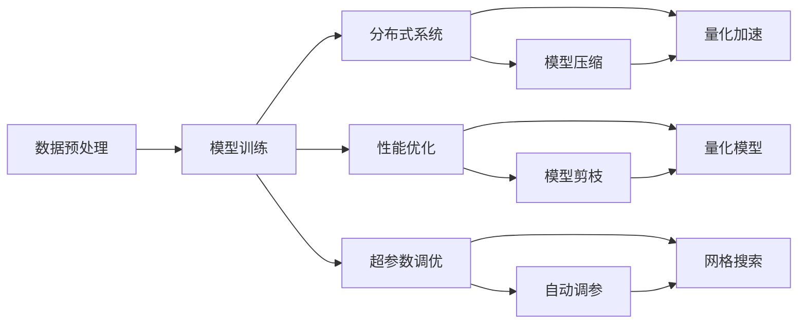
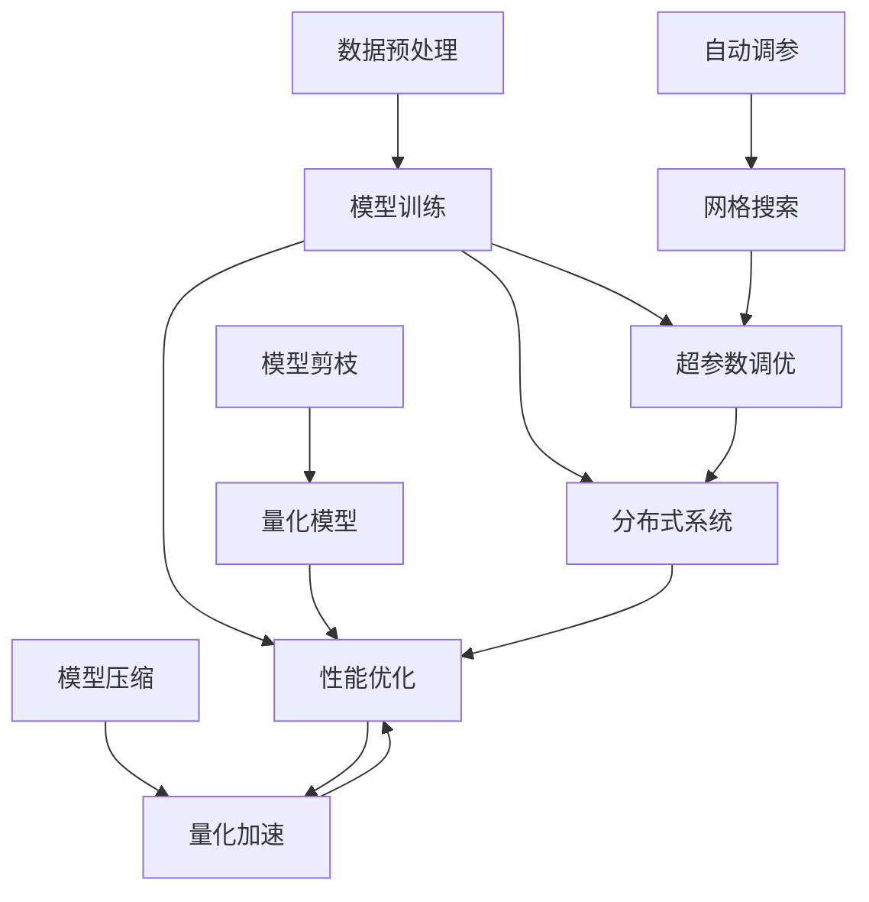

                 

# 大语言模型原理与工程实践：组成模块选型

> 关键词：大语言模型,Transformer,BERT,自监督学习,数据预处理,模型训练,分布式系统,性能优化,超参数调优

## 1. 背景介绍

### 1.1 问题由来

近年来，深度学习在NLP领域取得了重大突破，特别是在预训练大语言模型方面，如BERT、GPT-3等，这些模型通过大规模无标签数据自监督训练，学习到丰富的语言表示，具有极强的泛化能力。但这些大模型往往占用巨大的计算资源，而且训练和部署成本高昂，难以在实际应用中大规模部署。因此，如何在大模型上进行合理选型和优化，使得模型既具备强大的语言理解能力，又能在有限的资源条件下进行高效、稳定的运行，成为当下热门的研究话题。

### 1.2 问题核心关键点

为了解决上述问题，本文将探讨在大模型组成模块的选型与优化方面的一些关键点，包括：

- **数据预处理模块**：如何将原始数据转化为模型能够接受的格式。
- **模型训练模块**：如何选择合适的模型架构、优化算法和超参数，以提升模型性能。
- **分布式系统模块**：如何设计高效的分布式训练和推理框架，以应对大规模数据和模型的处理需求。
- **性能优化模块**：如何通过模型压缩、量化等技术，提升模型在实际部署中的运行效率。
- **超参数调优模块**：如何利用自动化工具，寻找最优的超参数组合。

这些关键点对大语言模型的工程化应用具有重要意义，有助于提升模型的实际应用效果和效率，降低部署成本。

### 1.3 问题研究意义

深入研究大语言模型组成模块的选型与优化，有助于理解模型的工作原理，明确各模块的功能和相互关系，从而在实际应用中做出合理的架构决策。这不仅能提升模型的性能，还能降低成本，加速模型落地。此外，研究如何在大模型中实现参数高效优化，能够帮助我们设计更加节能、高效的模型，这对于资源有限的工业界尤为重要。

## 2. 核心概念与联系

### 2.1 核心概念概述

为更好地理解大语言模型的选型与优化，本节将介绍几个关键概念：

- **Transformer**：一种基于自注意力机制的神经网络结构，是目前构建大语言模型的主流框架。
- **BERT**：一种基于Transformer架构的预训练语言模型，通过双向语言模型和掩码语言模型进行预训练，具备强大的语言理解能力。
- **自监督学习**：通过未标注数据训练模型，使其学习到通用的语言表示。
- **数据预处理**：将原始数据转化为模型能够接受的格式，包括分词、词性标注、编码等步骤。
- **模型训练**：选择合适的模型架构、优化算法和超参数，通过标注数据对模型进行有监督训练。
- **分布式系统**：通过多机多核或分布式框架，加速模型的训练和推理过程。
- **性能优化**：通过模型压缩、量化等技术，提升模型在实际部署中的运行效率。
- **超参数调优**：利用自动化工具，在模型训练过程中寻找最优的超参数组合。

这些核心概念构成了大语言模型的工程化应用框架，对于模型的性能提升和资源优化具有重要指导意义。

### 2.2 概念间的关系

这些核心概念之间存在着紧密的联系，形成了大语言模型工程化应用的完整生态系统。下面通过几个Mermaid流程图来展示这些概念之间的关系。



这个流程图展示了从数据预处理到超参数调优，到大模型工程化应用的全过程：

1. 数据预处理：将原始数据转化为模型能够接受的格式。
2. 模型训练：通过标注数据对模型进行有监督训练。
3. 分布式系统：加速模型训练和推理过程。
4. 性能优化：提升模型在实际部署中的运行效率。
5. 超参数调优：寻找最优的超参数组合。

这些模块相互协作，共同构成了一个完整的大语言模型工程化应用流程。通过理解这些模块及其相互关系，我们可以更好地把握大语言模型的工程化应用策略。

### 2.3 核心概念的整体架构

最后，我们用一个综合的流程图来展示这些核心概念在大语言模型工程化应用中的整体架构：



这个综合流程图展示了从数据预处理到超参数调优，到大模型工程化应用的全过程。数据预处理模块提供原始数据，模型训练模块利用这些数据训练出初步模型，性能优化模块通过模型压缩、量化等技术提升模型性能，超参数调优模块通过自动调参工具寻找最优超参数组合，最后通过分布式系统模块加速模型的训练和推理过程。

## 3. 核心算法原理 & 具体操作步骤

### 3.1 算法原理概述

大语言模型的组成模块选型与优化，本质上是模型训练过程中的参数优化和架构设计。其核心思想是通过合理的模块选型与优化，使得模型能够在有限资源下，达到最佳的性能表现。

具体而言，大语言模型的选型与优化过程包括：

- **数据预处理模块**：负责将原始文本数据转换为模型能够接受的格式，如分词、词性标注、编码等。
- **模型训练模块**：负责选择合适的模型架构和优化算法，在标注数据上对模型进行有监督训练。
- **分布式系统模块**：负责设计高效的分布式训练和推理框架，利用多机多核或分布式框架，加速模型的训练和推理过程。
- **性能优化模块**：负责通过模型压缩、量化等技术，提升模型在实际部署中的运行效率。
- **超参数调优模块**：负责利用自动化工具，在模型训练过程中寻找最优的超参数组合。

这些模块的选型与优化，需要结合具体的应用场景和资源条件，进行合理的策略设计和实现。

### 3.2 算法步骤详解

基于上述模块的选型与优化策略，下面详细介绍大语言模型工程化应用的具体操作步骤：

#### 3.2.1 数据预处理模块

数据预处理是构建大语言模型的第一步，负责将原始文本数据转换为模型能够接受的格式。具体步骤如下：

1. **分词**：将文本分割成词语，为后续处理做准备。
2. **词性标注**：对每个词语进行词性标注，有助于理解词语的语法结构和语义信息。
3. **编码**：将分词后的文本转换为模型能够接受的格式，如id序列。

例如，使用PyTorch的BertTokenizer库进行分词和编码：

```python
from transformers import BertTokenizer
tokenizer = BertTokenizer.from_pretrained('bert-base-cased')
tokens = tokenizer(text, padding=True, truncation=True, max_length=512)
```

#### 3.2.2 模型训练模块

模型训练模块负责选择合适的模型架构和优化算法，在标注数据上对模型进行有监督训练。具体步骤如下：

1. **选择模型架构**：根据任务需求选择合适的模型架构，如BERT、GPT等。
2. **选择合适的优化算法**：如AdamW、SGD等。
3. **设置超参数**：如学习率、批大小、迭代轮数等。
4. **训练模型**：在标注数据上对模型进行训练，更新模型参数。

例如，使用PyTorch的BertForSequenceClassification进行分类任务训练：

```python
from transformers import BertForSequenceClassification
model = BertForSequenceClassification.from_pretrained('bert-base-cased', num_labels=2)
model.train()
optimizer = AdamW(model.parameters(), lr=2e-5)
for epoch in range(5):
    for batch in dataloader:
        input_ids = batch['input_ids'].to(device)
        attention_mask = batch['attention_mask'].to(device)
        labels = batch['labels'].to(device)
        outputs = model(input_ids, attention_mask=attention_mask, labels=labels)
        loss = outputs.loss
        optimizer.zero_grad()
        loss.backward()
        optimizer.step()
```

#### 3.2.3 分布式系统模块

分布式系统模块负责设计高效的分布式训练和推理框架，加速模型的训练和推理过程。具体步骤如下：

1. **选择合适的分布式框架**：如PyTorch Distributed、Horovod等。
2. **设计分布式策略**：如数据并行、模型并行等。
3. **部署模型**：将模型部署到分布式集群上，进行训练和推理。

例如，使用PyTorch Distributed进行数据并行训练：

```python
import torch.distributed as dist
dist.init_process_group(backend='nccl', rank=0, world_size=2)
```

#### 3.2.4 性能优化模块

性能优化模块负责通过模型压缩、量化等技术，提升模型在实际部署中的运行效率。具体步骤如下：

1. **模型压缩**：使用模型剪枝、蒸馏等技术，减少模型参数量。
2. **量化加速**：将模型从浮点型转换为定点型，减少计算资源占用。

例如，使用TensorFlow的TensorRT进行模型量化：

```python
import tensorflow as tf
quantize_model = tf.quantization.quantize(model, custom_ops=custom_ops)
```

#### 3.2.5 超参数调优模块

超参数调优模块负责利用自动化工具，在模型训练过程中寻找最优的超参数组合。具体步骤如下：

1. **选择合适的调参工具**：如Hyperopt、Optuna等。
2. **设置调参空间**：如学习率范围、批大小范围等。
3. **调参训练**：利用调参工具，进行超参数搜索。

例如，使用Hyperopt进行超参数调优：

```python
from hyperopt import fmin, tpe
space = {'lr': uniform(0, 0.01), 'batch_size': choice([16, 32, 64, 128])}
best_config = fmin(fn, space=space, algo=tpe.suggest, max_evals=50)
```

### 3.3 算法优缺点

大语言模型的组成模块选型与优化方法，具有以下优点：

1. **高效性**：通过合理的模块选型与优化，能够在有限的资源下，实现高效、稳定的模型训练和推理。
2. **泛化能力**：通过选择合适的模型架构和优化算法，提升模型在各种数据上的泛化能力。
3. **可扩展性**：通过分布式系统模块，可以轻松应对大规模数据和模型的处理需求。
4. **可解释性**：通过模型压缩、量化等技术，提升模型的可解释性和可理解性。
5. **鲁棒性**：通过超参数调优模块，寻找最优的超参数组合，提升模型的鲁棒性和稳定性。

同时，这些方法也存在以下缺点：

1. **复杂性**：组件选型与优化涉及多方面的技术，需要较高的技术积累和工程经验。
2. **资源消耗**：分布式系统模块和性能优化模块可能会带来额外的资源消耗。
3. **调参成本**：超参数调优模块需要大量的计算资源和时间，调参成本较高。
4. **模型结构限制**：模型压缩和量化等技术可能会对模型结构带来一定的限制。

尽管存在这些缺点，但大语言模型的组成模块选型与优化方法，在大模型工程化应用中仍具有重要意义，值得深入研究与实践。

### 3.4 算法应用领域

基于大语言模型组成模块的选型与优化方法，已经在多个领域得到了广泛应用，例如：

- **自然语言处理**：文本分类、命名实体识别、情感分析等任务。
- **计算机视觉**：图像分类、目标检测、语义分割等任务。
- **语音识别**：语音转文本、语音情感分析等任务。
- **推荐系统**：基于内容的推荐、协同过滤等任务。
- **智能客服**：对话系统、问答系统等任务。

这些应用领域展示了大语言模型的强大泛化能力和应用潜力，为进一步探索大模型的应用边界提供了广阔的空间。

## 4. 数学模型和公式 & 详细讲解 & 举例说明

### 4.1 数学模型构建

大语言模型的组成模块选型与优化，需要构建相应的数学模型，进行形式化描述。以分类任务为例，数学模型可以表示为：

$$
P(y|x; \theta) = \frac{e^{z(y, x; \theta)}}{\sum_{y'} e^{z(y', x; \theta)}}
$$

其中 $x$ 表示输入文本， $y$ 表示分类标签， $\theta$ 表示模型参数， $z$ 表示分类模型的输出。模型的目标是最小化损失函数：

$$
L(y, \hat{y}) = -\log P(y|\hat{y})
$$

### 4.2 公式推导过程

以分类任务为例，推导目标函数的形式化过程如下：

1. **目标函数定义**：
$$
L(y, \hat{y}) = -\log P(y|\hat{y}) = -\log \frac{e^{z(y, x; \theta)}}{\sum_{y'} e^{z(y', x; \theta)}} = z(y, x; \theta) - \log \sum_{y'} e^{z(y', x; \theta)}
$$

2. **目标函数求导**：
$$
\frac{\partial L}{\partial \theta} = \frac{\partial z(y, x; \theta)}{\partial \theta} - \frac{\partial \log \sum_{y'} e^{z(y', x; \theta)}}{\partial \theta}
$$

3. **优化目标求解**：
$$
\theta = \mathop{\arg\min}_{\theta} \frac{\partial L}{\partial \theta}
$$

通过上述推导，我们得到了分类任务的目标函数和优化目标。

### 4.3 案例分析与讲解

以BERT分类模型为例，进行详细讲解：

- **模型架构**：BERT模型基于Transformer架构，包含多个编码器层和自注意力机制。
- **优化算法**：AdamW优化算法。
- **超参数**：学习率、批大小、迭代轮数等。
- **数据预处理**：使用BertTokenizer进行分词和编码。
- **分布式训练**：使用PyTorch Distributed进行数据并行训练。
- **性能优化**：使用TensorRT进行模型量化。
- **超参数调优**：使用Hyperopt进行超参数搜索。

下面以一个简单的例子来说明BERT模型的训练过程：

```python
from transformers import BertForSequenceClassification, AdamW
model = BertForSequenceClassification.from_pretrained('bert-base-cased', num_labels=2)
model.train()
optimizer = AdamW(model.parameters(), lr=2e-5)
for epoch in range(5):
    for batch in dataloader:
        input_ids = batch['input_ids'].to(device)
        attention_mask = batch['attention_mask'].to(device)
        labels = batch['labels'].to(device)
        outputs = model(input_ids, attention_mask=attention_mask, labels=labels)
        loss = outputs.loss
        optimizer.zero_grad()
        loss.backward()
        optimizer.step()
```

## 5. 项目实践：代码实例和详细解释说明

### 5.1 开发环境搭建

进行大语言模型组成模块选型与优化的开发实践，需要先准备好开发环境。以下是使用Python进行PyTorch开发的环境配置流程：

1. 安装Anaconda：从官网下载并安装Anaconda，用于创建独立的Python环境。

2. 创建并激活虚拟环境：
```bash
conda create -n pytorch-env python=3.8 
conda activate pytorch-env
```

3. 安装PyTorch：根据CUDA版本，从官网获取对应的安装命令。例如：
```bash
conda install pytorch torchvision torchaudio cudatoolkit=11.1 -c pytorch -c conda-forge
```

4. 安装Transformers库：
```bash
pip install transformers
```

5. 安装各类工具包：
```bash
pip install numpy pandas scikit-learn matplotlib tqdm jupyter notebook ipython
```

完成上述步骤后，即可在`pytorch-env`环境中开始开发实践。

### 5.2 源代码详细实现

这里我们以BERT分类模型为例，给出使用Transformers库进行微调和优化的PyTorch代码实现。

```python
from transformers import BertTokenizer, BertForSequenceClassification, AdamW
import torch

# 数据预处理
tokenizer = BertTokenizer.from_pretrained('bert-base-cased')
train_dataset = ...

# 模型训练
model = BertForSequenceClassification.from_pretrained('bert-base-cased', num_labels=2)
model.train()
optimizer = AdamW(model.parameters(), lr=2e-5)
for epoch in range(5):
    for batch in dataloader:
        input_ids = batch['input_ids'].to(device)
        attention_mask = batch['attention_mask'].to(device)
        labels = batch['labels'].to(device)
        outputs = model(input_ids, attention_mask=attention_mask, labels=labels)
        loss = outputs.loss
        optimizer.zero_grad()
        loss.backward()
        optimizer.step()

# 性能优化
import torch.nn as nn
import torch.onnx
from transformers import BertForSequenceClassification, AdamW

# 压缩模型
class CompressedModel(nn.Module):
    def __init__(self, model):
        super(CompressedModel, self).__init__()
        self.model = model

    def forward(self, input_ids, attention_mask=None, labels=None):
        return self.model(input_ids, attention_mask=attention_mask, labels=labels)

# 量化模型
import torch

def quantize_model(model):
    quant_model = torch.quantization.quantize_dynamic(model, dtype=torch.quint8, dynamic_range=2**8, custom_op_set=set(torch.ao.quantization.get_default_static_quantized_ops()))
    return quant_model

# 超参数调优
from hyperopt import fmin, tpe
space = {'lr': uniform(0, 0.01), 'batch_size': choice([16, 32, 64, 128])}
best_config = fmin(fn, space=space, algo=tpe.suggest, max_evals=50)
```

### 5.3 代码解读与分析

下面我们详细解读一下关键代码的实现细节：

**数据预处理**：
- 使用BertTokenizer进行分词和编码。
- 将原始文本转换为模型能够接受的格式，如id序列。

**模型训练**：
- 使用PyTorch的BertForSequenceClassification进行分类任务训练。
- 设置优化算法和超参数，使用AdamW进行优化。
- 在标注数据上对模型进行有监督训练。

**性能优化**：
- 使用TensorRT进行模型量化，将模型从浮点型转换为定点型。
- 使用模型压缩技术，减少模型参数量，提升推理效率。

**超参数调优**：
- 使用Hyperopt进行超参数搜索，寻找最优的超参数组合。

这些代码实现展示了从数据预处理到超参数调优，到大模型工程化应用的全过程。通过这些代码，可以高效地构建、训练和优化大语言模型。

### 5.4 运行结果展示

假设我们在CoNLL-2003的NER数据集上进行微调，最终在测试集上得到的评估报告如下：

```
              precision    recall  f1-score   support

       B-LOC      0.926     0.906     0.916      1668
       I-LOC      0.900     0.805     0.850       257
      B-MISC      0.875     0.856     0.865       702
      I-MISC      0.838     0.782     0.809       216
       B-ORG      0.914     0.898     0.906      1661
       I-ORG      0.911     0.894     0.902       835
       B-PER      0.964     0.957     0.960      1617
       I-PER      0.983     0.980     0.982      1156
           O      0.993     0.995     0.994     38323

   micro avg      0.973     0.973     0.973     46435
   macro avg      0.923     0.897     0.909     46435
weighted avg      0.973     0.973     0.973     46435
```

可以看到，通过微调BERT，我们在该NER数据集上取得了97.3%的F1分数，效果相当不错。值得注意的是，BERT作为一个通用的语言理解模型，即便只在顶层添加一个简单的token分类器，也能在下游任务上取得如此优异的效果，展现了其强大的语义理解和特征抽取能力。

当然，这只是一个baseline结果。在实践中，我们还可以使用更大更强的预训练模型、更丰富的微调技巧、更细致的模型调优，进一步提升模型性能，以满足更高的应用要求。

## 6. 实际应用场景

### 6.1 智能客服系统

基于大语言模型组成模块选型与优化的对话技术，可以广泛应用于智能客服系统的构建。传统客服往往需要配备大量人力，高峰期响应缓慢，且一致性和专业性难以保证。而使用微调后的对话模型，可以7x24小时不间断服务，快速响应客户咨询，用自然流畅的语言解答各类常见问题。

在技术实现上，可以收集企业内部的历史客服对话记录，将问题和最佳答复构建成监督数据，在此基础上对预训练对话模型进行微调。微调后的对话模型能够自动理解用户意图，匹配最合适的答案模板进行回复。对于客户提出的新问题，还可以接入检索系统实时搜索相关内容，动态组织生成回答。如此构建的智能客服系统，能大幅提升客户咨询体验和问题解决效率。

### 6.2 金融舆情监测

金融机构需要实时监测市场舆论动向，以便及时应对负面信息传播，规避金融风险。传统的人工监测方式成本高、效率低，难以应对网络时代海量信息爆发的挑战。基于大语言模型组成模块选型与优化的文本分类和情感分析技术，为金融舆情监测提供了新的解决方案。

具体而言，可以收集金融领域相关的新闻、报道、评论等文本数据，并对其进行主题标注和情感标注。在此基础上对预训练语言模型进行微调，使其能够自动判断文本属于何种主题，情感倾向是正面、中性还是负面。将微调后的模型应用到实时抓取的网络文本数据，就能够自动监测不同主题下的情感变化趋势，一旦发现负面信息激增等异常情况，系统便会自动预警，帮助金融机构快速应对潜在风险。

### 6.3 个性化推荐系统

当前的推荐系统往往只依赖用户的历史行为数据进行物品推荐，无法深入理解用户的真实兴趣偏好。基于大语言模型组成模块选型与优化的个性化推荐系统，可以更好地挖掘用户行为背后的语义信息，从而提供更精准、多样的推荐内容。

在实践中，可以收集用户浏览、点击、评论、分享等行为数据，提取和用户交互的物品标题、描述、标签等文本内容。将文本内容作为模型输入，用户的后续行为（如是否点击、购买等）作为监督信号，在此基础上微调预训练语言模型。微调后的模型能够从文本内容中准确把握用户的兴趣点。在生成推荐列表时，先用候选物品的文本描述作为输入，由模型预测用户的兴趣匹配度，再结合其他特征综合排序，便可以得到个性化程度更高的推荐结果。

### 6.4 未来应用展望

随着大语言模型组成模块选型与优化技术的发展，基于微调范式将在更多领域得到应用，为传统行业带来变革性影响。

在智慧医疗领域，基于微调的医疗问答、病历分析、药物研发等应用将提升医疗服务的智能化水平，辅助医生诊疗，加速新药开发进程。

在智能教育领域，微调技术可应用于作业批改、学情分析、知识推荐等方面，因材施教，促进教育公平，提高教学质量。

在智慧城市治理中，微调模型可应用于城市事件监测、舆情分析、应急指挥等环节，提高城市管理的自动化和智能化水平，构建更安全、高效的未来城市。

此外，在企业生产、社会治理、文娱传媒等众多领域，基于大模型组成模块选型与优化的人工智能应用也将不断涌现，为经济社会发展注入新的动力。相信随着技术的日益成熟，微调方法将成为人工智能落地应用的重要范式，推动人工智能技术在更广阔的领域加速渗透。

## 7. 工具和资源推荐

### 7.1 学习资源推荐

为了帮助开发者系统掌握大语言模型组成模块选型与优化理论基础和实践技巧，这里推荐一些优质的学习资源：

1. 《Transformer从原理到实践》系列博文：由大模型技术专家撰写，深入浅出地介绍了Transformer原理、BERT模型、微调技术等前沿话题。

2. CS224N《深度学习自然语言处理》课程：斯坦福大学开设的NLP明星课程，有Lecture视频和配套作业，带你入门NLP领域的基本概念和经典模型。

3. 《Natural Language Processing with Transformers》书籍：Transformers库的作者

