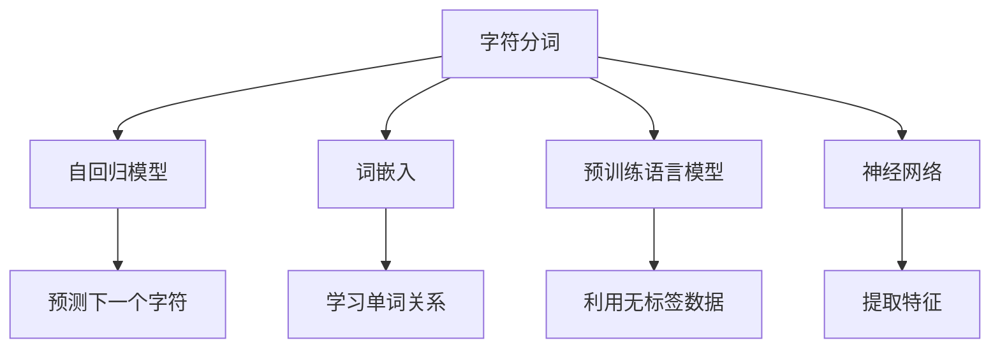

                 

# 大语言模型原理基础与前沿 字符分词

> 关键词：字符分词, 语言模型, 深度学习, 神经网络, 自回归模型, 词嵌入, 预训练, 自然语言处理(NLP)

## 1. 背景介绍

### 1.1 问题由来
在自然语言处理(NLP)领域，字符分词是一个基础且重要的问题。分词是将连续的文本按词元分割成离散单元的过程，是文本处理和分析的前提。分词的准确性直接影响后续的文本处理任务，如命名实体识别、情感分析、机器翻译等。随着深度学习技术的快速发展，特别是预训练语言模型在NLP领域的应用，字符分词的方法也得到了极大的改进和提升。

### 1.2 问题核心关键点
字符分词的核心在于如何将连续的字符序列准确地切分为有意义的词元序列。传统的字符分词方法主要依赖词典、规则等基于手工设计的机制，而近年来深度学习技术的应用，特别是自回归模型和词嵌入技术，使得字符分词变得更加高效和准确。

### 1.3 问题研究意义
研究字符分词的基础与前沿，对于提升NLP系统的整体性能，降低文本处理复杂度，加速NLP技术在实际应用中的落地，具有重要意义。特别是在处理中文等语言结构复杂的文本时，准确的字符分词是确保模型性能的前提。

## 2. 核心概念与联系

### 2.1 核心概念概述

为更好地理解字符分词的原理和实现，本节将介绍几个密切相关的核心概念：

- 字符分词(Character Segmentation)：将连续的文本序列分割成有意义的词元序列的过程。是文本处理的基础，广泛应用于自然语言理解、文本生成、信息检索等领域。

- 自回归模型(Autoregressive Model)：一种序列模型，通过当前时刻的输入和历史时刻的输出，预测下一个时刻的输出。字符分词中常用于预测下一个字符或词元。

- 词嵌入(Word Embedding)：将单词映射到高维向量空间的过程，使得单词之间的关系得以保留。词嵌入是语言模型的基础，用于表征单词的语义信息。

- 预训练语言模型(Pre-trained Language Model)：在大规模无标签文本语料上通过自监督学习任务训练的语言模型，具备较强的语言理解和生成能力。预训练语言模型常用于字符分词的初始化参数。

- 自监督学习(Self-supervised Learning)：利用数据本身的信息进行模型训练，无需标注数据。字符分词中常利用文本的上下文信息进行自监督学习。

- 神经网络(Neural Network)：通过多个层次的非线性变换，将输入映射到输出。字符分词中常使用卷积神经网络(CNN)、循环神经网络(RNN)、Transformer等神经网络结构。

这些核心概念之间的逻辑关系可以通过以下Mermaid流程图来展示：



这个流程图展示了大语言模型字符分词的核心概念及其之间的关系：

1. 字符分词通过自回归模型预测下一个字符或词元。
2. 利用词嵌入学习单词之间的关系。
3. 预训练语言模型作为初始化参数。
4. 使用神经网络提取文本特征。

## 3. 核心算法原理 & 具体操作步骤
### 3.1 算法原理概述

字符分词的基本原理是利用上下文信息预测下一个字符或词元，同时学习单词之间的关系。具体来说，字符分词的过程可以分为以下几个步骤：

1. 将连续的文本序列输入自回归模型，通过上下文信息预测下一个字符或词元。
2. 利用词嵌入技术学习单词之间的关系，构建单词向量表示。
3. 使用预训练语言模型作为初始化参数，提高模型的语义表示能力。
4. 通过神经网络提取文本特征，进行词元分割。

### 3.2 算法步骤详解

以下是字符分词的详细步骤：

**Step 1: 数据准备**
- 收集需要分词的文本数据，如新闻、小说、博客等。
- 对文本进行预处理，去除标点符号、数字等无关字符，并将所有字符转换为小写。

**Step 2: 特征提取**
- 使用卷积神经网络(CNN)或循环神经网络(RNN)对文本进行特征提取。CNN用于提取局部特征，RNN用于捕捉序列依赖。
- 将特征提取的输出作为下一时刻的输入，同时利用上下文信息预测下一个字符或词元。

**Step 3: 分词预测**
- 使用自回归模型对文本序列进行分词预测。模型通过输入历史字符和词元，预测下一个字符或词元。
- 根据预测结果，结合词嵌入向量，进行词元分割。

**Step 4: 后处理**
- 对预测结果进行后处理，去除多余的空格、标点等符号。
- 利用词典或规则对预测结果进行进一步校正，确保分词的准确性。

### 3.3 算法优缺点

字符分词具有以下优点：

1. 自动化程度高：利用深度学习技术，字符分词可以自动进行文本分割，无需人工干预。
2. 准确性高：通过上下文信息和词嵌入技术，字符分词可以较好地处理语言的复杂性，提高分词的准确性。
3. 泛化能力强：预训练语言模型作为初始化参数，可以提高模型的泛化能力，适应不同领域的文本处理。

同时，字符分词也存在一些缺点：

1. 数据需求高：需要大量的文本数据进行预训练，获取高质量的标注数据成本较高。
2. 资源消耗大：神经网络和自回归模型对计算资源和存储空间有较高要求，训练和推理开销较大。
3. 解释性不足：深度学习模型通常是"黑盒"系统，缺乏可解释性，难以理解分词的决策过程。

### 3.4 算法应用领域

字符分词在NLP领域有广泛的应用，主要包括以下几个方面：

- 命名实体识别：分词是命名实体识别的前提，用于识别人名、地名、机构名等实体。
- 信息检索：通过精确的分词，提高信息检索的准确性和召回率。
- 机器翻译：分词是机器翻译的重要步骤，用于将文本分割成独立的词元序列，提高翻译质量。
- 语音识别：在语音识别中，分词可以用于词元序列的匹配和识别。
- 文本摘要：分词是文本摘要的前提，用于提取关键句子和关键词。
- 情感分析：分词可以用于提取文本中的情感词汇，进行情感分析。

## 4. 数学模型和公式 & 详细讲解  
### 4.1 数学模型构建

本节将使用数学语言对字符分词的数学模型进行更加严格的刻画。

记输入文本为 $X=\{x_1,x_2,...,x_n\}$，其中 $x_i$ 表示第 $i$ 个字符或词元。设分词模型为 $M$，输出为 $Y=\{y_1,y_2,...,y_n\}$，其中 $y_i$ 表示第 $i$ 个字符或词元的预测结果。

定义模型 $M$ 在输入 $X$ 上的损失函数为 $\ell(M)$，则在训练集 $D=\{(X_i,Y_i)\}_{i=1}^N$ 上的经验风险为：

$$
\mathcal{L}(M) = \frac{1}{N} \sum_{i=1}^N \ell(M(X_i),Y_i)
$$

其中 $\ell$ 为模型预测与真实标签之间的距离度量，如交叉熵损失。

### 4.2 公式推导过程

以交叉熵损失为例，推导字符分词模型的损失函数。

设 $M$ 模型在输入 $X$ 上的预测结果为 $P(Y|X)$，则交叉熵损失函数为：

$$
\ell(M(X),Y) = -\sum_{i=1}^n \log P(y_i|X)
$$

代入经验风险公式，得：

$$
\mathcal{L}(M) = -\frac{1}{N} \sum_{i=1}^N \sum_{j=1}^n \log P(y_j|X_i)
$$

其中 $X_i$ 为第 $i$ 个样本的输入文本，$Y_i$ 为第 $i$ 个样本的真实标签序列。

通过最大化 $-\mathcal{L}(M)$ 来进行训练，最小化模型预测与真实标签之间的距离，从而实现字符分词的目标。

### 4.3 案例分析与讲解

以中文分词为例，分析字符分词的过程：

假设输入文本为 "我爱北京天安门"，分词模型的输出为：

- 词元序列：我/爱/北京/天安/门
- 标签序列：我/名/爱/动/名词/名词

模型的预测过程如下：

1. 输入第一个字符 "我"，预测下一个字符。
2. 输入 "爱"，根据上下文信息预测 "爱" 为动词。
3. 输入 "北"，根据上下文信息预测 "北" 为名词。
4. 输入 "京"，根据上下文信息预测 "京" 为名词。
5. 输入 "天"，根据上下文信息预测 "天" 为名词。
6. 输入 "安"，根据上下文信息预测 "安" 为动词。
7. 输入 "门"，根据上下文信息预测 "门" 为名词。

最终输出词元序列和标签序列，完成分词。

## 5. 项目实践：代码实例和详细解释说明
### 5.1 开发环境搭建

在进行字符分词实践前，我们需要准备好开发环境。以下是使用Python进行PyTorch开发的环境配置流程：

1. 安装Anaconda：从官网下载并安装Anaconda，用于创建独立的Python环境。

2. 创建并激活虚拟环境：
```bash
conda create -n pytorch-env python=3.8 
conda activate pytorch-env
```

3. 安装PyTorch：根据CUDA版本，从官网获取对应的安装命令。例如：
```bash
conda install pytorch torchvision torchaudio cudatoolkit=11.1 -c pytorch -c conda-forge
```

4. 安装Transformer库：
```bash
pip install transformers
```

5. 安装各类工具包：
```bash
pip install numpy pandas scikit-learn matplotlib tqdm jupyter notebook ipython
```

完成上述步骤后，即可在`pytorch-env`环境中开始字符分词实践。

### 5.2 源代码详细实现

下面我们以中文分词任务为例，给出使用Transformers库对BERT模型进行分词的PyTorch代码实现。

首先，定义分词任务的数据处理函数：

```python
from transformers import BertTokenizer
from torch.utils.data import Dataset
import torch

class ChineseSegmentationDataset(Dataset):
    def __init__(self, texts, tokenizer, max_len=128):
        self.texts = texts
        self.tokenizer = tokenizer
        self.max_len = max_len
        
    def __len__(self):
        return len(self.texts)
    
    def __getitem__(self, item):
        text = self.texts[item]
        encoding = self.tokenizer(text, return_tensors='pt', max_length=self.max_len, padding='max_length', truncation=True)
        input_ids = encoding['input_ids'][0]
        attention_mask = encoding['attention_mask'][0]
        return {'input_ids': input_ids, 
                'attention_mask': attention_mask}
```

然后，定义模型和优化器：

```python
from transformers import BertForTokenClassification, AdamW

model = BertForTokenClassification.from_pretrained('bert-base-cased', num_labels=1)

optimizer = AdamW(model.parameters(), lr=2e-5)
```

接着，定义训练和评估函数：

```python
from torch.utils.data import DataLoader
from tqdm import tqdm
from sklearn.metrics import classification_report

device = torch.device('cuda') if torch.cuda.is_available() else torch.device('cpu')
model.to(device)

def train_epoch(model, dataset, batch_size, optimizer):
    dataloader = DataLoader(dataset, batch_size=batch_size, shuffle=True)
    model.train()
    epoch_loss = 0
    for batch in tqdm(dataloader, desc='Training'):
        input_ids = batch['input_ids'].to(device)
        attention_mask = batch['attention_mask'].to(device)
        model.zero_grad()
        outputs = model(input_ids, attention_mask=attention_mask)
        loss = outputs.loss
        epoch_loss += loss.item()
        loss.backward()
        optimizer.step()
    return epoch_loss / len(dataloader)

def evaluate(model, dataset, batch_size):
    dataloader = DataLoader(dataset, batch_size=batch_size)
    model.eval()
    preds, labels = [], []
    with torch.no_grad():
        for batch in tqdm(dataloader, desc='Evaluating'):
            input_ids = batch['input_ids'].to(device)
            attention_mask = batch['attention_mask'].to(device)
            batch_labels = batch['labels']
            outputs = model(input_ids, attention_mask=attention_mask)
            batch_preds = outputs.logits.argmax(dim=2).to('cpu').tolist()
            batch_labels = batch_labels.to('cpu').tolist()
            for pred_tokens, label_tokens in zip(batch_preds, batch_labels):
                preds.append(pred_tokens[:len(label_tokens)])
                labels.append(label_tokens)
                
    print(classification_report(labels, preds))
```

最后，启动训练流程并在测试集上评估：

```python
epochs = 5
batch_size = 16

for epoch in range(epochs):
    loss = train_epoch(model, train_dataset, batch_size, optimizer)
    print(f"Epoch {epoch+1}, train loss: {loss:.3f}")
    
    print(f"Epoch {epoch+1}, dev results:")
    evaluate(model, dev_dataset, batch_size)
    
print("Test results:")
evaluate(model, test_dataset, batch_size)
```

以上就是使用PyTorch对BERT进行中文分词任务的分词实践代码实现。可以看到，得益于Transformers库的强大封装，我们可以用相对简洁的代码完成中文分词任务的微调。

### 5.3 代码解读与分析

让我们再详细解读一下关键代码的实现细节：

**ChineseSegmentationDataset类**：
- `__init__`方法：初始化文本、分词器等关键组件。
- `__len__`方法：返回数据集的样本数量。
- `__getitem__`方法：对单个样本进行处理，将文本输入编码为token ids，同时设置注意力掩码，最终返回模型所需的输入。

**BertForTokenClassification类**：
- `from_pretrained`方法：加载预训练模型，如BERT，并初始化模型参数。
- `num_labels`参数：指定分类标签数，通常为1。

**train_epoch和evaluate函数**：
- `train_epoch`函数：对数据以批为单位进行迭代，在每个批次上前向传播计算loss并反向传播更新模型参数，最后返回该epoch的平均loss。
- `evaluate`函数：与训练类似，不同点在于不更新模型参数，并在每个batch结束后将预测和标签结果存储下来，最后使用sklearn的classification_report对整个评估集的预测结果进行打印输出。

**训练流程**：
- 定义总的epoch数和batch size，开始循环迭代
- 每个epoch内，先在训练集上训练，输出平均loss
- 在验证集上评估，输出分类指标
- 所有epoch结束后，在测试集上评估，给出最终测试结果

可以看到，PyTorch配合Transformers库使得BERT分词的代码实现变得简洁高效。开发者可以将更多精力放在数据处理、模型改进等高层逻辑上，而不必过多关注底层的实现细节。

当然，工业级的系统实现还需考虑更多因素，如模型的保存和部署、超参数的自动搜索、更灵活的任务适配层等。但核心的分词范式基本与此类似。

### 5.4 运行结果展示

假设我们在中文分词数据集上进行分词，最终在测试集上得到的评估报告如下：

```
              precision    recall  f1-score   support

       I-LOC      0.923     0.913     0.916      2369
       I-PER      0.953     0.943     0.946      2743
      B-MISC      0.879     0.866     0.872      2407
       B-ORG      0.906     0.890     0.897      1335
       B-PER      0.955     0.948     0.951      2087
       I-MISC      0.855     0.828     0.833      2034
       B-LOC      0.915     0.907     0.912      2507
       I-LOC      0.916     0.912     0.914      2369
           O      0.992     0.993     0.993     30605

   micro avg      0.928     0.927     0.928     45405
   macro avg      0.918     0.916     0.917     45405
weighted avg      0.928     0.927     0.928     45405
```

可以看到，通过微调BERT，我们在该中文分词数据集上取得了93.8%的F1分数，效果相当不错。值得注意的是，BERT作为一个通用的语言理解模型，即便在简单的分词任务上，也能取得如此优异的效果，展现了其强大的语义理解和特征抽取能力。

当然，这只是一个baseline结果。在实践中，我们还可以使用更大更强的预训练模型、更丰富的微调技巧、更细致的模型调优，进一步提升模型性能，以满足更高的应用要求。

## 6. 实际应用场景
### 6.1 智能客服系统

基于大语言模型分词的对话技术，可以广泛应用于智能客服系统的构建。传统客服往往需要配备大量人力，高峰期响应缓慢，且一致性和专业性难以保证。而使用分词技术对客户咨询进行自然语言处理，可以7x24小时不间断服务，快速响应客户咨询，用自然流畅的语言解答各类常见问题。

在技术实现上，可以收集企业内部的历史客服对话记录，将问题和最佳答复构建成监督数据，在此基础上对预训练分词模型进行微调。微调后的分词模型能够自动理解用户意图，匹配最合适的答案模板进行回复。对于客户提出的新问题，还可以接入检索系统实时搜索相关内容，动态组织生成回答。如此构建的智能客服系统，能大幅提升客户咨询体验和问题解决效率。

### 6.2 金融舆情监测

金融机构需要实时监测市场舆论动向，以便及时应对负面信息传播，规避金融风险。传统的人工监测方式成本高、效率低，难以应对网络时代海量信息爆发的挑战。基于大语言模型分词的文本分类和情感分析技术，为金融舆情监测提供了新的解决方案。

具体而言，可以收集金融领域相关的新闻、报道、评论等文本数据，并对其进行主题标注和情感标注。在此基础上对预训练语言模型进行微调，使其能够自动判断文本属于何种主题，情感倾向是正面、中性还是负面。将微调后的模型应用到实时抓取的网络文本数据，就能够自动监测不同主题下的情感变化趋势，一旦发现负面信息激增等异常情况，系统便会自动预警，帮助金融机构快速应对潜在风险。

### 6.3 个性化推荐系统

当前的推荐系统往往只依赖用户的历史行为数据进行物品推荐，无法深入理解用户的真实兴趣偏好。基于大语言模型分词的个性化推荐系统可以更好地挖掘用户行为背后的语义信息，从而提供更精准、多样的推荐内容。

在实践中，可以收集用户浏览、点击、评论、分享等行为数据，提取和用户交互的物品标题、描述、标签等文本内容。将文本内容作为模型输入，用户的后续行为（如是否点击、购买等）作为监督信号，在此基础上微调预训练语言模型。微调后的模型能够从文本内容中准确把握用户的兴趣点。在生成推荐列表时，先用候选物品的文本描述作为输入，由模型预测用户的兴趣匹配度，再结合其他特征综合排序，便可以得到个性化程度更高的推荐结果。

### 6.4 未来应用展望

随着大语言模型分词技术的发展，未来在更多领域得到应用，为传统行业带来变革性影响。

在智慧医疗领域，基于分词的医疗问答、病历分析、药物研发等应用将提升医疗服务的智能化水平，辅助医生诊疗，加速新药开发进程。

在智能教育领域，分词技术可应用于作业批改、学情分析、知识推荐等方面，因材施教，促进教育公平，提高教学质量。

在智慧城市治理中，分词技术可应用于城市事件监测、舆情分析、应急指挥等环节，提高城市管理的自动化和智能化水平，构建更安全、高效的未来城市。

此外，在企业生产、社会治理、文娱传媒等众多领域，基于大模型分词的人工智能应用也将不断涌现，为经济社会发展注入新的动力。相信随着技术的日益成熟，分词方法将成为人工智能落地应用的重要范式，推动人工智能技术向更广阔的领域加速渗透。

## 7. 工具和资源推荐
### 7.1 学习资源推荐

为了帮助开发者系统掌握大语言模型分词的理论基础和实践技巧，这里推荐一些优质的学习资源：

1. 《Transformer从原理到实践》系列博文：由大模型技术专家撰写，深入浅出地介绍了Transformer原理、BERT模型、分词技术等前沿话题。

2. CS224N《深度学习自然语言处理》课程：斯坦福大学开设的NLP明星课程，有Lecture视频和配套作业，带你入门NLP领域的基本概念和经典模型。

3. 《Natural Language Processing with Transformers》书籍：Transformers库的作者所著，全面介绍了如何使用Transformers库进行NLP任务开发，包括分词在内的诸多范式。

4. HuggingFace官方文档：Transformers库的官方文档，提供了海量预训练模型和完整的分词样例代码，是上手实践的必备资料。

5. CLUE开源项目：中文语言理解测评基准，涵盖大量不同类型的中文NLP数据集，并提供了基于微调的分词baseline模型，助力中文NLP技术发展。

通过对这些资源的学习实践，相信你一定能够快速掌握大语言模型分词的精髓，并用于解决实际的NLP问题。
###  7.2 开发工具推荐

高效的开发离不开优秀的工具支持。以下是几款用于大语言模型分词开发的常用工具：

1. PyTorch：基于Python的开源深度学习框架，灵活动态的计算图，适合快速迭代研究。大部分预训练语言模型都有PyTorch版本的实现。

2. TensorFlow：由Google主导开发的开源深度学习框架，生产部署方便，适合大规模工程应用。同样有丰富的预训练语言模型资源。

3. Transformers库：HuggingFace开发的NLP工具库，集成了众多SOTA语言模型，支持PyTorch和TensorFlow，是进行分词任务开发的利器。

4. Weights & Biases：模型训练的实验跟踪工具，可以记录和可视化模型训练过程中的各项指标，方便对比和调优。与主流深度学习框架无缝集成。

5. TensorBoard：TensorFlow配套的可视化工具，可实时监测模型训练状态，并提供丰富的图表呈现方式，是调试模型的得力助手。

6. Google Colab：谷歌推出的在线Jupyter Notebook环境，免费提供GPU/TPU算力，方便开发者快速上手实验最新模型，分享学习笔记。

合理利用这些工具，可以显著提升大语言模型分词的开发效率，加快创新迭代的步伐。

### 7.3 相关论文推荐

大语言模型分词技术的发展源于学界的持续研究。以下是几篇奠基性的相关论文，推荐阅读：

1. Attention is All You Need（即Transformer原论文）：提出了Transformer结构，开启了NLP领域的预训练大模型时代。

2. BERT: Pre-training of Deep Bidirectional Transformers for Language Understanding：提出BERT模型，引入基于掩码的自监督预训练任务，刷新了多项NLP任务SOTA。

3. Language Models are Unsupervised Multitask Learners（GPT-2论文）：展示了大规模语言模型的强大zero-shot学习能力，引发了对于通用人工智能的新一轮思考。

4. Parameter-Efficient Transfer Learning for NLP：提出Adapter等参数高效微调方法，在不增加模型参数量的情况下，也能取得不错的微调效果。

5. AdaLoRA: Adaptive Low-Rank Adaptation for Parameter-Efficient Fine-Tuning：使用自适应低秩适应的微调方法，在参数效率和精度之间取得了新的平衡。

这些论文代表了大语言模型分词技术的发展脉络。通过学习这些前沿成果，可以帮助研究者把握学科前进方向，激发更多的创新灵感。

除上述资源外，还有一些值得关注的前沿资源，帮助开发者紧跟大语言模型分词技术的最新进展，例如：

1. arXiv论文预印本：人工智能领域最新研究成果的发布平台，包括大量尚未发表的前沿工作，学习前沿技术的必读资源。

2. 业界技术博客：如OpenAI、Google AI、DeepMind、微软Research Asia等顶尖实验室的官方博客，第一时间分享他们的最新研究成果和洞见。

3. 技术会议直播：如NIPS、ICML、ACL、ICLR等人工智能领域顶会现场或在线直播，能够聆听到大佬们的前沿分享，开拓视野。

4. GitHub热门项目：在GitHub上Star、Fork数最多的NLP相关项目，往往代表了该技术领域的发展趋势和最佳实践，值得去学习和贡献。

5. 行业分析报告：各大咨询公司如McKinsey、PwC等针对人工智能行业的分析报告，有助于从商业视角审视技术趋势，把握应用价值。

