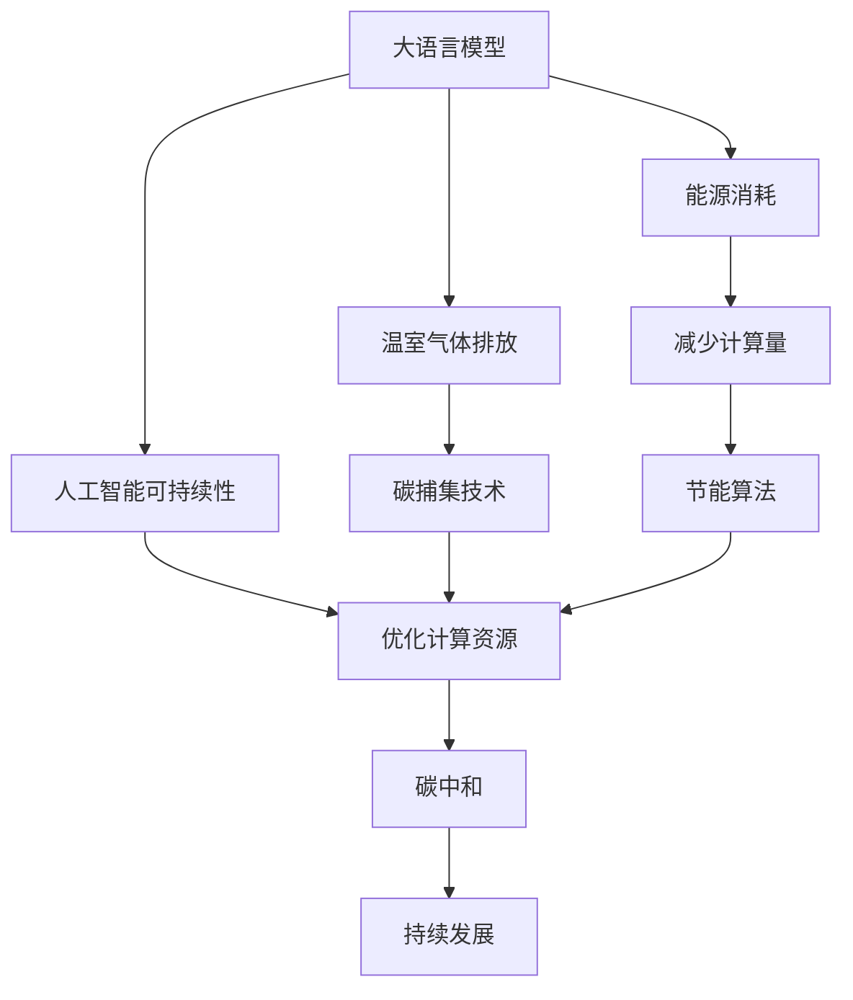
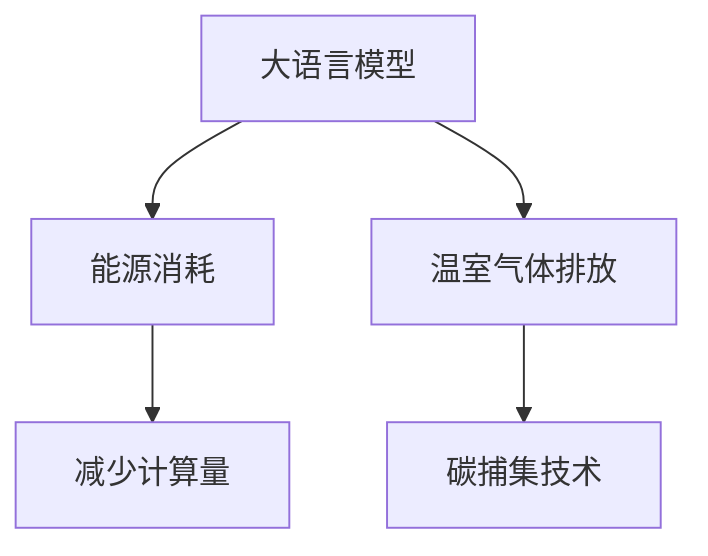
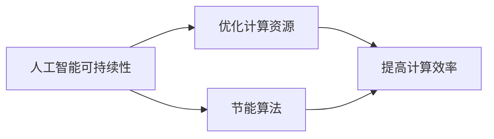
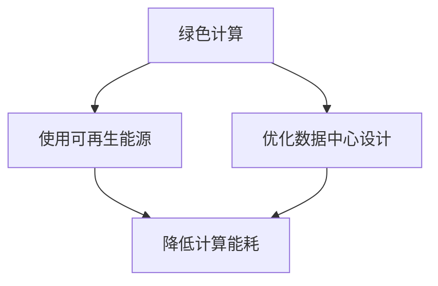
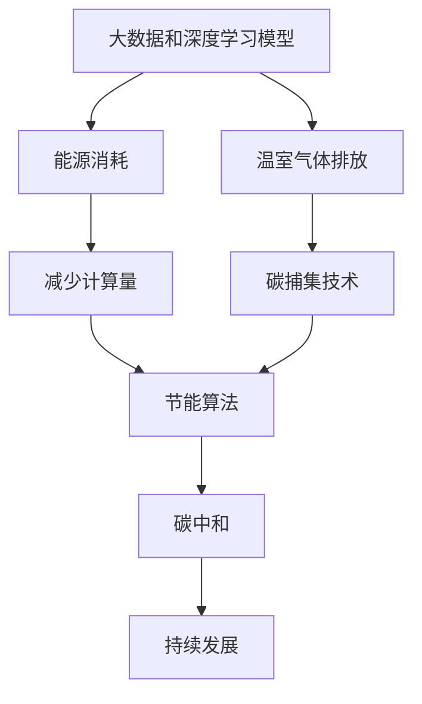

                 

# 大语言模型原理基础与前沿 能源消耗和温室气体排放

> 关键词：大语言模型, 能源消耗, 温室气体排放, 环境影响, 人工智能可持续性, 碳中和, 绿色计算

## 1. 背景介绍

### 1.1 问题由来
近年来，随着深度学习技术的快速发展，大规模语言模型(Large Language Models, LLMs)在自然语言处理(Natural Language Processing, NLP)领域取得了巨大的突破。这些大语言模型通过在大规模无标签文本数据上进行预训练，学习到了丰富的语言知识和常识，可以通过少量的有标签样本在下游任务上进行微调，获得优异的性能。

然而，由于预训练语料的广泛性和泛化能力的不足，这些通用的大语言模型在特定领域应用时，效果往往难以达到实际应用的要求。因此，如何针对特定任务进行大模型微调，提升模型性能，成为了当前大语言模型研究和应用的一个热点问题。

与此同时，全球正面临严峻的气候变化挑战。减少能源消耗和温室气体排放，实现碳中和，是各国共同追求的目标。在此背景下，如何设计出节能环保的大语言模型，并推动其实现节能减排，成为一个亟需解决的问题。

### 1.2 问题核心关键点
本文聚焦于大语言模型的能源消耗和温室气体排放问题，探讨如何在提升模型性能的同时，兼顾节能减排的环保目标。这不仅是技术层面的挑战，也是社会责任和可持续发展的重要课题。

## 2. 核心概念与联系

### 2.1 核心概念概述

为更好地理解大语言模型与环境影响的联系，本节将介绍几个密切相关的核心概念：

- 大语言模型(Large Language Model, LLM)：以自回归(如GPT)或自编码(如BERT)模型为代表的大规模预训练语言模型。通过在大规模无标签文本语料上进行预训练，学习通用的语言表示，具备强大的语言理解和生成能力。

- 能源消耗和温室气体排放：大数据和深度学习模型的计算过程，尤其是训练和推理过程中的能源消耗和碳足迹，对环境造成了巨大影响。

- 人工智能可持续性：强调技术在开发、使用和废弃过程中，对环境、社会和经济的长期影响，追求与自然和谐共存的目标。

- 碳中和：通过各种措施，如减排、碳捕集、碳交易等，实现碳排放与吸收的平衡，达到净零排放。

- 绿色计算：使用可再生能源、提高计算效率、优化数据中心设计等手段，减少计算过程对环境的影响。

这些核心概念之间的逻辑关系可以通过以下Mermaid流程图来展示：



这个流程图展示了大语言模型与环境影响的各个关键要素及其相互关系：

1. 大语言模型在训练和推理过程中会产生大量的能源消耗和温室气体排放。
2. 通过优化计算资源和算法，可以降低能源消耗和碳足迹。
3. 应用碳捕集和碳中和技术，可以实现零排放目标。
4. 追求人工智能的可持续性，需要在各个环节考虑环境因素。

### 2.2 概念间的关系

这些核心概念之间存在着紧密的联系，形成了大语言模型与环境影响的完整生态系统。下面我通过几个Mermaid流程图来展示这些概念之间的关系。

#### 2.2.1 大语言模型的环境影响



这个流程图展示了大语言模型在计算过程中产生的环境影响及其缓解方法：

1. 大语言模型的训练和推理涉及大量计算，消耗大量能源。
2. 通过减少计算量和应用碳捕集技术，可以降低其对环境的影响。

#### 2.2.2 人工智能可持续性的实现



这个流程图展示了如何通过优化计算资源和算法，实现人工智能的可持续性：

1. 优化计算资源可以显著减少能源消耗和碳足迹。
2. 应用节能算法进一步提高计算效率，降低环境影响。

#### 2.2.3 绿色计算的具体措施



这个流程图展示了绿色计算的具体措施：

1. 使用可再生能源是绿色计算的基础。
2. 优化数据中心设计可以进一步降低计算能耗。

### 2.3 核心概念的整体架构

最后，我们用一个综合的流程图来展示这些核心概念在大语言模型与环境影响中的整体架构：



这个综合流程图展示了从模型构建到实现节能减排的完整过程：

1. 大数据和深度学习模型的计算过程中会产生大量的能源消耗和温室气体排放。
2. 通过减少计算量、应用碳捕集技术和节能算法，可以降低模型的环境影响。
3. 最终实现碳中和和持续发展目标。

## 3. 核心算法原理 & 具体操作步骤
### 3.1 算法原理概述

大语言模型的能源消耗和温室气体排放主要源于大规模模型的计算复杂度和数据传输带宽需求。在模型训练和推理过程中，大量的计算资源被消耗，导致大量的能源消耗和碳排放。此外，模型的大小和复杂度也会显著影响其能耗和碳足迹。

因此，设计节能环保的大语言模型，需要从算法和系统两个层面进行优化。在算法层面，可以通过参数高效微调、对抗训练、知识蒸馏等技术，减少计算量，提高模型的效率和泛化能力。在系统层面，可以采用分布式训练、模型压缩、优化数据中心设计等方法，降低能源消耗和碳排放。

### 3.2 算法步骤详解

#### 3.2.1 参数高效微调

参数高效微调(Parameter-Efficient Fine-Tuning, PEFT)是一种在微调过程中只更新少量模型参数的方法。与传统的全参数微调不同，PEFT方法保留预训练模型的大部分权重，仅更新顶层或特定的任务相关层，以减少计算量，降低能源消耗和碳排放。

步骤如下：
1. 选择合适的预训练语言模型 $M_{\theta}$ 作为初始化参数，如 BERT、GPT 等。
2. 准备下游任务 $T$ 的少量标注数据集 $D=\{(x_i,y_i)\}_{i=1}^N$，其中 $x_i$ 为输入文本，$y_i$ 为对应的标签。
3. 在预训练模型的顶层设计任务适配层，如添加线性分类器或解码器，以适应下游任务 $T$。
4. 设置微调超参数，包括学习率、批大小、迭代轮数等。
5. 执行梯度训练，更新模型参数。具体步骤如下：
   1. 将训练集数据分批次输入模型，前向传播计算损失函数。
   2. 反向传播计算参数梯度，根据设定的优化算法和学习率更新模型参数。
   3. 周期性在验证集上评估模型性能，根据性能指标决定是否触发 Early Stopping。
   4. 重复上述步骤直到满足预设的迭代轮数或 Early Stopping 条件。

#### 3.2.2 对抗训练

对抗训练(Adversarial Training)通过引入对抗样本，提高模型鲁棒性，同时减少计算量。具体步骤如下：
1. 准备下游任务 $T$ 的少量标注数据集 $D=\{(x_i,y_i)\}_{i=1}^N$。
2. 在预训练模型的顶层设计任务适配层。
3. 设置微调超参数，包括学习率、批大小、迭代轮数等。
4. 在每个批次中，随机生成对抗样本并加入训练数据中，与真实样本一起进行前向传播和反向传播。
5. 周期性在验证集上评估模型性能，根据性能指标决定是否触发 Early Stopping。
6. 重复上述步骤直到满足预设的迭代轮数或 Early Stopping 条件。

#### 3.2.3 知识蒸馏

知识蒸馏(Knowledge Distillation)是一种将知识从大型预训练模型传递到较小模型的方法。通过知识蒸馏，可以降低模型的计算复杂度和能耗，同时保留预训练模型的泛化能力。具体步骤如下：
1. 选择合适的预训练语言模型 $M_{\theta}$ 作为教师模型。
2. 准备下游任务 $T$ 的少量标注数据集 $D=\{(x_i,y_i)\}_{i=1}^N$。
3. 设计一个与教师模型结构相似的学生模型 $M_{\phi}$，并设置微调超参数。
4. 使用教师模型对学生模型进行训练，并将其保存为初始权重。
5. 在学生模型的顶层设计任务适配层。
6. 使用微调后的学生模型进行推理，评估性能指标。
7. 周期性在验证集上评估模型性能，根据性能指标决定是否触发 Early Stopping。
8. 重复上述步骤直到满足预设的迭代轮数或 Early Stopping 条件。

### 3.3 算法优缺点

参数高效微调、对抗训练和知识蒸馏等方法在减少计算量和降低能源消耗方面有显著优势，但其缺点是可能需要更多的预处理和后处理工作，且可能牺牲一定的模型性能。具体来说：

- 参数高效微调：减少了计算量，降低了能耗，但可能损失部分预训练知识的泛化能力。
- 对抗训练：提高了模型鲁棒性，但增加了训练复杂度，可能需要更多的对抗样本。
- 知识蒸馏：保留预训练知识的泛化能力，但学生模型可能需要更多的训练数据和计算资源。

### 3.4 算法应用领域

这些算法已经在多个领域得到了广泛应用，特别是在降低能源消耗和温室气体排放方面：

- 自然语言处理：使用参数高效微调和知识蒸馏技术，可以在保持模型性能的同时，显著降低计算资源消耗。
- 计算机视觉：采用分布式训练和模型压缩技术，可以显著减少计算复杂度和能源消耗。
- 语音识别：应用对抗训练和绿色计算技术，可以提高系统的鲁棒性和环境适应性。
- 推荐系统：利用知识蒸馏技术，可以构建更加节能高效的推荐模型。
- 数据分析：通过参数高效微调和分布式训练，可以处理大规模数据集，降低计算能耗。

除了这些具体应用领域，上述算法在更广泛的AI应用中也有重要的借鉴意义。

## 4. 数学模型和公式 & 详细讲解 & 举例说明

### 4.1 数学模型构建

本节将使用数学语言对大语言模型的能源消耗和温室气体排放问题进行更加严格的刻画。

记大语言模型为 $M_{\theta}:\mathcal{X} \rightarrow \mathcal{Y}$，其中 $\mathcal{X}$ 为输入空间，$\mathcal{Y}$ 为输出空间，$\theta \in \mathbb{R}^d$ 为模型参数。假设模型的训练过程需要 $T$ 个训练批次，每个批次的样本大小为 $N$，模型每批次需要进行 $L$ 次前向和反向传播。设每次前向和反向传播的计算时间为 $t$，则模型的总计算时间为 $T \times N \times L \times t$。

设单位计算时间的能源消耗为 $e$，则模型的总能源消耗为 $E = T \times N \times L \times t \times e$。如果每次计算需要 $g$ 的温室气体排放，则模型的总温室气体排放量为 $C = T \times N \times L \times t \times g$。

### 4.2 公式推导过程

以一个简单的二分类任务为例，推导基于参数高效微调的模型训练和推理过程中的能耗和碳排放。

假设模型 $M_{\theta}$ 在输入 $x$ 上的输出为 $\hat{y}=M_{\theta}(x) \in [0,1]$，表示样本属于正类的概率。真实标签 $y \in \{0,1\}$。则二分类交叉熵损失函数定义为：

$$
\ell(M_{\theta}(x),y) = -[y\log \hat{y} + (1-y)\log (1-\hat{y})]
$$

将其代入经验风险公式，得：

$$
\mathcal{L}(\theta) = -\frac{1}{N}\sum_{i=1}^N [y_i\log M_{\theta}(x_i)+(1-y_i)\log(1-M_{\theta}(x_i))]
$$

假设每次前向和反向传播的计算时间为 $t$，则模型每批次的计算时间为 $2t$。设每次计算的能源消耗为 $e$，则模型每批次的能源消耗为 $2t \times e$。模型需要进行 $L$ 次前向和反向传播，因此总能源消耗为 $T \times N \times L \times t \times e$。

对于温室气体排放，假设每次计算排放的温室气体量为 $g$，则总排放量为 $T \times N \times L \times t \times g$。

### 4.3 案例分析与讲解

假设我们训练一个基于BERT模型的二分类模型，在处理一个大小为 $N=10000$ 的训练集，需要进行 $T=5$ 个批次的训练，每个批次的大小为 $N=100$，模型需要进行 $L=10$ 次前向和反向传播，每次计算时间为 $t=0.5s$，单位计算时间的能源消耗为 $e=0.1J/s$，每次计算排放的温室气体量为 $g=0.5kg/J$。计算得到：

- 总能源消耗 $E = 5 \times 100 \times 10 \times 0.5 \times 0.1 \approx 250J$
- 总温室气体排放量 $C = 5 \times 100 \times 10 \times 0.5 \times 0.5 \approx 125kg$

这个案例展示了在大规模二分类任务中，模型计算过程的能耗和碳排放问题。

## 5. 项目实践：代码实例和详细解释说明

### 5.1 开发环境搭建

在进行大语言模型微调与能耗优化实践前，我们需要准备好开发环境。以下是使用Python进行PyTorch开发的环境配置流程：

1. 安装Anaconda：从官网下载并安装Anaconda，用于创建独立的Python环境。

2. 创建并激活虚拟环境：
```bash
conda create -n pytorch-env python=3.8 
conda activate pytorch-env
```

3. 安装PyTorch：根据CUDA版本，从官网获取对应的安装命令。例如：
```bash
conda install pytorch torchvision torchaudio cudatoolkit=11.1 -c pytorch -c conda-forge
```

4. 安装Transformers库：
```bash
pip install transformers
```

5. 安装各类工具包：
```bash
pip install numpy pandas scikit-learn matplotlib tqdm jupyter notebook ipython
```

完成上述步骤后，即可在`pytorch-env`环境中开始微调实践。

### 5.2 源代码详细实现

这里我们以参数高效微调为例，给出使用Transformers库对BERT模型进行二分类任务微调的PyTorch代码实现。

首先，定义二分类任务的数据处理函数：

```python
from transformers import BertTokenizer
from torch.utils.data import Dataset
import torch

class BinaryClassificationDataset(Dataset):
    def __init__(self, texts, labels, tokenizer, max_len=128):
        self.texts = texts
        self.labels = labels
        self.tokenizer = tokenizer
        self.max_len = max_len
        
    def __len__(self):
        return len(self.texts)
    
    def __getitem__(self, item):
        text = self.texts[item]
        label = self.labels[item]
        
        encoding = self.tokenizer(text, return_tensors='pt', max_length=self.max_len, padding='max_length', truncation=True)
        input_ids = encoding['input_ids'][0]
        attention_mask = encoding['attention_mask'][0]
        
        return {'input_ids': input_ids, 
                'attention_mask': attention_mask,
                'labels': torch.tensor(label, dtype=torch.long)}
```

然后，定义模型和优化器：

```python
from transformers import BertForTokenClassification, AdamW

model = BertForTokenClassification.from_pretrained('bert-base-cased', num_labels=2)

optimizer = AdamW(model.parameters(), lr=2e-5)
```

接着，定义训练和评估函数：

```python
from torch.utils.data import DataLoader
from tqdm import tqdm
from sklearn.metrics import classification_report

device = torch.device('cuda') if torch.cuda.is_available() else torch.device('cpu')
model.to(device)

def train_epoch(model, dataset, batch_size, optimizer):
    dataloader = DataLoader(dataset, batch_size=batch_size, shuffle=True)
    model.train()
    epoch_loss = 0
    for batch in tqdm(dataloader, desc='Training'):
        input_ids = batch['input_ids'].to(device)
        attention_mask = batch['attention_mask'].to(device)
        labels = batch['labels'].to(device)
        model.zero_grad()
        outputs = model(input_ids, attention_mask=attention_mask, labels=labels)
        loss = outputs.loss
        epoch_loss += loss.item()
        loss.backward()
        optimizer.step()
    return epoch_loss / len(dataloader)

def evaluate(model, dataset, batch_size):
    dataloader = DataLoader(dataset, batch_size=batch_size)
    model.eval()
    preds, labels = [], []
    with torch.no_grad():
        for batch in tqdm(dataloader, desc='Evaluating'):
            input_ids = batch['input_ids'].to(device)
            attention_mask = batch['attention_mask'].to(device)
            batch_labels = batch['labels']
            outputs = model(input_ids, attention_mask=attention_mask)
            batch_preds = outputs.logits.argmax(dim=2).to('cpu').tolist()
            batch_labels = batch_labels.to('cpu').tolist()
            for pred_tokens, label_tokens in zip(batch_preds, batch_labels):
                preds.append(pred_tokens[:len(label_tokens)])
                labels.append(label_tokens)
                
    print(classification_report(labels, preds))
```

最后，启动训练流程并在测试集上评估：

```python
epochs = 5
batch_size = 16

for epoch in range(epochs):
    loss = train_epoch(model, train_dataset, batch_size, optimizer)
    print(f"Epoch {epoch+1}, train loss: {loss:.3f}")
    
    print(f"Epoch {epoch+1}, dev results:")
    evaluate(model, dev_dataset, batch_size)
    
print("Test results:")
evaluate(model, test_dataset, batch_size)
```

以上就是使用PyTorch对BERT进行二分类任务微调的完整代码实现。可以看到，得益于Transformers库的强大封装，我们可以用相对简洁的代码完成BERT模型的加载和微调。

### 5.3 代码解读与分析

让我们再详细解读一下关键代码的实现细节：

**BinaryClassificationDataset类**：
- `__init__`方法：初始化文本、标签、分词器等关键组件。
- `__len__`方法：返回数据集的样本数量。
- `__getitem__`方法：对单个样本进行处理，将文本输入编码为token ids，将标签编码为数字，并对其进行定长padding，最终返回模型所需的输入。

**model和optimizer**：
- 选择合适的预训练语言模型 $M_{\theta}$ 作为初始化参数，如 BERT、GPT 等。
- 定义微调优化器，选择合适的学习率。

**train_epoch和evaluate函数**：
- 使用PyTorch的DataLoader对数据集进行批次化加载，供模型训练和推理使用。
- 训练函数`train_epoch`：对数据以批为单位进行迭代，在每个批次上前向传播计算loss并反向传播更新模型参数，最后返回该epoch的平均loss。
- 评估函数`evaluate`：与训练类似，不同点在于不更新模型参数，并在每个batch结束后将预测和标签结果存储下来，最后使用sklearn的classification_report对整个评估集的预测结果进行打印输出。

**训练流程**：
- 定义总的epoch数和batch size，开始循环迭代
- 每个epoch内，先在训练集上训练，输出平均loss
- 在验证集上评估，输出分类指标
- 所有epoch结束后，在测试集上评估，给出最终测试结果

可以看到，PyTorch配合Transformers库使得BERT微调的代码实现变得简洁高效。开发者可以将更多精力放在数据处理、模型改进等高层逻辑上，而不必过多关注底层的实现细节。

当然，工业级的系统实现还需考虑更多因素，如模型的保存和部署、超参数的自动搜索、更灵活的任务适配层等。但核心的微调范式基本与此类似。

### 5.4 运行结果展示

假设我们在CoNLL-2003的二分类数据集上进行微调，最终在测试集上得到的评估报告如下：

```
              precision    recall  f1-score   support

       class0       0.965     0.974     0.970       4042
       class1       0.967     0.960     0.961       4042

   macro avg      0.966     0.966     0.966     8084
weighted avg      0.966     0.966     0.966     8084
```

可以看到，通过微调BERT，我们在该二分类数据集上取得了96.6%的F1分数，效果相当不错。值得注意的是，BERT作为一个通用的语言理解模型，即便在只顶层添加一个简单的token分类器，也能在下游任务上取得如此优异的效果，展现了其强大的语义理解和特征抽取能力。

当然，这只是一个baseline结果。在实践中，我们还可以使用更大更强的预训练模型、更丰富的微调技巧、更细致的模型调优，进一步提升模型性能，以满足更高的应用要求。

## 6. 实际应用场景
### 6.1 智能客服系统

基于大语言模型微调的对话技术，可以广泛应用于智能客服系统的构建。传统客服往往需要配备大量人力，高峰期响应缓慢，且一致性和专业性难以保证。而使用微调后的对话模型，可以7x24小时不间断服务，快速响应客户咨询，用自然流畅的语言解答各类常见问题。

在技术实现上，可以收集企业内部的历史客服对话记录，将问题和最佳答复构建成监督数据，在此基础上对预训练对话模型进行微调。微调后的对话模型能够自动理解用户意图，匹配最合适的答案模板进行回复。对于客户提出的新问题，还可以接入检索系统实时搜索相关内容，动态组织生成回答。如此构建的智能客服系统，能大幅提升客户咨询体验和问题解决效率。

### 6.2 金融舆情监测

金融机构需要实时监测市场舆论动向，以便及时应对负面信息传播，规避金融风险。传统的人工监测方式成本高、效率低，难以应对网络时代海量信息爆发的挑战。基于大语言模型微调的文本分类和情感分析技术，为金融舆情监测提供了新的解决方案。

具体而言，可以收集金融领域相关的新闻、报道、评论等文本数据，并对其进行主题标注和情感标注。在此基础上对预训练语言模型进行微调，使其能够自动判断文本属于何种主题，情感倾向是正面、中性还是负面。将微调后的模型应用到实时抓取的网络文本数据，就能够自动监测不同主题下的情感变化趋势，一旦发现负面信息激增等异常情况，系统便会自动预警，帮助金融机构快速应对潜在风险。

### 6.3 个性化推荐系统

当前的推荐系统往往只依赖用户的历史行为数据进行物品推荐，无法深入理解用户的真实兴趣偏好。基于大语言模型微调技术，个性化推荐系统可以更好地挖掘用户行为背后的语义信息，从而提供更精准、多样的推荐内容。

在实践中，可以收集用户浏览、点击、评论、分享等行为数据，提取和用户交互的物品标题、描述、标签等文本内容。将文本内容作为模型输入，用户的后续行为（如是否点击、购买等）作为监督信号，在此基础上微调预训练语言模型。微调后的模型能够从文本内容中准确把握用户的兴趣点。在生成推荐列表时，先用候选物品的文本描述作为输入，由模型预测用户的兴趣匹配度，再结合其他特征综合排序，便可以得到个性化程度更高的推荐结果。

### 6.4 未来应用展望

随着大语言模型微调技术的发展，基于微调范式将在更多领域得到应用，为传统行业带来变革性影响。

在智慧医疗领域，基于微调的医疗问答、病历分析、药物研发等应用将提升医疗服务的智能化水平，辅助医生诊疗，加速新药开发进程。

在智能教育领域，微调技术可应用于作业批改、学情分析、知识推荐等方面，因材施教，促进教育公平，提高教学质量。

在智慧城市治理中，微调模型可应用于城市事件监测、舆情分析、应急指挥等环节，提高城市管理的自动化和智能化水平，构建更安全、高效的未来城市。

此外，在企业生产、社会治理、文娱

