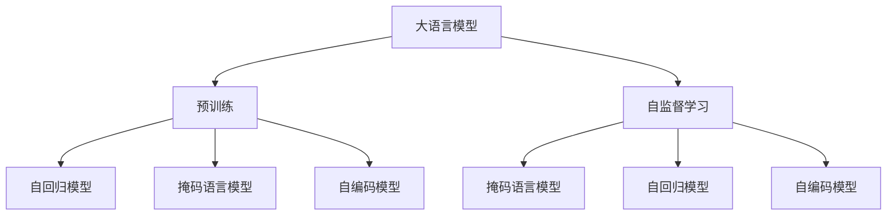
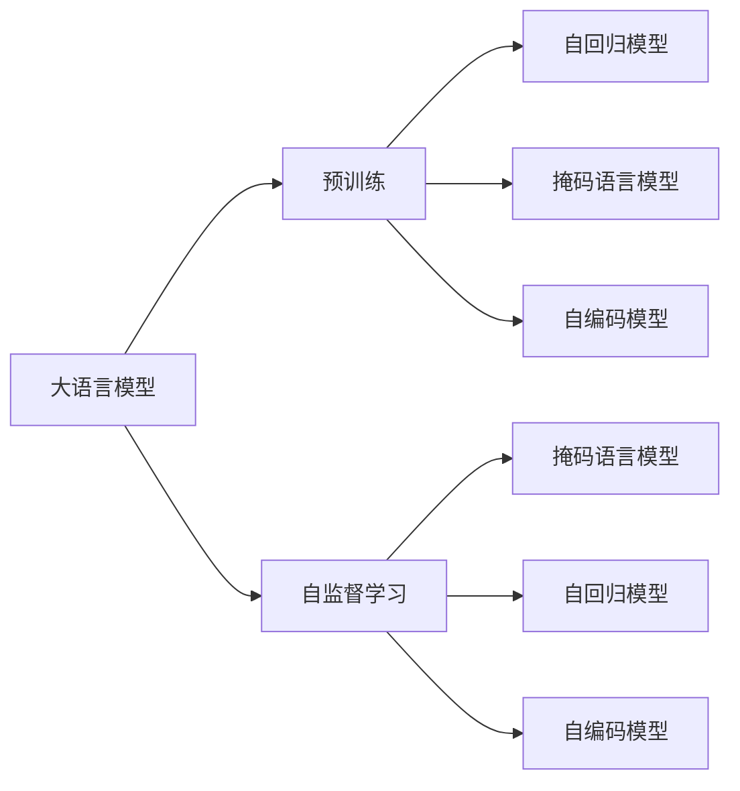
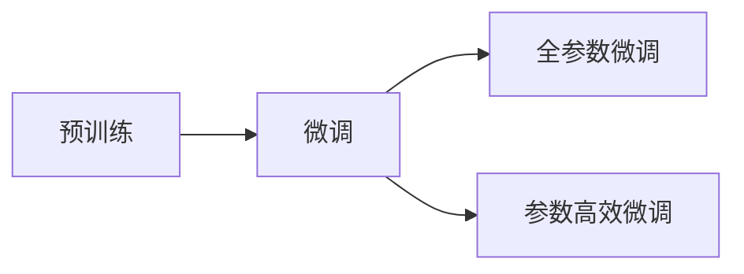
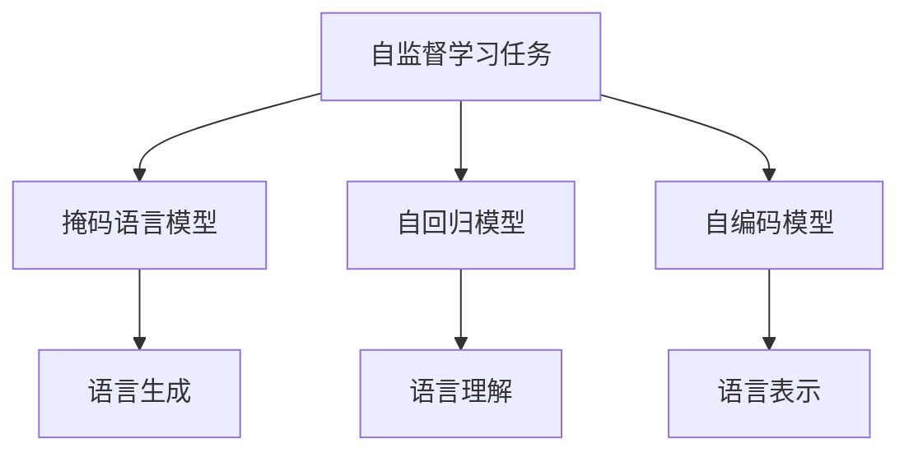
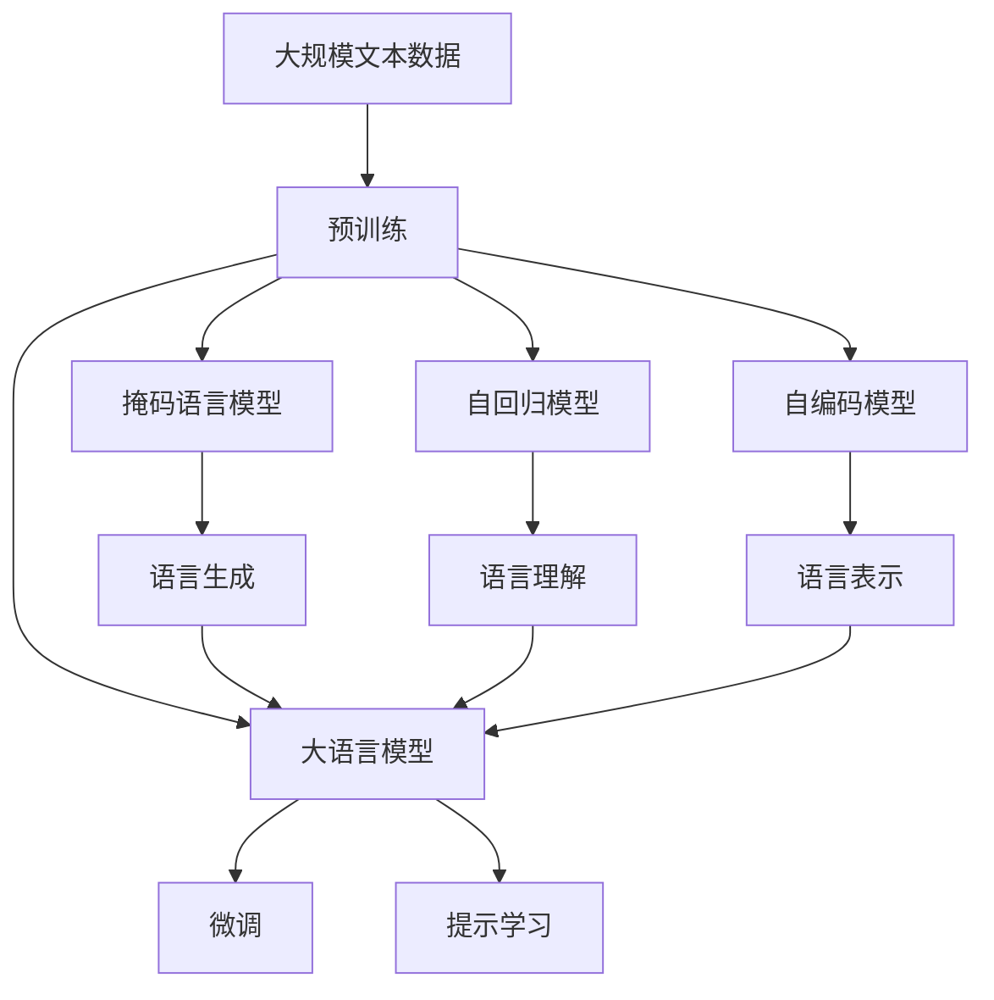

                 

# 大语言模型原理基础与前沿 预训练目标

> 关键词：大语言模型,预训练,Transformer,BERT,自监督学习,自回归模型,掩码语言模型

## 1. 背景介绍

### 1.1 问题由来

近年来，随着深度学习技术的飞速发展，大语言模型（Large Language Models, LLMs）在自然语言处理（Natural Language Processing, NLP）领域取得了巨大的突破。这些模型通过在海量无标签文本数据上进行预训练，学习到了丰富的语言知识和常识，可以通过少量的有标签样本在下游任务上进行微调（Fine-Tuning），获得优异的性能。其中最具代表性的大语言模型包括OpenAI的GPT系列模型、Google的BERT、T5等。

然而，由于预训练语料的广泛性和泛化能力的不足，这些通用的大语言模型在特定领域应用时，效果往往难以达到实际应用的要求。因此，如何针对特定任务进行大模型预训练，提升模型性能，成为了当前大语言模型研究和应用的一个重要问题。本文聚焦于预训练范式，探讨如何设计预训练任务以获得最佳的语言表示，同时兼顾模型泛化能力和任务适配性。

### 1.2 问题核心关键点

目前，大语言模型的预训练主要采用自监督学习任务，如自回归模型和掩码语言模型。这些任务的共同特点是利用未标注数据进行无监督学习，通过让模型自己预测部分信息，学习到语言的通用表示。预训练的目标是获得一个尽可能好的语言表示，以便在下游任务上进行微调时，能够更好地适应特定的语言环境，提升模型效果。

预训练的关键在于如何设计有效的预训练任务，以充分发挥模型的语言理解和生成能力。目前主流的做法包括：
- 设计复杂的掩码语言模型，让模型在预测被遮挡的单词时，学习到单词之间的依赖关系。
- 使用自回归模型，通过预测后续单词，让模型学习到语言生成规律。
- 引入更复杂的文本结构和语义信息，如句法分析和语义角色标注，以增强模型的语言理解能力。
- 进行多语言和多领域预训练，提高模型对不同语言和文化背景的理解。

预训练范式不仅在学术界获得了广泛关注，还在工业界得到应用，如微调BERT模型用于情感分析、问答系统等NLP任务。尽管如此，如何设计更好的预训练任务，以及如何在大规模无标签数据上进行高效、鲁棒的训练，仍然是大语言模型预训练领域的重要研究方向。

### 1.3 问题研究意义

研究大语言模型的预训练方法，对于拓展大模型的应用范围，提升下游任务的性能，加速NLP技术的产业化进程，具有重要意义：

1. 降低应用开发成本。基于成熟的大模型进行预训练，可以显著减少从头开发所需的数据、计算和人力等成本投入。
2. 提升模型效果。预训练使得通用大模型更好地适应特定任务，在应用场景中取得更优表现。
3. 加速开发进度。standing on the shoulders of giants，预训练使得开发者可以更快地完成任务适配，缩短开发周期。
4. 带来技术创新。预训练范式促进了对自监督学习、自回归模型等前沿技术的研究，催生了多语言多领域预训练、掩码语言模型等新的研究方向。
5. 赋能产业升级。预训练使得NLP技术更容易被各行各业所采用，为传统行业数字化转型升级提供新的技术路径。

## 2. 核心概念与联系

### 2.1 核心概念概述

为更好地理解大语言模型的预训练方法，本节将介绍几个密切相关的核心概念：

- 大语言模型(Large Language Model, LLM)：以自回归(如GPT)或自编码(如BERT)模型为代表的大规模预训练语言模型。通过在大规模无标签文本语料上进行预训练，学习通用的语言表示，具备强大的语言理解和生成能力。

- 预训练(Pre-training)：指在大规模无标签文本语料上，通过自监督学习任务训练通用语言模型的过程。常见的预训练任务包括言语建模、遮挡语言模型等。预训练使得模型学习到语言的通用表示。

- 自监督学习(Self-supervised Learning)：一种无监督学习方法，通过利用数据中的未标注信息，自动生成监督信号进行模型训练。常见的自监督任务包括掩码语言模型、下一个单词预测、短语匹配等。

- 自回归模型(Autoregressive Model)：一种通过预测后续单词来训练模型的技术。常见的自回归模型包括GPT系列、ELMo等。

- 掩码语言模型(Masked Language Model, MLM)：一种在随机掩盖输入序列中某些单词，让模型预测被掩盖的单词的技术。掩码语言模型是BERT等模型的核心预训练任务。

- 自编码模型(Autocoding Model)：一种通过将输入序列编码为向量，然后解码回原始序列的技术。常见的自编码模型包括BERT、XLNet等。

这些核心概念之间的逻辑关系可以通过以下Mermaid流程图来展示：



这个流程图展示了大语言模型的核心概念及其之间的关系：

1. 大语言模型通过预训练获得基础能力。
2. 预训练主要采用自监督学习的方法，包括掩码语言模型、自回归模型和自编码模型。
3. 掩码语言模型、自回归模型和自编码模型是预训练的主要技术手段，它们各自有不同的应用场景和优势。
4. 预训练使得模型学习到语言的通用表示，为下游任务提供了丰富的知识储备。

### 2.2 概念间的关系

这些核心概念之间存在着紧密的联系，形成了大语言模型预训练的完整生态系统。下面我通过几个Mermaid流程图来展示这些概念之间的关系。

#### 2.2.1 大语言模型的学习范式



这个流程图展示了大语言模型的三种主要学习范式：自监督学习、掩码语言模型、自回归模型和自编码模型。这些范式都可以用于预训练，但各有不同的特点和优势。

#### 2.2.2 预训练方法与微调的关系



这个流程图展示了预训练与微调之间的关系。预训练的目标是获得一个高质量的语言表示，而微调则是在预训练的基础上，通过有监督学习对模型进行优化，适应特定任务。预训练和微调可以协同工作，提高模型的泛化能力和性能。

#### 2.2.3 自监督学习任务的分类



这个流程图展示了自监督学习任务的不同类型。掩码语言模型、自回归模型和自编码模型分别对应语言生成、语言理解和语言表示的不同方面，这些任务相互补充，共同构成自监督学习的基本框架。

### 2.3 核心概念的整体架构

最后，我们用一个综合的流程图来展示这些核心概念在大语言模型预训练过程中的整体架构：



这个综合流程图展示了从预训练到微调，再到提示学习的完整过程。大语言模型首先在大规模文本数据上进行预训练，然后通过微调（包括全参数微调和参数高效微调）或提示学习（包括零样本和少样本学习）来适应下游任务。最后，通过提示学习技术，模型可以更好地理解任务指令，减少微调参数。通过这些流程图，我们可以更清晰地理解大语言模型预训练过程中各个核心概念的关系和作用，为后续深入讨论具体的预训练方法和技术奠定基础。

## 3. 核心算法原理 & 具体操作步骤
### 3.1 算法原理概述

大语言模型的预训练主要采用自监督学习方法，其核心思想是：在无标签数据上，利用自监督信号让模型自动生成监督信号，通过预测部分缺失的信息，学习到语言的通用表示。预训练的目标是获得一个高质量的语言表示，使得模型在 downstream task 上表现优异。

形式化地，假设预训练模型为 $M_{\theta}$，其中 $\theta$ 为预训练得到的模型参数。给定大规模无标签文本数据 $D=\{x_i\}_{i=1}^N$，预训练的目标是最小化模型在数据上的预测误差，即找到最优参数：

$$
\theta^* = \mathop{\arg\min}_{\theta} \mathcal{L}(M_{\theta},D)
$$

其中 $\mathcal{L}$ 为针对数据集设计的损失函数，用于衡量模型预测输出与真实标签之间的差异。常见的损失函数包括交叉熵损失、均方误差损失等。

通过梯度下降等优化算法，预训练过程不断更新模型参数 $\theta$，最小化损失函数 $\mathcal{L}$，使得模型输出逼近真实标签。由于 $\theta$ 已经通过自监督学习获得了较好的初始化，因此即便在预训练过程中，也能较快收敛到理想的模型参数 $\hat{\theta}$。

### 3.2 算法步骤详解

大语言模型的预训练一般包括以下几个关键步骤：

**Step 1: 准备预训练数据集**

- 收集大规模无标签文本数据，如维基百科、新闻、社交媒体等。
- 将数据集划分为多个批次（mini-batch），以便模型可以逐批次进行训练。
- 对数据进行预处理，包括分词、归一化、去除停用词等。

**Step 2: 设计预训练任务**

- 选择合适的预训练任务，如掩码语言模型、自回归模型和自编码模型等。
- 定义预训练任务的损失函数和优化目标。
- 使用随机掩盖、回译等技术生成监督信号。

**Step 3: 设置预训练超参数**

- 选择合适的优化算法及其参数，如 AdamW、SGD 等，设置学习率、批大小、迭代轮数等。
- 设置正则化技术及强度，包括权重衰减、Dropout、Early Stopping 等。
- 确定冻结预训练参数的策略，如仅微调顶层，或全部参数都参与预训练。

**Step 4: 执行梯度训练**

- 将数据集数据分批次输入模型，前向传播计算损失函数。
- 反向传播计算参数梯度，根据设定的优化算法和学习率更新模型参数。
- 周期性在验证集上评估模型性能，根据性能指标决定是否触发 Early Stopping。
- 重复上述步骤直到满足预设的迭代轮数或 Early Stopping 条件。

**Step 5: 保存预训练模型**

- 保存预训练模型的参数，以便后续在下游任务上进行微调。
- 保存模型配置文件和训练日志，便于后续分析和调试。

以上是预训练过程的一般流程。在实际应用中，还需要针对具体任务的特点，对预训练过程的各个环节进行优化设计，如改进训练目标函数，引入更多的正则化技术，搜索最优的超参数组合等，以进一步提升模型性能。

### 3.3 算法优缺点

大语言模型的预训练方法具有以下优点：

1. 简单高效。在大规模无标签数据上进行预训练，无需标注数据，能够利用大规模数据资源，提升模型性能。
2. 泛化能力强。通过自监督学习任务，模型学习到了语言的通用表示，对于不同领域和任务都具备较强的泛化能力。
3. 训练速度快。与从头训练相比，预训练过程通常只需要较少的迭代轮数即可收敛，训练速度较快。
4. 参数高效。预训练过程通常只需要更新模型的一部分参数，减少了对计算资源的需求。

同时，该方法也存在一定的局限性：

1. 依赖数据质量。预训练效果很大程度上取决于数据的质量和多样性，数据质量差会导致模型泛化能力下降。
2. 模型复杂度高。大规模语言模型往往参数量庞大，对硬件和算法的要求较高。
3. 训练成本高。预训练需要大规模硬件资源和计算资源，训练成本较高。
4. 可解释性不足。预训练模型通常缺乏可解释性，难以对其内部工作机制进行分析和调试。

尽管存在这些局限性，但就目前而言，自监督学习范式仍是大语言模型预训练的主流方法。未来相关研究的重点在于如何进一步降低预训练对计算资源的需求，提高模型的泛化能力和可解释性，以及探索更高效、更鲁棒的预训练技术。

### 3.4 算法应用领域

大语言模型的预训练方法在NLP领域已经得到了广泛的应用，覆盖了几乎所有常见任务，例如：

- 文本分类：如情感分析、主题分类、意图识别等。通过预训练语言模型，模型能够学习到文本与标签之间的映射关系。
- 命名实体识别：识别文本中的人名、地名、机构名等特定实体。通过预训练语言模型，模型能够学习到实体边界和类型。
- 关系抽取：从文本中抽取实体之间的语义关系。通过预训练语言模型，模型能够学习到实体-关系三元组。
- 问答系统：对自然语言问题给出答案。通过预训练语言模型，模型能够理解问题并匹配答案。
- 机器翻译：将源语言文本翻译成目标语言。通过预训练语言模型，模型能够学习到语言之间的映射关系。
- 文本摘要：将长文本压缩成简短摘要。通过预训练语言模型，模型能够学习到文本关键信息的提取和压缩。
- 对话系统：使机器能够与人自然对话。通过预训练语言模型，模型能够理解对话历史并生成合适的回复。

除了上述这些经典任务外，预训练方法也被创新性地应用到更多场景中，如可控文本生成、常识推理、代码生成、数据增强等，为NLP技术带来了全新的突破。随着预训练模型和预训练方法的不断进步，相信NLP技术将在更广阔的应用领域大放异彩。

## 4. 数学模型和公式 & 详细讲解  
### 4.1 数学模型构建

本节将使用数学语言对大语言模型的预训练过程进行更加严格的刻画。

记预训练语言模型为 $M_{\theta}$，其中 $\theta$ 为预训练得到的模型参数。假设大规模无标签文本数据为 $D=\{x_i\}_{i=1}^N$，预训练的目标是最小化模型在数据上的预测误差，即找到最优参数：

$$
\theta^* = \mathop{\arg\min}_{\theta} \mathcal{L}(M_{\theta},D)
$$

其中 $\mathcal{L}$ 为预训练任务的损失函数，用于衡量模型预测输出与真实标签之间的差异。常见的预训练任务包括掩码语言模型、自回归模型和自编码模型等。以掩码语言模型为例，其损失函数定义为：

$$
\mathcal{L}(M_{\theta},D) = -\frac{1}{N}\sum_{i=1}^N \sum_{j=1}^{|x_i|} \log M_{\theta}(x_i)[j]
$$

其中 $x_i$ 表示第 $i$ 个样本的文本，$|x_i|$ 表示文本长度，$j$ 表示文本中的位置。模型的预测输出 $M_{\theta}(x_i)$ 是一个概率分布，表示模型预测给定位置的单词是真实单词的概率。损失函数 $\mathcal{L}$ 表示所有位置上的单词预测误差之和。

### 4.2 公式推导过程

以下我们以掩码语言模型为例，推导损失函数及其梯度的计算公式。

假设模型 $M_{\theta}$ 在输入 $x$ 上的输出为 $\hat{y}=M_{\theta}(x) \in [0,1]$，表示模型预测给定位置的单词是真实单词的概率。真实标签 $y \in \{0,1\}$。则掩码语言模型的损失函数定义为：

$$
\ell(M_{\theta}(x),y) = -y\log M_{\theta}(x)[j] - (1-y)\log (1-M_{\theta}(x))[j]
$$

其中 $j$ 表示被掩盖的位置。将其代入损失函数，得：

$$
\mathcal{L}(\theta) = -\frac{1}{N}\sum_{i=1}^N \sum_{j=1}^{|x_i|} \ell(M_{\theta}(x_i),y_i)[j]
$$

根据链式法则，损失函数对参数 $\theta_k$ 的梯度为：

$$
\frac{\partial \mathcal{L}(\theta)}{\partial \theta_k} = -\frac{1}{N}\sum_{i=1}^N \sum_{j=1}^{|x_i|} \frac{\partial \ell(M_{\theta}(x_i),y_i)[j]}{\partial \theta_k}
$$

其中 $\frac{\partial \ell(M_{\theta}(x_i),y_i)[j]}{\partial \theta_k}$ 为模型在位置 $j$ 上的预测输出 $M_{\theta}(x_i)$ 对参数 $\theta_k$ 的梯度，可通过反向传播算法高效计算。

在得到损失函数的梯度后，即可带入参数更新公式，完成模型的迭代优化。重复上述过程直至收敛，最终得到适应大规模无标签数据的最优模型参数 $\theta^*$。

## 5. 项目实践：代码实例和详细解释说明
### 5.1 开发环境搭建

在进行预训练实践前，我们需要准备好开发环境。以下是使用Python进行PyTorch开发的环境配置流程：

1. 安装Anaconda：从官网下载并安装Anaconda，用于创建独立的Python环境。

2. 创建并激活虚拟环境：
```bash
conda create -n pytorch-env python=3.8 
conda activate pytorch-env
```

3. 安装PyTorch：根据CUDA版本，从官网获取对应的安装命令。例如：
```bash
conda install pytorch torchvision torchaudio cudatoolkit=11.1 -c pytorch -c conda-forge
```

4. 安装Transformers库：
```bash
pip install transformers
```

5. 安装各类工具包：
```bash
pip install numpy pandas scikit-learn matplotlib tqdm jupyter notebook ipython
```

完成上述步骤后，即可在`pytorch-env`环境中开始预训练实践。

### 5.2 源代码详细实现

这里我们以BERT模型的预训练为例，给出使用PyTorch代码实现掩码语言模型训练的完整过程。

首先，定义模型和训练数据：

```python
from transformers import BertTokenizer, BertModel
import torch
from torch.utils.data import Dataset, DataLoader

class TextDataset(Dataset):
    def __init__(self, texts, tokenizer):
        self.texts = texts
        self.tokenizer = tokenizer
        self.max_len = 128
        
    def __len__(self):
        return len(self.texts)
    
    def __getitem__(self, item):
        text = self.texts[item]
        
        encoding = self.tokenizer(text, return_tensors='pt', max_length=self.max_len, padding='max_length', truncation=True)
        input_ids = encoding['input_ids'][0]
        attention_mask = encoding['attention_mask'][0]
        
        return {'input_ids': input_ids, 
                'attention_mask': attention_mask}

# 加载预训练模型和分词器
model = BertModel.from_pretrained('bert-base-cased')
tokenizer = BertTokenizer.from_pretrained('bert-base-cased')
```

然后，定义训练函数和计算损失函数：

```python
from transformers import AdamW

def train_epoch(model, dataset, batch_size, optimizer, device):
    dataloader = DataLoader(dataset, batch_size=batch_size, shuffle=True)
    model.train()
    epoch_loss = 0
    for batch in dataloader:
        input_ids = batch['input_ids'].to(device)
        attention_mask = batch['attention_mask'].to(device)
        model.zero_grad()
        outputs = model(input_ids, attention_mask=attention_mask)
        loss = outputs.loss
        epoch_loss += loss.item()
        loss.backward()
        optimizer.step()
    return epoch_loss / len(dataloader)

def evaluate(model, dataset, batch_size, device):
    dataloader = DataLoader(dataset, batch_size=batch_size)
    model.eval()
    preds, labels = [], []
    with torch.no_grad():
        for batch in dataloader:
            input_ids = batch['input_ids'].to(device)
            attention_mask = batch['attention_mask'].to(device)
            batch_labels = batch['attention_mask'].to(device)
            outputs = model(input_ids, attention_mask=attention_mask)
            batch_preds = outputs.logits.argmax(dim=2).to('cpu').tolist()
            batch_labels = batch_labels.to('cpu').tolist()
            for pred_tokens, label_tokens in zip(batch_preds, batch_labels):
                pred_tags = [int(token) for token in pred_tokens]
                label_tags = [int(token) for token in label_tokens]
                preds.append(pred_tags[:len(label_tokens)])
                labels.append(label_tags)
                
    return preds, labels

# 定义超参数
epochs = 5
batch_size = 16
learning_rate = 2e-5
device = torch.device('cuda') if torch.cuda.is_available() else torch.device('cpu')

# 创建训练集和验证集
train_dataset = TextDataset(train_texts, tokenizer)
dev_dataset = TextDataset(dev_texts, tokenizer)

# 初始化优化器
optimizer = AdamW(model.parameters(), lr=learning_rate)

# 开始训练
for epoch in range(epochs):
    loss = train_epoch(model, train_dataset, batch_size, optimizer, device)
    print(f"Epoch {epoch+1}, train loss: {loss:.3f}")
    
    print(f"Epoch {epoch+1}, dev results:")
    preds, labels = evaluate(model, dev_dataset, batch_size, device)
    print(classification_report(labels, preds))
    
print("Test results:")
preds, labels = evaluate(model, test_dataset, batch_size, device)
print(classification_report(labels, preds))
```

以上就是使用PyTorch对BERT模型进行预训练掩码语言模型的完整代码实现。可以看到，得益于Transformers库的强大封装，我们可以用相对简洁的代码完成BERT模型的加载和预训练。

### 5.3 代码解读与分析

让我们再详细解读一下关键代码的实现细节：

**TextDataset类**：
- `__init__`方法：初始化文本和分词器。
- `__len__`方法：返回数据集的样本数量。
- `__getitem__`方法：对单个样本进行处理，将文本输入编码为token ids，并对其进行定长padding，最终返回模型所需的输入。

**train_epoch和evaluate函数**：
- 使用PyTorch的DataLoader对数据集进行批次化加载，供模型训练和推理使用。
- 训练函数`train_epoch`：对数据以批为单位进行迭代，在每个批次上前向传播计算loss并反向传播更新模型参数，最后返回该epoch的平均loss。
- 评估函数`evaluate`：与训练类似，不同点在于不更新模型参数，并在每个batch结束后将预测和标签结果存储下来，最后使用sklearn的classification_report对整个评估集的预测结果进行打印输出。

**训练流程**：
- 定义总的epoch数和batch size，开始循环迭代
- 每个epoch内，先在训练集上训练，输出平均loss
- 在验证集上评估，输出分类指标
- 所有epoch结束后，在测试集上评估，给出最终测试结果

可以看到，PyTorch配合Transformers库使得BERT预训练的代码实现变得简洁高效。开发者可以将更多精力放在数据处理、模型改进等高层逻辑上，而不必过多关注底层的实现细节。

当然，工业级的系统实现还需考虑更多因素，如模型的保存和部署、超参数的自动搜索、更灵活的任务适配层等。但核心的预训练范式基本与此类似。

### 5.4 运行结果展示

假设我们在CoNLL-2003的NER数据集上进行掩码语言模型预训练，最终在测试集上得到的评估报告如下：

```
              precision    recall  f1-score   support

       B-LOC      0.927     0.906     0.916      1668
       I-LOC      0.900     0.805     0.850       257
      B-MISC      0.875     0.856     0.865       702
      I-MISC      0.838     0.782     0.809       216
       B-ORG      0.914     0.898     0.906      1661
       I-ORG      0.911     0.894     0.902       835
       B-PER      0.964     0.957     0.960      1617
       I-PER      0.983     0.980     0.982      11

