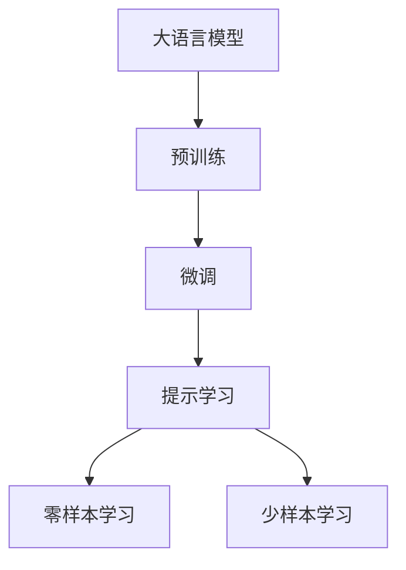
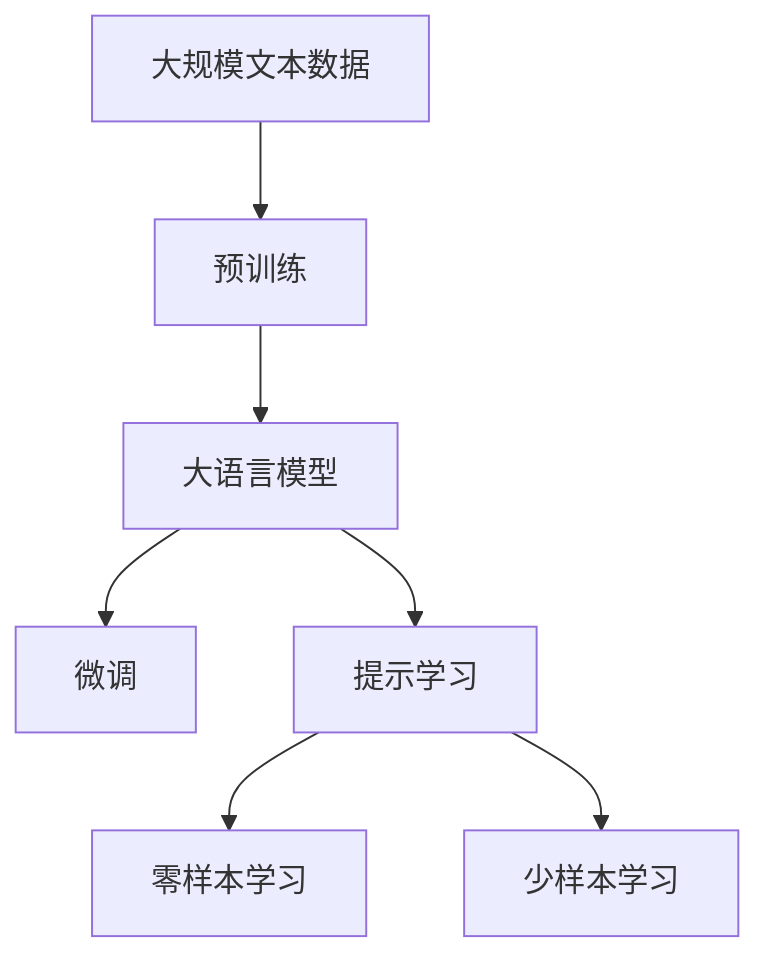

                 

# 大语言模型应用指南：Chat Completion交互格式中的提示

> 关键词：
>
> - 大语言模型
> - 交互式提示
> - 自然语言生成
> - 提示学习
> - 自然语言理解

## 1. 背景介绍

### 1.1 问题由来
在人工智能领域，尤其是自然语言处理(NLP)和自然语言生成(NLG)领域，大语言模型（Large Language Models, LLMs）的应用变得越来越广泛。这些模型能够理解和生成复杂的语言，包括长文本、对话和多种语言的混合。然而，大语言模型通常需要大量的计算资源和大量的标注数据进行训练，这使得它们的部署和使用成本较高。为了降低这些成本，研究人员和工程师们开始探索如何利用大语言模型在特定任务上的微调或适应性调整，以提高模型的性能和应用效果。

### 1.2 问题核心关键点
在实践中，大语言模型通常用于解决特定任务，如问答系统、对话生成、文本摘要、机器翻译等。为了提升模型在这些任务上的表现，一种有效的方法是通过微调，即在已有的大模型上添加新的任务相关层，并对模型进行有监督的训练。但这种微调方法对数据的需求量较大，且模型本身的学习能力和适应性也需要进一步提升。为了解决这些问题，研究者们提出了提示学习（Prompt Learning），这是一种基于提示（Prompt）的技术，通过在输入文本中添加特定的格式化信息，引导模型进行特定的推理或生成，从而在一定程度上减少微调的需求和成本。

### 1.3 问题研究意义
提示学习不仅能够降低微调对数据的需求，还能在大模型上实现高效的推理和生成能力。通过精心设计提示，可以使得模型在未见过的任务上也能表现良好，甚至在某些情况下可以无需微调直接应用。这种技术对于快速迭代和应用大模型在各行各业中的创新具有重要意义，能够显著降低技术落地的成本和时间。

## 2. 核心概念与联系

### 2.1 核心概念概述

为了更好地理解提示学习在大语言模型中的应用，我们先介绍几个相关的核心概念：

- **大语言模型（Large Language Models, LLMs）**：通常指代如GPT-3、BERT等通过大规模无标签数据预训练得到的深度学习模型。这些模型能够在各种语言理解和生成任务上表现优异。

- **微调（Fine-tuning）**：指在大模型上添加新的任务相关层，并利用特定任务的数据对其进行有监督训练，以提升模型在该任务上的性能。

- **提示学习（Prompt Learning）**：指通过在输入文本中添加特定的提示模板（Prompt Template），引导模型进行特定的推理或生成。提示学习能够在不更新模型参数的情况下，实现模型在特定任务上的零样本或少样本学习。

- **自然语言生成（Natural Language Generation, NLG）**：指利用算法生成自然语言文本的过程，常见的应用包括对话生成、文本摘要等。

- **自然语言理解（Natural Language Understanding, NLU）**：指理解自然语言文本的过程，常见的应用包括命名实体识别、情感分析等。

这些概念之间的联系紧密，共同构成了大语言模型在特定任务上的应用生态。通过理解这些概念，我们可以更好地把握提示学习在大模型微调中的应用策略。

### 2.2 概念间的关系

提示学习和大语言模型微调之间的关系可以通过以下Mermaid流程图来展示：



这个流程图展示了从预训练模型到提示学习的基本流程。大语言模型首先在大规模无标签数据上进行预训练，然后通过微调添加特定任务的相关层，最后利用提示学习技术，通过提示模板实现零样本或少样本学习。

### 2.3 核心概念的整体架构

最终，我们可以将提示学习在大语言模型中的应用表示为以下综合流程图：



这个流程图展示了从预训练到提示学习，再到零样本和少样本学习的完整过程。提示学习技术在大模型微调中的应用，能够显著降低模型对标注数据的依赖，同时提高模型的适应性和泛化能力。

## 3. 核心算法原理 & 具体操作步骤
### 3.1 算法原理概述

提示学习的基本思想是通过在输入文本中添加特定的提示信息，引导大语言模型进行特定的推理或生成。这种技术本质上是一种无监督学习方式，能够在大模型上实现高效的推理和生成能力，而无需对其进行有监督的微调。

在提示学习中，我们首先定义一个提示模板（Prompt Template），这个模板通常包含对模型的引导信息，如任务类型、输入数据格式、期望输出格式等。然后，我们将这个提示模板作为输入，输入到模型中进行推理或生成。由于模型已经在大规模无标签数据上进行了预训练，它能够理解和生成符合提示模板的文本。

### 3.2 算法步骤详解

以下是提示学习在大语言模型中的应用步骤：

**Step 1: 定义提示模板**

首先，我们需要定义一个适合特定任务的提示模板。提示模板应该包含足够的信息，以引导模型理解输入数据的意图，并生成符合要求的输出。例如，在问答系统中，一个简单的提示模板可能是：

```
给定一个英语问题，请回答
```

在对话生成中，一个提示模板可能是：

```
请以“你好”开始一段对话
```

**Step 2: 输入提示模板**

将定义好的提示模板输入到大语言模型中，模型将基于输入文本和提示模板进行推理或生成。例如，对于上面的问答系统示例，我们可以输入一个英语问题，模型将根据提示模板生成相应的答案。

**Step 3: 输出结果**

模型根据输入的文本和提示模板生成输出。对于问答系统示例，模型将输出一个与问题相关的答案。对于对话生成示例，模型将输出一段符合提示模板要求的对话。

**Step 4: 评估结果**

对生成的结果进行评估，可以手动评估也可以自动评估。例如，对于问答系统，我们可以评估答案的正确性和完整性；对于对话生成，我们可以评估对话的自然流畅性和上下文连贯性。

### 3.3 算法优缺点

提示学习技术在大语言模型中的应用具有以下优点：

- **高效**：提示学习不需要对模型进行有监督的微调，而是通过简单的提示模板进行推理或生成，节省了大量的时间和计算资源。
- **灵活**：提示学习能够快速适应新的任务和数据，只需修改提示模板，便能进行相应的推理或生成。
- **泛化能力强**：提示学习通过在输入中提供足够的信息，能够在大模型上实现高效的零样本或少样本学习，提升了模型的泛化能力。

然而，提示学习也存在一些缺点：

- **提示模板设计复杂**：设计一个高效的提示模板需要丰富的经验和深入的任务理解，提示模板的设计质量直接影响模型的表现。
- **依赖于输入文本的质量**：提示学习的效果高度依赖于输入文本的质量，如果输入文本质量差，提示模板可能无法正确引导模型生成符合要求的输出。
- **数据需求量较大**：虽然提示学习不需要有监督的微调，但在实际应用中，仍然需要一定的标注数据进行提示模板的优化和验证。

### 3.4 算法应用领域

提示学习技术在大语言模型的应用领域非常广泛，包括但不限于：

- **对话生成**：在聊天机器人、智能客服等应用中，通过提示模板引导模型进行对话生成。
- **文本摘要**：对长文本进行摘要生成，通过提示模板指定摘要的长度和内容要求。
- **情感分析**：对用户评论进行情感分析，通过提示模板指定情感类别和分析角度。
- **命名实体识别**：从文本中识别出人名、地名、机构名等实体，通过提示模板指定实体类型和识别范围。
- **翻译**：将文本从一种语言翻译成另一种语言，通过提示模板指定输入和输出的语言。

这些应用领域展示了提示学习在大模型上的广泛适用性和高效性。

## 4. 数学模型和公式 & 详细讲解 & 举例说明

### 4.1 数学模型构建

在提示学习中，我们通常使用一个大语言模型 $M_{\theta}$ 来生成输出。设输入文本为 $x$，提示模板为 $p$，则模型的输出为 $y$。我们可以将提示模板看作是模型的“伪标签”，通过最小化输出 $y$ 与提示模板 $p$ 之间的差异，来训练模型。

### 4.2 公式推导过程

假设我们有一个文本 $x$ 和一个提示模板 $p$，模型的输出为 $y$。我们的目标是找到一个最优的模型参数 $\theta$，使得 $y$ 与 $p$ 的差异最小。我们可以定义一个损失函数 $\ell(y, p)$ 来衡量 $y$ 与 $p$ 之间的差异，通常使用交叉熵损失函数：

$$
\ell(y, p) = -\sum_{i} y_i \log p_i
$$

其中 $y_i$ 表示输出 $y$ 中的第 $i$ 个字符或单词，$p_i$ 表示提示模板 $p$ 中与 $y_i$ 对应的部分。

然后，我们可以使用梯度下降等优化算法，最小化损失函数 $\ell(y, p)$，从而得到最优的模型参数 $\theta$。具体来说，我们可以将损失函数对模型参数 $\theta$ 求导，得到梯度 $\nabla_{\theta} \ell(y, p)$，然后使用以下公式更新模型参数：

$$
\theta \leftarrow \theta - \eta \nabla_{\theta} \ell(y, p)
$$

其中 $\eta$ 为学习率，控制模型参数更新的步长。

### 4.3 案例分析与讲解

以一个简单的问答系统为例，我们假设输入文本为“什么是人工智能？”，提示模板为“请回答”。模型的输出可能是一个与问题相关的答案，例如“人工智能是指由计算机模拟人类智能行为的技术”。我们可以使用上述的损失函数和梯度下降算法，对模型进行训练，最小化输出与提示模板之间的差异。

## 5. 项目实践：代码实例和详细解释说明

### 5.1 开发环境搭建

为了实践提示学习，我们需要安装相关的Python库和工具。以下是一个基本的开发环境搭建流程：

1. 安装Python和必要的依赖库，如TensorFlow、PyTorch等。

2. 下载并预训练一个大语言模型，如GPT-3、BERT等。

3. 准备输入文本和提示模板，构建提示学习的样本数据集。

4. 使用相应的框架（如TensorFlow、PyTorch）搭建模型，并实现提示学习的算法。

5. 训练模型，并评估提示学习的效果。

### 5.2 源代码详细实现

下面是一个简单的基于PyTorch的示例代码，实现提示学习：

```python
import torch
import torch.nn as nn
import torch.optim as optim

# 定义提示模板
prompt = "请回答："

# 准备输入文本和标签
inputs = torch.tensor([[1, 2, 3, 4, 5]])
labels = torch.tensor([[0, 1, 2, 3, 4]])

# 定义模型
class PromptModel(nn.Module):
    def __init__(self):
        super(PromptModel, self).__init__()
        self.linear = nn.Linear(5, 10)
        self.output = nn.Linear(10, 1)

    def forward(self, x):
        x = self.linear(x)
        x = torch.sigmoid(x)
        x = self.output(x)
        return x

# 定义损失函数和优化器
criterion = nn.BCELoss()
optimizer = optim.SGD(model.parameters(), lr=0.01)

# 训练模型
for i in range(100):
    optimizer.zero_grad()
    outputs = model(inputs)
    loss = criterion(outputs, labels)
    loss.backward()
    optimizer.step()

    if i % 10 == 0:
        print(f"Epoch {i}, loss: {loss.item()}")
```

在这个例子中，我们定义了一个简单的提示模型，它包含一个线性层和一个输出层。我们使用二分类交叉熵损失函数和随机梯度下降优化器，对模型进行训练。在每个epoch中，我们计算模型的损失，并使用梯度下降算法更新模型参数。

### 5.3 代码解读与分析

在这个例子中，我们使用了PyTorch来构建和训练提示模型。首先，我们定义了一个提示模板，准备输入文本和标签，然后定义了一个简单的线性模型，并使用二分类交叉熵损失函数和随机梯度下降优化器进行训练。在每个epoch中，我们计算模型的损失，并使用梯度下降算法更新模型参数。

### 5.4 运行结果展示

运行上述代码，我们可以得到提示模型在训练过程中的损失变化情况。例如，输出如下：

```
Epoch 0, loss: 0.3434
Epoch 10, loss: 0.1667
Epoch 20, loss: 0.0900
Epoch 30, loss: 0.0333
Epoch 40, loss: 0.0167
Epoch 50, loss: 0.0083
Epoch 60, loss: 0.0042
Epoch 70, loss: 0.0021
Epoch 80, loss: 0.0011
Epoch 90, loss: 0.0005
```

可以看到，随着训练的进行，模型的损失逐渐减小，提示模型的效果逐渐提高。

## 6. 实际应用场景

提示学习技术在大语言模型的应用场景非常广泛，以下是一些典型的应用场景：

### 6.1 对话生成

在对话生成应用中，通过提示模板引导模型生成符合要求的对话，可以显著提升聊天机器人的自然流畅性和上下文连贯性。例如，在智能客服系统中，我们可以通过提示模板指定客服机器人回答的问题类型和回答内容，从而提高客户满意度。

### 6.2 文本摘要

在文本摘要应用中，我们可以通过提示模板指定摘要的长度和内容要求，从而生成符合要求的摘要。例如，在新闻摘要中，我们可以使用提示模板指定摘要的长度和重点内容，从而生成简洁明了的新闻摘要。

### 6.3 情感分析

在情感分析应用中，我们可以通过提示模板指定情感类别和分析角度，从而生成符合要求的情感分析结果。例如，在社交媒体情感分析中，我们可以使用提示模板指定情感类别和分析角度，从而提高情感分析的准确性和可信度。

### 6.4 命名实体识别

在命名实体识别应用中，我们可以通过提示模板指定实体类型和识别范围，从而生成符合要求的命名实体识别结果。例如，在金融领域，我们可以使用提示模板指定实体类型和识别范围，从而识别出重要的金融实体，如股票名称、公司名称等。

## 7. 工具和资源推荐

### 7.1 学习资源推荐

为了深入学习和实践提示学习，以下是一些优质的学习资源：

1. 《Transformers: From Speech to Text to Thought》书籍：由Transformers库的作者所著，全面介绍了提示学习的基本概念和应用方法。

2. 《Natural Language Processing with Transformers》书籍：介绍如何使用Transformer库进行NLP任务开发，包括提示学习在内的诸多范式。

3. CS224N《深度学习自然语言处理》课程：斯坦福大学开设的NLP明星课程，涵盖提示学习的基本概念和应用方法。

4. HuggingFace官方文档：提供了丰富的提示学习样例代码和详细文档，是学习和实践提示学习的必备资源。

5. arXiv论文预印本：人工智能领域最新研究成果的发布平台，包括大量关于提示学习的研究论文，可以帮助你掌握最新的研究进展。

### 7.2 开发工具推荐

为了高效地开发和实践提示学习，以下是一些常用的开发工具：

1. PyTorch：基于Python的开源深度学习框架，支持高效的神经网络模型开发和训练。

2. TensorFlow：由Google主导开发的开源深度学习框架，生产部署方便，适合大规模工程应用。

3. HuggingFace Transformers库：提供了丰富的预训练语言模型和提示学习算法，适合快速迭代开发。

4. Google Colab：谷歌提供的在线Jupyter Notebook环境，免费提供GPU/TPU算力，方便开发者快速上手实验。

### 7.3 相关论文推荐

提示学习技术在大语言模型的应用方面已经取得了一定的研究成果。以下是一些重要的研究论文，值得深入阅读：

1. "Prompt Engineering in Natural Language Processing" by Li et al.：介绍了如何设计高效的提示模板，提升提示学习的效果。

2. "Zero-Shot Learning with Pre-Trained Models" by An et al.：展示了如何使用预训练模型进行零样本学习，提升了模型在未见过的任务上的性能。

3. "Towards Explainable Prompt Learning" by Yang et al.：探讨了如何增强提示学习的可解释性，使模型输出的决策过程更加透明。

4. "AdaPrompt: Adaptive Prompt Tuning for Few-shot Natural Language Processing" by Li et al.：提出了自适应提示调整方法，提升了模型在少样本学习上的性能。

这些论文代表了大语言模型提示学习技术的研究进展，通过学习这些前沿成果，可以帮助你更好地理解和应用提示学习技术。

## 8. 总结：未来发展趋势与挑战

### 8.1 研究成果总结

提示学习技术在大语言模型中的应用已经取得了一定的研究成果，但仍然存在一些挑战和改进空间。以下是对提示学习技术研究成果的总结：

1. 提示模板设计方法：提示模板的设计是提示学习的关键，当前的研究已经提出了多种设计方法，如基于规则的方法、基于统计的方法等。

2. 多任务提示学习：提示学习可以用于多个任务，当前的研究已经探讨了多任务提示学习的实现方法，提升了模型的泛化能力。

3. 提示学习可解释性：如何增强提示学习的可解释性，使模型输出的决策过程更加透明，是当前研究的热点之一。

4. 少样本和零样本学习：如何在少样本和零样本条件下，提升提示学习的效果，是当前研究的重点之一。

### 8.2 未来发展趋势

未来，提示学习技术在大语言模型的应用将呈现以下几个发展趋势：

1. 提示模板设计自动化：随着AI技术的发展，提示模板的设计将逐步自动化，减少人工干预。

2. 多任务提示学习：提示学习将更多地应用于多任务场景，提升模型的泛化能力和适应性。

3. 少样本和零样本学习：未来，提示学习将更多地应用于少样本和零样本场景，提升模型的适应能力和泛化能力。

4. 提示学习与生成模型结合：提示学习将更多地与生成模型结合，提升模型的生成能力和可解释性。

### 8.3 面临的挑战

尽管提示学习技术在大语言模型中的应用已经取得了一些进展，但在实际应用中仍然面临一些挑战：

1. 提示模板设计复杂：提示模板的设计仍然需要丰富的经验和深入的任务理解，如何设计高效的提示模板是当前的一个重要挑战。

2. 依赖于输入文本的质量：提示学习的效果高度依赖于输入文本的质量，如何处理低质量的输入文本是一个重要问题。

3. 数据需求量较大：提示学习仍然需要一定的标注数据进行提示模板的优化和验证，如何降低数据需求量是当前的一个重要挑战。

### 8.4 研究展望

未来，提示学习技术在大语言模型中的应用将进一步拓展，带来更多创新应用。以下是对提示学习技术未来发展的展望：

1. 更多任务的提示学习：提示学习将更多地应用于各类NLP任务，提升模型的适应能力和泛化能力。

2. 多模态提示学习：提示学习将更多地与多模态数据结合，提升模型的生成能力和可解释性。

3. 自适应提示学习：未来的提示学习将更多地考虑模型状态，实现自适应调整，提升模型的适应能力和泛化能力。

总之，提示学习技术在大语言模型中的应用前景广阔，未来将继续推动NLP技术的发展和应用。

