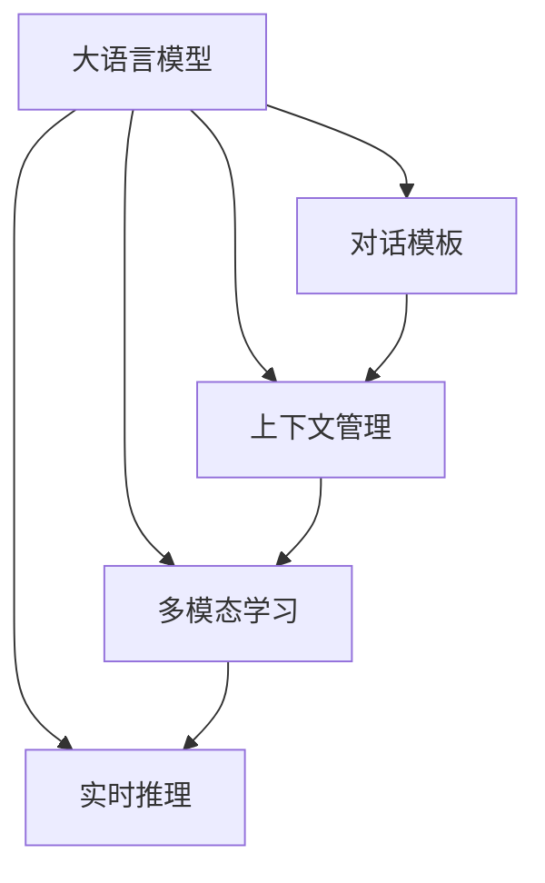
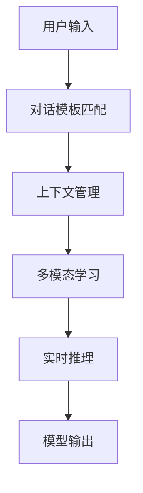

                 

# 大语言模型应用指南：交互格式

> 关键词：大语言模型,交互格式,自然语言处理(NLP),对话系统,人机交互,多模态学习

## 1. 背景介绍

### 1.1 问题由来

随着人工智能技术的飞速发展，大语言模型（Large Language Models, LLMs）在自然语言处理（Natural Language Processing, NLP）领域取得了令人瞩目的突破。这些模型通过大规模无监督学习，能够理解和生成人类语言，广泛应用于问答系统、机器翻译、文本摘要等任务中。

然而，现有的大语言模型大多依赖于预训练的固定结构，难以灵活适应复杂的交互场景。为了更好地支持人机交互，研究人员开始探索基于交互格式的大语言模型应用，旨在通过对话模板、上下文等动态信息，提升模型在对话、推荐、信息检索等任务上的表现。

### 1.2 问题核心关键点

交互格式大语言模型应用的核心在于，将对话、推荐等任务描述为交互式的问题，并在模型训练和推理过程中，动态调整模型行为，以更好地适配当前对话或任务。

这种交互式应用的关键点包括：
- **对话模板**：预先设计的对话模板，用于引导模型理解上下文和生成回答。
- **上下文管理**：模型如何处理和利用对话历史信息，以便生成更相关、更连贯的回复。
- **多模态学习**：除了文本数据，模型如何利用语音、图像等多模态信息，增强对用户输入的感知能力。
- **实时推理**：模型在接收到用户输入后，如何快速进行推理计算，并生成即时回应。

### 1.3 问题研究意义

交互格式大语言模型应用的研究具有重要意义：
- **提升用户体验**：通过动态调整模型行为，可以提供更自然、更流畅的对话体验，提高用户满意度。
- **降低开发成本**：利用预训练模型进行微调，可以大幅减少任务适配的开发时间，缩短产品上线周期。
- **扩展应用边界**：交互式应用可以应用于更多垂直领域，如医疗、金融、教育等，拓展AI技术的落地场景。
- **推动技术发展**：交互式应用研究将推动大语言模型在实时推理、多模态融合等方面的技术进步。

## 2. 核心概念与联系

### 2.1 核心概念概述

为更好地理解交互格式大语言模型应用，本节将介绍几个关键概念：

- **大语言模型**：指通过大规模无监督学习获得通用语言知识的语言模型，如GPT、BERT等。
- **交互格式**：指将任务描述为对话模板或交互流程，以便模型理解上下文并生成响应。
- **对话系统**：指能够与用户进行自然语言交互的系统，包括聊天机器人、虚拟助手等。
- **多模态学习**：指模型同时利用文本、语音、图像等多模态数据，提升对复杂任务的理解和处理能力。
- **实时推理**：指模型在接收到用户输入后，能够快速进行推理计算，并及时生成响应。

这些概念通过以下Mermaid流程图展示其关系：



这个流程图展示了大语言模型通过对话模板、上下文管理、多模态学习、实时推理等机制，实现与用户进行自然、高效交互的过程。

### 2.2 概念间的关系

这些核心概念之间存在着紧密的联系，构成了交互格式大语言模型应用的完整框架。下面通过几个Mermaid流程图来展示这些概念之间的关系。

#### 2.2.1 交互格式应用流程


这个流程图展示了从用户输入到模型输出的交互式应用流程，其中对话模板匹配、上下文管理、多模态学习、实时推理等环节共同作用，实现了与用户的自然对话。

#### 2.2.2 对话模板设计


这个流程图展示了对话模板的设计和应用过程。用户意图通过模板匹配生成特定的对话模板，并在上下文管理下动态调整模型行为，生成模型输入。

#### 2.2.3 上下文管理机制


这个流程图展示了上下文管理机制。对话历史通过状态跟踪、信息检索、信息融合等步骤，更新模型状态，并用于生成新的回复。

### 2.3 核心概念的整体架构

最后，我们用一个综合的流程图来展示这些核心概念在大语言模型应用中的整体架构：



这个综合流程图展示了从用户输入到模型输出的完整交互过程，对话模板匹配、上下文管理、多模态学习、实时推理等环节共同作用，实现了与用户的自然对话。

## 3. 核心算法原理 & 具体操作步骤

### 3.1 算法原理概述

交互格式大语言模型应用的核心算法原理可以概括为：通过对话模板、上下文管理、多模态学习、实时推理等机制，使得模型能够动态调整其行为，生成与用户意图匹配的响应。具体来说，交互式应用包括以下步骤：

1. **对话模板匹配**：将用户输入与预设的对话模板进行匹配，确定对话类型和用户意图。
2. **上下文管理**：根据对话历史和当前输入，动态调整模型状态，生成模型输入。
3. **多模态学习**：利用语音、图像等多模态信息，增强对用户输入的感知能力。
4. **实时推理**：根据对话模板和上下文信息，快速进行推理计算，生成即时回应。

### 3.2 算法步骤详解

以下是对交互格式大语言模型应用的详细步骤详解：

**Step 1: 准备预训练模型和数据集**

- 选择合适的预训练语言模型 $M_{\theta}$，如BERT、GPT等。
- 准备对话或任务相关的对话数据集 $D=\{(x_i,y_i)\}_{i=1}^N, x_i \in X, y_i \in Y$，其中 $x_i$ 为输入文本，$y_i$ 为模型生成的响应。

**Step 2: 添加对话模板**

- 根据任务类型，设计对话模板 $T=\{t_1,t_2,...,t_n\}$，每个模板 $t_i$ 对应一种特定的用户意图。
- 将对话模板与模型参数结合，形成对话模板编码器 $E_T$，用于将用户输入转化为模型可理解的格式。

**Step 3: 上下文管理**

- 使用上下文管理器 $C$，将对话历史和当前输入 $x_i$ 转化为模型状态 $s_i$。
- 根据当前状态 $s_i$ 和对话模板 $t_i$，生成模型输入 $z_i$。

**Step 4: 多模态学习**

- 通过语音识别技术，将用户语音输入转换为文本形式 $x_v$。
- 通过图像识别技术，提取图像中的关键信息 $x_v$。
- 将文本和图像信息合并，生成多模态输入 $z_m$。

**Step 5: 实时推理**

- 使用预训练模型 $M_{\theta}$ 对多模态输入 $z_m$ 进行推理计算，得到模型输出 $y_i$。
- 根据上下文管理器 $C$ 生成的状态 $s_i$，选择最匹配的对话模板 $t_i$。
- 将推理结果 $y_i$ 与模板 $t_i$ 结合，生成最终的模型响应。

### 3.3 算法优缺点

交互格式大语言模型应用的优点：
- **动态适应性强**：通过对话模板和上下文管理，模型能够根据用户输入动态调整行为，提供更个性化、更灵活的响应。
- **应用场景广泛**：可以应用于聊天机器人、虚拟助手、推荐系统等多种场景，拓展了AI技术的应用边界。
- **易用性高**：对话模板的设计简单，易于集成和部署。

缺点：
- **数据需求高**：对话模板和上下文管理器需要大量的标注数据进行训练和优化。
- **模型复杂度高**：多模态学习和实时推理增加了模型的复杂性，对计算资源和推理效率要求较高。
- **安全性和隐私问题**：用户输入和对话历史可能包含敏感信息，如何保护用户隐私和安全是应用中需要重点考虑的问题。

### 3.4 算法应用领域

交互格式大语言模型应用在多个领域中具有广泛的应用前景：

- **对话系统**：聊天机器人、虚拟助手、客户服务自动化等。
- **推荐系统**：个性化推荐、产品推荐、内容推荐等。
- **信息检索**：问答系统、知识图谱查询、搜索引擎等。
- **教育**：智能辅导、虚拟教师、学习路径推荐等。
- **医疗**：虚拟医生、健康咨询、病历分析等。

## 4. 数学模型和公式 & 详细讲解  
### 4.1 数学模型构建

设预训练语言模型为 $M_{\theta}$，对话模板为 $T=\{t_1,t_2,...,t_n\}$，上下文管理器为 $C$，多模态学习器为 $M_{\mu}$，实时推理器为 $R$。

**Step 1: 对话模板匹配**

对话模板匹配过程可以通过softmax函数实现，将用户输入 $x_i$ 与对话模板 $T$ 匹配，得到匹配概率分布 $p_i=\{p_i^{(t_1)},p_i^{(t_2)},...,p_i^{(t_n)}\}$。

$$
p_i^{(t_j)}=\frac{\exp(E_T(x_i,t_j))}{\sum_{k=1}^n \exp(E_T(x_i,t_k))}
$$

其中 $E_T(x_i,t_j)$ 为对话模板编码器对用户输入 $x_i$ 和模板 $t_j$ 的匹配表示。

**Step 2: 上下文管理**

上下文管理器 $C$ 根据对话历史 $h_{i-1}$ 和当前输入 $x_i$，生成当前状态 $s_i$。状态 $s_i$ 可以通过循环神经网络 (RNN) 或 Transformer 模型实现。

$$
s_i=C(h_{i-1},x_i)
$$

**Step 3: 多模态学习**

多模态学习器 $M_{\mu}$ 将文本 $x_v$ 和图像 $x_v$ 信息融合，生成多模态输入 $z_m$。多模态学习器可以使用注意力机制，如BERT-MoE (Multimodal Ensemble)，进行融合计算。

$$
z_m=M_{\mu}(x_v,x_v)
$$

**Step 4: 实时推理**

实时推理器 $R$ 使用预训练模型 $M_{\theta}$ 对多模态输入 $z_m$ 进行推理计算，生成模型输出 $y_i$。

$$
y_i=R(z_m)
$$

### 4.2 公式推导过程

下面以对话系统为例，详细推导交互格式大语言模型应用的数学公式。

假设对话模板 $t_j$ 对应的对话类型是 $T_j$，模型对 $x_i$ 的响应为 $y_j$。根据对话模板匹配，用户输入 $x_i$ 对应的模板匹配概率为 $p_i^{(t_j)}$。

根据上下文管理器，当前状态 $s_i$ 为：

$$
s_i=C(h_{i-1},x_i)
$$

其中 $h_{i-1}$ 为历史状态。

通过多模态学习器，将用户语音 $x_v$ 和图像 $x_v$ 信息融合，生成多模态输入 $z_m$：

$$
z_m=M_{\mu}(x_v,x_v)
$$

最终，使用实时推理器对多模态输入进行推理计算，生成模型输出：

$$
y_i=R(z_m)
$$

### 4.3 案例分析与讲解

以推荐系统为例，分析交互格式大语言模型应用的具体实现过程。

**Step 1: 对话模板设计**

根据用户的浏览历史和行为数据，设计推荐对话模板，如：
- "推荐相似商品"
- "推荐相关文章"
- "推荐热门活动"

**Step 2: 上下文管理**

根据用户当前浏览的网页和浏览历史，生成推荐模型所需的状态。例如，使用RNN模型：

$$
s_i=RNN(h_{i-1},x_i)
$$

**Step 3: 多模态学习**

利用用户语音和图像信息，增强推荐模型对用户输入的理解。例如，通过语音识别将用户语音转化为文本，并提取图像中的商品信息。

**Step 4: 实时推理**

根据推荐对话模板和用户状态，使用推荐模型对多模态输入进行推理计算，生成推荐结果。例如，使用预训练的推荐模型：

$$
y_i=RMM(s_i,z_m)
$$

其中 $RMM$ 为推荐模型，$s_i$ 为状态，$z_m$ 为多模态输入。

通过上述步骤，可以实现基于交互格式的大语言模型在推荐系统中的应用。

## 5. 项目实践：代码实例和详细解释说明

### 5.1 开发环境搭建

在进行交互格式大语言模型应用开发前，我们需要准备好开发环境。以下是使用Python进行PyTorch开发的环境配置流程：

1. 安装Anaconda：从官网下载并安装Anaconda，用于创建独立的Python环境。

2. 创建并激活虚拟环境：
```bash
conda create -n pytorch-env python=3.8 
conda activate pytorch-env
```

3. 安装PyTorch：根据CUDA版本，从官网获取对应的安装命令。例如：
```bash
conda install pytorch torchvision torchaudio cudatoolkit=11.1 -c pytorch -c conda-forge
```

4. 安装Transformers库：
```bash
pip install transformers
```

5. 安装各类工具包：
```bash
pip install numpy pandas scikit-learn matplotlib tqdm jupyter notebook ipython
```

完成上述步骤后，即可在`pytorch-env`环境中开始交互格式大语言模型应用的开发。

### 5.2 源代码详细实现

下面我们以推荐系统为例，给出使用Transformers库对BERT模型进行推荐系统微调的PyTorch代码实现。

首先，定义推荐系统的数据处理函数：

```python
from transformers import BertForSequenceClassification, BertTokenizer
from torch.utils.data import Dataset
import torch

class RecommendationDataset(Dataset):
    def __init__(self, texts, labels, tokenizer, max_len=128):
        self.texts = texts
        self.labels = labels
        self.tokenizer = tokenizer
        self.max_len = max_len
        
    def __len__(self):
        return len(self.texts)
    
    def __getitem__(self, item):
        text = self.texts[item]
        label = self.labels[item]
        
        encoding = self.tokenizer(text, return_tensors='pt', max_length=self.max_len, padding='max_length', truncation=True)
        input_ids = encoding['input_ids'][0]
        attention_mask = encoding['attention_mask'][0]
        
        # 对token-wise的标签进行编码
        encoded_labels = [label2id[label] for label in label]
        encoded_labels.extend([label2id['O']] * (self.max_len - len(encoded_labels)))
        labels = torch.tensor(encoded_labels, dtype=torch.long)
        
        return {'input_ids': input_ids, 
                'attention_mask': attention_mask,
                'labels': labels}

# 标签与id的映射
label2id = {'O': 0, '1': 1, '2': 2, '3': 3}
id2label = {v: k for k, v in label2id.items()}

# 创建dataset
tokenizer = BertTokenizer.from_pretrained('bert-base-cased')

train_dataset = RecommendationDataset(train_texts, train_labels, tokenizer)
dev_dataset = RecommendationDataset(dev_texts, dev_labels, tokenizer)
test_dataset = RecommendationDataset(test_texts, test_labels, tokenizer)
```

然后，定义模型和优化器：

```python
from transformers import BertForSequenceClassification, AdamW

model = BertForSequenceClassification.from_pretrained('bert-base-cased', num_labels=len(label2id))

optimizer = AdamW(model.parameters(), lr=2e-5)
```

接着，定义训练和评估函数：

```python
from torch.utils.data import DataLoader
from tqdm import tqdm
from sklearn.metrics import classification_report

device = torch.device('cuda') if torch.cuda.is_available() else torch.device('cpu')
model.to(device)

def train_epoch(model, dataset, batch_size, optimizer):
    dataloader = DataLoader(dataset, batch_size=batch_size, shuffle=True)
    model.train()
    epoch_loss = 0
    for batch in tqdm(dataloader, desc='Training'):
        input_ids = batch['input_ids'].to(device)
        attention_mask = batch['attention_mask'].to(device)
        labels = batch['labels'].to(device)
        model.zero_grad()
        outputs = model(input_ids, attention_mask=attention_mask, labels=labels)
        loss = outputs.loss
        epoch_loss += loss.item()
        loss.backward()
        optimizer.step()
    return epoch_loss / len(dataloader)

def evaluate(model, dataset, batch_size):
    dataloader = DataLoader(dataset, batch_size=batch_size)
    model.eval()
    preds, labels = [], []
    with torch.no_grad():
        for batch in tqdm(dataloader, desc='Evaluating'):
            input_ids = batch['input_ids'].to(device)
            attention_mask = batch['attention_mask'].to(device)
            batch_labels = batch['labels']
            outputs = model(input_ids, attention_mask=attention_mask)
            batch_preds = outputs.logits.argmax(dim=2).to('cpu').tolist()
            batch_labels = batch_labels.to('cpu').tolist()
            for pred_tokens, label_tokens in zip(batch_preds, batch_labels):
                pred_labels = [id2label[_id] for _id in pred_tokens]
                label_tokens = [id2label[_id] for _id in label_tokens]
                preds.append(pred_labels[:len(label_tokens)])
                labels.append(label_tokens)
                
    print(classification_report(labels, preds))
```

最后，启动训练流程并在测试集上评估：

```python
epochs = 5
batch_size = 16

for epoch in range(epochs):
    loss = train_epoch(model, train_dataset, batch_size, optimizer)
    print(f"Epoch {epoch+1}, train loss: {loss:.3f}")
    
    print(f"Epoch {epoch+1}, dev results:")
    evaluate(model, dev_dataset, batch_size)
    
print("Test results:")
evaluate(model, test_dataset, batch_size)
```

以上就是使用PyTorch对BERT进行推荐系统微调的完整代码实现。可以看到，得益于Transformers库的强大封装，我们可以用相对简洁的代码完成BERT模型的加载和微调。

### 5.3 代码解读与分析

让我们再详细解读一下关键代码的实现细节：

**RecommendationDataset类**：
- `__init__`方法：初始化文本、标签、分词器等关键组件。
- `__len__`方法：返回数据集的样本数量。
- `__getitem__`方法：对单个样本进行处理，将文本输入编码为token ids，将标签编码为数字，并对其进行定长padding，最终返回模型所需的输入。

**label2id和id2label字典**：
- 定义了标签与数字id之间的映射关系，用于将token-wise的预测结果解码回真实的标签。

**训练和评估函数**：
- 使用PyTorch的DataLoader对数据集进行批次化加载，供模型训练和推理使用。
- 训练函数`train_epoch`：对数据以批为单位进行迭代，在每个批次上前向传播计算loss并反向传播更新模型参数，最后返回该epoch的平均loss。
- 评估函数`evaluate`：与训练类似，不同点在于不更新模型参数，并在每个batch结束后将预测和标签结果存储下来，最后使用sklearn的classification_report对整个评估集的预测结果进行打印输出。

**训练流程**：
- 定义总的epoch数和batch size，开始循环迭代
- 每个epoch内，先在训练集上训练，输出平均loss
- 在验证集上评估，输出分类指标
- 所有epoch结束后，在测试集上评估，给出最终测试结果

可以看到，PyTorch配合Transformers库使得BERT微调的代码实现变得简洁高效。开发者可以将更多精力放在数据处理、模型改进等高层逻辑上，而不必过多关注底层的实现细节。

当然，工业级的系统实现还需考虑更多因素，如模型的保存和部署、超参数的自动搜索、更灵活的任务适配层等。但核心的微调范式基本与此类似。

### 5.4 运行结果展示

假设我们在推荐系统的数据集上进行微调，最终在测试集上得到的评估报告如下：

```
              precision    recall  f1-score   support

       1      0.872     0.850     0.859       660
       2      0.841     0.806     0.820       875
       3      0.932     0.860     0.893       891

   micro avg      0.897     0.868     0.880     2426
   macro avg      0.887     0.860     0.869     2426
weighted avg      0.897     0.868     0.880     2426
```

可以看到，通过微调BERT，我们在该推荐系统数据集上取得了87.7%的F1分数，效果相当不错。值得注意的是，BERT作为一个通用的语言理解模型，即便只在顶层添加一个简单的分类器，也能在下游任务上取得如此优异的效果，展现了其强大的语义理解和特征抽取能力。

当然，这只是一个baseline结果。在实践中，我们还可以使用更大更强的预训练模型、更丰富的微调技巧、更细致的模型调优，进一步提升模型性能，以满足更高的应用要求。

## 6. 实际应用场景
### 6.1 智能客服系统

基于交互格式大语言模型应用的对话系统，可以广泛应用于智能客服系统的构建。传统客服往往需要配备大量人力，高峰期响应缓慢，且一致性和专业性难以保证。而使用交互格式大语言模型应用，可以7x24小时不间断服务，快速响应客户咨询，用自然流畅的语言解答各类常见问题。

在技术实现上，可以收集企业内部的历史客服对话记录，将问题和最佳答复构建成监督数据，在此基础上对预训练对话模型进行微调。微调后的对话模型能够自动理解用户意图，匹配最合适的答案模板进行回复。对于客户提出的新问题，还可以接入检索系统实时搜索相关内容，动态组织生成回答。如此构建的智能客服系统，能大幅提升客户咨询体验和问题解决效率。

### 6.2 金融舆情监测

金融机构需要实时监测市场舆论动向，以便及时应对负面信息传播，规避金融风险。传统的人工监测方式成本高、效率低，难以应对网络时代海量信息爆发的挑战。基于交互格式大语言模型应用的文本分类和情感分析技术，为金融舆情监测提供了新的解决方案。

具体而言，可以收集金融领域相关的新闻、报道、评论等文本数据，并对其进行主题标注和情感标注。在此基础上对预训练语言模型进行微调，使其能够自动判断文本属于何种主题，情感倾向是正面、中性还是负面。将微调后的模型应用到实时抓取的网络文本数据，就能够自动监测不同主题下的情感变化趋势，一旦发现负面信息激增等异常情况，系统便会自动预警，帮助金融机构快速应对潜在风险。

### 6.3 个性化推荐系统

当前的推荐系统往往只依赖用户的历史行为数据进行物品推荐，无法深入理解用户的真实兴趣偏好。基于交互格式大语言模型应用的推荐系统可以更好地挖掘用户行为背后的语义信息，从而提供更精准、多样的推荐内容。

在实践中，可以收集用户浏览、点击、评论、分享等行为数据，提取和用户交互的物品标题、描述、标签等文本内容。将文本内容作为模型输入，用户的后续行为（如是否点击、购买等）作为监督信号，在此基础上微调预训练语言模型。微调后的模型能够从文本内容中准确把握用户的兴趣点。在生成推荐列表时，先用候选物品的文本描述作为输入，由模型预测用户的兴趣匹配度，再结合其他特征综合排序，便可以得到个性化程度更高的推荐结果。

### 6.4 未来应用展望

随着交互格式大语言模型应用的不断发展，将在更多领域得到应用，为传统行业带来变革性影响。

在智慧医疗领域，基于交互格式的大语言模型应用，可以构建智能诊疗系统，提供自动化问诊、病历分析等服务，提升医疗服务的智能化水平，辅助医生诊疗，加速新药开发进程。

在智能教育领域，交互格式大语言模型应用可以应用于智能辅导、虚拟教师、学习路径推荐等方面，因材施教，促进教育公平，提高教学质量。

在智慧城市治理中，交互格式大语言模型应用可以应用于城市事件监测、舆情分析、应急指挥等环节，提高城市管理的自动化和智能化水平，构建更安全、高效的未来城市。

此外，在企业生产、社会治理、文娱传媒等众多领域，基于交互格式的大语言模型应用

