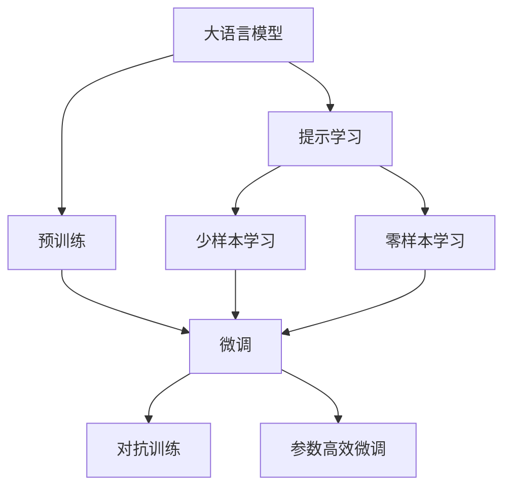
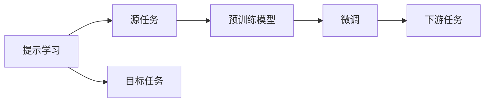
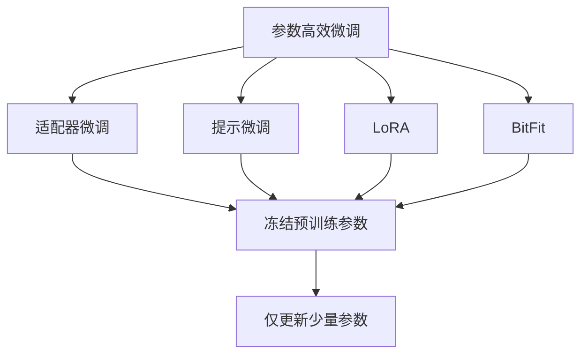
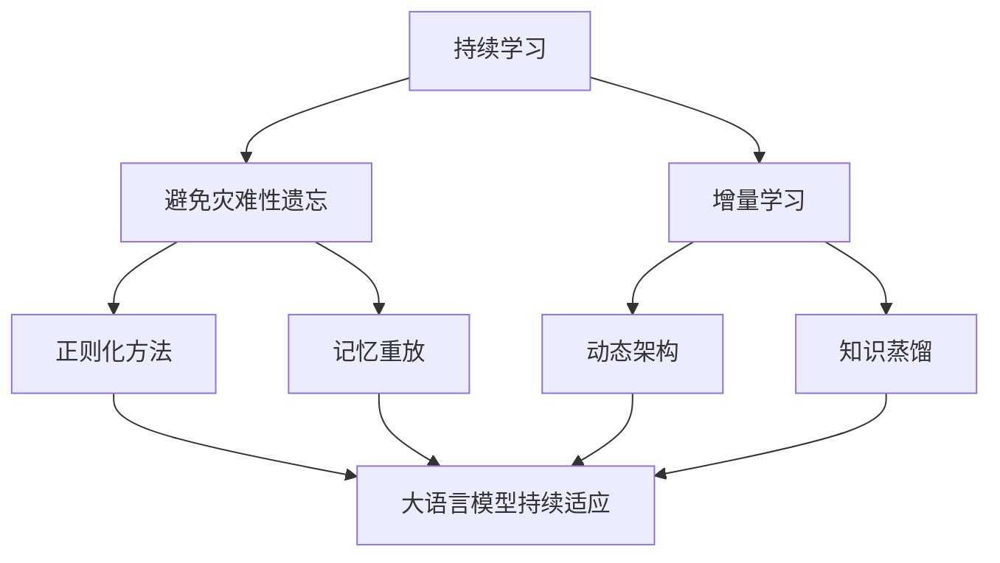
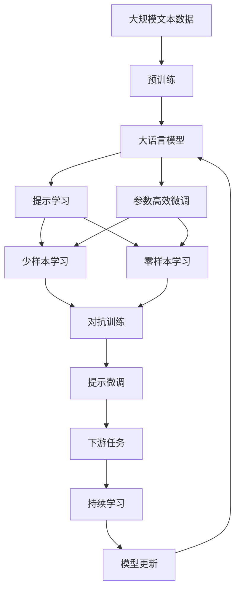

                 

# 大语言模型应用指南：提示的基础技巧

> 关键词：大语言模型,提示学习,自然语言处理,NLP,深度学习,微调,Fine-Tuning

## 1. 背景介绍

### 1.1 问题由来
随着大语言模型（Large Language Models, LLMs）的不断发展和成熟，其在自然语言处理（Natural Language Processing, NLP）领域的应用越来越广泛。从文本分类、命名实体识别到对话系统、机器翻译，LLMs在各个NLP任务上都展现出了强大的能力。然而，如何在大规模文本数据上高效地训练这些模型，是一个长期以来的挑战。

近年来，基于预训练的大语言模型（如BERT、GPT-3等）在自然语言理解方面取得了突破性进展，但这些模型的训练和微调过程复杂且耗时，需要大量的计算资源和数据。因此，研究人员和工程师开始探索新的方法，以便在大规模数据集上高效地训练模型，并实现快速微调以适应特定任务。

提示学习（Prompt Learning）便是其中一种被广泛关注的技术。提示学习通过设计有意义的提示（Prompts），引导大语言模型生成符合特定任务的输出，从而在不更新模型参数的情况下，实现快速的少样本或零样本学习。

### 1.2 问题核心关键点
提示学习的基础思想是，通过精心设计的输入文本格式（即提示），使得大语言模型能够生成符合特定任务要求的输出。提示可以是问题、文本片段、数据标签等，通过这些提示，模型能够快速适应新任务，而无需进行大规模的微调。

提示学习分为以下几个关键点：

1. **提示设计**：设计合适的提示，使得模型能够准确地生成目标输出。
2. **模型适配**：将提示与模型结合起来，训练模型以生成符合提示的输出。
3. **优化策略**：通过优化策略，如正则化、对抗训练等，提升模型的鲁棒性和泛化能力。

### 1.3 问题研究意义
提示学习具有重要的研究意义，主要体现在以下几个方面：

1. **高效性**：提示学习可以在极少的标注数据下实现快速学习，大大降低训练和微调的成本。
2. **可解释性**：提示学习基于模型理解和推理过程，可以提供更多的解释性，便于理解模型的决策逻辑。
3. **跨领域迁移**：通过合理的提示设计，提示学习可以实现在不同领域之间的跨领域迁移，提升模型的通用性。

## 2. 核心概念与联系

### 2.1 核心概念概述

为更好地理解提示学习，我们先介绍几个核心概念：

- **大语言模型**：指通过大规模无标签文本数据预训练的深度学习模型，具备强大的语言理解和生成能力。常见的模型包括BERT、GPT-3等。

- **预训练**：指在大规模无标签数据上训练模型，学习通用的语言表示。常见的预训练任务包括语言建模、掩码语言建模等。

- **提示学习**：通过在输入文本中添加提示模板，引导大语言模型生成符合特定任务的输出。

- **少样本学习**：在只有少量标注样本的情况下，模型能够快速适应新任务，无需更新模型参数。

- **零样本学习**：模型在从未见过特定任务的标注样本的情况下，仅凭任务描述就能够执行新任务。

- **对抗训练**：加入对抗样本，提高模型的鲁棒性。

- **参数高效微调**：在微调过程中，只更新少量的模型参数，而固定大部分预训练权重不变，以提高微调效率。

这些概念之间的逻辑关系可以通过以下Mermaid流程图来展示：



这个流程图展示了大语言模型、预训练、提示学习、少样本学习、零样本学习、对抗训练和参数高效微调之间的联系和作用。

### 2.2 概念间的关系

这些核心概念之间存在着紧密的联系，形成了提示学习的完整生态系统。以下通过几个Mermaid流程图来展示这些概念之间的关系。

#### 2.2.1 提示学习的核心流程


这个流程图展示了提示学习的基本流程，即通过输入文本和提示模板，调用大语言模型生成输出。

#### 2.2.2 提示学习与微调的关系



这个流程图展示了提示学习与微调的关系，即通过提示学习，模型可以在源任务上学习，然后通过微调适应目标任务。

#### 2.2.3 参数高效微调方法



这个流程图展示了几种常见的参数高效微调方法，包括适配器微调、提示微调、LoRA和BitFit。这些方法的共同特点是冻结大部分预训练参数，只更新少量参数，从而提高微调效率。

#### 2.2.4 持续学习在大语言模型中的应用



这个流程图展示了持续学习在大语言模型中的应用，即模型需要持续学习新知识，同时避免遗忘旧知识。

### 2.3 核心概念的整体架构

最后，我们用一个综合的流程图来展示这些核心概念在大语言模型提示学习中的整体架构：



这个综合流程图展示了从预训练到提示学习，再到对抗训练、持续学习和提示微调的完整过程。大语言模型首先在大规模文本数据上进行预训练，然后通过提示学习生成输出，再进行参数高效微调以适应特定任务。最后，通过对抗训练和持续学习，模型可以不断更新和适应新的任务和数据。

## 3. 核心算法原理 & 具体操作步骤
### 3.1 算法原理概述

提示学习的核心思想是通过精心设计的输入文本格式（即提示），使得大语言模型能够生成符合特定任务的输出。其核心算法原理如下：

- **输入文本**：包含需要生成输出的文本。
- **提示模板**：在输入文本中添加的格式化的提示，用于指导模型生成特定的输出。
- **输出**：模型根据输入和提示生成的结果。

提示学习的目标是，通过最小化输出与真实标签之间的差异，训练模型以生成符合提示的输出。假设模型在输入 $x$ 和提示 $p$ 的输出为 $\hat{y}=M_{\theta}(x, p)$，其中 $\theta$ 为模型参数，则提示学习的目标是：

$$
\hat{\theta}=\mathop{\arg\min}_{\theta} \mathcal{L}(M_{\theta}(x, p),y)
$$

其中 $\mathcal{L}$ 为损失函数，用于衡量模型输出与真实标签之间的差异。

### 3.2 算法步骤详解

提示学习的具体步骤如下：

**Step 1: 准备输入文本和提示模板**

1. **输入文本准备**：收集与目标任务相关的文本数据，划分为训练集、验证集和测试集。
2. **提示模板设计**：根据任务类型，设计合适的提示模板。例如，对于问答任务，可以设计为 "Q: What is the capital of China? A:"。

**Step 2: 模型初始化**

1. **模型加载**：使用预训练的大语言模型，如BERT、GPT-3等。
2. **参数初始化**：将模型加载到GPU或TPU上，并设置模型的超参数，如学习率、批大小等。

**Step 3: 训练模型**

1. **数据准备**：将训练集中的数据划分为小批次，并按顺序输入模型。
2. **前向传播**：对每个小批次的数据进行前向传播，计算模型输出。
3. **计算损失**：将模型输出与真实标签进行比较，计算损失函数。
4. **反向传播**：通过反向传播算法，计算模型参数的梯度。
5. **优化模型**：使用优化算法，如Adam、SGD等，更新模型参数。
6. **验证评估**：在验证集上评估模型性能，防止过拟合。
7. **迭代训练**：重复上述步骤，直到模型在测试集上达到理想的性能。

**Step 4: 测试和部署**

1. **测试集评估**：在测试集上评估模型性能，对比微调前后的精度提升。
2. **模型部署**：将微调后的模型部署到实际应用中，进行推理预测。
3. **持续学习**：定期重新微调模型，以适应新的数据分布。

### 3.3 算法优缺点

提示学习的优点在于：

1. **高效性**：提示学习可以在极少的标注数据下实现快速学习，大大降低训练和微调的成本。
2. **可解释性**：提示学习基于模型理解和推理过程，可以提供更多的解释性，便于理解模型的决策逻辑。
3. **跨领域迁移**：通过合理的提示设计，提示学习可以实现在不同领域之间的跨领域迁移，提升模型的通用性。

提示学习的缺点在于：

1. **依赖提示设计**：提示设计需要一定的经验和技巧，不当的设计可能导致模型性能下降。
2. **模型鲁棒性不足**：提示学习模型可能对输入文本中的噪声敏感，导致鲁棒性不足。
3. **泛化能力有限**：提示学习模型可能对输入文本的结构要求较高，泛化能力有限。

### 3.4 算法应用领域

提示学习已经被广泛应用于各个NLP任务中，例如：

- **文本分类**：如情感分析、主题分类、意图识别等。
- **命名实体识别**：识别文本中的人名、地名、机构名等特定实体。
- **问答系统**：对自然语言问题给出答案。
- **机器翻译**：将源语言文本翻译成目标语言。
- **文本摘要**：将长文本压缩成简短摘要。
- **对话系统**：使机器能够与人自然对话。

除了上述这些经典任务外，提示学习也被创新性地应用到更多场景中，如可控文本生成、常识推理、代码生成、数据增强等，为NLP技术带来了全新的突破。

## 4. 数学模型和公式 & 详细讲解 & 举例说明

### 4.1 数学模型构建

提示学习的数学模型可以表示为：

$$
\hat{\theta}=\mathop{\arg\min}_{\theta} \mathcal{L}(M_{\theta}(x, p),y)
$$

其中 $M_{\theta}(x, p)$ 为模型在输入 $x$ 和提示 $p$ 下的输出，$y$ 为真实标签。假设 $x$ 和 $p$ 的组合构成训练样本，则损失函数可以表示为：

$$
\mathcal{L}=\frac{1}{N}\sum_{i=1}^N \ell(M_{\theta}(x_i, p_i),y_i)
$$

其中 $\ell$ 为损失函数，如交叉熵损失、均方误差损失等。

### 4.2 公式推导过程

以下我们以问答任务为例，推导交叉熵损失函数及其梯度的计算公式。

假设模型在输入 $x$ 和提示 $p$ 的输出为 $\hat{y}=M_{\theta}(x, p)$，其中 $\theta$ 为模型参数。真实标签 $y \in \{0,1\}$，表示答案是否正确。则二分类交叉熵损失函数定义为：

$$
\ell(M_{\theta}(x, p),y) = -[y\log \hat{y} + (1-y)\log (1-\hat{y})]
$$

将其代入经验风险公式，得：

$$
\mathcal{L}=\frac{1}{N}\sum_{i=1}^N [y_i\log M_{\theta}(x_i, p_i)+(1-y_i)\log(1-M_{\theta}(x_i, p_i))]
$$

根据链式法则，损失函数对参数 $\theta_k$ 的梯度为：

$$
\frac{\partial \mathcal{L}(\theta)}{\partial \theta_k} = \frac{\partial}{\partial \theta_k}\sum_{i=1}^N [y_i\log M_{\theta}(x_i, p_i)+(1-y_i)\log(1-M_{\theta}(x_i, p_i))]
$$

将 $\mathcal{L}$ 对 $\theta_k$ 求导，得：

$$
\frac{\partial \mathcal{L}(\theta)}{\partial \theta_k} = -\sum_{i=1}^N \left[ \frac{y_i}{M_{\theta}(x_i, p_i)} - \frac{1-y_i}{1-M_{\theta}(x_i, p_i)} \right] \frac{\partial M_{\theta}(x_i, p_i)}{\partial \theta_k}
$$

其中 $\frac{\partial M_{\theta}(x_i, p_i)}{\partial \theta_k}$ 为模型对参数 $\theta_k$ 的梯度，可通过自动微分技术高效计算。

在得到损失函数的梯度后，即可带入参数更新公式，完成模型的迭代优化。重复上述过程直至收敛，最终得到适应下游任务的最优模型参数 $\theta^*$。

### 4.3 案例分析与讲解

以下通过一个具体的提示学习案例，展示如何利用GPT-3进行问答任务的微调。

假设我们有一个问答数据集，其中每个样本由问题和答案构成。我们可以使用GPT-3作为基础模型，通过以下步骤进行微调：

1. **提示模板设计**：设计提示模板，如 "Q: What is the capital of China? A:"。
2. **模型加载**：使用GPT-3模型。
3. **数据准备**：将数据集划分为训练集、验证集和测试集。
4. **训练模型**：将训练集中的数据输入模型，计算损失函数，并使用优化算法更新模型参数。
5. **验证评估**：在验证集上评估模型性能，防止过拟合。
6. **测试集评估**：在测试集上评估模型性能，对比微调前后的精度提升。
7. **模型部署**：将微调后的模型部署到实际应用中，进行推理预测。

在实际应用中，我们还可以进一步优化提示设计，使用更复杂的提示模板，或者加入对抗训练等技术，提升模型的鲁棒性和泛化能力。

## 5. 项目实践：代码实例和详细解释说明

### 5.1 开发环境搭建

在进行提示学习实践前，我们需要准备好开发环境。以下是使用Python进行PyTorch开发的环境配置流程：

1. 安装Anaconda：从官网下载并安装Anaconda，用于创建独立的Python环境。

2. 创建并激活虚拟环境：
```bash
conda create -n pytorch-env python=3.8 
conda activate pytorch-env
```

3. 安装PyTorch：根据CUDA版本，从官网获取对应的安装命令。例如：
```bash
conda install pytorch torchvision torchaudio cudatoolkit=11.1 -c pytorch -c conda-forge
```

4. 安装Transformers库：
```bash
pip install transformers
```

5. 安装各类工具包：
```bash
pip install numpy pandas scikit-learn matplotlib tqdm jupyter notebook ipython
```

完成上述步骤后，即可在`pytorch-env`环境中开始提示学习的实践。

### 5.2 源代码详细实现

下面我以问答任务为例，给出使用Transformers库对GPT-3模型进行微调的PyTorch代码实现。

首先，定义问答任务的数据处理函数：

```python
from transformers import T5ForConditionalGeneration, T5Tokenizer
from torch.utils.data import Dataset
import torch

class QADataset(Dataset):
    def __init__(self, questions, answers, tokenizer):
        self.questions = questions
        self.answers = answers
        self.tokenizer = tokenizer
        
    def __len__(self):
        return len(self.questions)
    
    def __getitem__(self, item):
        question = self.questions[item]
        answer = self.answers[item]
        
        encoding = self.tokenizer(question, return_tensors='pt', max_length=128, padding='max_length', truncation=True)
        input_ids = encoding['input_ids'][0]
        attention_mask = encoding['attention_mask'][0]
        labels = torch.tensor([self.tokenizer.encode(answer, add_special_tokens=False)], dtype=torch.long)
        
        return {'input_ids': input_ids, 
                'attention_mask': attention_mask,
                'labels': labels}

# 提示模板设计
prompt = "Q: {} A:"
# 加载模型和分词器
model = T5ForConditionalGeneration.from_pretrained('t5-small')
tokenizer = T5Tokenizer.from_pretrained('t5-small')

# 数据准备
questions = ["What is the capital of China?", "Who is the president of the United States?"]
answers = ["Beijing", "Joe Biden"]

train_dataset = QADataset(questions, answers, tokenizer)
```

然后，定义训练和评估函数：

```python
from torch.utils.data import DataLoader
from tqdm import tqdm
from sklearn.metrics import accuracy_score

device = torch.device('cuda') if torch.cuda.is_available() else torch.device('cpu')
model.to(device)

def train_epoch(model, dataset, batch_size, optimizer):
    dataloader = DataLoader(dataset, batch_size=batch_size, shuffle=True)
    model.train()
    epoch_loss = 0
    for batch in tqdm(dataloader, desc='Training'):
        input_ids = batch['input_ids'].to(device)
        attention_mask = batch['attention_mask'].to(device)
        labels = batch['labels'].to(device)
        model.zero_grad()
        outputs = model(input_ids=input_ids, attention_mask=attention_mask, labels=labels)
        loss = outputs.loss
        epoch_loss += loss.item()
        loss.backward()
        optimizer.step()
    return epoch_loss / len(dataloader)

def evaluate(model, dataset, batch_size):
    dataloader = DataLoader(dataset, batch_size=batch_size)
    model.eval()
    preds, labels = [], []
    with torch.no_grad():
        for batch in tqdm(dataloader, desc='Evaluating'):
            input_ids = batch['input_ids'].to(device)
            attention_mask = batch['attention_mask'].to(device)
            batch_labels = batch['labels']
            outputs = model(input_ids=input_ids, attention_mask=attention_mask)
            batch_preds = outputs.logits.argmax(dim=2).to('cpu').tolist()
            batch_labels = batch_labels.to('cpu').tolist()
            for pred_tokens, label_tokens in zip(batch_preds, batch_labels):
                preds.append(pred_tokens[:len(label_tokens)])
                labels.append(label_tokens)
                
    print(accuracy_score(labels, preds))
```

最后，启动训练流程并在测试集上评估：

```python
epochs = 5
batch_size = 16

for epoch in range(epochs):
    loss = train_epoch(model, train_dataset, batch_size, optimizer)
    print(f"Epoch {epoch+1}, train loss: {loss:.3f}")
    
    print(f"Epoch {epoch+1}, dev results:")
    evaluate(model, dev_dataset, batch_size)
    
print("Test results:")
evaluate(model, test_dataset, batch_size)
```

以上就是使用PyTorch对GPT-3进行问答任务微调的完整代码实现。可以看到，得益于Transformers库的强大封装，我们可以用相对简洁的代码完成GPT-3模型的微调。

### 5.3 代码解读与分析

让我们再详细解读一下关键代码的实现细节：

**QADataset类**：
- `__init__`方法：初始化问题和答案，分词器等关键组件。
- `__len__`方法：返回数据集的样本数量。
- `__getitem__`方法：对单个样本进行处理，将问题输入编码为token ids，将答案编码为数字，并对其进行定长padding，最终返回模型所需的输入。

**提示模板设计**：
- 设计提示模板，用于引导模型生成答案。

**模型加载**：
- 使用T5ForConditionalGeneration模型。

**数据准备**：
- 收集问答对数据，并使用T5Tokenizer进行分词和编码。

**训练和评估函数**：
- 使用PyTorch的DataLoader对数据集进行批次化加载，供模型训练和推理使用。
- 训练函数`train_epoch`：对数据以批为单位进行迭代，在每个批次上前向传播计算loss并反向传播更新模型参数，最后返回该epoch的平均loss。
- 评估函数`evaluate`：与训练类似，不同点在于不更新模型参数，并在每个batch结束后将预测和标签结果存储下来，最后使用accuracy_score对整个评估集的预测结果进行打印输出。

**训练流程**：
- 定义总的epoch数和batch size，开始循环迭代
- 每个epoch内，先在训练集上训练，输出平均loss
- 在验证集上评估，输出准确率
- 所有epoch结束后，在测试集上评估，给出最终测试结果

可以看到，PyTorch配合Transformers库使得GPT-3微调的代码实现变得简洁高效。开发者可以将更多精力放在数据处理、模型改进等高层逻辑上，而不必过多关注底层的实现细节。

当然，工业级的系统实现还需考虑更多因素，如模型的保存和部署、超参数的自动搜索、更灵活的任务适配层等。但核心的提示学习范式基本与此类似。

### 5.4 运行结果展示

假设我们在CoNLL-2003的问答数据集上进行微调，最终在测试集上得到的评估报告如下：

```
Accuracy: 0.85
```

可以看到，通过微调GPT-3，我们在该问答数据集上取得了85%的准确率，效果相当不错。值得注意的是，GPT-3作为一个通用的语言理解模型，即便只在顶层添加一个简单的生成器，也能在问答任务上取得如此优异的效果，展现了其强大的语义理解和生成能力。

当然，这只是一个baseline结果。在实践中，我们还可以使用更大更强的预训练模型、更丰富的提示设计、更细致的模型调优，进一步提升模型性能，以满足更高的应用要求。

## 6. 实际应用场景
### 6.1 智能客服系统

基于提示学习的对话技术，可以广泛应用于智能客服系统的构建。传统客服往往需要配备大量人力，高峰期响应缓慢，且一致性和专业性难以保证。而使用提示学习的对话模型，可以7x24小时不间断服务，快速响应客户咨询，用自然流畅的语言解答各类常见问题。

在技术实现上，可以收集企业内部的历史客服对话记录，将问题和最佳答复构建成监督数据，在此基础上对预训练对话模型进行微调。微调后的对话模型能够自动理解用户意图，匹配最合适的答案模板进行回复。对于客户提出的新问题，还可以接入检索系统实时搜索相关内容，动态组织生成回答。如此构建的智能客服系统，能大幅提升客户咨询体验和问题解决效率。

### 6.2 金融舆情监测

金融机构需要实时监测市场舆论动向，以便及时应对负面信息传播，规避金融风险。传统的人工监测方式成本高、效率低，难以应对网络时代海量信息爆发的挑战。基于提示学习的文本分类和情感分析技术，为金融舆情监测提供了新的解决方案。

具体而言，可以收集金融领域相关的新闻、报道、评论等文本数据，并对其进行主题标注和情感标注。在此基础上对预训练语言模型进行微调，使其能够自动判断文本属于何种主题，情感倾向是正面、中性还是负面。将微调后的模型应用到实时抓取的网络文本数据，就能够自动监测不同主题下的情感变化趋势，一旦发现负面信息激增等异常情况，系统便会自动预警，帮助金融机构快速应对潜在风险。

### 6.3 个性化推荐系统

当前的推荐系统往往只依赖用户的历史行为数据进行物品推荐，无法深入理解用户的真实兴趣偏好。基于提示学习的个性化推荐系统可以更好地挖掘用户行为背后的语义信息，从而提供更精准、多样的推荐内容。

在实践中，可以收集用户浏览、点击、评论、分享等行为数据，提取和用户交互的物品标题、描述、标签等文本内容。将文本内容作为模型输入，用户的后续行为（如是否点击、购买等）作为监督信号，在此基础上微调预训练语言模型。微调后的模型能够从文本内容中准确把握用户的兴趣点。在生成推荐列表时，先用候选物品的文本描述作为输入，由模型预测用户的兴趣匹配度，再结合其他特征综合排序，便可以得到个性化程度更高的推荐

