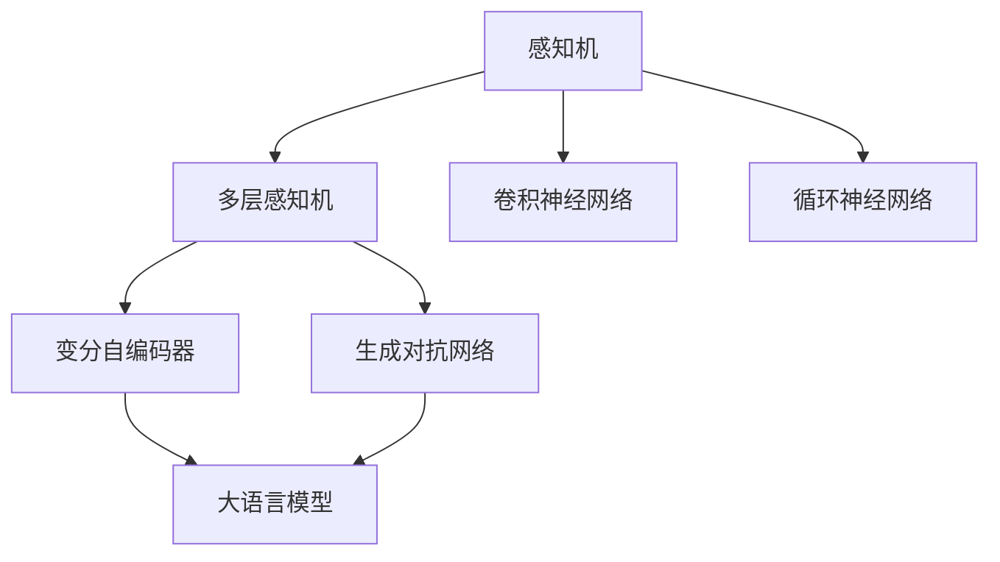

                 

# 大语言模型应用指南：神经网络的发展历史

> 关键词：神经网络历史,大语言模型发展,深度学习,计算机科学

## 1. 背景介绍

### 1.1 问题由来

现代计算机科学中，神经网络（Neural Network, NN）一直是人工智能研究的重要方向之一。近年来，基于神经网络的深度学习模型在各种任务上取得了惊人的表现，其中以大语言模型（Large Language Models, LLMs）尤为突出。

大语言模型如GPT、BERT等，通过在大规模无标签文本数据上进行预训练，学习到丰富的语言知识。基于这些模型，下游任务可以通过微调（Fine-Tuning）得到很好的结果。但关于神经网络的发展历史，以及它是如何演变成今天的大语言模型，很多人并不了解。

因此，本文将从神经网络的发展历史入手，通过梳理神经网络的历史脉络，理解大语言模型的起源和演变，从而为读者提供更深入的认知。

### 1.2 问题核心关键点

在研究神经网络的发展历史时，核心关键点在于理解以下几个方面：

1. 神经网络的历史发展脉络：从最早的感知机，到多层感知机（Multi-layer Perceptron, MLP），再到卷积神经网络（Convolutional Neural Network, CNN）、循环神经网络（Recurrent Neural Network, RNN）、变分自编码器（Variational Autoencoder, VAE）、生成对抗网络（Generative Adversarial Network, GAN），以及最新的大语言模型。
2. 神经网络在各个领域的应用：从最初的图像识别、语音识别，到自然语言处理、推荐系统、计算机视觉等诸多领域。
3. 神经网络的发展趋势：如网络结构的设计、参数量的变化、优化算法的演进、计算资源的提升等。

### 1.3 问题研究意义

理解神经网络的发展历史，对认识大语言模型的起源和演进有重要意义。它不仅能够帮助我们把握当前技术的发展趋势，还能够为我们未来的研究提供方向和参考。

具体而言，研究神经网络的历史可以：

1. 提供历史背景：了解神经网络是如何从简单的模型逐渐演进到复杂的大语言模型的。
2. 指导未来研究：神经网络的历史是不断进步的过程，通过历史回顾，可以更好地理解当前的局限和未来的发展方向。
3. 帮助技术应用：了解神经网络在不同领域的应用，可以借鉴成功经验，解决实际问题。
4. 提升技术水平：回顾神经网络的历史，可以借鉴优秀的模型设计理念和算法，提升技术水平。

## 2. 核心概念与联系

### 2.1 核心概念概述

要深入理解神经网络的发展历史，首先需要了解以下核心概念：

1. 感知机（Perceptron）：最早的神经网络模型，由Rosenblatt于1958年提出。它是单层的前馈神经网络，只包含输入层和输出层。

2. 多层感知机（MLP）：是感知机的拓展，通过增加多个隐藏层，可以进行更复杂的非线性映射。

3. 卷积神经网络（CNN）：用于图像处理领域，通过卷积操作，提取图像的局部特征，然后通过池化操作，减少参数量，进而提升模型的泛化能力。

4. 循环神经网络（RNN）：用于处理序列数据，如文本、语音等，通过循环结构，使模型能够记忆之前的状态，从而对当前输入进行预测。

5. 变分自编码器（VAE）：是一种无监督学习模型，用于降维和生成新样本，它的核心思想是通过学习数据的潜在分布，生成与原始数据相似的新样本。

6. 生成对抗网络（GAN）：由两个神经网络组成，生成器和判别器，通过对抗的方式，生成逼真的样本，广泛应用于图像生成和数据增强等任务。

7. 大语言模型（LLM）：如GPT、BERT等，通过大规模预训练，学习通用的语言表示，可以应用于各种NLP任务，如文本分类、情感分析、对话生成等。

这些核心概念构成了神经网络的历史脉络，下面通过Mermaid流程图展示这些概念之间的联系：



### 2.2 概念间的关系

这些核心概念之间的关系可以总结如下：

1. 感知机是神经网络的原型，是后续研究的基础。
2. 多层感知机在感知机的基础上增加了隐藏层，使模型可以处理更复杂的数据。
3. 卷积神经网络是感知机在图像处理上的应用，通过卷积操作提取特征，显著提升了图像识别的准确率。
4. 循环神经网络是感知机在序列数据上的应用，通过循环结构，可以处理变长的序列数据。
5. 变分自编码器和生成对抗网络是深度学习中的无监督学习模型，可以用于降维和生成新数据。
6. 大语言模型是深度学习在自然语言处理领域的重要应用，通过大规模预训练，可以处理各种NLP任务。

这些概念在相互结合的过程中，逐渐形成了今天的大语言模型。理解它们之间的关系，有助于我们把握神经网络的发展脉络。

## 3. 核心算法原理 & 具体操作步骤

### 3.1 算法原理概述

神经网络的核心思想是通过模型参数模拟生物神经元的非线性映射关系，从而实现复杂的数据处理和预测。神经网络的输入层接收数据，通过隐藏层进行一系列的计算和变换，最终输出预测结果。

对于大语言模型，其核心算法原理也是基于这一思想。通过在大规模无标签文本数据上进行预训练，学习到语言的知识表示，然后通过微调，适应下游任务的具体要求，提升模型的性能。

### 3.2 算法步骤详解

大语言模型微调的具体步骤如下：

1. **数据准备**：收集下游任务的标注数据集，划分为训练集、验证集和测试集。
2. **模型初始化**：选择合适的预训练语言模型，如BERT、GPT等，作为初始化参数。
3. **任务适配层添加**：根据任务类型，在预训练模型的顶层添加相应的输出层和损失函数。
4. **超参数设置**：设置优化算法及其参数，如学习率、批大小、迭代轮数等。
5. **模型训练**：通过反向传播计算损失函数，更新模型参数。
6. **验证集评估**：在验证集上评估模型性能，防止过拟合。
7. **测试集测试**：在测试集上评估模型最终性能。

以BERT为例，具体步骤如下：

1. 下载预训练的BERT模型。
2. 使用自定义的预处理函数，将输入文本转换为BERT能够接受的格式。
3. 定义模型结构，包括输入层、嵌入层、隐藏层、输出层和损失函数。
4. 加载预训练权重，初始化模型参数。
5. 定义优化器，如AdamW。
6. 在训练集上进行前向传播和反向传播，更新模型参数。
7. 在验证集上进行评估，保存最好的模型。
8. 在测试集上进行最终评估。

### 3.3 算法优缺点

大语言模型微调具有以下优点：

1. 高效性：使用预训练模型进行微调，可以大大减少从头训练的时间成本。
2. 准确性：预训练模型学到了通用的语言知识，经过微调后，可以更好地适应下游任务的要求。
3. 可扩展性：模型可以通过添加更多的层和节点进行扩展，提升性能。

但同时也存在一些缺点：

1. 数据依赖：微调的性能很大程度上依赖于标注数据的质量和数量，获取高质量标注数据成本较高。
2. 泛化能力：预训练模型的泛化能力有限，当目标任务与预训练数据分布差异较大时，微调效果可能不佳。
3. 计算资源：预训练模型参数量大，训练和推理都需要消耗大量计算资源。

### 3.4 算法应用领域

大语言模型微调在多个领域都有应用，主要包括：

1. 文本分类：如情感分析、主题分类等。
2. 命名实体识别：识别文本中的人名、地名、机构名等特定实体。
3. 关系抽取：从文本中抽取实体之间的语义关系。
4. 问答系统：对自然语言问题给出答案。
5. 机器翻译：将源语言文本翻译成目标语言。
6. 文本摘要：将长文本压缩成简短摘要。
7. 对话系统：使机器能够与人自然对话。

这些应用领域覆盖了NLP技术的主要应用场景，充分展示了大语言模型微调的强大能力。

## 4. 数学模型和公式 & 详细讲解 & 举例说明

### 4.1 数学模型构建

大语言模型的数学模型主要基于神经网络的基本框架。假设预训练语言模型为 $M_{\theta}$，其中 $\theta$ 为预训练得到的模型参数。给定下游任务 $T$ 的标注数据集 $D=\{(x_i,y_i)\}_{i=1}^N$，微调的目标是找到新的模型参数 $\hat{\theta}$，使得：

$$
\hat{\theta}=\mathop{\arg\min}_{\theta} \mathcal{L}(M_{\theta},D)
$$

其中 $\mathcal{L}$ 为针对任务 $T$ 设计的损失函数，用于衡量模型预测输出与真实标签之间的差异。常见的损失函数包括交叉熵损失、均方误差损失等。

### 4.2 公式推导过程

以二分类任务为例，假设模型 $M_{\theta}$ 在输入 $x$ 上的输出为 $\hat{y}=M_{\theta}(x) \in [0,1]$，表示样本属于正类的概率。真实标签 $y \in \{0,1\}$。则二分类交叉熵损失函数定义为：

$$
\ell(M_{\theta}(x),y) = -[y\log \hat{y} + (1-y)\log (1-\hat{y})]
$$

将其代入经验风险公式，得：

$$
\mathcal{L}(\theta) = -\frac{1}{N}\sum_{i=1}^N [y_i\log M_{\theta}(x_i)+(1-y_i)\log(1-M_{\theta}(x_i))]
$$

根据链式法则，损失函数对参数 $\theta_k$ 的梯度为：

$$
\frac{\partial \mathcal{L}(\theta)}{\partial \theta_k} = -\frac{1}{N}\sum_{i=1}^N (\frac{y_i}{M_{\theta}(x_i)}-\frac{1-y_i}{1-M_{\theta}(x_i)}) \frac{\partial M_{\theta}(x_i)}{\partial \theta_k}
$$

其中 $\frac{\partial M_{\theta}(x_i)}{\partial \theta_k}$ 可进一步递归展开，利用自动微分技术完成计算。

### 4.3 案例分析与讲解

以BERT为例，其微调的具体过程如下：

1. 定义任务适配层：假设任务为命名实体识别（NER），在BERT的顶层添加一个线性分类器和交叉熵损失函数。
2. 加载预训练权重：使用BERT的预训练权重，初始化模型参数。
3. 设置超参数：如学习率、批大小、迭代轮数等。
4. 模型训练：在训练集上进行前向传播和反向传播，更新模型参数。
5. 验证集评估：在验证集上进行评估，保存最好的模型。
6. 测试集测试：在测试集上进行最终评估。

## 5. 项目实践：代码实例和详细解释说明

### 5.1 开发环境搭建

在进行BERT微调的实践前，需要准备以下开发环境：

1. 安装Anaconda：从官网下载并安装Anaconda，用于创建独立的Python环境。

2. 创建并激活虚拟环境：
```bash
conda create -n bert-env python=3.8 
conda activate bert-env
```

3. 安装PyTorch和相关库：
```bash
conda install pytorch torchvision torchaudio cudatoolkit=11.1 -c pytorch -c conda-forge
pip install transformers
```

4. 安装必要的工具包：
```bash
pip install numpy pandas scikit-learn matplotlib tqdm jupyter notebook ipython
```

5. 安装数据集：
```bash
git clone https://github.com/imdb-datasets/glue-datasets.git
```

### 5.2 源代码详细实现

以下是一份使用PyTorch对BERT进行命名实体识别（NER）任务微调的代码实现。

```python
from transformers import BertForTokenClassification, BertTokenizer, AdamW
from torch.utils.data import DataLoader, Dataset

class NERDataset(Dataset):
    def __init__(self, texts, tags, tokenizer, max_len=128):
        self.texts = texts
        self.tags = tags
        self.tokenizer = tokenizer
        self.max_len = max_len

    def __len__(self):
        return len(self.texts)

    def __getitem__(self, item):
        text = self.texts[item]
        tags = self.tags[item]

        encoding = self.tokenizer(text, return_tensors='pt', max_length=self.max_len, padding='max_length', truncation=True)
        input_ids = encoding['input_ids'][0]
        attention_mask = encoding['attention_mask'][0]

        # 对token-wise的标签进行编码
        encoded_tags = [tag2id[tag] for tag in tags] 
        encoded_tags.extend([tag2id['O']] * (self.max_len - len(encoded_tags)))
        labels = torch.tensor(encoded_tags, dtype=torch.long)

        return {'input_ids': input_ids, 
                'attention_mask': attention_mask,
                'labels': labels}

# 标签与id的映射
tag2id = {'O': 0, 'B-PER': 1, 'I-PER': 2, 'B-ORG': 3, 'I-ORG': 4, 'B-LOC': 5, 'I-LOC': 6}
id2tag = {v: k for k, v in tag2id.items()}

# 创建dataset
tokenizer = BertTokenizer.from_pretrained('bert-base-cased')

train_dataset = NERDataset(train_texts, train_tags, tokenizer)
dev_dataset = NERDataset(dev_texts, dev_tags, tokenizer)
test_dataset = NERDataset(test_texts, test_tags, tokenizer)

# 定义模型和优化器
model = BertForTokenClassification.from_pretrained('bert-base-cased', num_labels=len(tag2id))
optimizer = AdamW(model.parameters(), lr=2e-5)

# 定义训练和评估函数
device = torch.device('cuda') if torch.cuda.is_available() else torch.device('cpu')
model.to(device)

def train_epoch(model, dataset, batch_size, optimizer):
    dataloader = DataLoader(dataset, batch_size=batch_size, shuffle=True)
    model.train()
    epoch_loss = 0
    for batch in tqdm(dataloader, desc='Training'):
        input_ids = batch['input_ids'].to(device)
        attention_mask = batch['attention_mask'].to(device)
        labels = batch['labels'].to(device)
        model.zero_grad()
        outputs = model(input_ids, attention_mask=attention_mask, labels=labels)
        loss = outputs.loss
        epoch_loss += loss.item()
        loss.backward()
        optimizer.step()
    return epoch_loss / len(dataloader)

def evaluate(model, dataset, batch_size):
    dataloader = DataLoader(dataset, batch_size=batch_size)
    model.eval()
    preds, labels = [], []
    with torch.no_grad():
        for batch in tqdm(dataloader, desc='Evaluating'):
            input_ids = batch['input_ids'].to(device)
            attention_mask = batch['attention_mask'].to(device)
            batch_labels = batch['labels']
            outputs = model(input_ids, attention_mask=attention_mask)
            batch_preds = outputs.logits.argmax(dim=2).to('cpu').tolist()
            batch_labels = batch_labels.to('cpu').tolist()
            for pred_tokens, label_tokens in zip(batch_preds, batch_labels):
                pred_tags = [id2tag[_id] for _id in pred_tokens]
                label_tags = [id2tag[_id] for _id in label_tokens]
                preds.append(pred_tags[:len(label_tags)])
                labels.append(label_tags)

    print(classification_report(labels, preds))

# 启动训练流程并在测试集上评估
epochs = 5
batch_size = 16

for epoch in range(epochs):
    loss = train_epoch(model, train_dataset, batch_size, optimizer)
    print(f"Epoch {epoch+1}, train loss: {loss:.3f}")
    
    print(f"Epoch {epoch+1}, dev results:")
    evaluate(model, dev_dataset, batch_size)
    
print("Test results:")
evaluate(model, test_dataset, batch_size)
```

### 5.3 代码解读与分析

以下是关键代码的详细解读：

**NERDataset类**：
- `__init__`方法：初始化文本、标签、分词器等关键组件。
- `__len__`方法：返回数据集的样本数量。
- `__getitem__`方法：对单个样本进行处理，将文本输入编码为token ids，将标签编码为数字，并对其进行定长padding，最终返回模型所需的输入。

**tag2id和id2tag字典**：
- 定义了标签与数字id之间的映射关系，用于将token-wise的预测结果解码回真实的标签。

**训练和评估函数**：
- 使用PyTorch的DataLoader对数据集进行批次化加载，供模型训练和推理使用。
- 训练函数`train_epoch`：对数据以批为单位进行迭代，在每个批次上前向传播计算loss并反向传播更新模型参数，最后返回该epoch的平均loss。
- 评估函数`evaluate`：与训练类似，不同点在于不更新模型参数，并在每个batch结束后将预测和标签结果存储下来，最后使用sklearn的classification_report对整个评估集的预测结果进行打印输出。

**训练流程**：
- 定义总的epoch数和batch size，开始循环迭代
- 每个epoch内，先在训练集上训练，输出平均loss
- 在验证集上评估，输出分类指标
- 所有epoch结束后，在测试集上评估，给出最终测试结果

## 6. 实际应用场景

### 6.1 智能客服系统

智能客服系统是一种典型的应用场景，通过微调预训练模型，可以提升客服系统的智能化水平。传统客服往往需要配备大量人力，高峰期响应缓慢，且一致性和专业性难以保证。而使用微调后的对话模型，可以7x24小时不间断服务，快速响应客户咨询，用自然流畅的语言解答各类常见问题。

在技术实现上，可以收集企业内部的历史客服对话记录，将问题和最佳答复构建成监督数据，在此基础上对预训练对话模型进行微调。微调后的对话模型能够自动理解用户意图，匹配最合适的答案模板进行回复。对于客户提出的新问题，还可以接入检索系统实时搜索相关内容，动态组织生成回答。如此构建的智能客服系统，能大幅提升客户咨询体验和问题解决效率。

### 6.2 金融舆情监测

金融机构需要实时监测市场舆论动向，以便及时应对负面信息传播，规避金融风险。传统的人工监测方式成本高、效率低，难以应对网络时代海量信息爆发的挑战。基于大语言模型微调的文本分类和情感分析技术，为金融舆情监测提供了新的解决方案。

具体而言，可以收集金融领域相关的新闻、报道、评论等文本数据，并对其进行主题标注和情感标注。在此基础上对预训练语言模型进行微调，使其能够自动判断文本属于何种主题，情感倾向是正面、中性还是负面。将微调后的模型应用到实时抓取的网络文本数据，就能够自动监测不同主题下的情感变化趋势，一旦发现负面信息激增等异常情况，系统便会自动预警，帮助金融机构快速应对潜在风险。

### 6.3 个性化推荐系统

当前的推荐系统往往只依赖用户的历史行为数据进行物品推荐，无法深入理解用户的真实兴趣偏好。基于大语言模型微调技术，个性化推荐系统可以更好地挖掘用户行为背后的语义信息，从而提供更精准、多样的推荐内容。

在实践中，可以收集用户浏览、点击、评论、分享等行为数据，提取和用户交互的物品标题、描述、标签等文本内容。将文本内容作为模型输入，用户的后续行为（如是否点击、购买等）作为监督信号，在此基础上微调预训练语言模型。微调后的模型能够从文本内容中准确把握用户的兴趣点。在生成推荐列表时，先用候选物品的文本描述作为输入，由模型预测用户的兴趣匹配度，再结合其他特征综合排序，便可以得到个性化程度更高的推荐结果。

### 6.4 未来应用展望

随着大语言模型微调技术的发展，其应用场景将越来越广泛。

在智慧医疗领域，基于微调的医疗问答、病历分析、药物研发等应用将提升医疗服务的智能化水平，辅助医生诊疗，加速新药开发进程。

在智能教育领域，微调技术可应用于作业批改、学情分析、知识推荐等方面，因材施教，促进教育公平，提高教学质量。

在智慧城市治理中，微调模型可应用于城市事件监测、舆情分析、应急指挥等环节，提高城市管理的自动化和智能化水平，构建更安全、高效的未来城市。

此外，在企业生产、社会治理、文娱传媒等众多领域，基于大语言模型微调的人工智能应用也将不断涌现，为经济社会发展注入新的动力。相信随着技术的日益成熟，微调方法将成为人工智能落地应用的重要范式，推动人工智能技术在各个领域的应用和发展。

## 7. 工具和资源推荐

### 7.1 学习资源推荐

为了帮助开发者系统掌握大语言模型微调的理论基础和实践技巧，这里推荐一些优质的学习资源：

1. 《Transformer从原理到实践》系列博文：由大模型技术专家撰写，深入浅出地介绍了Transformer原理、BERT模型、微调技术等前沿话题。

2. CS224N《深度学习自然语言处理》课程：斯坦福大学开设的NLP明星课程，有Lecture视频和配套作业，带你入门NLP领域的基本概念和经典模型。

3. 《Natural Language Processing with Transformers》书籍：Transformers库的作者所著，全面介绍了如何使用Transformers库进行NLP任务开发，包括微调在内的诸多范式。

4. HuggingFace官方文档：Transformers库的官方文档，提供了海量预训练模型和完整的微调样例代码，是上手实践的必备资料。

5. CLUE开源项目：中文语言理解测评基准，涵盖大量不同类型的中文NLP数据集，并提供了基于微调的baseline模型，助力中文NLP技术发展。

通过对这些资源的学习实践，相信你一定能够快速掌握大语言模型微调的精髓，并用于解决实际的NLP问题。

### 7.2 开发工具推荐

高效的开发离不开优秀的工具支持。以下是几款用于大语言模型微调开发的常用工具：

1. PyTorch：基于Python的开源深度学习框架，灵活动态的计算图，适合快速迭代研究。大部分预训练语言模型都有PyTorch版本的实现。

2. TensorFlow：由Google主导开发的开源深度学习框架，生产部署方便，适合大规模工程应用。同样有丰富的预训练语言模型资源。

3. Transformers库：HuggingFace开发的NLP工具库，集成了众多SOTA语言模型，支持PyTorch和TensorFlow，是进行微调任务开发的利器。

4. Weights & Biases：模型训练的实验跟踪工具，可以记录和可视化模型训练过程中的各项指标，方便对比和调优。与主流深度学习框架无缝集成。

5. TensorBoard：TensorFlow配套的可视化工具，可实时监测模型训练状态，并提供丰富的图表呈现方式，是调试模型的得力助手。

6. Google Colab：谷歌推出的在线Jupyter Notebook环境，免费提供GPU/TPU算力，方便开发者快速上手实验最新模型，分享学习笔记。

合理利用这些工具，可以显著提升大语言模型微调任务的开发效率，加快创新迭代的步伐。

### 7.3 相关论文推荐

大语言模型和微调技术的发展源于学界的持续研究。以下是几篇奠基性的相关论文，推荐阅读：

1. Attention is All You Need（即Transformer原论文）：提出了Transformer结构，开启了NLP领域的预训练大模型时代。

2. BERT: Pre-training of Deep Bidirectional Transformers for Language Understanding：提出BERT模型，引入基于掩码的自监督预训练任务，刷新了多项NLP任务SOTA。

3. Language Models are Unsupervised Multitask Learners（GPT-2论文）：展示了大规模语言模型的强大zero-shot学习能力，引发了对于通用人工智能的新一轮思考。

4. Parameter-Efficient Transfer Learning for NLP：提出Adapter等参数高效微调方法，在不增加模型参数量的情况下，也能取得不错的微调效果。

5. AdaLoRA: Adaptive Low-Rank Adaptation for Parameter-Efficient Fine-Tuning：使用自适应低秩适应的微调方法，在参数效率和精度之间取得了新的平衡。

这些论文代表了大语言模型微调技术的发展脉络。通过学习这些前沿成果，可以帮助研究者把握学科前进方向，激发更多的创新灵感。

除上述资源外，还有一些值得关注的前沿资源，帮助开发者紧跟大语言模型微调技术的最新进展，例如：

1. arXiv论文预印本：人工智能领域最新研究成果的发布平台，包括大量尚未发表的前沿工作，学习前沿技术的必读资源。

2. 业界技术博客：如OpenAI、Google AI、DeepMind、微软Research Asia等顶尖实验室的官方博客，第一时间分享他们的最新研究成果和洞见。

3. 技术会议直播：如NIPS、ICML、ACL、ICLR等人工智能领域顶会现场或

