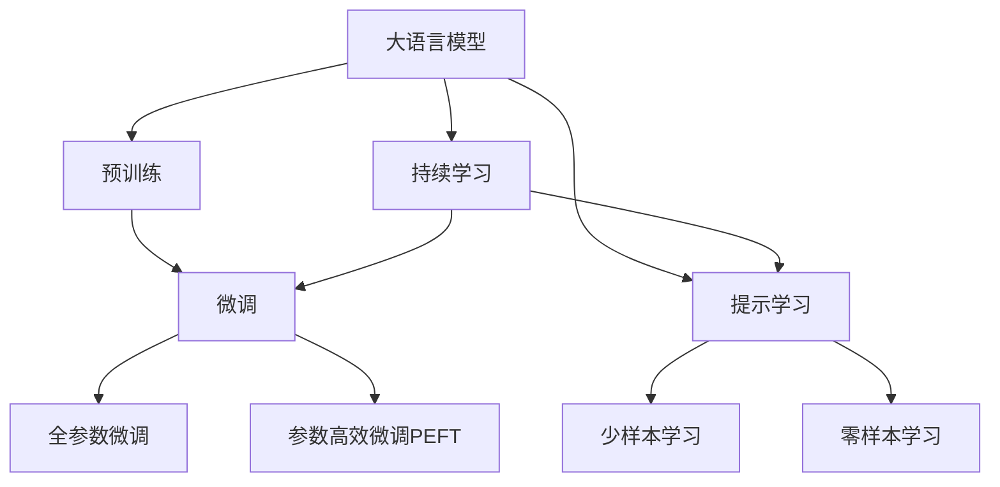

                 

# 大语言模型应用指南：高效参数微调

> 关键词：大语言模型,微调(Fine-tuning),参数高效微调(PEFT),自然语言处理(NLP)

## 1. 背景介绍

### 1.1 问题由来

近年来，深度学习在自然语言处理(NLP)领域取得了显著进展，其中最引人瞩目的突破之一是大规模预训练语言模型（Large Language Models, LLMs）的涌现。这些模型，如OpenAI的GPT系列、Google的BERT等，通过在大规模无标签文本数据上自监督预训练，学习到丰富的语言表示和广泛的知识。然而，这些通用模型在特定领域的应用效果往往不尽如人意。

为了提升模型在特定任务上的性能，研究者提出了微调（Fine-tuning）的概念，即将预训练模型作为初始化参数，通过有标签的数据集进行微调，以适配特定任务。这种方法在许多NLP任务上取得了优异效果，包括分类、生成、匹配等。

### 1.2 问题核心关键点

微调的核心在于如何高效利用预训练模型的知识，同时避免过拟合。微调的目标是找到一个新的模型参数集合 $\hat{\theta}$，使得在特定任务上，模型输出 $\hat{y}$ 与真实标签 $y$ 的差异最小化。具体来说，微调过程包括如下步骤：

1. **选择预训练模型**：选择合适的预训练语言模型 $M_{\theta}$，如BERT、GPT等。
2. **添加任务适配层**：根据具体任务类型，在模型顶部添加适当的输出层和损失函数。
3. **设置超参数**：包括学习率、批大小、迭代轮数等，以控制训练过程。
4. **执行训练**：使用有标签数据集对模型进行训练，更新参数以最小化损失函数。
5. **评估和部署**：在测试集上评估微调后的模型性能，并部署到实际应用中。

### 1.3 问题研究意义

微调方法在大规模语言模型中的应用，不仅能够提升模型在特定任务上的性能，还能显著降低开发成本和加速迭代速度。此外，微调方法还能够促进跨领域知识迁移，使得通用大模型能够适应更多应用场景，具有重要意义。

## 2. 核心概念与联系

### 2.1 核心概念概述

在微调过程中，有几个关键概念需要理解：

- **大语言模型（Large Language Models, LLMs）**：如BERT、GPT等，通过自监督预训练学习通用语言表示。
- **微调（Fine-tuning）**：通过有标签数据集对预训练模型进行任务特定的优化。
- **参数高效微调（Parameter-Efficient Fine-Tuning, PEFT）**：只更新部分模型参数，保留大部分预训练权重。
- **提示学习（Prompt Learning）**：通过精心设计的提示模板引导模型输出，无需更新模型参数。
- **少样本学习（Few-shot Learning）**：在少量标注数据下，模型仍能快速适应新任务。
- **零样本学习（Zero-shot Learning）**：模型能够根据任务描述生成输出，无需训练。
- **持续学习（Continual Learning）**：模型能够持续学习新知识，避免遗忘旧知识。

这些概念相互关联，构成了微调的核心范式。通过理解这些概念，我们可以更好地设计微调算法和实践方法。

### 2.2 概念间的关系

这些概念之间的关系可以用以下Mermaid流程图来展示：



这个流程图展示了从预训练到微调，再到提示学习的整体架构，以及这些概念之间的联系。

## 3. 核心算法原理 & 具体操作步骤

### 3.1 算法原理概述

基于监督学习的微调方法，其核心思想是利用预训练模型的通用语言表示，通过在有标签数据集上的微调，适应特定任务的需求。微调过程通常包括如下步骤：

1. **数据准备**：准备下游任务的标注数据集 $D$，分为训练集、验证集和测试集。
2. **模型初始化**：选择预训练模型 $M_{\theta}$，将其作为微调的初始化参数。
3. **任务适配**：根据具体任务，添加适当的输出层和损失函数。
4. **超参数设置**：选择合适的优化算法、学习率、批大小等超参数。
5. **模型训练**：使用训练集 $D$ 训练模型，更新参数以最小化损失函数 $\mathcal{L}(\theta)$。
6. **评估和部署**：在验证集和测试集上评估模型性能，并将微调后的模型用于实际应用。

### 3.2 算法步骤详解

以下是一个详细的微调步骤：

1. **数据准备**：
   - 准备标注数据集 $D$，划分为训练集、验证集和测试集。
   - 使用 `tokenizer` 将文本转换为模型可接受的输入格式。

2. **模型初始化**：
   - 加载预训练模型 $M_{\theta}$，如BERT、GPT等。
   - 使用 `model.to(device)` 将模型迁移到指定设备（如GPU）。

3. **任务适配**：
   - 根据任务类型，添加适当的输出层和损失函数。
   - 对于分类任务，使用线性分类器和交叉熵损失。
   - 对于生成任务，使用语言模型的解码器输出概率分布，以负对数似然为损失函数。

4. **超参数设置**：
   - 选择合适的优化算法，如AdamW、SGD等。
   - 设置学习率 $\eta$ 和正则化系数 $\lambda$。
   - 确定冻结预训练参数的策略。

5. **模型训练**：
   - 使用训练集 $D$ 训练模型，前向传播计算损失函数。
   - 反向传播计算参数梯度，根据优化算法更新模型参数。
   - 在验证集上评估模型性能，根据性能指标决定是否触发Early Stopping。
   - 重复上述步骤直到满足预设的迭代轮数或Early Stopping条件。

6. **评估和部署**：
   - 在测试集上评估微调后的模型性能。
   - 使用微调后的模型进行推理预测，部署到实际应用中。

### 3.3 算法优缺点

基于监督学习的微调方法具有以下优点：

- **简单高效**：只需少量标注数据即可进行微调，提升模型性能。
- **通用适用**：适用于各种NLP任务，如分类、生成、匹配等。
- **参数高效**：利用参数高效微调技术，在固定大部分预训练参数的情况下，仍能取得不错提升。
- **效果显著**：在多个任务上取得了优异效果。

同时，也存在一些缺点：

- **依赖标注数据**：微调效果很大程度上取决于标注数据的质量和数量。
- **迁移能力有限**：当目标任务与预训练数据的分布差异较大时，微调性能提升有限。
- **负面效果传递**：预训练模型的固有偏见可能传递到下游任务，产生负面影响。
- **可解释性不足**：微调模型的决策过程缺乏可解释性。

### 3.4 算法应用领域

微调方法在NLP领域已经得到了广泛应用，覆盖了几乎所有常见任务，例如：

- **文本分类**：如情感分析、主题分类、意图识别等。
- **命名实体识别**：识别文本中的人名、地名、机构名等特定实体。
- **关系抽取**：从文本中抽取实体之间的语义关系。
- **问答系统**：对自然语言问题给出答案。
- **机器翻译**：将源语言文本翻译成目标语言。
- **文本摘要**：将长文本压缩成简短摘要。
- **对话系统**：使机器能够与人自然对话。

这些应用场景展示了微调方法在NLP技术落地应用中的重要性和广泛性。

## 4. 数学模型和公式 & 详细讲解 & 举例说明

### 4.1 数学模型构建

微调过程的数学模型如下：

假设预训练模型为 $M_{\theta}$，其中 $\theta$ 为预训练得到的模型参数。给定下游任务 $T$ 的标注数据集 $D=\{(x_i,y_i)\}_{i=1}^N$，微调的目标是找到新的模型参数 $\hat{\theta}$，使得：

$$
\hat{\theta}=\mathop{\arg\min}_{\theta} \mathcal{L}(M_{\theta},D)
$$

其中 $\mathcal{L}$ 为针对任务 $T$ 设计的损失函数，用于衡量模型预测输出与真实标签之间的差异。

### 4.2 公式推导过程

以二分类任务为例，推导交叉熵损失函数及其梯度的计算公式。

假设模型 $M_{\theta}$ 在输入 $x$ 上的输出为 $\hat{y}=M_{\theta}(x) \in [0,1]$，表示样本属于正类的概率。真实标签 $y \in \{0,1\}$。则二分类交叉熵损失函数定义为：

$$
\ell(M_{\theta}(x),y) = -[y\log \hat{y} + (1-y)\log (1-\hat{y})]
$$

将其代入经验风险公式，得：

$$
\mathcal{L}(\theta) = -\frac{1}{N}\sum_{i=1}^N [y_i\log M_{\theta}(x_i)+(1-y_i)\log(1-M_{\theta}(x_i))]
$$

根据链式法则，损失函数对参数 $\theta_k$ 的梯度为：

$$
\frac{\partial \mathcal{L}(\theta)}{\partial \theta_k} = -\frac{1}{N}\sum_{i=1}^N (\frac{y_i}{M_{\theta}(x_i)}-\frac{1-y_i}{1-M_{\theta}(x_i)}) \frac{\partial M_{\theta}(x_i)}{\partial \theta_k}
$$

其中 $\frac{\partial M_{\theta}(x_i)}{\partial \theta_k}$ 可进一步递归展开，利用自动微分技术完成计算。

### 4.3 案例分析与讲解

以命名实体识别（NER）任务为例，展示微调过程的数学建模和推导：

- **数据准备**：准备标注数据集，包含文本和标签。
- **模型初始化**：加载预训练模型，如BERT。
- **任务适配**：添加线性分类器和交叉熵损失。
- **超参数设置**：选择合适的优化器、学习率等。
- **模型训练**：使用训练集训练模型，更新参数以最小化损失函数。
- **评估和部署**：在测试集上评估模型性能，并用于实际应用。

## 5. 项目实践：代码实例和详细解释说明

### 5.1 开发环境搭建

在进行微调实践前，我们需要准备好开发环境。以下是使用Python进行PyTorch开发的环境配置流程：

1. 安装Anaconda：从官网下载并安装Anaconda，用于创建独立的Python环境。

2. 创建并激活虚拟环境：
```bash
conda create -n pytorch-env python=3.8 
conda activate pytorch-env
```

3. 安装PyTorch：根据CUDA版本，从官网获取对应的安装命令。例如：
```bash
conda install pytorch torchvision torchaudio cudatoolkit=11.1 -c pytorch -c conda-forge
```

4. 安装Transformers库：
```bash
pip install transformers
```

5. 安装各类工具包：
```bash
pip install numpy pandas scikit-learn matplotlib tqdm jupyter notebook ipython
```

完成上述步骤后，即可在`pytorch-env`环境中开始微调实践。

### 5.2 源代码详细实现

以下是一个完整的微调代码示例，以命名实体识别（NER）任务为例：

```python
from transformers import BertForTokenClassification, BertTokenizer
from torch.utils.data import Dataset
import torch

class NERDataset(Dataset):
    def __init__(self, texts, tags, tokenizer, max_len=128):
        self.texts = texts
        self.tags = tags
        self.tokenizer = tokenizer
        self.max_len = max_len
        
    def __len__(self):
        return len(self.texts)
    
    def __getitem__(self, item):
        text = self.texts[item]
        tags = self.tags[item]
        
        encoding = self.tokenizer(text, return_tensors='pt', max_length=self.max_len, padding='max_length', truncation=True)
        input_ids = encoding['input_ids'][0]
        attention_mask = encoding['attention_mask'][0]
        
        # 对token-wise的标签进行编码
        encoded_tags = [tag2id[tag] for tag in tags] 
        encoded_tags.extend([tag2id['O']] * (self.max_len - len(encoded_tags)))
        labels = torch.tensor(encoded_tags, dtype=torch.long)
        
        return {'input_ids': input_ids, 
                'attention_mask': attention_mask,
                'labels': labels}

# 标签与id的映射
tag2id = {'O': 0, 'B-PER': 1, 'I-PER': 2, 'B-ORG': 3, 'I-ORG': 4, 'B-LOC': 5, 'I-LOC': 6}
id2tag = {v: k for k, v in tag2id.items()}

# 创建dataset
tokenizer = BertTokenizer.from_pretrained('bert-base-cased')

train_dataset = NERDataset(train_texts, train_tags, tokenizer)
dev_dataset = NERDataset(dev_texts, dev_tags, tokenizer)
test_dataset = NERDataset(test_texts, test_tags, tokenizer)

# 模型和优化器
model = BertForTokenClassification.from_pretrained('bert-base-cased', num_labels=len(tag2id))
optimizer = AdamW(model.parameters(), lr=2e-5)

# 训练和评估
device = torch.device('cuda') if torch.cuda.is_available() else torch.device('cpu')
model.to(device)

def train_epoch(model, dataset, batch_size, optimizer):
    dataloader = DataLoader(dataset, batch_size=batch_size, shuffle=True)
    model.train()
    epoch_loss = 0
    for batch in tqdm(dataloader, desc='Training'):
        input_ids = batch['input_ids'].to(device)
        attention_mask = batch['attention_mask'].to(device)
        labels = batch['labels'].to(device)
        model.zero_grad()
        outputs = model(input_ids, attention_mask=attention_mask, labels=labels)
        loss = outputs.loss
        epoch_loss += loss.item()
        loss.backward()
        optimizer.step()
    return epoch_loss / len(dataloader)

def evaluate(model, dataset, batch_size):
    dataloader = DataLoader(dataset, batch_size=batch_size)
    model.eval()
    preds, labels = [], []
    with torch.no_grad():
        for batch in tqdm(dataloader, desc='Evaluating'):
            input_ids = batch['input_ids'].to(device)
            attention_mask = batch['attention_mask'].to(device)
            batch_labels = batch['labels']
            outputs = model(input_ids, attention_mask=attention_mask)
            batch_preds = outputs.logits.argmax(dim=2).to('cpu').tolist()
            batch_labels = batch_labels.to('cpu').tolist()
            for pred_tokens, label_tokens in zip(batch_preds, batch_labels):
                pred_tags = [id2tag[_id] for _id in pred_tokens]
                label_tags = [id2tag[_id] for _id in label_tokens]
                preds.append(pred_tags[:len(label_tokens)])
                labels.append(label_tags)
                
    print(classification_report(labels, preds))

# 训练流程
epochs = 5
batch_size = 16

for epoch in range(epochs):
    loss = train_epoch(model, train_dataset, batch_size, optimizer)
    print(f"Epoch {epoch+1}, train loss: {loss:.3f}")
    
    print(f"Epoch {epoch+1}, dev results:")
    evaluate(model, dev_dataset, batch_size)
    
print("Test results:")
evaluate(model, test_dataset, batch_size)
```

### 5.3 代码解读与分析

以上代码实现了一个完整的命名实体识别任务微调过程。关键步骤如下：

- **数据处理**：将文本和标签转换为模型可接受的格式。
- **模型加载**：加载预训练模型BERT，并迁移到指定设备。
- **任务适配**：添加线性分类器和交叉熵损失。
- **超参数设置**：选择合适的优化器、学习率等。
- **训练**：使用训练集训练模型，更新参数以最小化损失函数。
- **评估**：在验证集和测试集上评估模型性能。

## 6. 实际应用场景

### 6.1 智能客服系统

智能客服系统利用微调模型，可以7x24小时不间断服务，快速响应客户咨询，用自然流畅的语言解答各类常见问题。通过收集企业内部的历史客服对话记录，将问题和最佳答复构建成监督数据，在此基础上对预训练对话模型进行微调，微调后的对话模型能够自动理解用户意图，匹配最合适的答案模板进行回复。

### 6.2 金融舆情监测

金融机构需要实时监测市场舆论动向，以便及时应对负面信息传播，规避金融风险。微调模型能够自动判断文本属于何种主题，情感倾向是正面、中性还是负面。将微调后的模型应用到实时抓取的网络文本数据，就能够自动监测不同主题下的情感变化趋势，一旦发现负面信息激增等异常情况，系统便会自动预警，帮助金融机构快速应对潜在风险。

### 6.3 个性化推荐系统

当前的推荐系统往往只依赖用户的历史行为数据进行物品推荐，无法深入理解用户的真实兴趣偏好。微调模型能够从文本内容中准确把握用户的兴趣点。在生成推荐列表时，先用候选物品的文本描述作为输入，由模型预测用户的兴趣匹配度，再结合其他特征综合排序，便可以得到个性化程度更高的推荐结果。

### 6.4 未来应用展望

未来，基于微调方法的大语言模型将在更多领域得到应用，为各行各业带来变革性影响。例如：

- **智慧医疗**：用于病历分析、药物研发等，提升医疗服务的智能化水平。
- **教育**：用于作业批改、学情分析、知识推荐，因材施教，促进教育公平。
- **智慧城市治理**：用于城市事件监测、舆情分析、应急指挥，提高城市管理的自动化和智能化水平。

这些领域的应用将使大语言模型微调技术发挥更大的作用，推动人工智能技术在各行各业的落地。

## 7. 工具和资源推荐

### 7.1 学习资源推荐

为了帮助开发者系统掌握大语言模型微调的理论基础和实践技巧，这里推荐一些优质的学习资源：

1. 《Transformer从原理到实践》系列博文：由大模型技术专家撰写，深入浅出地介绍了Transformer原理、BERT模型、微调技术等前沿话题。

2. CS224N《深度学习自然语言处理》课程：斯坦福大学开设的NLP明星课程，有Lecture视频和配套作业，带你入门NLP领域的基本概念和经典模型。

3. 《Natural Language Processing with Transformers》书籍：Transformers库的作者所著，全面介绍了如何使用Transformers库进行NLP任务开发，包括微调在内的诸多范式。

4. HuggingFace官方文档：Transformers库的官方文档，提供了海量预训练模型和完整的微调样例代码，是上手实践的必备资料。

5. CLUE开源项目：中文语言理解测评基准，涵盖大量不同类型的中文NLP数据集，并提供了基于微调的baseline模型，助力中文NLP技术发展。

通过对这些资源的学习实践，相信你一定能够快速掌握大语言模型微调的精髓，并用于解决实际的NLP问题。

### 7.2 开发工具推荐

高效的开发离不开优秀的工具支持。以下是几款用于大语言模型微调开发的常用工具：

1. PyTorch：基于Python的开源深度学习框架，灵活动态的计算图，适合快速迭代研究。大部分预训练语言模型都有PyTorch版本的实现。

2. TensorFlow：由Google主导开发的开源深度学习框架，生产部署方便，适合大规模工程应用。同样有丰富的预训练语言模型资源。

3. Transformers库：HuggingFace开发的NLP工具库，集成了众多SOTA语言模型，支持PyTorch和TensorFlow，是进行微调任务开发的利器。

4. Weights & Biases：模型训练的实验跟踪工具，可以记录和可视化模型训练过程中的各项指标，方便对比和调优。与主流深度学习框架无缝集成。

5. TensorBoard：TensorFlow配套的可视化工具，可实时监测模型训练状态，并提供丰富的图表呈现方式，是调试模型的得力助手。

6. Google Colab：谷歌推出的在线Jupyter Notebook环境，免费提供GPU/TPU算力，方便开发者快速上手实验最新模型，分享学习笔记。

合理利用这些工具，可以显著提升大语言模型微调任务的开发效率，加快创新迭代的步伐。

### 7.3 相关论文推荐

大语言模型和微调技术的发展源于学界的持续研究。以下是几篇奠基性的相关论文，推荐阅读：

1. Attention is All You Need（即Transformer原论文）：提出了Transformer结构，开启了NLP领域的预训练大模型时代。

2. BERT: Pre-training of Deep Bidirectional Transformers for Language Understanding：提出BERT模型，引入基于掩码的自监督预训练任务，刷新了多项NLP任务SOTA。

3. Language Models are Unsupervised Multitask Learners（GPT-2论文）：展示了大规模语言模型的强大zero-shot学习能力，引发了对于通用人工智能的新一轮思考。

4. Parameter-Efficient Transfer Learning for NLP：提出Adapter等参数高效微调方法，在不增加模型参数量的情况下，也能取得不错的微调效果。

5. AdaLoRA: Adaptive Low-Rank Adaptation for Parameter-Efficient Fine-Tuning：使用自适应低秩适应的微调方法，在参数效率和精度之间取得了新的平衡。

这些论文代表了大语言模型微调技术的发展脉络。通过学习这些前沿成果，可以帮助研究者把握学科前进方向，激发更多的创新灵感。

除上述资源外，还有一些值得关注的前沿资源，帮助开发者紧跟大语言模型微调技术的最新进展，例如：

1. arXiv论文预印本：人工智能领域最新研究成果的发布平台，包括大量尚未发表的前沿工作，学习前沿技术的必读资源。

2. 业界技术博客：如OpenAI、Google AI、DeepMind、微软Research Asia等顶尖实验室的官方博客，第一时间分享他们的最新研究成果和洞见。

3. 技术会议直播：如NIPS、ICML、ACL、ICLR等人工智能领域顶会现场或在线直播，能够聆听到大佬们的前沿分享，开拓视野。

4. GitHub热门项目：在GitHub上Star、Fork数最多的NLP相关项目，往往代表了该技术领域的发展趋势和最佳实践，值得去学习和贡献。

5. 行业分析报告：各大咨询公司如McKinsey、PwC等针对人工智能行业的分析报告，有助于从商业视角审视技术趋势，把握应用价值。

总之，对于大语言模型微调技术的学习和实践，需要开发者保持开放的心态和持续学习的意愿。多关注前沿资讯，多动手实践，多思考总结，必将收获满满的成长收益。

## 8. 总结：未来发展趋势与挑战

### 8.1 总结

本文对基于监督学习的大语言模型微调方法进行了全面系统的介绍。首先阐述了大语言模型和微调技术的研究背景和意义，明确了微调在拓展预训练模型应用、提升下游任务性能方面的独特价值。其次，从原理到实践，详细讲解了微调的数学原理和关键步骤，给出了微调任务开发的完整代码实例。同时，本文还广泛探讨了微调方法在多个行业领域的应用前景，展示了微调范式的巨大潜力。最后，本文精选了微调技术的各类学习资源，力求为读者提供全方位的技术指引。

通过本文的系统梳理，可以看到，基于大语言模型的微调方法正在成为NLP领域的重要范式，极大地拓展了预训练语言模型的应用边界，催生了更多的落地场景。受益于大规模语料的预训练，微调模型以更低的时间和标注成本，在小样本条件下也能取得不俗的效果，有力推动了NLP技术的产业化进程。未来，伴随预训练语言模型和微调方法的持续演进，相信NLP技术将在更广阔的应用领域大放异彩。

### 8.2 未来发展趋势

展望未来，大语言模型微调技术将呈现以下几个发展趋势：

1. **模型规模持续增大**：随着算力成本的下降和数据规模的扩张，预训练语言模型的参数量还将持续增长。超大规模语言模型蕴含的丰富语言知识，有望支撑更加复杂多变的下游任务微调。

2. **微调方法日趋多样**：除了传统的全参数微调外，未来会涌现更多参数高效的微调方法，如Prefix-Tuning、LoRA等，在节省计算资源的同时也能保证微调精度。

3. **持续学习成为常态**：随着数据分布的不断变化，微调模型也需要持续学习新知识以保持性能。如何在不遗忘原有知识的同时，高效吸收新样本信息，将成为重要的研究课题。

4. **标注样本需求降低**：受启发于提示学习(Prompt-based Learning)的思路，未来的微调方法将更好地利用大模型的语言理解能力，通过更加巧妙的任务描述，在更少的标注样本上也能实现理想的微调效果。

5. **多模态微调崛起**：当前的

