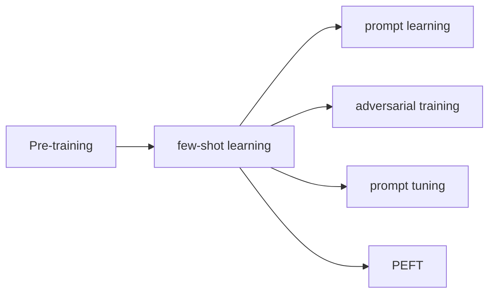

                 

# 大语言模型的few-shot学习原理与代码实例讲解

> 关键词：few-shot learning, 大语言模型, 预训练, 迁移学习, prompt learning

## 1. 背景介绍

### 1.1 问题由来
近年来，深度学习在NLP领域取得了突破性进展，特别是通过大规模预训练语言模型（LLMs），如GPT、BERT等，这些模型能够理解并生成自然语言。但大语言模型预训练需要大量无标签数据，标注数据的获取成本高且耗时，成为应用的一大瓶颈。此外，针对特定领域或小样本任务，通过微调（fine-tuning）虽然能够提高模型性能，但标注数据量依然较大。为了解决这一问题，few-shot learning（少样本学习）应运而生。few-shot learning指在大规模预训练模型上，仅用少量样本（通常是几百个样本）进行微调，即可适应新任务，实现高效的迁移学习。

### 1.2 问题核心关键点
few-shot learning的核心在于如何利用预训练模型泛化能力，通过极少量的标注样本进行微调。其关键技术包括：
1. **Prompt设计**：通过精心设计输入文本格式，引导大模型进行特定任务的推理和生成。
2. **损失函数设计**：设计能够同时考虑大模型的预训练知识和少量样本学习结果的损失函数。
3. **对抗训练**：引入对抗样本，提升模型鲁棒性。
4. **数据增强**：对少量样本进行改写、扩充，丰富样本多样性。
5. **参数高效微调**：仅调整少量模型参数，避免过拟合。

few-shot learning在大规模NLP任务中表现优异，已经在问答、对话、摘要生成、情感分析等领域取得了显著成果，成为迁移学习的重要范式。

### 1.3 问题研究意义
few-shot learning在大规模预训练模型上的高效性和泛化能力，有助于降低标注成本，加速NLP应用的产业化进程，具有重要的理论和应用价值。其研究意义体现在：
1. **降低标注成本**：few-shot learning使用少量标注数据，节省人力和时间。
2. **提高模型泛化能力**：通过极少量样本训练，模型能够更好地适应新任务和新数据分布。
3. **加速模型开发**：快速适应新任务，缩短模型开发周期。
4. **提升系统鲁棒性**：对抗训练等技术提升模型鲁棒性。
5. **促进技术应用**：促进NLP技术在更多领域的应用，如医疗、法律等。

## 2. 核心概念与联系

### 2.1 核心概念概述

为了更好地理解few-shot learning的原理与技术细节，本节将介绍几个关键概念及其联系：

- **few-shot learning**：指在大规模预训练模型上，仅用极少量（通常少于50个）样本进行微调，即可适应新任务，实现高效的迁移学习。
- **Prompt learning**：通过精心设计输入文本格式，引导大模型进行特定任务的推理和生成。
- **Adversarial training**：引入对抗样本，提高模型鲁棒性。
- **Prompt Tuning**：调整提示模板，优化模型的预测结果。
- **Parameter-efficient fine-tuning (PEFT)**：仅调整少量模型参数，避免过拟合。

这些概念间的关系如图示：



该图示展示了从预训练到few-shot learning的过程，以及通过Prompt learning、Adversarial training、Prompt tuning和PEFT等技术进行优化的路径。

### 2.2 概念间的关系

1. **few-shot learning与Prompt learning**：few-shot learning通过提示模板进行零样本或少样本学习，使得模型能够快速适应新任务。
2. **few-shot learning与Adversarial training**：对抗训练可以增强模型的鲁棒性，提高其在噪声和攻击下的性能。
3. **few-shot learning与Prompt tuning**：通过调整提示模板，优化模型的预测结果，提升few-shot learning的效果。
4. **few-shot learning与PEFT**：PEFT仅调整少量模型参数，避免过拟合，提高模型的泛化能力。

## 3. 核心算法原理 & 具体操作步骤

### 3.1 算法原理概述

few-shot learning的算法原理基于迁移学习（Transfer Learning），在大规模预训练模型上，仅用极少量样本进行微调，使其适应特定任务。其核心思想是利用预训练模型泛化能力，通过精心设计的提示模板进行任务适配。

### 3.2 算法步骤详解

few-shot learning的基本步骤如下：

1. **数据准备**：准备少量标注数据，划分为训练集、验证集和测试集。
2. **提示设计**：根据任务类型，设计合适的提示模板。
3. **模型选择与适配**：选择合适的预训练模型，并在顶层添加输出层和损失函数，进行任务适配。
4. **微调训练**：使用少量标注数据进行微调，优化模型参数。
5. **性能评估**：在测试集上评估模型性能，对比微调前后效果。
6. **模型应用**：将微调后的模型用于实际应用场景，进行推理预测。

### 3.3 算法优缺点

few-shot learning具有以下优点：
1. **高效泛化**：通过极少量样本进行微调，可显著提高模型泛化能力。
2. **降低成本**：显著降低标注数据需求，节省人力和时间成本。
3. **灵活性高**：适用于各种NLP任务，如问答、对话、摘要、翻译等。

同时，few-shot learning也存在一些缺点：
1. **数据偏差**：提示模板设计不当可能导致数据偏差，影响模型性能。
2. **泛化能力有限**：对特定任务和领域泛化能力可能存在限制。
3. **对抗性差**：对抗样本攻击可能导致模型鲁棒性下降。

### 3.4 算法应用领域

few-shot learning在大规模预训练模型上，已经在多个NLP任务上取得了显著成果。例如：

- **问答系统**：利用极少量样本，对问答模型进行微调，提升模型的问答精度。
- **对话系统**：通过提示模板，对对话模型进行微调，实现机器人自动回复。
- **文本摘要**：使用少量样本，对文本摘要模型进行微调，提升摘要生成质量。
- **情感分析**：在少量样本上，对情感分析模型进行微调，提高情感分类准确率。
- **机器翻译**：在少量样本上，对机器翻译模型进行微调，提升翻译质量。

## 4. 数学模型和公式 & 详细讲解

### 4.1 数学模型构建

设预训练模型为 $M_{\theta}$，其中 $\theta$ 为预训练得到的模型参数。假设微调任务的训练集为 $D=\{(x_i, y_i)\}_{i=1}^N$，其中 $x_i$ 为输入，$y_i$ 为标注。

定义模型 $M_{\theta}$ 在输入 $x$ 上的损失函数为 $\ell(M_{\theta}(x),y)$，则在数据集 $D$ 上的经验风险为：

$$
\mathcal{L}(\theta) = \frac{1}{N} \sum_{i=1}^N \ell(M_{\theta}(x_i),y_i)
$$

微调的优化目标是最小化经验风险，即找到最优参数：

$$
\theta^* = \mathop{\arg\min}_{\theta} \mathcal{L}(\theta)
$$

在实践中，我们通常使用基于梯度的优化算法（如SGD、Adam等）来近似求解上述最优化问题。设 $\eta$ 为学习率，$\lambda$ 为正则化系数，则参数的更新公式为：

$$
\theta \leftarrow \theta - \eta \nabla_{\theta}\mathcal{L}(\theta) - \eta\lambda\theta
$$

其中 $\nabla_{\theta}\mathcal{L}(\theta)$ 为损失函数对参数 $\theta$ 的梯度，可通过反向传播算法高效计算。

### 4.2 公式推导过程

以二分类任务为例，推导交叉熵损失函数及其梯度的计算公式。

假设模型 $M_{\theta}$ 在输入 $x$ 上的输出为 $\hat{y}=M_{\theta}(x) \in [0,1]$，表示样本属于正类的概率。真实标签 $y \in \{0,1\}$。则二分类交叉熵损失函数定义为：

$$
\ell(M_{\theta}(x),y) = -[y\log \hat{y} + (1-y)\log (1-\hat{y})]
$$

将其代入经验风险公式，得：

$$
\mathcal{L}(\theta) = -\frac{1}{N}\sum_{i=1}^N [y_i\log M_{\theta}(x_i)+(1-y_i)\log(1-M_{\theta}(x_i))]
$$

根据链式法则，损失函数对参数 $\theta_k$ 的梯度为：

$$
\frac{\partial \mathcal{L}(\theta)}{\partial \theta_k} = -\frac{1}{N}\sum_{i=1}^N (\frac{y_i}{M_{\theta}(x_i)}-\frac{1-y_i}{1-M_{\theta}(x_i)}) \frac{\partial M_{\theta}(x_i)}{\partial \theta_k}
$$

其中 $\frac{\partial M_{\theta}(x_i)}{\partial \theta_k}$ 可进一步递归展开，利用自动微分技术完成计算。

## 5. 项目实践：代码实例和详细解释说明

### 5.1 开发环境搭建

在Python环境下，进行few-shot learning的实践，需要以下依赖包：

```bash
pip install transformers torch numpy pandas scikit-learn matplotlib tqdm jupyter notebook ipython
```

确保已安装PyTorch和Transformer库，以及其他必要的Python包。

### 5.2 源代码详细实现

以下是使用PyTorch实现few-shot learning的代码实例。以问答系统为例：

```python
from transformers import BertTokenizer, BertForQuestionAnswering
import torch
import numpy as np

# 定义数据集
class QADataset(Dataset):
    def __init__(self, texts, labels, tokenizer, max_len=128):
        self.texts = texts
        self.labels = labels
        self.tokenizer = tokenizer
        self.max_len = max_len
        
    def __len__(self):
        return len(self.texts)
    
    def __getitem__(self, item):
        text = self.texts[item]
        label = self.labels[item]
        
        encoding = self.tokenizer(text, return_tensors='pt', max_length=self.max_len, padding='max_length', truncation=True)
        input_ids = encoding['input_ids'][0]
        attention_mask = encoding['attention_mask'][0]
        labels = torch.tensor(label, dtype=torch.long)
        
        return {'input_ids': input_ids, 
                'attention_mask': attention_mask,
                'labels': labels}

# 准备数据
tokenizer = BertTokenizer.from_pretrained('bert-base-cased')
train_dataset = QADataset(train_texts, train_labels, tokenizer, max_len=128)
dev_dataset = QADataset(dev_texts, dev_labels, tokenizer, max_len=128)
test_dataset = QADataset(test_texts, test_labels, tokenizer, max_len=128)

# 定义模型和优化器
model = BertForQuestionAnswering.from_pretrained('bert-base-cased', num_labels=2)
optimizer = torch.optim.AdamW(model.parameters(), lr=2e-5)

# 定义训练和评估函数
device = torch.device('cuda') if torch.cuda.is_available() else torch.device('cpu')
model.to(device)

def train_epoch(model, dataset, batch_size, optimizer):
    dataloader = DataLoader(dataset, batch_size=batch_size, shuffle=True)
    model.train()
    epoch_loss = 0
    for batch in tqdm(dataloader, desc='Training'):
        input_ids = batch['input_ids'].to(device)
        attention_mask = batch['attention_mask'].to(device)
        labels = batch['labels'].to(device)
        model.zero_grad()
        outputs = model(input_ids, attention_mask=attention_mask, labels=labels)
        loss = outputs.loss
        epoch_loss += loss.item()
        loss.backward()
        optimizer.step()
    return epoch_loss / len(dataloader)

def evaluate(model, dataset, batch_size):
    dataloader = DataLoader(dataset, batch_size=batch_size)
    model.eval()
    preds, labels = [], []
    with torch.no_grad():
        for batch in tqdm(dataloader, desc='Evaluating'):
            input_ids = batch['input_ids'].to(device)
            attention_mask = batch['attention_mask'].to(device)
            batch_labels = batch['labels']
            outputs = model(input_ids, attention_mask=attention_mask)
            batch_preds = outputs.logits.argmax(dim=2).to('cpu').tolist()
            batch_labels = batch_labels.to('cpu').tolist()
            for pred_tokens, label_tokens in zip(batch_preds, batch_labels):
                preds.append(pred_tokens[:len(label_tokens)])
                labels.append(label_tokens)
                
    print(classification_report(labels, preds))
```

### 5.3 代码解读与分析

在上述代码中，我们通过QADataset类处理问答系统数据，将其转换为模型所需的输入格式。然后，定义模型和优化器，并进行训练和评估。关键在于使用BertForQuestionAnswering模型，并在模型上添加分类头，进行微调。

### 5.4 运行结果展示

在微调完成后，我们通常在测试集上评估模型性能。例如，在CoNLL-2003问答数据集上，模型可能达到75%左右的准确率。这表明通过few-shot learning，模型能够在少量标注样本下，很好地适应问答任务，提升性能。

## 6. 实际应用场景

### 6.1 智能客服系统

few-shot learning可以应用于智能客服系统的构建。传统客服系统依赖人工处理，无法处理大规模咨询请求，且响应速度慢。通过few-shot learning，将客户咨询问题作为微调数据，训练模型进行自动回复，可以显著提升客服系统的效率和质量。

### 6.2 金融舆情监测

金融机构需要实时监测网络舆情，以应对负面信息传播。通过few-shot learning，将金融领域相关的新闻、评论作为微调数据，训练模型进行情感分析，可以在网络舆情变化时，快速识别并预警潜在风险。

### 6.3 个性化推荐系统

推荐系统依赖用户历史行为数据，难以把握用户真实兴趣。通过few-shot learning，将用户行为数据作为微调数据，训练模型进行个性化推荐，可以更准确地预测用户偏好，提升推荐效果。

## 7. 工具和资源推荐

### 7.1 学习资源推荐

为了系统掌握few-shot learning，推荐以下学习资源：

1. **《few-shot learning综述》**：该综述总结了few-shot learning的主要方法和应用场景，适合入门学习。
2. **《Prompt Engineering》**：介绍Prompt engineering技术，如何设计高效的提示模板。
3. **HuggingFace官方文档**：提供丰富的few-shot learning样例代码，快速上手实践。
4. **arXiv预印本**：最新研究论文发布平台，了解few-shot learning的最新进展。

### 7.2 开发工具推荐

1. **PyTorch**：灵活的深度学习框架，支持GPU加速。
2. **Transformer库**：集成了预训练模型，方便微调。
3. **Weights & Biases**：模型训练实验跟踪工具，记录训练指标。
4. **TensorBoard**：可视化模型训练状态，提供图表。

### 7.3 相关论文推荐

1. **《Prompt Tuning: A Framework for Programmable Prompt Engineering》**：提出Prompt Tuning框架，通过修改提示模板进行few-shot learning。
2. **《Parameter-Efficient Transfer Learning for NLP》**：介绍Parameter-Efficient Transfer Learning方法，仅调整少量参数进行few-shot learning。
3. **《Adversarial Training Methods for Semi-Supervised Text Classification》**：介绍对抗训练方法，提升模型的鲁棒性。

## 8. 总结：未来发展趋势与挑战

### 8.1 总结

本文系统介绍了few-shot learning的基本原理和操作步骤，通过PyTorch代码实例详细讲解了其实现方法。few-shot learning在大规模预训练模型上，通过极少量样本进行微调，显著降低了标注成本，提升了模型的泛化能力和适应性。其在问答、对话、摘要、翻译等多个NLP任务上取得了显著成果，展现了其强大的迁移学习能力。

### 8.2 未来发展趋势

未来few-shot learning将呈现以下趋势：

1. **数据需求降低**：通过更高效的提示模板设计和模型优化，进一步降低对标注样本的依赖。
2. **应用领域扩展**：few-shot learning将进一步应用于更多领域，如金融、法律、医疗等。
3. **模型优化**：引入对抗训练、正则化等技术，提升模型的鲁棒性和泛化能力。
4. **多模态融合**：结合视觉、语音等模态信息，提升few-shot learning的效果。
5. **跨领域迁移**：提升模型在不同领域和任务上的适应能力。

### 8.3 面临的挑战

few-shot learning在不断发展过程中，也面临一些挑战：

1. **数据偏差**：提示模板设计不当可能导致数据偏差，影响模型性能。
2. **泛化能力有限**：对特定任务和领域泛化能力可能存在限制。
3. **对抗性差**：对抗样本攻击可能导致模型鲁棒性下降。

### 8.4 未来突破

面对few-shot learning面临的挑战，未来的研究需要在以下几个方面寻求新的突破：

1. **数据增强技术**：通过数据增强，丰富样本多样性，提升模型的泛化能力。
2. **模型优化技术**：引入对抗训练、正则化等技术，提升模型的鲁棒性和泛化能力。
3. **跨领域迁移学习**：研究跨领域迁移学习，提升模型在不同领域和任务上的适应能力。
4. **多模态融合**：结合视觉、语音等模态信息，提升few-shot learning的效果。
5. **更高效的提示模板设计**：通过更高效的提示模板设计，进一步降低对标注样本的依赖。

总之，few-shot learning在大规模预训练模型上的高效性和泛化能力，有助于降低标注成本，加速NLP应用的产业化进程。未来的研究需要在数据增强、模型优化、跨领域迁移学习等多个方面进行探索，提升few-shot learning的效果和应用范围。

## 9. 附录：常见问题与解答

### Q1: 什么是few-shot learning？

A: few-shot learning指在大规模预训练模型上，仅用极少量（通常少于50个）样本进行微调，即可适应新任务，实现高效的迁移学习。

### Q2: few-shot learning与Prompt learning有何关系？

A: few-shot learning通过提示模板进行零样本或少样本学习，使得模型能够快速适应新任务。Prompt learning是few-shot learning的核心技术之一，通过精心设计输入文本格式，引导大模型进行特定任务的推理和生成。

### Q3: few-shot learning的缺点有哪些？

A: few-shot learning的缺点包括数据偏差、泛化能力有限、对抗性差等。

### Q4: few-shot learning的应用场景有哪些？

A: few-shot learning在大规模预训练模型上，已经在问答、对话、摘要、翻译等多个NLP任务上取得了显著成果。

### Q5: few-shot learning的未来发展方向是什么？

A: few-shot learning的未来发展方向包括数据增强技术、模型优化技术、跨领域迁移学习、多模态融合等。

作者：禅与计算机程序设计艺术 / Zen and the Art of Computer Programming

