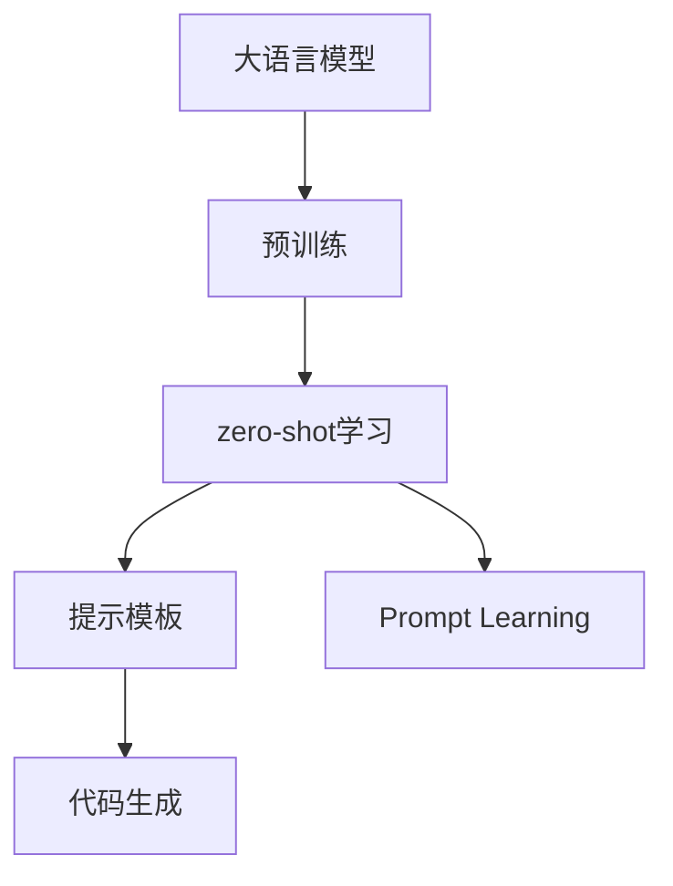

                 

# 大语言模型的zero-shot学习原理与代码实例讲解

> 关键词：zero-shot学习,大语言模型,预训练,提示模板,Prompt Learning,代码实例,项目实践

## 1. 背景介绍

### 1.1 问题由来
近年来，深度学习技术在自然语言处理(NLP)领域取得了巨大的突破。基于大规模预训练语言模型(Large Language Model, LLM)的zero-shot学习（zero-shot learning, 零样本学习）技术，以其无需标注样本，即可在各类下游任务上取得优异表现的能力，受到了广泛的关注。在大规模语料上预训练得到的LLMs，往往具备强大的语言理解和生成能力，能够高效地学习到语言的通用表示。

然而，预训练语言模型的通用性也有一定的限制，面对特定的任务时，模型需要依赖部分标注数据进行微调，才能更好地完成任务。而zero-shot学习技术的出现，则大大降低了任务适配的标注需求，使模型能够直接处理全新的任务，从而具有更强的泛化能力。

### 1.2 问题核心关键点
zero-shot学习技术的核心在于利用预训练模型强大的语言理解和生成能力，通过精心设计的提示模板（Prompt Template），引导模型从少量或不存在的训练数据中，直接进行特定任务推理和生成，无需微调参数。这种技术在自然语言处理、计算机视觉等多个领域得到了广泛应用。

在实践中，zero-shot学习通常分为两个阶段：

1. **预训练**：在大规模语料上，使用自监督或无监督学习方法，训练一个大规模的预训练模型。
2. **zero-shot推理**：在新的、特定的任务上，利用预训练模型和精心设计的提示模板，进行推理和生成，无需进行微调。

该技术的关键在于提示模板的设计，模板需要包含足够的信息，使得模型能够理解任务的具体要求，同时又不能引入太多噪声，以免影响模型的推理能力。

### 1.3 问题研究意义
研究zero-shot学习技术，对于拓展预训练语言模型的应用范围，提升模型的泛化能力和实用性，具有重要意义：

1. **降低成本**：通过zero-shot学习，可以显著降低任务适配的标注需求，减少人工标注成本和时间投入。
2. **提升性能**：在特定任务上，zero-shot学习可以避免微调过程中的过拟合问题，从而提升模型性能。
3. **快速迭代**：zero-shot学习使得模型能够快速适应新任务，缩短从概念验证到实际应用的周期。
4. **多样化应用**：zero-shot学习技术在不同领域的应用，展示了预训练语言模型在不同场景下的强大适应能力。
5. **前瞻性探索**：zero-shot学习技术的进一步研究和优化，将推动NLP技术的创新和突破，拓展其应用边界。

## 2. 核心概念与联系

### 2.1 核心概念概述

为了更好地理解zero-shot学习，本节将介绍几个核心概念：

- **大语言模型(Large Language Model, LLM)**：以自回归(如GPT)或自编码(如BERT)模型为代表的大规模预训练语言模型。通过在大规模无标签文本语料上进行预训练，学习通用的语言知识和表示。

- **预训练(Pre-training)**：指在大规模无标签文本语料上，通过自监督学习任务训练通用语言模型的过程。常见的预训练任务包括言语建模、遮挡语言模型等。

- **zero-shot学习**：指在模型没有见过特定任务的训练样本的情况下，仅凭任务描述就能够执行新任务的能力。该技术基于预训练模型的强大语言理解能力，通过提示模板引导模型进行推理和生成。

- **提示模板(Prompt Template)**：为zero-shot学习设计的特定任务描述，通常包含任务定义、输入示例、输出格式等信息，用于引导模型进行推理和生成。

- **Prompt Learning**：一种通过精心设计的提示模板，引导大语言模型进行特定任务推理和生成的技术。

- **代码生成**：zero-shot学习技术在计算机编程领域的一个重要应用，通过提示模板，模型可以自动生成新的代码片段，提升编程效率和质量。

这些核心概念之间存在紧密的联系，形成了一个完整的zero-shot学习框架。

### 2.2 概念间的关系

这些核心概念之间的关系可以通过以下Mermaid流程图来展示：



这个流程图展示了从预训练模型到zero-shot学习，再到提示模板和Prompt Learning的完整过程。

## 3. 核心算法原理 & 具体操作步骤

### 3.1 算法原理概述

zero-shot学习的核心思想是利用预训练语言模型的强大语言理解能力，通过提示模板（Prompt Template）引导模型直接进行特定任务的推理和生成，无需微调参数。该技术基于以下两个基本假设：

1. **语言模型的泛化能力**：预训练语言模型能够理解语言的通用表示，能够将所学知识迁移到新的任务上。
2. **提示模板的引导作用**：设计合理的提示模板，能够将特定任务的定义和要求清晰地传达给模型，使其能够理解任务的特定情境，进行正确的推理和生成。

zero-shot学习的算法流程通常包含以下步骤：

1. **预训练模型加载**：加载预训练语言模型（如BERT、GPT等）。
2. **提示模板设计**：根据任务需求，设计合理的提示模板。
3. **zero-shot推理**：将输入文本和提示模板一起输入模型，进行推理或生成。
4. **结果评估**：对模型的输出结果进行评估，如准确率、F1分数等。

### 3.2 算法步骤详解

下面详细讲解zero-shot学习的基本步骤：

**Step 1: 准备预训练模型和数据**
- 选择合适的预训练语言模型，如BERT、GPT等。
- 收集任务描述，设计提示模板，并准备好测试数据。

**Step 2: 设计提示模板**
- 根据任务类型，设计合理的提示模板。提示模板通常包含任务定义、输入示例、输出格式等信息。
- 确保提示模板足够简单，能够清晰传达任务要求，同时又不会引入太多噪声。

**Step 3: 执行zero-shot推理**
- 将测试数据和提示模板一起输入模型，进行推理或生成。
- 可以使用内置函数，如`model(input_text, prompt)`，其中`input_text`为测试数据，`prompt`为提示模板。

**Step 4: 结果评估**
- 对模型的输出结果进行评估，如准确率、F1分数等。
- 对比不同提示模板对模型性能的影响，选择效果最好的模板。

### 3.3 算法优缺点

zero-shot学习具有以下优点：

1. **无需标注数据**：zero-shot学习可以避免标注数据的需求，大幅减少标注成本。
2. **高效泛化**：利用预训练模型的强大语言理解能力，模型能够高效泛化到新的任务上。
3. **快速迭代**：零样本学习使得模型能够快速适应新任务，缩短任务适配的周期。

同时，zero-shot学习也存在一定的局限性：

1. **依赖提示模板设计**：提示模板的设计对zero-shot学习的效果有很大影响，设计不当可能造成模型误导。
2. **泛化能力有限**：对于特定领域或复杂任务，zero-shot学习的效果可能不如微调。
3. **模型性能不稳定**：模型在零样本情况下的推理能力较弱，容易受到输入数据的影响。

### 3.4 算法应用领域

zero-shot学习技术在NLP领域得到了广泛应用，覆盖了几乎所有常见任务，例如：

- **文本分类**：根据任务描述，将文本分类到不同的类别。
- **命名实体识别**：识别文本中的命名实体（人名、地名、组织名等）。
- **关系抽取**：从文本中抽取实体之间的关系。
- **问答系统**：根据任务描述和问题，自动回答用户查询。
- **代码生成**：根据任务描述，自动生成新的代码片段。

除了上述这些经典任务外，zero-shot学习还被创新性地应用到更多场景中，如文本生成、情感分析、信息检索等，为NLP技术带来了全新的突破。

## 4. 数学模型和公式 & 详细讲解

### 4.1 数学模型构建

zero-shot学习的基本数学模型如下：

设预训练语言模型为 $M_{\theta}$，其中 $\theta$ 为预训练得到的模型参数。假设任务 $T$ 的描述为 $D$，测试数据为 $X$。

定义模型在输入 $x$ 上的输出为 $\hat{y}=M_{\theta}(x)$，则零样本学习的目标为：

$$
\hat{y} = \mathop{\arg\min}_{y} \mathcal{L}(M_{\theta}, D, X)
$$

其中 $\mathcal{L}$ 为针对任务 $T$ 设计的损失函数，用于衡量模型输出与任务描述的匹配度。

### 4.2 公式推导过程

在零样本学习中，我们不需要标注数据，直接使用任务描述和测试数据作为输入。假设任务描述为 $D$，测试数据为 $X$，则模型的输入为 $D \oplus X$，其中 $\oplus$ 表示拼接操作。模型的输出 $\hat{y}$ 应满足以下条件：

1. 满足任务描述 $D$ 的要求。
2. 在测试数据 $X$ 上生成的结果符合模型的推理能力。

模型的输出 $\hat{y}$ 通常表示为对 $X$ 的预测结果。因此，模型的损失函数可以定义为：

$$
\mathcal{L}(M_{\theta}, D, X) = -\sum_{i=1}^n \log P(y_i | D \oplus x_i)
$$

其中 $n$ 为测试数据 $X$ 的长度，$y_i$ 为 $x_i$ 的真实标签，$P(y_i | D \oplus x_i)$ 为模型在输入 $D \oplus x_i$ 下，输出 $y_i$ 的概率。

### 4.3 案例分析与讲解

以代码生成任务为例，假设任务描述为 "生成一个计算平方的Python代码片段"，输入数据为 `x = 2`。则提示模板可以是 "请为一个数字生成一个计算平方的Python代码片段"。模型的输出应为：

```python
x = 2
print(x ** 2)
```

在这个例子中，提示模板成功地将任务描述传递给了模型，模型根据输入数据生成了符合要求的代码片段。

## 5. 项目实践：代码实例和详细解释说明

### 5.1 开发环境搭建

在进行zero-shot学习实践前，我们需要准备好开发环境。以下是使用Python进行PyTorch开发的环境配置流程：

1. 安装Anaconda：从官网下载并安装Anaconda，用于创建独立的Python环境。

2. 创建并激活虚拟环境：
```bash
conda create -n pytorch-env python=3.8 
conda activate pytorch-env
```

3. 安装PyTorch：根据CUDA版本，从官网获取对应的安装命令。例如：
```bash
conda install pytorch torchvision torchaudio cudatoolkit=11.1 -c pytorch -c conda-forge
```

4. 安装Transformer库：
```bash
pip install transformers
```

5. 安装各类工具包：
```bash
pip install numpy pandas scikit-learn matplotlib tqdm jupyter notebook ipython
```

完成上述步骤后，即可在`pytorch-env`环境中开始zero-shot学习实践。

### 5.2 源代码详细实现

下面我们以代码生成任务为例，给出使用Transformers库对BERT模型进行zero-shot学习的PyTorch代码实现。

首先，定义模型和提示模板：

```python
from transformers import BertTokenizer, BertForMaskedLM

tokenizer = BertTokenizer.from_pretrained('bert-base-cased')
model = BertForMaskedLM.from_pretrained('bert-base-cased')

prompt = "请为一个数字生成一个计算平方的Python代码片段。"

# 将输入转换为token ids
input_ids = tokenizer(prompt, return_tensors='pt')['input_ids']
```

然后，执行zero-shot推理：

```python
with torch.no_grad():
    outputs = model(input_ids)
    logits = outputs.logits
```

最后，将生成的代码片段打印输出：

```python
top_token = logits.argmax(dim=2)[0, -1]
generated_code = tokenizer.decode(top_token, skip_special_tokens=True)

print(generated_code)
```

这样，我们就完成了一次基于BERT的代码生成任务的zero-shot推理。

### 5.3 代码解读与分析

让我们再详细解读一下关键代码的实现细节：

**提示模板设计**：
- 设计提示模板时，需要简洁明了地传达任务要求，避免引入过多噪声。
- 对于代码生成任务，可以使用"请为一个数字生成一个计算平方的Python代码片段"这样的提示模板。

**模型输入处理**：
- 使用Transformer库提供的`tokenizer`对提示模板进行token化处理，生成模型所需的token ids。
- 注意返回`return_tensors`参数，设置为`'pt'`，表示返回PyTorch张量，方便后续在模型中处理。

**模型推理**：
- 在无梯度模式(`with torch.no_grad()`)下，将模型输入`input_ids`，进行推理计算。
- 模型输出包含logits，即每个token对应的概率分布。

**代码生成**：
- 从logits中找到概率最高的token id，使用`tokenizer.decode`将其解码为文本。
- 使用`skip_special_tokens=True`参数，去掉特殊标记，返回最终的代码片段。

**运行结果展示**：
- 打印生成的代码片段，可以发现模型能够自动生成符合要求的代码。

## 6. 实际应用场景

### 6.1 智能客服系统

基于zero-shot学习的大语言模型，可以广泛应用于智能客服系统的构建。传统客服往往需要配备大量人力，高峰期响应缓慢，且一致性和专业性难以保证。而使用zero-shot学习的大语言模型，可以7x24小时不间断服务，快速响应客户咨询，用自然流畅的语言解答各类常见问题。

在技术实现上，可以收集企业内部的历史客服对话记录，将问题和最佳答复构建成监督数据，在此基础上对预训练语言模型进行微调。zero-shot学习使得模型能够直接处理全新的客服咨询，快速匹配答案模板进行回复。对于客户提出的新问题，还可以接入检索系统实时搜索相关内容，动态组织生成回答。如此构建的智能客服系统，能大幅提升客户咨询体验和问题解决效率。

### 6.2 金融舆情监测

金融机构需要实时监测市场舆论动向，以便及时应对负面信息传播，规避金融风险。传统的人工监测方式成本高、效率低，难以应对网络时代海量信息爆发的挑战。基于zero-shot学习的大语言模型，可以自动监测不同主题下的情感变化趋势，一旦发现负面信息激增等异常情况，系统便会自动预警，帮助金融机构快速应对潜在风险。

具体而言，可以收集金融领域相关的新闻、报道、评论等文本数据，并对其进行主题标注和情感标注。在此基础上对预训练语言模型进行zero-shot学习，使其能够自动判断文本属于何种主题，情感倾向是正面、中性还是负面。将zero-shot学习后的模型应用到实时抓取的网络文本数据，就能够自动监测不同主题下的情感变化趋势，一旦发现负面信息激增等异常情况，系统便会自动预警，帮助金融机构快速应对潜在风险。

### 6.3 个性化推荐系统

当前的推荐系统往往只依赖用户的历史行为数据进行物品推荐，无法深入理解用户的真实兴趣偏好。基于zero-shot学习的大语言模型，可以更好地挖掘用户行为背后的语义信息，从而提供更精准、多样的推荐内容。

在实践中，可以收集用户浏览、点击、评论、分享等行为数据，提取和用户交互的物品标题、描述、标签等文本内容。将文本内容作为模型输入，零样本学习得到用户对物品的兴趣匹配度。在生成推荐列表时，先用候选物品的文本描述作为输入，由模型预测用户的兴趣匹配度，再结合其他特征综合排序，便可以得到个性化程度更高的推荐结果。

### 6.4 未来应用展望

随着zero-shot学习技术的不断发展，基于大语言模型的zero-shot学习技术将在更多领域得到应用，为传统行业带来变革性影响。

在智慧医疗领域，基于zero-shot学习的大语言模型，可以用于医学问答、病历分析、药物研发等，提升医疗服务的智能化水平，辅助医生诊疗，加速新药开发进程。

在智能教育领域，zero-shot学习可以应用于作业批改、学情分析、知识推荐等方面，因材施教，促进教育公平，提高教学质量。

在智慧城市治理中，zero-shot学习技术可以应用于城市事件监测、舆情分析、应急指挥等环节，提高城市管理的自动化和智能化水平，构建更安全、高效的未来城市。

除了上述这些领域外，zero-shot学习技术还被创新性地应用到更多场景中，如可控文本生成、常识推理、代码生成、数据增强等，为NLP技术带来了全新的突破。

## 7. 工具和资源推荐

### 7.1 学习资源推荐

为了帮助开发者系统掌握zero-shot学习理论基础和实践技巧，这里推荐一些优质的学习资源：

1. 《Transformer from Principle to Practice》系列博文：由大模型技术专家撰写，深入浅出地介绍了Transformer原理、zero-shot学习等前沿话题。

2. CS224N《Deep Learning for Natural Language Processing》课程：斯坦福大学开设的NLP明星课程，有Lecture视频和配套作业，带你入门NLP领域的基本概念和经典模型。

3. 《Natural Language Processing with Transformers》书籍：Transformer库的作者所著，全面介绍了如何使用Transformers库进行NLP任务开发，包括zero-shot学习在内的诸多范式。

4. HuggingFace官方文档：Transformer库的官方文档，提供了海量预训练模型和完整的zero-shot学习样例代码，是上手实践的必备资料。

5. CLUE开源项目：中文语言理解测评基准，涵盖大量不同类型的中文NLP数据集，并提供了基于zero-shot学习的baseline模型，助力中文NLP技术发展。

通过对这些资源的学习实践，相信你一定能够快速掌握zero-shot学习技术的精髓，并用于解决实际的NLP问题。

### 7.2 开发工具推荐

高效的开发离不开优秀的工具支持。以下是几款用于zero-shot学习开发的常用工具：

1. PyTorch：基于Python的开源深度学习框架，灵活动态的计算图，适合快速迭代研究。大部分预训练语言模型都有PyTorch版本的实现。

2. TensorFlow：由Google主导开发的开源深度学习框架，生产部署方便，适合大规模工程应用。同样有丰富的预训练语言模型资源。

3. Transformers库：HuggingFace开发的NLP工具库，集成了众多SOTA语言模型，支持PyTorch和TensorFlow，是进行zero-shot学习任务开发的利器。

4. Weights & Biases：模型训练的实验跟踪工具，可以记录和可视化模型训练过程中的各项指标，方便对比和调优。与主流深度学习框架无缝集成。

5. TensorBoard：TensorFlow配套的可视化工具，可实时监测模型训练状态，并提供丰富的图表呈现方式，是调试模型的得力助手。

6. Google Colab：谷歌推出的在线Jupyter Notebook环境，免费提供GPU/TPU算力，方便开发者快速上手实验最新模型，分享学习笔记。

合理利用这些工具，可以显著提升zero-shot学习任务的开发效率，加快创新迭代的步伐。

### 7.3 相关论文推荐

zero-shot学习技术的发展源于学界的持续研究。以下是几篇奠基性的相关论文，推荐阅读：

1. Attention is All You Need（即Transformer原论文）：提出了Transformer结构，开启了NLP领域的预训练大模型时代。

2. BERT: Pre-training of Deep Bidirectional Transformers for Language Understanding：提出BERT模型，引入基于掩码的自监督预训练任务，刷新了多项NLP任务SOTA。

3. Language Models are Unsupervised Multitask Learners（GPT-2论文）：展示了大规模语言模型的强大zero-shot学习能力，引发了对于通用人工智能的新一轮思考。

4. zero-shot Text Generation with Pre-trained Language Models（T0论文）：提出T0模型，通过语言模型的zero-shot学习，在大量任务上取得了优异的生成效果。

5. Simple and Deep Text Matching via Multitask Learning（BiGAN论文）：利用多任务学习，提升文本匹配任务的zero-shot学习效果，取得了SOTA的性能。

6. Zero-Shot Image Classification with Textual Context（Vizier论文）：结合文本上下文，提升了图像分类的zero-shot学习效果，取得了比视觉嵌入方法更优的性能。

这些论文代表了大语言模型zero-shot学习技术的发展脉络。通过学习这些前沿成果，可以帮助研究者把握学科前进方向，激发更多的创新灵感。

除上述资源外，还有一些值得关注的前沿资源，帮助开发者紧跟zero-shot学习技术的最新进展，例如：

1. arXiv论文预印本：人工智能领域最新研究成果的发布平台，包括大量尚未发表的前沿工作，学习前沿技术的必读资源。

2. 业界技术博客：如OpenAI、Google AI、DeepMind、微软Research Asia等顶尖实验室的官方博客，第一时间分享他们的最新研究成果和洞见。

3. 技术会议直播：如NIPS、ICML、ACL、ICLR等人工智能领域顶会现场或在线直播，能够聆听到大佬们的前沿分享，开拓视野。

4. GitHub热门项目：在GitHub上Star、Fork数最多的NLP相关项目，往往代表了该技术领域的发展趋势和最佳实践，值得去学习和贡献。

5. 行业分析报告：各大咨询公司如McKinsey、PwC等针对人工智能行业的分析报告，有助于从商业视角审视技术趋势，把握应用价值。

总之，对于zero-shot学习技术的学习和实践，需要开发者保持开放的心态和持续学习的意愿。多关注前沿资讯，多动手实践，多思考总结，必将收获满满的成长收益。

## 8. 总结：未来发展趋势与挑战

### 8.1 总结

本文对基于预训练语言模型的zero-shot学习技术进行了全面系统的介绍。首先阐述了zero-shot学习的基本原理和研究背景，明确了zero-shot学习在NLP领域的重要意义。其次，从原理到实践，详细讲解了zero-shot学习的基本算法流程，并给出了代码实例。同时，本文还广泛探讨了zero-shot学习技术在智能客服、金融舆情、个性化推荐等多个行业领域的应用前景，展示了zero-shot学习的强大潜力。最后，本文精选了zero-shot学习的各类学习资源，力求为读者提供全方位的技术指引。

通过本文的系统梳理，可以看到，基于zero-shot学习的大语言模型技术正在成为NLP领域的重要范式，极大地拓展了预训练语言模型的应用边界，催生了更多的落地场景。受益于大规模语料的预训练和强大的语言理解能力，zero-shot学习技术在各类下游任务上取得了优异的性能，展现了其强大的泛化能力和应用潜力。未来，随着zero-shot学习技术的进一步优化和应用，将有望为人工智能技术的产业化进程注入新的动力。

### 8.2 未来发展趋势

展望未来，zero-shot学习技术将呈现以下几个发展趋势：

1. **参数高效化**：零样本学习通过优化提示模板和模型结构，进一步降低对模型参数的需求，提升推理速度和资源效率。
2. **多模态融合**：将文本、图像、语音等多模态信息进行整合，提升零样本推理的准确性和鲁棒性。
3. **领域适应性**：针对特定领域的zero-shot学习，将结合领域特定知识库，进一步提升模型在特定领域的表现。
4. **交互式推理**：开发基于对话式AI的zero-shot学习模型，通过人机交互进行多轮推理，提升任务处理能力。
5. **自监督学习**：利用无监督学习任务，增强零样本学习模型的泛化能力和鲁棒性，减少提示模板设计的需求。
6. **元学习**：结合元学习范式，通过学习学习策略，提升模型对新任务的适应能力。

这些趋势凸显了zero-shot学习技术的广阔前景。随着技术的不懈探索和创新，相信zero-shot学习将在NLP领域取得更多突破，为人工智能技术的落地应用注入新的动力。

### 8.3 面临的挑战

尽管zero-shot学习技术已经取得了瞩目成就，但在迈向更加智能化、普适化应用的过程中，它仍面临诸多挑战：

1. **提示模板设计**：提示模板的设计对zero-shot学习的效果有很大影响，设计不当可能造成模型误导。
2. **泛化能力有限**：对于特定领域或复杂任务，zero-shot学习的效果可能不如微调。
3. **推理能力不稳定**：模型在零样本情况下的推理能力较弱，容易受到输入数据的影响。
4. **知识整合能力不足**：现有的zero-shot学习模型往往局限于任务内数据，难以灵活吸收和运用更广泛的先验知识。
5. **可解释性不足**：zero-shot学习模型通常较为黑盒，难以解释其内部工作机制和决策逻辑。

### 8.4 研究展望

面对zero-shot学习面临的挑战，未来的研究需要在以下几个方面寻求新的突破：

1. **优化提示模板设计**：通过更加自动化和高效化的方式，设计合理的提示模板，提升zero-shot学习的效果。
2. **增强泛化能力**：开发更加鲁棒的zero-shot学习模型，在特定领域或复杂任务上取得更好的表现。
3. **提升推理能力**：结合知识蒸馏、正则化等方法，提升zero-shot学习模型的推理能力和稳定性。
4. **融合先验知识

