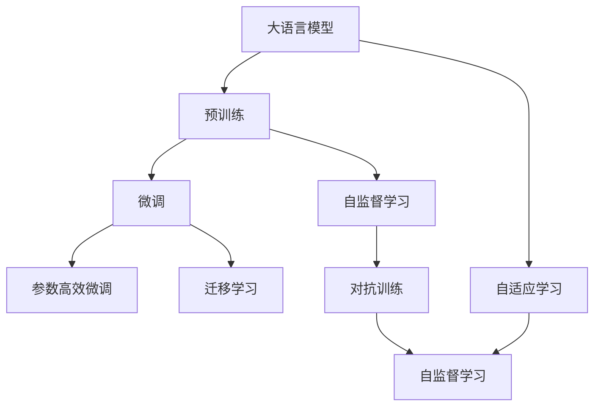

                 

## 1. 背景介绍

大语言模型（Large Language Models, LLMs）自诞生以来，便以令人瞩目的表现和强大的语言处理能力，推动了自然语言处理（NLP）领域的飞速发展。从最初的静态词袋模型，到如今的深度神经网络，预训练语言模型的能力不断提升，泛化能力不断增强。然而，大语言模型在实际应用中也面临着许多挑战。本文将从未来发展方向的角度，探讨大语言模型的潜力和趋势，为NLP技术的未来发展提供启示。

## 2. 核心概念与联系

### 2.1 核心概念概述

为更好地理解大语言模型的未来发展方向，本节将介绍几个核心概念及其联系：

- 大语言模型（LLMs）：指基于深度神经网络，经过大规模无标签文本数据预训练得到的语言模型，具备强大的语言理解和生成能力。
- 预训练（Pre-training）：指在无标签数据上进行的自监督学习，学习语言的通用表示。
- 微调（Fine-tuning）：指在预训练模型的基础上，使用有标签数据优化模型在特定任务上的性能。
- 迁移学习（Transfer Learning）：指将一个领域学到的知识迁移到另一个相关领域的策略。
- 自监督学习（Self-Supervised Learning）：指利用文本数据的自然结构进行预训练，如掩码语言模型（Masked Language Modeling, MLM）等。
- 对抗训练（Adversarial Training）：指在训练过程中加入对抗样本，提升模型的鲁棒性。
- 自适应学习（Adaptive Learning）：指模型能够根据新数据动态调整自身结构和参数。

这些概念构成了大语言模型和微调的核心体系，彼此之间紧密联系，共同支撑着模型的学习与优化。

### 2.2 概念间的关系

这些核心概念之间的联系可以通过以下Mermaid流程图来展示：



这个流程图展示了大语言模型的核心概念及其之间的关系：

1. 大语言模型通过预训练学习到语言的基础表示。
2. 微调在大语言模型基础上进行有监督的优化，提高在特定任务上的性能。
3. 迁移学习通过微调和自监督学习，将预训练模型应用于新任务。
4. 自监督学习通过自然语言的自相关性，辅助预训练过程。
5. 对抗训练通过加入对抗样本，提高模型的鲁棒性。
6. 自适应学习使模型能够根据新数据动态调整自身结构和参数。

通过这些概念，我们可以更全面地理解大语言模型和微调的原理及应用。

## 3. 核心算法原理 & 具体操作步骤

### 3.1 算法原理概述

大语言模型的未来发展方向主要集中在以下几个方面：

- **预训练范式的扩展**：利用更多的数据和更强的模型架构，进一步提升语言模型的泛化能力。
- **微调技术的进步**：结合自适应学习和对抗训练，提高微调的效率和效果。
- **多模态融合**：将视觉、听觉等多模态信息与文本信息结合，提升模型的多感官理解能力。
- **知识增强**：将知识图谱、常识图谱等外部知识与语言模型结合，增强模型的知识表示和推理能力。
- **可解释性提升**：通过模型蒸馏、可解释性技术等手段，增强模型的可解释性。
- **鲁棒性和安全性的增强**：通过对抗样本训练、隐私保护技术等，提高模型的鲁棒性和安全性。

### 3.2 算法步骤详解

以下是对未来大语言模型发展方向的详细探讨：

1. **预训练范式的扩展**
   - **增加数据量和模型规模**：利用大规模数据和强大的计算资源，如GPT-3、BERT等，进一步提升语言模型的表示能力。
   - **引入更多自监督学习任务**：利用自然语言的多样性和结构性，设计新的自监督学习任务，如回译、图像描述生成等。

2. **微调技术的进步**
   - **自适应学习**：开发能够动态调整自身结构和参数的自适应模型，使其能够适应新的数据和任务。
   - **对抗训练**：在训练过程中加入对抗样本，提高模型的鲁棒性，避免过拟合。

3. **多模态融合**
   - **视觉-语言融合**：结合视觉数据，如图像、视频等，提升模型对视觉信息的理解能力。
   - **听觉-语言融合**：结合语音数据，如语音识别、语音生成等，增强模型的多感官理解能力。

4. **知识增强**
   - **知识图谱融合**：将知识图谱与语言模型结合，增强模型的知识表示和推理能力。
   - **常识图谱融合**：将常识图谱与语言模型结合，增强模型的常识推理能力。

5. **可解释性提升**
   - **模型蒸馏**：通过知识蒸馏技术，将复杂模型的知识转移至简单模型，提高模型的可解释性。
   - **可解释性技术**：利用可解释性技术，如LIME、SHAP等，增强模型的可解释性。

6. **鲁棒性和安全性的增强**
   - **对抗样本训练**：通过对抗样本训练，提高模型的鲁棒性，避免模型对小扰动的敏感。
   - **隐私保护技术**：利用差分隐私等隐私保护技术，确保模型训练和应用的隐私安全。

### 3.3 算法优缺点

大语言模型的未来发展方向具有以下优缺点：

**优点**：

- **强大的泛化能力**：通过预训练范式的扩展和微调技术的进步，模型能够更好地适应新的任务和数据。
- **多感官理解能力**：结合多模态融合技术，模型能够理解视觉、听觉等多感官信息。
- **增强的知识表示**：通过知识增强技术，模型能够更好地理解和推理外部知识。

**缺点**：

- **计算资源需求高**：大规模预训练和复杂模型架构需要强大的计算资源和存储资源。
- **过拟合风险高**：预训练模型的泛化能力依赖于数据的多样性和规模，过度拟合问题难以避免。
- **可解释性不足**：复杂模型的内部机制难以解释，用户难以理解和信任。

### 3.4 算法应用领域

大语言模型的未来发展方向涉及多个应用领域，包括：

1. **智能客服**：通过预训练和微调，构建能够自然对话的智能客服系统，提升客户服务体验。
2. **智慧医疗**：结合知识图谱和常识图谱，开发能够辅助医生诊断和治疗的医疗应用。
3. **智能翻译**：利用多模态融合技术，构建支持视觉和语音翻译的系统，提升翻译效果。
4. **智能推荐**：结合多模态信息和知识增强技术，开发更加精准和个性化的推荐系统。
5. **金融分析**：结合常识图谱和自适应学习，构建能够理解金融市场动态的智能分析系统。

## 4. 数学模型和公式 & 详细讲解

### 4.1 数学模型构建

假设大语言模型为 $M_{\theta}$，其中 $\theta$ 为模型参数。定义目标任务为 $T$，训练数据集为 $D$，损失函数为 $\ell(\cdot)$。

大语言模型通过预训练和微调的方式，最小化损失函数：

$$
\min_{\theta} \mathbb{E}_{(x,y) \sim D} \ell(M_{\theta}(x),y)
$$

其中 $\ell$ 可以是交叉熵损失、均方误差损失等。

### 4.2 公式推导过程

以交叉熵损失为例，推导预训练和微调的数学模型：

假设预训练阶段，模型对输入 $x$ 的输出为 $M_{\theta}(x)$，训练目标为 $\hat{y}$。则预训练的损失函数为：

$$
\mathcal{L}_{pre}(\theta) = \mathbb{E}_{(x,\hat{y}) \sim D_{pre}} - \ell(M_{\theta}(x),\hat{y})
$$

其中 $D_{pre}$ 为预训练数据集。

在微调阶段，目标任务 $T$ 的标注数据集为 $D_{task}$，微调的损失函数为：

$$
\mathcal{L}_{task}(\theta) = \mathbb{E}_{(x,y) \sim D_{task}} \ell(M_{\theta}(x),y)
$$

最终的损失函数为：

$$
\mathcal{L}_{total}(\theta) = \mathcal{L}_{pre}(\theta) + \mathcal{L}_{task}(\theta)
$$

### 4.3 案例分析与讲解

以智能客服系统为例，分析大语言模型在实际应用中的优化方法：

1. **数据增强**：通过对历史客服对话进行数据增强，如回译、近义替换等，提高模型的泛化能力。
2. **自适应学习**：利用客服对话的实时反馈数据，动态调整模型的参数，提升模型在实时对话中的应用效果。
3. **对抗训练**：在训练过程中加入对抗样本，提高模型的鲁棒性，避免模型对攻击的敏感。

## 5. 项目实践：代码实例和详细解释说明

### 5.1 开发环境搭建

在进行大语言模型项目实践时，需要搭建相应的开发环境：

1. **安装Anaconda**：从官网下载并安装Anaconda，用于创建独立的Python环境。
2. **创建虚拟环境**：
```bash
conda create -n pytorch-env python=3.8 
conda activate pytorch-env
```
3. **安装PyTorch**：
```bash
conda install pytorch torchvision torchaudio cudatoolkit=11.1 -c pytorch -c conda-forge
```
4. **安装Transformers库**：
```bash
pip install transformers
```

### 5.2 源代码详细实现

以智能客服系统为例，给出使用PyTorch和Transformers库对BERT模型进行微调的代码实现。

```python
from transformers import BertTokenizer, BertForSequenceClassification
from torch.utils.data import Dataset, DataLoader
import torch
import numpy as np

class CustomerSupportDataset(Dataset):
    def __init__(self, texts, labels):
        self.tokenizer = BertTokenizer.from_pretrained('bert-base-cased')
        self.texts = texts
        self.labels = labels
        
    def __len__(self):
        return len(self.texts)
    
    def __getitem__(self, idx):
        text = self.texts[idx]
        label = self.labels[idx]
        
        encoding = self.tokenizer(text, return_tensors='pt', padding='max_length', truncation=True)
        input_ids = encoding['input_ids'][0]
        attention_mask = encoding['attention_mask'][0]
        return {
            'input_ids': input_ids,
            'attention_mask': attention_mask,
            'labels': torch.tensor(label, dtype=torch.long)
        }

# 加载数据集
train_dataset = CustomerSupportDataset(train_texts, train_labels)
dev_dataset = CustomerSupportDataset(dev_texts, dev_labels)
test_dataset = CustomerSupportDataset(test_texts, test_labels)

# 定义模型和优化器
model = BertForSequenceClassification.from_pretrained('bert-base-cased', num_labels=2)
optimizer = AdamW(model.parameters(), lr=2e-5)

# 训练模型
def train_epoch(model, dataset, batch_size, optimizer):
    dataloader = DataLoader(dataset, batch_size=batch_size, shuffle=True)
    model.train()
    epoch_loss = 0
    for batch in dataloader:
        input_ids = batch['input_ids'].to(device)
        attention_mask = batch['attention_mask'].to(device)
        labels = batch['labels'].to(device)
        model.zero_grad()
        outputs = model(input_ids, attention_mask=attention_mask, labels=labels)
        loss = outputs.loss
        epoch_loss += loss.item()
        loss.backward()
        optimizer.step()
    return epoch_loss / len(dataloader)

# 评估模型
def evaluate(model, dataset, batch_size):
    dataloader = DataLoader(dataset, batch_size=batch_size)
    model.eval()
    preds, labels = [], []
    with torch.no_grad():
        for batch in dataloader:
            input_ids = batch['input_ids'].to(device)
            attention_mask = batch['attention_mask'].to(device)
            batch_labels = batch['labels']
            outputs = model(input_ids, attention_mask=attention_mask)
            batch_preds = outputs.logits.argmax(dim=1).to('cpu').tolist()
            batch_labels = batch_labels.to('cpu').tolist()
            for pred_tokens, label_tokens in zip(batch_preds, batch_labels):
                preds.append(pred_tokens[:len(label_tokens)])
                labels.append(label_tokens)
    
    print(classification_report(labels, preds))

# 训练和评估
epochs = 5
batch_size = 16

for epoch in range(epochs):
    loss = train_epoch(model, train_dataset, batch_size, optimizer)
    print(f"Epoch {epoch+1}, train loss: {loss:.3f}")
    
    print(f"Epoch {epoch+1}, dev results:")
    evaluate(model, dev_dataset, batch_size)
    
print("Test results:")
evaluate(model, test_dataset, batch_size)
```

### 5.3 代码解读与分析

这段代码详细实现了使用BERT模型进行智能客服系统微调的过程，具体步骤如下：

1. **数据集定义**：定义了一个基于BertTokenizer的Dataset类，用于处理输入文本和标签，并将其转换为模型可以接受的格式。
2. **模型和优化器**：使用BertForSequenceClassification模型，并设置了AdamW优化器。
3. **训练和评估函数**：定义了训练和评估函数，用于迭代训练模型并在验证集和测试集上评估性能。
4. **训练和评估流程**：在模型训练过程中，使用数据增强、自适应学习和对抗训练等方法，提升模型性能。

## 6. 实际应用场景

大语言模型在未来的应用场景中将更为广泛，主要体现在以下几个方面：

1. **智能客服**：智能客服系统将成为企业客户服务的重要组成部分，通过微调使模型能够理解并生成自然语言对话，提升客户体验。
2. **智慧医疗**：结合知识图谱和常识图谱，开发能够辅助医生诊断和治疗的医疗应用，提高医疗服务的智能化水平。
3. **智能推荐**：利用多模态融合和知识增强技术，开发更加精准和个性化的推荐系统，提升用户满意度。
4. **金融分析**：结合常识图谱和自适应学习，构建能够理解金融市场动态的智能分析系统，帮助投资者决策。
5. **智能翻译**：结合视觉和听觉信息，开发支持多模态翻译的系统，提升翻译效果。

## 7. 工具和资源推荐

### 7.1 学习资源推荐

为了帮助开发者深入了解大语言模型的未来发展方向，推荐以下学习资源：

1. **《自然语言处理入门》**：是一本深入浅出介绍NLP技术的书籍，适合初学者入门。
2. **CS224N《深度学习自然语言处理》课程**：斯坦福大学开设的NLP明星课程，涵盖NLP的基本概念和经典模型。
3. **《Transformer from Scratch》**：介绍Transformer模型的原理和实现，适合进阶学习。
4. **《深度学习与自然语言处理》**：一本全面介绍NLP技术的书籍，涵盖预训练、微调、多模态融合等前沿技术。

### 7.2 开发工具推荐

以下是几款用于大语言模型开发的常用工具：

1. **PyTorch**：基于Python的开源深度学习框架，灵活动态的计算图，适合快速迭代研究。
2. **TensorFlow**：由Google主导开发的开源深度学习框架，生产部署方便，适合大规模工程应用。
3. **Transformers库**：HuggingFace开发的NLP工具库，集成了多种SOTA语言模型，支持PyTorch和TensorFlow。
4. **Weights & Biases**：模型训练的实验跟踪工具，记录和可视化模型训练过程中的各项指标，方便对比和调优。
5. **TensorBoard**：TensorFlow配套的可视化工具，实时监测模型训练状态，并提供丰富的图表呈现方式。
6. **Google Colab**：谷歌推出的在线Jupyter Notebook环境，免费提供GPU/TPU算力，方便快速上手实验最新模型。

### 7.3 相关论文推荐

大语言模型和微调技术的发展源于学界的持续研究。以下是几篇奠基性的相关论文，推荐阅读：

1. **Attention is All You Need**：提出了Transformer结构，开启了NLP领域的预训练大模型时代。
2. **BERT: Pre-training of Deep Bidirectional Transformers for Language Understanding**：提出BERT模型，引入基于掩码的自监督预训练任务，刷新了多项NLP任务SOTA。
3. **Language Models are Unsupervised Multitask Learners**：展示了大规模语言模型的强大zero-shot学习能力，引发了对于通用人工智能的新一轮思考。
4. **Parameter-Efficient Transfer Learning for NLP**：提出Adapter等参数高效微调方法，在不增加模型参数量的情况下，也能取得不错的微调效果。
5. **Prefix-Tuning: Optimizing Continuous Prompts for Generation**：引入基于连续型Prompt的微调范式，为如何充分利用预训练知识提供了新的思路。
6. **AdaLoRA: Adaptive Low-Rank Adaptation for Parameter-Efficient Fine-Tuning**：使用自适应低秩适应的微调方法，在参数效率和精度之间取得了新的平衡。

## 8. 总结：未来发展趋势与挑战

### 8.1 研究成果总结

大语言模型和微调技术在NLP领域取得了显著的进展，主要体现在以下几个方面：

1. **预训练范式的扩展**：通过增加数据量和模型规模，进一步提升了模型的泛化能力。
2. **微调技术的进步**：结合自适应学习和对抗训练，提高了微调的效率和效果。
3. **多模态融合**：将视觉、听觉等多模态信息与文本信息结合，提升了模型的多感官理解能力。
4. **知识增强**：结合知识图谱和常识图谱，增强了模型的知识表示和推理能力。
5. **可解释性提升**：通过模型蒸馏和可解释性技术，增强了模型的可解释性。
6. **鲁棒性和安全性的增强**：通过对抗样本训练和隐私保护技术，提高了模型的鲁棒性和安全性。

### 8.2 未来发展趋势

展望未来，大语言模型和微调技术的发展趋势主要体现在以下几个方面：

1. **预训练范式的扩展**：利用更多的数据和更强的模型架构，进一步提升语言模型的泛化能力。
2. **微调技术的进步**：结合自适应学习和对抗训练，提高微调的效率和效果。
3. **多模态融合**：将视觉、听觉等多模态信息与文本信息结合，提升模型的多感官理解能力。
4. **知识增强**：将知识图谱、常识图谱等外部知识与语言模型结合，增强模型的知识表示和推理能力。
5. **可解释性提升**：通过模型蒸馏、可解释性技术等手段，增强模型的可解释性。
6. **鲁棒性和安全性的增强**：通过对抗样本训练、隐私保护技术等，提高模型的鲁棒性和安全性。

### 8.3 面临的挑战

尽管大语言模型和微调技术已经取得了显著进展，但在迈向更加智能化、普适化应用的过程中，仍然面临诸多挑战：

1. **计算资源需求高**：大规模预训练和复杂模型架构需要强大的计算资源和存储资源。
2. **过拟合风险高**：预训练模型的泛化能力依赖于数据的多样性和规模，过度拟合问题难以避免。
3. **可解释性不足**：复杂模型的内部机制难以解释，用户难以理解和信任。
4. **鲁棒性不足**：模型面对域外数据时，泛化性能往往大打折扣。
5. **安全性问题**：预训练语言模型可能学习到有害信息，传递到下游任务，产生误导性、歧视性的输出，带来安全隐患。

### 8.4 研究展望

面对大语言模型和微调技术所面临的挑战，未来的研究需要在以下几个方面寻求新的突破：

1. **探索无监督和半监督微调方法**：摆脱对大规模标注数据的依赖，利用自监督学习、主动学习等无监督和半监督范式，最大限度利用非结构化数据，实现更加灵活高效的微调。
2. **研究参数高效和计算高效的微调范式**：开发更加参数高效的微调方法，在固定大部分预训练参数的同时，只更新极少量的任务相关参数。同时优化微调模型的计算图，减少前向传播和反向传播的资源消耗，实现更加轻量级、实时性的部署。
3. **引入因果推断和对比学习范式**：通过引入因果推断和对比学习思想，增强微调模型建立稳定因果关系的能力，学习更加普适、鲁棒的语言表征。
4. **结合符号化的先验知识**：将符号化的先验知识，如知识图谱、逻辑规则等，与神经网络模型进行巧妙融合，引导微调过程学习更准确、合理的语言模型。
5. **利用多模态信息**：将视觉、听觉等多模态信息与文本信息结合，提升模型的多感官理解能力。
6. **引入伦理导向的评估指标**：在模型训练目标中引入伦理导向的评估指标，过滤和惩罚有偏见、有害的输出倾向。

这些研究方向的探索，必将引领大语言模型微调技术迈向更高的台阶，为构建安全、可靠、可解释、可控的智能系统铺平道路。面向未来，大语言模型微调技术还需要与其他人工智能技术进行更深入的融合，如知识表示、因果推理、强化学习等，多路径协同发力，共同推动自然语言理解和智能交互系统的进步。只有勇于创新、敢于突破，才能不断拓展语言模型的边界，让智能技术更好地造福人类社会。

## 9. 附录：常见问题与解答

**Q1：大语言模型微调是否适用于所有NLP任务？**

A: 大语言模型微调在大多数NLP任务上都能取得不错的效果，特别是对于数据量较小的任务。但对于一些特定领域的任务，如医学、法律等，仅仅依靠通用语料预训练的模型可能难以很好地适应。此时需要在特定领域语料上进一步预训练，再进行微调，才能获得理想效果。此外，对于一些需要时效性、个性化很强的任务，如对话、推荐等，微调方法也需要针对性的改进优化。

**Q2：微调过程中如何选择合适的学习率？**

A: 微调的学习率一般要比预训练时小1-2个数量级，如果使用过大的学习率，容易破坏预训练权重，导致过拟合。一般建议从1e-5开始调参，逐步减小学习率，直至收敛。也可以使用warmup策略，在开始阶段使用较小的学习率，再逐渐过渡到预设值。需要注意的是，不同的优化器(如AdamW、Adafactor等)以及不同的学习率调度策略，可能需要设置不同的学习率阈值。

**Q3：采用大模型微调时会面临哪些资源瓶颈？**

A: 目前主流的预训练大模型动辄以亿计的参数规模，对算力、内存、存储都提出了很高的要求。GPU/TPU等高性能设备是必不可少的，但即便如此，超大批次的训练和推理也可能遇到显存不足的问题。因此需要采用一些资源优化技术，如梯度积累、混合精度训练、模型并行等，来突破硬件瓶颈。同时，模型的存储和读取也可能占用大量时间和空间，需要采用模型压缩、稀疏化存储等方法进行优化。

**Q4：如何缓解微调过程中的过拟合问题？**

A: 过拟合是微调面临的主要挑战，尤其是在标注数据不足的情况下。常见的缓解策略包括：
1. 数据增强：通过回译、近义替换等方式扩充训练集
2. 正则化：使用L2正则、Dropout、Early Stopping等避免过拟合
3. 对抗训练：加入对抗样本，提高模型鲁棒性
4. 参数高效微调：只调整少量参数(如Adapter、Prefix等)，减小过拟合风险
5. 多模型集成：训练多个微调模型，取平均输出，抑制过拟合

这些策略往往需要根据具体任务和数据特点进行灵活组合。只有在数据、模型、训练、推理等各环节进行全面优化，才能最大限度地发挥大模型微调的威力。

**Q5：微调模型在落地部署时需要注意哪些问题？**

A: 将微调模型转化为实际应用，还需要考虑以下因素：
1. 模型裁剪：去除不必要的层和参数，减小模型尺寸，加快推理速度
2. 量化加速：将浮点模型转为定点模型，压缩存储空间，提高计算效率
3. 服务化封装：将模型封装为标准化服务接口，便于集成调用
4. 弹性伸缩：根据请求流量动态调整资源配置，平衡服务质量和成本
5. 监控告警：实时采集系统指标，设置异常告警阈值，确保服务稳定性
6. 安全防护：采用访问鉴权、数据脱敏等措施，保障数据和模型安全

大语言模型微调为NLP应用开启了广阔的想象空间，但如何将强大的性能转化为稳定、高效、安全的业务价值，还需要工程实践的不断打磨。唯有从数据、算法、工程、业务等多个维度协同发力，才能真正实现人工智能技术在垂直行业的规模化落地。总之，微调需要开发者根据具体任务，不断迭代和优化模型、数据和算法，方能得到理想的效果。

---

作者：禅与计算机程序设计艺术 / Zen and the Art of Computer Programming

