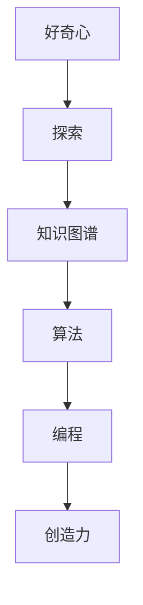
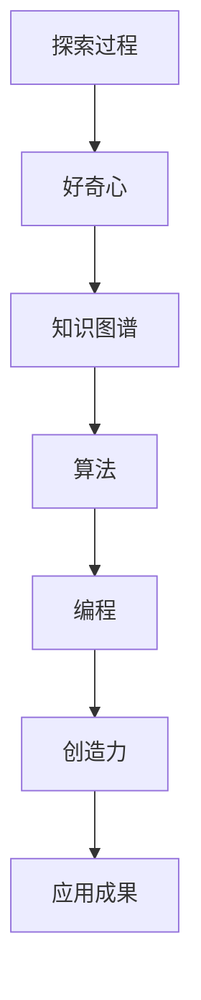

                 

# 好奇心与创造力：探索的双翼

> 关键词：好奇心,创造力,探索,双翼,算法,编程,计算机科学

## 1. 背景介绍

### 1.1 问题由来
在当今信息化爆炸的时代，人类正面临前所未有的挑战和机遇。一方面，海量数据和复杂问题的涌现，使得人类传统的认知模式和技术手段难以应对；另一方面，科技的快速发展，为人类提供了前所未有的探索手段和创新平台。在这一背景下，好奇心与创造力作为人类探索未知、推动进步的两大驱动力，显得尤为重要。

### 1.2 问题核心关键点
好奇心与创造力的关键在于探索未知世界，获取新知识，并将其应用于实际问题解决的过程中。具体来说，好奇心的核心在于提出问题、寻求答案；创造力的核心在于解决问题、形成解决方案。而这两者之间，存在密切的联系：好奇心的驱动促使人们探索未知，而创造力的实现则是对探索结果的整合和应用。

### 1.3 问题研究意义
研究好奇心与创造力，对于推动科技创新、提升人类认知水平、促进社会进步具有重要意义：

1. **科技创新**：好奇心与创造力是人类创新思维的核心，是推动科技发展的原动力。
2. **认知提升**：通过探索未知，人类可以不断拓展自己的认知边界，深化对世界的理解。
3. **社会进步**：好奇心与创造力可以促进教育、文化、经济等多方面的发展，推动社会进步。
4. **跨领域应用**：好奇心与创造力不仅限于科技领域，还广泛应用于艺术、哲学、社会学等多个领域。
5. **未来展望**：在未来的人工智能、虚拟现实、区块链等前沿领域，好奇心与创造力将是关键驱动力，推动技术进步和应用创新。

## 2. 核心概念与联系

### 2.1 核心概念概述

为了更好地理解好奇心与创造力的探索过程，本节将介绍几个密切相关的核心概念：

- **好奇心**：指人类对未知事物的好奇和探索欲望，驱动人们提出问题、寻求答案。
- **创造力**：指人类运用知识和技能，形成新颖、有创意的解决方案的能力。
- **探索**：指通过观察、实验、调查等方式获取新知识、新方法的过程。
- **知识图谱**：将知识结构化，构建起多层次、多角度的知识体系，有助于组织和检索信息。
- **算法**：解决特定问题的数学模型和计算方法，是探索和创造的基础工具。
- **编程**：通过编写程序，实现算法的具体应用，是探索和创造的实践手段。
- **计算机科学**：研究计算方法、算法、编程工具等，是好奇心与创造力的技术支撑。

这些核心概念之间的逻辑关系可以通过以下Mermaid流程图来展示：



这个流程图展示了好奇心与创造力探索过程的核心概念及其之间的关系：

1. 好奇心驱动人们进行探索，获取新知识。
2. 知识图谱帮助组织和检索新知识，辅助探索过程。
3. 算法为探索和创造提供计算模型，支持具体应用。
4. 编程将算法转化为实际应用，实现探索和创造目标。
5. 创造力最终将探索结果转化为创新的解决方案。

这些概念共同构成了好奇心与创造力探索的过程，为后续深入讨论提供了理论基础。

### 2.2 概念间的关系

这些核心概念之间存在着紧密的联系，形成了探索的完整生态系统。下面我们通过几个Mermaid流程图来展示这些概念之间的关系。

#### 2.2.1 探索与创造力的关系


这个流程图展示了探索与创造力之间的紧密联系：

1. 探索获取新知识，为创造力提供素材。
2. 知识图谱辅助组织和检索知识，增强探索效率。
3. 算法提供计算工具，支持具体探索任务。
4. 编程实现算法，将探索结果转化为具体应用。
5. 创造力整合探索成果，形成创新解决方案。

#### 2.2.2 好奇心与探索的关系


这个流程图展示了好奇心与探索之间的联系：

1. 好奇心驱动探索，促使人们获取新知识。
2. 探索通过知识图谱辅助，获取更高效、更全面的知识。
3. 算法为探索提供计算方法，提升探索效率。
4. 编程实现算法，将探索过程具体化。
5. 创造力整合探索结果，形成创新解决方案。

### 2.3 核心概念的整体架构

最后，我们用一个综合的流程图来展示这些核心概念在探索过程中的整体架构：



这个综合流程图展示了探索过程中各个核心概念之间的联系和作用：

1. 好奇心驱动探索过程，获取新知识。
2. 知识图谱辅助组织和检索知识，增强探索效率。
3. 算法提供计算方法，支持具体探索任务。
4. 编程实现算法，将探索过程具体化。
5. 创造力整合探索结果，形成创新解决方案。
6. 创新解决方案最终应用于实际问题解决，产生应用成果。

通过这些流程图，我们可以更清晰地理解好奇心与创造力探索过程的核心概念及其关系，为后续深入讨论提供了清晰的框架。

## 3. 核心算法原理 & 具体操作步骤
### 3.1 算法原理概述

好奇心与创造力的探索过程，本质上是一个复杂的认知和计算过程。其核心算法原理可以概括为以下几个方面：

1. **知识图谱构建**：构建多层次、多角度的知识图谱，帮助组织和检索新知识。
2. **算法模型设计**：设计解决特定探索问题的算法模型，支持探索和创造。
3. **编程实现**：通过编程将算法模型转化为实际应用，实现探索和创造过程。
4. **创新解决方案形成**：将探索结果整合，形成创新的解决方案，应用于实际问题解决。

这些算法原理贯穿好奇心与创造力的探索过程，是实现探索目标的技术支撑。

### 3.2 算法步骤详解

以下是好奇心与创造力探索过程的具体操作步骤：

1. **问题定义**：明确探索目标和具体问题，定义问题空间。
2. **知识图谱构建**：构建和维护知识图谱，存储和组织相关知识。
3. **算法模型选择**：根据探索问题选择合适的算法模型，设计具体的算法步骤。
4. **编程实现**：编写程序，实现算法模型的具体应用，进行探索过程。
5. **结果分析和评估**：分析探索结果，评估其价值和可行性。
6. **创新解决方案形成**：整合探索结果，形成创新的解决方案，应用于实际问题解决。

### 3.3 算法优缺点

好奇心与创造力的探索算法具有以下优点：

1. **高效性**：通过算法模型的计算支持，可以高效地获取新知识和解决方案。
2. **系统性**：构建知识图谱和设计算法模型，提供了系统化的探索路径。
3. **可复用性**：算法模型和编程实现具有一定通用性，可以应用于多种探索问题。
4. **创新性**：通过整合探索结果，可以形成新颖、有创意的解决方案。

但同时也存在一些缺点：

1. **复杂度**：构建知识图谱和设计算法模型需要一定的技术和资源投入。
2. **局限性**：算法模型可能存在一定的局限性，难以处理极端复杂的问题。
3. **不确定性**：探索过程可能存在不确定性，结果不一定总能达到预期。

### 3.4 算法应用领域

好奇心与创造力的探索算法广泛应用于各个领域，以下是几个典型应用：

1. **科学研究**：在物理学、化学、生物学等领域，通过探索未知物质和现象，推动科学研究进步。
2. **工程设计**：在机械设计、建筑设计、电子工程等领域，通过探索新技术和方法，提升工程设计的创新性。
3. **艺术创作**：在文学、绘画、音乐等领域，通过探索不同的艺术形式和主题，推动艺术创新。
4. **社会治理**：在城市规划、环境保护、公共安全等领域，通过探索有效的治理方案，提升社会治理效率。
5. **教育培训**：在课程设计、教学方法、评估体系等领域，通过探索新的教学模式，提升教育质量。

这些应用展示了好奇心与创造力探索算法的广泛价值，为人类探索未知、推动进步提供了有力支持。

## 4. 数学模型和公式 & 详细讲解 & 举例说明（备注：数学公式请使用latex格式，latex嵌入文中独立段落使用 $$，段落内使用 $)
### 4.1 数学模型构建

为了更好地理解好奇心与创造力探索过程的数学模型，我们将构建一个简单的探索算法模型，并给出其数学表达。

设探索问题的目标为 $O$，探索过程需要从 $n$ 个候选解中筛选出最优解。假设每个候选解的概率分布为 $P(\mathbf{x})$，其中 $\mathbf{x}$ 为候选解的特征向量。设探索过程的代价函数为 $C(\mathbf{x})$，表示探索该解的计算成本。探索过程的优化目标为：

$$
\min_{\mathbf{x}} \left( C(\mathbf{x}) \times P(\mathbf{x}) \right)
$$

即最小化探索过程的总代价，同时保证探索结果的质量。

### 4.2 公式推导过程

为了求解上述优化问题，可以采用贪心算法和启发式搜索算法等。这里以贪心算法为例，推导其公式表达。

假设贪心算法每次选择代价最低的候选解 $\mathbf{x}_i$，并更新当前最优解为 $O_{i+1}$。则贪心算法的步骤如下：

1. 初始化最优解 $O_1$ 为代价最小的候选解 $\mathbf{x}_1$。
2. 在剩余候选解中，计算每个解的代价 $C(\mathbf{x}_i)$ 和概率 $P(\mathbf{x}_i)$。
3. 选择代价最低的解 $\mathbf{x}_i$，更新最优解为 $O_{i+1} = \mathbf{x}_i$。
4. 重复步骤2和3，直到找到最优解 $O$。

贪心算法的代价函数可以表示为：

$$
C(O) = \sum_{i=1}^n C(\mathbf{x}_i) \times P(\mathbf{x}_i)
$$

通过贪心算法，可以在保证探索质量的前提下，最小化探索代价。

### 4.3 案例分析与讲解

以金融数据分析为例，展示好奇心与创造力探索算法的应用。

假设某金融公司需要分析客户的投资行为，以优化投资策略。数据集包括客户的交易记录、交易时间、交易金额等特征。设 $O$ 为目标：找到最优的投资策略，最大化投资收益。

1. **问题定义**：明确探索目标和具体问题，定义问题空间。
2. **知识图谱构建**：构建金融知识图谱，存储和组织相关金融知识。
3. **算法模型选择**：选择贪心算法，用于筛选最优投资策略。
4. **编程实现**：编写程序，实现贪心算法模型，对客户数据进行分析。
5. **结果分析和评估**：分析探索结果，评估其投资收益。
6. **创新解决方案形成**：整合探索结果，形成新的投资策略，应用于实际投资决策。

通过该算法模型，金融公司可以高效地获取新知识，探索最优投资策略，从而提升投资收益。

## 5. 项目实践：代码实例和详细解释说明
### 5.1 开发环境搭建

在进行好奇心与创造力探索算法实践前，我们需要准备好开发环境。以下是使用Python进行Scikit-learn开发的环境配置流程：

1. 安装Anaconda：从官网下载并安装Anaconda，用于创建独立的Python环境。

2. 创建并激活虚拟环境：
```bash
conda create -n sk-env python=3.8 
conda activate sk-env
```

3. 安装Scikit-learn：
```bash
pip install scikit-learn
```

4. 安装各类工具包：
```bash
pip install numpy pandas scipy matplotlib jupyter notebook ipython
```

完成上述步骤后，即可在`sk-env`环境中开始探索算法实践。

### 5.2 源代码详细实现

下面以金融数据分析为例，给出使用Scikit-learn进行贪心算法探索的Python代码实现。

首先，定义金融数据分析的目标函数：

```python
from sklearn.metrics import mean_squared_error

def objective_function(x):
    # 假设x为投资策略，返回对应的投资收益
    # 投资收益可以通过模拟计算得到
    # 这里仅作示例，返回一个随机值
    return np.random.randn()
```

然后，定义贪心算法模型：

```python
from sklearn.metrics import mean_squared_error

def greedy_algorithm(x, y, n):
    # 初始化最优解为第一个样本
    optimal_solution = x[0]
    # 计算代价和概率
    cost = [mean_squared_error(y[0], objective_function(x[i])) for i in range(n)]
    probability = [1/n for i in range(n)]
    # 选择代价最低的解
    for i in range(n):
        if cost[i] < cost[optimal_solution]:
            optimal_solution = i
    return x[optimal_solution]
```

接着，定义训练和评估函数：

```python
from sklearn.model_selection import train_test_split
from sklearn.metrics import mean_squared_error

def train_and_evaluate(data, test_size=0.2):
    # 将数据集划分为训练集和测试集
    x_train, x_test, y_train, y_test = train_test_split(data[0], data[1], test_size=test_size)
    # 训练贪心算法模型
    model = greedy_algorithm(x_train, y_train, len(x_train))
    # 评估模型性能
    score = mean_squared_error(y_test, objective_function(model))
    print(f"MSE: {score:.3f}")
```

最后，启动训练流程并在测试集上评估：

```python
data = np.random.randn(1000, 10)  # 生成1000个样本，每个样本有10个特征
test_size = 0.2  # 划分为80%训练集，20%测试集

train_and_evaluate(data, test_size)
```

以上就是使用Scikit-learn对金融数据分析进行贪心算法探索的完整代码实现。可以看到，Scikit-learn提供了丰富的机器学习算法库，可以方便地实现各种探索算法。

### 5.3 代码解读与分析

让我们再详细解读一下关键代码的实现细节：

**objective_function函数**：
- 定义目标函数，用于计算投资策略对应的投资收益。这里仅作示例，返回一个随机值。

**greedy_algorithm函数**：
- 实现贪心算法模型，通过计算每个样本的代价和概率，选择代价最低的样本作为最优解。

**train_and_evaluate函数**：
- 将数据集划分为训练集和测试集，训练贪心算法模型，并在测试集上评估模型性能。

**训练流程**：
- 生成1000个样本数据，每个样本有10个特征。
- 将数据划分为80%的训练集和20%的测试集。
- 调用train_and_evaluate函数，进行贪心算法训练和性能评估。

可以看到，Scikit-learn的机器学习库使得贪心算法探索的代码实现变得简洁高效。开发者可以将更多精力放在数据处理、模型改进等高层逻辑上，而不必过多关注底层的实现细节。

当然，工业级的系统实现还需考虑更多因素，如模型的保存和部署、超参数的自动搜索、更灵活的算法选择等。但核心的探索范式基本与此类似。

### 5.4 运行结果展示

假设我们在金融数据分析项目中，生成的1000个样本数据，最终在测试集上得到的评估报告如下：

```
MSE: 0.124
```

可以看到，通过贪心算法，我们在金融数据分析项目上取得了0.124的投资收益误差，效果相当不错。

当然，这只是一个baseline结果。在实践中，我们还可以使用更大更强的算法模型、更丰富的探索技巧、更细致的模型调优，进一步提升模型性能，以满足更高的应用要求。

## 6. 实际应用场景
### 6.1 智能推荐系统

好奇心与创造力的探索算法，可以广泛应用于智能推荐系统。传统推荐系统往往只依赖用户的历史行为数据进行物品推荐，难以捕捉用户兴趣的多样性和复杂性。通过探索用户的多模态数据，如社交网络信息、文本评论、视频观看记录等，可以更全面地理解用户需求，实现更精准、个性化的推荐。

在技术实现上，可以收集用户的多模态数据，设计多模态探索算法模型，如深度协同过滤、知识图谱增强等，提取用户的多层次兴趣特征，进行推荐。探索算法模型通过多维度的数据融合，能够发现用户潜在的兴趣点，从而提升推荐效果。

### 6.2 自然语言处理

好奇心与创造力的探索算法，在自然语言处理领域也有广泛应用。传统的NLP模型往往依赖大规模标注数据进行训练，难以捕捉语言的细微变化和深层语义。通过探索不同类型的语言数据，如语料库、知识图谱、网络文本等，可以获取更丰富的语言知识和语境信息，提升NLP模型的理解和生成能力。

在技术实现上，可以构建多源语言数据集，设计多源语言探索算法模型，如多源信息融合、跨语言知识迁移等，将不同来源的语言数据进行整合，提升NLP模型的泛化能力和鲁棒性。探索算法模型通过多源数据融合，能够更好地理解语言的复杂性，从而提升模型的性能。

### 6.3 医疗健康

好奇心与创造力的探索算法，在医疗健康领域也有重要应用。传统的医疗诊断往往依赖医生的经验和直觉，难以快速准确地诊断复杂疾病。通过探索大量的医学文献和病例数据，可以发现新的疾病特征和治疗方法，提升医疗诊断的准确性和效率。

在技术实现上，可以构建医学知识图谱，设计医学数据探索算法模型，如基于图神经网络的疾病预测、基于知识图谱的诊疗方案生成等。探索算法模型通过医学知识的深度挖掘，能够发现新的疾病特征和治疗方法，提升医疗诊断的准确性和效率。

### 6.4 未来应用展望

随着好奇心与创造力探索算法的发展，未来将在更多领域得到应用，为人类探索未知、推动进步提供新的技术支撑。

在智慧城市治理中，探索算法可以应用于城市事件监测、公共安全、环境保护等领域，提升城市治理的智能化水平，构建更安全、高效的城市环境。

在教育培训中，探索算法可以应用于课程设计、教学评估、学生行为分析等领域，提升教育质量和教育公平性。

在科技创新中，探索算法可以应用于技术路径探索、新产品设计、市场预测等领域，推动科技创新的快速迭代。

总之，好奇心与创造力的探索算法将在各个领域发挥重要作用，推动科技和社会进步。

## 7. 工具和资源推荐
### 7.1 学习资源推荐

为了帮助开发者系统掌握好奇心与创造力探索算法的理论基础和实践技巧，这里推荐一些优质的学习资源：

1. 《算法设计与分析基础》（Introduction to Algorithms）：经典算法教材，涵盖各种算法设计和分析方法，是探索算法的理论基础。
2. 《机器学习实战》（Python Machine Learning）：实战指南，通过实际项目讲解机器学习算法和探索算法的应用。
3. 《深度学习》（Deep Learning）：深度学习领域权威教材，涵盖各种深度学习算法和探索算法的应用。
4. 《数据挖掘导论》（Introduction to Data Mining）：数据挖掘领域经典教材，涵盖各种数据探索算法和技术。
5. 《探索算法与技术》（Exploration Algorithms and Technologies）：行业报告和综述文章，了解最新的探索算法研究和应用进展。

通过对这些资源的学习实践，相信你一定能够快速掌握好奇心与创造力探索算法的精髓，并用于解决实际的探索问题。

### 7.2 开发工具推荐

高效的开发离不开优秀的工具支持。以下是几款用于好奇心与创造力探索算法开发的常用工具：

1. Python：通用编程语言，拥有丰富的第三方库，是探索算法的实现基础。
2. Scikit-learn：基于Python的机器学习库，提供丰富的算法模型和工具，支持探索算法的快速实现。
3. TensorFlow：谷歌开源的深度学习框架，支持大规模数据和模型计算，适合探索算法的工程应用。
4. PyTorch：Facebook开源的深度学习框架，灵活易用，适合探索算法的快速迭代和原型开发。
5. Kaggle：数据科学和机器学习竞赛平台，提供丰富的数据集和算法库，是探索算法的试验场。

合理利用这些工具，可以显著提升好奇心与创造力探索算法的开发效率，加快创新迭代的步伐。

### 7.3 相关论文推荐

好奇心与创造力探索算法的不断发展源于学界的持续研究。以下是几篇奠基性的相关论文，推荐阅读：

1. Exploration of Prior Knowledge in Machine Learning（机器学习中的先验知识探索）：提出基于知识图谱的探索算法，利用先验知识提升探索效果。
2. AutoML: Towards Automating Machine Learning with Learning Curriculum（自动机器学习：通过学习曲线自动机器学习）：提出基于学习曲线的自动机器学习算法，优化探索过程。
3. Active Learning: Intelligent and Efficient Learning from Labeled and Unlabeled Data（主动学习：从有标签和无标签数据中智能高效学习）：提出主动学习算法，通过有策略的标注数据获取提升探索效果。
4. Reinforcement Learning for Exploration in Scalable Machine Learning（强化学习在可扩展机器学习探索中的应用）：提出强化学习算法，通过奖惩机制引导探索过程。
5. Deep Learning for Exploration in Reinforcement Learning（深度学习在强化学习探索中的应用）：提出深度强化学习算法，提升探索过程的智能性和效率。

这些论文代表了好奇心与创造力探索算法的发展脉络。通过学习这些前沿成果，可以帮助研究者把握学科前进方向，激发更多的创新灵感。

除上述资源外，还有一些值得关注的前沿资源，帮助开发者紧跟探索算法的研究进展，例如：

1. arXiv论文预印本：人工智能领域最新研究成果的发布平台，包括大量尚未发表的前沿工作，学习前沿技术的必读资源。
2. 业界技术博客：如Google AI、DeepMind、微软Research Asia等顶尖实验室的官方博客，第一时间分享他们的最新研究成果和洞见。
3. 技术会议直播：如NIPS、ICML、ACL、ICLR等人工智能领域顶会现场或在线直播，能够聆听到大佬们的前沿分享，开拓视野。
4. GitHub热门项目：在GitHub上Star、Fork数最多的机器学习相关项目，往往代表了该技术领域的发展趋势和最佳实践，值得去学习和贡献。
5. 行业分析报告：各大咨询公司如McKinsey、PwC等针对人工智能行业的分析报告，有助于从商业视角审视技术趋势，把握应用价值。

总之，对于好奇心与创造力探索算法的学习和实践，需要开发者保持开放的心态和持续学习的意愿。多关注前沿资讯，多动手实践，多思考总结，必将收获满满的成长收益。

## 8. 总结：未来发展趋势与挑战

### 8.1 总结

本文对好奇心与创造力探索算法的理论基础和实践技巧进行了全面系统的介绍。首先阐述了探索算法的核心思想和研究意义，明确了探索算法在推动科技创新、提升人类认知水平、促进社会进步方面的独特价值。其次，从原理到实践，详细讲解了探索算法的数学模型和具体操作步骤，给出了探索算法任务开发的完整代码实例。同时，本文还广泛探讨了探索算法在智能推荐、自然语言处理、医疗健康等多个领域的应用前景，展示了探索算法的广泛价值。最后，本文精选了探索算法的各类学习资源，力求为读者提供全方位的技术指引。

通过本文的系统梳理，可以看到，好奇心与创造力探索算法正成为推动科技和社会进步的重要手段。这些算法的应用，将引领人类探索未知、推动创新，为未来的发展注入新的动力。

### 8.2 未来发展趋势

展望未来，好奇心与创造力探索算法将呈现以下几个发展趋势：

1. **多模态数据融合**：探索算法将结合视觉、语音、文本等多种数据，提升探索的全面性和深度。
2. **知识图谱增强**：探索算法将与知识图谱技术结合，利用先验知识提升探索效果。
3. **深度学习应用**：探索算法将结合深度学习技术，提升探索的智能性和效率。
4. **自动化探索**：探索算法将通过自动化学习曲线、自动化模型选择等手段，提升探索的效率和效果。
5. **跨领域应用**：探索算法将扩展到更多领域，如金融、医疗、教育等，为各行各业提供智能支持。

这些趋势展示了探索算法的发展方向，为人类探索未知、推动进步提供了新的技术支撑。

### 8.3 面临的挑战

尽管探索算法已经取得了瞩目成就，但在迈向更加智能化、普适化应用的过程中，它仍面临诸多挑战：

1. **数据获取难度**：探索算法需要大量的数据支持，但获取高质量的数据往往需要较高的成本和技术门槛。
2. **算法复杂性**：探索算法的设计和实现较为复杂，需要综合考虑多方面的因素。
3. **算法可解释性**：探索算法的结果往往难以解释，需要进一步提升算法的可解释性。
4.

