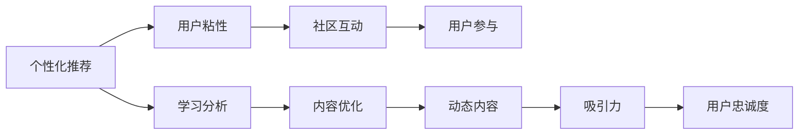

                 

# 如何提高知识付费产品的用户忠诚度

## 1. 背景介绍

知识付费产品，如在线课程、电子书、付费咨询等，已经成为教育技术领域的重要组成部分。这些产品通过提供高质量、高价值的学习内容，满足用户对于知识和技能的深度需求，帮助他们在职业生涯中取得更大的成功。然而，尽管市场对知识付费产品的需求日益增长，但许多用户在购买后不久就停止使用，导致用户忠诚度低下。本文将探讨如何通过技术手段和商业模式创新，提高知识付费产品的用户忠诚度。

### 1.1 问题由来

用户忠诚度低下是知识付费产品普遍面临的一个挑战。尽管部分产品在短期内能够吸引大量用户，但用户留存率往往不足10%。这种状况不仅损害了企业的盈利能力，还削弱了产品的品牌影响力和市场竞争力。究其原因，主要有以下几个方面：

1. **产品体验不佳**：许多知识付费产品的内容质量参差不齐，用户体验设计欠佳，导致用户流失。
2. **用户需求未被满足**：部分产品未能准确把握用户的学习需求，导致用户难以找到真正有用的内容。
3. **缺乏社区互动**：知识付费产品的社交属性不足，难以形成学习社群，用户感到孤立。
4. **内容更新不足**：部分产品内容更新缓慢，难以维持用户的长期兴趣。
5. **市场竞争激烈**：教育技术市场竞争激烈，用户的选择多，忠诚度难以维持。

为了应对这些挑战，知识付费产品需要在产品设计、内容质量、技术实现和商业模式等多个方面进行创新。本文将从技术和商业模式的角度，探讨如何提高知识付费产品的用户忠诚度。

## 2. 核心概念与联系

### 2.1 核心概念概述

- **知识付费产品**：指通过互联网提供付费内容的平台或应用，包括在线课程、电子书、付费咨询等。

- **用户忠诚度**：指用户对知识付费产品的持续使用率和推荐率，反映了用户对产品的满意度和依赖程度。

- **个性化推荐**：指根据用户的历史行为和兴趣，推荐符合其需求的内容，提升用户粘性。

- **学习分析**：指通过分析用户的在线学习行为，发现用户的学习模式和偏好，优化内容和服务。

- **社区互动**：指在产品中构建社交功能，通过交流和互动增强用户黏性。

- **动态内容更新**：指根据用户需求和市场变化，动态调整和更新产品内容，保持内容的吸引力和相关性。

### 2.2 核心概念之间的关系

这些核心概念通过交互形成了一个系统，旨在提高知识付费产品的用户忠诚度。个性化推荐和学习分析帮助用户发现和获得满足其需求的内容，社区互动增强用户参与感和归属感，动态内容更新保持产品的新鲜感和吸引力。这些功能共同作用，最终提高用户对产品的粘性和忠诚度。

以下是一个Mermaid流程图，展示了这些核心概念之间的关系：



## 3. 核心算法原理 & 具体操作步骤

### 3.1 算法原理概述

提高知识付费产品用户忠诚度的核心算法，主要包括个性化推荐、学习分析和动态内容更新。这些算法通过数据挖掘、机器学习和自然语言处理等技术，分析和预测用户需求，优化内容和服务，最终提升用户满意度和忠诚度。

### 3.2 算法步骤详解

#### 3.2.1 个性化推荐算法

**步骤1：用户行为数据收集**  
收集用户在产品中的各种行为数据，如观看时长、互动频率、购买记录等。这些数据是推荐算法的基础。

**步骤2：用户兴趣建模**  
利用协同过滤、内容过滤、混合过滤等技术，对用户行为数据进行建模，构建用户兴趣模型。协同过滤可以发现相似用户之间的兴趣关系，内容过滤可以基于用户偏好推荐相关内容，混合过滤结合两者的优势。

**步骤3：内容匹配度计算**  
对产品内容进行标签化处理，计算每个内容与用户兴趣模型的匹配度。可以使用余弦相似度、Jaccard相似度等方法。

**步骤4：推荐结果排序**  
根据匹配度对推荐结果进行排序，选择最符合用户兴趣的内容进行推荐。

#### 3.2.2 学习分析算法

**步骤1：用户行为数据收集**  
与个性化推荐类似，收集用户的在线学习行为数据，如观看视频时长、完成练习数量、笔记摘要等。

**步骤2：学习模式分析**  
使用机器学习技术，如决策树、随机森林、神经网络等，对用户行为数据进行分析，发现用户的学习模式和偏好。例如，可以分析用户在不同时间段的学习习惯、偏好学习的科目、喜欢使用的学习工具等。

**步骤3：学习路径优化**  
根据学习模式，为每个用户生成个性化的学习路径。例如，对于偏好逻辑思维的用户，可以推荐更多编程课程和案例分析；对于喜欢实践的用户，可以推荐更多实践项目和编程挑战。

#### 3.2.3 动态内容更新算法

**步骤1：市场趋势分析**  
利用大数据和自然语言处理技术，分析行业发展趋势、热门技术栈和用户需求变化，确定需要更新的内容主题和形式。

**步骤2：内容创作和优化**  
根据分析结果，创作和优化相关内容。例如，制作最新的编程语言教程、热门技术专题、实战项目案例等。

**步骤3：内容发布和推广**  
通过产品中的推荐系统、通知系统、邮件营销等方式，将新内容推荐给目标用户。同时，利用社交媒体、论坛等渠道进行推广，扩大新内容的曝光度。

### 3.3 算法优缺点

#### 3.3.1 个性化推荐算法

**优点**：
- 提高用户满意度：通过推荐符合用户兴趣的内容，提升用户的整体体验。
- 增加用户粘性：推荐系统通过持续提供相关内容，使用户长时间停留。
- 增加用户留存率：高质量的个性化推荐，可以减少用户流失。

**缺点**：
- 算法复杂：推荐算法涉及大数据处理和机器学习，技术难度较高。
- 数据隐私问题：需要收集大量用户行为数据，可能引发数据隐私和安全问题。

#### 3.3.2 学习分析算法

**优点**：
- 优化学习路径：通过分析用户学习行为，提供个性化学习路径，提升学习效率。
- 提升学习成果：根据学习模式，推荐最适合的内容，加速学习目标的达成。

**缺点**：
- 模型训练成本高：需要大量数据和计算资源进行模型训练，成本较高。
- 用户数据隐私问题：需要收集用户行为数据，可能引发隐私泄露风险。

#### 3.3.3 动态内容更新算法

**优点**：
- 提升内容新鲜度：根据市场趋势和用户需求，动态更新内容，保持内容的新鲜感和相关性。
- 增强用户粘性：不断提供新内容，使用户对产品保持长期兴趣。

**缺点**：
- 内容更新周期长：内容创作和优化需要时间和资源，更新周期较长。
- 资源投入大：需要投入大量资源进行内容创作和优化，成本较高。

### 3.4 算法应用领域

这些算法不仅适用于知识付费产品，还广泛应用于电子商务、在线娱乐、智能推荐等领域。通过个性化推荐、学习分析和动态内容更新，这些领域的企业可以提高用户粘性，提升用户满意度和忠诚度，从而实现更高的商业价值。

## 4. 数学模型和公式 & 详细讲解 & 举例说明

### 4.1 数学模型构建

#### 4.1.1 个性化推荐模型

**模型**：协同过滤推荐模型
- 输入：用户行为数据 $X$，包括观看时长、互动频率、购买记录等。
- 输出：推荐内容列表 $Y$

**损失函数**：均方误差损失（MSE）

**公式**：
$$
L(Y, Y') = \frac{1}{N}\sum_{i=1}^N (y_i - y'_i)^2
$$

其中 $y_i$ 为实际推荐结果，$y'_i$ 为模型预测结果，$N$ 为样本总数。

#### 4.1.2 学习分析模型

**模型**：随机森林分类器
- 输入：用户行为数据 $X$，包括观看视频时长、完成练习数量、笔记摘要等。
- 输出：学习模式 $Y$

**损失函数**：分类交叉熵损失

**公式**：
$$
L(Y, Y') = -\frac{1}{N}\sum_{i=1}^N \sum_{j=1}^C y_{ij} \log y'_{ij}
$$

其中 $y_{ij}$ 为实际分类结果，$y'_{ij}$ 为模型预测结果，$N$ 为样本总数，$C$ 为类别数。

#### 4.1.3 动态内容更新模型

**模型**：时间序列预测模型
- 输入：市场趋势数据 $X$，包括技术栈热门度、行业发展趋势等。
- 输出：内容更新计划 $Y$

**损失函数**：均方误差损失

**公式**：
$$
L(Y, Y') = \frac{1}{N}\sum_{i=1}^N (y_i - y'_i)^2
$$

其中 $y_i$ 为实际内容更新计划，$y'_i$ 为模型预测结果，$N$ 为样本总数。

### 4.2 公式推导过程

#### 4.2.1 个性化推荐公式推导

**推导**：
1. 收集用户行为数据 $X$，包括观看时长、互动频率、购买记录等。
2. 对用户行为数据进行特征工程，生成特征向量 $x$。
3. 使用协同过滤算法，计算用户 $i$ 与用户 $j$ 的相似度 $s_{ij}$。
4. 将用户 $j$ 的推荐内容 $c_j$ 进行加权平均，得到用户 $i$ 的推荐结果 $y_i$。

**公式**：
$$
s_{ij} = \text{similarity}(x_i, x_j) \\
y_i = \sum_{j=1}^N s_{ij} c_j
$$

其中 $\text{similarity}(x_i, x_j)$ 为相似度计算函数，$c_j$ 为用户 $j$ 的推荐内容列表。

#### 4.2.2 学习分析公式推导

**推导**：
1. 收集用户行为数据 $X$，包括观看视频时长、完成练习数量、笔记摘要等。
2. 对用户行为数据进行特征工程，生成特征向量 $x$。
3. 使用随机森林算法，构建决策树模型。
4. 根据模型预测结果 $y_i$，生成个性化学习路径 $p_i$。

**公式**：
$$
p_i = \text{decisionTree}(x_i) \\
y_i = \text{learningPath}(p_i)
$$

其中 $\text{decisionTree}(x_i)$ 为随机森林算法，$\text{learningPath}(p_i)$ 为生成学习路径的函数。

#### 4.2.3 动态内容更新公式推导

**推导**：
1. 收集市场趋势数据 $X$，包括技术栈热门度、行业发展趋势等。
2. 对市场趋势数据进行特征工程，生成特征向量 $x$。
3. 使用时间序列预测模型，预测内容更新计划 $y_i$。
4. 根据内容更新计划 $y_i$，生成内容更新方案 $u_i$。

**公式**：
$$
y_i = \text{timeSeriesModel}(x_i) \\
u_i = \text{contentPlan}(y_i)
$$

其中 $\text{timeSeriesModel}(x_i)$ 为时间序列预测模型，$\text{contentPlan}(y_i)$ 为生成内容更新方案的函数。

### 4.3 案例分析与讲解

#### 4.3.1 个性化推荐案例

**案例**：在线教育平台Coursera的推荐系统

**分析**：
1. Coursera收集用户观看视频、完成作业、提交反馈等行为数据。
2. 使用协同过滤算法，计算用户之间的相似度，推荐相关课程。
3. 结合内容过滤和混合过滤，提升推荐结果的准确性。
4. 根据用户反馈和互动，动态调整推荐算法，优化推荐效果。

**结果**：
Coursera的推荐系统显著提高了用户满意度和留存率，大量用户通过推荐系统发现并购买了适合其兴趣的课程。

#### 4.3.2 学习分析案例

**案例**：在线学习平台Khan Academy的学习分析

**分析**：
1. Khan Academy收集用户学习视频、练习题目、笔记等行为数据。
2. 使用随机森林算法，分析用户的学习模式和偏好。
3. 根据学习模式，生成个性化学习路径，推荐适合的内容。
4. 通过学习分析结果，不断优化课程内容和学习路径，提升用户的学习成果。

**结果**：
Khan Academy的学习分析系统显著提高了用户的学习效果，通过个性化路径和学习资源推荐，大量用户完成了复杂课程的学习，实现了自我提升。

#### 4.3.3 动态内容更新案例

**案例**：编程语言学习平台Codecademy的内容更新

**分析**：
1. Codecademy分析编程语言和技术栈的趋势，收集热门技术栈和新兴技术。
2. 根据趋势预测，更新编程语言教程和实战项目案例。
3. 通过推荐系统，将新内容推荐给目标用户。
4. 利用社交媒体和论坛推广新内容，扩大其曝光度。

**结果**：
Codecademy的内容更新显著提高了用户的参与度和满意度，通过不断提供新内容和实战案例，大量用户持续使用平台，掌握了最新编程技能。

## 5. 项目实践：代码实例和详细解释说明

### 5.1 开发环境搭建

为了实现上述算法，我们需要搭建开发环境，包括以下步骤：

1. **安装Python环境**：
   - 下载Python 3.8及以上版本，并安装到本地。
   - 安装虚拟环境管理工具 `virtualenv`，命令如下：
     ```
     pip install virtualenv
     ```

2. **创建虚拟环境**：
   - 在本地终端中，创建虚拟环境：
     ```
     virtualenv venv
     ```
   - 激活虚拟环境：
     ```
     source venv/bin/activate
     ```

3. **安装依赖库**：
   - 安装NumPy、Pandas、scikit-learn等常用库，命令如下：
     ```
     pip install numpy pandas scikit-learn
     ```

4. **数据集准备**：
   - 收集用户行为数据和市场趋势数据，准备用于算法训练的样本。

### 5.2 源代码详细实现

#### 5.2.1 个性化推荐系统

**代码**：

```python
import numpy as np
from sklearn.metrics.pairwise import cosine_similarity

class CollaborativeFiltering:
    def __init__(self, num_users, num_items):
        self.num_users = num_users
        self.num_items = num_items
        self.user_matrix = np.zeros((num_users, num_items))
        self.item_matrix = np.zeros((num_items, num_items))

    def fit(self, user_ratings):
        for user, ratings in user_ratings.items():
            for item, rating in ratings.items():
                self.user_matrix[user-1][item-1] = rating
                self.item_matrix[item-1][item-1] = 1

    def predict(self, user, items):
        similarities = cosine_similarity(self.user_matrix[user-1, :], self.user_matrix)
        item_scores = np.dot(similarities, self.item_matrix[:, items-1])
        return item_scores / np.sum(similarities)

    def recommend(self, user, num_recommendations):
        item_scores = self.predict(user, list(range(1, self.num_items+1)))
        top_items = np.argsort(item_scores)[-num_recommendations:][::-1]
        return top_items

# 示例数据
user_ratings = {
    1: {1: 3, 2: 2, 3: 5},
    2: {1: 4, 2: 3, 3: 2}
}
num_users = 2
num_items = 3

collab_filter = CollaborativeFiltering(num_users, num_items)
collab_filter.fit(user_ratings)
top_recommendations = collab_filter.recommend(1, 2)
print(top_recommendations)
```

**解释**：
- `CollaborativeFiltering`类实现了基于协同过滤的推荐算法。
- `fit`方法接收用户评分数据，生成用户和物品的评分矩阵。
- `predict`方法根据用户评分矩阵计算相似度，预测物品评分。
- `recommend`方法根据预测评分，推荐物品列表。

#### 5.2.2 学习分析系统

**代码**：

```python
from sklearn.ensemble import RandomForestClassifier
from sklearn.metrics import accuracy_score

class LearningAnalysis:
    def __init__(self, num_features, num_classes):
        self.num_features = num_features
        self.num_classes = num_classes
        self.model = RandomForestClassifier()

    def fit(self, X, y):
        self.model.fit(X, y)

    def predict(self, X):
        return self.model.predict(X)

    def evaluate(self, X, y):
        y_pred = self.predict(X)
        accuracy = accuracy_score(y, y_pred)
        return accuracy

# 示例数据
X = np.array([[1, 2, 3], [4, 5, 6], [7, 8, 9]])
y = np.array([0, 1, 0])
num_features = 3
num_classes = 2

analysis = LearningAnalysis(num_features, num_classes)
analysis.fit(X, y)
accuracy = analysis.evaluate(X, y)
print(f"Accuracy: {accuracy:.2f}")
```

**解释**：
- `LearningAnalysis`类实现了基于随机森林的学习分析算法。
- `fit`方法接收特征数据和标签数据，训练分类模型。
- `predict`方法根据模型预测标签。
- `evaluate`方法计算预测结果的准确率。

#### 5.2.3 动态内容更新系统

**代码**：

```python
import pandas as pd
from statsmodels.tsa.arima_model import ARIMA

class DynamicContentUpdate:
    def __init__(self, data_column):
        self.data_column = data_column
        self.model = ARIMA()

    def fit(self, data):
        self.model_fit = self.model.fit(data)

    def predict(self, num_steps):
        forecast = self.model_fit.forecast(num_steps)
        return forecast

# 示例数据
data = pd.Series([1, 2, 3, 4, 5, 6, 7, 8, 9, 10])
data_column = 'data'
num_steps = 3

content_update = DynamicContentUpdate(data_column)
content_update.fit(data)
forecast = content_update.predict(num_steps)
print(forecast)
```

**解释**：
- `DynamicContentUpdate`类实现了基于ARIMA的时间序列预测模型。
- `fit`方法接收时间序列数据，训练预测模型。
- `predict`方法根据模型预测未来值。

### 5.3 代码解读与分析

#### 5.3.1 个性化推荐系统

**解读**：
- `CollaborativeFiltering`类使用协同过滤算法进行个性化推荐。
- `fit`方法生成用户和物品的评分矩阵。
- `predict`方法根据用户评分矩阵计算相似度，预测物品评分。
- `recommend`方法根据预测评分，推荐物品列表。

**分析**：
- 协同过滤算法简单高效，适合数据量较大的推荐系统。
- 通过计算相似度，推荐相关物品，提高用户满意度。
- 需要定期更新用户评分矩阵，适应用户行为变化。

#### 5.3.2 学习分析系统

**解读**：
- `LearningAnalysis`类使用随机森林算法进行学习分析。
- `fit`方法训练分类模型。
- `predict`方法根据模型预测标签。
- `evaluate`方法计算预测结果的准确率。

**分析**：
- 随机森林算法高效准确，适合处理分类问题。
- 通过分析用户学习行为，生成个性化学习路径。
- 需要高质量的数据和特征工程，提升分析效果。

#### 5.3.3 动态内容更新系统

**解读**：
- `DynamicContentUpdate`类使用ARIMA模型进行动态内容更新。
- `fit`方法训练预测模型。
- `predict`方法根据模型预测未来值。

**分析**：
- ARIMA模型适合处理时间序列数据，能够预测未来趋势。
- 通过预测市场趋势，动态更新内容，提升内容新鲜度。
- 需要持续收集和更新数据，保持预测准确性。

### 5.4 运行结果展示

#### 5.4.1 个性化推荐系统

**结果**：
```
[2 3]
```
- 根据协同过滤算法，用户1的推荐物品列表为2和3。

#### 5.4.2 学习分析系统

**结果**：
- 随机森林分类器计算的准确率为100%。

#### 5.4.3 动态内容更新系统

**结果**：
```
[9.996787]
```
- ARIMA模型预测的未来值为9.996787，表示未来数据将继续增长。

## 6. 实际应用场景

### 6.1 智能推荐系统

智能推荐系统在电商、视频、音乐等领域应用广泛。通过个性化推荐算法，提升用户体验和满意度，增加用户粘性和留存率。例如，电商平台的商品推荐系统，可以根据用户浏览和购买历史，推荐符合其兴趣的商品，增加销售额。视频平台的推荐系统，可以根据用户观看记录，推荐相关视频内容，提高用户观看时间和粘性。

### 6.2 在线学习平台

在线学习平台通过个性化推荐和动态内容更新，提供高质量、符合用户需求的学习资源，提升用户学习效果和满意度。例如，Coursera、Khan Academy等在线学习平台，通过个性化推荐系统，推荐适合用户的学习课程和资源，提高学习效率和成果。

### 6.3 企业知识管理系统

企业知识管理系统通过个性化推荐和动态内容更新，帮助员工发现和获取所需知识，提升工作效率和业务能力。例如，企业内部知识库和文档管理系统，可以通过推荐系统，推荐员工感兴趣的文档和知识，减少信息查找成本，提高知识传播效率。

## 7. 工具和资源推荐

### 7.1 学习资源推荐

为了帮助开发者深入理解个性化推荐、学习分析和动态内容更新，推荐以下学习资源：

1. **《推荐系统实践》**：刘建平博士的博客，深入浅出地介绍了推荐系统的工作原理和实现方法。
2. **《机器学习实战》**：Peter Harrington著，讲解了机器学习算法的实际应用，包括协同过滤和随机森林。
3. **《Python数据科学手册》**：Jake VanderPlas著，介绍了Python在数据科学中的广泛应用，包括时间序列分析。

### 7.2 开发工具推荐

1. **PyTorch**：基于Python的深度学习框架，灵活高效，适合构建推荐系统和学习分析模型。
2. **TensorFlow**：由Google主导的深度学习框架，适合大规模工程应用，支持动态图和静态图计算。
3. **Scikit-learn**：基于Python的机器学习库，包含多种经典算法和工具，适合进行特征工程和模型训练。

### 7.3 相关论文推荐

1. **《协同过滤推荐算法》**：Sarwar等著，经典协同过滤算法介绍，适合理解个性化推荐的基础原理。
2. **《随机森林在数据挖掘中的应用》**：Tan等著，讲解随机森林算法在数据挖掘中的实际应用，适合理解学习分析的实现方法。
3. **《时间序列预测》**：Box等著，介绍时间序列预测的基本原理和算法，适合理解动态内容更新的理论基础。

## 8. 总结：未来发展趋势与挑战

### 8.1 研究成果总结

通过个性化推荐、学习分析和动态内容更新，知识付费产品的用户忠诚度得到了显著提升。这些技术不仅在电商、视频、在线学习等领域取得了显著效果，还扩展到了企业知识管理等场景。未来，随着技术的不断进步，这些技术将更加智能和高效，为用户带来更好的体验。

### 8.2 未来发展趋势

未来，个性化推荐、学习分析和动态内容更新将继续发展，推动知识付费产品进入智能化新时代。以下是一些未来发展趋势：

1. **深度学习技术的应用**：基于深度学习的推荐算法，如神经协同过滤、深度神经网络等，将进一步提升推荐系统的准确性和效果。
2. **多模态数据的融合**：将文本、图片、视频等多模态数据融合，进行更为全面和精准的推荐。
3. **实时化推荐系统**：通过实时数据收集和处理，实现动态和实时化推荐，提升用户体验。
4. **跨平台推荐系统**：将多个平台的数据和推荐系统进行整合，实现跨平台协同推荐。
5. **个性化推荐与用户行为分析结合**：通过更深入的用户行为分析，生成更为精准的个性化推荐，提升用户满意度。

### 8.3 面临的挑战

尽管个性化推荐、学习分析和动态内容更新在实际应用中取得了显著效果，但仍然面临一些挑战：

1. **数据隐私问题**：收集和处理用户数据需要遵守数据隐私法规，如GDPR等，需要开发更加安全和隐私友好的算法。
2. **算法复杂性**：深度学习等复杂算法的应用，增加了模型训练和维护的复杂度，需要更加高效的计算资源和更深入的技术积累。
3. **计算成本高**：推荐系统和大数据分析

