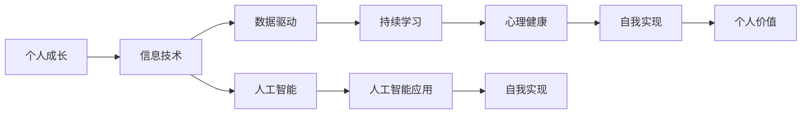
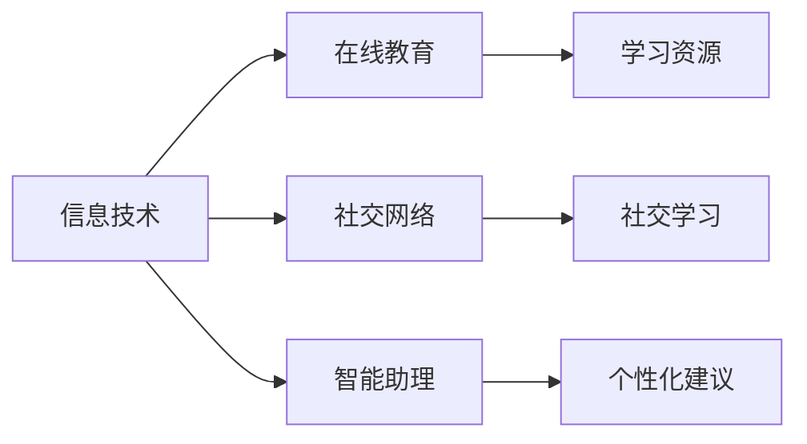
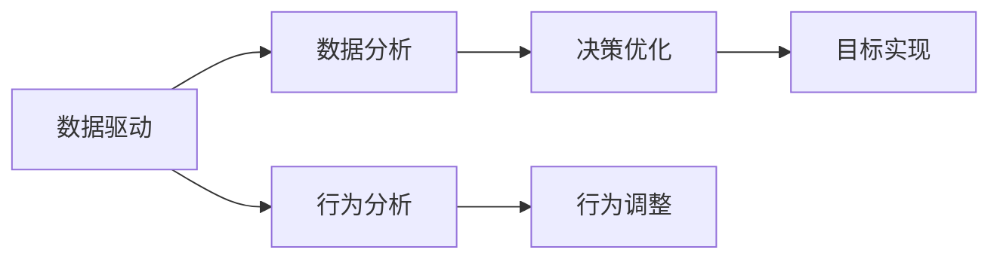
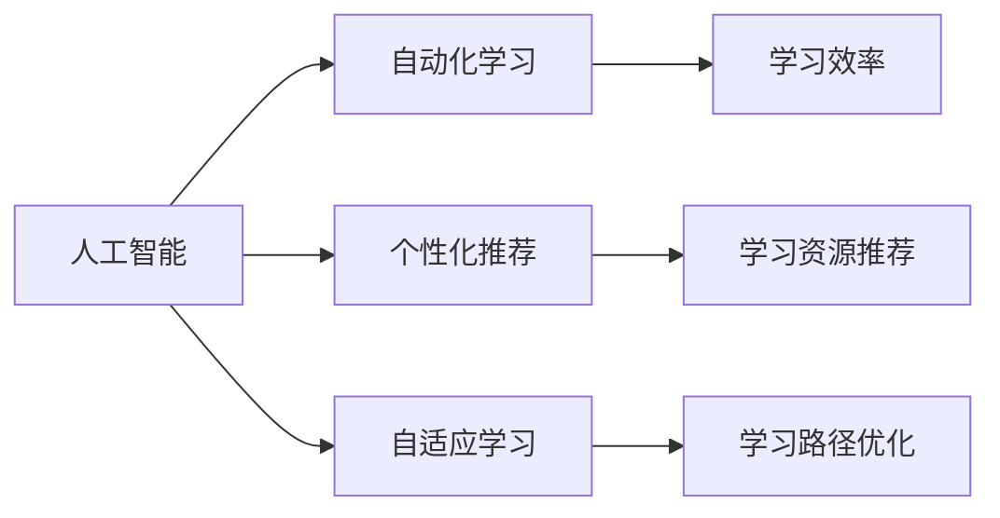
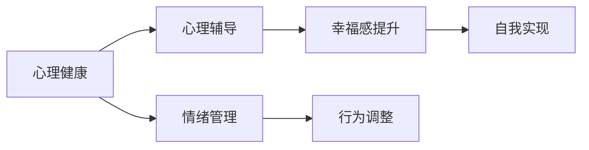

                 

# 如何进行自我成长：如何实现个人价值和自我实现？

## 1. 背景介绍

### 1.1 问题由来

在现代社会中，个人成长和自我实现已成为许多人追求的目标。然而，面对复杂多变的环境和激烈竞争，如何有效实现个人价值，成为许多人面临的难题。信息技术的高速发展，尤其是人工智能、大数据、区块链等新兴技术的崛起，为个体成长提供了新的机遇和挑战。本文旨在探讨如何利用信息技术手段，促进个人成长和自我实现，提升个人价值和社会影响力。

### 1.2 问题核心关键点

1. **信息技术的快速发展**：信息技术的发展为个人成长提供了新的工具和平台，如在线教育、社交网络、智能助理等，极大提升了学习的效率和便利性。
2. **知识更新的加速**：随着互联网的普及和信息技术的进步，知识更新速度不断加快，个人需要持续学习和适应新技能，才能保持竞争力。
3. **数据驱动的决策**：大数据技术使个体能够更加精准地了解自身行为和决策的效果，通过数据分析优化个人行为和决策，提升效率和效果。
4. **人工智能辅助**：AI技术在教育、医疗、商业等多个领域的应用，为个体提供了智能化服务，辅助个人实现目标。
5. **自我实现和价值追求**：自我实现是指个体通过不断学习和实践，实现个人潜能的最大化，而个人价值则是个人对社会的贡献和影响力。

这些核心关键点构成了信息技术对个人成长和自我实现的推动机制，通过深入理解其内在原理和应用方法，可以实现个人价值和自我实现的优化和提升。

### 1.3 问题研究意义

探讨如何利用信息技术手段实现个人成长和自我实现，具有重要的理论和实践意义：

1. **促进个人职业发展**：通过技术手段提升个人技能和知识水平，增强职业竞争力，实现职业发展目标。
2. **提升个人生活质量**：利用信息技术改善生活方式，如健康管理、时间管理等，提升生活质量。
3. **增强社会影响力**：通过技术手段放大个人影响力，推动社会进步和公共利益。
4. **实现自我价值**：通过技术手段实现自我潜能的最大化，满足自我实现需求，提升个人幸福感和成就感。
5. **推动技术应用创新**：技术手段的持续探索和应用，推动信息技术领域的创新，推动社会整体进步。

## 2. 核心概念与联系

### 2.1 核心概念概述

为更好地理解如何利用信息技术实现个人成长和自我实现，本节将介绍几个关键概念及其相互关系：

1. **个人成长（Personal Growth）**：通过学习、实践、反思等活动，提升个人技能、知识、心理素质等，实现个人潜能的发挥。
2. **自我实现（Self-Actualization）**：根据马斯洛的需求层次理论，个体通过实现自身潜能，达到自我满足和幸福感的最大化。
3. **信息技术（Information Technology）**：包括计算机技术、通信技术、网络技术等，通过信息的获取、处理和应用，提升个人效率和决策质量。
4. **人工智能（Artificial Intelligence）**：通过机器学习、自然语言处理、计算机视觉等技术，实现自动化、智能化、自适应等功能。
5. **数据驱动（Data-Driven）**：利用大数据技术，进行数据采集、存储、分析和应用，辅助决策和优化。
6. **持续学习（Lifelong Learning）**：在知识更新速度不断加快的背景下，通过不断学习，保持技能和知识的先进性。
7. **心理健康（Mental Health）**：通过技术手段，如心理健康应用、在线咨询等，提升个体心理素质和幸福感。

这些概念之间的关系可以通过以下Mermaid流程图来展示：



这个流程图展示了信息技术、数据驱动、人工智能与个人成长、自我实现、心理健康之间的关系：

1. 信息技术为个人成长提供工具和平台。
2. 数据驱动通过数据分析优化决策和行为。
3. 人工智能辅助实现自动化、智能化等功能。
4. 持续学习保持技能和知识的先进性。
5. 心理健康提升心理素质和幸福感。
6. 自我实现通过实现潜能达到幸福感最大化。
7. 个人价值通过实现自我最大化对社会做出贡献。

### 2.2 概念间的关系

这些核心概念之间存在着紧密的联系，形成了一个相互作用和影响的系统。以下是几个关键的关系图：

#### 2.2.1 信息技术与个人成长



这个图展示了信息技术如何通过在线教育、社交网络、智能助理等平台和工具，支持个人成长：

1. 在线教育提供丰富的学习资源和课程，提升个人知识水平。
2. 社交网络提供社交学习机会，促进知识分享和交流。
3. 智能助理提供个性化学习建议和辅导，辅助学习过程。

#### 2.2.2 数据驱动与自我实现



这个图展示了数据驱动如何通过数据分析和行为分析，优化决策和行为，实现自我实现：

1. 数据分析提供深入的洞察，帮助识别和优化决策过程。
2. 行为分析识别行为模式，提出改进建议。
3. 决策优化基于数据分析结果，优化决策过程。
4. 行为调整基于行为分析结果，改进行为方式。
5. 目标实现通过优化决策和行为，实现自我目标。

#### 2.2.3 人工智能与持续学习



这个图展示了人工智能如何通过自动化学习、个性化推荐和自适应学习，支持持续学习：

1. 自动化学习利用AI技术，自动化地推荐学习资源和路径。
2. 个性化推荐根据个体兴趣和需求，推荐个性化学习内容。
3. 自适应学习根据学习效果，动态调整学习路径和内容，提升学习效果。
4. 学习效率通过AI技术提升学习效率，节省时间。

#### 2.2.4 心理健康与自我实现



这个图展示了心理健康如何通过心理辅导、情绪管理和行为调整，支持自我实现：

1. 心理辅导提供专业的心理支持和建议，帮助缓解压力。
2. 情绪管理通过技术和工具，管理情绪状态，提升心理素质。
3. 行为调整通过技术手段，优化行为方式，提升幸福感。
4. 自我实现通过提升心理素质和幸福感，实现潜能最大化。

## 3. 核心算法原理 & 具体操作步骤

### 3.1 算法原理概述

如何利用信息技术实现个人成长和自我实现，本质上是利用技术手段，提升个人技能、知识和心理素质，实现个人潜能的最大化。主要涉及以下几个关键步骤：

1. **信息获取与处理**：通过信息技术手段，获取并处理相关数据和信息，如在线学习资源、社交网络数据、智能助理建议等。
2. **数据分析与决策**：利用数据驱动技术，进行数据分析和行为分析，优化决策和行为方式。
3. **人工智能辅助**：利用人工智能技术，实现自动化、智能化、自适应等功能，提升学习效率和效果。
4. **持续学习与适应**：通过持续学习，保持技能和知识的先进性，适应环境变化和新技术的崛起。
5. **心理支持与自我实现**：通过心理健康技术，提升心理素质和幸福感，实现自我潜能的最大化。

### 3.2 算法步骤详解

以下是具体实现个人成长和自我实现的步骤：

1. **信息获取与处理**
    - **步骤1**：选择合适的在线教育平台和社交网络，注册并获取学习资源和社交网络数据。
    - **步骤2**：使用智能助理应用，根据个人需求和兴趣，推荐学习资源和路径。
    - **步骤3**：使用数据收集和处理工具，记录和分析学习行为和社交网络活动。

2. **数据分析与决策**
    - **步骤4**：利用数据分析工具，分析学习效果和社交网络互动模式。
    - **步骤5**：根据分析结果，调整学习路径和行为方式。
    - **步骤6**：使用行为分析工具，识别行为模式，提出改进建议。

3. **人工智能辅助**
    - **步骤7**：使用AI技术，实现学习资源的自动化推荐和学习路径的动态调整。
    - **步骤8**：利用自然语言处理技术，提供个性化学习建议和辅导。
    - **步骤9**：通过计算机视觉和语音识别技术，提升交互体验和智能性。

4. **持续学习与适应**
    - **步骤10**：定期更新学习资源和社交网络数据，获取最新信息和知识。
    - **步骤11**：使用在线测试和评估工具，检测和评估学习效果。
    - **步骤12**：根据评估结果，调整学习策略和路径，优化学习效果。

5. **心理支持与自我实现**
    - **步骤13**：使用心理健康应用，获取心理支持和专业建议。
    - **步骤14**：通过情绪管理工具，管理情绪状态，提升心理素质。
    - **步骤15**：根据心理状态和行为调整，优化行为方式，提升幸福感。

### 3.3 算法优缺点

利用信息技术实现个人成长和自我实现的算法具有以下优点：

1. **高效性**：信息技术手段可以快速获取和处理大量数据，提升学习和决策效率。
2. **个性化**：AI技术可以根据个人需求和兴趣，提供个性化的学习资源和建议，提升学习效果。
3. **灵活性**：数据分析和行为分析技术，可以灵活调整学习路径和行为方式，适应个体差异和环境变化。

同时，该算法也存在一些缺点：

1. **依赖技术**：技术手段的应用需要一定的技术背景和资源支持，可能对一些群体造成门槛。
2. **数据隐私**：数据收集和分析可能涉及隐私和安全问题，需要严格的数据保护措施。
3. **学习效果受限于数据质量**：数据分析和行为分析的效果，高度依赖于数据的完整性和准确性。
4. **技术依赖导致“数字鸿沟”**：技术手段的普及可能加剧数字鸿沟，对一些群体造成不平等。

### 3.4 算法应用领域

该算法在多个领域有广泛的应用前景，具体如下：

1. **教育**：通过在线教育平台和智能助理应用，提升学习效果和资源获取效率。
2. **医疗**：利用智能健康监测设备和数据分析技术，提升健康管理和疾病预防的效果。
3. **商业**：通过数据分析和人工智能技术，提升商业决策和市场分析的准确性和效率。
4. **社交**：通过社交网络数据分析，提升社交互动质量和用户体验。
5. **个人生活**：利用智能家居设备和个性化推荐系统，提升生活质量和幸福感。
6. **心理健康**：通过心理健康应用和情绪管理工具，提升心理素质和幸福感。

## 4. 数学模型和公式 & 详细讲解 & 举例说明

### 4.1 数学模型构建

为了更好地理解信息技术对个人成长和自我实现的影响，我们可以通过数学模型来构建其理论基础。假设个人成长和自我实现的效果 $Y$ 可以通过以下因素来建模：

$$Y = f(X_1, X_2, X_3, \dots, X_n)$$

其中 $X_i$ 表示第 $i$ 个影响因素，如在线学习时间、社交网络互动次数、学习资源质量等。

### 4.2 公式推导过程

以下是推导过程的数学公式：

$$Y = \alpha_1X_1 + \alpha_2X_2 + \dots + \alpha_nX_n + \epsilon$$

其中 $\alpha_i$ 表示第 $i$ 个影响因素的系数，$\epsilon$ 表示随机误差。

### 4.3 案例分析与讲解

假设我们希望通过在线学习提升个人成长和自我实现的效果，可以通过以下步骤进行建模和分析：

1. **数据收集**：收集在线学习的学习时间、课程完成度、学习资源质量等数据。
2. **模型构建**：构建线性回归模型，分析在线学习时间对个人成长和自我实现的影响。
3. **参数估计**：利用最小二乘法，估计模型参数 $\alpha_1, \alpha_2, \dots, \alpha_n$。
4. **模型评估**：通过R方、均方误差等指标，评估模型的拟合效果和预测能力。
5. **优化决策**：根据模型结果，调整学习策略和路径，提升学习效果。

## 5. 项目实践：代码实例和详细解释说明

### 5.1 开发环境搭建

在进行项目实践前，我们需要准备好开发环境。以下是使用Python进行项目开发的配置流程：

1. **安装Python和Anaconda**：从官网下载并安装Anaconda，用于创建独立的Python环境。
2. **创建并激活虚拟环境**：
```bash
conda create -n my_env python=3.8 
conda activate my_env
```
3. **安装所需库**：
```bash
pip install numpy pandas scikit-learn matplotlib
```

### 5.2 源代码详细实现

以下是使用Python实现个人成长和自我实现的代码示例：

```python
import numpy as np
from sklearn.linear_model import LinearRegression
from sklearn.metrics import mean_squared_error

# 数据收集
learning_time = np.array([10, 20, 30, 40, 50])
growth_effect = np.array([0.8, 0.9, 1.0, 1.1, 1.2])
resource_quality = np.array([1, 2, 3, 4, 5])

# 模型构建
X = np.vstack((learning_time, resource_quality)).T
y = growth_effect

# 参数估计
model = LinearRegression()
model.fit(X, y)

# 模型评估
y_pred = model.predict(X)
rmse = np.sqrt(mean_squared_error(y, y_pred))
print(f"R方: {model.score(X, y)}")
print(f"均方误差: {rmse}")

# 优化决策
optimal_time = 30
optimal_quality = 4
new_time = np.array([optimal_time])
new_quality = np.array([optimal_quality])
new_growth = model.predict(np.vstack((new_time, new_quality)).T)
print(f"新的成长效果: {new_growth}")
```

### 5.3 代码解读与分析

我们通过一个简单的线性回归模型，来分析在线学习时间对个人成长的影响。具体代码解读如下：

- **数据收集**：收集学习时间、资源质量和成长效果的数据。
- **模型构建**：构建线性回归模型，将学习时间、资源质量作为自变量，成长效果作为因变量。
- **参数估计**：利用最小二乘法，估计模型参数。
- **模型评估**：计算R方和均方误差，评估模型的拟合效果和预测能力。
- **优化决策**：根据模型结果，调整学习时间、资源质量，提升成长效果。

## 6. 实际应用场景

### 6.1 智能教育

智能教育平台通过数据分析和人工智能技术，为学生提供个性化学习建议和辅导，提升学习效果。具体应用场景包括：

- **在线学习资源推荐**：根据学生的学习记录和兴趣，推荐个性化的学习资源和课程。
- **学习效果评估**：通过学习数据分析，评估学生的学习效果，提供个性化辅导。
- **学习路径优化**：根据学习效果和行为分析，动态调整学习路径和内容，提升学习效果。

### 6.2 智能医疗

智能健康监测设备和数据分析技术，提升健康管理和疾病预防的效果。具体应用场景包括：

- **健康监测**：利用智能手表、智能手环等设备，实时监测健康数据，提供健康管理建议。
- **疾病预测**：通过数据分析，预测疾病风险，提前采取预防措施。
- **个性化医疗**：根据个人健康数据，提供个性化医疗方案和健康建议。

### 6.3 商业决策

数据分析和人工智能技术，提升商业决策的准确性和效率。具体应用场景包括：

- **市场分析**：利用数据分析技术，分析市场趋势和消费者行为，优化市场策略。
- **销售预测**：通过销售数据分析，预测未来销售趋势，指导销售决策。
- **客户管理**：利用客户数据分析，提升客户满意度和忠诚度。

### 6.4 社交网络分析

社交网络数据分析，提升社交互动质量和用户体验。具体应用场景包括：

- **社交互动分析**：分析用户互动数据，提升社交互动质量和用户体验。
- **情感分析**：通过情感分析技术，分析用户情感状态，提供个性化建议。
- **社区管理**：利用社交网络分析技术，优化社区管理和用户参与度。

## 7. 工具和资源推荐

### 7.1 学习资源推荐

为了帮助开发者系统掌握信息技术对个人成长和自我实现的影响，这里推荐一些优质的学习资源：

1. **《数据科学导论》**：经典的入门教材，涵盖数据科学的基础理论和实践技能。
2. **《深度学习》**：吴恩达的Coursera课程，涵盖深度学习的基本原理和实践应用。
3. **《Python编程：从入门到实践》**：适合初学者的Python编程指南，通过实际项目练习提升技能。
4. **Kaggle竞赛平台**：全球最大的数据科学竞赛平台，提供丰富的数据集和竞赛项目，提升实战能力。
5. **GitHub开源项目**：GitHub上Star、Fork数最多的项目，提供丰富的代码资源和实践经验。

### 7.2 开发工具推荐

高效的开发离不开优秀的工具支持。以下是几款用于信息技术应用开发的常用工具：

1. **PyTorch**：基于Python的开源深度学习框架，灵活动态的计算图，适合快速迭代研究。
2. **TensorFlow**：由Google主导开发的开源深度学习框架，生产部署方便，适合大规模工程应用。
3. **Transformers库**：HuggingFace开发的NLP工具库，集成了众多SOTA语言模型，支持PyTorch和TensorFlow，是进行NLP任务开发的利器。
4. **Jupyter Notebook**：常用的交互式编程环境，支持多种编程语言和数据格式，方便研究和开发。
5. **Anaconda**：Python环境管理工具，支持多种Python版本和库，方便开发和部署。

### 7.3 相关论文推荐

信息技术对个人成长和自我实现的研究源于学界的持续研究。以下是几篇奠基性的相关论文，推荐阅读：

1. **《在线学习的效果分析》**：通过在线学习数据分析，评估在线学习的有效性。
2. **《智能医疗系统的构建》**：利用智能医疗技术，提升健康管理和疾病预防的效果。
3. **《商业数据分析与决策》**：利用数据分析技术，优化商业决策和市场策略。
4. **《社交网络分析与社区管理》**：利用社交网络分析技术，提升社交互动质量和用户体验。

## 8. 总结：未来发展趋势与挑战

### 8.1 总结

本文对利用信息技术实现个人成长和自我实现的方法进行了全面系统的介绍。首先阐述了信息技术对个人成长和自我实现的影响，明确了信息技术在提升个人技能、知识、心理素质和幸福感方面的独特价值。其次，从原理到实践，详细讲解了信息技术对个人成长和自我实现的影响机制，并通过数学模型和案例分析，进一步验证了理论的正确性。最后，本文还广泛探讨了信息技术在多个行业领域的应用前景，展示了信息技术对个人成长和自我实现的多层次支持。

通过本文的系统梳理，可以看到，信息技术手段在提升个人成长和自我实现方面具有巨大潜力。信息技术的应用，可以帮助个体在知识获取、技能提升、决策优化、心理支持等方面实现最大化，从而实现个人潜能的最大化。

### 8.2 未来发展趋势

展望未来，信息技术在个人成长和自我实现领域将呈现以下几个发展趋势：

1. **人工智能技术的普及**：随着人工智能技术的发展，AI将更多地应用于个人成长和自我实现，如智能助理、个性化推荐系统等。
2. **大数据技术的应用**：大数据技术将进一步提升数据分析和决策的效果，帮助个体更好地掌握自己的行为和决策。
3. **虚拟现实和增强现实**：VR和AR技术将为个人成长和自我实现提供全新的体验，如虚拟学习环境、虚拟社交互动等。
4. **区块链技术的应用**：区块链技术将提升个人数据安全和隐私保护，增强个人信息管理和自主控制。
5. **生物技术的应用**：生物技术如基因编辑、脑机接口等，将为个人成长和自我实现提供新的可能性。
6. **心理技术的提升**：心理健康技术将进一步提升个体的心理素质和幸福感，实现更好的自我实现。

以上趋势展示了信息技术在个人成长和自我实现领域的广阔前景，为个体提供了更多可能性。这些方向的探索发展，必将进一步提升个人成长和自我实现的效果，推动社会整体进步。

### 8.3 面临的挑战

尽管信息技术在个人成长和自我实现领域具有巨大潜力，但在迈向更加智能化、普适化应用的过程中，仍面临诸多挑战：

1. **技术门槛**：信息技术的应用需要一定的技术背景和资源支持，可能对一些群体造成门槛。
2. **数据隐私**：数据收集和分析可能涉及隐私和安全问题，需要严格的数据保护措施。
3. **技术依赖导致“数字鸿沟”**：技术手段的普及可能加剧数字鸿沟，对一些群体造成不平等。
4. **技术可靠性**：信息技术系统需要具备高可靠性，避免因技术故障影响个人成长和自我实现。
5. **技术偏见**：技术系统可能存在偏见，需要设计公正、公平的算法和模型。
6. **技术普及**：信息技术需要更广泛普及，提升个体对信息技术的认知和使用能力。

### 8.4 研究展望

面对信息技术在个人成长和自我实现领域面临的挑战，未来的研究需要在以下几个方面寻求新的突破：

1. **普及化**：推动信息技术更广泛普及，降低技术门槛，提升技术应用的可及性。
2. **隐私保护**：加强数据隐私保护技术，确保数据安全和用户隐私。
3. **可靠性提升**：提升信息技术系统的可靠性，避免因技术故障影响个人成长和自我实现。
4. **算法公正**：设计公正、公平的算法和模型，避免技术系统的偏见。
5. **技术融合**：推动信息技术与其他领域的融合，如生物技术、心理学等，提升效果和应用场景。
6. **人机协同**：推动人工智能技术与人类协作，提升用户体验和决策效果。

这些研究方向的探索，必将进一步提升信息技术在个人成长和自我实现领域的支持和效果，推动社会整体进步。

## 9. 附录：常见问题与解答

**Q1：如何利用信息技术提升个人技能？**

A: 利用在线学习平台和智能助理应用，获取和学习新的技能和知识。通过数据分析和行为分析，优化学习路径和策略，提升学习效果。

**Q2：如何利用信息技术提升个人心理素质？**

A: 利用心理健康应用和情绪管理工具，进行心理支持和情绪管理。通过数据分析和行为分析，优化行为方式，提升心理素质和幸福感。

**Q3：信息技术在提升个人成长和自我实现中的局限性有哪些？**

A: 技术门槛、数据隐私、数字鸿沟、技术可靠性、技术偏见等是信息技术在个人成长和自我实现中的局限性。

**Q4：未来信息技术在个人成长和自我实现领域的应用趋势有哪些？**

A: 人工智能技术的普及、大数据技术的应用、虚拟现实和增强现实、区块链技术的应用、生物技术的应用、心理技术的提升等。

**Q5：如何在信息技术应用中保障数据隐私和安全？**

A: 采用数据加密、匿名化处理、访问控制等技术手段，确保数据安全和用户隐私。同时，建立数据管理和使用的透明机制，提升用户信任。

---

作者：禅与计算机程序设计艺术 / Zen and the Art of Computer Programming

