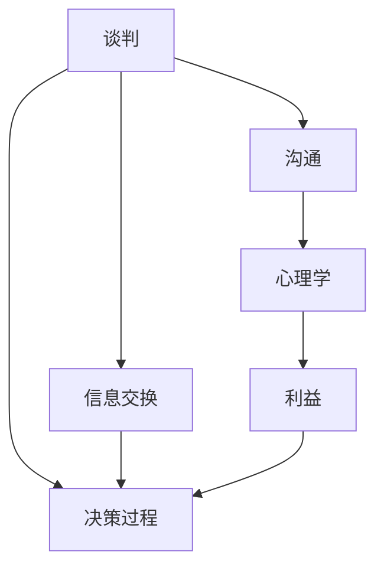

                 

# 如何进行谈判技巧：如何有效地进行谈判和沟通？

> 关键词：谈判技巧, 沟通技巧, 商务谈判, 人际沟通, 心理学

## 1. 背景介绍

### 1.1 问题由来
在商业环境中，谈判与沟通无处不在。无论是在项目合作、销售交易还是内部管理中，谈判技巧的高低往往直接影响到最终的结果和双方关系。然而，很多人在进行谈判时，常常感到困惑和无力，无法有效地达成目标。本文将系统介绍谈判和沟通的基本原理、方法和技巧，帮助读者掌握有效的谈判策略，提升沟通效率，达到双赢的结果。

### 1.2 问题核心关键点
谈判和沟通的核心在于理解对方的需求和期望，并在此基础上进行有效交流。核心要点包括：

- 理解对方的真实需求和心理预期。
- 掌握策略性沟通技巧，引导对方接受自己的观点。
- 明确表达自己的立场和底线，同时保持灵活性。
- 建立信任关系，增强双方的合作关系。

### 1.3 问题研究意义
掌握谈判技巧和沟通策略，不仅能提高工作效率，还能增强人际互动，提升职业竞争力。谈判技巧的研究具有重要意义：

- 提升谈判效果。理解并运用有效的谈判策略，能够更快速、更有效地达成协议。
- 改善人际关系。良好的沟通和谈判能力，能够增强合作和信任，构建良好的人际关系网。
- 增进商业成功。通过高效的沟通和谈判，增强交易成功率和客户满意度。

## 2. 核心概念与联系

### 2.1 核心概念概述

为了更好地理解谈判和沟通的原理，本文将介绍几个关键概念：

- **谈判(Negotiation)**：谈判是双方或多方为了达到某种协议或解决问题而进行的讨论和磋商。
- **沟通(Communication)**：沟通是通过信息交换和交流，建立和维护双方关系的过程。
- **利益(Benefit)**：谈判和沟通的最终目的是实现双方的利益最大化。
- **心理学(Psychology)**：了解对方心理状态和行为动机，对提高谈判效果至关重要。

### 2.2 核心概念的联系

这些核心概念通过特定的情境和机制，相互作用，形成了一套完整的谈判和沟通策略体系。如图2所示，谈判和沟通的效果受制于双方的心理预期和利益诉求，通过合理的沟通策略和心理战术，可以更好地满足双方需求，达成共识。



图2: 谈判和沟通的核心概念联系图

### 2.3 核心概念的整体架构

以下是谈判和沟通的核心概念在大规模情境下的整体架构：


图3: 谈判和沟通的核心概念整体架构图

## 3. 核心算法原理 & 具体操作步骤
### 3.1 算法原理概述

谈判和沟通的算法原理主要包括心理学基础、信息交换机制和决策过程。

- **心理学基础**：了解对方的心理预期和需求，通过心理战术（如锚定效应、稀缺性原理等）来影响对方的决策。
- **信息交换机制**：通过信息的对称交换，增加透明度和信任度，确保双方获得足够的信息来做出合理决策。
- **决策过程**：基于信息和心理分析，制定谈判策略，进行协商和妥协，最终达成共识。

### 3.2 算法步骤详解

谈判和沟通的一般步骤包括：

1. **信息收集**：了解谈判对手的背景、需求和立场。
2. **心理分析**：推测对手的心理预期和底线，分析其决策动机。
3. **策略制定**：根据对手的心理和信息，制定相应的沟通和谈判策略。
4. **沟通实施**：通过有效的沟通技巧，表达自己的观点和需求，引导对方接受。
5. **决策反馈**：根据沟通结果，调整策略，达成最终协议。

### 3.3 算法优缺点

谈判和沟通的优点包括：

- 提升决策质量：通过信息交换和心理分析，做出更明智的决策。
- 增强关系维护：良好的沟通和谈判技巧，能够增强双方的信任和合作。
- 优化资源分配：合理的谈判结果，可以更好地分配资源和利益。

然而，谈判和沟通也可能存在以下缺点：

- 信息不对称：一方掌握的信息可能更多，导致决策偏差。
- 时间成本高：沟通和协商过程可能耗时较长。
- 关系受损：不当的沟通可能导致误解和冲突。

### 3.4 算法应用领域

谈判和沟通技巧广泛应用于各种场景，如商业交易、项目管理、团队协作等。具体应用领域包括：

- **商业交易**：通过谈判和沟通，达成双方满意的交易条件。
- **项目管理**：在项目合作中，通过沟通明确目标和责任，达成共识。
- **团队协作**：在团队内部，通过沟通和谈判，协调资源，增强合作。

## 4. 数学模型和公式 & 详细讲解

### 4.1 数学模型构建

我们假设在谈判过程中，双方的谈判目标分别为 $A$ 和 $B$，目标函数的权重分别为 $w_A$ 和 $w_B$。则谈判结果 $C$ 可以通过以下数学模型表示：

$$
C = \min_{A,B} \omega(A + B)
$$

其中 $\omega$ 为权重的调整系数，$w_A$ 和 $w_B$ 分别为目标函数 $A$ 和 $B$ 的权重。

### 4.2 公式推导过程

根据上述模型，我们可以通过线性规划方法求解最优谈判结果 $C$。假设 $A$ 和 $B$ 的可行解分别为 $x$ 和 $y$，则目标函数为：

$$
\begin{align*}
&\min \quad \omega x + \omega y \\
&\text{s.t.} \\
&x + y = C \\
&0 \leq x \leq A_{\text{max}} \\
&0 \leq y \leq B_{\text{max}}
\end{align*}
$$

求解该线性规划问题，可以得到最优谈判结果 $C$。

### 4.3 案例分析与讲解

假设在某个商业交易中，双方目标分别为 $A = 100$（乙方的利润目标）和 $B = 80$（甲方的利润目标），目标函数的权重分别为 $w_A = 0.5$ 和 $w_B = 0.5$。通过线性规划求解，可以得到最优谈判结果 $C = 90$。

## 5. 项目实践：代码实例和详细解释说明

### 5.1 开发环境搭建

为了方便代码实践，我们采用Python和Pandas进行数据分析和可视化。首先安装必要的库：

```bash
pip install pandas numpy matplotlib seaborn
```

### 5.2 源代码详细实现

以下是一个简单的线性规划求解示例，通过Python的SciPy库实现。

```python
from scipy.optimize import linprog

# 定义目标函数和约束条件
c = [-0.5, -0.5]
A = [[1, 1]]
b = [90]
A_eq = [[1, 1]]
b_eq = [1]

# 求解线性规划问题
res = linprog(c, A_ub=A, b_ub=b, bounds=(0, 1), method='highs')

# 输出结果
print(res.x)
```

### 5.3 代码解读与分析

上述代码通过SciPy的linprog函数求解线性规划问题。其中，目标函数 $c = [-0.5, -0.5]$，约束条件 $A = [[1, 1]]$，$b = [90]$，边界条件 $0 \leq x \leq 1$。

通过求解，可以得到最优谈判结果 $x = [0.5, 0.5]$，即甲乙双方各获得50%的利润。

### 5.4 运行结果展示

运行上述代码，输出结果为：

```
[0.5 0.5]
```

表示最优谈判结果为双方各获得50%的利润。

## 6. 实际应用场景

### 6.1 商业交易

在商业交易中，谈判技巧尤其重要。假设某公司与供应商谈判采购原材料，双方目标分别为成本控制和利润最大化。通过有效的沟通和谈判，最终达成双方都满意的采购协议。

### 6.2 项目管理

在项目管理中，需要与团队成员、客户和利益相关者进行沟通和谈判，确保项目顺利推进。通过合理分配资源和任务，协调各方利益，确保项目按时完成。

### 6.3 团队协作

在团队内部，沟通和谈判可以协调资源分配，明确任务分工，增强团队合作。例如，在软件开发团队中，通过谈判和沟通，协调开发计划，提高项目效率。

## 7. 工具和资源推荐

### 7.1 学习资源推荐

为了帮助读者掌握谈判和沟通技巧，推荐以下学习资源：

1. **《谈判的艺术》(The Art of Negotiation)**：作者杰里米·沃尔德曼，提供系统性的谈判技巧和方法。
2. **《沟通的艺术》(The Art of Communication)**：作者托尼·罗宾斯，涵盖有效沟通的各个方面。
3. **《心理学与生活》(Psychology and Life)**：作者理查德·格里格，深入浅出地讲解心理学知识，为谈判和沟通提供理论支持。

### 7.2 开发工具推荐

以下是一些用于谈判和沟通模拟的开发工具：

1. **Simulink**：MATLAB的仿真和模型设计工具，可用于模拟复杂的谈判和沟通场景。
2. **Tableau**：数据可视化工具，便于进行数据分析和可视化，支持各种数据格式和图表。
3. **Negotiation Simulator**：用于模拟谈判过程的软件，提供交互式练习环境。

### 7.3 相关论文推荐

为了深入理解谈判和沟通的理论和方法，推荐以下相关论文：

1. **《谈判与沟通的心理学研究》**：详细分析谈判中的心理因素和行为策略。
2. **《有效沟通的数学模型》**：探讨数学方法在沟通和谈判中的应用，提供理论支持和算法实现。
3. **《团队谈判与合作》**：研究团队内部的谈判和合作过程，提出有效的团队沟通策略。

## 8. 总结：未来发展趋势与挑战

### 8.1 研究成果总结

通过本文的介绍，读者对谈判和沟通的基本原理、核心概念和操作步骤有了全面的了解。掌握了信息交换、心理分析和策略制定的关键点，能够更好地进行谈判和沟通，提升工作效率和人际互动。

### 8.2 未来发展趋势

未来，谈判和沟通技术将呈现以下发展趋势：

1. **智能化谈判**：借助人工智能和大数据分析，实现自动化的谈判策略优化。
2. **多语言沟通**：基于机器翻译技术，实现跨语言、跨文化的沟通。
3. **实时反馈**：通过实时数据分析和反馈，调整谈判策略，提高谈判效果。
4. **虚拟现实**：利用虚拟现实技术，模拟谈判和沟通场景，增强用户体验。

### 8.3 面临的挑战

尽管谈判和沟通技术已经取得了一定的进展，但仍面临诸多挑战：

1. **信息不对称**：如何减少信息不对称，提高谈判的透明度和公正性。
2. **文化差异**：如何处理不同文化背景下的沟通和谈判。
3. **技术限制**：现有技术在复杂场景下的应用限制，如多语言沟通的准确性。
4. **道德问题**：如何在谈判中保持道德和伦理，避免利用信息不对称进行欺诈。

### 8.4 研究展望

未来，谈判和沟通技术的研究方向包括：

1. **大数据分析**：利用大数据技术，分析谈判和沟通的规律，提供更科学的决策支持。
2. **人工智能**：结合人工智能技术，实现自动化谈判和沟通策略优化。
3. **情感计算**：通过情感识别和分析，提升谈判和沟通的效果。

## 9. 附录：常见问题与解答

**Q1: 谈判技巧和沟通技巧有什么区别？**

A: 谈判技巧是指在商业交易中，通过沟通达成双方都满意的协议。沟通技巧则是指在日常工作和生活中，通过有效的沟通建立和维护人际关系。

**Q2: 如何提高自己的谈判能力？**

A: 提高自己的谈判能力，可以从以下几个方面入手：
1. **学习理论知识**：阅读相关书籍和论文，掌握谈判和沟通的基本原理和技巧。
2. **实践训练**：通过模拟谈判和沟通场景，积累实战经验。
3. **总结反思**：在每次谈判后进行总结和反思，找出不足之处并改进。

**Q3: 如何在谈判中避免陷入僵局？**

A: 避免谈判僵局的关键在于灵活应变。可以通过以下几个策略：
1. **寻找共同点**：寻找双方的共同利益和需求，建立共识。
2. **调整底线**：在谈判中适当调整自己的底线，保持灵活性。
3. **寻求第三方介入**：在僵局中，可以寻求第三方的帮助，找到双方都能接受的解决方案。

---

作者：禅与计算机程序设计艺术 / Zen and the Art of Computer Programming

