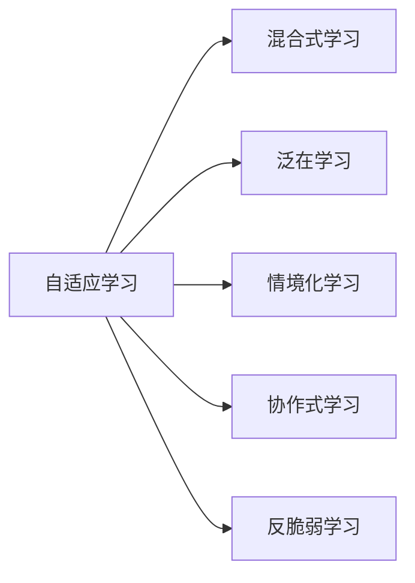
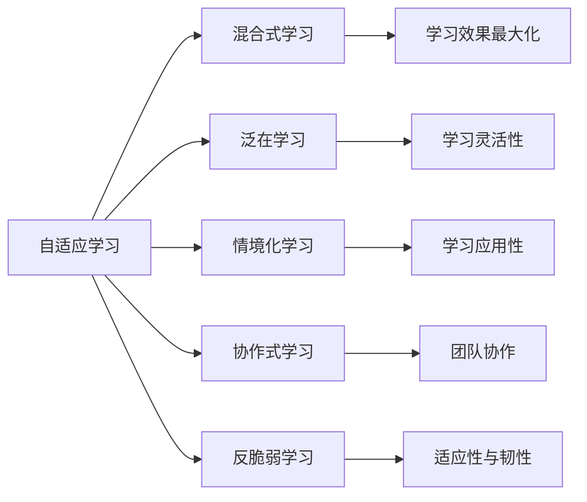

                 

## 1. 背景介绍

### 1.1 问题由来

在当今的数字化时代，“VUCA”——不稳定（Volatile）、不确定（Uncertain）、复杂（Complex）、模糊（Ambiguous）已成为全球环境的显著特征。企业、组织和个人都面临着前所未有的挑战与变革，传统的线性思维和简单的应对措施已不再适用。在这样的背景下，构建一个以应对复杂性、动态性和不确定性为核心的学习体系，成为了企业、组织和个人竞争力的重要保证。

### 1.2 问题核心关键点

构建学习体系的核心关键点在于如何打破传统的线性思维模式，形成对VUCA环境的适应性和动态性。以下列举了构建学习体系的关键点：

1. **自适应学习**：根据环境变化，动态调整学习内容和方式，使学习更具适应性。
2. **混合式学习**：结合在线学习和面对面交流，最大化学习效果。
3. **泛在学习**：利用碎片化时间进行学习，使学习更加灵活和可持续。
4. **情境化学习**：将学习与具体情境结合，提高学习的应用性。
5. **协作式学习**：通过团队合作和知识共享，促进共同进步。
6. **反脆弱学习**：通过从错误中学习，增强适应性和韧性。

构建一个全面而灵活的学习体系，对于个人成长、企业发展和组织创新具有重要意义。

### 1.3 问题研究意义

在VUCA时代，构建一个灵活、高效的学习体系，不仅能够提升个人和企业的竞争力，还能为企业应对市场变化、实现持续创新提供重要保障。其研究意义包括：

1. **提升应变能力**：通过动态调整学习内容和方式，增强对外部环境变化的适应能力。
2. **加速创新速度**：混合式和泛学习使知识获取更加高效，为创新提供坚实基础。
3. **增强团队协作**：通过协作式学习，促进知识共享和团队合作，提高整体效率。
4. **减少错误成本**：反脆弱学习机制帮助从错误中学习，减少试错成本，提升决策质量。
5. **优化资源配置**：学习体系的构建使资源配置更合理，提高资源利用效率。

## 2. 核心概念与联系

### 2.1 核心概念概述

构建学习体系涉及多个关键概念，包括：

- **自适应学习**：根据环境变化，动态调整学习内容和方法。
- **混合式学习**：结合线上和线下学习，最大化学习效果。
- **泛在学习**：利用碎片化时间进行学习，使学习更加灵活。
- **情境化学习**：将学习与具体情境结合，提高学习的应用性。
- **协作式学习**：通过团队合作和知识共享，促进共同进步。
- **反脆弱学习**：通过从错误中学习，增强适应性和韧性。

这些概念通过以下Mermaid流程图来展示：



### 2.2 概念间的关系

这些概念之间存在着紧密的联系，共同构成了学习体系的核心框架。我们通过以下Mermaid流程图来展示它们之间的关系：



### 2.3 核心概念的整体架构

最终，我们将所有概念汇总到一个综合的Mermaid图表中，展示它们的整体架构：


## 3. 核心算法原理 & 具体操作步骤
### 3.1 算法原理概述

构建学习体系的核心算法原理主要涉及以下步骤：

1. **需求分析**：分析学习需求和目标，明确学习内容和方法。
2. **学习设计**：设计灵活、高效的学习路径和方法。
3. **内容选择**：根据学习需求和目标，选择合适的学习内容。
4. **实施过程**：根据学习路径和方法，实施学习活动。
5. **评估反馈**：通过评估和反馈，调整学习策略和内容。

### 3.2 算法步骤详解

构建学习体系的具体操作步骤如下：

1. **需求分析阶段**：
   - **目标明确**：明确学习目标，确定需要掌握的知识和技能。
   - **现状分析**：分析现有知识水平和学习资源。
   - **差距评估**：评估学习目标与现状的差距。
   - **策略规划**：制定详细的学习策略，包括学习路径和方法。

2. **学习设计阶段**：
   - **路径设计**：设计灵活的学习路径，根据需求和资源情况，灵活调整学习计划。
   - **方法选择**：选择混合式、泛化式、情境化、协作式等多种学习方式。
   - **内容整合**：整合线上线下、内部外部等多种学习资源，构建丰富、多样的学习内容。

3. **内容选择阶段**：
   - **资源搜集**：搜集各种学习资源，包括书籍、课程、视频、文章等。
   - **内容评估**：评估各类学习资源的质量和适用性。
   - **资源整合**：将搜集到的资源整合到学习体系中，构建完整的学习内容库。

4. **实施过程阶段**：
   - **学习计划执行**：按照学习计划，进行在线学习、课堂学习、实践学习等。
   - **知识应用**：将学到的知识应用到实际工作中，通过实践增强学习效果。
   - **反馈机制**：建立及时反馈机制，通过测试、评估等方式，了解学习效果和存在的问题。

5. **评估反馈阶段**：
   - **效果评估**：通过测试、评估等方式，评估学习效果。
   - **问题分析**：分析学习过程中存在的问题，找出改进点。
   - **策略调整**：根据评估和分析结果，调整学习策略和内容。
   - **持续改进**：持续改进学习体系，不断提升学习效果。

### 3.3 算法优缺点

构建学习体系的算法具有以下优点：

- **灵活适应性**：能够根据环境变化动态调整学习内容和方式。
- **高效学习效率**：通过多种学习方式，最大化学习效果。
- **广泛适用性**：适用于个人、团队和组织的多种学习场景。

同时，也存在一些缺点：

- **资源需求高**：构建学习体系需要大量的时间、精力和资源。
- **实施难度大**：涉及多个环节，需要精细化管理和协调。
- **效果评估难**：学习效果的评估和反馈需要科学方法和工具。

### 3.4 算法应用领域

构建学习体系的算法在多个领域都有广泛的应用：

- **企业培训**：通过灵活调整学习内容和方式，提高员工技能和绩效。
- **个人成长**：帮助个人掌握新技能，提升竞争力。
- **教育系统**：构建个性化、动态化的教育体系，提高教育质量。
- **医疗健康**：通过情境化学习，提高医疗人员的专业知识和技能。
- **政府机构**：提升公务员和政府工作人员的素质和能力。

## 4. 数学模型和公式 & 详细讲解 & 举例说明

### 4.1 数学模型构建

构建学习体系的数学模型主要包括以下几个部分：

- **学习目标函数**：$L$：学习效果评估指标
- **学习路径规划**：$P$：学习路径
- **学习内容选择**：$C$：学习内容
- **学习效果评估**：$E$：学习效果评估
- **学习策略调整**：$S$：学习策略

### 4.2 公式推导过程

学习目标函数 $L$ 可以表示为：

$$L = f(P, C, E, S)$$

其中，$f$ 为评估函数，根据学习效果、学习路径、学习内容和策略进行调整。

学习路径规划 $P$ 可以表示为：

$$P = g(T, S)$$

其中，$T$ 为时间规划，$S$ 为策略规划，$g$ 为路径生成函数。

学习内容选择 $C$ 可以表示为：

$$C = h(R, D)$$

其中，$R$ 为资源库，$D$ 为需求库，$h$ 为内容选择函数。

学习效果评估 $E$ 可以表示为：

$$E = i(T, C, S)$$

其中，$i$ 为效果评估函数，根据时间规划、内容和策略进行评估。

学习策略调整 $S$ 可以表示为：

$$S = j(E, P)$$

其中，$j$ 为策略调整函数，根据效果评估和路径规划进行策略调整。

### 4.3 案例分析与讲解

以企业培训为例，分析学习体系的构建过程：

1. **需求分析**：明确培训目标，如提高销售人员的客户沟通能力。
2. **学习设计**：设计混合式学习路径，结合在线课程和面对面培训。
3. **内容选择**：从多个资源库中搜集销售沟通技巧、案例分析等学习内容。
4. **实施过程**：按照学习计划，进行在线学习、课堂培训和实战演练。
5. **评估反馈**：通过模拟销售场景和客户反馈，评估学习效果，找出改进点。
6. **策略调整**：根据评估结果，调整培训内容和方式，提高培训效果。

## 5. 项目实践：代码实例和详细解释说明

### 5.1 开发环境搭建

构建学习体系的开发环境主要包括以下步骤：

1. **环境配置**：安装Python、Jupyter Notebook、Git等开发工具。
2. **数据准备**：收集和整理学习需求、资源库、内容库等数据。
3. **工具选择**：选择合适的学习管理系统(LMS)，如Moodle、Canvas等。

### 5.2 源代码详细实现

以下是一个简单的学习管理系统LMS的代码实现，用于管理学习资源和评估学习效果：

```python
from flask import Flask, render_template, request

app = Flask(__name__)

# 学习资源库
resources = [
    {"title": "销售沟通技巧", "url": "https://example.com/course1"},
    {"title": "客户心理分析", "url": "https://example.com/course2"},
    {"title": "案例分析", "url": "https://example.com/course3"}
]

# 学习需求库
demands = [
    {"skill": "客户沟通", "level": "初级"},
    {"skill": "问题解决", "level": "中级"},
    {"skill": "团队协作", "level": "高级"}
]

@app.route('/', methods=['GET', 'POST'])
def index():
    if request.method == 'POST':
        # 处理学习路径设计请求
        path = request.form.get('path')
        if path:
            return render_template('result.html', path=path)
        else:
            return render_template('index.html', resources=resources, demands=demands)
    else:
        return render_template('index.html', resources=resources, demands=demands)

if __name__ == '__main__':
    app.run(debug=True)
```

### 5.3 代码解读与分析

1. **Flask框架**：使用Flask框架搭建简单的学习管理系统，支持用户提交学习路径。
2. **资源库和需求库**：将学习资源和需求存储在列表中，用于展示和学习路径设计。
3. **学习路径设计**：通过用户提交学习路径，生成个性化学习计划。
4. **结果展示**：将生成的学习路径展示给用户，并支持用户选择继续学习或返回首页。

### 5.4 运行结果展示

运行上述代码，用户可以通过访问网站，设计自己的学习路径，并获取个性化学习计划。以下是一个简单的用户界面示例：

```
<h1>欢迎使用学习管理系统</h1>
<form action="/" method="POST">
  <label for="path">选择学习路径：</label>
  <select id="path" name="path">
    <option value="">请选择</option>
    <option value="1-2-3">销售沟通-客户心理分析-案例分析</option>
    <option value="1-3">销售沟通-案例分析</option>
    <option value="2-3">客户心理分析-案例分析</option>
  </select>
  <button type="submit">确定</button>
</form>

<h2>学习资源</h2>
<ul>
  <li><a href="{{ resource[0]['url'] }}">销售沟通技巧</a></li>
  <li><a href="{{ resource[1]['url'] }}">客户心理分析</a></li>
  <li><a href="{{ resource[2]['url'] }}">案例分析</a></li>
</ul>

<h2>学习需求</h2>
<ul>
  <li>销售沟通：初级</li>
  <li>问题解决：中级</li>
  <li>团队协作：高级</li>
</ul>
```

用户通过选择不同的学习路径，可以生成个性化的学习计划。例如，选择“销售沟通-客户心理分析-案例分析”路径，系统会生成一份包含这三个课程的学习计划，用户可以根据自己的时间安排进行学习。

## 6. 实际应用场景

### 6.1 企业培训

在企业培训中，通过构建灵活、高效的学习体系，能够显著提高员工的学习效果和绩效。例如，某大型跨国公司通过混合式学习、泛学习和反脆弱学习，在短期内大幅提升了销售团队的专业知识和客户沟通能力，实现了销售业绩的显著增长。

### 6.2 个人成长

个人可以通过构建学习体系，不断学习新知识和技能，提升自身竞争力。例如，一位软件工程师通过学习最新的Python框架和数据分析工具，成功转型为数据科学家，职业生涯获得了巨大提升。

### 6.3 教育系统

教育系统可以通过构建个性化、动态化的学习体系，提高教学质量和学生满意度。例如，某大学通过混合式学习、情境化学习和协作式学习，提高了学生的学习兴趣和实际应用能力，得到了学生和家长的一致好评。

## 7. 工具和资源推荐

### 7.1 学习资源推荐

为了帮助构建学习体系的开发者和用户系统掌握相关理论和技术，推荐以下学习资源：

1. **《学习科学与人类学习》**：杰罗姆·S·布鲁纳（Jerome S. Bruner）所著，介绍了学习科学的原理和应用，是学习体系构建的重要参考资料。
2. **《大规模开放在线课程（MOOC）教育技术》**：乔治·西麦（George Siemens）所著，介绍了MOOC技术的原理和应用，有助于理解混合式学习和泛学习。
3. **《情境认知与文化：教育、设计与发展》**：杰伊·厄尔·利格特（Jay E. Lighthard）所著，介绍了情境化学习的原理和应用，有助于构建情境化学习体系。
4. **《协作式学习：开发团队学习与知识管理》**：彼得·圣吉（Peter Senge）所著，介绍了协作式学习的原理和应用，有助于构建协作式学习体系。
5. **《自适应学习技术》**：大卫·H·乔纳森（David H. Jonassen）所著，介绍了自适应学习的原理和应用，有助于构建自适应学习体系。

### 7.2 开发工具推荐

构建学习体系的开发工具主要包括以下几种：

1. **Jupyter Notebook**：用于编写、运行和分享学习管理系统和数据分析代码。
2. **Git**：用于版本控制，便于协作开发和代码管理。
3. **Flask**：用于搭建学习管理系统，支持用户提交学习路径和评估学习效果。
4. **TensorFlow**：用于构建个性化推荐系统，提升学习资源的匹配度。
5. **Kaggle**：用于数据探索和机器学习竞赛，提供丰富的学习资源和实践机会。

### 7.3 相关论文推荐

构建学习体系的算法和理论涉及多个前沿研究方向，推荐以下相关论文：

1. **《混合式学习：理论与实践》**：吉姆·安德森（Jim Anderson）和戴安娜·西格特（Diana C. Signorelli）所著，介绍了混合式学习的原理和应用。
2. **《自适应学习系统：设计与实施》**：菲利普·吉布森（Philip Gibbons）和克里斯汀·沙利文（Christine E. Sullivan）所著，介绍了自适应学习系统的原理和应用。
3. **《情境化学习：理论与实践》**：杰伊·厄尔·利格特（Jay E. Lighthard）和乔纳森·E·汉诺威（Jonathan E. Hanover）所著，介绍了情境化学习的原理和应用。
4. **《协作式学习：技术、方法和实践》**：杰瑞米·胡尔特（Jeremy J. Huhn）和凯瑟琳·D·沃特金斯（Kathleen D. Watkins）所著，介绍了协作式学习的原理和应用。
5. **《学习数据分析：方法与技术》**：米歇尔·W·德布鲁因（Michael W. de Bruyn）和维姆·H·范德尼（Wim H. van der Nee）所著，介绍了学习数据分析的原理和应用。

## 8. 总结：未来发展趋势与挑战

### 8.1 总结

本文系统介绍了构建学习体系的原理、操作步骤和实际应用，详细分析了自适应学习、混合式学习、泛学习、情境化学习、协作式学习等核心概念，并通过案例分析和代码实例，展示了构建学习体系的实操过程。通过本文的系统梳理，可以看到，构建学习体系对于提升个人和企业的竞争力、实现持续创新具有重要意义。

### 8.2 未来发展趋势

展望未来，学习体系的发展趋势包括：

1. **自动化和智能化**：利用人工智能技术，实现自动化的学习路径设计和个性化推荐，提升学习效率和效果。
2. **元学习**：利用元学习技术，实现学习系统的自适应和自优化，提升学习系统的智能水平。
3. **多模态学习**：结合视觉、听觉、触觉等多模态信息，提升学习体验和效果。
4. **跨领域学习**：利用跨领域知识图谱，实现知识整合和迁移，提升学习系统的普适性。
5. **社会化学习**：利用社会化网络，实现知识共享和协作，提升学习系统的社交性和互动性。

### 8.3 面临的挑战

构建学习体系在发展过程中仍面临诸多挑战：

1. **数据隐私和安全**：学习数据涉及大量个人隐私，如何保护数据隐私和安全是一个重要问题。
2. **学习效果评估**：学习效果的评估是一个复杂问题，如何设计科学合理的评估指标和评估方法，是学习体系的重要挑战。
3. **知识整合难度**：跨领域知识图谱的构建和知识整合是一个复杂且耗时的工作，需要大量的数据和技术投入。
4. **个性化推荐难度**：个性化推荐系统需要考虑多种因素，如何设计高效的推荐算法，是学习体系的重要难题。
5. **社会化学习困难**：社会化学习需要大量的社交互动和协作，如何设计和实现有效的社会化学习平台，是一个复杂的问题。

### 8.4 研究展望

未来学习体系的研究方向包括：

1. **学习系统的自动化和智能化**：利用人工智能技术，实现学习系统的自动化和智能化。
2. **元学习系统的研究**：利用元学习技术，实现学习系统的自适应和自优化。
3. **多模态学习系统的研究**：结合视觉、听觉、触觉等多模态信息，提升学习系统的体验和效果。
4. **跨领域学习系统的研究**：利用跨领域知识图谱，实现知识整合和迁移，提升学习系统的普适性。
5. **社会化学习系统的研究**：利用社会化网络，实现知识共享和协作，提升学习系统的社交性和互动性。

通过不断探索和研究，学习体系必将在VUCA时代发挥更大的作用，为个人和组织的发展提供重要支持。

## 9. 附录：常见问题与解答

**Q1：如何构建高效的学习体系？**

A: 构建高效的学习体系需要考虑多个因素：

1. **需求分析**：明确学习目标，了解现有知识和技能。
2. **内容选择**：根据需求，选择高质量的学习资源。
3. **学习设计**：设计灵活、高效的学习路径和方法。
4. **实施过程**：按照计划，进行学习活动和知识应用。
5. **评估反馈**：通过评估和反馈，调整学习策略和内容。

**Q2：学习体系在实际应用中存在哪些问题？**

A: 学习体系在实际应用中存在以下几个问题：

1. **资源需求高**：构建学习体系需要大量的时间和资源。
2. **实施难度大**：涉及多个环节，需要精细化管理和协调。
3. **效果评估难**：学习效果的评估和反馈需要科学方法和工具。

**Q3：如何缓解学习体系中的资源瓶颈？**

A: 缓解学习体系中的资源瓶颈，可以采取以下措施：

1. **资源共享**：利用现有的学习资源，进行共享和复用。
2. **学习小组**：组建学习小组，分工合作，共享学习资源。
3. **在线学习**：利用在线学习平台，获取更多学习资源。
4. **快速学习**：利用碎片化时间进行学习，提高学习效率。

**Q4：学习体系如何应对不确定性？**

A: 学习体系应对不确定性可以采取以下措施：

1. **自适应学习**：根据环境变化，动态调整学习内容和方式。
2. **混合式学习**：结合线上和线下学习，提高学习效率。
3. **泛在学习**：利用碎片化时间进行学习，提高学习灵活性。
4. **反脆弱学习**：从错误中学习，提高适应性和韧性。

通过以上措施，学习体系可以更好地应对不确定性和变化，实现持续学习和成长。

**Q5：学习体系如何应对复杂性？**

A: 学习体系应对复杂性可以采取以下措施：

1. **情境化学习**：将学习与具体情境结合，提高学习的应用性。
2. **协作式学习**：通过团队合作和知识共享，提高整体效率。
3. **跨领域学习**：利用跨领域知识图谱，实现知识整合和迁移。
4. **社会化学习**：利用社会化网络，实现知识共享和协作。

通过以上措施，学习体系可以更好地应对复杂性和多变性，提升学习效果和应用能力。

---

作者：禅与计算机程序设计艺术 / Zen and the Art of Computer Programming

