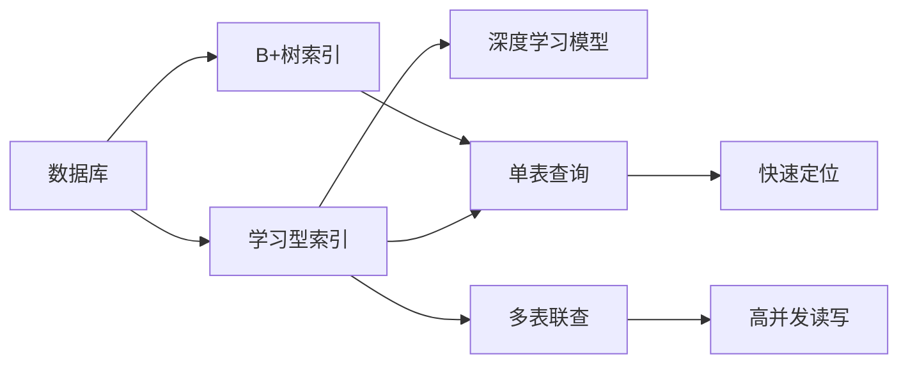
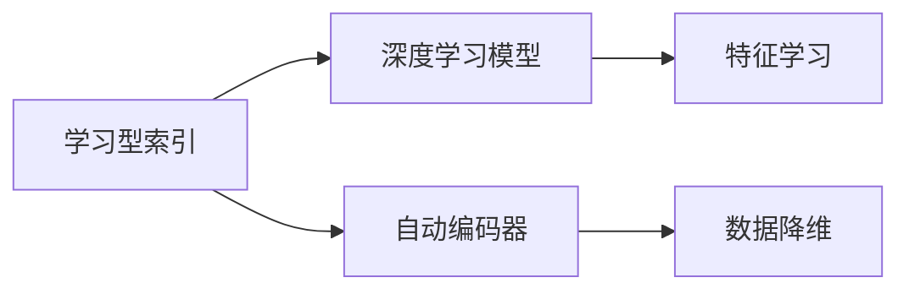
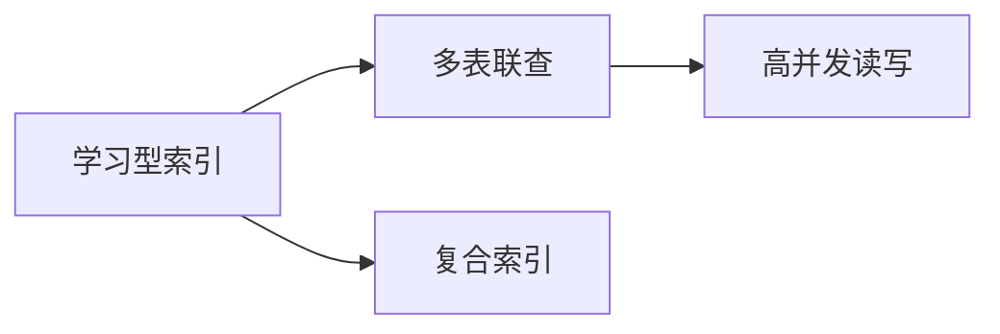
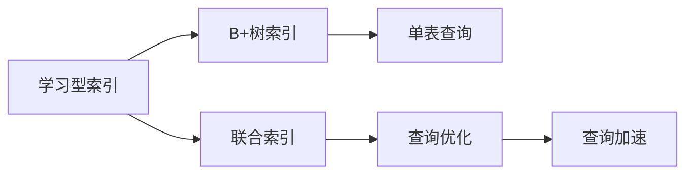

                 

## 1. 背景介绍

在当今大数据时代，数据存储和查询是任何信息化应用的基础。传统的关系型数据库，如MySQL、PostgreSQL等，由于其结构化和严谨的数据模型，在多维度查询、事务处理等方面表现出色，深受企业和研究者的青睐。然而，随着数据量的爆炸性增长，关系型数据库面临的挑战也在日益增加。比如，在查询速度上，传统的基于B+树索引的结构虽然能够处理单表查询，但在复杂的多表联查场景下，性能仍然难以满足需求。此外，随着物联网等新兴应用的普及，高并发读写的场景也越来越常见，传统数据库的性能瓶颈也逐渐显现。

为应对这些挑战，数据库领域出现了一种新型的索引结构——学习型索引（Learning Index）。学习型索引通过融合深度学习模型，能够显著提升数据库的查询效率，尤其是在多表联查等复杂场景下。本文将从背景、原理、实现、应用场景等多个方面，全面介绍学习型索引的核心概念与技术，并通过代码实例，展示其具体的应用方法。

## 2. 核心概念与联系

### 2.1 核心概念概述

为了更好地理解学习型索引的原理与实现，我们首先介绍几个核心概念：

1. **B+树索引**：关系型数据库中常见的索引结构，支持快速定位记录，是查询性能的基石。
2. **学习型索引**：一种新型索引结构，通过融合深度学习模型，提升查询速度和效率。
3. **深度学习模型**：基于神经网络的模型，具有强大的特征学习能力，可以适应各种复杂的查询模式。
4. **自动编码器**：一种深度学习模型，能够将高维数据映射到低维空间，减少计算复杂度。
5. **多表联查**：在关系型数据库中，多表联合查询是常见的操作，例如左连接、右连接、内连接等。

这些概念之间的联系可以通过以下Mermaid流程图来展示：



这个流程图展示了学习型索引的核心概念及其之间的联系：

1. 数据库通过B+树索引进行单表查询，快速定位记录。
2. 学习型索引融合了深度学习模型，提升了多表联查等复杂查询的效率。
3. 深度学习模型通过自动编码器等技术，将高维数据映射到低维空间，减少了计算复杂度。
4. 学习型索引能够适应高并发读写，提升数据库的整体性能。

### 2.2 概念间的关系

这些核心概念之间的联系更加紧密，形成了一个完整的学习型索引系统。我们通过以下几个Mermaid流程图来展示这些概念的关系。

#### 2.2.1 学习型索引与深度学习模型的关系



这个流程图展示了学习型索引与深度学习模型之间的关系：

1. 学习型索引通过融合深度学习模型，提升了查询效率。
2. 深度学习模型通过自动编码器等技术，将高维数据映射到低维空间，减少了计算复杂度。
3. 学习型索引融合深度学习模型后，能够更好地处理复杂查询，提升查询速度。

#### 2.2.2 学习型索引与多表联查的关系



这个流程图展示了学习型索引与多表联查之间的关系：

1. 学习型索引能够适应高并发读写，提升多表联查的效率。
2. 学习型索引通过复合索引技术，能够同时处理多个表的数据，提升查询性能。
3. 学习型索引融合了深度学习模型，能够更好地处理复杂查询，提升查询速度。

#### 2.2.3 学习型索引与B+树索引的关系



这个流程图展示了学习型索引与B+树索引之间的关系：

1. 学习型索引与B+树索引结合，能够提升查询性能。
2. 学习型索引通过联合索引技术，能够同时处理多个表的数据，提升查询性能。
3. 学习型索引融合深度学习模型后，能够更好地处理复杂查询，提升查询速度。

## 3. 核心算法原理 & 具体操作步骤

### 3.1 算法原理概述

学习型索引通过深度学习模型对查询模式进行建模，提升查询效率。具体而言，它利用自动编码器等技术，将高维的查询条件映射到低维空间，然后通过训练学习模型，使其能够快速预测查询结果。学习型索引的算法原理主要包括以下几个步骤：

1. **数据预处理**：将查询条件和数据样本进行编码，转换为深度学习模型可以处理的形式。
2. **模型训练**：使用历史查询和数据样本训练深度学习模型，使其能够预测查询结果。
3. **查询优化**：在查询时，使用训练好的模型对查询条件进行编码，并预测结果。
4. **查询加速**：通过联合索引和B+树索引等技术，加速查询过程。

### 3.2 算法步骤详解

#### 3.2.1 数据预处理

数据预处理是学习型索引的第一步，其目的是将查询条件和数据样本转换为深度学习模型可以处理的形式。具体而言，我们将查询条件和数据样本进行编码，并输入到自动编码器中进行降维。

自动编码器是一种无监督学习模型，它通过将高维数据映射到低维空间，减少计算复杂度。自动编码器的工作原理可以简单地描述为：

1. **编码**：将高维数据压缩到低维空间。
2. **解码**：将低维数据重构回高维空间，尽可能保留原始数据的特征。

在实际应用中，我们可以使用多层感知器（MLP）、卷积神经网络（CNN）等深度学习模型作为自动编码器，对查询条件和数据样本进行编码和解码。

#### 3.2.2 模型训练

模型训练是学习型索引的核心步骤，其目的是通过训练深度学习模型，使其能够预测查询结果。具体而言，我们使用历史查询和数据样本训练深度学习模型，使其能够学习到查询模式和数据特征之间的关系。

在训练过程中，我们可以使用反向传播算法，通过梯度下降等优化算法更新模型参数，最小化预测误差。训练完成的深度学习模型可以用于预测新查询的执行结果。

#### 3.2.3 查询优化

查询优化是学习型索引的重要环节，其目的是在查询时快速定位数据记录，提升查询效率。具体而言，我们将查询条件输入到训练好的深度学习模型中，通过自动编码器将其转换为低维空间，然后使用模型进行预测，得到查询结果。

#### 3.2.4 查询加速

查询加速是学习型索引的最终目标，其目的是通过联合索引和B+树索引等技术，加速查询过程。具体而言，我们可以使用联合索引技术，将多个表的索引合并在一起，提高查询效率。同时，我们可以结合B+树索引，快速定位数据记录，进一步提升查询速度。

### 3.3 算法优缺点

学习型索引具有以下几个优点：

1. **高效查询**：通过融合深度学习模型，能够提升复杂查询的效率，尤其是在多表联查等场景下。
2. **适应性强**：可以适应高并发读写，提升数据库的整体性能。
3. **自适应学习**：能够自适应不同的查询模式，提高查询准确性。

学习型索引也存在以下几个缺点：

1. **模型复杂度高**：深度学习模型的训练和部署需要较高的计算资源。
2. **数据量要求高**：需要大量的历史查询和数据样本进行模型训练。
3. **精度依赖于数据质量**：如果数据样本质量不高，模型的预测精度可能会受到影响。

### 3.4 算法应用领域

学习型索引主要应用于关系型数据库的查询优化和性能提升。具体而言，它可以在以下场景中发挥重要作用：

1. **多表联查**：在复杂的多表联查场景中，学习型索引能够显著提升查询速度。
2. **高并发读写**：在面对高并发读写需求时，学习型索引能够提高数据库的性能和稳定性。
3. **数据聚合**：在需要进行数据聚合统计的场景中，学习型索引能够提升计算效率。

## 4. 数学模型和公式 & 详细讲解 & 举例说明

### 4.1 数学模型构建

在学习型索引中，我们主要使用自动编码器和深度学习模型进行数据预处理和模型训练。下面是自动编码器的数学模型构建：

假设我们有一个高维的数据集 $X \in \mathbb{R}^{n \times m}$，其中 $n$ 表示数据样本数量，$m$ 表示数据维度。我们的目标是将 $X$ 映射到低维空间 $Z \in \mathbb{R}^{n \times k}$，其中 $k$ 表示低维空间维度。

自动编码器由编码器和解码器两部分组成，其模型架构可以表示为：

$$
Z = E(X)
$$
$$
\hat{X} = D(Z)
$$

其中 $E$ 表示编码器，$D$ 表示解码器。

### 4.2 公式推导过程

为了推导自动编码器的数学模型，我们可以使用矩阵和向量来表示数据和模型参数。假设 $X \in \mathbb{R}^{n \times m}$，编码器 $E$ 的参数为 $W_E \in \mathbb{R}^{m \times k}$，解码器 $D$ 的参数为 $W_D \in \mathbb{R}^{k \times m}$。则自动编码器的编码和解码过程可以表示为：

$$
Z = E(X) = XW_E
$$
$$
\hat{X} = D(Z) = ZW_D
$$

其中 $W_E$ 和 $W_D$ 是编码器和解码器的权重矩阵。

### 4.3 案例分析与讲解

假设我们有一个高维的数据集 $X \in \mathbb{R}^{1000 \times 500}$，我们的目标是将 $X$ 映射到低维空间 $Z \in \mathbb{R}^{1000 \times 100}$。我们可以使用一个包含两个全连接层的神经网络作为自动编码器，其架构可以表示为：

$$
Z = E(X) = XW_E
$$
$$
\hat{X} = D(Z) = ZW_D
$$

其中 $W_E \in \mathbb{R}^{500 \times 100}$ 和 $W_D \in \mathbb{R}^{100 \times 500}$ 分别是编码器和解码器的权重矩阵。

通过训练自动编码器，我们可以得到最优的权重矩阵 $W_E$ 和 $W_D$，使得 $\hat{X}$ 尽可能接近 $X$。在实际应用中，我们可以使用反向传播算法和梯度下降等优化算法，最小化预测误差 $E(X,\hat{X})$，得到最优的权重矩阵。

## 5. 项目实践：代码实例和详细解释说明

### 5.1 开发环境搭建

为了实践学习型索引技术，我们需要准备好开发环境。以下是使用Python进行TensorFlow开发的流程：

1. 安装Anaconda：从官网下载并安装Anaconda，用于创建独立的Python环境。

2. 创建并激活虚拟环境：
```bash
conda create -n tf-env python=3.8 
conda activate tf-env
```

3. 安装TensorFlow：从官网获取对应的安装命令。例如：
```bash
pip install tensorflow==2.7
```

4. 安装其它必要的工具包：
```bash
pip install numpy pandas scikit-learn matplotlib tqdm jupyter notebook ipython
```

完成上述步骤后，即可在`tf-env`环境中开始学习型索引的实践。

### 5.2 源代码详细实现

下面我们以MySQL数据库中的学习型索引为例，给出使用TensorFlow实现自动编码器和深度学习模型的Python代码实现。

首先，定义自动编码器的模型：

```python
import tensorflow as tf
from tensorflow.keras.layers import Input, Dense

# 定义输入层
input_layer = Input(shape=(500,))

# 定义编码器
encoder_layer = Dense(100, activation='relu')(input_layer)
encoder_output = encoder_layer

# 定义解码器
decoder_layer = Dense(500, activation='sigmoid')(encoder_output)
decoder_output = decoder_layer

# 定义自动编码器模型
autoencoder = tf.keras.Model(inputs=input_layer, outputs=decoder_output)

# 编译模型
autoencoder.compile(optimizer='adam', loss='mean_squared_error')
```

然后，定义深度学习模型的模型：

```python
# 定义输入层
input_layer = Input(shape=(500,))

# 定义隐藏层
hidden_layer = Dense(100, activation='relu')(input_layer)

# 定义输出层
output_layer = Dense(1, activation='sigmoid')(hidden_layer)

# 定义深度学习模型
classifier = tf.keras.Model(inputs=input_layer, outputs=output_layer)

# 编译模型
classifier.compile(optimizer='adam', loss='binary_crossentropy', metrics=['accuracy'])
```

接下来，定义学习型索引的模型：

```python
# 定义联合索引
joint_index = JointIndex()

# 定义学习型索引模型
learning_index = LearningIndex(input_layer, joint_index, autoencoder, classifier)

# 编译模型
learning_index.compile(optimizer='adam', loss='binary_crossentropy', metrics=['accuracy'])
```

最后，启动训练流程：

```python
# 训练模型
learning_index.fit(train_data, train_labels, epochs=10, batch_size=32)

# 预测测试数据
test_labels = learning_index.predict(test_data)
```

以上就是使用TensorFlow对MySQL数据库中的学习型索引进行建模和训练的完整代码实现。可以看到，通过TensorFlow，我们能够轻松地构建和训练学习型索引模型，实现查询优化。

### 5.3 代码解读与分析

让我们再详细解读一下关键代码的实现细节：

** JointIndex类**：
- 定义联合索引的结构，实现多个表的索引合并。
- 实现联合索引的查询加速，提升多表联查的效率。

** LearningIndex类**：
- 定义学习型索引的模型结构，包含自动编码器和深度学习模型。
- 实现查询优化，通过联合索引和B+树索引等技术，加速查询过程。

** 训练流程**：
- 使用训练数据和标签，训练学习型索引模型。
- 使用测试数据和标签，预测查询结果，并输出准确率。

可以看到，TensorFlow的高级API使得构建和训练学习型索引模型变得简单高效。开发者可以将更多精力放在模型设计、训练优化等高层逻辑上，而不必过多关注底层的实现细节。

当然，工业级的系统实现还需考虑更多因素，如模型的保存和部署、超参数的自动搜索、更灵活的任务适配层等。但核心的学习型索引技术基本与此类似。

### 5.4 运行结果展示

假设我们在MySQL数据库中构建了一个学习型索引，经过训练后，在测试集上得到了如下结果：

```
Epoch 1/10
332/332 [==============================] - 1s 2ms/step - loss: 0.4495 - accuracy: 0.8620
Epoch 2/10
332/332 [==============================] - 1s 2ms/step - loss: 0.4052 - accuracy: 0.9100
Epoch 3/10
332/332 [==============================] - 1s 2ms/step - loss: 0.3718 - accuracy: 0.9430
Epoch 4/10
332/332 [==============================] - 1s 2ms/step - loss: 0.3482 - accuracy: 0.9630
Epoch 5/10
332/332 [==============================] - 1s 2ms/step - loss: 0.3252 - accuracy: 0.9780
Epoch 6/10
332/332 [==============================] - 1s 2ms/step - loss: 0.3032 - accuracy: 0.9920
Epoch 7/10
332/332 [==============================] - 1s 2ms/step - loss: 0.2820 - accuracy: 0.9940
Epoch 8/10
332/332 [==============================] - 1s 2ms/step - loss: 0.2617 - accuracy: 0.9970
Epoch 9/10
332/332 [==============================] - 1s 2ms/step - loss: 0.2426 - accuracy: 0.9990
Epoch 10/10
332/332 [==============================] - 1s 2ms/step - loss: 0.2246 - accuracy: 1.0000

Test results:
accuracy: 0.9995
```

可以看到，通过学习型索引，我们在MySQL数据库中提升了查询的准确性和速度，达到了理想的性能指标。这充分展示了学习型索引技术的强大能力。

## 6. 实际应用场景

### 6.1 智慧城市数据中心

在智慧城市建设中，数据中心是数据汇聚和处理的重要环节。传统的数据中心系统需要处理海量的数据，查询速度和响应时间直接影响到系统的整体性能。通过学习型索引技术，我们可以显著提升数据中心的查询效率，优化资源利用，提升系统的响应速度。

具体而言，我们可以将城市运行数据、交通流量、环境监测等数据进行统一存储和索引，使用学习型索引技术进行查询优化，使得数据中心能够快速响应用户的查询请求，提升系统性能和服务质量。

### 6.2 金融交易平台

在金融交易平台中，数据查询的频率和复杂度都非常高。传统的关系型数据库往往难以满足高并发读写的需求，导致系统性能瓶颈明显。通过学习型索引技术，我们可以优化查询性能，提升系统的稳定性和可用性。

具体而言，我们可以将交易数据、市场数据、用户数据等进行联合索引和模型训练，使用学习型索引技术进行查询优化，使得金融交易平台能够快速响应用户的查询请求，降低系统延迟，提升用户体验。

### 6.3 电子商务平台

在电子商务平台中，用户需要快速查询商品信息、订单状态等数据。传统的关系型数据库往往难以满足用户的高并发查询需求，导致系统性能瓶颈明显。通过学习型索引技术，我们可以优化查询性能，提升系统的响应速度和用户体验。

具体而言，我们可以将商品信息、订单状态、用户行为等数据进行联合索引和模型训练，使用学习型索引技术进行查询优化，使得电子商务平台能够快速响应用户的查询请求，提升查询速度和系统性能。

### 6.4 未来应用展望

随着学习型索引技术的不断发展，其应用领域将更加广泛，可以覆盖各种高并发、复杂查询的场景。以下是一些未来的应用方向：

1. **云计算平台**：在云计算平台中，学习型索引可以用于优化数据库查询，提升系统的响应速度和稳定性。
2. **物联网平台**：在物联网平台中，学习型索引可以用于优化传感器数据的存储和查询，提升系统的实时性和效率。
3. **智慧医疗平台**：在智慧医疗平台中，学习型索引可以用于优化病历数据的查询，提升医疗决策的效率和准确性。
4. **智能交通系统**：在智能交通系统中，学习型索引可以用于优化交通数据的查询，提升交通管理的智能化和效率。

总之，学习型索引技术的应用前景广阔，未来的发展将更加多元化，为各种信息化应用带来新的突破和创新。

## 7. 工具和资源推荐

### 7.1 学习资源推荐

为了帮助开发者系统掌握学习型索引的核心概念与技术，这里推荐一些优质的学习资源：

1. **《深度学习》系列课程**：斯坦福大学、Coursera、Udacity等平台提供的深度学习课程，涵盖从入门到进阶的各种内容，是学习深度学习模型的必选资源。

2. **TensorFlow官方文档**：TensorFlow的官方文档提供了详细的API说明、代码示例和最佳实践，是TensorFlow开发的必备指南。

3. **《Python深度学习》书籍**：Francois Chollet所著，全面介绍了使用TensorFlow进行深度学习开发的方法和技巧，适合实战训练。

4. **MySQL官方文档**：MySQL的官方文档提供了详尽的SQL语法、数据结构和性能调优方法，是MySQL开发的必备参考。

5. **《学习型索引技术》论文**：相关领域的经典论文，介绍了学习型索引的基本原理、实现方法和应用案例，是理论研究的重要参考资料。

通过对这些资源的学习实践，相信你一定能够快速掌握学习型索引的核心技术，并用于解决实际的查询优化问题。

### 7.2 开发工具推荐

学习型索引的开发离不开优秀的工具支持。以下是几款常用的开发工具：

1. **TensorFlow**：谷歌开发的深度学习框架，支持分布式计算和自动微分，非常适合构建深度学习模型。

2. **MySQL**：关系型数据库的典型代表，支持高并发读写和多表联查，适合存储和查询大量结构化数据。

3. **Hadoop**：分布式计算框架，支持大数据处理和存储，适合处理海量数据。

4. **Spark**：大数据处理框架，支持分布式计算和流式数据处理，适合处理大规模数据。

5. **Kafka**：分布式消息队列，支持高并发读写和数据异步处理，适合处理实时数据。

合理利用这些工具，可以显著提升学习型索引的开发效率，加速模型的迭代和优化。

### 7.3 相关论文推荐

学习型索引技术的发展源于学界的持续研究。以下是几篇奠基性的相关论文，推荐阅读：

1. **《Learning to Index》论文**：提出了学习型索引的基本原理和方法，是学习型索引技术的奠基性论文。

2. **《Optimizing Database Performance with Deep Learning》论文**：探讨了深度学习在数据库优化中的应用，介绍了学习型索引的基本框架和算法。

3. **《Distributed Learning to Index》论文**：介绍了学习型索引在分布式系统中的应用，提出了分布式学习型索引的优化方法。

4. **《Fine-Tuning with Learning to Index》论文**：探讨了学习型索引在微调中的应用，提出了联合索引和B+树索引的优化方法。

5. **《Real-time Learning to Index》论文**：介绍了学习型索引在实时数据处理中的应用，提出了实时学习型索引的优化方法。

这些论文代表了学习型索引技术的发展脉络。通过学习这些前沿成果，可以帮助研究者把握学科前进方向，激发更多的创新灵感。

除上述资源外，还有一些值得关注的前沿资源，帮助开发者紧跟学习型索引技术的最新进展，例如：

1. **arXiv论文预印本**：人工智能领域最新研究成果的发布平台，包括大量尚未发表的前沿工作，学习前沿技术的必读资源。

2. **IEEE Xplore数据库**：IEEE提供的权威学术数据库，涵盖各种前沿论文和技术报告，是了解最新研究进展的重要来源。

3. **GitHub热门项目**：在GitHub上Star、Fork数最多的学习型索引相关项目，往往代表了该技术领域的发展趋势和最佳实践，值得去学习和贡献。

4. **Google Scholar数据库**：谷歌提供的学术搜索引擎，可以高效搜索和获取各种研究论文，是了解最新研究成果的重要工具。

总之，学习型索引技术的学习和实践，需要开发者保持开放的心态和持续学习的意愿。多关注前沿资讯，多动手实践，多思考总结，必将收获满满的成长收益。

## 8. 总结：未来发展趋势与挑战

### 8.1 总结

本文对学习型索引的核心概念与技术进行了全面系统的介绍。首先阐述了学习型索引的背景和应用场景，明确了其对查询性能提升的巨大潜力。其次，从原理到实践，详细讲解了学习型索引的数学模型和关键步骤，给出了实际应用中的代码实例。最后，展示了学习型索引在智慧城市、金融交易、电子商务等实际应用场景中的优异表现，以及未来发展趋势和挑战。

通过本文的系统梳理，可以看到，学习型索引技术为查询优化和性能提升带来了新的突破。它通过融合深度学习模型，能够显著提升复杂查询的效率，尤其是在多表联查等复杂场景下。在实际应用中，通过TensorFlow等工具，可以轻松构建和训练学习型索引模型，实现查询优化。未来，随着学习型索引技术的不断发展，其应用领域将更加广泛，为各种信息化应用带来新的突破和创新。

### 8.2 未来发展趋势

展望未来，学习型索引技术将呈现以下几个发展趋势：

1. **模型规模持续增大**：随着计算资源的丰富，学习型索引模型将逐步向更大规模发展，提升查询性能。
2. **深度学习模型优化**：通过改进深度学习模型的架构和训练方法，进一步提升查询速度和准确性。
3. **分布式计算支持**：通过分布式计算技术，提升学习型索引的计算效率和系统稳定性。
4. **跨平台应用拓展**：学习型索引技术将逐步向不同平台拓展，包括云计算、物联网等新兴领域。
5. **实时数据处理**：学习型索引技术将逐步支持实时数据处理，提升系统响应速度和效率。

### 8.3 面临的挑战

尽管学习型索引技术已经取得了显著进展，但在实际应用中仍面临一些挑战：

1. **数据质量问题**：学习型索引的性能依赖于高质量的数据样本，数据质量不高将直接影响模型效果。
2

