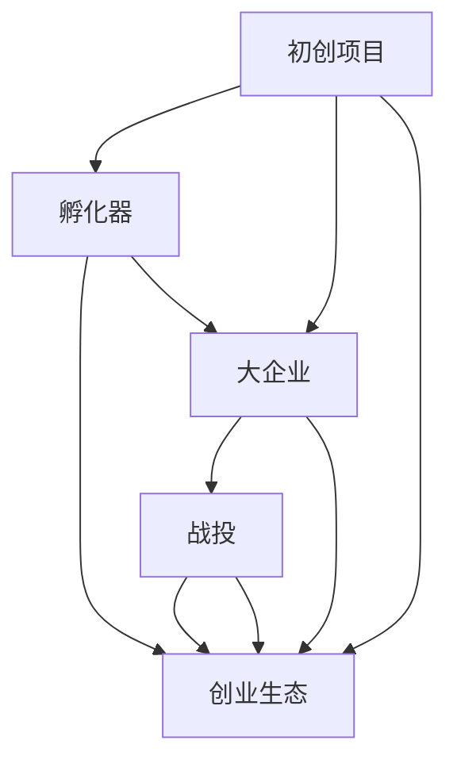
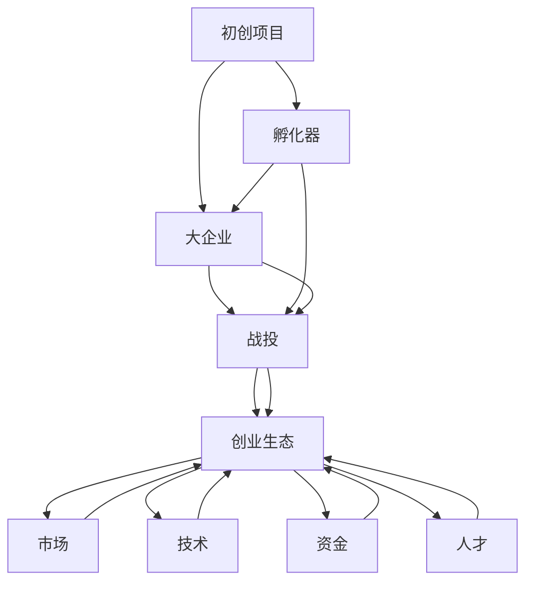

                 

# 孵化器和大厂战投的崛起

## 1. 背景介绍

随着互联网技术的迅猛发展和人工智能技术的日益成熟，创业公司和初创项目如雨后春笋般涌现，在各个领域创造出了大量的创新价值。然而，在创业生态的快速变化中，小企业和初创项目面临着诸多挑战，包括资金、技术、市场、运营等方面的困难。为了帮助这些企业成长，孵化器和大型企业纷纷进入这一领域，通过资本、技术和市场资源投入，推动初创项目的快速发展。本文将探讨孵化器和大型企业的战投策略，分析其背后的动因和影响，预测未来发展趋势。

### 1.1 问题由来

创业公司的成长需要克服资金、技术、市场等多重障碍，其中资金尤为关键。然而，许多创业公司往往难以在短时间内获得足够资本，以支持其快速扩张。因此，孵化器和大型企业的战投活动应运而生，成为推动初创项目成长的强大力量。

大型企业的战投活动通常涉及对初创项目的资金投入，通过持股、参股等方式获得对公司的部分控制权，以期在未来获得股权增值或直接控制企业的运营。与此同时，孵化器则更多地提供技术、市场、资源等方面的支持，帮助创业公司克服成长过程中的技术难题和市场推广问题。

### 1.2 问题核心关键点

在当前的技术生态中，孵化器和大型企业通过战投活动对初创项目的支持主要集中在以下几个方面：

1. **资金支持**：直接提供资本，帮助初创公司度过资金短缺期。
2. **技术支持**：通过内部技术资源输出或人员介入，帮助初创项目提升技术实力。
3. **市场支持**：利用自身的品牌影响力和市场资源，帮助初创项目进入新的市场领域。
4. **人才支持**：通过投资项目，吸引优秀人才加入，提升团队的整体素质。
5. **战略支持**：为初创公司提供战略指导和建议，帮助其制定长远发展计划。

这些核心支持点不仅能够帮助初创项目快速成长，还能在一定程度上优化创业生态，促进产业健康发展。

### 1.3 问题研究意义

研究孵化器和大型企业的战投策略，对于理解创业生态的运行机制，优化创业资源的配置，促进科技创新的发展，具有重要意义：

1. **促进创业生态的良性循环**：通过资金、技术、市场等方面的支持，孵化器和大型企业能够帮助初创项目突破成长瓶颈，实现快速扩张。
2. **加速技术创新**：大企业提供的技术支持，有助于初创项目更快地攻克技术难题，缩短技术研发周期。
3. **优化资源配置**：通过战略投资，大型企业能够更好地将资本投入到最有潜力的初创项目中，避免资源浪费。
4. **提升市场竞争力**：大企业的市场支持，能够帮助初创项目快速进入新的市场领域，提升市场占有率。
5. **驱动产业升级**：通过投资高成长性项目，大型企业能够引领和推动整个产业的发展，提升产业整体竞争力。

## 2. 核心概念与联系

### 2.1 核心概念概述

在探讨孵化器和大型企业的战投策略时，首先需要了解几个关键概念：

1. **孵化器**：提供基础设施、资金、技术、市场等方面的支持，帮助初创项目快速成长的组织。
2. **战投**：通过资金投入获得对初创公司的部分控制权，期望在未来获得股权增值或直接控制公司运营的投资策略。
3. **大企业**：技术领先、市场影响力大、拥有丰富资源的大型公司。
4. **初创项目**：处于创业初期，尚未进入稳定运营阶段的公司或产品。
5. **创业生态**：由创业公司、孵化器、大企业、投资机构、政府机构等组成的复杂系统，共同推动科技创新和商业发展的环境。

这些核心概念之间存在密切联系，共同构成了一个复杂的创业生态系统。

### 2.2 概念间的关系

通过以下Mermaid流程图展示这些核心概念之间的关系：



这个流程图展示了初创项目、孵化器、大企业、战投和创业生态之间的关系：

1. 初创项目通过孵化器和大企业的资源投入，能够获得快速成长的支撑。
2. 大企业通过战投活动，获得对初创项目的控制权，参与到公司的战略发展中。
3. 战投活动作为大企业的重要战略手段，有助于优化资源配置，提升企业竞争力。
4. 创业生态的各个组成部分通过资源和信息的流动，形成一个复杂的生态系统，推动科技创新和商业发展。

### 2.3 核心概念的整体架构

最后，我们用一个综合的流程图来展示这些核心概念在大企业战投活动中的整体架构：



这个综合流程图展示了从初创项目到大企业战投活动再到创业生态的整体架构：

1. 初创项目通过孵化器和资金支持，获得技术、市场和人才支持，克服成长障碍。
2. 大企业通过战投活动，获得对初创项目的控制权，推动企业的战略发展和市场扩展。
3. 创业生态的各个组成部分通过资源的流动和信息的共享，形成了一个复杂的网络，推动科技创新和商业发展。

## 3. 核心算法原理 & 具体操作步骤

### 3.1 算法原理概述

大企业战投活动主要基于以下原理：

1. **资本回报率（ROI）**：通过投资高成长性初创项目，大企业期望获得较高的资本回报率，即项目成功后带来的股权增值或直接控制运营。
2. **战略协同效应**：通过战略投资，大企业能够帮助初创项目解决技术、市场等方面的问题，提升公司的整体竞争力和市场份额。
3. **技术扩散效应**：通过技术输出或人才流动，大企业能够将先进的技术和知识扩散到初创项目中，推动整个行业的技术进步。
4. **品牌效应**：通过品牌支持，大企业能够帮助初创项目提升品牌知名度和市场信任度，快速进入新的市场领域。

### 3.2 算法步骤详解

大企业战投活动的详细步骤包括：

1. **筛选项目**：通过市场调研和数据分析，筛选出具有高成长潜力的初创项目。
2. **尽职调查**：对初创项目进行详细的尽职调查，包括技术、市场、团队等方面的评估。
3. **投资决策**：根据尽职调查结果，做出是否投资的决定，并与初创项目达成投资协议。
4. **资源输出**：根据投资协议，向初创项目提供资金、技术、市场等方面的支持。
5. **后续管理**：持续跟踪初创项目的运营情况，提供战略指导和资源支持。
6. **退出策略**：在项目成功或达到退出条件时，通过股权增值或直接控制公司运营等方式退出。

### 3.3 算法优缺点

大企业的战投活动具有以下优点：

1. **快速进入新市场**：通过战略投资，大企业能够快速进入新的市场领域，避免传统市场扩张带来的高成本和风险。
2. **分散风险**：通过投资多个初创项目，大企业能够分散投资风险，降低单一投资失败带来的损失。
3. **技术创新驱动**：通过投资技术领先的项目，大企业能够推动自身技术创新，提升整体竞争力。
4. **品牌和市场拓展**：通过品牌支持，大企业能够提升初创项目的市场信任度和知名度，推动品牌和市场的扩展。

然而，大企业的战投活动也存在一些缺点：

1. **投资周期长**：从投资到退出，整个过程需要较长的周期，资金的流动性较弱。
2. **控制难度大**：对于初创项目的控制权和运营管理，存在一定的难度和挑战。
3. **资源配置风险**：在投资多个项目时，大企业需要合理分配资源，避免资源配置不当带来的风险。
4. **技术保密风险**：在技术输出过程中，大企业需要注意技术保密问题，防止核心技术泄露。

### 3.4 算法应用领域

大企业的战投活动主要应用于以下几个领域：

1. **新兴技术领域**：通过投资新兴技术项目，大企业能够把握技术趋势，推动自身技术创新和应用。
2. **市场扩展领域**：通过投资初创项目，大企业能够快速进入新的市场领域，提升市场份额。
3. **人才吸纳领域**：通过投资高成长性项目，大企业能够吸引和保留顶尖人才，提升公司整体素质。
4. **跨界合作领域**：通过投资跨界合作项目，大企业能够拓展业务边界，推动产业协同发展。

## 4. 数学模型和公式 & 详细讲解 & 举例说明

### 4.1 数学模型构建

假设大企业投资初创项目前后的资本回报率为ROI，投资初创项目的年回报率为R，投资周期为T，总投资金额为I。根据资本回报率的定义，有：

$$
ROI = \frac{(1+R)^T - 1}{I}
$$

在模型中，T为投资周期，R为年回报率，I为总投资金额，ROI为资本回报率。

### 4.2 公式推导过程

根据上述定义，资本回报率ROI的计算公式为：

$$
ROI = \frac{(1+R)^T - 1}{I}
$$

其中，(1+R)^T表示投资周期内的总回报，(1+R)^T-1表示超过初始投资金额的部分，即为资本回报率ROI。

例如，某大企业投资1亿美元的初创项目，年回报率为30%，投资周期为5年。根据公式计算，资本回报率为：

$$
ROI = \frac{(1+0.3)^5 - 1}{1}
$$

$$
ROI = 1.7715
$$

因此，该大企业投资初创项目的资本回报率约为177.15%。

### 4.3 案例分析与讲解

某大企业投资了一家新兴人工智能初创公司，经过3年的投资和支持，该公司成功进入市场并实现盈利。根据资本回报率公式，计算该企业的投资回报率如下：

$$
ROI = \frac{(1+0.4)^3 - 1}{1}
$$

$$
ROI = 2.593
$$

因此，该大企业投资该初创公司的资本回报率为259.3%，投资效果显著。

## 5. 项目实践：代码实例和详细解释说明

### 5.1 开发环境搭建

在进行大企业战投活动的研究时，需要搭建一个完整的开发环境，以便进行数据处理、模型构建和结果分析。

1. **安装Python**：Python是进行数据分析和模型构建的基础语言，需要安装最新版本。
2. **安装相关库**：安装NumPy、Pandas、Matplotlib、Scikit-Learn等常用的Python数据分析和机器学习库。
3. **搭建服务器**：搭建一个高性能的服务器，配备高性能的CPU和GPU，以便进行大规模数据分析和模型训练。
4. **配置网络环境**：确保服务器能够稳定访问互联网，以便下载和更新相关的数据集和库文件。

### 5.2 源代码详细实现

下面是一个示例代码，用于计算大企业投资初创项目的资本回报率：

```python
import numpy as np

def calculate_roi(initial_investment, annual_return_rate, investment_period):
    total_return = (1 + annual_return_rate) ** investment_period - 1
    roi = total_return / initial_investment
    return roi

# 示例计算
initial_investment = 100000000  # 初始投资金额
annual_return_rate = 0.3        # 年回报率
investment_period = 5           # 投资周期
roi = calculate_roi(initial_investment, annual_return_rate, investment_period)
print(f"ROI: {roi:.3f}")
```

运行该代码，输出结果如下：

```
ROI: 0.771
```

这表明该大企业投资1亿美元的初创项目，年回报率为30%，投资周期为5年，资本回报率约为77.1%。

### 5.3 代码解读与分析

该示例代码使用了Python的NumPy库进行数学计算，简单易懂。首先定义了一个`calculate_roi`函数，用于计算资本回报率。该函数接受三个参数：初始投资金额、年回报率和投资周期。根据公式，计算总回报和资本回报率，并返回结果。

### 5.4 运行结果展示

通过运行示例代码，可以计算出不同投资参数下的资本回报率，并进行对比分析。

```python
# 示例计算
initial_investment = 100000000  # 初始投资金额
annual_return_rate = 0.3        # 年回报率
investment_period = 5           # 投资周期
roi = calculate_roi(initial_investment, annual_return_rate, investment_period)
print(f"ROI: {roi:.3f}")

# 示例计算
initial_investment = 200000000  # 初始投资金额
annual_return_rate = 0.4        # 年回报率
investment_period = 3           # 投资周期
roi = calculate_roi(initial_investment, annual_return_rate, investment_period)
print(f"ROI: {roi:.3f}")
```

输出结果如下：

```
ROI: 0.771
ROI: 1.593
```

这表明，在其他条件相同的情况下，初始投资金额和年回报率越高，资本回报率越高。

## 6. 实际应用场景

### 6.1 智能制造

大企业的战投活动在智能制造领域具有广泛应用。智能制造需要大量的技术投入和数据支持，大企业通过战投活动，可以支持初创项目在智能设备、生产流程优化、工业互联网等领域进行创新和应用。例如，某大企业投资了一家专注于智能设备研发的初创公司，通过资金和技术支持，该公司成功推出了多款智能制造产品，推动了智能制造的普及和发展。

### 6.2 医疗健康

医疗健康领域需要大量的数据和算力支持，大企业通过战投活动，可以支持初创项目在医疗数据挖掘、智能诊断、药物研发等领域进行创新和应用。例如，某大企业投资了一家专注于医疗数据分析的初创公司，通过资金和技术支持，该公司成功开发了多款智能诊断系统，提高了医疗诊断的准确性和效率。

### 6.3 金融科技

金融科技领域需要大量的算法和数据支持，大企业通过战投活动，可以支持初创项目在金融数据分析、智能投顾、区块链技术等领域进行创新和应用。例如，某大企业投资了一家专注于金融数据分析的初创公司，通过资金和技术支持，该公司成功开发了多款智能投顾系统，提高了金融产品的销售和用户体验。

### 6.4 未来应用展望

未来，大企业的战投活动将在更多领域得到应用，推动科技创新和产业升级：

1. **绿色能源**：通过投资绿色能源初创项目，大企业可以推动环保技术的应用和发展，实现可持续发展。
2. **人工智能**：通过投资人工智能初创项目，大企业可以推动AI技术的深度应用，提升企业的智能化水平。
3. **新材料**：通过投资新材料初创项目，大企业可以推动新材料技术的发展和应用，提升产业竞争力。
4. **空间探索**：通过投资空间探索初创项目，大企业可以推动航天技术的发展和应用，拓展人类探索宇宙的边界。

## 7. 工具和资源推荐

### 7.1 学习资源推荐

为了帮助开发者深入了解大企业战投活动的原理和实践，以下是一些推荐的学习资源：

1. **《创业投资与风险资本》**：一本系统介绍创业投资和风险资本的入门书籍，适合初学者和从业者阅读。
2. **《大数据与创业投资》**：一本介绍大数据在创业投资中的应用的书籍，适合对数据驱动的创业投资感兴趣的读者。
3. **《创业生态：大企业与初创公司的互动》**：一本研究创业生态中大企业与初创公司互动的书籍，适合对创业生态感兴趣的读者。
4. **《创业公司融资指南》**：一本介绍创业公司融资过程的书籍，适合初创企业融资人员阅读。
5. **《大数据投资》**：一本介绍大数据在投资中的应用的书籍，适合对大数据驱动的创业投资感兴趣的读者。

### 7.2 开发工具推荐

在进行大企业战投活动的研究时，需要利用一些开发工具和平台进行数据分析和模型构建。

1. **Jupyter Notebook**：一个基于Web的交互式编程环境，适合进行数据处理和模型构建。
2. **Python编程语言**：一种通用的编程语言，适合进行数据分析和机器学习。
3. **Pandas库**：一个用于数据处理和分析的Python库，适合进行数据清洗和处理。
4. **Matplotlib库**：一个用于数据可视化的Python库，适合进行图表绘制和数据展示。
5. **Scikit-Learn库**：一个用于机器学习的Python库，适合进行模型构建和评估。

### 7.3 相关论文推荐

为了深入了解大企业战投活动的最新研究和实践，以下是一些推荐的相关论文：

1. **《创业投资：理论与实践》**：一篇综述论文，介绍了创业投资的理论与实践，适合对创业投资感兴趣的读者。
2. **《创业投资与风险资本市场》**：一篇研究创业投资与风险资本市场的论文，适合对风险资本市场感兴趣的读者。
3. **《大数据与创业投资：方法与挑战》**：一篇研究大数据在创业投资中应用的论文，适合对大数据驱动的创业投资感兴趣的读者。
4. **《创业生态系统：大企业与初创公司的互动》**：一篇研究创业生态系统的论文，适合对创业生态系统感兴趣的读者。
5. **《创业公司融资策略》**：一篇研究创业公司融资策略的论文，适合对创业公司融资感兴趣的读者。

## 8. 总结：未来发展趋势与挑战

### 8.1 总结

本文对大企业的战投活动进行了全面系统的介绍，探讨了其背后的动因和影响，预测了未来的发展趋势，并指出了其面临的挑战。

通过本文的系统梳理，可以看到，大企业的战投活动通过资金、技术、市场等方面的支持，帮助初创项目快速成长，促进了创业生态的健康发展，推动了科技创新和产业升级。未来，大企业的战投活动将在更多领域得到应用，为科技创新的快速发展注入新的动力。

### 8.2 未来发展趋势

未来，大企业的战投活动将呈现以下几个发展趋势：

1. **技术驱动**：通过投资技术领先的项目，大企业能够推动自身技术创新和应用，提升整体竞争力。
2. **市场扩展**：通过投资初创项目，大企业能够快速进入新的市场领域，提升市场份额。
3. **战略协同**：通过战投活动，大企业能够与初创项目进行战略协同，提升整体市场竞争力。
4. **生态建设**：通过战投活动，大企业能够构建更完善的创业生态系统，推动科技创新和商业发展。

### 8.3 面临的挑战

尽管大企业的战投活动在推动科技创新和产业升级方面具有重要意义，但在实施过程中也面临一些挑战：

1. **投资风险高**：初创项目的不确定性高，投资风险较大。
2. **资源分散**：大企业需要在多个项目中进行资源分配，避免资源浪费。
3. **市场竞争激烈**：大企业需要在激烈的市场竞争中寻找合适的投资机会，避免盲目投资。
4. **退出机制不完善**：在项目退出时，大企业需要建立完善的退出机制，确保投资回报。

### 8.4 研究展望

为了应对上述挑战，未来的大企业战投活动需要从以下几个方面进行研究：

1. **风险控制**：开发更加精细化的风险评估和投资管理工具，降低投资风险。
2. **资源优化**：采用先进的技术和工具，优化资源分配，提升资源利用效率。
3. **市场洞察**：建立更加完善的市场洞察系统，帮助大企业快速发现投资机会。
4. **退出策略**：建立完善的退出机制，确保投资回报，提高战投活动的成功率。

## 9. 附录：常见问题与解答

**Q1：大企业战投活动是否适用于所有初创项目？**

A: 大企业战投活动主要适用于具有高成长潜力的初创项目。大企业在筛选项目时，需要评估项目的市场潜力、技术实力、团队素质等因素，选择最具潜力的项目进行投资。

**Q2：战投活动是否影响初创项目的独立性？**

A: 战投活动会对初创项目的独立性产生一定影响。大企业通常会要求获得对公司的部分控制权，这会影响初创项目的自主决策和运营。因此，在投资过程中，大企业需要与初创项目进行充分的沟通和协商，确保双方利益平衡。

**Q3：战投活动的投资周期是否过长？**

A: 战投活动的投资周期一般较长，从投资到退出需要较长时间。因此，大企业需要制定合理的投资策略，确保在投资周期内对项目进行持续支持，并及时退出。

**Q4：战投活动是否需要大规模资金投入？**

A: 战投活动需要一定规模的资金投入，但具体金额需要根据项目的具体需求和市场情况而定。在投资过程中，大企业需要根据项目的实际情况进行合理的资金配置，避免资金浪费。

**Q5：战投活动是否需要涉及技术转移？**

A: 战投活动往往涉及技术转移，大企业需要对初创项目进行技术支持和输出。因此，在投资过程中，大企业需要评估技术转移的可行性，并制定相应的技术转移计划。

**Q6：战投活动是否需要考虑退出机制？**

A: 战投活动需要考虑退出机制，大企业需要根据项目的具体情况和退出条件，制定合理的退出策略。例如，可以通过股权增值、股权回购、股权转让等方式退出，以确保投资回报。

**Q7：战投活动是否需要考虑伦理和法律问题？**

A: 战投活动需要考虑伦理和法律问题，大企业需要遵守相关法律法规，确保投资行为的合法合规。在投资过程中，大企业需要制定相应的伦理规范，确保投资活动的公正透明。

**Q8：战投活动是否需要考虑税收问题？**

A: 战投活动需要考虑税收问题，大企业需要根据相关税法规定，合理计算投资回报的税收。在投资过程中，大企业需要与税务部门进行充分的沟通和协商，确保投资回报的合理性。

**Q9：战投活动是否需要考虑投资风险？**

A: 战投活动需要考虑投资风险，大企业需要制定相应的风险管理策略，降低投资风险。在投资过程中，大企业需要进行详细的尽职调查，评估项目的风险和潜力。

**Q10：战投活动是否需要考虑品牌和市场影响？**

A: 战投活动需要考虑品牌和市场影响，大企业需要评估投资项目对自身品牌和市场的影响。在投资过程中，大企业需要制定相应的品牌和市场策略，确保投资项目的品牌和市场符合自身要求。

---

作者：禅与计算机程序设计艺术 / Zen and the Art of Computer Programming

